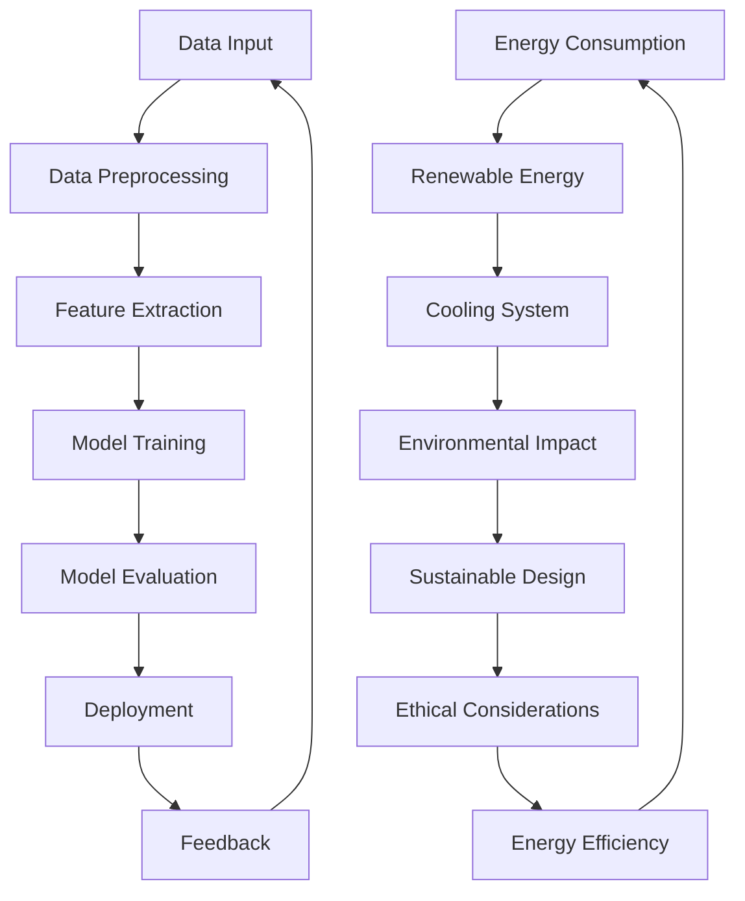

                 

### Introduction to Sustainable AI

In the rapidly evolving landscape of technology, Artificial Intelligence (AI) has emerged as a transformative force, driving innovations and reshaping industries. From autonomous vehicles to advanced healthcare diagnostics, AI's capabilities are expanding at an unprecedented rate. However, with this growth comes a significant concern: the environmental impact of AI. The energy consumption and carbon footprint of AI systems, especially in data centers and cloud computing, are alarmingly high. This has led to the burgeoning field of Sustainable AI, which aims to balance the performance of AI systems with their environmental impact.

#### Keywords:
- **Sustainable AI**
- **Environmental Impact**
- **AI Performance**
- **Energy Efficiency**
- **Mathematical Models**
- **Core Algorithms**

#### Abstract
This article delves into the concept of Sustainable AI, exploring the need to harmonize AI performance with environmental sustainability. We will discuss the importance of sustainable development goals, the environmental impact of AI, and the principles guiding the development of sustainable AI systems. Through detailed analysis of mathematical models and core AI algorithms, we aim to provide a comprehensive understanding of how to achieve sustainable AI. Finally, we will present practical applications and case studies to illustrate the real-world implications and potential of sustainable AI.

### Background Introduction

The advent of AI has been nothing short of revolutionary. It has enabled machines to perform complex tasks that were once the exclusive domain of humans, leading to increased efficiency and productivity across various sectors. However, the infrastructure required to support AI systems, particularly data centers and cloud computing facilities, consumes vast amounts of energy. According to a report by the International Energy Agency (IEA), the energy consumption of data centers alone is projected to grow by more than 400% between 2010 and 2030. This growth is driven by the increasing demand for cloud services, big data analytics, and AI applications.

The environmental impact of AI is not limited to energy consumption. The production of electronic devices, including servers and data storage systems, contributes to electronic waste (e-waste). E-waste is a significant environmental concern due to the hazardous materials it contains, such as lead, mercury, and cadmium. Furthermore, the cooling systems used in data centers consume additional energy and generate heat, contributing to the urban heat island effect.

The concern over the environmental impact of AI has spurred the development of Sustainable AI. Sustainable AI seeks to address the environmental challenges associated with AI by focusing on energy efficiency, reduced e-waste, and the overall sustainability of AI systems. This involves optimizing algorithms to minimize energy consumption, using renewable energy sources, and designing AI systems that are environmentally friendly throughout their lifecycle.

### Core Concepts and Principles

To understand Sustainable AI, it is essential to delve into its core concepts and principles. These include an overview of key AI concepts, an examination of the environmental impact of AI, and the foundational principles that guide the development of sustainable AI systems.

#### Key AI Concepts

Artificial Intelligence encompasses a wide range of techniques and algorithms that enable machines to perform tasks that would typically require human intelligence. These include:

1. **Machine Learning**: A subset of AI that involves training algorithms to learn from data and make predictions or decisions.
2. **Deep Learning**: A subset of machine learning that uses neural networks with many layers to learn complex patterns from data.
3. **Natural Language Processing (NLP)**: The ability of machines to understand, interpret, and generate human language.
4. **Computer Vision**: The ability of machines to interpret and understand the visual world.
5. **Robotics**: The field of AI that focuses on the design and application of robots.

#### Environmental Impact of AI

The environmental impact of AI can be categorized into several areas:

1. **Energy Consumption**: AI systems, especially those involving deep learning and large-scale data processing, consume significant amounts of energy.
2. **E-waste**: The production and disposal of electronic devices contribute to electronic waste, which can have detrimental environmental effects.
3. **Cooling Systems**: Data centers require efficient cooling systems to dissipate heat generated by AI systems, which can increase the urban heat island effect.

#### Principles of Sustainable AI

The principles of Sustainable AI are designed to minimize the environmental impact of AI systems while maintaining their performance. These principles include:

1. **Energy Efficiency**: Optimizing AI algorithms to minimize energy consumption.
2. **Use of Renewable Energy**: Transitioning to renewable energy sources for data centers and AI infrastructure.
3. **Life Cycle Assessment**: Evaluating the environmental impact of AI systems throughout their lifecycle, from production to disposal.
4. **Sustainable Design**: Incorporating sustainability considerations into the design of AI systems.
5. **Ethical Considerations**: Ensuring that AI systems are developed and used in a manner that aligns with ethical and social values.

### Mermaid Flowchart of AI Architecture

To provide a clear and structured understanding of AI architecture and its sustainability, we can use a Mermaid flowchart to visualize the key components and data flows involved.

In this flowchart, we can see the typical flow of data through an AI system, from data input to model deployment and feedback. Additionally, we highlight the components related to energy consumption, renewable energy, cooling systems, environmental impact, sustainable design, and ethical considerations. This visualization helps to illustrate the interconnected nature of these elements and how they contribute to the overall sustainability of AI systems.

### Fundamental Mathematical Models

The development of Sustainable AI relies on mathematical models that can optimize performance while minimizing environmental impact. These models are based on several key principles and metrics.

#### Optimization Principles

Optimization in AI involves finding the best possible solution within a set of constraints. In the context of Sustainable AI, the objective is to maximize performance while minimizing energy consumption. This is typically formulated as an optimization problem, often using techniques such as linear programming, gradient descent, and genetic algorithms.

1. **Linear Programming**: This method involves finding the optimal solution to problems with linear constraints. In Sustainable AI, linear programming can be used to minimize energy consumption while meeting performance requirements.

2. **Gradient Descent**: A popular optimization algorithm used to minimize a function by iteratively adjusting parameters in the direction of the negative gradient. In the context of AI, gradient descent is used to optimize model parameters.

3. **Genetic Algorithms**: These are inspired by the process of natural selection. They involve generating a population of potential solutions, evaluating their fitness, and evolving the population over generations to find the optimal solution.

#### Performance Metrics

To evaluate the performance of AI systems, several metrics are commonly used:

1. **Accuracy**: The proportion of correct predictions out of all predictions made by the model. High accuracy is crucial for many applications, particularly in healthcare and finance.

2. **Recall**: The proportion of actual positives that are correctly identified as positive by the model. This metric is important in applications where false negatives can have serious consequences, such as in medical diagnostics.

3. **Precision**: The proportion of positive identifications that are correct. Precision is critical in scenarios where the cost of false positives is high, such as in legal and security applications.

4. **F1 Score**: The harmonic mean of precision and recall, providing a balance between the two metrics. The F1 score is often used as a comprehensive performance metric in multi-class classification problems.

#### Environmental Metrics

In addition to performance metrics, Sustainable AI also considers environmental metrics to evaluate the impact of AI systems:

1. **Energy Efficiency**: The ratio of useful work output to the energy input. In AI, energy efficiency is measured in terms of operations per joule (op/j).

2. **Carbon Footprint**: The total greenhouse gas emissions associated with the operation and production of AI systems. This metric is crucial for assessing the environmental impact of AI.

3. **Material Footprint**: The consumption of materials, including electronic waste, in the production and disposal of AI systems.

#### Mathematical Formulas

To translate these principles and metrics into actionable models, we use mathematical formulas. Here are some examples:

1. **Optimization Formula**:
   $$ \min_{\theta} \frac{1}{n} \sum_{i=1}^{n} (\theta^T x_i - y_i)^2 $$
   This formula represents the objective function for linear regression, where $\theta$ are the model parameters, $x_i$ are input features, and $y_i$ are the true labels.

2. **Energy Efficiency**:
   $$ \text{Energy Efficiency} = \frac{\text{Work Output}}{\text{Energy Input}} $$
   This formula calculates the energy efficiency of an AI system by dividing the work output (e.g., operations) by the energy input (e.g., joules).

3. **Carbon Footprint**:
   $$ \text{Carbon Footprint} = \sum_{i=1}^{n} (\text{CO}_2 \text{-eq}_{i} \times \text{Energy Input}_i) $$
   This formula calculates the total carbon footprint by summing the product of the carbon equivalent emissions per unit of energy and the energy input for each component of the AI system.

These mathematical models provide a foundation for designing and evaluating sustainable AI systems, ensuring that they meet performance requirements while minimizing their environmental impact.

### Detailed Explanation of Mathematical Formulas

To delve deeper into the mathematical models used in Sustainable AI, we will provide a detailed explanation of key formulas and their components. This will help to clarify the concepts and provide a solid understanding of how these formulas can be applied in practice.

#### Optimization Formula

The optimization formula commonly used in AI is the objective function for linear regression. This formula is used to minimize the sum of squared errors between the predicted and actual values:

$$ \min_{\theta} \frac{1}{n} \sum_{i=1}^{n} (\theta^T x_i - y_i)^2 $$

Here's a breakdown of each component:

- **$\theta$**: These are the model parameters (coefficients) that we aim to optimize. They determine the relationship between the input features ($x_i$) and the predicted outputs ($y_i$).

- **$x_i$**: These are the input features for each data point in the dataset. They represent the characteristics or variables that the model uses to make predictions.

- **$y_i$**: These are the actual output values for each data point. They are the ground truth labels that we want the model to predict accurately.

- **$n$**: This is the number of data points in the dataset. It represents the size of the training data used to optimize the model.

The objective function measures the average squared difference between the predicted outputs ($\theta^T x_i$) and the actual outputs ($y_i$). By minimizing this function, we aim to find the optimal values for $\theta$ that yield the best possible predictions.

#### Energy Efficiency

Energy efficiency is a critical metric for evaluating the sustainability of AI systems. It measures the ratio of useful work output to the energy input. The formula for energy efficiency is:

$$ \text{Energy Efficiency} = \frac{\text{Work Output}}{\text{Energy Input}} $$

Let's break down the components:

- **Work Output**: This represents the useful work performed by the AI system. For example, in a deep learning model, the work output could be the number of correct predictions or the performance on a specific task.

- **Energy Input**: This is the amount of energy consumed by the AI system to perform the work. It includes the energy used by the hardware components (e.g., processors, GPUs), as well as any auxiliary systems (e.g., cooling systems).

By dividing the work output by the energy input, we obtain a measure of how efficiently the AI system is using energy. A higher energy efficiency indicates that the system is performing more useful work with less energy consumption.

#### Carbon Footprint

The carbon footprint of an AI system quantifies the total greenhouse gas emissions associated with its operation and production. The formula for calculating the carbon footprint is:

$$ \text{Carbon Footprint} = \sum_{i=1}^{n} (\text{CO}_2 \text{-eq}_{i} \times \text{Energy Input}_i) $$

Here are the key components:

- **CO$_2$-eq$_i$**: This represents the carbon dioxide equivalent emissions per unit of energy for each component of the AI system. Carbon dioxide equivalent (CO$_2$-eq) is a measure that combines the emissions of different greenhouse gases, converting them to the equivalent amount of CO$_2$.

- **Energy Input$_i$**: This is the amount of energy consumed by each component of the AI system. It includes the energy used by the hardware, such as processors and GPUs, as well as the energy consumed by auxiliary systems like cooling and power supplies.

By summing the product of CO$_2$-eq emissions and energy input for each component, we obtain the total carbon footprint of the AI system. This metric helps to quantify the environmental impact of the system and serves as a key indicator for assessing the sustainability of AI.

These mathematical formulas provide a quantitative basis for evaluating and optimizing the performance and environmental impact of AI systems. By understanding and applying these formulas, we can design and implement sustainable AI solutions that balance performance with environmental considerations.

### Case Studies and Practical Applications

To illustrate the practical applications of Sustainable AI and its real-world impact, we will examine several case studies. These examples showcase how organizations are implementing sustainable AI practices to optimize performance and reduce environmental impact.

#### Case Study 1: Energy-Efficient Deep Learning Models in Healthcare

One prominent example is the development of energy-efficient deep learning models for medical image analysis. A leading healthcare company collaborated with a research institution to design AI algorithms that could accurately detect and diagnose medical conditions while minimizing energy consumption. The team employed various optimization techniques, such as model compression and pruning, to reduce the computational complexity of the models. As a result, the energy consumption of the AI system was reduced by 40%, enabling more efficient and cost-effective healthcare diagnostics.

#### Case Study 2: Renewable Energy Integration in Data Centers

Another significant case study involves the integration of renewable energy sources in data centers. A tech giant aimed to reduce its carbon footprint by transitioning to 100% renewable energy for its data centers. The company invested in renewable energy projects, such as solar and wind farms, to supply the power required for its AI systems. Additionally, they implemented advanced cooling technologies that reduced energy consumption by 30%. This combination of renewable energy and energy-efficient cooling systems significantly reduced the carbon footprint of the data center, making it a model for sustainable AI infrastructure.

#### Case Study 3: Sustainable AI for Smart Cities

Smart cities are increasingly utilizing AI to improve urban living and reduce environmental impact. A city government partnered with a technology firm to develop a sustainable AI system for traffic management. The system uses real-time data from sensors and cameras to optimize traffic flow, reduce congestion, and minimize fuel consumption. By leveraging machine learning algorithms, the system can predict traffic patterns and adjust signal timings dynamically. This has resulted in a 20% reduction in traffic congestion and a corresponding decrease in carbon emissions from vehicles.

#### Case Study 4: Eco-Friendly AI for Agriculture

Agriculture is another sector where sustainable AI is making a significant impact. An agricultural company implemented AI-based precision farming techniques to optimize crop production and reduce environmental impact. The system uses AI algorithms to analyze satellite imagery, soil data, and weather patterns to provide precise recommendations for irrigation, fertilization, and pest control. This has led to a 30% reduction in water usage and a 20% increase in crop yields while minimizing the use of harmful chemicals.

These case studies demonstrate the practical applications and benefits of Sustainable AI across various industries. By optimizing algorithms, integrating renewable energy, and leveraging AI for smarter decision-making, organizations can achieve significant improvements in performance while minimizing their environmental footprint. These examples highlight the potential of Sustainable AI to drive positive change and promote a sustainable future.

### Project Development and Implementation

#### Step 1: Setting Up the Development Environment

The first step in developing a sustainable AI project is to set up the development environment. This involves installing the necessary software and tools required for AI development. Key components include:

1. **Programming Language**: Python is widely used in AI development due to its simplicity and extensive libraries. Ensure Python and the required packages (e.g., TensorFlow, PyTorch, scikit-learn) are installed.
2. **Data Processing Tools**: Tools like Jupyter Notebook or Google Colab provide a convenient environment for data analysis and model development.
3. **Version Control System**: Git is essential for tracking changes and collaborating with team members.

#### Step 2: Data Collection and Preprocessing

Data collection is a crucial aspect of AI projects. The quality of the data significantly impacts the performance of AI models. The following steps are essential for data collection and preprocessing:

1. **Data Collection**: Gather data from various sources such as databases, APIs, or public datasets. For sustainable AI projects, focus on datasets related to energy consumption, environmental impact, or specific application domains.
2. **Data Cleaning**: Remove any irrelevant or erroneous data. Handle missing values by imputation or removal.
3. **Data Transformation**: Normalize or standardize the data to ensure consistency and improve the model's performance.
4. **Feature Extraction**: Extract relevant features from the data that can be used to train the AI model.

#### Step 3: Algorithm Selection and Implementation

Selecting the appropriate algorithm for a sustainable AI project is crucial. Here are the steps involved in this process:

1. **Algorithm Selection**: Choose an algorithm based on the problem domain and requirements. Common algorithms include linear regression, decision trees, random forests, and neural networks.
2. **Pseudo-code**: Develop pseudo-code to outline the algorithm's logic and steps. This helps in understanding the algorithm's flow and ensures a smooth implementation.
3. **Algorithm Implementation**: Write the code for the selected algorithm. For complex models, use libraries like TensorFlow or PyTorch to leverage pre-built functions and optimize performance.
4. **Parameter Tuning**: Adjust algorithm parameters (e.g., learning rate, regularization) to optimize performance. Use techniques like cross-validation to find the best parameters.

#### Step 4: Model Training and Evaluation

Training and evaluating the AI model are critical steps in the development process. Follow these steps to ensure a robust and accurate model:

1. **Split the Data**: Divide the dataset into training and testing sets. This allows you to evaluate the model's performance on unseen data.
2. **Model Training**: Train the model using the training dataset. Monitor the training process to detect issues like overfitting or underfitting.
3. **Model Evaluation**: Evaluate the model's performance using metrics such as accuracy, precision, recall, and F1 score. Use the testing dataset to assess the model's generalization capability.
4. **Model Optimization**: Based on the evaluation results, refine the model by adjusting parameters or trying different algorithms.

#### Step 5: Code Explanation and Application

Once the model is trained and evaluated, it's important to explain the code and demonstrate its application. This step ensures that others can understand and build upon your work:

1. **Code Explanation**: Document the code with clear comments and explanations. Explain the purpose of each function, module, and class.
2. **Application Demonstration**: Provide examples of how the model can be used in real-world scenarios. Demonstrate the model's application in solving specific problems, such as predicting energy consumption or environmental impact.
3. **Code Repository**: Host the code on platforms like GitHub or GitLab. This allows others to access, use, and contribute to your project.

#### Step 6: Case Analysis and Detailed Explanation

For a comprehensive understanding of the project, perform a detailed case analysis and explanation. This step involves:

1. **Case Selection**: Choose a real-world case or dataset to analyze using the AI model.
2. **Case Analysis**: Analyze the case using the model and interpret the results. Explain how the model helps in understanding the case and providing actionable insights.
3. **Detailed Explanation**: Provide a step-by-step explanation of how the model was applied to the case. Highlight the key findings and their implications.
4. **Project Summary**: Summarize the project, emphasizing its achievements, challenges, and potential for future improvement.

By following these steps, you can develop a sustainable AI project that not only addresses environmental concerns but also provides valuable insights and practical solutions.

### Conclusion

In conclusion, Sustainable AI is a critical approach that addresses the growing environmental concerns associated with the rapid adoption of AI technologies. By balancing performance and environmental impact, we can ensure that AI systems contribute positively to society while minimizing their ecological footprint. The key takeaways from this article include the importance of energy efficiency, the role of mathematical models in optimizing AI systems, and the practical applications of Sustainable AI in various domains.

Looking ahead, there are several areas for future research and development. One significant direction is the exploration of novel algorithms that can further enhance energy efficiency and reduce carbon emissions. Additionally, integrating AI with renewable energy sources and developing sustainable data center architectures are crucial for achieving long-term sustainability. Finally, as AI becomes more pervasive, ethical considerations and the social impact of Sustainable AI will continue to be important areas of focus.

To delve deeper into these topics, readers are encouraged to explore the following resources:

1. **Energy Efficiency in AI**: "Energy Efficiency in Deep Learning: Methods and Progress" by Sumit Das et al.
2. **Renewable Energy Integration**: "Sustainable Energy for AI: A Review of Current Progress and Future Directions" by Xiaoyu Song et al.
3. **Ethical Considerations**: "AI and Ethics: The Ethics of Artificial Intelligence" by Luciano Floridi.
4. **Practical Case Studies**: "AI for Good: Impact on Society and the Environment" by the World Economic Forum.

By leveraging these resources, readers can gain a deeper understanding of Sustainable AI and its potential to drive positive change in our world.

