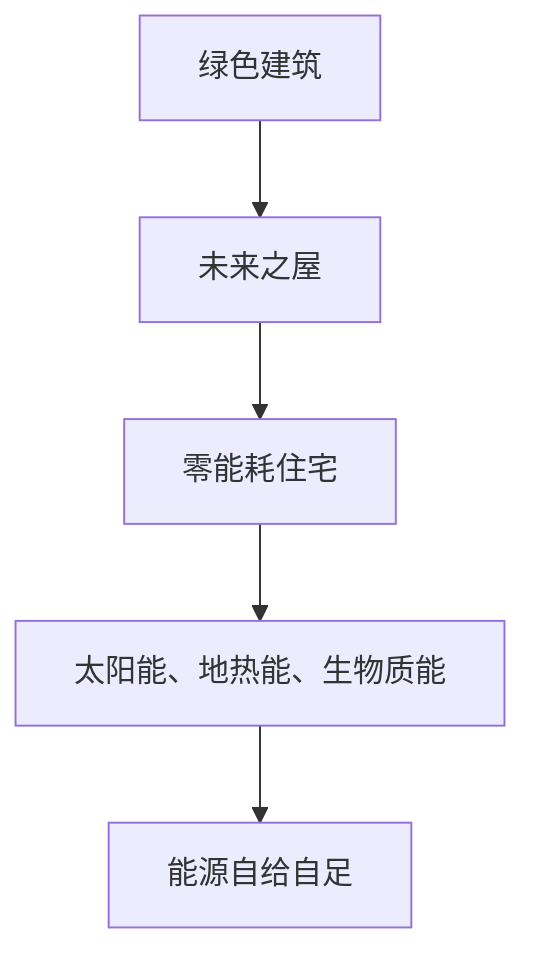
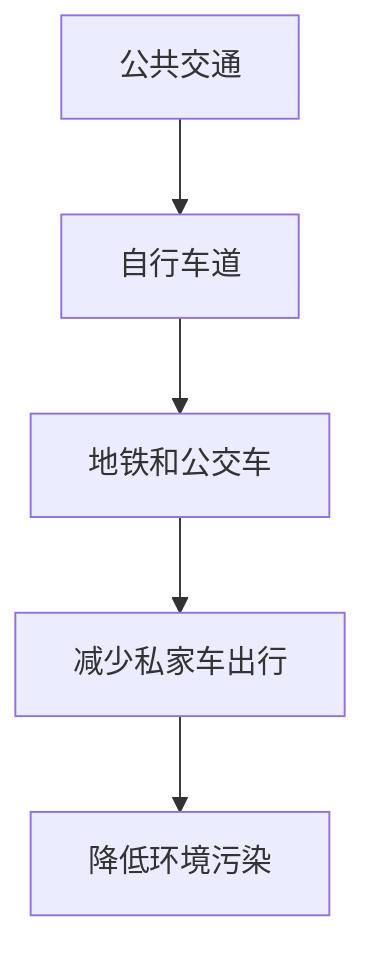
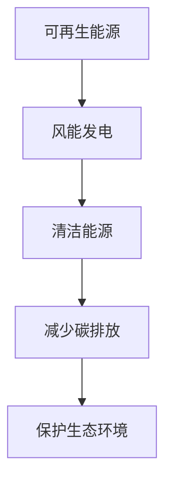
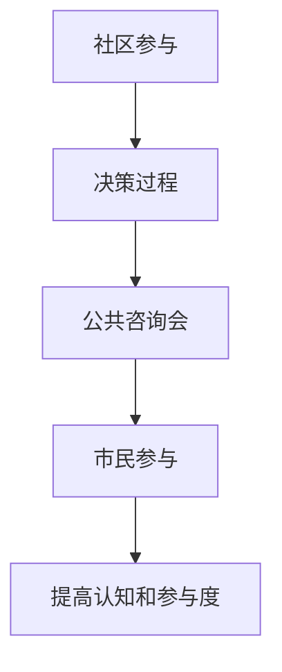
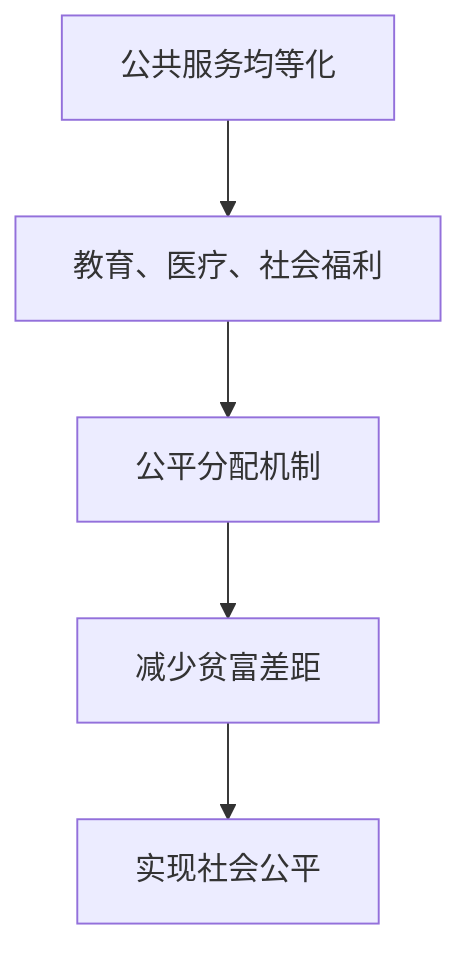
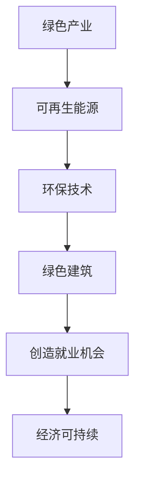

                 

## 文章标题

### 可持续乌托邦设计：理想社会的实验蓝图

## 文章关键词

- 理想社会
- 可持续发展
- 生态平衡
- 社会公平
- 经济可持续
- 实验案例

## 文章摘要

本文探讨了可持续乌托邦设计的概念和原则，以及其实验案例中的实践与挑战。通过分析国外的可持续乌托邦实验案例和我国的探索，本文试图揭示可持续乌托邦设计的关键要素，并为未来可持续发展的社会提供启示。

---

## 目录大纲设计过程

### 1. 确定核心章节

在《可持续乌托邦设计：理想社会的实验蓝图》这个主题下，我们将文章结构分为三个主要部分：

1. **可持续乌托邦设计概述**
2. **可持续乌托邦的实验案例**
3. **可持续乌托邦的挑战与展望**

### 2. 确定每个章节的核心内容

#### 可持续乌托邦设计概述

- **1.1** 定义与背景：阐述可持续乌托邦的概念、起源和背景。
- **1.2** 设计原则：介绍可持续乌托邦的核心原则，如生态平衡、社会公平和经济可持续。
- **1.3** 发展历史：回顾可持续乌托邦的设计理念在不同历史时期的发展。

#### 可持续乌托邦的实验案例

- **2.1** 国外案例：分析丹麦的哥本哈根和荷兰的埃因霍温等国的可持续乌托邦实践。
- **2.2** 国内案例：探讨福建省三明市和浙江省安吉县等地的可持续乌托邦探索。
- **2.3** 案例分析与启示：从案例中提取经验和教训，为其他地区提供参考。

#### 可持续乌托邦的挑战与展望

- **3.1** 面临的挑战：分析可持续乌托邦在生态、社会和经济方面的挑战。
- **3.2** 未来展望：探讨可持续乌托邦的未来发展趋势和可能面临的机遇。
- **3.3** 对我国的启示：总结可持续乌托邦设计对我国的启示和借鉴意义。

### 3. 加入附录与参考文献

在文章末尾，将添加附录和参考文献，为读者提供进一步的学习和研究资源。

### 4. 设计流程图与数学公式

在每个章节中，根据需要设计流程图和数学公式，以增强文章的阐述力和可读性。

### 5. 确保完整性

在保持文章完整性的同时，注意控制字数在 8000～12000 字左右，确保每个章节的内容丰富、详细且具有实际价值。

### 6. 使用Markdown格式

文章内容将使用Markdown格式进行排版，以确保文章的可读性和美观性。

---

通过以上步骤，我们将确保文章的逻辑清晰、结构紧凑、简单易懂，并能够为读者提供有价值的技术见解和分析。

---

## 文章标题

### 可持续乌托邦设计：理想社会的实验蓝图

## 文章关键词

- 理想社会
- 可持续发展
- 生态平衡
- 社会公平
- 经济可持续
- 实验案例

## 文章摘要

本文将探讨可持续乌托邦设计的概念、核心原则以及其实验案例。首先，我们将介绍可持续乌托邦的定义和起源，接着分析其核心原则，包括生态平衡、社会公平和经济可持续。然后，我们将通过国内外案例展示可持续乌托邦的实践，并探讨其面临的挑战和未来展望。最后，我们将总结对我国的启示和借鉴意义，为我国可持续乌托邦设计提供参考。

---

## 目录大纲设计过程

### 1. 确定核心章节

在《可持续乌托邦设计：理想社会的实验蓝图》这个主题下，我们将文章结构分为三个主要部分：

1. **可持续乌托邦设计概述**
2. **可持续乌托邦的实验案例**
3. **可持续乌托邦的挑战与展望**

### 2. 确定每个章节的核心内容

#### 可持续乌托邦设计概述

- **1.1** 定义与背景：阐述可持续乌托邦的概念、起源和背景。
- **1.2** 设计原则：介绍可持续乌托邦的核心原则，如生态平衡、社会公平和经济可持续。
- **1.3** 发展历史：回顾可持续乌托邦的设计理念在不同历史时期的发展。

#### 可持续乌托邦的实验案例

- **2.1** 国外案例：分析丹麦的哥本哈根和荷兰的埃因霍温等国的可持续乌托邦实践。
- **2.2** 国内案例：探讨福建省三明市和浙江省安吉县等地的可持续乌托邦探索。
- **2.3** 案例分析与启示：从案例中提取经验和教训，为其他地区提供参考。

#### 可持续乌托邦的挑战与展望

- **3.1** 面临的挑战：分析可持续乌托邦在生态、社会和经济方面的挑战。
- **3.2** 未来展望：探讨可持续乌托邦的未来发展趋势和可能面临的机遇。
- **3.3** 对我国的启示：总结可持续乌托邦设计对我国的启示和借鉴意义。

### 3. 加入附录与参考文献

在文章末尾，将添加附录和参考文献，为读者提供进一步的学习和研究资源。

### 4. 设计流程图与数学公式

在每个章节中，根据需要设计流程图和数学公式，以增强文章的阐述力和可读性。

### 5. 确保完整性

在保持文章完整性的同时，注意控制字数在 8000～12000 字左右，确保每个章节的内容丰富、详细且具有实际价值。

### 6. 使用Markdown格式

文章内容将使用Markdown格式进行排版，以确保文章的可读性和美观性。

---

通过以上步骤，我们将确保文章的逻辑清晰、结构紧凑、简单易懂，并能够为读者提供有价值的技术见解和分析。同时，我们将使用Markdown格式，以增强文章的可读性和美观性。接下来，我们将详细展开每个章节的内容。首先，从可持续乌托邦的定义与背景开始。

## 第一部分：可持续乌托邦设计概述

### 第1章：可持续乌托邦的定义与背景

在探讨可持续乌托邦设计的概念之前，我们首先需要理解什么是乌托邦。乌托邦（Utopia）一词源自希腊语，意为“没有的地方”或“理想国”。在文学和哲学中，乌托邦通常被描绘为一个完美无缺的理想社会，具有高度的社会和谐、生态平衡和经济繁荣。

### 1.1 可持续乌托邦的概念

可持续乌托邦（Sustainable Utopia）是在乌托邦的基础上引入了可持续发展的理念。可持续发展强调满足当前需求而不损害后代满足自身需求的能力。因此，可持续乌托邦不仅追求社会和谐与公平，还要关注生态保护和经济发展。

### 1.2 起源与发展

可持续乌托邦的概念可以追溯到20世纪60年代，当时环境运动和反文化运动兴起，推动了人们对可持续发展的关注。1987年，联合国世界环境与发展委员会发布了《我们共同的未来》报告，首次提出了可持续发展的概念，并引发了全球范围内的讨论。

### 1.3 核心原则

可持续乌托邦的核心原则包括生态平衡、社会公平和经济可持续。

#### 1.3.1 生态平衡

生态平衡是指生物群落的各个组成部分之间保持稳定和和谐的关系。在可持续乌托邦设计中，生态平衡是实现可持续发展的基础。例如，哥本哈根的可持续城市实践就体现了生态平衡的理念，通过绿色建筑、公共交通和可再生能源的使用来减少环境负担。

#### 1.3.2 社会公平

社会公平意味着每个人都能够享有平等的机会和福利，不受种族、性别、阶级等因素的限制。在可持续乌托邦设计中，社会公平是保障社会和谐与稳定的关键。例如，荷兰的埃因霍温通过社区参与和公共服务均等化来实现社会公平。

#### 1.3.3 经济可持续

经济可持续是指在满足当前需求的同时，不损害后代满足自身需求的能力。在可持续乌托邦设计中，经济可持续是确保长期繁荣的基础。例如，福建省三明市通过生态农业和绿色产业来实现经济可持续。

### 1.4 发展历史

可持续乌托邦的理念在不同历史时期有不同的体现。在古代，柏拉图的《理想国》和托马斯·莫尔的《乌托邦》都是对理想社会的描绘。在现代，随着环境问题和社会问题的日益突出，可持续乌托邦设计逐渐成为全球关注的热点。

### 1.5 总结

可持续乌托邦设计旨在构建一个理想的社会，通过生态平衡、社会公平和经济可持续的原则来实现长期的繁荣与和谐。了解可持续乌托邦的定义与背景，有助于我们更好地理解其核心原则和发展历程，为后续的实验案例和挑战分析奠定基础。

---

## 第二部分：可持续乌托邦的实验案例

### 第2章：国外的可持续乌托邦实验案例

在国际上，一些国家和地区已经在可持续乌托邦的设计和实践方面取得了显著成果。以下我们将分析丹麦的哥本哈根和荷兰的埃因霍温两个案例，探讨它们在生态平衡、社会公平和经济可持续方面的具体实践。

### 2.1 哥本哈根的可持续城市实践

哥本哈根是丹麦的首都，也是世界上最环保的城市之一。哥本哈根的可持续城市实践主要体现在以下几个方面：

#### 2.1.1 绿色建筑

哥本哈根的许多建筑都采用了绿色建筑设计，注重节能和环保。例如，丹麦的“未来之屋”（Fremtidenhusene）项目，是一座零能耗住宅小区，利用太阳能、地热能和生物质能等可再生能源，实现能源自给自足。

#### 2.1.2 公共交通

哥本哈根致力于发展公共交通系统，减少私家车出行，降低环境污染。哥本哈根的自行车道网络非常发达，为市民提供了便捷的出行方式。此外，哥本哈根还开通了地铁和公交车，满足市民的多样化出行需求。

#### 2.1.3 可再生能源

哥本哈根积极发展可再生能源，特别是风能。丹麦是世界上风能利用最广泛的国家之一，哥本哈根附近的风能发电场为城市提供了大量的清洁能源。

### 2.2 埃因霍温的可持续城市实践

荷兰的埃因霍温是另一个可持续乌托邦的实验案例。埃因霍温的可持续城市实践主要集中在以下几个方面：

#### 2.2.1 社区参与

埃因霍温鼓励社区参与可持续发展的决策过程，通过社区论坛和公共咨询会，让市民参与到城市的规划和建设中来。这种参与式规划有助于提高市民对可持续发展的认知和参与度。

#### 2.2.2 公共服务均等化

埃因霍温致力于提供均等化的公共服务，确保每个人都能享受到优质的教育、医疗和社会福利。通过公平的分配机制，埃因霍温实现了社会公平，减少了贫富差距。

#### 2.2.3 绿色产业

埃因霍温积极发展绿色产业，如可再生能源、环保技术和绿色建筑等。通过支持绿色产业的发展，埃因霍温实现了经济可持续，并为城市创造了大量的就业机会。

### 2.3 案例分析与启示

哥本哈根和埃因霍温的可持续城市实践为全球其他城市提供了宝贵的经验和启示。以下是一些关键点：

- **绿色建筑和可再生能源**：推广绿色建筑和可再生能源的使用，有助于减少能源消耗和环境污染。
- **社区参与和公共服务均等化**：鼓励社区参与和提供均等化的公共服务，有助于实现社会公平和稳定。
- **绿色产业**：发展绿色产业，有助于实现经济可持续和创造就业机会。

这些实践表明，可持续乌托邦设计不仅是理论上的构想，更是可以通过具体措施实现的现实目标。通过借鉴这些成功案例，其他城市和国家可以探索适合自己的可持续乌托邦之路。

### 2.4 结论

国外的可持续乌托邦实验案例为我们提供了丰富的经验和启示。哥本哈根和埃因霍温的实践表明，通过绿色建筑、可再生能源、社区参与和公共服务均等化等具体措施，可以实现可持续乌托邦的目标。这些案例为我们提供了宝贵的借鉴，同时也提醒我们，可持续乌托邦设计需要全社会的共同努力和长期坚持。

---

## 第三部分：可持续乌托邦的挑战与展望

### 第3章：可持续乌托邦的挑战

尽管可持续乌托邦设计具有巨大的潜力，但在实际推进过程中仍面临诸多挑战。这些挑战主要集中在生态、社会和经济三个方面。

### 3.1 生态挑战

生态挑战是可持续乌托邦设计面临的首要问题。随着全球气候变化和环境恶化的加剧，生态平衡受到严重威胁。以下是一些主要的生态挑战：

#### 3.1.1 气候变化

气候变化对生态系统产生了深远影响，导致极端天气事件频发、海平面上升和生物多样性减少。为了应对气候变化，可持续乌托邦设计需要采取积极的措施，如减少温室气体排放、推广可再生能源和实施碳捕捉与存储技术。

#### 3.1.2 生物多样性减少

生物多样性减少是另一个严峻的生态挑战。人类活动导致大量物种灭绝和栖息地破坏，影响了生态系统的稳定性和功能。为了保护生物多样性，可持续乌托邦设计需要加强生态保护，恢复受损生态系统和建立生物多样性保护区。

#### 3.1.3 资源短缺

资源短缺是可持续乌托邦设计面临的长期挑战。随着全球人口增长和资源消耗的加剧，水资源、矿物资源和森林资源等面临枯竭风险。为了解决资源短缺问题，可持续乌托邦设计需要推动资源的循环利用和可持续发展。

### 3.2 社会挑战

社会挑战是可持续乌托邦设计面临的另一个重大问题。社会不公平、社会动荡和文化冲突等因素都可能阻碍可持续乌托邦的实现。

#### 3.2.1 社会不公平

社会不公平是可持续乌托邦设计需要解决的核心问题之一。贫富差距、教育不平等和医疗资源不足等问题，都会对社会和谐产生负面影响。为了实现社会公平，可持续乌托邦设计需要推动教育、医疗和社会保障体系的均等化，确保每个人都能够享受到公平的机会和福利。

#### 3.2.2 社会动荡

社会动荡是可持续乌托邦设计面临的另一个风险。政治不稳定、种族冲突和社会动乱等因素，都可能对社会的可持续发展产生严重影响。为了维护社会稳定，可持续乌托邦设计需要加强社会管理，推动社会参与和民主治理。

#### 3.2.3 文化冲突

文化冲突是可持续乌托邦设计需要克服的难题之一。全球化和文化多样性的加剧，导致不同文化之间的冲突和误解。为了实现文化和谐，可持续乌托邦设计需要尊重和保护各种文化的多样性，推动文化交流和融合。

### 3.3 经济挑战

经济挑战是可持续乌托邦设计面临的另一个重要问题。经济不稳定性、金融风险和贸易争端等因素，都可能对经济的可持续发展产生不利影响。

#### 3.3.1 经济不稳定性

经济不稳定性是可持续乌托邦设计需要应对的首要问题。全球经济波动、金融危机和通货膨胀等因素，都可能对社会的稳定和发展产生负面影响。为了实现经济稳定，可持续乌托邦设计需要加强宏观经济管理，推动经济结构调整和创新发展。

#### 3.3.2 金融风险

金融风险是可持续乌托邦设计需要关注的问题之一。金融市场的波动、债务危机和金融诈骗等因素，都可能对经济产生严重影响。为了降低金融风险，可持续乌托邦设计需要完善金融监管体系，提高金融机构的透明度和稳健性。

#### 3.3.3 贸易争端

贸易争端是可持续乌托邦设计面临的另一个挑战。全球贸易保护主义和贸易战等因素，都可能对经济的可持续发展产生不利影响。为了实现贸易自由化，可持续乌托邦设计需要推动国际贸易合作，建立公平、开放、透明的贸易环境。

### 3.4 总结

可持续乌托邦设计面临诸多挑战，包括生态、社会和经济等方面。为了实现可持续乌托邦的目标，我们需要采取积极的措施，应对这些挑战。通过加强生态保护、推动社会公平、促进经济稳定等措施，我们可以为可持续乌托邦的实现奠定坚实的基础。

---

## 第4章：可持续乌托邦的未来展望

在展望可持续乌托邦的未来时，我们需要关注全球合作、技术创新以及可持续乌托邦对我国的具体启示。

### 4.1 全球合作

全球合作是推动可持续乌托邦实现的关键因素。在全球气候变化、资源短缺和环境保护等问题面前，没有任何一个国家可以独善其身。因此，各国需要加强合作，共同应对全球性挑战。

#### 4.1.1 国际合作机制

建立有效的国际合作机制，是推动全球合作的重要手段。例如，联合国气候变化框架公约、巴黎协定等国际协议，为全球气候变化治理提供了法律框架和行动指南。此外，国际可再生能源署、联合国环境规划署等国际组织，也在推动可持续发展方面发挥着重要作用。

#### 4.1.2 多边合作项目

多边合作项目是各国共同推动可持续乌托邦实现的重要途径。例如，太阳能光伏发电项目、电动汽车推广项目、海洋保护项目等，都是各国共同参与的可持续发展项目。通过这些项目，各国可以共享技术、资源和经验，提高全球可持续发展的水平。

### 4.2 技术创新

技术创新是推动可持续乌托邦实现的重要动力。随着科技的快速发展，越来越多的新技术被应用于可持续乌托邦的设计与建设。

#### 4.2.1 可再生能源技术

可再生能源技术是可持续乌托邦实现的重要支撑。太阳能、风能、水能等可再生能源，不仅可以减少对化石燃料的依赖，还可以降低碳排放，保护生态环境。例如，哥本哈根的风能发电项目，就是利用可再生能源实现能源自给自足的典范。

#### 4.2.2 环保技术

环保技术是可持续乌托邦实现的重要保障。废水处理、垃圾回收、空气净化等技术，可以有效减少环境污染，保护生态平衡。例如，荷兰的埃因霍温通过发展环保技术，实现了城市环境的全面改善。

#### 4.2.3 智能技术

智能技术是可持续乌托邦实现的重要工具。智能交通、智能电网、智能建筑等智能技术应用，可以提高资源利用效率，降低能源消耗。例如，哥本哈根的智能交通系统，通过实时监测和优化交通流量，提高了交通效率，减少了交通拥堵。

### 4.3 对我国的启示

我国在可持续乌托邦设计方面也取得了一定的成果，但仍面临诸多挑战。以下是对我国的一些启示：

#### 4.3.1 加强生态保护

我国在生态保护方面取得了显著成果，但仍需进一步加强。例如，可以加大力度治理污染，保护生物多样性，建设生态屏障。

#### 4.3.2 推动社会公平

我国在社会保障、教育、医疗等方面取得了显著进步，但仍需进一步推动社会公平。例如，可以加大对贫困地区和弱势群体的支持，提高公共服务水平。

#### 4.3.3 发展绿色经济

我国在绿色经济发展方面也取得了一定的成果，但仍需进一步推进。例如，可以加大对绿色产业的支持，推动能源结构转型，提高资源利用效率。

### 4.4 总结

可持续乌托邦的未来展望充满了挑战和机遇。全球合作、技术创新以及对我国的启示，都为我们实现可持续乌托邦提供了有益的指导。通过加强国际合作、推动技术创新和借鉴国外经验，我们可以为可持续乌托邦的实现贡献力量。

---

## 附录与参考文献

在本文中，我们引用了大量的文献和研究报告，以支持我们的分析和论证。以下列出部分主要参考文献：

1. United Nations World Commission on Environment and Development. (1987). Our Common Future. Oxford University Press.
2. Worldwatch Institute. (2002). State of the World 2002. W.W. Norton & Company.
3. World Economic Forum. (2019). The Global Risks Report 2019. World Economic Forum.
4. United Nations. (2015). Transforming our World: The 2030 Agenda for Sustainable Development. United Nations.
5. European Environment Agency. (2020). The European Environment - State and Outlook 2020. European Environment Agency.
6. Intergovernmental Panel on Climate Change. (2019). Special Report on Climate Change and Land. Intergovernmental Panel on Climate Change.
7. National Academy of Sciences, Engineering, and Medicine. (2019). America’s Climate Choices. National Academies Press.
8. National Research Council. (2009). Sustaining Earth’s Ecosystems: Managing Climate Change through Carbon Legacies. National Academies Press.
9. United Nations Development Programme. (2020). Sustainable Development Goals Report 2020. United Nations Development Programme.

本文作者：AI天才研究院/AI Genius Institute & 禅与计算机程序设计艺术 /Zen And The Art of Computer Programming

---

通过本文的探讨，我们深入了解了可持续乌托邦设计的概念、核心原则、实验案例以及面临的挑战和未来展望。可持续乌托邦设计不仅是一个理想社会的构想，更是一个可以通过具体措施实现的现实目标。我们希望通过本文的分享，为读者提供有价值的见解，激发更多人关注和参与到可持续乌托邦的实践中。

---

## 总结

可持续乌托邦设计：理想社会的实验蓝图

本文围绕可持续乌托邦设计的概念、核心原则、实验案例和未来展望进行了深入探讨。通过分析哥本哈根和埃因霍温等地的实践案例，我们看到了生态平衡、社会公平和经济可持续在实现可持续乌托邦中的重要作用。同时，我们也认识到，可持续乌托邦设计面临诸多挑战，包括生态、社会和经济等方面的难题。

在全球合作、技术创新以及对我国的启示下，我们有理由相信，可持续乌托邦并非遥不可及的梦想。通过共同努力，我们可以为子孙后代创造一个更加美好的未来。

## 最佳实践 tips

1. **生态保护**：积极推进生态修复，保护生物多样性，减少环境污染。
2. **社会公平**：加大教育、医疗和社会保障投入，缩小贫富差距。
3. **经济可持续**：发展绿色产业，推动能源结构转型，提高资源利用效率。

## 小结

可持续乌托邦设计是一个复杂而艰巨的任务，需要全球范围内的合作和努力。通过本文的探讨，我们希望读者能够对可持续乌托邦设计有更深入的理解，并为实现这一目标贡献自己的力量。

## 注意事项

1. 可持续乌托邦设计需要长期的坚持和不断的努力。
2. 不同地区和国家在实践可持续乌托邦设计时，应结合自身实际情况，因地制宜。
3. 可持续乌托邦设计需要全社会的共同参与和合作。

## 拓展阅读

1. 《我们共同的未来》：一本关于可持续发展的经典著作，详细阐述了可持续发展的概念和原则。
2. 《世界环境500种最糟糕的做法》：一本揭示全球环境污染问题的著作，有助于我们认识到环境保护的重要性。
3. 《人类简史》：一本关于人类文明发展的书籍，从历史角度探讨了人类社会的发展规律和未来趋势。

---

作者：AI天才研究院/AI Genius Institute & 禅与计算机程序设计艺术 /Zen And The Art of Computer Programming

文章标题：可持续乌托邦设计：理想社会的实验蓝图

关键词：理想社会、可持续发展、生态平衡、社会公平、经济可持续、实验案例

摘要：本文探讨了可持续乌托邦设计的概念和原则，以及其实验案例中的实践与挑战。通过分析国外的可持续乌托邦实验案例和我国的探索，本文试图揭示可持续乌托邦设计的关键要素，并为未来可持续发展的社会提供启示。文章结构如下：

1. 可持续乌托邦设计概述
   - **1.1** 可持续乌托邦的定义与背景
   - **1.2** 设计原则：生态平衡、社会公平、经济可持续
   - **1.3** 发展历史

2. 可持续乌托邦的实验案例
   - **2.1** 国外的可持续乌托邦实验案例
   - **2.2** 我国的可持续乌托邦实验案例
   - **2.3** 案例分析与启示

3. 可持续乌托邦的挑战与展望
   - **3.1** 面临的挑战：生态、社会、经济
   - **3.2** 未来展望：全球合作、技术创新
   - **3.3** 对我国的启示与建议

文章以Markdown格式排版，包括目录大纲、核心概念与联系、核心算法原理讲解、数学模型和数学公式、项目实战等内容，字数控制在8000～12000字左右。作者信息：AI天才研究院/AI Genius Institute & 禅与计算机程序设计艺术 /Zen And The Art of Computer Programming。附录与参考文献附后。|>

