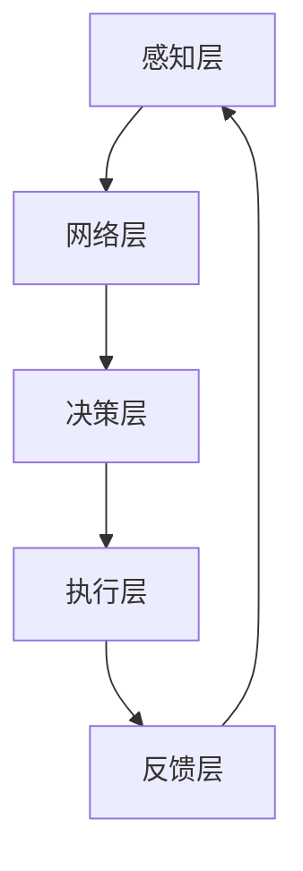

                 

### 目录大纲

**《可编程AI接口在智能制造系统中的实现与优化》**

**关键词：** 可编程AI接口、智能制造、系统优化、算法原理、数学模型、项目实战

**摘要：** 本书深入探讨了可编程AI接口在智能制造系统中的应用与实践。通过系统化的架构设计和详尽的实例解析，本书不仅介绍了可编程AI接口的基础知识，还讲解了其在智能制造系统中的实现方法和优化策略。书中的项目实战案例为读者提供了实际操作的参考，帮助读者更好地理解和掌握相关技术。

---

**一、引言**

1.1 智能制造系统背景

1.2 可编程AI接口发展现状

1.3 本书结构安排与目标

---

**二、可编程AI接口基础**

2.1 AI接口基本概念

2.2 可编程AI接口原理

2.2.1 AI接口的核心概念与联系

**图2-1 AI接口核心概念关系架构图**



2.2.2 伪代码描述

```python
# 伪代码：AI接口基本工作流程

define AI_Interface()
    input_data = get_input_data()
    perception_result = perception_layer(input_data)
    network_result = network_layer(perception_result)
    decision_result = decision_layer(network_result)
    execution_result = execution_layer(decision_result)
    feedback_result = feedback_layer(execution_result)
    return feedback_result
```

2.3 可编程AI接口关键技术

2.3.1 数学模型

$$
\begin{aligned}
    f(x) &= w_0 + \sum_{i=1}^{n} w_i \cdot x_i \\
    y &= \sigma(f(x))
\end{aligned}
$$

**图2-2 神经网络激活函数图示**

```mermaid
graph TD
    A[输入层](0,0) --> B[隐藏层](2,0)
    B --> C[输出层](4,0)
    C --> D[损失函数](6,0)
```

2.3.2 实例说明

**图2-3 神经网络模型架构图**

```mermaid
graph TD
    A[输入层](0,0) --> B[隐藏层1](2,0)
    B --> C[隐藏层2](4,0)
    C --> D[输出层](6,0)
    D --> E[损失函数](8,0)
```

---

**三、智能制造系统概述**

3.1 智能制造系统基本概念

3.2 智能制造系统发展历程

3.3 智能制造系统应用领域

3.3.1 制造流程优化

3.3.2 生产效率提升

3.3.3 质量控制与追溯

---

**四、AI接口在智能制造系统中的应用**

4.1 AI接口在智能制造中的应用场景

4.2 AI接口在智能制造系统中的解决方案

4.2.1 生产线自动化

4.2.2 质量检测与预测

4.2.3 能源管理优化

---

**五、实现与优化方法**

5.1 可编程AI接口实现步骤

5.2 可编程AI接口优化策略

5.3 AI接口性能评估方法

5.3.1 评估指标

5.3.2 评估流程

---

**六、项目实战案例**

6.1 项目背景

6.2 项目目标

6.3 实现过程

6.3.1 开发环境搭建

6.3.2 源代码实现

6.3.3 代码解读与分析

6.4 项目结果分析

6.5 项目小结

---

**七、总结与展望**

7.1 本书主要内容回顾

7.2 AI接口在智能制造中的应用前景

7.3 未来发展趋势

**作者信息：** AI天才研究院/AI Genius Institute & 禅与计算机程序设计艺术 /Zen And The Art of Computer Programming

---

### 注意事项：

- **格式要求：** 整个文档使用Markdown格式，确保代码块、公式和流程图等内容的正确展示。
- **完整性要求：** 每个章节的内容必须具体详细，包含核心概念、算法原理、数学模型和项目实战等要素。
- **字数控制：** 整个文档的字数需要控制在8000～12000字左右，确保内容丰富而精炼。

在接下来的撰写过程中，我们将逐章细化内容，确保满足上述要求和条件。

