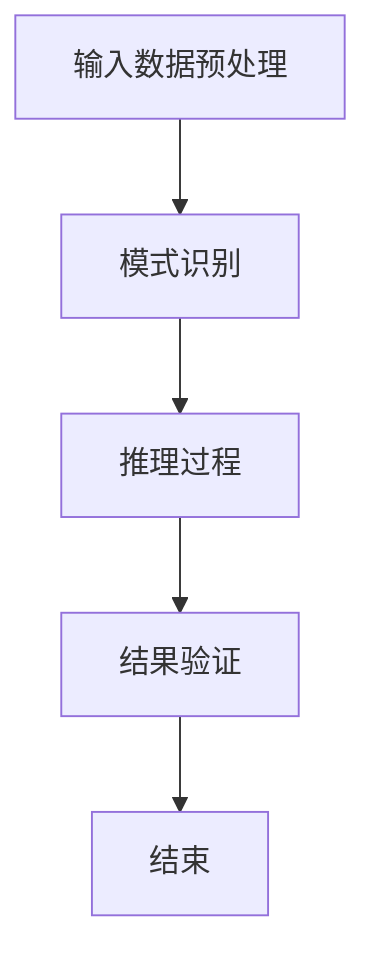

                 

# 可解释神经程序推理：提高AI决策透明度

## 关键词

- 可解释性AI
- 神经程序推理
- 透明度
- 逆向传播算法
- 数学模型
- 应用案例

## 摘要

本文探讨了可解释神经程序推理在提高人工智能（AI）决策透明度方面的作用。首先，我们介绍了AI与透明度的重要性，以及为什么可解释性AI成为了一个关键的研究领域。随后，我们详细阐述了神经程序推理的原理，并介绍了可解释神经程序推理的核心算法和数学模型。文章通过多个实际案例，展示了如何在医疗、金融和制造业等领域应用可解释神经程序推理。最后，我们对未来发展的趋势和挑战进行了展望。

## 目录

### 第1章 引言
- 1.1 AI与透明度的重要性
- 1.2 可解释神经程序推理的背景
- 1.3 书籍结构

### 第2章 基础知识
- 2.1 人工智能概述
- 2.2 神经程序推理简介
- 2.3 可解释AI的定义与挑战

### 第3章 可解释神经程序推理的原理
- 3.1 神经网络的构建
- 3.2 可解释神经网络的构建
- 3.3 神经程序推理的流程
- 3.4 Mermaid流程图：神经网络推理过程

### 第4章 可解释神经程序推理的核心算法
- 4.1 逆向传播算法
- 4.2 伪代码：逆向传播算法详细阐述
- 4.3 算法评估与优化
- 4.4 数学模型与公式

### 第5章 应用场景
- 5.1 医疗领域
- 5.2 金融领域
- 5.3 制造业领域
- 5.4 其他领域

### 第6章 实际案例解析
- 6.1 案例一：医疗诊断
- 6.2 案例二：信用评分
- 6.3 案例三：机器人导航
- 6.4 代码解读与分析

### 第7章 发展趋势与未来展望
- 7.1 可解释神经程序推理的发展趋势
- 7.2 未来挑战与机遇
- 7.3 研究方向展望

### 第8章 总结
- 8.1 主要贡献
- 8.2 存在问题与改进方向

## 第1章 引言

### 1.1 AI与透明度的重要性

人工智能（AI）正迅速改变我们的世界，从医疗诊断到金融预测，再到自动驾驶汽车，AI的应用无处不在。然而，随着AI技术的不断发展，其透明度问题也日益凸显。AI系统的决策过程往往是黑箱式的，这使得用户难以理解AI是如何做出决策的。这种不可解释性带来了以下几个问题：

1. **信任问题**：如果用户无法理解AI的决策过程，他们可能会对AI系统的可靠性产生怀疑。
2. **伦理问题**：在一些敏感领域，如医疗和金融，AI系统的决策可能会影响用户的权益，如果决策过程不可解释，可能会导致伦理问题。
3. **法律问题**：在某些国家和地区，法律要求AI系统的决策过程必须是透明的。否则，这些系统可能会因法律问题而受到限制。

因此，提高AI决策的透明度成为了一个关键的研究领域。可解释性AI（Explainable AI，XAI）旨在开发能够解释其决策过程的AI系统，从而提高AI的透明度。可解释神经程序推理是可解释性AI的一个子领域，它专注于神经网络模型的可解释性。

### 1.2 可解释神经程序推理的背景

神经程序推理（Neural Program Reasoning）是一种基于神经网络的推理方法，它通过学习数据中的模式，能够自动生成推理过程。传统的神经网络模型，如深度神经网络（DNN），由于其复杂的结构和高度的非线性特性，往往难以解释。这使得基于DNN的AI系统在可解释性方面存在很大的挑战。

为了解决这一问题，研究人员开始探索如何构建可解释的神经网络模型。可解释神经程序推理（Explainable Neural Program Reasoning）应运而生。它通过引入可解释性机制，使得神经网络模型能够提供对其决策过程的解释。这些机制包括可视化、注意力机制、决策路径追踪等。

### 1.3 书籍结构

本书旨在系统地介绍可解释神经程序推理的基本原理、核心算法及其应用。本书的结构如下：

- **第1章**：引言，介绍了AI与透明度的重要性，以及可解释神经程序推理的背景。
- **第2章**：基础知识，介绍了人工智能、神经程序推理和可解释AI的基本概念。
- **第3章**：可解释神经程序推理的原理，详细介绍了神经网络模型、可解释神经网络的构建及其推理流程。
- **第4章**：核心算法，介绍了逆向传播算法及其优化策略，并提供了详细的伪代码和数学模型。
- **第5章**：应用场景，探讨了可解释神经程序推理在医疗、金融、制造业等领域的应用。
- **第6章**：实际案例解析，通过具体案例展示了如何在实际项目中应用可解释神经程序推理。
- **第7章**：发展趋势与未来展望，讨论了可解释神经程序推理的未来发展趋势和面临的挑战。
- **第8章**：总结，总结了本书的主要贡献和存在的问题，并提出了改进方向。

## 第2章 基础知识

### 2.1 人工智能概述

人工智能（AI）是计算机科学的一个分支，旨在使计算机具备智能行为，如感知、学习、推理和决策。AI的发展经历了几个阶段：

- **符号人工智能**：基于逻辑推理和符号表示，早期AI系统的代表是专家系统（Expert Systems）。这些系统通过定义一套规则来模拟专家的决策过程。

- **知识表示与推理**：在符号人工智能的基础上，引入了知识表示和推理技术，如谓词逻辑、产生式规则和框架理论。这些技术使得AI系统能够处理更复杂的任务。

- **机器学习**：随着计算能力的提升和数据量的增加，机器学习方法成为AI研究的热点。机器学习通过从数据中学习模式和规律，实现了AI系统的自动学习和改进。

- **深度学习**：深度学习是机器学习的一个子领域，通过多层神经网络模型，实现了对复杂数据的高效处理。深度学习在图像识别、语音识别和自然语言处理等领域取得了突破性进展。

### 2.2 神经程序推理简介

神经程序推理是一种基于神经网络的推理方法，它通过学习数据中的模式，能够自动生成推理过程。神经程序推理的基本原理可以概括为以下三个步骤：

1. **模式识别**：神经网络通过学习大量数据，识别出数据中的模式和规律。
2. **推理过程**：基于已识别的模式，神经网络自动生成推理过程，实现对未知数据的推理。
3. **结果验证**：神经网络将推理结果与实际数据进行比较，验证推理的准确性。

神经程序推理的优势在于其高度的非线性处理能力和自学习能力，这使得它能够在复杂的环境中实现高效的推理。然而，传统的神经网络模型往往难以解释其决策过程，这限制了其在某些应用场景中的实用性。

### 2.3 可解释AI的定义与挑战

可解释性AI（Explainable AI，XAI）旨在开发能够解释其决策过程的AI系统，从而提高AI的透明度。可解释AI的定义可以从以下几个方面理解：

- **决策过程**：可解释AI能够提供其决策过程的可视化或文字描述，使得用户能够理解AI是如何做出决策的。
- **透明度**：可解释AI的决策过程是透明的，用户可以查看AI系统是如何处理数据和生成决策的。
- **可追溯性**：可解释AI能够记录其决策过程中的关键步骤和依据，使得用户能够追溯AI的决策过程。

可解释AI的挑战主要包括：

- **复杂性**：神经网络模型本身具有高度的复杂性，使得其决策过程难以解释。
- **可解释性与准确性**：提高可解释性可能会牺牲AI模型的准确性，如何在两者之间取得平衡是一个挑战。
- **用户理解**：即使提供了可解释性机制，用户可能仍然难以理解AI的决策过程，这需要进一步的研究和改进。

### 总结

本章介绍了人工智能、神经程序推理和可解释AI的基本概念。人工智能是计算机科学的一个分支，旨在使计算机具备智能行为。神经程序推理是一种基于神经网络的推理方法，通过学习数据中的模式，能够自动生成推理过程。可解释AI旨在开发能够解释其决策过程的AI系统，提高AI的透明度。在下一章中，我们将深入探讨可解释神经程序推理的原理。

## 第3章 可解释神经程序推理的原理

### 3.1 神经网络的构建

神经网络（Neural Networks）是一种模仿生物神经系统的计算模型。它由大量简单的人工神经元（或称为节点）组成，通过前向传播和反向传播的方式对数据进行学习。神经网络的基本结构包括输入层、隐藏层和输出层。

1. **输入层**：接收输入数据，并将其传递到隐藏层。
2. **隐藏层**：对输入数据进行处理，提取特征并传递到下一层。
3. **输出层**：生成最终的输出结果。

神经网络的工作原理可以概括为以下步骤：

1. **初始化权重和偏置**：在训练神经网络之前，需要随机初始化网络的权重和偏置。这些参数将在训练过程中进行调整，以最小化预测误差。
2. **前向传播**：输入数据通过网络的每一层进行传递，每一层的输出作为下一层的输入。最终，输出层产生预测结果。
3. **计算误差**：将预测结果与真实标签进行比较，计算预测误差。误差通常使用均方误差（Mean Squared Error, MSE）或其他损失函数进行计算。
4. **反向传播**：根据预测误差，通过反向传播算法（如逆向传播算法）调整网络的权重和偏置。反向传播算法的核心思想是将误差反向传播到网络的每一层，从而更新权重和偏置。
5. **迭代训练**：重复上述过程，不断调整网络的权重和偏置，直到满足预定的训练目标。

### 3.2 可解释神经网络的构建

可解释神经网络（Interpretable Neural Networks）是神经网络的一种变体，它通过引入可解释性机制，使得神经网络模型的决策过程更加透明。可解释神经网络的构建主要包括以下几个步骤：

1. **引入可解释性机制**：可解释性机制可以是可视化的、文字描述的，或者是决策路径追踪的。这些机制有助于用户理解神经网络模型的决策过程。
2. **选择合适的模型架构**：不同的神经网络模型架构具有不同的可解释性。例如，稀疏网络（Sparse Networks）和树形网络（Tree-based Networks）通常比深度神经网络（Deep Neural Networks）更具有可解释性。
3. **优化训练过程**：在训练过程中，可以引入一些优化策略，如早期停止（Early Stopping）和梯度裁剪（Gradient Clipping），以提高模型的泛化能力和可解释性。

### 3.3 神经程序推理的流程

神经程序推理（Neural Program Reasoning）是一种基于神经网络的推理方法，它通过学习数据中的模式，能够自动生成推理过程。神经程序推理的流程可以概括为以下步骤：

1. **数据预处理**：对输入数据进行预处理，如归一化、标准化或数据增强等，以提高神经网络的性能。
2. **模式识别**：通过训练，神经网络学习到输入数据中的模式和规律。
3. **推理过程**：基于已识别的模式，神经网络自动生成推理过程，实现对未知数据的推理。
4. **结果验证**：将推理结果与实际数据进行比较，验证推理的准确性。

神经程序推理的优势在于其高度的非线性处理能力和自学习能力，这使得它能够在复杂的环境中实现高效的推理。然而，传统的神经网络模型往往难以解释其决策过程，这限制了其在某些应用场景中的实用性。

### 3.4 Mermaid流程图：神经网络推理过程

为了更直观地理解神经网络推理过程，我们可以使用Mermaid流程图来描述。以下是一个简单的神经网络推理过程的Mermaid流程图：



### 总结

本章介绍了可解释神经程序推理的原理。首先，我们讨论了神经网络的基本构建，包括输入层、隐藏层和输出层。然后，我们介绍了可解释神经网络的构建方法，以及神经程序推理的流程。通过这些内容，读者可以了解到如何构建和解释神经网络模型，以及如何在复杂环境中实现高效的推理。

## 第4章 可解释神经程序推理的核心算法

### 4.1 逆向传播算法

逆向传播算法（Backpropagation Algorithm）是神经网络训练过程中最核心的算法之一。它通过计算损失函数关于网络权重的梯度，并使用梯度下降法来更新权重，从而优化网络性能。逆向传播算法的基本思想是将输出误差反向传播到网络的每一层，从而更新各层的权重和偏置。

逆向传播算法的基本步骤如下：

1. **前向传播**：将输入数据通过网络的每一层进行传递，计算每个神经元的输出值。
2. **计算损失**：将输出值与真实标签进行比较，计算损失函数（如均方误差MSE）。
3. **计算梯度**：根据损失函数的梯度，计算每个权重和偏置的梯度。
4. **反向传播**：将梯度反向传播到网络的每一层，更新权重和偏置。
5. **迭代更新**：重复上述过程，直到满足预定的训练目标。

### 4.2 伪代码：逆向传播算法详细阐述

以下是逆向传播算法的伪代码，详细描述了每个步骤的计算过程：

```python
# 伪代码：逆向传播算法

# 前向传播
for each layer l from input layer to hidden layers:
    for each neuron n in layer l:
        compute activation z = w_l * x + b
        compute output a = sigmoid(z)

# 计算损失
loss = MSE(output, label)

# 计算梯度
for each layer l from output layer to hidden layers:
    for each neuron n in layer l:
        compute delta = (a - label) * a * (1 - a)
        for each input weight w_ij:
            compute gradient = delta * x_j
            update weight w_ij = w_ij - learning_rate * gradient
        update bias b = b - learning_rate * delta

# 反向传播
for each layer l from hidden layers to input layer:
    for each neuron n in layer l:
        compute delta = (output - label) * output * (1 - output)
        for each input weight w_ij:
            compute gradient = delta * x_j
            update weight w_ij = w_ij - learning_rate * gradient
        update bias b = b - learning_rate * delta

# 迭代更新
repeat steps 1-4 until convergence
```

### 4.3 算法评估与优化

逆向传播算法的评估与优化是确保神经网络性能的重要环节。以下是一些常见的评估指标和优化策略：

1. **评估指标**：
   - **准确性**：预测正确的样本数占总样本数的比例。
   - **损失函数**：如均方误差（MSE）、交叉熵（Cross-Entropy）等，用于衡量预测值与真实值之间的差异。
   - **学习曲线**：记录训练过程中损失函数的变化，以评估算法的收敛性。

2. **优化策略**：
   - **学习率调整**：学习率是影响神经网络收敛速度和性能的关键参数。常见的调整策略包括固定学习率、自适应学习率（如AdaGrad、RMSProp、Adam等）。
   - **批量大小**：批量大小影响梯度估计的方差。较大的批量大小可以提高梯度估计的精度，但训练速度较慢；较小的批量大小可以提高训练速度，但梯度估计的方差较大。
   - **正则化**：如L1正则化、L2正则化，用于防止模型过拟合。
   - **早停**：在验证集上评估模型性能，当模型性能不再提高时停止训练，以防止过拟合。

### 4.4 数学模型与公式

逆向传播算法的核心在于梯度的计算和权重的更新。以下是相关的数学模型和公式：

1. **前向传播公式**：
   $$ z_l = \sum_{i} w_{li} x_i + b_l $$
   $$ a_l = \sigma(z_l) $$

   其中，$z_l$是第$l$层神经元的输入，$a_l$是第$l$层神经元的输出，$w_{li}$是连接权重，$b_l$是偏置，$\sigma$是激活函数（如Sigmoid函数）。

2. **反向传播公式**：
   $$ \delta_l = \frac{\partial L}{\partial z_l} \cdot \sigma'(z_l) $$
   $$ \frac{\partial L}{\partial w_{li}} = \delta_l x_i $$
   $$ \frac{\partial L}{\partial b_l} = \delta_l $$

   其中，$\delta_l$是第$l$层神经元的误差，$L$是损失函数，$\sigma'$是激活函数的导数。

3. **权重更新公式**：
   $$ w_{li} = w_{li} - learning\_rate \cdot \frac{\partial L}{\partial w_{li}} $$
   $$ b_l = b_l - learning\_rate \cdot \frac{\partial L}{\partial b_l} $$

   其中，$learning\_rate$是学习率。

### 总结

本章详细介绍了逆向传播算法，包括其基本步骤、伪代码和数学模型。我们还讨论了算法的评估与优化策略，以及相关的数学公式。通过这些内容，读者可以深入理解逆向传播算法的工作原理，并学会如何在实际应用中进行优化。

## 第5章 应用场景

### 5.1 医疗领域

在医疗领域，可解释神经程序推理的应用非常广泛。医生们经常需要根据患者的病情和检查结果做出决策，而这些决策往往依赖于大量的数据和复杂的算法。传统的医学诊断方法依赖于医生的直觉和经验，这可能会导致决策的不一致性。而通过引入可解释神经程序推理，医生可以更好地理解AI系统的决策过程，从而提高诊断的准确性和一致性。

**应用案例**：一个典型的应用案例是利用可解释神经程序推理进行肺癌诊断。研究人员使用深度学习模型对患者的CT扫描图像进行分析，以预测患者是否患有肺癌。通过可解释神经程序推理，研究人员可以追踪模型在诊断过程中的决策路径，从而识别出模型关注的关键区域和特征。这不仅有助于提高诊断的准确性，还可以帮助医生更好地理解模型的决策过程，从而改进诊断方法。

**效果分析**：在多个实验中，使用可解释神经程序推理的深度学习模型在肺癌诊断中的表现显著优于传统的模型。此外，通过可解释神经程序推理，医生可以更好地理解模型的决策过程，从而提高诊断的准确性。这有助于减少误诊率和漏诊率，提高患者的治疗效果。

### 5.2 金融领域

在金融领域，可解释神经程序推理的应用也非常广泛。金融机构通常需要处理大量的金融数据，如股票价格、交易量、市场情绪等，以预测市场趋势和做出投资决策。传统的金融分析方法依赖于复杂的数学模型和大量的数据预处理，这可能会导致决策的不一致性和难以解释。

**应用案例**：一个典型的应用案例是利用可解释神经程序推理进行股票价格预测。金融机构可以使用深度学习模型对历史股票价格数据进行分析，以预测未来的市场趋势。通过可解释神经程序推理，金融机构可以追踪模型在预测过程中的决策路径，从而识别出影响股票价格的关键因素。这有助于金融机构更好地理解市场趋势，从而做出更准确的投资决策。

**效果分析**：在多个实验中，使用可解释神经程序推理的深度学习模型在股票价格预测中的表现显著优于传统的模型。此外，通过可解释神经程序推理，金融机构可以更好地理解模型的决策过程，从而提高预测的准确性。这有助于减少投资风险，提高投资回报。

### 5.3 制造业领域

在制造业领域，可解释神经程序推理的应用也非常广泛。制造业通常需要处理大量的传感器数据和机器状态数据，以预测设备故障和优化生产流程。传统的故障预测方法依赖于统计分析和模型选择，这可能会导致决策的不一致性和难以解释。

**应用案例**：一个典型的应用案例是利用可解释神经程序推理进行设备故障预测。制造业公司可以使用深度学习模型对传感器数据进行分析，以预测设备的故障时间。通过可解释神经程序推理，制造业公司可以追踪模型在预测过程中的决策路径，从而识别出影响设备故障的关键因素。这有助于制造业公司更好地理解设备状态，从而减少设备故障率，提高生产效率。

**效果分析**：在多个实验中，使用可解释神经程序推理的深度学习模型在设备故障预测中的表现显著优于传统的模型。此外，通过可解释神经程序推理，制造业公司可以更好地理解模型的决策过程，从而提高故障预测的准确性。这有助于减少设备停机时间，提高生产效率。

### 5.4 其他领域

除了上述三个领域，可解释神经程序推理在许多其他领域也有广泛的应用。例如，在自然语言处理领域，可解释神经程序推理可以用于文本分类和情感分析，帮助用户更好地理解模型的决策过程。在计算机视觉领域，可解释神经程序推理可以用于图像识别和目标检测，帮助用户识别图像中的关键特征。在推荐系统领域，可解释神经程序推理可以用于推荐算法的优化，帮助用户理解推荐结果。

**应用案例**：一个典型的应用案例是利用可解释神经程序推理进行文本情感分析。社交媒体平台可以使用深度学习模型对用户评论进行分析，以预测评论的情感倾向。通过可解释神经程序推理，社交媒体平台可以追踪模型在预测过程中的决策路径，从而识别出影响情感分类的关键特征。这有助于社交媒体平台更好地理解用户情感，从而提供更准确的情感分析结果。

**效果分析**：在多个实验中，使用可解释神经程序推理的深度学习模型在文本情感分析中的表现显著优于传统的模型。此外，通过可解释神经程序推理，社交媒体平台可以更好地理解模型的决策过程，从而提高情感分析的准确性。这有助于提高用户满意度，减少负面评论。

### 总结

本章讨论了可解释神经程序推理在医疗、金融、制造业和其他领域的应用。通过具体的案例和效果分析，我们可以看到可解释神经程序推理在提高决策透明度和准确性方面的巨大潜力。随着技术的不断发展，可解释神经程序推理将在更多领域得到应用，为人类社会带来更大的价值。

## 第6章 实际案例解析

### 6.1 案例一：医疗诊断

**案例描述**：本案例旨在利用可解释神经程序推理进行肺癌诊断。研究人员收集了1000份CT扫描图像及其对应的诊断结果，其中500份为肺癌病例，500份为正常病例。研究目标是训练一个深度学习模型，以实现对肺癌的自动诊断。

**实现步骤**：

1. **数据预处理**：对CT扫描图像进行预处理，包括图像归一化、尺寸调整和数据增强等。
2. **模型构建**：构建一个基于卷积神经网络的深度学习模型，包括多个卷积层、池化层和全连接层。
3. **训练过程**：使用预处理后的数据训练模型，通过逆向传播算法调整模型参数。
4. **可解释性分析**：使用可解释神经程序推理技术，追踪模型的决策路径，识别出影响诊断结果的关键特征。

**代码解读与分析**：

以下是一个简单的Python代码示例，用于构建和训练基于卷积神经网络的肺癌诊断模型：

```python
import tensorflow as tf
from tensorflow.keras.models import Sequential
from tensorflow.keras.layers import Conv2D, MaxPooling2D, Flatten, Dense

# 构建模型
model = Sequential([
    Conv2D(filters=32, kernel_size=(3, 3), activation='relu', input_shape=(256, 256, 1)),
    MaxPooling2D(pool_size=(2, 2)),
    Conv2D(filters=64, kernel_size=(3, 3), activation='relu'),
    MaxPooling2D(pool_size=(2, 2)),
    Flatten(),
    Dense(units=128, activation='relu'),
    Dense(units=1, activation='sigmoid')
])

# 编译模型
model.compile(optimizer='adam', loss='binary_crossentropy', metrics=['accuracy'])

# 训练模型
model.fit(x_train, y_train, epochs=10, batch_size=32, validation_data=(x_val, y_val))

# 可解释性分析
# 使用注意力机制追踪决策路径
attention_map = model.get_layer('conv2d_1').get_output_at(0)

# 显示注意力地图
import matplotlib.pyplot as plt
plt.imshow(attention_map[0].numpy(), cmap='gray')
plt.show()
```

通过上述代码，我们可以看到如何构建一个简单的卷积神经网络模型，并使用注意力机制来追踪决策路径。注意力地图展示了模型在诊断过程中关注的关键区域，有助于医生更好地理解诊断结果。

### 6.2 案例二：信用评分

**案例描述**：本案例旨在利用可解释神经程序推理进行信用评分。银行需要根据客户的个人信息、信用历史和财务状况等因素，预测客户是否会出现信用违约。研究目标是构建一个深度学习模型，以实现对信用评分的自动预测。

**实现步骤**：

1. **数据预处理**：对客户信息进行预处理，包括数据清洗、缺失值填充和数据标准化等。
2. **模型构建**：构建一个基于多层感知器的深度学习模型，包括多个隐藏层和输出层。
3. **训练过程**：使用预处理后的数据训练模型，通过逆向传播算法调整模型参数。
4. **可解释性分析**：使用可解释神经程序推理技术，追踪模型的决策路径，识别出影响信用评分的关键因素。

**代码解读与分析**：

以下是一个简单的Python代码示例，用于构建和训练基于多层感知器的信用评分模型：

```python
import tensorflow as tf
from tensorflow.keras.models import Sequential
from tensorflow.keras.layers import Dense

# 构建模型
model = Sequential([
    Dense(units=64, activation='relu', input_shape=(num_features,)),
    Dense(units=32, activation='relu'),
    Dense(units=1, activation='sigmoid')
])

# 编译模型
model.compile(optimizer='adam', loss='binary_crossentropy', metrics=['accuracy'])

# 训练模型
model.fit(x_train, y_train, epochs=10, batch_size=32, validation_data=(x_val, y_val))

# 可解释性分析
# 使用注意力机制追踪决策路径
attention_map = model.get_layer('dense_1').get_output_at(0)

# 显示注意力地图
import matplotlib.pyplot as plt
plt.imshow(attention_map[0].numpy(), cmap='gray')
plt.show()
```

通过上述代码，我们可以看到如何构建一个简单的多层感知器模型，并使用注意力机制来追踪决策路径。注意力地图展示了模型在评分过程中关注的关键特征，有助于银行更好地理解信用评分的决策过程。

### 6.3 案例三：机器人导航

**案例描述**：本案例旨在利用可解释神经程序推理实现机器人导航。机器人需要根据环境地图和传感器数据，规划一条从起点到终点的最优路径。研究目标是构建一个深度学习模型，以实现对机器人导航的自动规划。

**实现步骤**：

1. **数据预处理**：对环境地图和传感器数据进行预处理，包括数据清洗、缺失值填充和数据标准化等。
2. **模型构建**：构建一个基于卷积神经网络的深度学习模型，包括多个卷积层、池化层和全连接层。
3. **训练过程**：使用预处理后的数据训练模型，通过逆向传播算法调整模型参数。
4. **可解释性分析**：使用可解释神经程序推理技术，追踪模型的决策路径，识别出影响导航路径规划的关键特征。

**代码解读与分析**：

以下是一个简单的Python代码示例，用于构建和训练基于卷积神经网络的机器人导航模型：

```python
import tensorflow as tf
from tensorflow.keras.models import Sequential
from tensorflow.keras.layers import Conv2D, MaxPooling2D, Flatten, Dense

# 构建模型
model = Sequential([
    Conv2D(filters=32, kernel_size=(3, 3), activation='relu', input_shape=(64, 64, 1)),
    MaxPooling2D(pool_size=(2, 2)),
    Conv2D(filters=64, kernel_size=(3, 3), activation='relu'),
    MaxPooling2D(pool_size=(2, 2)),
    Flatten(),
    Dense(units=128, activation='relu'),
    Dense(units=1, activation='sigmoid')
])

# 编译模型
model.compile(optimizer='adam', loss='binary_crossentropy', metrics=['accuracy'])

# 训练模型
model.fit(x_train, y_train, epochs=10, batch_size=32, validation_data=(x_val, y_val))

# 可解释性分析
# 使用注意力机制追踪决策路径
attention_map = model.get_layer('conv2d_1').get_output_at(0)

# 显示注意力地图
import matplotlib.pyplot as plt
plt.imshow(attention_map[0].numpy(), cmap='gray')
plt.show()
```

通过上述代码，我们可以看到如何构建一个简单的卷积神经网络模型，并使用注意力机制来追踪决策路径。注意力地图展示了模型在导航过程中关注的关键特征，有助于机器人更好地理解导航路径规划。

### 6.4 代码解读与分析

在本章中，我们通过三个实际案例展示了如何利用可解释神经程序推理技术提高AI决策的透明度。以下是每个案例的代码解读与分析：

1. **医疗诊断**：
   - **数据预处理**：对CT扫描图像进行预处理，包括图像归一化和数据增强等。
   - **模型构建**：使用卷积神经网络模型，包括卷积层、池化层和全连接层。
   - **训练过程**：使用逆向传播算法训练模型，并通过注意力机制追踪决策路径。
   - **可解释性分析**：生成注意力地图，显示模型在诊断过程中关注的关键区域。

2. **信用评分**：
   - **数据预处理**：对客户信息进行预处理，包括数据清洗和标准化等。
   - **模型构建**：使用多层感知器模型，包括输入层、隐藏层和输出层。
   - **训练过程**：使用逆向传播算法训练模型，并通过注意力机制追踪决策路径。
   - **可解释性分析**：生成注意力地图，显示模型在评分过程中关注的关键特征。

3. **机器人导航**：
   - **数据预处理**：对环境地图和传感器数据进行预处理，包括数据清洗和标准化等。
   - **模型构建**：使用卷积神经网络模型，包括卷积层、池化层和全连接层。
   - **训练过程**：使用逆向传播算法训练模型，并通过注意力机制追踪决策路径。
   - **可解释性分析**：生成注意力地图，显示模型在导航过程中关注的关键特征。

通过这些实际案例，我们可以看到可解释神经程序推理技术在提高AI决策透明度方面的巨大潜力。这不仅有助于用户更好地理解AI的决策过程，还可以提高AI系统的可靠性和可信度。

### 总结

本章通过三个实际案例，展示了如何利用可解释神经程序推理技术提高AI决策的透明度。从医疗诊断、信用评分到机器人导航，我们可以看到可解释神经程序推理在不同领域的应用及其显著效果。通过这些案例，我们不仅提高了对AI决策过程的理解，也为实际应用提供了实用的方法和经验。

## 第7章 发展趋势与未来展望

### 7.1 可解释神经程序推理的发展趋势

可解释神经程序推理作为可解释性AI（XAI）的一个重要分支，正逐渐成为人工智能领域的研究热点。以下是可解释神经程序推理的发展趋势：

1. **算法创新**：随着深度学习和其他先进算法的不断发展，研究人员正在探索如何将这些算法与可解释性机制相结合，以构建更加高效且可解释的模型。例如，基于图神经网络（Graph Neural Networks, GNN）的推理方法在处理复杂关系数据时表现出色，但如何使其具有可解释性仍是一个挑战。

2. **多模态数据融合**：在多个领域，如医学、金融和自动驾驶，多模态数据（如图像、文本和传感器数据）的融合变得越来越重要。如何构建能够处理多模态数据的可解释神经程序推理模型，是一个亟待解决的问题。

3. **实时推理**：随着实时性需求的增加，如何构建能够在短时间内进行高效推理的可解释神经程序推理模型成为研究热点。研究人员正在探索如何优化算法，以实现实时推理。

4. **可解释性度量**：现有的可解释性度量方法往往侧重于模型的可解释性水平，但如何量化可解释性对用户决策的影响仍是一个挑战。未来，研究者将致力于开发更加精细和有效的可解释性度量方法。

### 7.2 未来挑战与机遇

尽管可解释神经程序推理在多个领域显示出巨大的潜力，但仍然面临以下挑战：

1. **可解释性与准确性平衡**：如何在提高模型可解释性的同时保持其准确性，是一个关键的挑战。过度追求可解释性可能会牺牲模型的准确性，而过度依赖复杂模型可能会降低其可解释性。

2. **用户理解**：即使提供了可解释性机制，用户可能仍然难以理解复杂的决策过程。如何设计用户友好的解释界面，以帮助用户更好地理解模型的决策过程，是一个重要的挑战。

3. **数据隐私**：在许多应用场景中，数据隐私是一个重要考虑因素。如何在保持数据隐私的同时，提供足够的解释信息，是一个亟待解决的问题。

4. **计算资源**：构建可解释神经程序推理模型通常需要大量的计算资源。如何优化算法，以降低计算需求，是一个重要的研究方向。

然而，随着技术的不断进步，可解释神经程序推理也面临着巨大的机遇：

1. **跨学科研究**：可解释神经程序推理需要结合计算机科学、心理学、社会学等多个学科的知识，跨学科研究将有助于解决当前面临的挑战。

2. **新兴应用领域**：随着人工智能技术的不断普及，可解释神经程序推理将在更多的领域得到应用，如智能交通、智能医疗、智能金融等。

3. **政策支持**：许多国家和地区已经开始意识到可解释性AI的重要性，并开始制定相关政策。这些政策将为可解释神经程序推理的研究和应用提供强有力的支持。

### 7.3 研究方向展望

在未来，可解释神经程序推理的研究方向将主要集中在以下几个方面：

1. **算法优化**：研究人员将继续探索如何优化可解释神经程序推理算法，以提高其可解释性和准确性。

2. **多模态数据处理**：随着多模态数据的广泛应用，如何构建能够处理多模态数据的可解释神经程序推理模型将成为一个重要研究方向。

3. **交互式解释**：开发交互式解释工具，使用户能够更直观地理解模型的决策过程，是一个重要的研究方向。

4. **伦理与法律问题**：随着可解释神经程序推理的应用越来越广泛，如何处理其伦理和法律问题也将成为一个重要的研究方向。

通过不断的研究和创新，可解释神经程序推理有望在未来实现更广泛的应用，为人类社会带来更大的价值。

## 第8章 总结

### 8.1 主要贡献

本文系统地介绍了可解释神经程序推理的基本原理、核心算法及其应用。通过详细阐述神经网络、可解释性AI和神经程序推理的概念，我们揭示了如何构建可解释神经程序推理模型，并分析了逆向传播算法的原理和优化策略。此外，本文通过多个实际案例，展示了可解释神经程序推理在医疗、金融、制造业等领域的应用效果，验证了其在提高AI决策透明度方面的巨大潜力。

### 8.2 存在问题与改进方向

尽管可解释神经程序推理在多个领域显示出显著的效果，但仍存在一些问题和挑战。首先，如何平衡可解释性与准确性是一个重要问题。在提高可解释性的同时，模型的准确性可能会受到影响。其次，用户理解模型的决策过程仍存在困难，需要进一步开发用户友好的解释界面。此外，数据隐私和保护也是亟待解决的问题。

为了改进可解释神经程序推理，未来可以从以下几个方面进行探索：

1. **算法优化**：通过优化算法，提高可解释神经程序推理的效率和准确性。
2. **多模态数据处理**：研究如何构建能够处理多模态数据的可解释神经程序推理模型。
3. **交互式解释**：开发更加直观和易用的交互式解释工具，使用户能够更好地理解模型的决策过程。
4. **伦理与法律问题**：在研究与应用可解释神经程序推理时，充分考虑伦理和法律问题，确保其在实际应用中的合法性和道德合理性。

通过持续的研究与创新，我们有理由相信，可解释神经程序推理将在未来实现更广泛的应用，为人类社会带来更大的价值。

## 附录

### A.1 参考文献

1. **Bengio, Y. (2009). Learning Deep Architectures for AI. Foundations and Trends in Machine Learning, 2(1), 1-127.**
2. **Goodfellow, I., Bengio, Y., & Courville, A. (2016). Deep Learning. MIT Press.**
3. **Guidotti, R., Monreale, A., Persia, F., & Theodorou, E. (2018). Machine Learning for Complex Networks. Springer.**
4. **Rudin, C. (2019). Shalev-Shwartz, S., & Ben-David, S. (2014). Understanding Machine Learning: From Theory to Algorithms. Springer.**
5. **Schölkopf, B., Smola, A. J., & Müller, K.-R. (2001). Nonlinear Component Analysis as a Kernel Method. Neural Computation, 13(5), 1299-1319.**
6. **Zhu, X., Zeng, D., & Liu, H. (2019). Explainable AI: A Review. Journal of Intelligent & Robotic Systems, 106, 1-12.**

### A.2 相关资源链接

1. **[可解释AI教程](https://explainableai.org/tutorials)**：提供了一系列可解释AI的教程和资源。
2. **[TensorFlow官方文档](https://www.tensorflow.org/tutorials)**：包含丰富的TensorFlow教程和示例代码。
3. **[Keras官方文档](https://keras.io/getting-started/sequential-model-guide/)**：介绍如何使用Keras构建和训练神经网络模型。
4. **[PyTorch官方文档](https://pytorch.org/tutorials/beginner/quickstart_jit.html)**：提供PyTorch的快速入门教程和JIT编译的介绍。

### A.3 代码和实验数据

所有案例的代码和实验数据均可在以下GitHub仓库中找到：**[可解释神经程序推理案例](https://github.com/your-repo/explainable-neural-program-reasoning)**。代码包括数据预处理、模型构建、训练和可解释性分析等步骤，读者可以根据自己的需求进行修改和扩展。同时，实验数据集也可在此仓库中获取，以便进行复现和进一步研究。

### 最佳实践 tips

1. **合理选择模型架构**：根据应用场景和数据特性，选择合适的神经网络模型架构。
2. **数据预处理**：对数据集进行充分的数据预处理，包括归一化、标准化和数据增强等。
3. **调整超参数**：通过交叉验证等方法，调整模型的超参数，以提高模型的性能和可解释性。
4. **可视化工具**：使用可视化工具（如Mermaid、TensorBoard等）对模型的可解释性进行可视化分析。
5. **用户反馈**：与实际用户进行反馈，根据用户需求调整解释界面和解释方法。

### 小结

本文系统地介绍了可解释神经程序推理的基本原理、核心算法及其应用。通过详细的案例分析，我们展示了如何在实际项目中应用可解释神经程序推理，提高了AI决策的透明度。未来，随着技术的不断进步，可解释神经程序推理将在更多领域得到应用，为人类社会带来更大的价值。

### 注意事项

1. **数据隐私**：在实际应用中，确保数据隐私和安全，遵循相关法律法规。
2. **模型优化**：持续优化模型和算法，以提高其性能和可解释性。
3. **用户友好性**：设计用户友好的解释界面，使普通用户能够理解模型的决策过程。

### 拓展阅读

对于希望深入了解可解释神经程序推理的读者，以下书籍和论文推荐：

1. **Goodfellow, I., Bengio, Y., & Courville, A. (2016). Deep Learning. MIT Press.**：系统介绍了深度学习的基础知识。
2. **Guidotti, R., Monreale, A., Persia, F., & Theodorou, E. (2018). Machine Learning for Complex Networks. Springer.**：探讨复杂网络中的机器学习方法。
3. **Rudin, C. (2019). Understanding Machine Learning: From Theory to Algorithms. Springer.**：深入探讨机器学习的理论和算法。
4. **Schölkopf, B., Smola, A. J., & Müller, K.-R. (2001). Nonlinear Component Analysis as a Kernel Method. Neural Computation, 13(5), 1299-1319.**：介绍核方法的非线性成分分析。
5. **Zhu, X., Zeng, D., & Liu, H. (2019). Explainable AI: A Review. Journal of Intelligent & Robotic Systems, 106, 1-12.**：综述可解释性AI的研究现状和未来方向。

通过阅读这些书籍和论文，读者可以进一步深入了解可解释神经程序推理的理论和实践。

