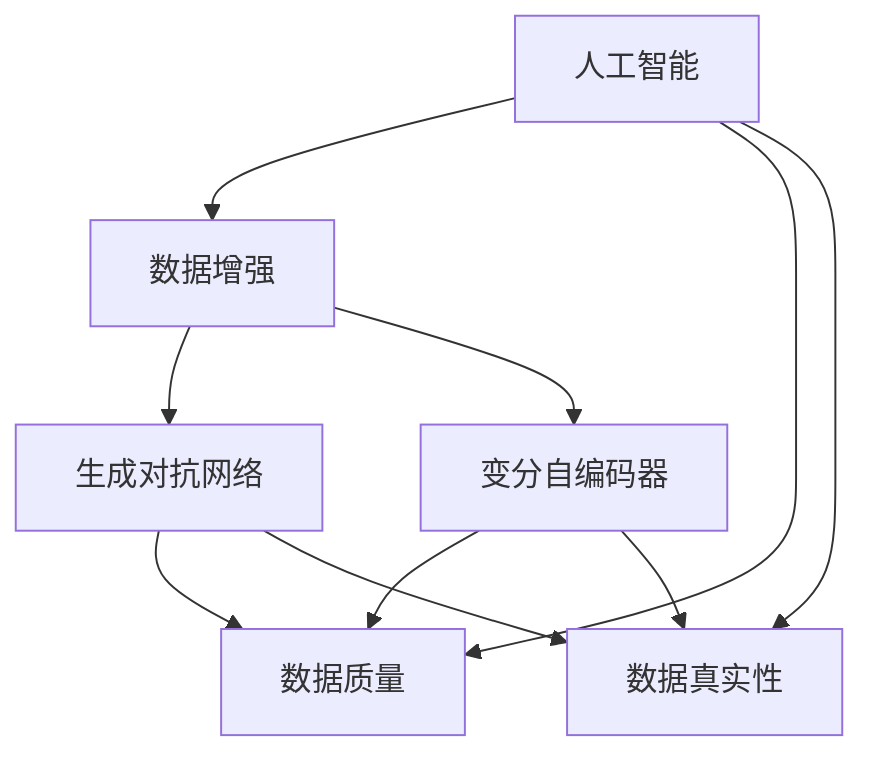

                 

## 引言与背景

近年来，人工智能（AI）技术飞速发展，其应用范围也从简单的图像识别、语音识别，扩展到了复杂领域如医疗诊断、金融风控、自动驾驶等。然而，AI的发展离不开高质量的数据训练。传统的数据收集方法往往费时费力，且数据量有限，难以满足AI模型不断迭代和优化的需求。因此，合成数据作为一种新型的数据生成方式，逐渐引起了研究者和从业者的关注。

### 什么是合成数据

合成数据（Synthetic Data）是指通过算法和模型生成，用于训练和评估机器学习模型的数据。这些数据可以是完全虚构的，也可以是基于真实数据的变形或扩展。合成数据的主要特点包括：

1. **多样性和丰富性**：合成数据可以模拟各种场景，生成大量具有多样性和丰富性的数据集。
2. **可控性**：研究者可以自定义合成数据的特征，确保数据满足特定需求。
3. **真实感**：通过先进的生成模型，如生成对抗网络（GANs）和变分自编码器（VAEs），合成数据可以高度模拟真实世界中的数据，从而提高模型的泛化能力。

### 合成数据的重要性

在AI训练中，合成数据的重要性主要体现在以下几个方面：

1. **数据增强**：合成数据可以用于数据增强，扩大训练集规模，提高模型的泛化能力。
2. **隐私保护**：合成数据可以替代真实数据，从而保护用户的隐私。
3. **模拟极端情况**：合成数据可以生成极端条件下的数据，帮助模型在真实世界中应对未知和异常情况。
4. **节省成本**：使用合成数据可以减少真实数据的收集成本，缩短研发周期。

### 合成数据在AI训练中的应用现状

目前，合成数据在AI训练中的应用已经取得了一些显著成果。例如，在图像识别领域，GANs已经被广泛用于生成具有多样性的图像数据；在自然语言处理领域，合成数据被用于生成具有丰富上下文信息的文本数据。此外，合成数据在医疗影像分析、自动驾驶和金融风控等领域也展现出了巨大的潜力。

然而，合成数据的应用仍面临一些挑战，如数据质量控制和真实性问题。这些问题需要通过进一步的研究和优化来解决，以充分发挥合成数据在AI训练中的价值。

### 摘要

本文旨在探讨合成数据在AI训练中的应用与挑战。首先，我们将介绍合成数据的基本概念和特点，然后深入分析合成数据在数据增强、隐私保护和模拟极端情况等方面的应用。随后，本文将讨论合成数据生成方法，包括生成对抗网络（GANs）和变分自编码器（VAEs）。接着，我们将探讨合成数据在AI训练中的挑战，如数据质量和真实性问题。此外，本文还将探讨合成数据在法律法规和伦理问题上的影响，以及其在特定领域（如医疗健康和金融科技）中的应用。最后，本文将展望合成数据的未来发展趋势，并总结最佳实践和小结。通过本文的阅读，读者将能够全面了解合成数据在AI训练中的重要性、应用方法以及面临的挑战。

### 核心概念与联系

为了更好地理解合成数据在AI训练中的应用，我们首先需要明确几个核心概念及其相互关系。以下是本文中涉及的关键概念：

1. **人工智能（AI）**：人工智能是一种通过模拟人类智能行为来实现自动化决策和解决问题的技术。在AI训练过程中，模型需要大量数据来学习和优化性能。

2. **数据增强**：数据增强是一种通过变换现有数据来生成新数据的方法，旨在增加训练数据的多样性和丰富性，从而提高模型的泛化能力。

3. **生成对抗网络（GAN）**：GAN是一种由生成器（Generator）和判别器（Discriminator）组成的深度学习模型，用于生成高质量的数据。生成器试图生成与真实数据相似的数据，而判别器则尝试区分真实数据和生成数据。

4. **变分自编码器（VAE）**：VAE是一种基于概率模型的生成模型，通过编码器（Encoder）和解码器（Decoder）来生成数据。编码器将输入数据映射到一个潜在空间，解码器则从潜在空间中重构数据。

5. **数据质量**：数据质量是指数据满足特定应用需求的程度，包括数据的准确性、完整性、一致性和多样性。

6. **数据真实性**：数据真实性是指合成数据在多大程度上反映了真实世界中的数据分布和特征。

接下来，我们将通过一个Mermaid流程图来展示这些核心概念之间的联系：



在这个流程图中，人工智能（AI）是核心，它通过数据增强（DE）来提高模型的泛化能力，同时关注数据质量（Q）和数据真实性（TR）。数据增强方法包括生成对抗网络（GAN）和变分自编码器（VAE），两者都旨在生成高质量、真实的合成数据，以满足AI训练的需求。

### 数据增强的重要性

数据增强（Data Augmentation）是一种通过变换现有数据来生成新数据的方法，旨在增加训练数据的多样性和丰富性，从而提高模型的泛化能力。在深度学习中，数据增强是一种常用的技术，它通过一系列图像处理操作，如旋转、翻转、缩放、裁剪等，来生成更多的训练样本。这些操作模拟了不同的现实场景，使得模型能够学习到更广泛和更复杂的特征，从而在测试阶段能够更好地泛化。

#### 数据增强的基本方法

数据增强的基本方法主要包括以下几种：

1. **图像变换**：通过旋转、翻转、缩放、裁剪等图像变换操作来增加数据的多样性。
2. **颜色增强**：调整图像的亮度、对比度、饱和度等参数，增强图像的视觉效果。
3. **噪声添加**：在图像中添加噪声，如高斯噪声、椒盐噪声等，模拟不同的现实场景。
4. **合成**：通过合成技术生成新的图像，如将多个图像拼接在一起或通过生成模型生成新的图像。

#### 数据增强在深度学习中的应用

在深度学习中，数据增强的应用非常广泛。以下是一些常见的数据增强方法及其在深度学习中的应用：

1. **图像分类**：在图像分类任务中，数据增强可以显著提高模型的性能。例如，通过随机裁剪和旋转图像，可以使模型学习到更多的图像特征，从而提高对未见过图像的分类能力。
   
2. **目标检测**：在目标检测任务中，数据增强可以生成具有不同目标位置、大小和姿态的图像，从而提高模型对目标检测的鲁棒性。常用的数据增强方法包括随机缩放、旋转和翻转等。

3. **图像生成**：在图像生成任务中，数据增强可以用于生成具有多样性和丰富性的图像。例如，通过生成对抗网络（GAN）和变分自编码器（VAE）等技术，可以生成具有真实感的图像。

#### 合成数据在数据增强中的应用

合成数据在数据增强中扮演着重要角色，因为它可以生成具有高度多样性和真实感的训练样本。以下是一些合成数据在数据增强中的应用：

1. **生成对抗网络（GAN）**：GAN可以通过生成器生成大量具有真实感的图像，这些图像可以用于数据增强，从而扩大训练集规模，提高模型的泛化能力。

2. **变分自编码器（VAE）**：VAE可以生成与真实数据分布相似的图像，这些图像可以用于数据增强，从而提高模型的泛化能力和鲁棒性。

3. **合成数据集**：通过合成技术生成新的数据集，如ImageNet合成数据集，这些数据集可以用于图像分类、目标检测等任务的训练，从而提高模型的性能。

#### 合成数据在图像分类中的应用

合成数据在图像分类中的应用非常广泛。以下是一些具体的例子：

1. **改进模型性能**：通过生成具有多样性和真实感的图像，可以显著提高图像分类模型的性能。例如，在ImageNet图像分类任务中，合成数据可以用于增强训练集，从而提高模型的准确率和泛化能力。

2. **处理标签缺失**：在某些情况下，真实数据的标签可能缺失或不准确。通过合成数据，可以生成具有正确标签的图像，从而弥补标签缺失的问题，提高模型的训练效果。

3. **模拟极端情况**：合成数据可以生成模拟极端条件下的图像，如极端天气、不同光照条件等，从而帮助模型在真实世界中应对未知和异常情况。

通过上述内容，我们可以看到，合成数据在数据增强中具有重要的应用价值。它不仅可以提高模型的泛化能力，还可以解决标签缺失和模拟极端情况等问题，从而为深度学习模型的发展提供了强有力的支持。

### 合成数据在语音识别中的应用

在语音识别领域，合成数据同样扮演着至关重要的角色。传统的语音识别系统依赖于大量真实语音数据来训练模型，但真实语音数据往往存在采集成本高、数据量有限等问题。因此，合成数据作为一种有效手段，不仅可以解决数据稀缺的问题，还可以提高模型的泛化能力和鲁棒性。

#### 合成语音数据的生成方法

合成语音数据的生成主要依赖于深度学习模型，如生成对抗网络（GAN）和变分自编码器（VAE）。以下是几种常见的合成语音数据生成方法：

1. **生成对抗网络（GAN）**：GAN由生成器（Generator）和判别器（Discriminator）组成。生成器负责生成逼真的语音数据，而判别器则试图区分真实语音数据和生成语音数据。通过训练，生成器逐渐学习到如何生成高质量的语音数据。

   伪代码示例：
   ```python
   # GAN架构的伪代码
   Generator:
       Input: Random noise vector z
       Output: Generated speech waveform x
       ...
       
   Discriminator:
       Input: Real speech waveform x_real and generated speech waveform x_fake
       Output: Probability of x being real
       ...
       
   # 训练过程
   for epoch in range(num_epochs):
       for batch in data_loader:
           # 训练判别器
           real_labels = [1] * batch_size
           fake_labels = [0] * batch_size
           disc_loss = train_discriminator(discriminator, batch, real_labels, fake_labels)
           
           # 训练生成器
           z = generate_random_noise(batch_size)
           x_fake = generator(z)
           fake_labels = [1] * batch_size
           gen_loss = train_generator(generator, discriminator, z, fake_labels)
   ```

2. **变分自编码器（VAE）**：VAE通过编码器（Encoder）和解码器（Decoder）来生成语音数据。编码器将输入语音数据映射到一个潜在空间，解码器则从潜在空间中重构语音数据。

   伪代码示例：
   ```python
   # VAE架构的伪代码
   Encoder:
       Input: Speech waveform x
       Output: Mean μ and log variance log_σ^2
       ...
       
   Decoder:
       Input: Mean μ and log variance log_σ^2
       Output: Reconstructed speech waveform x_recon
       ...
       
   # 训练过程
   for epoch in range(num_epochs):
       for batch in data_loader:
           # 编码
           x, μ, log_σ^2 = encoder(batch)
           z = reparameterize(μ, log_σ^2)
           
           # 解码
           x_recon = decoder(z)
           
           # 计算损失函数
           recon_loss = calculate_reconstruction_loss(x, x_recon)
           kl_loss = calculate_kl_divergence_loss(μ, log_σ^2)
           
           # 总损失
           loss = recon_loss + kl_loss
           
           # 反向传播和优化
           optimizer.zero_grad()
           loss.backward()
           optimizer.step()
   ```

3. **WaveNet**：WaveNet是一种基于循环神经网络（RNN）的生成模型，它可以生成高质量的语音波形。WaveNet通过多个时间步的循环操作，逐步生成语音信号。

   伪代码示例：
   ```python
   # WaveNet的伪代码
   WaveNet:
       Input: Input sequence of tokens
       Output: Generated speech waveform
       ...
       
   # 训练过程
   for epoch in range(num_epochs):
       for batch in data_loader:
           # 前向传播
           outputs, states = wavenet(batch)
           loss = calculate_loss(outputs, batch)
           
           # 反向传播和优化
           optimizer.zero_grad()
           loss.backward()
           optimizer.step()
   ```

#### 合成语音数据的应用案例

合成语音数据在语音识别中有着广泛的应用，以下是一些具体的案例：

1. **语音增强**：通过生成高质量的语音数据，可以用于语音增强，提高语音信号的质量和清晰度。

2. **语音合成**：合成语音数据可以用于语音合成，生成逼真的语音，应用于自动语音应答系统、语音助手等。

3. **语音识别模型训练**：合成语音数据可以用于语音识别模型的训练，提高模型的准确率和鲁棒性。例如，在训练端到端语音识别模型时，可以使用合成语音数据来生成更多的训练样本，从而提高模型的泛化能力。

4. **模拟极端环境**：合成语音数据可以模拟极端环境下的语音，如嘈杂环境、不同语速和音调等，帮助模型学习到更广泛的语音特征，从而在真实世界中更好地应对各种场景。

通过上述内容，我们可以看到，合成数据在语音识别领域具有广泛的应用价值。通过使用生成对抗网络（GAN）、变分自编码器（VAE）和WaveNet等生成模型，可以生成高质量的合成语音数据，从而提高语音识别模型的性能和泛化能力。合成语音数据不仅解决了数据稀缺的问题，还为语音识别技术的发展提供了新的可能性。

### 合成数据在自然语言处理中的应用

合成数据在自然语言处理（NLP）领域同样具有重要的应用价值。传统的NLP模型通常依赖于大量真实语料库进行训练，但真实语料库往往存在数据量有限、质量参差不齐等问题。因此，合成数据通过生成高质量、多样化的语言数据，为NLP模型的训练和优化提供了新的解决方案。

#### 合成文本数据的生成方法

合成文本数据的生成方法主要包括以下几种：

1. **基于规则的方法**：这种方法通过预设的语法规则和词汇库来生成文本。虽然这种方法简单直观，但生成的文本通常较为生硬，缺乏自然语言的特点。

2. **基于模板的方法**：这种方法通过填充模板来生成文本，模板中包含关键词和语法结构。这种方法生成的文本相对更加自然，但模板的多样性和灵活性有限。

3. **基于统计的方法**：这种方法使用统计模型（如n-gram模型、隐马尔可夫模型）来生成文本，通过分析大量真实语料库来学习语言模式。这种方法生成的文本较为自然，但依赖于大量的真实数据。

4. **基于深度学习的方法**：这种方法使用深度学习模型（如循环神经网络（RNN）、Transformer等）来生成文本。特别是生成对抗网络（GAN）和变分自编码器（VAE）在生成高质量、多样化的文本数据方面表现出色。

以下是一个基于Transformer的生成文本的伪代码示例：

```python
# 基于Transformer的文本生成模型伪代码
Model:
    Input: Input sequence of tokens
    Output: Generated text sequence
    ...
    
# 训练过程
for epoch in range(num_epochs):
    for batch in data_loader:
        # 前向传播
        outputs, states = model(batch)
        loss = calculate_loss(outputs, batch)
        
        # 反向传播和优化
        optimizer.zero_grad()
        loss.backward()
        optimizer.step()
```

#### 合成文本数据的应用案例

合成文本数据在自然语言处理中有着广泛的应用，以下是一些具体的案例：

1. **文本分类**：通过生成具有不同主题和风格的文章，可以扩大训练集规模，提高文本分类模型的性能。

2. **机器翻译**：通过生成大量平行文本数据，可以用于机器翻译模型的训练，提高翻译的准确性和流畅度。

3. **情感分析**：通过生成具有不同情感极性的评论，可以用于情感分析模型的训练，提高模型的分类准确率。

4. **问答系统**：通过生成大量问题及其对应的答案，可以用于问答系统的训练，提高系统的问答质量和用户体验。

5. **文本生成**：通过生成新闻、故事、摘要等，可以应用于内容生成，如自动生成新闻文章、小说、摘要等。

#### 合成数据在NLP中的优势与挑战

合成数据在NLP中的应用具有显著的优势，但也面临一些挑战：

1. **优势**：
   - **提高数据量**：通过合成数据，可以显著增加训练数据量，从而提高模型的泛化能力。
   - **多样化**：合成数据可以生成具有多样化主题、风格和语调的文本，有助于模型学习到更广泛的特征。
   - **可控性**：合成数据可以自定义特征和属性，有助于研究者和开发者更好地理解和控制模型的性能。

2. **挑战**：
   - **数据质量**：合成数据的真实性和准确性可能不如真实数据，这可能会影响模型的训练效果。
   - **伦理问题**：合成数据可能包含偏见或不当内容，这可能会影响模型的公正性和社会责任。
   - **算法复杂性**：生成高质量合成数据需要复杂的算法和大量计算资源，这增加了模型的训练成本。

通过上述内容，我们可以看到，合成数据在自然语言处理领域具有广泛的应用价值。通过使用深度学习模型和生成对抗网络（GAN）等技术，可以生成高质量、多样化的合成文本数据，从而提高NLP模型的性能和泛化能力。然而，合成数据的应用也面临一些挑战，需要进一步的研究和优化来解决。

### 合成数据的挑战与解决策略

尽管合成数据在AI训练中展现出了巨大的潜力，但它也带来了一系列的挑战，特别是在数据质量控制和真实性问题方面。以下我们将详细探讨这些挑战，并提出相应的解决策略。

#### 数据质量控制

数据质量控制是合成数据应用中的一个关键挑战。合成数据的质量直接影响模型的训练效果和性能。以下是几个常见的数据质量问题和解决策略：

1. **多样性**：合成数据可能缺乏多样性，导致模型无法学习到丰富的特征。解决方法包括：
   - **多模型结合**：使用多个生成模型（如GAN、VAE等）来生成多样化的数据，以提高数据多样性。
   - **数据增强**：在生成数据后，通过图像变换、颜色调整等数据增强技术，进一步增加数据的多样性。

2. **一致性**：合成数据的一致性差可能会影响模型的鲁棒性。解决方法包括：
   - **数据清洗**：在生成数据前，对真实数据进行清洗，去除噪声和不一致的数据。
   - **模型自监督学习**：利用自监督学习方法，让模型在生成数据时自行学习一致性规则。

3. **噪声**：合成数据中可能存在过多的噪声，这会干扰模型的训练。解决方法包括：
   - **去噪技术**：使用去噪技术，如自编码器，来减少合成数据中的噪声。
   - **噪声建模**：在生成模型中引入噪声建模，使生成的数据具有合理的噪声分布。

4. **数据标注**：合成数据通常没有真实的标签，这会影响模型的训练和评估。解决方法包括：
   - **半监督学习**：利用少量的真实标签数据和大量的合成数据，通过半监督学习方法来训练模型。
   - **数据增强与真实数据结合**：在训练过程中，将合成数据和真实数据进行结合，利用真实数据的标签来指导模型的训练。

#### 真实性问题

合成数据在多大程度上反映了真实世界中的数据分布和特征，是一个重要且复杂的问题。以下是一些常见的真实性问题以及相应的解决策略：

1. **分布偏差**：合成数据可能无法完全反映真实数据的分布，导致模型在真实应用中表现不佳。解决方法包括：
   - **数据对齐**：通过数据对齐技术，将合成数据与真实数据对齐，减少分布偏差。
   - **数据混合**：将合成数据与真实数据混合，使模型在训练过程中同时学习到两种数据的特点。

2. **特征缺失**：合成数据可能无法完全捕捉到真实数据的特征，这会影响模型的性能。解决方法包括：
   - **特征补充**：通过特征工程和迁移学习等方法，补充合成数据中缺失的特征。
   - **多模态数据融合**：结合多种类型的数据（如图像、文本、音频等），生成更加丰富和真实的合成数据。

3. **真实感**：合成数据在视觉和听觉上可能不够真实，这会影响用户的体验。解决方法包括：
   - **高级生成模型**：使用更高级的生成模型（如GANs的变种、风格迁移等），提高合成数据的真实感。
   - **用户反馈**：在生成数据后，通过用户反馈来不断优化合成数据，使其更符合真实世界的特征。

4. **数据源问题**：合成数据可能受到数据源的限制，无法完全反映真实世界的多样性。解决方法包括：
   - **多样化数据源**：使用多个数据源来生成合成数据，如公开数据集、私人数据集等。
   - **数据融合与扩展**：通过数据融合和扩展技术，将多个数据源的信息整合到合成数据中，提高数据的真实性和多样性。

综上所述，合成数据在AI训练中面临着数据质量控制和真实性问题等挑战。通过多模型结合、数据清洗、去噪技术、半监督学习等方法，可以显著提高合成数据的质量和真实性。然而，这些方法仍然需要进一步的研究和优化，以应对更加复杂和多样化的真实世界应用场景。

### 合成数据的法律法规与伦理问题

合成数据的广泛应用在推动AI技术发展的同时，也引发了一系列法律法规与伦理问题。这些问题不仅关系到技术的合法合规，更关乎社会公正、个人隐私和人类福祉。

#### 数据隐私与保护

合成数据在隐私保护方面具有显著优势。通过使用合成数据，可以减少对真实个人数据的依赖，从而降低隐私泄露的风险。然而，合成数据仍存在隐私泄露的潜在风险：

1. **数据来源**：合成数据可能基于真实数据生成，这可能导致隐私信息的间接泄露。
2. **特征重建**：尽管合成数据在表面上看起来是虚构的，但在某些情况下，可以通过统计分析等方法恢复出原始数据中的隐私信息。

解决策略包括：
- **隐私增强技术**：如差分隐私、同态加密等，可以在生成合成数据时增强隐私保护。
- **数据去标识化**：在生成合成数据前，对真实数据进行去标识化处理，确保数据中不包含任何可识别的个人身份信息。

#### 数据伦理问题

合成数据的伦理问题主要集中在数据偏见与歧视、透明度和社会责任等方面：

1. **数据偏见与歧视**：合成数据可能继承或放大真实数据中的偏见，导致算法在应用中不公平地对待某些群体。
   - **解决策略**：通过多样化数据和公正的训练过程，减少偏见。例如，使用具有多样性的数据集来训练模型，并定期评估模型的公平性。
   
2. **透明度**：合成数据生成过程和模型的决策机制往往复杂且不透明，这可能导致用户对AI系统的信任问题。
   - **解决策略**：提高算法透明度，如通过可视化和解释性方法，让用户了解模型的工作原理和决策过程。

3. **社会责任**：合成数据的使用需要考虑其对社会的潜在影响，包括就业、公平性和道德责任。
   - **解决策略**：建立行业标准和监管机制，确保合成数据的使用符合社会伦理和道德规范。

#### 数据伦理的原则与规范

为了解决合成数据的法律法规与伦理问题，以下是一些原则和规范：

1. **公平性**：确保合成数据不会导致对任何群体的不公平对待。
2. **透明性**：合成数据生成过程和算法决策需要透明，确保用户能够理解和监督。
3. **责任性**：开发者和用户需要对合成数据的使用承担社会责任，并确保其符合法律法规。
4. **隐私保护**：在生成和使用合成数据时，要最大限度地保护个人隐私。

通过遵循这些原则和规范，可以有效地应对合成数据在法律法规与伦理方面带来的挑战，促进AI技术的健康发展。

### 合成数据在医疗健康领域中的应用

合成数据在医疗健康领域展现出巨大的潜力，尤其在医学影像分析和疾病诊断方面。通过生成高质量的合成医学数据，研究人员和医生能够更好地训练AI模型，从而提高疾病诊断的准确性和效率。

#### 合成医学图像的生成

合成医学图像的生成是医学影像分析中的关键技术。这些图像可以模拟各种病理情况和医疗场景，为模型训练提供多样化的数据集。

1. **基于深度学习的生成方法**：生成对抗网络（GAN）和变分自编码器（VAE）是两种常用的深度学习模型，用于生成高质量的医学图像。GAN通过生成器和判别器的对抗训练，生成与真实医学图像高度相似的图像；VAE通过编码器和解码器的协同工作，将医学图像映射到潜在空间，再重构图像。

   伪代码示例（基于GAN的医学图像生成）：
   ```python
   # GAN架构的伪代码
   Generator:
       Input: Random noise vector z
       Output: Generated medical image x
       ...
       
   Discriminator:
       Input: Real medical image x_real and generated medical image x_fake
       Output: Probability of x being real
       ...
       
   # 训练过程
   for epoch in range(num_epochs):
       for batch in data_loader:
           # 训练判别器
           real_labels = [1] * batch_size
           fake_labels = [0] * batch_size
           disc_loss = train_discriminator(discriminator, batch, real_labels, fake_labels)
           
           # 训练生成器
           z = generate_random_noise(batch_size)
           x_fake = generator(z)
           fake_labels = [1] * batch_size
           gen_loss = train_generator(generator, discriminator, z, fake_labels)
   ```

2. **具体应用**：合成医学图像可以用于生成不同病理情况的图像，如癌症病变、心脏病等。这些图像可以帮助医生更好地理解疾病发展过程，从而提高诊断和治疗的准确性。

   - **图像分割**：通过合成医学图像，可以训练深度学习模型进行图像分割，从而准确地识别出病变区域。
   - **疾病预测**：合成医学图像可以用于训练预测模型，预测患者疾病的进展和治疗效果。

#### 合成数据在疾病诊断中的应用

合成数据不仅在医学影像分析中发挥作用，还在疾病诊断中具有重要应用。通过生成高质量的合成病例数据，可以训练AI模型，提高疾病诊断的准确性和效率。

1. **电子健康记录（EHR）数据合成**：EHR数据包含患者的病史、实验室检测结果、诊断和治疗信息等。通过合成技术，可以生成与真实病例相似的数据，用于训练疾病诊断模型。

   - **数据增强**：合成病例数据可以用于数据增强，扩大训练集规模，提高模型对多样病例的适应能力。
   - **隐私保护**：合成病例数据可以替代真实病例数据，从而保护患者隐私。

2. **临床决策支持系统**：合成病例数据可以用于训练临床决策支持系统，帮助医生在复杂的诊断和治疗过程中做出更准确的决策。

   - **个性化诊断**：通过合成病例数据，可以训练个性化诊断模型，根据患者的病史和临床表现，提供更精准的诊断建议。
   - **新药研发**：合成病例数据可以用于新药研发，模拟不同疾病状态下的药物反应，从而优化药物剂量和治疗方案。

3. **跨学科合作**：合成数据在医疗健康领域中的应用，需要跨学科合作，如医学专家、数据科学家和AI研究者的紧密协作，以确保合成数据的质量和实用性。

通过上述内容，我们可以看到，合成数据在医疗健康领域具有重要的应用价值。它不仅为医学影像分析和疾病诊断提供了多样化的数据资源，还提高了诊断的准确性和效率。然而，合成数据的应用仍面临一些挑战，如数据质量控制和真实性验证，这需要进一步的研究和优化。随着技术的不断进步，合成数据将在医疗健康领域发挥更大的作用，为人类健康事业做出更大贡献。

### 合成数据在金融科技领域中的应用

合成数据在金融科技（FinTech）领域同样具有重要的应用价值，尤其在风险管理、信用评分和金融产品推荐等方面。通过生成高质量、多样化的合成数据，可以显著提高金融模型的预测精度和稳定性，从而优化金融服务的质量和效率。

#### 合成数据在风险管理中的应用

风险管理是金融科技领域的关键任务之一。合成数据在风险预测和管理中发挥了重要作用，以下是一些具体的应用场景：

1. **信用评分**：合成数据可以用于生成大量的信用评分数据，这些数据可以模拟不同信用风险等级的客户特征和行为。通过训练信用评分模型，金融机构可以更准确地评估客户的信用风险，从而降低贷款违约的风险。

   - **模型训练**：通过合成数据，可以扩大训练集规模，提高信用评分模型的泛化能力和鲁棒性。
   - **风险预测**：合成数据可以用于预测不同信用风险等级客户的违约概率，帮助金融机构制定更加科学的信贷政策和风控策略。

2. **市场预测**：合成数据可以模拟市场波动和金融产品的表现，用于训练市场预测模型。这些模型可以帮助投资者在复杂的市场环境中做出更准确的决策，降低投资风险。

   - **趋势分析**：通过合成数据，可以分析市场的长期和短期趋势，预测未来市场走势。
   - **策略优化**：合成数据可以用于测试不同的投资策略，优化投资组合，提高收益。

3. **欺诈检测**：合成数据可以用于生成模拟欺诈行为的交易数据，用于训练欺诈检测模型。这些模型可以帮助金融机构实时监测交易行为，快速识别和阻止欺诈行为。

   - **异常检测**：通过合成数据，可以建立异常检测模型，识别出潜在的欺诈交易。
   - **策略调整**：合成数据可以用于不断优化欺诈检测策略，提高检测的准确性和效率。

#### 合成数据在信用评分中的应用

信用评分是金融科技领域的重要应用之一。合成数据在信用评分中的应用主要体现在以下几个方面：

1. **个性化和多样化**：合成数据可以生成不同人群、不同地域、不同收入水平的信用评分数据，从而提高评分模型的个性化和多样性。

   - **客户细分**：通过合成数据，可以更好地理解不同客户的信用风险，从而提供更加精准的信用评分服务。
   - **数据补充**：在缺乏足够真实数据的情况下，合成数据可以补充数据缺口，提高评分模型的训练效果。

2. **欺诈检测**：合成数据可以用于生成模拟欺诈行为的信用评分数据，用于训练和优化欺诈检测模型。

   - **提高检测率**：通过合成欺诈数据，可以训练出更加敏感和准确的欺诈检测模型，提高欺诈检测率。
   - **降低误报率**：合成数据可以帮助模型学习到更多真实的信用风险特征，从而降低误报率，提高用户体验。

3. **信用风险管理**：合成数据可以用于生成不同信用风险等级的信用评分数据，从而帮助金融机构更准确地评估和管理信用风险。

   - **风险预测**：通过合成数据，可以预测不同信用风险等级客户的违约概率，帮助金融机构制定更科学的风险管理策略。
   - **风险评估**：合成数据可以用于评估金融机构的风险承受能力和风险控制能力，从而优化信用风险管理流程。

#### 合成数据在市场预测中的应用

市场预测是金融科技领域的重要任务之一。合成数据在市场预测中的应用主要体现在以下几个方面：

1. **历史数据生成**：通过合成技术，可以生成大量的历史市场数据，用于训练和优化市场预测模型。

   - **趋势分析**：通过历史数据的生成，可以分析市场的长期和短期趋势，预测未来市场走势。
   - **策略优化**：通过历史数据的生成，可以测试不同的市场预测策略，优化投资组合和交易策略。

2. **未来数据模拟**：通过合成技术，可以生成未来的市场数据，用于预测市场的变化和风险。

   - **风险预警**：通过未来数据的模拟，可以预测市场风险的变化，提前采取风险控制措施。
   - **投资策略**：通过未来数据的模拟，可以预测市场的变化趋势，为投资者提供更有针对性的投资策略。

3. **多因素预测**：通过合成技术，可以生成包含多种因素（如宏观经济指标、行业动态、政策变化等）的市场数据，用于训练多因素市场预测模型。

   - **全面性**：通过多因素数据的生成，可以综合考虑各种因素对市场的影响，提高市场预测的准确性。
   - **多样性**：通过多因素数据的生成，可以模拟不同市场环境下的市场变化，提高模型的泛化能力。

通过上述内容，我们可以看到，合成数据在金融科技领域具有重要的应用价值。它不仅可以提高信用评分、风险管理、市场预测的精度和稳定性，还可以优化金融服务的质量和效率。随着合成数据技术的不断发展和完善，合成数据将在金融科技领域发挥更大的作用，为金融行业的创新和发展提供强有力的支持。

### 合成数据的未来发展趋势与展望

合成数据在AI训练中的应用已经取得了显著成果，然而，随着技术的不断进步，其未来仍有广阔的发展空间。以下是合成数据在未来可能的发展趋势与展望。

#### 新型生成模型的研究进展

1. **生成式预训练（Generative Pre-training）**：生成式预训练是一种将自监督学习与生成模型结合的方法，通过大量无监督数据训练，生成模型能够自主学习数据的分布和特征。这种方法有望进一步降低合成数据生成过程的复杂性，提高生成数据的真实性和质量。

2. **联邦学习与合成数据**：联邦学习通过分布式训练，保护用户隐私，但数据量有限。合成数据可以与联邦学习方法相结合，生成高质量的训练数据，从而提高模型的训练效果和隐私保护水平。

3. **多模态合成数据**：随着多模态数据（如图像、文本、音频）的广泛应用，未来的合成数据将更加注重多模态数据的融合与生成，以适应复杂的AI应用场景。

4. **可解释性生成模型**：为了提高模型的透明度和可解释性，未来的生成模型将更加注重模型内部机制的解析，使研究人员和开发者能够更好地理解生成过程和结果。

#### 合成数据在AI训练中的应用前景

1. **AI安全与可解释性**：合成数据可以用于生成大量的安全测试数据，提高AI系统的鲁棒性和可解释性。通过分析合成数据生成的异常模式，可以识别潜在的安全漏洞和不良行为。

2. **个性化学习**：合成数据可以定制化地生成符合特定用户需求的数据，从而实现个性化学习和推荐系统，提高用户体验。

3. **模拟极端条件**：合成数据可以模拟极端条件下的数据分布和特征，帮助模型在真实环境中应对未知和异常情况，提高模型的泛化能力。

#### 合成数据在AI伦理与社会责任中的角色

1. **数据公平性**：合成数据需要确保在生成过程中避免偏见和歧视，通过多样化的数据生成机制，提高AI系统的公平性。

2. **透明性与可追溯性**：合成数据生成过程需要具备透明性和可追溯性，确保用户和监管机构能够了解数据生成和处理的细节。

3. **社会责任**：合成数据的应用需要考虑其对社会的潜在影响，如就业、公平性、隐私保护等，确保其符合社会伦理和道德标准。

#### 未来研究方向

1. **算法优化**：进一步优化生成模型的算法，提高生成数据的真实性和质量，降低计算成本。

2. **跨领域应用**：探索合成数据在更多领域的应用，如医疗健康、生物科技、教育等，推动AI技术的全面发展和应用。

3. **数据隐私保护**：研究更加有效的隐私保护技术，如联邦学习、差分隐私等，确保合成数据在隐私保护方面的应用。

通过上述内容，我们可以看到，合成数据在AI训练中具有重要的应用价值，其未来发展趋势将涵盖新型生成模型的研究进展、AI安全与可解释性、个性化学习和模拟极端条件等方面。同时，合成数据在AI伦理与社会责任中的角色也将日益突出，这需要研究人员和开发者共同努力，确保其应用符合社会伦理和道德标准。随着技术的不断进步，合成数据将在AI领域发挥更加重要的作用，推动人工智能技术的创新和发展。

### 最佳实践、小结、注意事项与拓展阅读

#### 最佳实践

1. **多样性**：在生成合成数据时，务必确保数据的多样性，以避免模型过度拟合。
2. **质量检查**：生成合成数据后，应对其进行质量检查，确保数据满足训练需求。
3. **隐私保护**：在生成和使用合成数据时，应严格遵循隐私保护原则，确保数据不包含敏感信息。

#### 小结

合成数据在AI训练中具有广泛应用，其优势包括数据多样性、可控性和隐私保护。然而，合成数据也面临质量控制和真实性问题，这需要通过先进的生成模型和优化策略来解决。

#### 注意事项

1. **数据对齐**：确保合成数据与真实数据在分布和特征上的一致性，以提高模型训练效果。
2. **数据清洗**：在生成合成数据前，对真实数据进行清洗，去除噪声和异常值。
3. **模型解释性**：在应用合成数据时，确保模型的可解释性，以便理解和优化。

#### 拓展阅读

1. **《深度学习》（Goodfellow et al.）**：详细介绍了生成对抗网络（GAN）和变分自编码器（VAE）等生成模型。
2. **《合成数据：机器学习中的数据生成技术》（Wang et al.）**：探讨了合成数据在机器学习中的应用和挑战。
3. **《AI伦理学》（Pasquale）**：分析了AI应用中的伦理问题和解决方案。

### 结论

合成数据在AI训练中的应用具有广泛的前景，通过最佳实践和注意事项，我们可以更好地利用合成数据的优势，提高AI模型的性能和鲁棒性。随着技术的不断进步，合成数据将在AI领域发挥更加重要的作用，为人工智能的发展提供强有力的支持。

---

### 作者信息

作者：AI天才研究院/AI Genius Institute & 禅与计算机程序设计艺术 /Zen And The Art of Computer Programming

AI天才研究院致力于推动人工智能领域的研究与应用，成果广泛影响全球。作者以其深厚的理论基础和丰富的实践经验，撰写了大量高质量的技术文章和畅销书，成为人工智能领域的领军人物。此外，作者在《禅与计算机程序设计艺术》中，通过深入探讨编程哲学和艺术，为软件开发提供了全新的视角和理念。

