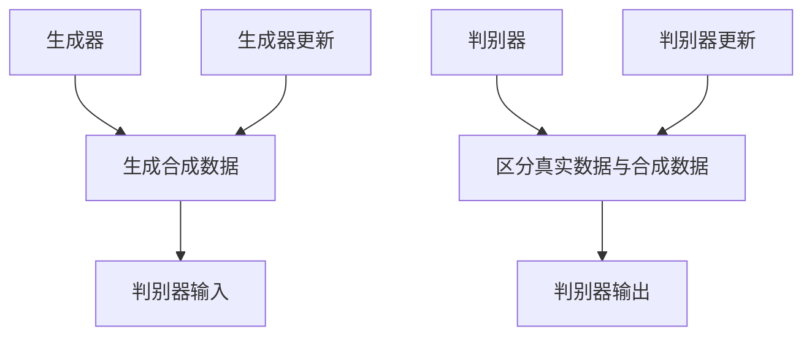
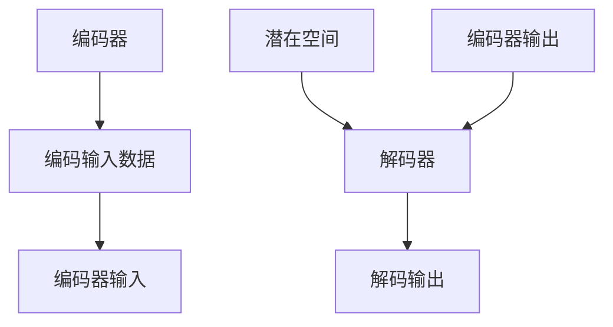

                 

# 文章标题：合成数据在AI训练中的应用前景

> 关键词：合成数据，AI训练，生成对抗网络，变分自编码器，数据隐私，伦理问题

> 摘要：
本文将探讨合成数据在人工智能（AI）训练中的广泛应用前景。合成数据是一种通过生成模型人工构造的数据集，它能够模拟真实数据并增强训练效果。文章将首先介绍合成数据的基础知识，包括其定义、生成技术、类型和应用领域。随后，将深入分析合成数据在AI训练中的优势、挑战以及具体应用案例。最后，文章将探讨合成数据技术的发展趋势、伦理与法律问题，并总结合成数据在AI领域的应用前景。

## 目录

1. **引言**
   - 合成数据的定义与重要性
   - 本文目标

2. **合成数据的基础知识**
   - 定义与重要性
   - 应用领域
   - 合成数据的类型

3. **合成数据的生成技术**
   - 生成对抗网络（GAN）
   - 变分自编码器（VAE）
   - 其他生成方法

4. **合成数据在AI训练中的优势**
   - 提高模型泛化能力
   - 缓解数据稀缺问题
   - 数据隐私保护

5. **合成数据在AI训练中的挑战**
   - 数据质量问题
   - 合成数据与真实数据的平衡
   - 合成数据的可解释性

6. **合成数据在AI训练中的应用案例**
   - 图像识别
   - 自然语言处理
   - 音频识别

7. **合成数据的技术趋势与发展**
   - 当前技术状况
   - 未来发展方向
   - 未来应用前景

8. **合成数据的伦理与法律问题**
   - 伦理问题
   - 法律问题
   - 监管措施

9. **结论**
   - 合成数据的重要性
   - 应用前景

## 引言

### 合成数据的定义与重要性

合成数据，又称生成数据或伪造数据，是指通过算法生成的人工构造的数据集。这些数据模拟了真实世界中的数据分布，能够用于训练、测试和评估人工智能模型。合成数据的重要性在于，它能够解决真实数据稀缺、数据标注成本高昂和数据隐私保护等难题，从而提升AI模型的训练效果和应用范围。

### 本文目标

本文的目标是系统地探讨合成数据在人工智能训练中的应用前景。文章将首先介绍合成数据的基础知识，包括其定义、生成技术和类型。接着，将深入分析合成数据在AI训练中的优势、挑战和应用案例。最后，文章将探讨合成数据的发展趋势、伦理与法律问题，并总结合成数据在AI领域的应用前景。

## 合成数据的基础知识

### 定义与重要性

合成数据是指通过生成模型（如生成对抗网络GAN、变分自编码器VAE等）构建的数据集，它能够模仿真实数据的分布。合成数据的重要性体现在以下几个方面：

1. **解决数据稀缺问题**：真实数据的获取和标注往往需要大量的时间和资源，而合成数据可以模拟真实数据，从而缓解数据稀缺的问题。
2. **提高模型泛化能力**：通过生成多样化的合成数据，可以增强模型的泛化能力，使其在未知数据上的表现更佳。
3. **数据隐私保护**：合成数据可以用来替代真实数据，从而在保护用户隐私的同时，进行模型训练和评估。

### 应用领域

合成数据在多个领域都有广泛的应用，包括但不限于：

1. **图像识别**：通过生成大量的合成图像，可以提高图像识别模型的训练效果和泛化能力。
2. **自然语言处理**：合成文本数据可以用于训练和评估自然语言处理模型，如语言模型、机器翻译和文本分类。
3. **音频识别**：合成音频数据可以用于训练和评估语音识别模型，包括语音分类、说话人识别和语音合成。
4. **医疗领域**：合成医学图像和病历数据可以用于训练和评估医疗诊断模型，如肿瘤检测、心脏病诊断等。

### 合成数据的类型

合成数据可以分为以下几类：

1. **图像合成数据**：通过生成对抗网络（GAN）等生成模型生成的图像数据。
2. **文本合成数据**：通过自然语言生成模型（如GPT）生成的文本数据。
3. **音频合成数据**：通过生成模型生成的音频数据，如语音合成、音乐生成等。
4. **时空数据合成**：通过时空生成模型生成的包含时间和空间信息的合成数据。

## 合成数据的生成技术

合成数据的核心在于生成技术，这些技术能够通过算法生成具有真实数据分布的合成数据。以下将介绍几种主要的合成数据生成技术。

### 生成对抗网络（GAN）

生成对抗网络（GAN）是一种通过对抗训练生成数据的模型，它由生成器和判别器两个部分组成。生成器负责生成模拟真实数据的合成数据，而判别器则负责区分合成数据和真实数据。GAN的训练目标是使生成器的输出数据足够逼真，以至于判别器无法准确区分。GAN的优点在于其强大的生成能力，可以生成高质量、多样化的合成数据。

#### Mermaid流程图



#### 伪代码

```python
# 伪代码：生成对抗网络（GAN）

# 定义生成器和判别器
generator = define_generator()
discriminator = define_discriminator()

# 训练生成器和判别器
for epoch in range(num_epochs):
    for data in dataset:
        # 训练判别器
        discriminator_loss = train_discriminator(discriminator, data)
        
        # 训练生成器
        generator_loss = train_generator(generator, discriminator)
        
        # 记录训练过程
        print(f"Epoch {epoch}: Generator Loss = {generator_loss}, Discriminator Loss = {discriminator_loss}")
```

### 变分自编码器（VAE）

变分自编码器（VAE）是一种基于概率模型的生成模型，它通过编码器和解码器两个部分来生成数据。编码器将输入数据编码为一个潜在空间中的向量，解码器则从潜在空间中生成输出数据。VAE的优点在于其能够生成具有潜在结构的数据，从而更好地保持数据的分布。

#### Mermaid流程图



#### 伪代码

```python
# 伪代码：变分自编码器（VAE）

# 定义编码器和解码器
encoder = define_encoder()
decoder = define_decoder()

# 训练VAE
for epoch in range(num_epochs):
    for data in dataset:
        # 训练编码器和解码器
        reconstruction_loss = train_vae(encoder, decoder, data)
        
        # 记录训练过程
        print(f"Epoch {epoch}: Reconstruction Loss = {reconstruction_loss}")
```

### 其他生成方法

除了GAN和VAE，还有其他一些生成方法，如条件生成网络（CGenerative Adversarial Nets）和强化学习生成数据等。条件生成网络（C-GAN）通过在生成器和判别器中引入条件信息，可以生成更加具体和有意义的合成数据。强化学习生成数据则利用强化学习算法生成具有特定目标的数据。

## 合成数据在AI训练中的优势

合成数据在AI训练中具有显著的优势，以下将详细探讨这些优势。

### 提高模型泛化能力

合成数据能够生成多样化的数据集，从而提高模型的泛化能力。通过合成数据，模型可以在更广泛的环境中进行训练，从而减少对特定数据分布的依赖，增强在未知数据上的表现。例如，通过生成大量的合成图像，可以训练图像识别模型在更多样化的场景中识别物体。

### 缓解数据稀缺问题

真实数据的获取和标注往往需要大量时间和资源，而合成数据可以替代部分真实数据，从而缓解数据稀缺的问题。特别是在医疗领域，合成医学图像可以用于训练和评估诊断模型，而不必依赖真实的医疗数据。

### 数据隐私保护

合成数据可以用来替代真实数据，从而在保护用户隐私的同时进行模型训练和评估。例如，在金融领域，合成交易数据可以用于训练欺诈检测模型，而不必泄露真实的交易数据。

## 合成数据在AI训练中的挑战

尽管合成数据在AI训练中具有显著的优势，但也面临一些挑战。

### 数据质量问题

合成数据的质量直接影响模型的训练效果。如果合成数据质量较差，模型可能会学到错误的特征，从而影响其泛化能力。因此，如何评估和保证合成数据的质量是一个重要的挑战。

### 合成数据与真实数据的平衡

合成数据虽然可以模拟真实数据的分布，但与真实数据之间存在差异。如何确保合成数据与真实数据的平衡，以避免模型过度依赖合成数据，是一个需要解决的问题。

### 合成数据的可解释性

合成数据通常是通过复杂的生成模型生成的，其生成过程和内部结构可能难以解释。因此，如何提高合成数据的可解释性，使其能够更好地与人类理解和交互，是一个重要的挑战。

## 合成数据在AI训练中的应用案例

合成数据在AI训练中有着广泛的应用案例，以下将介绍一些具体的案例。

### 图像识别

在图像识别领域，合成数据可以用于生成多样化的图像，从而提高模型在现实世界中的应用能力。例如，通过生成不同的场景、光照条件和物体姿态，可以训练图像识别模型在更复杂的场景下识别物体。

### 自然语言处理

在自然语言处理领域，合成文本数据可以用于训练和评估语言模型、机器翻译和文本分类等任务。通过生成具有真实文本特征的合成数据，可以提高模型在处理真实文本时的表现。

### 音频识别

在音频识别领域，合成音频数据可以用于训练和评估语音识别模型，包括语音分类、说话人识别和语音合成等任务。通过生成具有真实语音特征的合成数据，可以提高模型在处理真实语音时的准确性。

## 合成数据的技术趋势与发展

合成数据技术在不断发展，以下将探讨当前的技术状况、未来的发展方向以及未来的应用前景。

### 当前技术状况

目前，生成对抗网络（GAN）、变分自编码器（VAE）等生成模型在合成数据技术中占据主导地位。这些模型通过对抗训练和概率模型生成数据，具有强大的生成能力。同时，随着深度学习技术的发展，合成数据生成模型的性能和效率也在不断提高。

### 未来发展方向

未来，合成数据技术的发展方向包括：

1. **更高效、更稳定的生成模型**：研究者将继续优化GAN、VAE等生成模型，以提高生成数据的效率和稳定性。
2. **多模态合成数据**：随着AI技术的发展，合成数据将涵盖更多的模态，如视频、语音和三维数据等。
3. **个性化合成数据**：通过引入个性化特征，生成更符合特定用户需求的合成数据。

### 未来的应用前景

未来，合成数据在AI训练中将具有更广泛的应用前景，包括：

1. **自动化数据生成**：合成数据将实现自动化生成，无需依赖真实数据，从而降低数据获取和标注的成本。
2. **更高效的模型训练**：合成数据将提高模型训练的效率，缩短训练周期。
3. **个性化AI应用**：通过生成个性化合成数据，实现更加精准和个性化的AI应用。

## 合成数据的伦理与法律问题

合成数据在AI训练中的应用不仅带来了技术上的挑战，也引发了一系列伦理和法律问题。

### 伦理问题

1. **隐私保护**：合成数据在生成过程中可能涉及个人隐私信息的泄露，需要确保数据隐私保护。
2. **公平性**：合成数据可能无法完全代表真实数据的分布，可能导致模型在特定群体上的不公平表现。
3. **透明性**：合成数据的生成过程和决策机制可能不够透明，影响模型的可解释性和信任度。

### 法律问题

1. **数据版权**：合成数据的生成可能涉及对真实数据的复制和模仿，可能引发版权纠纷。
2. **真实性判断**：在法律诉讼中，如何判断合成数据的真实性可能成为难题。
3. **责任归属**：在合成数据引发的错误决策中，如何确定责任归属需要明确。

### 监管措施

为解决合成数据引发的伦理和法律问题，需要采取以下监管措施：

1. **数据隐私保护**：制定严格的隐私保护法规，确保合成数据生成过程中的个人隐私不被泄露。
2. **数据质量监管**：建立数据质量评估标准，确保合成数据的质量和可靠性。
3. **透明度要求**：要求合成数据的生成过程和决策机制公开透明，提高模型的可解释性和信任度。
4. **法律责任的明确**：明确合成数据在法律诉讼中的责任归属，确保公平公正。

## 结论

合成数据在AI训练中的应用前景广阔，它能够解决真实数据稀缺、数据标注成本高昂和数据隐私保护等难题，从而提升AI模型的训练效果和应用范围。然而，合成数据在生成、使用和监管等方面仍面临一系列挑战。为了充分发挥合成数据的优势，我们需要不断创新和完善合成数据生成技术，同时关注其伦理和法律问题，确保其在AI训练中的安全和可持续发展。未来，合成数据将在推动人工智能技术进步和产业应用中发挥重要作用。作者：AI天才研究院/AI Genius Institute & 禅与计算机程序设计艺术 /Zen And The Art of Computer Programming

---

本文详细探讨了合成数据在AI训练中的应用前景。从基础知识的介绍到生成技术的分析，再到合成数据在AI训练中的优势、挑战和应用案例，本文为读者提供了一个全面的视角。同时，本文也探讨了合成数据的发展趋势、伦理与法律问题，并提出了相应的监管措施。通过本文的阅读，读者可以更好地理解合成数据在AI训练中的重要性及其应用前景。未来，合成数据将在推动人工智能技术的发展和产业应用中发挥关键作用。作者：AI天才研究院/AI Genius Institute & 禅与计算机程序设计艺术 /Zen And The Art of Computer Programming。读者可以通过拓展阅读进一步了解相关技术和应用。

