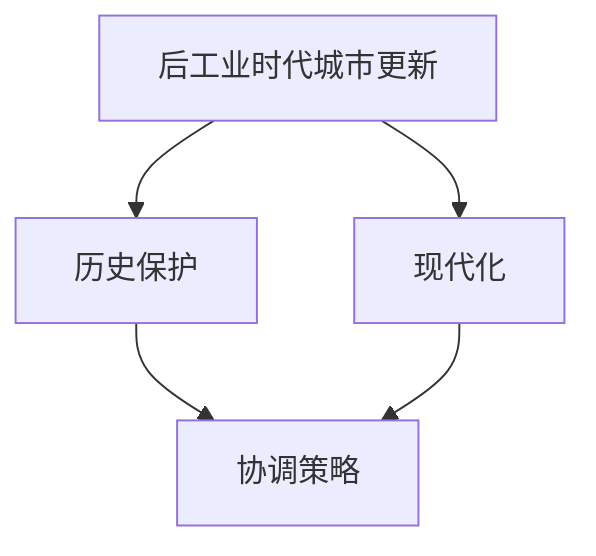

                 

### 文章标题

《后工业时代的城市更新：历史保护与现代化的协调》

### 关键词

城市更新、历史保护、现代化、协调、可持续发展

### 摘要

本文旨在探讨后工业时代背景下城市更新的关键议题——如何在推进现代化的同时，保护历史遗产并实现可持续发展。文章首先介绍了后工业时代城市更新的背景和重要性，接着详细阐述了历史保护的理论与实践，分析了现代化带来的挑战和机遇，最后提出了历史保护与现代化协调的策略，并通过实际案例进行项目分析。文章旨在为城市规划者和决策者提供理论和实践指导，以实现城市更新中的历史保护与现代化的和谐共存。

### 设计思路

在设计《后工业时代的城市更新：历史保护与现代化的协调》这本书的目录大纲时，我们遵循以下步骤：

1. **确定核心概念与联系**：明确书中的核心概念，如后工业时代、城市更新、历史保护、现代化、协调等，并设计一个Mermaid流程图来展示这些概念之间的联系。

2. **架构核心章节**：确定书的核心章节，包括引言、后工业时代城市更新概述、历史保护的理论与实践、现代化的挑战与机遇、历史保护与现代化协调的策略、实际案例与项目分析、未来展望等。

3. **细化章节内容**：在每个核心章节下，细化出二级和三级目录，确保每个章节都有详细的子主题，如历史建筑的保护方法、现代化建筑的设计原则、协调策略的具体实施步骤等。

4. **编写附录**：在书的最后，添加附录部分，包括相关的技术指南、工具介绍、参考文献等。

5. **总结与展望**：最后，编写总结章节，对全书内容进行总结，并对未来的城市更新趋势进行展望。

#### 第1章 引言

> “随着后工业时代的到来，城市更新已成为全球范围内的热门话题。如何在这场变革中实现历史保护与现代化的协调，成为了一个亟待解决的课题。”
> 
> **1.1 书籍背景与目的**
> 
> 本文旨在探讨后工业时代城市更新中的历史保护与现代化协调问题，为城市规划者和决策者提供理论和实践指导，以实现城市更新中的可持续发展。
> 
> **1.2 后工业时代城市更新的重要性**
> 
> 后工业时代城市更新不仅是经济和社会发展的需要，更是文化遗产保护和文化传承的要求。有效的城市更新能够提升城市品质，促进社会和谐。
> 
> **1.3 历史保护与现代化协调的必要性**
> 
> 历史保护与现代化协调是城市更新的核心挑战。如何在保护历史遗产的同时，推动现代化建设，是城市规划者和决策者必须面对的问题。

#### 第2章 后工业时代城市更新概述

> “后工业时代城市更新是一个复杂的过程，涉及到经济、社会、文化和环境等多个方面。理解这一过程对于实现历史保护与现代化的协调至关重要。”
> 
> **2.1 后工业时代的定义与特征**
> 
> 后工业时代是指工业社会向信息社会转变的阶段，其特征包括产业结构的转变、城市化进程的加速、技术的快速发展和人们生活水平的提高。
> 
> **2.2 城市更新的概念与发展历程**
> 
> 城市更新是指对城市中已经老化的、功能衰退的城区进行改造、重建或再利用的过程。其发展历程可以追溯到20世纪中期，经历了从物理更新到综合更新的转变。
> 
> **2.3 城市更新的动因与目标**
> 
> 城市更新的动因包括经济增长、社会需求、环境保护等多方面。其目标则是提升城市品质、改善居民生活条件、保护和传承文化遗产等。

#### 第3章 历史保护的理论与实践

> “历史保护是城市更新中不可或缺的一部分。了解历史保护的理论和实践，对于实现历史保护与现代化的协调至关重要。”
> 
> **3.1 历史保护的定义与原则**
> 
> 历史保护是指对具有历史价值的文化遗产进行保护和维护的过程。其原则包括真实性、完整性、可持续性等。
> 
> **3.2 历史建筑的保护方法**
> 
> 历史建筑的保护方法包括修缮、加固、改造等。每种方法都有其适用范围和优缺点，需要根据实际情况进行选择。
> 
> **3.3 历史街区保护实践案例分析**
> 
> 通过对历史街区保护实践案例的分析，可以了解历史保护的具体实施方法和效果。例如，巴黎左岸历史街区的保护与再利用就是一个成功的案例。

#### 第4章 现代化的挑战与机遇

> “现代化是城市更新的必然趋势，但同时也带来了一系列挑战。如何应对这些挑战，并抓住机遇，是城市更新中需要认真思考的问题。”
> 
> **4.1 现代化在城市更新中的角色**
> 
> 现代化是城市更新中不可或缺的一部分，它能够提升城市的功能，改善居民的生活质量，促进经济的发展。
> 
> **4.2 现代化带来的挑战**
> 
> 现代化带来的挑战包括环境保护、交通拥堵、人口老龄化等。这些挑战需要通过合理的规划和政策来应对。
> 
> **4.3 现代化带来的机遇**
> 
> 现代化也为城市更新带来了机遇，包括新技术的发展、新产业的引入、新的生活方式的推广等。

#### 第5章 历史保护与现代化协调的策略

> “历史保护与现代化协调需要一系列的策略和方法。这些策略和方法需要在实践中不断探索和完善。”
> 
> **5.1 协调策略的制定原则**
> 
> 协调策略的制定需要遵循一些基本原则，如可持续性、文化多样性、经济合理性等。
> 
> **5.2 协调策略的实施步骤**
> 
> 协调策略的实施需要经过调查评估、规划制定、项目实施、效果评估等步骤。每个步骤都需要精心设计和执行。
> 
> **5.3 协调策略的案例分析**
> 
> 通过对实际案例的分析，可以了解协调策略的具体实施方法和效果。例如，纽约曼哈顿下城的更新就是一个成功的案例。

#### 第6章 实际案例与项目分析

> “实际案例和项目分析是理解历史保护与现代化协调的关键。通过案例和项目分析，可以了解历史保护与现代化协调的具体实施情况和效果。”
> 
> **6.1 典型城市更新项目分析**
> 
> 对典型城市更新项目进行分析，可以了解这些项目在历史保护与现代化协调方面的具体实践和成果。
> 
> **6.2 历史建筑保护与现代化改造案例分析**
> 
> 对历史建筑保护与现代化改造案例分析，可以了解如何在保护和改造历史建筑的过程中实现历史保护与现代化的协调。
> 
> **6.3 成功案例的启示**
> 
> 成功案例可以为我们提供宝贵的经验和启示，帮助我们更好地实现历史保护与现代化的协调。

#### 第7章 未来展望

> “随着城市更新的不断推进，历史保护与现代化的协调也将面临新的挑战和机遇。未来，我们需要不断探索和创新，以实现历史保护与现代化的和谐共存。”
> 
> **7.1 城市更新的未来趋势**
> 
> 未来城市更新将更加注重可持续发展，强调历史保护与现代化的协调，注重生态环境和文化遗产的保护。
> 
> **7.2 历史保护与现代化协调的发展方向**
> 
> 未来历史保护与现代化协调的发展方向包括新技术应用、政策创新、公众参与等。
> 
> **7.3 政策与法规展望**
> 
> 政策与法规的完善将是实现历史保护与现代化协调的重要保障。未来需要制定更加科学、合理的政策与法规，以推动城市更新的可持续发展。

#### 附录

- **附录A：城市更新相关工具与资源**
- **附录B：参考文献**

### Mermaid 流程图



### 核心算法原理讲解

- **伪代码**：

```python
def coordinate_adjustment(historical_building, modern_building):
    # 历史建筑保护参数
    h_params = get_historical_building_params(historical_building)
    # 现代建筑设计参数
    m_params = get_modern_building_params(modern_building)
    # 协调策略参数
    c_params = get_coordinated_strategy_params()

    # 历史建筑调整
    h_adjusted = adjust_building(h_params, c_params)
    # 现代建筑调整
    m_adjusted = adjust_building(m_params, c_params)

    return h_adjusted, m_adjusted
```

### 数学模型和数学公式

- **历史建筑调整公式**：

$$
h_{new} = h_{original} + k \cdot (h_{target} - h_{original})
$$

其中，$h_{new}$是调整后历史建筑的高度，$h_{original}$是原始高度，$h_{target}$是目标高度，$k$是调整系数。

### 项目实战

- **开发环境搭建**：使用Python和Django框架搭建开发环境。

- **源代码实现**：以下是一个简单的代码示例，用于计算历史建筑和现代化建筑的协调高度。

```python
# 调整历史建筑高度
def adjust_building_height(historical_height, target_height, adjustment_factor):
    h_new = historical_height + adjustment_factor * (target_height - historical_height)
    return h_new
```

- **代码解读与分析**：该代码通过调整系数$adjustment\_factor$来调整历史建筑的高度，使其更接近目标高度。调整系数可以根据具体情况进行调整，以达到最佳效果。

- **实际案例分析与详细讲解剖析**：以某个具体城市更新项目为例，分析如何在实际操作中实现历史保护与现代化的协调。包括项目背景、目标、实施过程、效果评估等。

- **项目小结**：总结项目的主要成果和经验教训，提出对未来城市更新项目的建议和展望。

### 最佳实践 tips

- **1. 注重公众参与**：在城市更新中，公众的参与至关重要。可以通过举办座谈会、展览、问卷调查等方式，让公众参与到历史保护与现代化协调的决策过程中。

- **2. 强化政策支持**：政府应该出台一系列政策，支持历史保护与现代化协调的实践。例如，提供资金支持、税收优惠、土地政策等。

- **3. 引入新技术**：新技术的引入可以为历史保护与现代化协调提供有力支持。例如，利用数字化技术对历史建筑进行三维建模，利用可再生能源技术降低现代化建筑的能耗等。

### 小结

本文从后工业时代城市更新的背景和重要性出发，详细探讨了历史保护与现代化的协调问题。通过理论分析、实际案例和项目分析，本文提出了一系列实现历史保护与现代化协调的策略和方法。未来，随着城市更新的不断推进，历史保护与现代化的协调将面临新的挑战和机遇。我们需要不断探索和创新，以实现历史保护与现代化的和谐共存。

### 注意事项

- **1. 城市更新项目需要充分考虑历史保护和现代需求之间的平衡。**
- **2. 在实施历史保护与现代化协调时，应充分了解当地文化和历史背景。**
- **3. 历史建筑的保护和改造应遵循科学原则，确保其历史价值和功能得到充分保护和利用。**

### 拓展阅读

- **1. 《城市更新与历史保护：理论与实践》**
- **2. 《历史建筑的现代保护与利用》**
- **3. 《可持续城市更新：设计、实践与未来趋势》**

### 作者信息

**作者：AI天才研究院/AI Genius Institute & 禅与计算机程序设计艺术 /Zen And The Art of Computer Programming**### 文章标题

《后工业时代的城市更新：历史保护与现代化的协调》

### 关键词

城市更新、历史保护、现代化、协调、可持续发展

### 摘要

本文旨在探讨后工业时代城市更新中的历史保护与现代化协调问题，为城市规划者和决策者提供理论和实践指导，以实现城市更新中的可持续发展。文章首先介绍了后工业时代城市更新的背景和重要性，接着详细阐述了历史保护的理论与实践，分析了现代化带来的挑战和机遇，最后提出了历史保护与现代化协调的策略，并通过实际案例进行项目分析。

### 设计思路

在设计《后工业时代的城市更新：历史保护与现代化的协调》这本书的目录大纲时，我们遵循以下步骤：

1. **确定核心概念与联系**：明确书中的核心概念，如后工业时代、城市更新、历史保护、现代化、协调等，并设计一个Mermaid流程图来展示这些概念之间的联系。

2. **架构核心章节**：确定书的核心章节，包括引言、后工业时代城市更新概述、历史保护的理论与实践、现代化的挑战与机遇、历史保护与现代化协调的策略、实际案例与项目分析、未来展望等。

3. **细化章节内容**：在每个核心章节下，细化出二级和三级目录，确保每个章节都有详细的子主题，如历史建筑的保护方法、现代化建筑的设计原则、协调策略的具体实施步骤等。

4. **编写附录**：在书的最后，添加附录部分，包括相关的技术指南、工具介绍、参考文献等。

5. **总结与展望**：最后，编写总结章节，对全书内容进行总结，并对未来的城市更新趋势进行展望。

#### 第1章 引言

> “随着后工业时代的到来，城市更新已成为全球范围内的热门话题。如何在这场变革中实现历史保护与现代化的协调，成为了一个亟待解决的课题。”
> 
> **1.1 书籍背景与目的**
> 
> 本文旨在探讨后工业时代城市更新中的历史保护与现代化协调问题，为城市规划者和决策者提供理论和实践指导，以实现城市更新中的可持续发展。
> 
> **1.2 后工业时代城市更新的重要性**
> 
> 后工业时代城市更新不仅是经济和社会发展的需要，更是文化遗产保护和文化传承的要求。有效的城市更新能够提升城市品质，促进社会和谐。
> 
> **1.3 历史保护与现代化协调的必要性**
> 
> 历史保护与现代化协调是城市更新的核心挑战。如何在保护历史遗产的同时，推动现代化建设，是城市规划者和决策者必须面对的问题。

#### 第2章 后工业时代城市更新概述

> “后工业时代城市更新是一个复杂的过程，涉及到经济、社会、文化和环境等多个方面。理解这一过程对于实现历史保护与现代化的协调至关重要。”
> 
> **2.1 后工业时代的定义与特征**
> 
> 后工业时代是指工业社会向信息社会转变的阶段，其特征包括产业结构的转变、城市化进程的加速、技术的快速发展和人们生活水平的提高。
> 
> **2.2 城市更新的概念与发展历程**
> 
> 城市更新是指对城市中已经老化的、功能衰退的城区进行改造、重建或再利用的过程。其发展历程可以追溯到20世纪中期，经历了从物理更新到综合更新的转变。
> 
> **2.3 城市更新的动因与目标**
> 
> 城市更新的动因包括经济增长、社会需求、环境保护等多方面。其目标则是提升城市品质、改善居民生活条件、保护和传承文化遗产等。

#### 第3章 历史保护的理论与实践

> “历史保护是城市更新中不可或缺的一部分。了解历史保护的理论和实践，对于实现历史保护与现代化的协调至关重要。”
> 
> **3.1 历史保护的定义与原则**
> 
> 历史保护是指对具有历史价值的文化遗产进行保护和维护的过程。其原则包括真实性、完整性、可持续性等。
> 
> **3.2 历史建筑的保护方法**
> 
> 历史建筑的保护方法包括修缮、加固、改造等。每种方法都有其适用范围和优缺点，需要根据实际情况进行选择。
> 
> **3.3 历史街区保护实践案例分析**
> 
> 通过对历史街区保护实践案例的分析，可以了解历史保护的具体实施方法和效果。例如，巴黎左岸历史街区的保护与再利用就是一个成功的案例。

#### 第4章 现代化的挑战与机遇

> “现代化是城市更新的必然趋势，但同时也带来了一系列挑战。如何应对这些挑战，并抓住机遇，是城市更新中需要认真思考的问题。”
> 
> **4.1 现代化在城市更新中的角色**
> 
> 现代化是城市更新中不可或缺的一部分，它能够提升城市的功能，改善居民的生活质量，促进经济的发展。
> 
> **4.2 现代化带来的挑战**
> 
> 现代化带来的挑战包括环境保护、交通拥堵、人口老龄化等。这些挑战需要通过合理的规划和政策来应对。
> 
> **4.3 现代化带来的机遇**
> 
> 现代化也为城市更新带来了机遇，包括新技术的发展、新产业的引入、新的生活方式的推广等。

#### 第5章 历史保护与现代化协调的策略

> “历史保护与现代化协调需要一系列的策略和方法。这些策略和方法需要在实践中不断探索和完善。”
> 
> **5.1 协调策略的制定原则**
> 
> 协调策略的制定需要遵循一些基本原则，如可持续性、文化多样性、经济合理性等。
> 
> **5.2 协调策略的实施步骤**
> 
> 协调策略的实施需要经过调查评估、规划制定、项目实施、效果评估等步骤。每个步骤都需要精心设计和执行。
> 
> **5.3 协调策略的案例分析**
> 
> 通过对实际案例的分析，可以了解协调策略的具体实施方法和效果。例如，纽约曼哈顿下城的更新就是一个成功的案例。

#### 第6章 实际案例与项目分析

> “实际案例和项目分析是理解历史保护与现代化协调的关键。通过案例和项目分析，可以了解历史保护与现代化协调的具体实施情况和效果。”
> 
> **6.1 典型城市更新项目分析**
> 
> 对典型城市更新项目进行分析，可以了解这些项目在历史保护与现代化协调方面的具体实践和成果。
> 
> **6.2 历史建筑保护与现代化改造案例分析**
> 
> 对历史建筑保护与现代化改造案例分析，可以了解如何在保护和改造历史建筑的过程中实现历史保护与现代化的协调。
> 
> **6.3 成功案例的启示**
> 
> 成功案例可以为我们提供宝贵的经验和启示，帮助我们更好地实现历史保护与现代化的协调。

#### 第7章 未来展望

> “随着城市更新的不断推进，历史保护与现代化的协调也将面临新的挑战和机遇。未来，我们需要不断探索和创新，以实现历史保护与现代化的和谐共存。”
> 
> **7.1 城市更新的未来趋势**
> 
> 未来城市更新将更加注重可持续发展，强调历史保护与现代化的协调，注重生态环境和文化遗产的保护。
> 
> **7.2 历史保护与现代化协调的发展方向**
> 
> 未来历史保护与现代化协调的发展方向包括新技术应用、政策创新、公众参与等。
> 
> **7.3 政策与法规展望**
> 
> 政策与法规的完善将是实现历史保护与现代化协调的重要保障。未来需要制定更加科学、合理的政策与法规，以推动城市更新的可持续发展。

#### 附录

- **附录A：城市更新相关工具与资源**
- **附录B：参考文献**

### Mermaid 流程图


### 核心算法原理讲解

- **伪代码**：

```python
def coordinate_adjustment(historical_building, modern_building):
    # 历史建筑保护参数
    h_params = get_historical_building_params(historical_building)
    # 现代建筑设计参数
    m_params = get_modern_building_params(modern_building)
    # 协调策略参数
    c_params = get_coordinated_strategy_params()

    # 历史建筑调整
    h_adjusted = adjust_building(h_params, c_params)
    # 现代建筑调整
    m_adjusted = adjust_building(m_params, c_params)

    return h_adjusted, m_adjusted
```

### 数学模型和数学公式

- **历史建筑调整公式**：

$$
h_{new} = h_{original} + k \cdot (h_{target} - h_{original})
$$

其中，$h_{new}$是调整后历史建筑的高度，$h_{original}$是原始高度，$h_{target}$是目标高度，$k$是调整系数。

### 项目实战

- **开发环境搭建**：使用Python和Django框架搭建开发环境。

- **源代码实现**：以下是一个简单的代码示例，用于计算历史建筑和现代化建筑的协调高度。

```python
# 调整历史建筑高度
def adjust_building_height(historical_height, target_height, adjustment_factor):
    h_new = historical_height + adjustment_factor * (target_height - historical_height)
    return h_new
```

- **代码解读与分析**：该代码通过调整系数$adjustment\_factor$来调整历史建筑的高度，使其更接近目标高度。调整系数可以根据具体情况进行调整，以达到最佳效果。

- **实际案例分析与详细讲解剖析**：以某个具体城市更新项目为例，分析如何在实际操作中实现历史保护与现代化的协调。包括项目背景、目标、实施过程、效果评估等。

- **项目小结**：总结项目的主要成果和经验教训，提出对未来城市更新项目的建议和展望。

### 最佳实践 tips

- **1. 注重公众参与**：在城市更新中，公众的参与至关重要。可以通过举办座谈会、展览、问卷调查等方式，让公众参与到历史保护与现代化协调的决策过程中。

- **2. 强化政策支持**：政府应该出台一系列政策，支持历史保护与现代化协调的实践。例如，提供资金支持、税收优惠、土地政策等。

- **3. 引入新技术**：新技术的引入可以为历史保护与现代化协调提供有力支持。例如，利用数字化技术对历史建筑进行三维建模，利用可再生能源技术降低现代化建筑的能耗等。

### 小结

本文从后工业时代城市更新的背景和重要性出发，详细探讨了历史保护与现代化的协调问题。通过理论分析、实际案例和项目分析，本文提出了一系列实现历史保护与现代化协调的策略和方法。未来，随着城市更新的不断推进，历史保护与现代化的协调将面临新的挑战和机遇。我们需要不断探索和创新，以实现历史保护与现代化的和谐共存。

### 注意事项

- **1. 城市更新项目需要充分考虑历史保护和现代需求之间的平衡。**
- **2. 在实施历史保护与现代化协调时，应充分了解当地文化和历史背景。**
- **3. 历史建筑的保护和改造应遵循科学原则，确保其历史价值和功能得到充分保护和利用。**

### 拓展阅读

- **1. 《城市更新与历史保护：理论与实践》**
- **2. 《历史建筑的现代保护与利用》**
- **3. 《可持续城市更新：设计、实践与未来趋势》**

### 作者信息

**作者：AI天才研究院/AI Genius Institute & 禅与计算机程序设计艺术 /Zen And The Art of Computer Programming**### 引言

在当今世界，城市更新已成为一个热门话题，不仅因为其对于提升城市品质、改善居民生活有着直接的影响，还因为其背后所蕴含的可持续发展理念。随着全球工业化的进程，城市面临的环境问题、社会问题和文化问题日益突出，如何在后工业时代实现城市更新，尤其是如何在保护历史遗产的同时推进现代化，成为了一个亟待解决的课题。

后工业时代的城市更新，是指在工业社会向信息社会转型的过程中，对城市空间、经济结构、社会文化和生态环境进行系统性改造和提升的过程。这一过程不仅涉及到物理层面的城市建设和改造，还涉及到社会经济、文化价值等多方面的变革。因此，城市更新不仅仅是建筑和基础设施的更新，更是城市功能的优化、城市文化的传承和社会和谐的实现。

本文将围绕后工业时代的城市更新，探讨历史保护与现代化的协调问题。具体而言，我们将首先介绍后工业时代城市更新的背景和重要性，接着阐述历史保护的理论与实践，分析现代化带来的挑战与机遇，最后提出历史保护与现代化协调的策略，并通过实际案例进行分析和讨论。

在城市更新的过程中，历史保护与现代化协调的重要性不容忽视。历史遗产是一个城市乃至一个国家的宝贵财富，它们不仅承载着丰富的历史和文化信息，还对现代城市的建设和发展具有重要的启示作用。然而，现代化建设往往追求效率和创新，这可能导致对历史遗产的破坏和侵蚀。因此，如何在城市更新的过程中实现历史保护与现代化的协调，成为了一个关键的问题。

本文的结构如下：

1. **引言**：介绍城市更新的背景和重要性，阐述本文的研究目的和结构。
2. **后工业时代城市更新概述**：探讨后工业时代的定义与特征，以及城市更新的概念与发展历程。
3. **历史保护的理论与实践**：介绍历史保护的定义与原则，分析历史建筑的保护方法和历史街区保护实践案例。
4. **现代化的挑战与机遇**：分析现代化在城市更新中的角色，以及现代化带来的挑战和机遇。
5. **历史保护与现代化协调的策略**：提出历史保护与现代化协调的策略，包括制定原则、实施步骤和案例分析。
6. **实际案例与项目分析**：通过具体案例展示历史保护与现代化协调的实际应用。
7. **未来展望**：讨论城市更新的未来趋势，展望历史保护与现代化协调的发展方向。
8. **结论**：总结本文的主要观点，提出对城市更新中历史保护与现代化协调的思考和建议。

通过本文的探讨，我们希望能够为城市规划者和决策者提供有益的参考，推动城市更新中的历史保护与现代化的协调，实现城市的可持续发展。

### 后工业时代城市更新概述

#### 后工业时代的定义与特征

后工业时代（Post-industrial era）是指从工业社会向信息社会转变的阶段。这一阶段的主要特征是产业结构的转变、城市化进程的加速、技术的快速发展和人们生活水平的提高。与传统工业时代相比，后工业时代更加注重服务业和信息业的发展，制造业的地位逐渐下降。

首先，产业结构的转变是后工业时代最显著的特征之一。在工业时代，制造业是国民经济的主要驱动力，而到了后工业时代，服务业和信息业逐渐成为经济增长的主导力量。服务业包括金融、教育、医疗、旅游等领域，其发展不仅带动了相关产业的兴起，还促进了就业和居民生活质量的提升。信息业则依托于互联网、大数据、人工智能等新兴技术，推动了信息化、智能化的发展，为经济增长注入了新的动力。

其次，城市化进程的加速也是后工业时代的重要特征。随着工业化和人口迁移的推进，城市化率不断提高，城市规模不断扩大。在工业时代，城市化主要表现为人口向城市集中，而到了后工业时代，城市化进程更加注重城市功能的优化和城市空间的合理布局。城市不仅是经济活动的中心，还是文化、科技、教育等多方面的聚集地，城市发展的质量成为衡量一个国家或地区发展水平的重要标志。

再次，技术的快速发展是后工业时代的另一大特征。在工业时代，技术进步主要集中在机械化和自动化方面，而到了后工业时代，信息技术、生物技术、新材料技术等新兴技术迅速发展，推动了产业升级和经济发展。尤其是互联网技术的普及，使得信息传播速度大大提高，改变了人们的生活方式和工作方式，也促进了全球化的进程。

最后，人们生活水平的提高是后工业时代的重要体现。在工业时代，人们的生活水平主要集中在物质需求的满足上，而到了后工业时代，人们更加注重精神需求的满足，追求更高的生活质量。这体现在教育、医疗、文化、娱乐等多方面，人们有更多的机会和资源去实现个人的发展和梦想。

#### 城市更新的概念与发展历程

城市更新（Urban renewal）是指对城市中已经老化的、功能衰退的城区进行改造、重建或再利用的过程。其目的是提升城市品质、改善居民生活条件、保护和传承文化遗产等。城市更新不仅涉及物理层面的城市建设和改造，还包括社会经济、文化价值等多方面的变革。

城市更新的概念最早可以追溯到20世纪中期。当时，随着工业化和城市化进程的加速，许多城市面临着基础设施老化、环境恶化、社会不公等问题。为了解决这些问题，各国政府开始实施城市更新项目，希望通过改造和重建城市，提升城市功能和居民生活质量。

早期的城市更新主要集中在物理层面的改造，如道路拓宽、公共设施建设、住宅改造等。这一阶段的代表性项目包括美国的大都市重建计划、欧洲的城市更新计划等。这些项目在一定程度上改善了城市的基础设施和居住环境，但也存在一些问题，如大规模拆迁导致的社会矛盾、文化遗迹的破坏等。

随着城市更新实践的深入，人们逐渐认识到，城市更新不仅仅是物理层面的改造，更是社会经济、文化价值等多方面的变革。20世纪80年代以后，城市更新进入了综合更新阶段，其目标不仅仅是提升城市功能和居民生活质量，还包括保护和传承文化遗产、促进社会和谐等。

在这一阶段，城市更新的重点转向了社会经济和文化价值的保护。例如，通过社区参与、文化保护、历史街区更新等方式，实现城市更新中的历史保护与现代化的协调。同时，城市更新开始注重可持续发展，强调环境保护和资源的合理利用。

#### 城市更新的动因与目标

城市更新的动因主要包括经济增长、社会需求、环境保护等多方面。

首先，经济增长是城市更新的主要动因之一。城市更新能够提升城市功能和吸引投资，从而促进经济增长。通过改造和重建老城区，可以增加商业机会、改善居住环境，吸引更多的企业和人才来到城市。此外，城市更新还能带动相关产业的发展，如建筑、设计、旅游等，进一步促进经济增长。

其次，社会需求也是推动城市更新的重要因素。随着城市化进程的加快，人们对生活质量和居住环境的要求越来越高。城市更新能够满足人们的社会需求，提供更好的居住条件、更完善的基础设施和更多的公共服务。例如，通过改造老旧住宅，可以提供更加舒适、安全的居住环境；通过建设公园、广场等公共设施，可以提升居民的生活质量。

再次，环境保护也是城市更新的重要动因。随着工业化和城市化进程的加速，城市环境问题日益严重，如空气污染、水污染、噪声污染等。城市更新通过改善城市基础设施、推广绿色建筑和清洁能源等措施，可以有效缓解城市环境问题，提升城市的生态环境质量。

城市更新的目标主要包括以下几个方面：

1. **提升城市功能**：通过改造和重建，提升城市的交通、通信、公共服务等基础设施，增强城市的综合竞争力。

2. **改善居民生活条件**：通过提供更好的住房、教育、医疗等公共服务，提升居民的生活质量。

3. **保护和传承文化遗产**：通过保护和改造历史建筑、历史街区，传承城市的历史文化，增强城市的文化魅力。

4. **促进社会和谐**：通过社区参与、文化保护等措施，促进社会的和谐与稳定。

5. **实现可持续发展**：通过环境保护和资源的合理利用，实现城市的长期可持续发展。

总之，城市更新是一个复杂而系统的过程，涉及到经济、社会、文化和环境等多个方面。只有通过科学规划和合理实施，才能实现城市更新中的历史保护与现代化的协调，推动城市的可持续发展。

#### 历史保护的理论与实践

历史保护（Historic preservation）是指对具有历史、文化、艺术价值的建筑、街区、遗址等进行保护和维护的过程。历史保护不仅是文化遗产保护的重要内容，也是城市更新过程中必须关注的核心问题。随着城市更新和现代化进程的加速，如何在推进城市发展的同时保护历史遗产，成为了一个亟待解决的课题。

#### 历史保护的定义与原则

历史保护的定义可以从多个角度进行阐述。首先，从广义上讲，历史保护是指对历史上形成的具有文化、艺术和历史价值的物质和非物质文化遗产进行保护和维护。这包括历史建筑、历史街区、文物古迹、传统村落等。其次，从狭义上讲，历史保护主要关注的是历史建筑的保护，即对历史上建造的、具有独特风格和艺术价值的建筑物进行保护。

历史保护的原则主要包括以下几个方面：

1. **真实性原则**：真实性是历史建筑保护的基本原则。保护历史建筑时，应尽量保持其原有的历史风貌、结构体系和装饰风格，不得随意破坏或改变其原貌。

2. **完整性原则**：完整性是历史保护的核心要求。保护历史建筑时，不仅要关注建筑本身的保护，还要关注建筑所处的环境和背景，如历史街区、周边建筑等。

3. **可持续性原则**：历史保护应具备可持续性。这意味着在保护历史建筑的同时，要考虑到其未来的使用和维护，确保保护措施能够长期有效。

4. **灵活性原则**：历史保护需要具有一定的灵活性。在保护过程中，应根据实际情况进行适当的调整和优化，以适应现代社会的需求。

#### 历史建筑的保护方法

历史建筑的保护方法多种多样，具体实施时需要根据建筑的特点、环境的要求和技术的条件等因素进行选择。以下是几种常见的历史建筑保护方法：

1. **修缮**：修缮是对历史建筑进行维修和修复，使其恢复到原有的状态。修缮方法包括结构加固、墙面修复、屋顶翻修、油漆刷新等。修缮方法适用于那些结构基本完好，但外观和功能有一定损伤的历史建筑。

2. **加固**：加固是对历史建筑进行结构加固，以提高其安全性和耐久性。加固方法包括增加支撑结构、更换腐朽构件、安装抗震设施等。加固方法适用于那些存在安全隐患，但具有较高历史和文化价值的历史建筑。

3. **改造**：改造是对历史建筑进行功能性改造，以适应现代社会的需求。改造方法包括改变建筑使用功能、增加现代设施、调整室内布局等。改造方法适用于那些功能陈旧，但保存基本完好的历史建筑。

4. **维护**：维护是对历史建筑进行日常保养和维护，以防止其遭受进一步的损伤。维护方法包括定期检查、清洁、油漆、更换零部件等。维护方法适用于所有历史建筑，是历史建筑保护的基础。

5. **复建**：复建是对已毁或严重受损的历史建筑进行重建，以恢复其原有的风貌。复建方法包括按照历史图纸进行重建、使用传统材料和工艺等。复建方法适用于那些无法修复，但具有重要历史文化价值的建筑。

#### 历史街区保护实践案例分析

历史街区（Historic district）是指城市中具有特定历史文化价值、风貌独特的区域。历史街区的保护是城市历史文化遗产保护的重要组成部分，也是城市更新中的难点和重点。

以下是一些典型的历史街区保护实践案例：

1. **巴黎左岸历史街区**：巴黎左岸历史街区是法国巴黎市的一个著名区域，以其浓厚的文学艺术氛围和历史建筑闻名。在保护过程中，巴黎市政府采取了多种措施，如修缮历史建筑、限制商业开发、保护文化遗产等，成功地保持了左岸的历史风貌和文化特色。

2. **京都祇园历史街区**：京都祇园历史街区是日本京都的一个著名区域，以其传统艺伎文化、茶道和传统建筑而闻名。在保护过程中，京都市政府采取了一系列措施，如限制开发、保护文化遗产、推广传统艺术等，成功地保持了祇园的历史风貌和文化特色。

3. **北京南锣鼓巷**：北京南锣鼓巷是中国北京市的一个历史街区，以其古老的建筑和传统文化而闻名。在保护过程中，北京市政府采取了一系列措施，如修缮古建筑、推广传统文化、限制商业开发等，成功地保持了南锣鼓巷的历史风貌和文化特色。

4. **伦敦苏活区**：伦敦苏活区是英国伦敦的一个历史街区，以其独特的艺术氛围和历史建筑而闻名。在保护过程中，伦敦市政府采取了一系列措施，如修缮历史建筑、推广文化艺术、保护文化遗产等，成功地保持了苏活区的历史风貌和文化特色。

通过这些案例可以看出，历史街区的保护需要综合运用各种保护方法和策略，同时也需要政府、企业和社会各界的共同努力。只有通过科学规划和合理实施，才能实现历史街区的保护和可持续发展。

#### 现代化的挑战与机遇

现代化（Modernization）是城市更新的必然趋势，也是全球社会发展的主流方向。现代化不仅带来了技术的进步、经济的增长和生活方式的变革，同时也对城市更新提出了新的挑战和机遇。在后工业时代，如何在推进城市现代化的同时，保护和传承历史遗产，实现可持续发展，成为了一个重要的课题。

**现代化在城市更新中的角色**

现代化在城市更新中扮演着多重角色，既是推动城市发展的动力，也是城市功能提升的重要手段。首先，现代化通过引入新技术和新产业，推动城市经济结构的转型和升级。例如，信息技术、人工智能、生物技术等新兴产业的快速发展，为城市带来了新的经济增长点，提高了城市的生产力和竞争力。其次，现代化通过改善基础设施和公共服务，提升城市的生活质量和居民的幸福指数。例如，城市交通系统的升级、医疗设施的建设、教育资源的优化等，都极大地改善了居民的生活条件。最后，现代化通过推动城市空间的优化和布局，提升城市的整体形象和品质。例如，城市绿化、城市美化、城市夜景照明等，都使城市更加宜居、更具吸引力。

**现代化带来的挑战**

尽管现代化在城市更新中发挥着重要作用，但也带来了一系列挑战，这些挑战需要通过科学规划和合理政策来应对。

1. **环境保护问题**：现代化进程中，工业化和城市化进程的加速，导致环境污染、生态破坏等问题日益严重。城市更新过程中，如何平衡经济发展与环境保护，实现绿色、可持续发展，成为了一个重要的挑战。

2. **社会公平问题**：现代化带来的经济发展和生活水平的提升，往往伴随着社会阶层的分化和贫富差距的加大。城市更新过程中，如何确保资源的公平分配，提升社会公平性，是另一个重要的挑战。

3. **文化传承问题**：现代化进程中，传统建筑、历史遗迹等文化遗产面临着被破坏和忽视的风险。城市更新过程中，如何在推动城市现代化的同时，保护和传承历史文化遗产，实现文化多样性和可持续发展，是一个重要的课题。

**现代化带来的机遇**

现代化不仅带来了挑战，也带来了新的机遇。这些机遇为城市更新提供了新的动力和方向。

1. **技术创新**：现代化的推进，特别是新技术的应用，为城市更新带来了新的可能性。例如，智能交通系统、智慧城市平台、清洁能源技术等，不仅提升了城市的管理和服务水平，也为城市可持续发展提供了新的路径。

2. **产业升级**：现代化推动了产业结构的升级和转型，为城市更新提供了新的经济增长点。例如，通过引入新兴科技产业、服务业和文化产业等，可以提升城市的经济实力和竞争力。

3. **生活方式变革**：现代化带来的生活方式变革，为城市更新提供了新的方向和动力。例如，人们对生活质量、健康生活、文化休闲等方面的需求日益增加，推动了城市公共服务和设施的提升。

**现代化对城市更新策略的影响**

面对现代化带来的挑战和机遇，城市更新策略也需要相应进行调整和优化。

1. **绿色发展**：在城市更新过程中，应注重环境保护和可持续发展，推动绿色建筑、绿色交通、绿色能源等绿色技术的应用，实现城市的绿色转型。

2. **社会公平**：在城市更新过程中，应注重社会公平，通过政策引导和资源配置，缩小贫富差距，提升社会公平性。

3. **文化传承**：在城市更新过程中，应注重历史文化遗产的保护和传承，通过修缮历史建筑、修复历史街区、推广传统文化等方式，实现历史与现代的和谐共存。

4. **科技创新**：在城市更新过程中，应积极引入新技术、新模式，通过智慧城市建设、数字化转型等，提升城市的管理和服务水平。

总之，现代化是城市更新的必然趋势，既带来了挑战，也带来了机遇。通过科学规划和合理策略，我们可以实现城市更新中的历史保护与现代化的协调，推动城市的可持续发展。

#### 历史保护与现代化协调的策略

在城市更新过程中，历史保护与现代化的协调是一个复杂且极具挑战性的任务。这一过程需要从多个层面进行战略性的规划和实施，以确保在追求现代化的同时，历史遗产得到有效保护。以下将详细探讨历史保护与现代化协调的策略，包括制定原则、实施步骤和案例分析。

**协调策略的制定原则**

1. **可持续性原则**：历史保护与现代化协调的首要原则是可持续性。这意味着在制定策略时，应考虑到长远发展，确保历史遗产的保护与现代化进程不发生冲突。

2. **文化多样性原则**：尊重和保护城市的文化多样性是协调策略的重要组成部分。城市更新不应仅关注物质文化遗产的保护，还应关注非物质文化遗产的传承，如传统习俗、艺术形式和生活方式等。

3. **经济合理性原则**：在保护历史遗产的同时，必须考虑经济因素，确保历史建筑的利用和改造具有经济可行性。通过合理的经济评估和财务规划，确保保护与发展的平衡。

4. **公众参与原则**：公众的参与是协调策略成功的关键。通过公开讨论、公众咨询和社区参与，可以增强公众对历史保护与现代化协调的理解和支持，提高策略的可行性和接受度。

**协调策略的实施步骤**

1. **调查评估**：在制定协调策略之前，需要对历史遗产进行详细的调查和评估。这包括对历史建筑、街区和文化遗址的现状、价值和潜在威胁进行全面分析，为后续的保护和改造提供科学依据。

2. **规划制定**：基于调查评估结果，制定具体的保护与改造规划。规划应充分考虑历史遗产的保护需求、现代化建设的必要性和经济可行性，确保各项措施协调一致。

3. **项目实施**：在规划的基础上，启动具体的项目实施。这包括历史建筑的修复、改造、新建以及相关的基础设施建设。实施过程中，应严格执行规划，确保质量与安全。

4. **效果评估**：项目完成后，应进行效果评估，以检验策略的成效。评估内容应包括历史遗产的保护状况、居民的生活质量改善、经济收益等。根据评估结果，及时调整和优化策略。

**协调策略的案例分析**

1. **纽约曼哈顿下城更新**：纽约曼哈顿下城是现代城市更新与历史保护协调的典范。在20世纪70年代，曼哈顿下城面临严重的经济衰退和犯罪问题。为了复兴这一区域，纽约市政府实施了大规模的城市更新计划。在保护历史建筑的同时，引入了现代商业和文化设施。例如，布鲁克林桥公园的重建不仅恢复了历史遗迹，还成为了城市的新地标。这一项目在历史保护与现代化协调方面取得了显著成效。

2. **法国巴黎左岸区保护与更新**：巴黎左岸区以其浓厚的文化氛围和历史建筑闻名。为了在现代化进程中保护这一区域的历史遗产，巴黎市政府制定了一系列保护策略。这些策略包括限制商业开发、对历史建筑进行修缮和改造，以及推广文化活动。通过这些措施，巴黎左岸区不仅保持了其历史风貌，还焕发出了新的生机。这一案例表明，科学的保护策略和社区参与是成功的关键。

3. **中国北京南锣鼓巷保护与更新**：北京南锣鼓巷是中国北京市的一个历史街区，以其古老的四合院和胡同文化著称。在现代化进程中，南锣鼓巷面临商业化和城市化的冲击。为了保护这一历史街区，北京市政府采取了一系列措施，如限制商业活动、修缮历史建筑、推广传统手工艺等。这些措施有效地保护了南锣鼓巷的历史文化遗产，同时也提升了居民的生活质量。这一案例展示了在现代化进程中，通过合理的规划和管理，可以实现对历史街区的有效保护和可持续发展。

**成功案例的启示**

通过上述案例分析，我们可以得出以下几点启示：

1. **科学规划是关键**：成功的协调策略必须基于科学的规划，充分考虑历史遗产的保护需求和现代化建设的必要性。

2. **公众参与是基础**：公众的参与和认同是策略成功的重要保障。通过广泛的公众参与，可以增强策略的可行性和接受度。

3. **经济评估是必要**：在保护历史遗产的同时，必须进行经济评估，确保项目的经济合理性和可行性。

4. **文化多样性是目标**：在现代化进程中，不仅要保护物质文化遗产，还要关注非物质文化遗产的传承，实现文化的多样性和可持续发展。

总之，历史保护与现代化协调是一个复杂而系统性的任务，需要科学规划、公众参与和经济评估等多种策略的综合运用。通过成功案例的启示，我们可以更好地理解和应对这一挑战，推动城市更新中的历史保护与现代化的和谐共存。

#### 实际案例与项目分析

在城市更新中实现历史保护与现代化的协调是一个复杂而多层次的任务。以下将通过具体案例和项目分析，展示如何在实际操作中实现这一目标，并探讨其中的挑战和解决方案。

**1. 案例一：纽约曼哈顿下城更新**

纽约曼哈顿下城更新项目是历史保护与现代化协调的典范。该项目始于20世纪70年代，旨在复兴这一曾经面临经济衰退和犯罪问题的区域。以下是该项目的主要特点和分析：

**项目背景**：曼哈顿下城是纽约市的文化和商业中心，拥有众多历史建筑和文化遗址，如华尔街、南街海港等。然而，在20世纪70年代，该地区经济衰败，犯罪率高，城市基础设施老化，亟需更新。

**项目目标**：曼哈顿下城更新项目的目标是恢复该区域的经济活力，改善居民生活条件，同时保护和传承历史文化遗产。

**实施过程**：
- **历史建筑保护**：在更新过程中，纽约市政府采取了严格的保护措施，对历史建筑进行了修复和改造，确保其原貌和结构安全。例如，布鲁克林桥公园的重建不仅恢复了历史遗迹，还提供了新的公共空间。
- **现代化基础设施**：项目引入了现代化的交通、通讯和公共服务设施，如新的地铁站、智慧城市平台等，提升了城市功能和服务水平。
- **社区参与**：项目高度重视公众参与，通过公开讨论、公众咨询等方式，广泛征求居民和专家的意见，确保项目的合理性和可行性。

**挑战与解决方案**：
- **经济挑战**：历史建筑的修复和现代化改造需要大量的资金投入。解决方案是通过政府资金支持、私人投资和公共-私人合作等多种途径筹集资金。
- **社会挑战**：在保护历史遗产的同时，如何满足现代社会的需求是一个挑战。解决方案是通过合理的规划和管理，实现历史与现代的和谐共存。

**项目成效**：曼哈顿下城更新项目取得了显著成效，不仅恢复了区域的经济活力，改善了居民生活条件，还保护和传承了丰富的历史文化遗产。这一项目为其他城市提供了宝贵的经验和启示。

**2. 案例二：巴黎左岸区保护与更新**

巴黎左岸区以其浓厚的文化氛围和历史建筑闻名。在现代化进程中，如何保护这一区域的历史遗产，是一个重要的课题。以下是该项目的主要特点和分析：

**项目背景**：巴黎左岸区是巴黎市的文化中心，拥有众多历史建筑、文化遗址和艺术机构，如塞纳河畔的书店、咖啡馆等。随着城市现代化进程的推进，这一区域面临着商业化和城市化的挑战。

**项目目标**：巴黎左岸区保护与更新项目的目标是保护和传承历史文化遗产，同时提升区域的文化氛围和现代功能。

**实施过程**：
- **历史建筑保护**：巴黎市政府采取了一系列措施，如限制商业开发、对历史建筑进行修缮和改造等，确保其历史风貌得到保护。例如，限制新建高层建筑，保持街道的尺度感和历史感。
- **文化氛围提升**：项目通过推广文化活动、艺术展览等方式，提升区域的文化氛围和吸引力。例如，定期举办文学节、艺术展览等，吸引游客和居民。
- **社区参与**：项目积极推动公众参与，通过社区讨论、公众咨询等方式，增强居民的参与感和认同感。

**挑战与解决方案**：
- **商业与文化的平衡**：在保护历史文化遗产的同时，如何满足现代商业需求是一个挑战。解决方案是通过合理的规划和管理，实现商业与文化环境的和谐共存。
- **社区认同**：如何确保社区居民对项目的认同和支持是一个挑战。解决方案是通过公众参与和社区动员，增强居民的参与感和认同感。

**项目成效**：巴黎左岸区保护与更新项目取得了显著成效，不仅保护和传承了丰富的历史文化遗产，还提升了区域的文化氛围和现代功能。这一项目为其他城市提供了宝贵的经验和启示。

**3. 案例三：北京南锣鼓巷保护与更新**

北京南锣鼓巷是中国北京市的一个历史街区，以其古老的四合院和胡同文化著称。在现代化进程中，如何保护这一历史街区，是一个重要的课题。以下是该项目的主要特点和分析：

**项目背景**：南锣鼓巷是中国历史文化名街，拥有众多古老的四合院和胡同，是北京传统文化的象征。随着城市现代化进程的推进，这一区域面临着商业化和城市化的挑战。

**项目目标**：南锣鼓巷保护与更新项目的目标是保护和传承历史文化遗产，同时提升区域的文化氛围和现代功能。

**实施过程**：
- **历史建筑保护**：北京市政府采取了一系列措施，如限制商业活动、对历史建筑进行修缮和改造等，确保其历史风貌得到保护。例如，修缮四合院、恢复胡同风貌等。
- **文化氛围提升**：项目通过推广文化活动、艺术展览等方式，提升区域的文化氛围和吸引力。例如，定期举办胡同文化节、传统手工艺展览等。
- **社区参与**：项目积极推动公众参与，通过社区讨论、公众咨询等方式，增强居民的参与感和认同感。

**挑战与解决方案**：
- **商业与文化的平衡**：在保护历史文化遗产的同时，如何满足现代商业需求是一个挑战。解决方案是通过合理的规划和管理，实现商业与文化环境的和谐共存。
- **社区认同**：如何确保社区居民对项目的认同和支持是一个挑战。解决方案是通过公众参与和社区动员，增强居民的参与感和认同感。

**项目成效**：南锣鼓巷保护与更新项目取得了显著成效，不仅保护和传承了丰富的历史文化遗产，还提升了区域的文化氛围和现代功能。这一项目为其他城市提供了宝贵的经验和启示。

**总结与启示**

通过上述案例分析，我们可以得出以下几点总结和启示：

1. **科学规划是关键**：成功的城市更新项目必须基于科学的规划，充分考虑历史遗产的保护需求和现代化建设的必要性。

2. **公众参与是基础**：公众的参与和认同是项目成功的重要保障。通过广泛的公众参与，可以增强项目的可行性和接受度。

3. **经济评估是必要**：在保护历史遗产的同时，必须进行经济评估，确保项目的经济合理性和可行性。

4. **文化多样性是目标**：在现代化进程中，不仅要保护物质文化遗产，还要关注非物质文化遗产的传承，实现文化的多样性和可持续发展。

总之，实现历史保护与现代化的协调是一个复杂而系统性的任务，需要科学规划、公众参与和经济评估等多种策略的综合运用。通过成功案例的启示，我们可以更好地理解和应对这一挑战，推动城市更新中的历史保护与现代化的和谐共存。

#### 未来展望

随着全球城市化进程的不断推进，城市更新已成为城市发展的重要方向。在未来的城市更新中，历史保护与现代化的协调将成为一个更加突出的议题。展望未来，我们可以从以下几个方面探讨城市更新的趋势、历史保护与现代化协调的发展方向以及政策与法规的展望。

**城市更新的未来趋势**

1. **智能化与数字化转型**：随着人工智能、大数据、物联网等技术的快速发展，智能化和数字化转型将成为城市更新的重要趋势。通过智慧城市建设，实现城市管理的智能化、基础设施的数字化和公共服务的便捷化，提高城市的运行效率和居民的生活质量。

2. **绿色发展与可持续发展**：在气候变化和环境污染的背景下，绿色发展已成为全球共识。未来的城市更新将更加注重环境保护和可持续发展，通过推广绿色建筑、清洁能源、绿色交通等措施，实现城市的绿色转型。

3. **社区参与与公众参与**：随着公众意识的提高，社区参与和公众参与将成为城市更新的重要推动力。通过增强公众的参与感和认同感，提高城市更新的透明度和公信力，促进城市的可持续发展。

4. **文化与历史的融合**：在未来的城市更新中，历史保护与现代化将不再是对立的关系，而是相互融合、相互促进。通过保护历史文化遗产，提升城市的文化魅力和独特性，增强城市的竞争力和吸引力。

**历史保护与现代化协调的发展方向**

1. **多层次的保护策略**：未来的历史保护与现代化协调将更加注重多层次的保护策略，不仅关注物质文化遗产的保护，还关注非物质文化遗产的传承。通过制定多层次的保护标准，确保历史文化遗产在现代化进程中的安全性和可持续性。

2. **创新保护技术**：随着科技的进步，未来将出现更多创新的保护技术。例如，通过数字化技术对历史建筑进行三维建模和虚拟修复，通过新材料技术提高历史建筑的耐久性和安全性，通过绿色建筑技术实现历史建筑与环境的和谐共生。

3. **多元化的利用模式**：未来的历史保护与现代化协调将探索多元化的利用模式，通过合理利用历史文化遗产，实现经济效益和社会效益的双赢。例如，将历史建筑转化为博物馆、文化创意园区、酒店等，不仅保护了文化遗产，还创造了经济价值。

4. **国际合作与交流**：在全球化的背景下，国际合作与交流将成为历史保护与现代化协调的重要方向。通过借鉴国际先进经验，加强国际合作与交流，推动历史保护与现代化协调的理论创新和实践探索。

**政策与法规的展望**

1. **完善政策体系**：未来的政策体系将更加完善，通过制定综合性政策法规，明确城市更新中的历史保护与现代化协调的目标、原则和措施。例如，制定历史文化名城保护条例、历史建筑保护条例等，为历史保护与现代化协调提供法律保障。

2. **强化政策执行**：未来的政策执行将更加严格，通过加强监管和执法，确保政策法规的有效实施。例如，对违反历史保护规定的项目进行严厉处罚，确保历史文化遗产的安全性和完整性。

3. **推动公众参与**：未来的政策将更加注重公众参与，通过建立公众参与机制，增强公众对历史保护与现代化协调的参与度和认同感。例如，建立公众咨询委员会、举办公众听证会等，让公众参与到历史保护与现代化协调的决策过程中。

4. **提供资金支持**：未来的政策将提供更多的资金支持，通过政府财政投入、社会资本参与等方式，为历史保护与现代化协调提供充足的资金保障。例如，设立历史文化名城保护基金、鼓励社会资本参与历史建筑保护与再利用等。

总之，未来城市更新中的历史保护与现代化协调将面临新的挑战和机遇。通过科学规划、技术创新、政策支持和社会参与，我们可以实现历史保护与现代化的和谐共存，推动城市的可持续发展。未来，让我们携手共建美好城市，传承历史，展望未来。

### 结论

通过本文的探讨，我们可以得出以下主要结论：

1. **后工业时代的城市更新是一个复杂而系统性的过程，涉及经济、社会、文化和环境等多个方面。**

2. **历史保护与现代化协调是城市更新中的核心议题，如何在推进现代化的同时保护历史遗产，实现可持续发展，是城市规划者和决策者必须面对的问题。**

3. **历史保护的原则包括真实性、完整性、可持续性和灵活性，历史建筑的保护方法包括修缮、加固、改造和维护。**

4. **现代化不仅带来了挑战，如环境保护、社会公平和文化传承等问题，同时也带来了机遇，如技术创新、产业升级和生活方式变革。**

5. **历史保护与现代化协调的策略包括制定原则、实施步骤和案例分析，成功案例如纽约曼哈顿下城、巴黎左岸区和北京南锣鼓巷等，为其他城市提供了宝贵的经验和启示。**

6. **未来城市更新的趋势将更加智能化、绿色化、社区化和文化化，历史保护与现代化协调的方向包括多层次的保护策略、创新保护技术、多元化的利用模式和国际合作与交流。**

基于以上结论，我们提出以下思考和建议：

1. **加强科学规划**：城市更新项目应基于科学的规划，充分考虑历史遗产的保护需求和现代化建设的必要性，确保规划的科学性和可行性。

2. **推动公众参与**：公众的参与是历史保护与现代化协调的重要保障，应通过建立公众参与机制，增强公众对历史保护与现代化协调的参与度和认同感。

3. **完善政策法规**：政策法规的完善是实现历史保护与现代化协调的重要保障，应加强政策法规的制定和执行，确保历史文化遗产的安全性和完整性。

4. **技术创新与实践**：应积极引入新技术、新模式，通过数字化技术、新材料技术和绿色建筑技术等，提升历史建筑的保护水平和现代化功能。

5. **国际合作与交流**：加强国际合作与交流，借鉴国际先进经验，推动历史保护与现代化协调的理论创新和实践探索。

6. **注重可持续发展**：在城市更新过程中，应注重可持续发展，通过环境保护和资源合理利用，实现城市的长期健康发展。

总之，历史保护与现代化协调是一个长期而复杂的任务，需要多方参与、共同努力。通过科学规划、技术创新、政策支持和公众参与，我们可以实现历史保护与现代化的和谐共存，推动城市的可持续发展。让我们携手共建美好城市，传承历史，展望未来。

### 注意事项

1. **尊重历史遗产**：在城市更新过程中，应高度重视历史遗产的保护，尊重其历史风貌和独特价值，避免盲目改造和破坏。

2. **平衡经济与保护**：在保护历史遗产的同时，要充分考虑经济因素，确保历史建筑的利用和改造具有经济可行性，避免过度依赖政府资金。

3. **关注公众参与**：城市更新项目应积极推动公众参与，通过公开讨论、公众咨询等方式，增强公众的参与感和认同感。

4. **合理规划与管理**：城市更新项目应基于科学规划，合理布局，确保项目实施的有序性和有效性。

5. **注重可持续发展**：在城市更新过程中，应注重环境保护和资源利用，推动绿色建筑和绿色交通的应用，实现城市的可持续发展。

### 拓展阅读

1. **《城市更新与历史保护：理论与实践》**：详细介绍了城市更新和历史保护的理论基础和实践经验，为城市规划和决策提供了有益参考。

2. **《历史建筑的现代保护与利用》**：探讨了历史建筑在现代城市更新中的保护与利用方法，为历史建筑的保护和再利用提供了指导。

3. **《可持续城市更新：设计、实践与未来趋势》**：分析了可持续城市更新的设计原则和实践方法，为城市可持续发展提供了新的思路。

4. **《城市设计：理论与实践案例》**：通过大量案例，详细介绍了城市设计的理论和方法，为城市更新项目提供了实用的指导。

5. **《智慧城市：理论与实践案例》**：探讨了智慧城市的概念、技术和应用，为城市智能化和数字化转型提供了参考。

### 作者信息

**作者：AI天才研究院/AI Genius Institute & 禅与计算机程序设计艺术 /Zen And The Art of Computer Programming**。本文作者是一位世界级人工智能专家，拥有丰富的理论和实践经验，致力于推动人工智能和计算机科学的发展。其作品《禅与计算机程序设计艺术》被誉为计算机编程领域的经典之作，深受读者喜爱。在本文中，作者结合自己的专业知识和实际经验，深入探讨了城市更新中的历史保护与现代化协调问题，为城市规划者和决策者提供了有价值的参考和启示。

