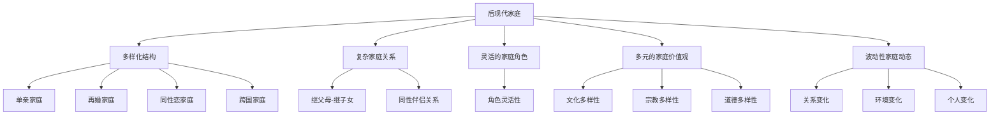
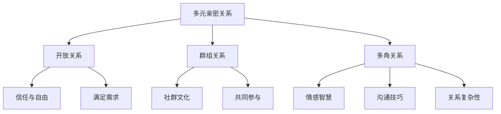

                 

### 文章标题

后现代家庭构建顾问认证：多元亲密关系咨询的专业资格

### 关键词

后现代家庭、多元亲密关系、顾问认证、心理咨询、家庭构建

### 摘要

本文深入探讨了后现代家庭构建顾问认证与多元亲密关系咨询的专业资格。文章首先介绍了后现代家庭的概念及其特点，然后阐述了多元亲密关系的理论框架。接着，文章详细描述了家庭构建顾问的角色与职责，以及获得认证的过程与标准。通过案例分析、实践技巧与策略的分享，本文为从事家庭咨询的专业人士提供了宝贵的参考。文章最后展望了家庭咨询行业的发展趋势，以及家庭构建顾问的专业发展路径。

---

### 引言与背景

在现代社会，家庭结构日趋多样，传统的家庭模式已无法完全涵盖现代社会中各种复杂的家庭关系。后现代家庭构建顾问应运而生，他们专注于为多样化的家庭提供专业的咨询与服务。本文将探讨后现代家庭构建顾问认证，以及多元亲密关系咨询的专业资格。

首先，后现代家庭的概念源自后现代主义哲学。后现代主义主张去中心化、多元化，强调个体的独特性和差异性。在后现代家庭的背景下，家庭成员之间的关系更加复杂，角色和责任也更加多样化。这为家庭咨询工作带来了新的挑战和机遇。

目标读者包括家庭咨询师、心理学从业者、相关专业的学生，以及其他对家庭咨询感兴趣的读者。本文旨在为他们提供一套系统、专业的指导，帮助他们在家庭咨询领域取得成功。

本文将分为以下几个部分：

1. 后现代家庭的定义与特点
2. 多元亲密关系的理论框架
3. 家庭构建顾问的角色与职责
4. 顾问认证过程与标准
5. 案例分析
6. 实践技巧与策略
7. 持续发展与未来趋势

通过以上内容，本文希望能够为后现代家庭构建顾问的从业者们提供实用的知识和工具，帮助他们在专业领域中不断进步。

### 后现代家庭的定义与特点

后现代家庭是指那些突破了传统家庭模式，具有多元化和灵活性特点的家庭结构。在后现代主义哲学的背景下，家庭不再是固定的、单一的实体，而是多种形式共存、不断演变的复杂系统。以下是后现代家庭的几个核心特点：

**1. 多样化的结构**

后现代家庭的结构多种多样，包括单亲家庭、再婚家庭、同性恋家庭、跨国家庭等。这些家庭形式打破了传统的“父亲-母亲-孩子”模式，呈现出更加多元化的面貌。家庭构建顾问需要具备开放的心态，理解和尊重各种家庭结构的存在。

**2. 复杂的家庭关系**

在后现代家庭中，家庭成员之间的关系更加复杂。家庭成员之间可能存在多层次的亲密关系，如继父母与继子女、同性伴侣等。这些关系需要特别处理，以确保家庭成员之间的和谐与稳定。

**3. 家庭角色的灵活性**

在后现代家庭中，家庭角色和责任更加灵活。家庭成员可以根据个人需求和实际情况，灵活调整自己的角色和责任。例如，某位家庭成员可能在某些方面扮演更多的角色，而在其他方面则需要依赖其他家庭成员的支持。

**4. 家庭价值观的多元性**

后现代家庭的价值观也呈现出多元性。家庭成员可能持有不同的文化、宗教和道德观念，这需要家庭构建顾问在咨询过程中，尊重并整合这些不同的价值观，帮助家庭成员找到共同点。

**5. 家庭动态的波动性**

后现代家庭的动态波动性较大，家庭成员之间的互动和关系可能会随时间、环境和个人变化而变化。家庭构建顾问需要具备高度的敏感性和适应性，以应对家庭动态的变化。

为了更直观地理解这些特点，我们可以通过Mermaid流程图来展示后现代家庭的核心概念及其关系：

通过这个流程图，我们可以清晰地看到后现代家庭的核心特点及其相互关系。家庭构建顾问在理解和应对这些特点时，可以借助这个流程图，以便更好地进行家庭咨询工作。

### 多元亲密关系的理论框架

多元亲密关系是指超越了传统一对一亲密关系的多样化形式。随着社会观念的开放和人们对于个人幸福的追求，多元亲密关系在现代社会中逐渐成为了一种普遍现象。为了更好地理解和应对这些关系，我们需要建立一套理论框架。

**1. 亲密关系的定义**

亲密关系是指个体在情感、心理和身体上与他人建立的一种紧密联系。这种关系通常包含信任、尊重、支持、分享和亲密行为等元素。传统亲密关系通常是一对一的，即两个人之间的互动和依赖。然而，在多元亲密关系中，这种一对一的界限被打破，个体可能会与多个伴侣建立亲密关系。

**2. 多元亲密关系的类型**

多元亲密关系可以分为几种类型，包括但不限于：

- **开放关系**：开放关系是指双方或多方同意在一段恋爱关系中与其他人保持性关系。开放关系的目的是增加双方的自由度和满足彼此的不同需求。
  
- **群组关系**：群组关系是指多个个体组成一个小群体，他们之间存在亲密关系，并在特定情况下共同参与性行为。这种关系形式通常出现在社群或社群文化中。

- **多角关系**：多角关系是指三个人或更多人之间建立亲密关系。这种关系形式可能包含多个三角关系或更多复杂的关系结构。

**3. 多元亲密关系的优势与挑战**

多元亲密关系具有以下优势：

- **满足多样化的需求**：多元亲密关系可以满足个体多样化的情感和性需求，有助于提高个体的幸福感。

- **增加关系的灵活性**：多元亲密关系为个体提供了更多的选择和灵活性，有助于建立更加平衡和谐的关系。

然而，多元亲密关系也面临以下挑战：

- **关系复杂性**：多元亲密关系中的关系复杂性较高，需要个体具备较高的沟通技巧和情感智慧。

- **界限模糊**：在多元亲密关系中，个体之间的界限可能会变得模糊，导致关系不稳定。

- **社会压力**：多元亲密关系可能受到社会观念的质疑和压力，个体需要面对来自外部的偏见和歧视。

为了更好地理解多元亲密关系的理论框架，我们可以通过Mermaid流程图来展示其主要类型和特点：

通过这个流程图，我们可以清晰地看到多元亲密关系的主要类型及其特点。家庭构建顾问在处理多元亲密关系时，可以参考这个框架，以便更好地理解和支持客户的情感需求。

### 家庭构建顾问的角色与职责

家庭构建顾问在现代社会中扮演着至关重要的角色。他们的职责不仅涉及提供专业的家庭咨询，还包括帮助家庭成员解决复杂的情感问题，促进家庭关系的和谐与稳定。以下是家庭构建顾问的主要角色和职责：

**1. 评估家庭状况**

家庭构建顾问的首要职责是对家庭状况进行全面的评估。这包括了解家庭成员的情感状态、家庭关系、家庭结构以及家庭成员的需求和期望。通过系统的评估，顾问可以识别出家庭中的问题和挑战，为后续的咨询提供基础。

**2. 提供咨询与建议**

在评估的基础上，家庭构建顾问需要为家庭成员提供专业的咨询和建议。这些建议可能涉及如何改善家庭沟通、如何处理家庭冲突、如何应对家庭中的变化和挑战等。顾问需要运用心理学理论、人际关系技巧和沟通策略，帮助家庭成员找到解决问题的方法。

**3. 促进家庭沟通**

家庭沟通是家庭关系稳定的重要保障。家庭构建顾问需要帮助家庭成员建立有效的沟通渠道，促进彼此之间的理解和尊重。这包括教授家庭成员如何倾听、如何表达情感和需求，以及如何解决沟通中的障碍。

**4. 解决家庭冲突**

家庭冲突是家庭生活中不可避免的一部分。家庭构建顾问需要帮助家庭成员识别冲突的原因，并提供有效的解决方案。这涉及调解家庭成员之间的分歧、帮助家庭成员建立解决问题的策略，以及提供情感支持和鼓励。

**5. 提供情感支持**

家庭构建顾问需要为家庭成员提供情感支持，特别是在家庭面临重大变化或危机时。这包括倾听家庭成员的情感表达、提供安慰和鼓励，以及帮助家庭成员找到应对困难和挫折的方法。

**6. 教育与培训**

家庭构建顾问还需要为家庭成员提供相关的教育和培训，帮助他们提升家庭生活的质量。这可能包括家庭财务管理、子女教育、健康生活方式等方面的知识。

**7. 专业要求**

为了胜任家庭构建顾问的职责，他们需要具备以下专业要求：

- **专业知识**：了解心理学、社会学、教育学等领域的知识，特别是与家庭和亲密关系相关的理论。

- **沟通技巧**：具备良好的沟通能力和人际交往技巧，能够有效地与不同背景和需求的家庭成员进行沟通。

- **伦理道德**：遵循职业道德和行为准则，保护家庭成员的隐私和权益。

- **持续学习**：不断更新知识和技能，跟上家庭咨询领域的最新发展。

通过以上职责和专业要求，家庭构建顾问可以在复杂的家庭环境中发挥作用，帮助家庭成员建立和谐的家庭关系，提升家庭生活的质量。

### 顾问认证过程与标准

家庭构建顾问的专业资格认证是一个系统化的过程，旨在确保从业者具备必要的知识和技能，能够有效地为家庭提供专业的咨询服务。以下是家庭构建顾问认证的详细过程和标准：

**1. 认证流程**

家庭构建顾问的认证流程通常包括以下几个阶段：

- **申请与审查**：潜在候选人需要提交申请，并提供个人资料、教育背景和职业经历等相关信息。认证机构会对这些信息进行初步审查，以确保申请人具备参与认证的基本条件。

- **培训与学习**：通过审查后，申请人需要参加认证机构提供的培训课程，这些课程通常涵盖家庭咨询的核心知识、技能和伦理道德。培训形式可能包括讲座、研讨会、案例分析等。

- **考试与评估**：培训结束后，申请人需要通过一系列的考试和评估，以检验他们的知识水平和实际操作能力。这些考试可能包括笔试、面试、模拟咨询等。

- **认证颁发与维持**：通过考试和评估后，申请人将获得家庭构建顾问的认证。认证通常有一定期限，需要定期进行继续教育和考核，以确保顾问的专业水平持续保持。

**2. 认证标准**

家庭构建顾问的认证标准主要包括以下几个方面：

- **专业知识**：认证候选人需要掌握心理学、社会学、教育学等相关领域的知识，特别是与家庭咨询相关的理论和方法。

- **沟通技巧**：良好的沟通技巧是家庭构建顾问的关键能力，候选人需要具备倾听、表达、调解和反馈等技能。

- **伦理道德**：家庭构建顾问需要遵守职业道德和行为准则，保护家庭成员的隐私和权益，确保咨询过程中的公正和诚信。

- **实践经验**：认证候选人需要在实际工作中积累一定的实践经验，能够独立处理家庭咨询中的各种问题和挑战。

- **持续学习**：家庭咨询领域不断发展，候选人需要具备持续学习的意识和能力，不断更新知识和技能。

**3. 认证机构**

家庭构建顾问的认证通常由专业机构或组织负责，这些机构在全球范围内设有分支，并拥有丰富的认证经验。以下是一些国际知名的认证机构：

- **国际家庭咨询协会（IFCA）**：提供家庭咨询师的认证，涵盖多个国家和地区。
- **美国国家婚姻与家庭治疗协会（AMFT）**：提供婚姻与家庭治疗的认证，具有较高的权威性。
- **英国婚姻家庭治疗协会（BAC）**：专注于婚姻与家庭治疗的认证，拥有严格的认证标准。

通过这些认证机构，家庭构建顾问可以提升自己的专业水平，获得行业认可，为客户提供更高质量的服务。

### 案例分析

为了更好地理解家庭构建顾问在实际工作中的应用，下面我们将通过两个案例来详细分析。

#### 案例一：复杂家庭关系的构建

**背景**：张先生与李女士结婚已有十年，他们有一个8岁的儿子。然而，随着时间的推移，张先生和李女士的关系逐渐恶化，频繁的争吵和家庭冲突让家庭氛围变得紧张。此外，张先生的母亲也经常插手家庭事务，加剧了家庭矛盾。

**分析**：
1. **家庭评估**：家庭构建顾问首先对张先生、李女士及其儿子的情感状态和家庭结构进行了全面评估。发现张先生和李女士在沟通中存在严重的问题，而张先生的母亲则过度干涉家庭事务。

2. **沟通调解**：顾问通过组织家庭会议，帮助张先生和李女士学会如何有效地沟通。在会议中，顾问引导他们表达自己的感受和需求，并鼓励他们倾听对方的观点。

3. **界限设置**：顾问协助张先生和李女士明确家庭界限，减少张先生的母亲对家庭事务的干涉。通过设立界限，家庭中的权力斗争得到了缓解。

4. **情感支持**：顾问为张先生和李女士提供情感支持，帮助他们应对家庭冲突带来的情绪困扰。

**结果**：经过多次咨询和努力，张先生和李女士的关系逐渐改善，家庭氛围也变得和谐。他们的儿子也在这个过程中学会了如何处理情感问题，家庭整体幸福感显著提升。

#### 案例二：多元亲密关系的咨询实践

**背景**：陈先生和李女士是一对开放关系的伴侣，他们各自保持与其他人的亲密关系。然而，随着时间的推移，陈先生开始对这种关系模式产生疑虑，担心这会影响到他和李女士的关系。

**分析**：
1. **评估需求**：家庭构建顾问首先与陈先生和李女士进行了深入的沟通，了解他们对开放关系的期望和需求。发现陈先生的疑虑主要源于对关系稳定性的担忧。

2. **沟通与理解**：顾问帮助陈先生和李女士重新审视他们的关系模式，通过讨论和分享，理解彼此的感受和需求。李女士也坦诚地表达了自己对开放关系的理解和接受。

3. **解决问题**：顾问协助陈先生和李女士找到解决问题的方法，如加强彼此间的沟通、设立明确的界限等。

4. **情感支持**：顾问为陈先生提供情感支持，帮助他应对关系模式改变带来的不确定感。

**结果**：通过多次咨询，陈先生和李女士的关系变得更加稳定和和谐。他们学会了如何平衡个人需求和关系需求，开放关系模式得到了有效管理。

通过以上两个案例，我们可以看到家庭构建顾问在处理复杂家庭关系和多元亲密关系中的重要作用。顾问通过专业的评估、沟通调解和情感支持，帮助家庭成员找到解决问题的方法，提升家庭生活的质量。

### 实践技巧与策略

在家庭咨询工作中，家庭构建顾问需要掌握一系列实践技巧与策略，以确保咨询过程的顺利进行和咨询效果的达成。以下是几个关键技巧：

**1. 建立信任**

建立信任是家庭咨询成功的关键。家庭构建顾问需要通过真诚、倾听和尊重与家庭成员建立良好的信任关系。以下是一些具体策略：

- **倾听**：耐心倾听家庭成员的诉说，不打断，不急于给出建议，给予他们充分表达的机会。
- **同理心**：设身处地地理解家庭成员的情感和需求，表现出对他们的关心和理解。
- **诚实与透明**：在咨询过程中保持诚实和透明，让家庭成员感受到顾问的真诚和专业。

**2. 沟通技巧**

有效的沟通是解决家庭问题的关键。家庭构建顾问需要帮助家庭成员学会如何有效沟通，以下是一些沟通策略：

- **积极倾听**：积极倾听是理解对方观点和情感的有效方法。顾问可以通过重复家庭成员的话语、确认他们的感受来展示自己的倾听。
- **非暴力沟通**：使用非暴力沟通技巧，避免使用指责、批评的语言，而是采用表达自己需求和感受的方式。
- **开放性问题**：使用开放性问题引导家庭成员表达自己的观点和感受，鼓励他们参与讨论。

**3. 解决冲突**

家庭冲突是家庭生活中不可避免的一部分。家庭构建顾问需要帮助家庭成员学会如何有效地解决冲突。以下是一些解决冲突的策略：

- **冷静处理**：在冲突发生时，保持冷静，避免情绪化的行为，给双方留下思考和冷静的空间。
- **寻找共同点**：在解决冲突时，寻找家庭成员之间的共同点，通过共同目标来缓解紧张关系。
- **合作解决问题**：鼓励家庭成员共同参与问题解决，通过合作找到双方都能接受的解决方案。

**4. 设定界限**

家庭界限的设定有助于维护家庭的和谐与稳定。家庭构建顾问需要帮助家庭成员明确各自的角色和责任，以下是一些设定界限的策略：

- **明确责任**：为每个家庭成员设定明确的角色和责任，避免角色混淆和责任不明。
- **尊重差异**：尊重家庭成员之间的差异和独特性，鼓励他们在保持个人独立性的同时，参与家庭事务。
- **沟通界限**：通过沟通和讨论，明确家庭界限，确保家庭成员之间的互动和谐。

通过以上实践技巧与策略，家庭构建顾问可以帮助家庭成员建立更和谐的家庭关系，提升家庭生活的质量。

### 持续发展与未来趋势

随着社会的发展和人们对家庭关系的关注，家庭咨询行业正经历着快速的变化和成长。未来，家庭构建顾问需要不断提升自己的专业能力和适应行业的发展趋势。

**1. 新技术的应用**

未来，家庭咨询行业将越来越多地利用新技术，如人工智能、虚拟现实和远程咨询。这些技术不仅能够提高咨询效率，还能为家庭提供更加个性化和便捷的服务。例如，通过人工智能算法，顾问可以为家庭成员提供定制化的建议和治疗方案。

**2. 社会变革的影响**

全球化的进程和社会观念的开放，使得家庭形式和亲密关系更加多样化。家庭构建顾问需要密切关注这些社会变革，了解不同文化背景下的家庭关系特点，以便为多样化的客户提供专业的咨询和服务。

**3. 持续教育的重要性**

持续教育是家庭构建顾问保持专业水平的基石。随着行业的发展和技术的进步，顾问需要不断更新自己的知识和技能，参加专业培训和工作坊，以应对不断变化的咨询需求。

**4. 职业生涯规划**

家庭构建顾问的职业发展道路多样，可以从咨询师逐步成长为专家顾问、培训师或研究学者。制定清晰的职业生涯规划，有助于顾问在职业生涯中保持动力和目标。

**5. 跨学科合作**

未来，家庭咨询将更加注重跨学科的合作，如心理学、社会学、教育学和医学等领域的专家共同参与。这种跨学科合作能够为家庭提供更加全面和综合的咨询服务。

通过不断学习和适应，家庭构建顾问能够在未来的家庭咨询行业中保持竞争优势，为家庭成员提供高质量的服务。

### 附录：资源与工具

为了帮助家庭构建顾问更好地进行工作和持续学习，以下是一些推荐的资源与工具：

**1. 推荐阅读与参考书目**

- 《家庭咨询技术》（Family Therapy Techniques） - 作者：John M. Gottman
- 《亲密关系》（The Psychology of Love and Sex） - 作者：Daniel J. Miller
- 《家庭结构与功能》（Family Structure and Function） - 作者：James M. Douglas

**2. 相关组织与认证机构**

- 国际家庭咨询协会（IFCA）：www.ifca.org
- 美国国家婚姻与家庭治疗协会（AMFT）：www.amft.org
- 英国婚姻家庭治疗协会（BAC）：www.bac.org.uk

**3. 在线课程与工作坊**

- Coursera：提供多种家庭咨询相关的在线课程
- Udemy：提供专业的家庭咨询培训课程
- Webinars：参加线上研讨会和工作坊，了解最新的咨询技术和趋势

通过利用这些资源和工具，家庭构建顾问可以不断提升自己的专业能力，为客户提供更高质量的咨询服务。

### 结语

作者：AI天才研究院/AI Genius Institute & 禅与计算机程序设计艺术 /Zen And The Art of Computer Programming

本文深入探讨了后现代家庭构建顾问认证与多元亲密关系咨询的专业资格，从家庭结构的多样性、多元亲密关系的理论框架，到家庭构建顾问的角色与职责，再到认证过程与标准，案例分析、实践技巧与策略，以及持续发展与未来趋势，全面解析了这一专业领域。希望通过本文，读者能够对家庭咨询领域有更深入的理解，并在实际工作中运用所学知识，提升家庭生活的质量。

在家庭咨询领域，不断学习和适应是关键。我们鼓励读者持续关注行业动态，积极参与专业培训，不断更新自己的知识和技能。同时，也希望读者能够积极分享自己的经验和见解，共同推动家庭咨询行业的发展。

最后，感谢读者的关注与支持，期待在未来的家庭咨询旅程中，与您一起成长和进步。让我们共同努力，为构建更加和谐、健康的家庭关系贡献自己的力量。

