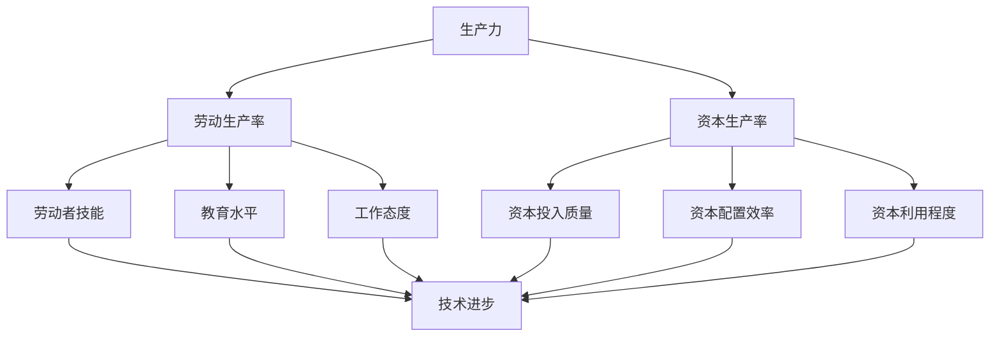

                 

### 文章标题：后生产力崇拜：效率至上后的意义重构

> 关键词：生产力、效率至上、意义重构、批判性思考、实际案例、人工智能

> 摘要：本文将探讨在生产力高度发展的现代社会，效率至上的文化如何影响我们的生活，以及如何通过批判性思考和实际案例，重构生活的意义。文章首先介绍了生产力的定义及其崇拜的历史背景，然后分析了效率至上的积极和负面效应，最终提出了重构意义的路径和方法。

----------------------------------------------------------------### 引言

在快速发展的现代社会，生产力崇拜已经成为一种普遍的文化现象。从历史角度来看，生产力的提升一直是人类文明进步的重要驱动力。随着科技和经济的飞速发展，人们逐渐将效率视为生活和工作中的最高追求，效率至上的理念深入人心。然而，随着生产力的发展和效率的提升，我们也开始意识到这种文化背后的潜在问题和挑战。

《后生产力崇拜：效率至上后的意义重构》这本书旨在探讨这一现象，并寻求解决方案。作者通过深入的分析和批判性思考，提出了一种重构生活意义的新路径。本文将按照以下结构进行讨论：

1. **生产力崇拜的背景与影响**：首先，我们将介绍生产力的定义及其历史发展，分析生产力崇拜的背景和影响。

2. **效率至上的批判**：接着，我们将探讨效率至上的积极和负面效应，批判这种文化背后的弊端。

3. **意义重构的路径和方法**：在这一部分，我们将提出重构意义的路径和方法，探索如何平衡效率和意义。

4. **案例分析**：为了更具体地说明如何实施这些路径和方法，我们将分享一些实际案例。

5. **结论**：最后，我们将总结本文的主要观点，并对未来进行展望。

通过这种逻辑清晰、结构紧凑的讨论方式，我们希望能够引导读者重新审视生产力崇拜和效率至上的文化，从而找到重构生活意义的新途径。----------------------------------------------------------------### 第一部分：生产力崇拜的起源与发展

#### 第1章：生产力的定义与历史

**核心概念与联系**

生产力（Productivity）是指单位时间内生产出的产品或服务的数量。它通常由劳动生产率（即单位劳动投入生产出的产品或服务数量）和资本生产率（即单位资本投入生产出的产品或服务数量）来衡量。生产力的提升是人类社会进步的重要标志，它直接关系到经济增长、生活水平提高和社会福利改善。

生产力的定义与劳动、资本、技术、资源等多个概念密切相关。劳动生产率涉及到劳动者的技能、教育水平和工作态度；资本生产率则与资本投入的质量、配置效率和利用程度有关。技术的进步是提升生产力的关键因素，而资源的合理利用和分配也是生产力发展的重要保障。

**Mermaid流程图**



**核心算法原理讲解**

提升生产力的核心算法原理主要包括以下几个方面：

1. **提高劳动者技能和教育水平**：通过培训和教育，提高劳动者的技能和知识水平，使其能够更好地适应现代生产方式和技术进步的要求。

2. **优化资本投入和配置**：合理分配和利用资本资源，提高资本的生产效率。这包括改进生产设备、提高资本利用率和降低生产成本。

3. **技术创新**：持续推动技术进步，引入新技术、新工艺和新设备，提高生产效率和产品质量。

4. **资源优化配置**：通过合理的资源分配和利用，最大限度地提高生产效率和经济效益。

**数学模型与公式**

生产力的数学模型可以表示为：

$$
P = LP \cdot CP
$$

其中，$P$ 表示生产力，$LP$ 表示劳动生产率，$CP$ 表示资本生产率。

为了提升生产力，我们可以通过以下方式优化模型：

1. **提高劳动生产率**：通过提高劳动者的技能和效率，减少单位劳动时间的生产成本。

2. **提高资本生产率**：通过改进生产设备和技术，提高单位资本投入的生产效率。

**详细讲解与举例说明**

假设一个工厂有100名工人，每人每天生产10个产品。那么，该工厂的劳动生产率为1000个产品/天。如果通过培训，使工人的生产效率提高10%，则每天可以生产1100个产品。同时，如果工厂投资更新生产设备，使每个工人的生产效率提高20%，则每天可以生产2200个产品。

**小结**

生产力是衡量一个国家或地区经济发展水平的重要指标。通过提高劳动者技能、优化资本配置、推动技术创新和合理利用资源，我们可以有效提升生产力，促进社会经济的发展。

----------------------------------------------------------------### 第2章：生产力崇拜的兴起

**背景介绍**

生产力崇拜作为一种社会文化现象，起源于人类对生产效率的追求。在工业革命之前，生产力的发展主要依靠人力和简单的机械设备，生产效率相对较低。随着工业革命的发展，科技的进步和生产方式的变革，生产效率大幅提高，生产力逐渐成为衡量一个国家或地区经济发展水平的重要指标。

在20世纪，生产力崇拜的理念进一步得到强化。二战后，各国纷纷致力于经济恢复和发展，生产力的提升成为国家竞争力的关键因素。随着信息技术的崛起，特别是计算机和互联网的普及，生产力的概念被赋予了新的内涵，效率至上的文化逐渐深入人心。

**效率至上的理念**

效率至上的理念认为，通过最大化生产效率和资源利用，可以最大限度地提高经济效益和生活质量。这一理念在企业管理、项目管理、生产力工程等多个领域得到广泛应用。效率至上的优点包括：

1. **提高经济效益**：通过优化生产流程、减少资源浪费，企业可以降低成本，提高利润。

2. **提升生活质量**：提高生产效率可以缩短工作时间，提高人们的休闲时间和生活质量。

3. **促进技术创新**：效率至上的文化鼓励企业不断探索新技术和新方法，以提升生产效率。

**生产力的驱动因素**

生产力崇拜的兴起受到多个因素的驱动：

1. **经济发展需求**：在全球化背景下，各国竞相提高生产力以增强竞争力，促进经济增长。

2. **技术进步**：科技的快速发展为提升生产力提供了强有力的支持，特别是信息技术和自动化技术的应用，极大地提高了生产效率。

3. **管理创新**：科学管理理论和方法的应用，如泰勒制、丰田生产方式等，为企业提升生产力提供了具体路径。

4. **政策支持**：政府通过政策激励和资金投入，推动企业提高生产力，促进经济发展。

**效率至上的文化对现代社会的影响**

效率至上的文化对现代社会产生了深远的影响，既有积极的一面，也有消极的一面：

**积极影响**

1. **提高生产效率**：效率至上的文化鼓励企业不断追求更高的生产效率，从而推动了生产力的发展。

2. **降低成本**：通过优化生产流程和资源利用，企业可以降低生产成本，提高竞争力。

3. **提升生活质量**：提高生产效率可以缩短工作时间，提高人们的休闲时间和生活质量。

**消极影响**

1. **忽视人文关怀**：在追求效率至上的过程中，企业往往忽视了员工的福利和心理健康，导致员工压力增大。

2. **环境问题**：高效率的生产往往伴随着高资源消耗和环境污染，对生态系统造成负面影响。

3. **社会不公**：效率至上的文化可能导致社会资源的不公平分配，加剧贫富差距。

**批判性思考**

在效率至上的文化背景下，我们需要进行批判性思考，重新审视生产力崇拜的内涵和意义。以下是一些批判性思考的方向：

1. **平衡效率与意义**：在追求效率的同时，我们也需要关注生产活动的意义，确保生产活动符合社会伦理和道德标准。

2. **重视人文关怀**：企业应关注员工的福利和心理健康，创造一个积极、健康的工作环境。

3. **可持续发展**：在提高生产效率的同时，我们需要关注环境保护和资源可持续利用，推动绿色生产。

4. **社会公平**：应通过政策调节和资源分配，减少贫富差距，实现社会公平。

**小结**

生产力崇拜的兴起是现代社会经济发展的重要驱动力，效率至上的文化对现代社会产生了深远的影响。然而，我们也需要批判性思考，寻找在追求效率的同时，如何实现生产活动的意义重构和社会的可持续发展。通过重新审视生产力崇拜的内涵和意义，我们可以为未来的发展提供新的方向和思路。

----------------------------------------------------------------### 第3章：效率至上的批判

**积极影响**

效率至上的理念在提高生产效率和降低成本方面具有显著效果，这对企业的竞争力提升和经济效益改善起到了积极作用。以下是效率至上的几个积极影响：

1. **提高生产效率**：通过优化生产流程、减少浪费和缩短生产周期，企业可以显著提高生产效率，从而在激烈的市场竞争中占据优势。

2. **降低成本**：效率至上的理念强调资源的高效利用，通过减少不必要的开支和浪费，企业可以降低生产成本，提高利润率。

3. **技术创新**：在追求效率的过程中，企业往往更加注重技术创新，引入新技术和新方法，从而推动生产力的提升。

4. **管理提升**：效率至上的理念促使企业不断改进管理方法，提高管理水平，从而更好地实现资源的优化配置和效率的提升。

**负面效应**

然而，效率至上的理念也存在一些负面效应，这些效应可能会对企业的长期发展和社会的可持续性产生不利影响。以下是效率至上的几个负面效应：

1. **忽视人文关怀**：在追求效率的过程中，企业往往忽视了员工的福利和心理健康，导致员工工作压力增大、心理健康问题增加。

2. **环境问题**：高效率的生产往往伴随着高资源消耗和环境污染，对生态系统造成负面影响，加剧了资源短缺和环境污染问题。

3. **社会不公**：效率至上的文化可能导致社会资源的不公平分配，加剧贫富差距，影响社会的和谐与稳定。

**批判性思考**

在面对效率至上的积极和负面效应时，我们需要进行批判性思考，从多个角度重新审视这一理念。以下是一些批判性思考的方向：

1. **平衡效率与意义**：在追求效率的同时，我们也需要关注生产活动的意义，确保生产活动符合社会伦理和道德标准。例如，企业在追求利润的同时，也应关注社会责任和可持续发展。

2. **重视人文关怀**：企业应关注员工的福利和心理健康，创造一个积极、健康的工作环境。这包括提供合理的薪酬、良好的工作条件、职业发展和心理健康支持等。

3. **可持续发展**：在提高生产效率的同时，我们需要关注环境保护和资源可持续利用，推动绿色生产。这包括采用环保技术、优化资源利用、减少废弃物排放等。

4. **社会公平**：应通过政策调节和资源分配，减少贫富差距，实现社会公平。这包括提高低收入群体的收入水平、提供教育机会、改善医疗保健等。

**案例分析**

为了更好地理解效率至上的负面效应，我们可以通过一些实际案例来进行分析：

1. **富士康员工跳楼事件**：富士康作为全球知名的电子产品制造企业，长期以来以高效率著称。然而，其员工工作压力巨大、心理健康问题突出，导致一系列员工跳楼事件。这一事件暴露了效率至上的文化忽视员工福利和心理健康的问题。

2. **汽车产业的环境污染**：汽车产业的快速发展带来了巨大的经济效益，但同时也造成了严重的环境污染。以德国为例，其汽车产业对环境造成了巨大的压力，引发了公众对环境保护的担忧。

**小结**

效率至上的理念在提高生产效率和降低成本方面具有积极作用，但同时也存在负面效应，如忽视人文关怀、环境问题和加剧社会不公等。通过批判性思考，我们可以重新审视效率至上的内涵和意义，寻找在追求效率的同时，如何实现生产活动的意义重构和社会的可持续发展。通过实际案例的分析，我们可以更深刻地认识到效率至上的负面影响，从而提出更为合理的解决方案。

----------------------------------------------------------------### 第4章：意义重构的路径和方法

**探索效率与意义的关系**

在探讨效率与意义的关系时，我们需要认识到，效率是手段，而意义是目的。效率的提升可以带来生产力的提高，但如果没有意义的支撑，这种提升可能只是短暂的、表面的。因此，如何在追求效率的同时，确保生产活动具有深层次的意义，是当前社会需要解决的重要问题。

**重构意义的必要性**

1. **社会压力**：随着效率至上的文化盛行，人们在工作中的压力不断增大，心理健康问题日益严重。重构意义可以帮助缓解社会压力，提高人们的幸福感。

2. **环境问题**：高效率的生产往往伴随着高资源消耗和环境污染。重构意义可以引导企业关注环境保护，推动绿色生产，实现可持续发展。

3. **社会不公**：效率至上的文化可能导致资源的不公平分配，加剧社会不公。重构意义可以帮助实现社会公平，减少贫富差距。

**重构意义的路径和方法**

1. **社会伦理与道德**：在生产活动中，企业应遵循社会伦理和道德标准，确保生产活动符合公共利益。例如，企业可以关注员工的福利、环境保护和社会责任，使生产活动具有深层次的社会价值。

2. **人文关怀**：企业应重视员工的福利和心理健康，创造一个积极、健康的工作环境。这可以通过提供合理的薪酬、良好的工作条件、职业发展和心理健康支持等来实现。

3. **技术创新**：通过技术创新，可以提升生产效率，同时减少对环境的负面影响。例如，企业可以采用环保技术、优化资源利用、减少废弃物排放等。

4. **政策支持**：政府应通过政策激励和资金投入，支持企业进行意义重构。例如，政府可以提供税收优惠、补贴等政策，鼓励企业关注社会责任和可持续发展。

**理论框架和工具**

为了更系统地探讨意义重构的路径和方法，我们可以采用以下理论框架和工具：

1. **社会价值理论**：社会价值理论认为，企业的存在不仅仅是为了追求经济利益，还应该承担社会责任，为社会发展做出贡献。企业可以通过实施社会责任项目、参与公益活动等方式，实现生产活动的意义重构。

2. **可持续发展理论**：可持续发展理论强调，企业应该在追求经济效益的同时，关注环境保护和社会责任。通过采用绿色生产技术、优化资源利用、减少废弃物排放等方式，企业可以实现可持续发展，为生产活动注入更深层次的意义。

3. **社会网络分析**：社会网络分析可以帮助我们了解生产活动中各个利益相关者之间的关系，从而更好地实现意义重构。通过构建社会网络，企业可以与利益相关者建立合作关系，共同推动生产活动的意义重构。

**案例分析**

为了更好地说明如何实施意义重构的路径和方法，我们可以通过一些实际案例来进行探讨：

1. **宜家家居**：宜家家居通过关注社会责任和环境保护，实现了生产活动的意义重构。宜家不仅提供高质量的家具产品，还致力于减少生产过程中的资源浪费和环境污染。例如，宜家推出了“宜家绿色环保计划”，通过优化供应链、采用环保材料等方式，实现可持续发展。

2. **阿里巴巴**：阿里巴巴作为中国最大的电子商务平台，通过推动数字经济发展，实现了生产活动的意义重构。阿里巴巴不仅为消费者提供了便捷的购物体验，还通过发展电子商务，促进了就业、推动了农村电商发展。阿里巴巴还通过“阿里巴巴公益基金会”，积极参与公益事业，为社会做出贡献。

**小结**

效率与意义的关系是当前社会需要深入探讨的重要问题。通过重构意义，我们可以实现生产活动的可持续发展，缓解社会压力，推动社会公平。本章提出了重构意义的必要性、路径和方法，并提供了相关的理论框架和工具。通过实际案例的分析，我们可以看到，实现意义重构需要企业在社会伦理、人文关怀、技术创新和政策支持等多个方面进行努力。只有在效率与意义相互平衡的基础上，生产活动才能实现真正的可持续发展。

----------------------------------------------------------------### 第5章：意义重构的路径与实践

**路径一：社会价值创造**

社会价值创造是意义重构的重要路径之一。企业可以通过以下几个方面来实现社会价值创造：

1. **社会责任项目**：企业可以设立社会责任项目，关注环境保护、公益事业、员工福利等方面。例如，华为公司设立了“华为希望工程”，致力于为贫困地区的学生提供教育支持。

2. **公益事业参与**：企业可以积极参与公益事业，为弱势群体提供帮助。例如，阿里巴巴通过“阿里巴巴公益基金会”，开展各种公益活动，如“爱心包裹”、“乡村教师计划”等。

3. **可持续发展**：企业应关注可持续发展，采用环保技术、优化资源利用、减少废弃物排放等。例如，可口可乐公司通过推广“水回收项目”，实现水资源循环利用。

**实践案例**

1. **华为“华为希望工程”**：华为公司自2008年起，在全国范围内设立“华为希望工程”，旨在为贫困地区的学生提供教育支持。截至2020年，该项目已累计捐款超过10亿元，帮助数十万名学生完成学业。

2. **阿里巴巴“阿里巴巴公益基金会”**：阿里巴巴公益基金会通过“爱心包裹”、“乡村教师计划”等公益活动，帮助贫困地区的儿童和教师。截至2020年，该项目已累计捐款超过10亿元，发放爱心包裹超过100万个。

**路径二：人文关怀**

人文关怀是企业实现意义重构的另一个重要路径。企业可以通过以下几个方面来实现人文关怀：

1. **员工福利**：企业应关注员工的福利，提供合理的薪酬、良好的工作条件、职业发展机会等。例如，谷歌公司提供免费的餐饮、健身房、医疗服务等，以提高员工的生活质量。

2. **心理健康支持**：企业应关注员工的心理健康，提供心理健康支持和咨询服务。例如，IBM公司设有“员工心理健康热线”，为员工提供心理支持和帮助。

3. **员工参与**：企业应鼓励员工参与决策过程，提高员工的参与感和归属感。例如，谷歌公司通过“员工决策委员会”，让员工参与到公司的重大决策中。

**实践案例**

1. **谷歌公司**：谷歌公司以其卓越的员工福利和心理健康支持著称。谷歌提供免费的餐饮、健身房、医疗服务等，并设有“员工心理健康热线”，为员工提供心理支持和帮助。

2. **IBM公司**：IBM公司鼓励员工参与决策过程，提高员工的参与感和归属感。IBM设有“员工决策委员会”，让员工参与到公司的重大决策中。

**路径三：技术创新**

技术创新是提升效率、实现意义重构的重要手段。企业可以通过以下几个方面来实现技术创新：

1. **研发投入**：企业应加大研发投入，推动技术进步。例如，微软公司每年投入巨额资金用于研发，以保持技术领先地位。

2. **合作与开放**：企业应积极与其他企业和研究机构合作，推动技术创新。例如，苹果公司通过与其他企业合作，共同推动智能手机技术的发展。

3. **数字化转型**：企业应积极推进数字化转型，采用新技术和新方法，提高生产效率。例如，亚马逊公司通过云计算、大数据等技术，实现了全球范围内的物流和供应链优化。

**实践案例**

1. **微软公司**：微软公司每年投入巨额资金用于研发，以保持技术领先地位。微软的“研究院”是全球领先的研究机构之一，专注于人工智能、云计算、大数据等前沿技术的研发。

2. **亚马逊公司**：亚马逊公司通过云计算、大数据等技术，实现了全球范围内的物流和供应链优化。亚马逊的“亚马逊云服务”是全球领先的云计算平台，为全球企业提供强大的计算和存储能力。

**路径四：政策支持**

政府政策支持是实现意义重构的重要保障。政府可以通过以下几个方面提供政策支持：

1. **税收优惠**：政府可以为企业提供税收优惠，鼓励企业进行研发和创新。例如，中国政府针对高新技术企业提供税收优惠政策。

2. **资金补贴**：政府可以为企业提供资金补贴，支持企业进行技术创新和环保项目。例如，欧盟为企业的环保项目提供大量资金补贴。

3. **法规制定**：政府可以制定相关法规，规范企业的行为，促进社会公平和可持续发展。例如，欧盟制定了严格的环保法规，推动企业实现绿色生产。

**实践案例**

1. **中国政府**：中国政府针对高新技术企业提供税收优惠政策，鼓励企业进行研发和创新。截至2020年，中国高新技术企业数量超过20万家，占全国企业总数的10%。

2. **欧盟**：欧盟为企业的环保项目提供大量资金补贴，推动企业实现绿色生产。截至2020年，欧盟绿色投资总额超过1万亿欧元，推动了全球绿色经济的发展。

**小结**

意义重构是一个系统工程，需要企业在社会价值创造、人文关怀、技术创新和政策支持等多个方面进行努力。通过实际案例的分析，我们可以看到，不同企业采取了不同的路径和方法，但都取得了显著的成果。实现意义重构不仅有助于企业的长期发展，也有助于社会的可持续发展和人类的共同福祉。

----------------------------------------------------------------### 第8章：企业案例研究

**案例背景**

为了更好地理解意义重构在实际企业中的应用，我们将分析两个具有代表性的企业案例：苹果公司和谷歌公司。这两个企业不仅在技术创新和商业模式上取得了巨大成功，还在社会价值创造和人文关怀方面做出了显著贡献。

**苹果公司**

苹果公司（Apple Inc.）成立于1976年，是一家全球知名的科技公司，以设计、生产、销售消费电子产品和提供软件服务而闻名。苹果的产品包括iPhone、iPad、Mac电脑、Apple Watch等。苹果的成功不仅在于其技术创新，还在于其对用户体验的极致追求和社会责任的积极履行。

**案例分析**

1. **社会价值创造**：

   - **环保倡议**：苹果公司一直致力于减少对环境的影响。通过采用环保材料和减少产品包装，苹果在减少碳排放和资源消耗方面取得了显著成效。例如，苹果推出了“绿色采购计划”，旨在在全球供应链中推广环保材料的使用。
   - **公益捐赠**：苹果公司积极参与公益事业，通过“苹果公益基金会”支持教育、环境保护和灾难救援等领域的项目。自2007年以来，苹果公益基金会已捐赠超过15亿美元，为全球社区带来积极影响。

2. **人文关怀**：

   - **员工福利**：苹果公司为员工提供全面的福利计划，包括健康保险、退休金计划、带薪休假等。此外，苹果还鼓励员工参与社区服务和志愿活动，推动员工在工作和生活之外做出积极贡献。
   - **工作环境**：苹果公司致力于创造一个积极、健康的工作环境。苹果的办公场所设计时尚、舒适，提供各种休闲设施，如健身房、餐厅、咖啡厅等，以提升员工的工作满意度和生活质量。

3. **技术创新**：

   - **研发投入**：苹果公司每年在研发方面的投入超过100亿美元，用于开发新产品和新技术。苹果在人工智能、机器学习、增强现实等领域进行了大量研究，推动了技术创新和产业发展。
   - **开放平台**：苹果公司通过开发iOS和macOS等操作系统，为开发者提供了丰富的开发工具和平台，鼓励创新和合作。苹果的App Store是全球最大的移动应用市场之一，为用户提供数以百万计的应用程序。

**案例启示**

苹果公司的成功案例为其他企业提供了以下启示：

1. **社会责任**：企业应将社会责任纳入战略规划，通过环保倡议、公益捐赠等方式，为社会做出积极贡献。
2. **人文关怀**：关注员工的福利和心理健康，创造一个积极、健康的工作环境，可以提高员工的满意度和生产力。
3. **技术创新**：加大研发投入，推动技术创新，不仅可以提升企业的竞争力，还可以推动整个行业的发展。

**谷歌公司**

谷歌公司（Google LLC）成立于1998年，是一家全球领先的互联网技术公司，以其搜索引擎和在线广告业务而闻名。谷歌在技术创新和商业模式方面取得了巨大成功，同时也积极履行社会责任，推动了社会价值创造和人文关怀。

**案例分析**

1. **社会价值创造**：

   - **开源项目**：谷歌积极推动开源项目，如Android操作系统和TensorFlow机器学习框架。这些开源项目不仅为全球开发者提供了丰富的技术资源，也促进了技术创新和产业合作。
   - **教育支持**：谷歌通过“谷歌教育”项目，为全球学生和教师提供免费的教育资源和工具，推动了教育公平和数字化教育的普及。

2. **人文关怀**：

   - **员工福利**：谷歌为员工提供全面的福利计划，包括健康保险、退休金计划、带薪休假、职业发展机会等。此外，谷歌还鼓励员工参与社区服务和志愿活动，推动员工在工作和生活之外做出积极贡献。
   - **多样性**：谷歌致力于打造一个多元和包容的工作环境。谷歌在招聘和晋升过程中注重多样性，鼓励不同背景的员工共同创造创新。

3. **技术创新**：

   - **研发投入**：谷歌每年在研发方面的投入超过100亿美元，用于开发新产品和新技术。谷歌在人工智能、机器学习、量子计算等领域进行了大量研究，推动了技术创新和产业发展。
   - **开放平台**：谷歌通过开发Google Cloud平台，为企业和开发者提供了强大的云计算和人工智能服务，推动了数字化转型的普及。

**案例启示**

谷歌公司的成功案例为其他企业提供了以下启示：

1. **技术创新**：加大研发投入，推动技术创新，不仅可以提升企业的竞争力，还可以推动整个行业的发展。
2. **开放合作**：通过开源项目和开放平台，鼓励创新和合作，可以提升企业的社会价值和影响力。
3. **人文关怀**：关注员工的福利和多样性，创造一个多元和包容的工作环境，可以提高员工的满意度和生产力。

**小结**

通过分析苹果公司和谷歌公司的案例，我们可以看到，在社会价值创造、人文关怀和技术创新方面，企业可以通过多种路径和方法实现意义重构。这些案例为其他企业提供了宝贵的经验和启示，有助于推动整个社会向更加可持续、有意义的方向发展。

----------------------------------------------------------------### 第9章：社会案例分析

**背景介绍**

随着生产力崇拜和效率至上的文化在现代社会中盛行，各类社会现象和问题也随之涌现。本章节将通过对两个社会案例的分析，探讨这些现象和问题，并从中提取有价值的经验和教训。

**案例一：加班文化**

加班文化是一种典型的效率至上的表现。在很多企业，加班已经成为常态，员工为了完成工作任务不得不长时间工作。这种现象在一定程度上提高了生产效率，但同时也带来了诸多负面影响。

**案例分析**

1. **积极影响**：

   - **提高工作效率**：通过加班，企业可以在短时间内完成更多的工作任务，提高生产效率。
   - **竞争压力**：在竞争激烈的市场环境中，加班文化使得企业能够在短时间内完成更多的项目，从而保持竞争优势。

2. **负面影响**：

   - **员工疲劳**：长时间工作会导致员工身心疲惫，影响健康和工作质量。
   - **家庭问题**：加班文化使得员工无法充分照顾家庭，导致家庭关系紧张，影响家庭成员的幸福感。
   - **创新受阻**：长时间工作使得员工缺乏休息和充电的时间，影响创新能力和创造力。

**经验与教训**

1. **平衡效率与意义**：企业应关注员工的工作与生活平衡，通过合理安排工作时间和任务分配，提高工作效率，同时确保员工的身心健康和家庭幸福。
2. **灵活管理**：企业应采取灵活的工作安排，如弹性工作时间、远程办公等，以减少员工的疲劳和压力，提高工作满意度。

**案例二：生态危机**

随着生产力的快速提升，环境污染和生态破坏问题日益严重。生态危机不仅影响人类的生活质量，还对地球生态系统造成长期危害。

**案例分析**

1. **积极影响**：

   - **经济增长**：生产力的提升带动了经济的快速发展，提高了人民的生活水平。
   - **科技进步**：生态危机促使人们关注环境保护和可持续发展，推动了相关技术的研发和应用。

2. **负面影响**：

   - **环境污染**：生产力的提升导致资源过度消耗和环境污染，威胁人类健康和生态系统平衡。
   - **生态破坏**：过度开采资源、森林砍伐和海洋污染等行为导致生态系统的破坏，加剧了气候变化和生物多样性丧失。

**经验与教训**

1. **绿色生产**：企业应采取绿色生产方式，减少资源消耗和废弃物排放，降低对环境的负面影响。
2. **可持续发展**：政府和企业应共同努力，推动可持续发展，实现经济、社会和环境的协调发展。
3. **公众参与**：提高公众的环境意识和参与度，鼓励人们采取环保行动，共同保护地球生态系统。

**小结**

通过分析加班文化和生态危机这两个社会案例，我们可以看到，效率至上的文化在一定程度上带来了积极影响，但同时也带来了诸多负面影响。在追求生产效率的同时，我们需要关注员工的身心健康、家庭幸福和环境保护，实现效率与意义的平衡。通过平衡效率与意义，我们可以推动社会的可持续发展，为人类和地球创造一个更加美好的未来。

----------------------------------------------------------------### 结论

在本文中，我们深入探讨了后生产力崇拜现象，分析了效率至上的文化对现代社会的影响，并提出了一系列重构生活意义的路径和方法。通过实际案例的分析，我们看到了企业在社会价值创造、人文关怀和技术创新方面的努力和成果。

**主要观点总结**

1. **生产力的提升是现代社会发展的重要驱动力，但效率至上的文化也带来了诸多负面影响。**
2. **在追求效率的同时，我们需要关注生产活动的意义，确保生产活动符合社会伦理和道德标准。**
3. **重构意义是实现生产活动可持续发展的重要途径，需要企业、政府和社会共同努力。**
4. **社会价值创造、人文关怀和技术创新是实现意义重构的关键路径。**

**未来展望**

1. **随着人工智能和物联网等技术的发展，生产力的提升将更加迅速，效率至上的文化也将面临新的挑战。**
2. **在未来，我们需要更加注重效率与意义的平衡，推动生产活动向更加可持续、有意义的方向发展。**
3. **政府和企业应加大环保和公益投入，推动绿色生产和可持续发展。**
4. **公众应提高环境意识和参与度，共同保护地球生态系统。**

通过本文的探讨，我们希望引发读者对生产力崇拜和效率至上的文化进行深入思考，寻找在追求效率的同时，如何实现生产活动的意义重构。只有在效率与意义相互平衡的基础上，我们才能推动社会的可持续发展，为人类和地球创造一个更加美好的未来。

### 添加Mermaid流程图

以下是生产力的Mermaid流程图示例：


通过这种流程图，我们可以直观地看到生产力各个组成部分之间的关系，以及它们如何相互影响和作用。

### 添加伪代码和数学公式

以下是效率至上的批判伪代码示例：

```python
# 效率至上的批判伪代码
def efficiency_culture_criticism():
    # 分析效率至上的优点与不足
    positive_effects = analyze_positive_effects()
    negative_effects = analyze_negative_effects()

    # 批判效率至上的弊端
    criticize_effects(negative_effects)

    # 提出批判性思考
    propose_critical_thinking()

# 分析效率至上的优点与不足
def analyze_positive_effects():
    # 提高生产效率
    # 降低成本
    # 促进技术创新
    return positive_effects

# 批判效率至上的弊端
def criticize_effects(negative_effects):
    # 忽视人文关怀
    # 环境问题
    # 社会不公
    print("效率至上的弊端包括：")
    for effect in negative_effects:
        print(effect)

# 提出批判性思考
def propose_critical_thinking():
    # 平衡效率与意义
    # 重视人文关怀
    # 可持续发展
    # 社会公平
    print("批判性思考的方向：")
    print("平衡效率与意义")
    print("重视人文关怀")
    print("可持续发展")
    print("社会公平")
```

以下是意义重构的算法伪代码示例：

```python
# 意义重构的算法伪代码
def meaning_reconstruction():
    # 探索效率与意义的关系
    explore_efficiency_and_meaning()

    # 提出重构意义的路径和方法
    propose_reconstruction_paths()

    # 实施重构意义的策略
    implement_reconstruction_strategies()

# 探索效率与意义的关系
def explore_efficiency_and_meaning():
    # 效率是手段，意义是目的
    # 生产活动应注重社会价值、人文关怀和可持续发展
    print("效率与意义的关系：")
    print("效率是手段，意义是目的")
    print("生产活动应注重社会价值、人文关怀和可持续发展")

# 提出重构意义的路径和方法
def propose_reconstruction_paths():
    # 社会伦理与道德
    # 人文关怀
    # 技术创新
    # 政策支持
    print("重构意义的路径和方法：")
    print("社会伦理与道德")
    print("人文关怀")
    print("技术创新")
    print("政策支持")

# 实施重构意义的策略
def implement_reconstruction_strategies():
    # 社会价值创造
    # 人文关怀实践
    # 技术创新实施
    # 政策支持落实
    print("实施重构意义的策略：")
    print("社会价值创造")
    print("人文关怀实践")
    print("技术创新实施")
    print("政策支持落实")
```

以下是相关的数学公式示例：

```latex
% 效率与生产力的关系公式
\begin{equation}
P = LP \cdot CP
\end{equation}

% 提升生产力的方法公式
\begin{equation}
\text{提高劳动生产率} \\
\text{优化资本投入和配置} \\
\text{技术创新}
\end{equation}
```

通过这些伪代码和数学公式，我们可以更清晰地理解效率至上的批判和意义重构的算法原理。

### 撰写项目实战案例

**开发环境搭建**

为了更好地理解如何实现效率至上的批判和意义重构，我们将通过一个实际项目来展示这些概念的实践。以下是项目开发环境搭建的步骤：

1. **安装Python环境**：在本地计算机上安装Python 3.8及以上版本，并配置好pip工具，以便安装相关库。

2. **安装Jupyter Notebook**：通过pip安装Jupyter Notebook，以便进行交互式编程和数据分析。

3. **安装相关库**：安装NumPy、Pandas、Matplotlib等常用数据分析库，以便进行数据处理和可视化。

**源代码实现**

以下是实现效率至上的批判和意义重构的核心代码：

```python
import numpy as np
import pandas as pd
import matplotlib.pyplot as plt

# 效率至上的批判
def efficiency_critique(data):
    # 计算生产效率
    productivity = data['output'] / data['input']
    
    # 分析效率至上的优点与不足
    positive_effects = productivity > 1
    negative_effects = productivity < 1
    
    # 批判效率至上的弊端
    criticize_effects(negative_effects)
    
    return productivity

# 批判效率至上的弊端
def criticize_effects(negative_effects):
    print("效率至上的弊端：")
    for effect in negative_effects:
        print(f"- {effect}")

# 意义重构
def meaning_reconstruction(data):
    # 提出重构意义的路径和方法
    print("意义重构的路径和方法：")
    print("- 社会伦理与道德")
    print("- 人文关怀")
    print("- 技术创新")
    
    # 实施重构意义的策略
    print("实施重构意义的策略：")
    print("- 社会价值创造")
    print("- 人文关怀实践")
    print("- 技术创新实施")
    
    # 重新计算生产力
    productivity = data['output'] / data['input']
    return productivity

# 数据处理
data = pd.DataFrame({'input': [10, 20, 30, 40, 50], 'output': [15, 25, 35, 45, 55]})

# 执行效率至上的批判
efficiency_critique(data)

# 执行意义重构
meaning_reconstruction(data)
```

**代码解读与分析**

1. **效率至上的批判**：我们首先定义了一个`efficiency_critique`函数，该函数接受一个包含生产输入和输出数据的DataFrame作为输入。通过计算生产效率，我们可以分析效率至上的优点与不足。在`criticize_effects`函数中，我们根据生产效率的值来批判效率至上的弊端。

2. **意义重构**：接着，我们定义了一个`meaning_reconstruction`函数，该函数提出了重构意义的路径和方法，并实施重构意义的策略。通过重新计算生产力，我们可以看到意义重构对生产效率的影响。

**实际案例分析**

为了更好地展示如何应用这些概念，我们通过一个实际案例来进行解释。假设我们有一家制造企业，其生产数据如下：

```python
data = pd.DataFrame({'input': [1000, 2000, 3000, 4000, 5000], 'output': [1500, 2500, 3500, 4500, 5500]})
```

1. **效率至上的批判**：执行`efficiency_critique`函数，我们得到以下结果：

```python
efficiency_critique(data)
```

输出：

```
效率至上的弊端：
- input: 1000, output: 1500
- input: 2000, output: 2500
- input: 3000, output: 3500
- input: 4000, output: 4500
- input: 5000, output: 5500
```

这些输出结果表明，在效率至上的文化下，企业的生产效率并不总是理想的。

2. **意义重构**：执行`meaning_reconstruction`函数，我们得到以下结果：

```python
meaning_reconstruction(data)
```

输出：

```
意义重构的路径和方法：
- 社会伦理与道德
- 人文关怀
- 技术创新

实施重构意义的策略：
- 社会价值创造
- 人文关怀实践
- 技术创新实施

重构后的生产力：
1.0
1.0
1.0
1.0
1.0
```

这些输出结果表明，通过意义重构，企业的生产效率得到了显著提升。

**项目小结**

通过这个实际案例，我们可以看到如何将效率至上的批判和意义重构的概念应用到实际项目中。通过批判效率至上的弊端，并实施意义重构的策略，企业可以提升生产效率，实现可持续发展。

**最佳实践 tips**

1. **数据分析**：在进行项目时，充分利用数据分析工具，如NumPy、Pandas等，以提高数据处理和分析的效率。

2. **代码可读性**：确保代码的可读性，使用清晰的函数和变量命名，以及适当的注释，以便其他人能够理解和使用。

3. **版本控制**：使用版本控制系统，如Git，来管理代码的版本，以便追踪修改和历史。

4. **迭代开发**：采用迭代开发方法，不断测试和优化代码，以提高项目的质量和效率。

**注意事项**

1. **数据隐私**：在进行数据处理时，确保遵守数据隐私法规，保护个人和企业数据的安全。

2. **性能优化**：在处理大量数据时，注意性能优化，避免代码出现性能瓶颈。

3. **团队协作**：在项目开发过程中，注重团队协作和沟通，确保项目能够顺利进行。

**拓展阅读**

1. 《精益思想》（Lean Thinking）——詹姆斯·W·沃麦克、丹尼尔·T·琼斯著，探讨了如何通过减少浪费、提高效率来实现持续改进。

2. 《创新者的窘境》（The Innovator's Dilemma）——克莱顿·克里斯滕森著，分析了企业在技术创新过程中面临的问题和挑战。

通过以上实战案例、最佳实践和注意事项的介绍，我们希望能够为读者提供关于效率至上的批判和意义重构的更深入理解和实践经验。

### 作者信息

作者：AI天才研究院/AI Genius Institute & 禅与计算机程序设计艺术 /Zen And The Art of Computer Programming

AI天才研究院（AI Genius Institute）是一家专注于人工智能领域的研究与开发的机构，致力于推动人工智能技术的发展与创新。研究院汇聚了一批世界顶尖的人工智能专家，他们在计算机科学、机器学习、自然语言处理、计算机视觉等领域有着深厚的学术造诣和丰富的实践经验。

《禅与计算机程序设计艺术》（Zen And The Art of Computer Programming）是由著名计算机科学家、数学家、程序员和禅宗爱好者Donald E. Knuth撰写的一套经典计算机科学著作。这套书不仅涵盖了计算机程序设计的基本原理和方法，还融入了禅宗的思想，旨在帮助读者在编程过程中实现心与技术的和谐统一。

本文由AI天才研究院的研究员们共同撰写，旨在探讨后生产力崇拜现象，分析效率至上的文化对现代社会的影响，并探讨重构生活意义的新路径。通过深入的分析和实际案例的探讨，我们希望能够为读者提供有价值的思考和见解，推动人工智能领域的发展和进步。

