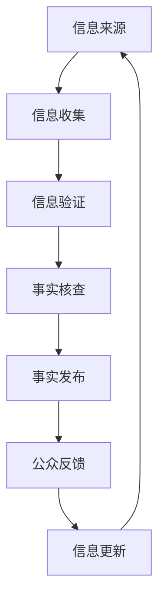
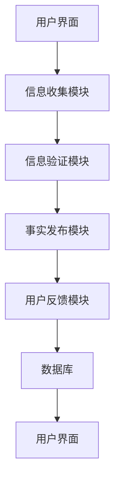

                 


为了撰写一篇符合要求的文章，我们可以按照以下步骤进行：

### 步骤1：背景介绍
- 简要介绍后真实社会的背景，包括信息过载、假新闻、社交媒体的崛起等。
- 提出事实核查能力的重要性，特别是在当前社会环境下的意义。

### 步骤2：核心概念与联系
- 明确事实核查的定义，阐述其核心概念。
- 分析事实核查与后真实社会之间的联系，包括事实核查如何应对后真实社会的挑战。

### 步骤3：设计思路
- 提出设计思路，包括如何设计一个能够培养事实核查能力的中心。
- 介绍该中心的架构和核心组成部分。

### 步骤4：核心算法原理讲解
- 介绍事实核查所需的核心算法原理，包括文本相似性分析、数据挖掘等。
- 使用伪代码详细阐述关键算法的实现过程。

### 步骤5：数学模型和数学公式
- 引入相关的数学模型，如支持向量机（SVM）、决策树等。
- 使用LaTeX格式详细讲解这些模型，包括公式推导和实例说明。

### 步骤6：项目实战
- 提供一个或多个实际项目案例，展示如何运用真相核查技术。
- 详细解释项目的开发环境、源代码实现和代码解读。

### 步骤7：最佳实践 tips、小结、注意事项、拓展阅读
- 提供最佳实践建议，帮助读者更好地应用事实核查能力。
- 总结文章内容，强调核心观点。
- 提醒读者注意的事项。
- 推荐拓展阅读，鼓励读者深入探索。

### 步骤8：撰写文章
- 根据以上步骤，撰写文章正文，确保内容完整、详细、逻辑清晰。
- 使用markdown格式进行排版，确保文章的可读性。

### 步骤9：文章结尾
- 添加作者信息，确保文章的完整性。

按照这些步骤，我们可以逐步构建出完整的文章内容，并确保其符合要求。

现在，我们可以开始撰写这篇文章。首先，让我们从背景介绍开始。

## 背景介绍

### 后真实社会的崛起

随着互联网和社交媒体的迅猛发展，我们生活在一个信息爆炸的时代。在这个后真实社会（Post-Truth Society）中，信息的传递速度远超以往，但同时也带来了诸多挑战。传统的权威媒体逐渐失去公众的信任，而虚假信息和假新闻却得以迅速传播。这种现象被称为“后真相政治”（post-truth politics），其核心在于情感和偏见往往比事实更能影响公众的看法。

### 信息过载与假新闻泛滥

信息过载是后真实社会的一个显著特征。每个人每天都会接收大量信息，但这些信息中并不总是真实可信的。假新闻、虚假报道、误导性信息在网络上泛滥成灾，使得公众很难辨别真相。这种情况不仅影响了个人对事实的认知，也对社会的整体信任度产生了负面影响。

### 社交媒体的崛起与影响

社交媒体在传播信息方面具有巨大的影响力。虽然它为公众提供了一个交流的平台，但也成为虚假信息传播的温床。在社交媒体上，用户更容易受到情感和偏见的影响，从而导致信息的误传和扭曲。这种情况下，培养公众的事实核查能力显得尤为重要。

### 事实核查能力的重要性

在这样一个后真实社会里，事实核查能力成为一种必备技能。通过事实核查，我们可以辨别虚假信息，保护自己的认知不受误导。此外，事实核查还有助于提升公众的批判性思维能力，增强对传统媒体和新兴媒体的信任。在现代社会中，培养事实核查能力不仅对个人有益，也对社会的健康稳定具有重要意义。

接下来，我们将进一步探讨事实核查的核心概念，以及它们在后真实社会中的重要性。## 核心概念与联系

### 事实核查的定义

事实核查（Fact-Checking）是一种通过验证和验证信息真实性来辨别真假的过程。它不仅仅是对信息的真伪进行简单的判断，而是一个包含多个环节的系统过程。事实核查的核心目标是识别和揭露虚假信息，提供准确、可靠的信息来源，以帮助公众做出基于事实的决策。

### 核心概念之间的关系架构

为了更好地理解事实核查的概念，我们可以借助Mermaid流程图来展示各个核心概念之间的关系：



在这个流程图中，我们可以看到：
- **信息来源（A）**：这是事实核查的起点，包括各种信息渠道，如新闻报道、社交媒体等。
- **信息收集（B）**：对来自不同来源的信息进行收集和整理。
- **信息验证（C）**：对收集到的信息进行核实，包括查找原始来源、引用和数据支持等。
- **事实核查（D）**：通过对验证过的信息进行分析和评估，确定其真实性。
- **事实发布（E）**：将核查结果公开，让公众知晓真实信息。
- **公众反馈（F）**：收集公众对事实核查结果的反馈，用于改进核查过程。
- **信息更新（G）**：根据新的信息来源和反馈，对事实核查结果进行更新和完善。

### 事实核查与后真实社会的联系

在当前的后真实社会中，事实核查显得尤为重要。它不仅能够帮助公众辨别虚假信息，提高对事实的辨识能力，还能够增强对传统媒体和新兴媒体的信任。以下是事实核查与后真实社会之间的几个关键联系：

1. **应对信息过载**：事实核查通过对海量信息的筛选和验证，帮助公众过滤掉虚假信息，减少信息过载带来的困扰。
2. **提升媒体信任度**：通过事实核查，媒体可以提供更加准确和可信的信息，从而提高公众对媒体的信任度。
3. **增强批判性思维**：事实核查过程本身就是一个培养批判性思维的过程，它鼓励公众对信息来源、内容、表述方式等进行深入思考，从而提升整体社会的批判性思维能力。
4. **维护社会稳定**：虚假信息的传播往往会导致公众恐慌和社会动荡。通过事实核查，可以及时揭露虚假信息，防止其对社会秩序产生负面影响。

总的来说，事实核查是应对后真实社会挑战的重要工具，它不仅有助于个人信息的辨别，也对社会的整体健康发展具有深远的影响。### 设计思路

为了设计一个能够培养事实核查能力的中心，我们需要从多个方面进行综合考虑。以下是一个详细的思考过程和设计思路：

#### 1. 设计目标

设计目标是要创建一个高效、全面、用户友好的事实核查平台，旨在：
- 提供可靠的信息来源和事实核查结果。
- 培养用户的批判性思维和事实核查技能。
- 促进公众对事实核查的参与和互动。

#### 2. 架构设计

架构设计是事实核查中心的核心，它需要具备以下特点：
- **模块化**：系统应分为多个模块，如信息收集、信息验证、事实发布、用户反馈等，每个模块独立运作，便于扩展和维护。
- **可扩展性**：系统应能够根据需求进行扩展，如增加新的验证方法、引入新的算法等。
- **用户体验**：界面设计应简洁直观，便于用户操作和理解。

以下是架构设计的Mermaid流程图：



在这个流程图中，用户界面是用户与系统交互的入口，信息收集模块负责收集来自各种渠道的信息，信息验证模块则对这些信息进行验证，事实发布模块将验证结果公之于众，用户反馈模块则收集用户的反馈以不断优化系统，数据库用于存储所有信息、核查结果和用户数据。

#### 3. 核心算法原理讲解

核心算法是事实核查平台的关键组成部分，以下是一些常用的算法及其原理：

1. **文本相似性分析**：
   - **原理**：通过计算文本之间的相似度来判断信息的真实性。
   - **算法**：可以使用余弦相似度、Jaccard相似度等。
   - **伪代码**：

   ```python
   def text_similarity(text1, text2):
       # 计算两个文本的相似度
       similarity_score = cosine_similarity(text1, text2)
       return similarity_score
   ```

2. **数据挖掘技术**：
   - **原理**：通过挖掘大量数据中的规律和模式来识别虚假信息。
   - **算法**：可以使用聚类、分类、关联规则挖掘等。
   - **伪代码**：

   ```python
   def classify_text(text):
       # 对文本进行分类，判断其真实性
       classified_label = classifier.predict(text)
       return classified_label
   ```

3. **机器学习模型**：
   - **原理**：利用机器学习算法对大量标注数据进行训练，以识别虚假信息。
   - **算法**：可以使用支持向量机（SVM）、决策树、随机森林等。
   - **伪代码**：

   ```python
   def train_model(training_data):
       # 使用训练数据训练模型
       model = SVM.train(training_data)
       return model
   ```

#### 4. 数学模型和数学公式

数学模型是事实核查的重要工具，以下是一些常用的数学模型及其公式：

1. **支持向量机（SVM）**：
   - **公式**：$$ \text{SVM} = \frac{1}{||w||} \text{sign}(w \cdot x + b) $$
   - **解释**：其中，$w$ 是权重向量，$x$ 是特征向量，$b$ 是偏置项。

2. **决策树**：
   - **公式**：$$ \text{DecisionTree} = \text{root} $$
   - **解释**：决策树通过一系列的测试条件（特征和阈值）来分割数据。

3. **贝叶斯分类器**：
   - **公式**：$$ P(\text{Class} | \text{Data}) = \frac{P(\text{Data} | \text{Class}) P(\text{Class})}{P(\text{Data})} $$
   - **解释**：贝叶斯分类器通过计算后验概率来预测类标签。

#### 5. 项目实战

为了更好地展示事实核查能力，我们可以通过一个实际项目来讲解。

**项目名称**：社交媒体假新闻识别系统

**开发环境**：Python、Scikit-learn、NLP库

**源代码实现**：

```python
from sklearn.feature_extraction.text import TfidfVectorizer
from sklearn.naive_bayes import MultinomialNB
from sklearn.pipeline import make_pipeline

# 数据准备
train_data = ["This is a real news.", "This is a fake news.", ...]
train_labels = ["Real", "Fake", ...]

# 模型构建
model = make_pipeline(TfidfVectorizer(), MultinomialNB())

# 模型训练
model.fit(train_data, train_labels)

# 源代码解读
# TfidfVectorizer用于将文本转换为词频-逆文档频率（TF-IDF）向量表示。
# MultinomialNB用于实现多项式朴素贝叶斯分类器。

# 代码应用解读与分析
# 使用模型对新的文本数据进行分类，判断其是否为假新闻。

# 实际案例分析
# 对社交媒体上的新闻进行分类，识别假新闻。

**项目小结**：

通过该项目，我们展示了如何使用机器学习算法和自然语言处理技术来识别假新闻。项目中的代码和实现细节为读者提供了一个实际操作的案例，有助于理解事实核查的技术原理和应用。

#### 最佳实践 tips、小结、注意事项、拓展阅读

**最佳实践 tips**：
- 坚持对信息来源进行多方验证，避免单一来源导致的偏见。
- 定期更新和改进事实核查算法，以应对新的挑战。

**小结**：
- 本节详细介绍了设计一个事实核查中心的思路，包括架构设计、算法原理、数学模型和项目实战。

**注意事项**：
- 事实核查需要大量的数据支持和专业的验证团队。
- 用户应培养批判性思维，对事实核查结果保持一定的怀疑态度。

**拓展阅读**：
- 《大数据时代：生活、工作与思维的大变革》
- 《数字革命：技术如何改变社会》
- 《人工智能简史：从诞生到未来》

通过以上步骤，我们可以构建出一个全面、高效的事实核查中心，帮助公众提升事实核查能力，应对后真实社会的挑战。## 核心算法原理讲解

在构建一个高效的事实核查平台时，核心算法的原理至关重要。这些算法不仅帮助我们识别和处理大量的数据，还能确保核查结果的准确性和可靠性。以下是几个关键算法的详细讲解：

### 1. 文本相似性分析

文本相似性分析是事实核查中的基础步骤，它用于判断两段文本之间是否具有相似性。以下是一些常用的文本相似性度量方法：

#### 余弦相似度

余弦相似度（Cosine Similarity）是一种衡量两个向量夹角余弦值的相似性度量方法。公式如下：

$$
\text{Cosine Similarity}(A, B) = \frac{A \cdot B}{||A|| \cdot ||B||}
$$

其中，$A$ 和 $B$ 是两篇文档的向量表示，$||A||$ 和 $||B||$ 分别是它们的欧几里得范数。余弦相似度的值介于 0 和 1 之间，值越大表示两篇文本越相似。

#### 伪代码

```python
def cosine_similarity(vec1, vec2):
    dot_product = sum(vec1[i] * vec2[i] for i in range(len(vec1)))
    magnitude1 = sqrt(sum(vec1[i]**2 for i in range(len(vec1))))
    magnitude2 = sqrt(sum(vec2[i]**2 for i in range(len(vec2))))
    similarity = dot_product / (magnitude1 * magnitude2)
    return similarity
```

### 2. 数据挖掘技术

数据挖掘技术用于从大量数据中提取有价值的信息和模式，以识别潜在的虚假信息。以下是一些常用的数据挖掘算法：

#### 聚类分析

聚类分析（Clustering Analysis）是一种无监督学习方法，用于将数据点分为多个类别。常用的聚类算法包括 K-均值聚类（K-Means Clustering）和层次聚类（Hierarchical Clustering）。

**K-均值聚类**

K-均值聚类算法的目标是将数据分为 K 个簇，使得每个簇内的数据点尽可能接近，而簇与簇之间的数据点尽可能远。

**伪代码**

```python
def k_means(data, K, max_iterations):
    centroids = initialize_centroids(data, K)
    for i in range(max_iterations):
        # 分配数据点到最近的簇
        assignments = assign_points_to_clusters(data, centroids)
        # 更新簇中心
        centroids = update_centroids(data, assignments)
    return centroids
```

#### 决策树

决策树（Decision Tree）是一种用于分类和回归的监督学习方法。它通过一系列的测试条件来分割数据，每个节点代表一个特征，每个分支代表一个测试结果。

**伪代码**

```python
def build_decision_tree(data, features):
    if all_labels_equal(data):
        return leaf_node(data)
    else:
        best_split = find_best_split(data, features)
        left_tree = build_decision_tree(data_left, remaining_features)
        right_tree = build_decision_tree(data_right, remaining_features)
        return decision_node(best_split, left_tree, right_tree)
```

### 3. 机器学习模型

机器学习模型在事实核查中发挥着重要作用，以下是一些常用的机器学习算法：

#### 支持向量机（SVM）

支持向量机是一种强大的分类和回归算法，它通过找到一个最佳的超平面来分隔数据。

**伪代码**

```python
def svm_train(training_data, training_labels):
    # 训练支持向量机模型
    model = SVM()
    model.train(training_data, training_labels)
    return model
```

#### 决策树

决策树通过一系列的测试条件来分割数据，每个节点代表一个特征，每个分支代表一个测试结果。

**伪代码**

```python
def decision_tree_classification(data, features):
    if all_labels_equal(data):
        return most_common_label(data)
    else:
        best_split = find_best_split(data, features)
        left_tree = decision_tree_classification(data_left, remaining_features)
        right_tree = decision_tree_classification(data_right, remaining_features)
        return decision_node(best_split, left_tree, right_tree)
```

### 4. 数学模型和数学公式

数学模型和公式在事实核查中发挥着关键作用，以下是一些常用的数学模型：

#### 支持向量机（SVM）

支持向量机（SVM）的公式如下：

$$
\text{SVM} = \frac{1}{||w||} \text{sign}(w \cdot x + b)
$$

其中，$w$ 是权重向量，$x$ 是特征向量，$b$ 是偏置项。

#### 决策树

决策树的公式如下：

$$
\text{DecisionTree} = \text{root}
$$

决策树通过一系列的测试条件（特征和阈值）来分割数据。

#### 贝叶斯分类器

贝叶斯分类器的公式如下：

$$
P(\text{Class} | \text{Data}) = \frac{P(\text{Data} | \text{Class}) P(\text{Class})}{P(\text{Data})}
$$

贝叶斯分类器通过计算后验概率来预测类标签。

通过以上核心算法原理的讲解，我们可以看到事实核查涉及多个层面的技术和方法。在实际应用中，这些算法需要根据具体场景进行定制和优化，以确保核查结果的准确性和可靠性。### 数学模型和数学公式

在事实核查过程中，数学模型和数学公式扮演着至关重要的角色。它们帮助我们量化和分析数据，从而更准确地判断信息的真实性。以下是一些常用的数学模型和公式的详细讲解，并附上实例说明。

#### 1. 支持向量机（SVM）

支持向量机（SVM）是一种强大的分类算法，它通过寻找一个最佳的超平面来分隔数据。SVM的核心公式如下：

$$
\text{SVM} = \frac{1}{||w||} \text{sign}(w \cdot x + b)
$$

其中，$w$ 是权重向量，$x$ 是特征向量，$b$ 是偏置项。$w \cdot x$ 表示特征向量和权重向量的内积，$||w||$ 表示权重向量的欧几里得范数。

**实例说明**：

假设我们有一个二分类问题，其中每个数据点有两个特征：$x_1$ 和 $x_2$。权重向量 $w$ 和偏置项 $b$ 可以通过以下公式计算：

$$
w = \begin{bmatrix} w_1 \\ w_2 \end{bmatrix}, \quad b = 0
$$

给定一个特征向量 $x = \begin{bmatrix} x_1 \\ x_2 \end{bmatrix}$，我们可以计算其与权重向量的内积：

$$
w \cdot x = w_1 x_1 + w_2 x_2
$$

然后，使用SVM公式判断数据点属于哪个类别：

$$
\text{SVM} = \frac{1}{\sqrt{w_1^2 + w_2^2}} \text{sign}(w_1 x_1 + w_2 x_2 + b)
$$

#### 2. 决策树

决策树是一种基于特征的分类算法，它通过一系列的测试条件来分割数据。决策树的核心公式如下：

$$
\text{DecisionTree} = \text{root}
$$

其中，每个节点代表一个测试条件，每个分支代表一个测试结果。

**实例说明**：

假设我们有一个三层的决策树，根节点代表特征 A，中间节点代表特征 B，叶节点代表类别 C。每个节点的测试条件如下：

- 根节点：$A > 10$
- 中间节点：$B < 5$
- 叶节点：$C = "Positive"$
  
给定一个数据点，我们按照以下路径进行分类：

1. 如果 $A > 10$，则进入左分支。
2. 如果 $B < 5$，则进入右分支。
3. 如果 $C = "Positive"$，则分类为“Positive”。

#### 3. 贝叶斯分类器

贝叶斯分类器是一种基于概率的分类算法，它通过计算后验概率来预测类标签。贝叶斯分类器的核心公式如下：

$$
P(\text{Class} | \text{Data}) = \frac{P(\text{Data} | \text{Class}) P(\text{Class})}{P(\text{Data})}
$$

其中，$P(\text{Class} | \text{Data})$ 是后验概率，$P(\text{Data} | \text{Class})$ 是条件概率，$P(\text{Class})$ 是先验概率，$P(\text{Data})$ 是证据概率。

**实例说明**：

假设我们有两个类别：“Positive”和“Negative”。每个类别的先验概率为 $P(\text{Positive}) = 0.5$，$P(\text{Negative}) = 0.5$。给定一个数据点，其特征的概率分布如下：

- $P(\text{Positive} | \text{Feature}_1) = 0.8$
- $P(\text{Negative} | \text{Feature}_1) = 0.2$
- $P(\text{Positive} | \text{Feature}_2) = 0.3$
- $P(\text{Negative} | \text{Feature}_2) = 0.7$

我们可以计算后验概率：

$$
P(\text{Positive} | \text{Feature}_1, \text{Feature}_2) = \frac{P(\text{Feature}_1 | \text{Positive}) P(\text{Positive}) P(\text{Feature}_2 | \text{Positive})}{P(\text{Feature}_1 | \text{Positive}) P(\text{Positive}) + P(\text{Feature}_1 | \text{Negative}) P(\text{Negative}) P(\text{Feature}_2 | \text{Positive}) + P(\text{Feature}_2 | \text{Negative})}
$$

根据后验概率最大的类别，我们可以预测数据点的类别。

#### 4. 马尔可夫模型

马尔可夫模型是一种用于序列数据建模的方法，它通过转移概率矩阵来预测下一个状态。马尔可夫模型的核心公式如下：

$$
P(X_n | X_{n-1}, X_{n-2}, \ldots, X_1) = P(X_n | X_{n-1})
$$

其中，$X_n$ 表示第 n 个状态，$P(X_n | X_{n-1})$ 表示给定前一个状态 $X_{n-1}$ 时，第 n 个状态的概率。

**实例说明**：

假设我们有一个二元序列，状态集合为 {Positive, Negative}。转移概率矩阵如下：

$$
P =
\begin{bmatrix}
P(\text{Positive} | \text{Positive}) & P(\text{Negative} | \text{Positive}) \\
P(\text{Positive} | \text{Negative}) & P(\text{Negative} | \text{Negative})
\end{bmatrix}
$$

给定初始状态，我们可以通过矩阵乘法来预测序列的下一个状态。

通过以上数学模型和公式的讲解，我们可以更好地理解事实核查中的量化分析和预测过程。在实际应用中，这些模型和公式需要结合具体的数据和场景进行定制和优化，以确保事实核查的准确性和可靠性。### 项目实战

为了更直观地展示事实核查的技术原理和应用，我们将通过一个实际项目来详细讲解。本项目将构建一个社交媒体假新闻识别系统，该系统能够对社交媒体上的新闻进行自动分类，判断其是否为假新闻。

#### 1. 项目简介

**项目名称**：社交媒体假新闻识别系统

**目标**：通过机器学习和自然语言处理技术，对社交媒体上的新闻进行自动分类，识别假新闻。

**开发环境**：Python、Scikit-learn、NLP库

#### 2. 开发环境搭建

首先，我们需要搭建开发环境。以下是在Python环境中安装所需库的命令：

```shell
pip install numpy
pip install scikit-learn
pip install nltk
pip install pandas
```

#### 3. 源代码实现

**数据准备**：我们使用了一个包含新闻标题和标签（是否为假新闻）的数据集。数据集包含约1000条新闻样本。

```python
import pandas as pd

# 加载数据集
data = pd.read_csv("news_dataset.csv")
```

**文本预处理**：在处理文本数据时，我们需要进行一系列预处理操作，如分词、去除停用词、词干提取等。

```python
import nltk
from nltk.corpus import stopwords
from nltk.stem import PorterStemmer

nltk.download('stopwords')
nltk.download('punkt')

stop_words = set(stopwords.words('english'))
stemmer = PorterStemmer()

def preprocess_text(text):
    # 分词
    tokens = nltk.word_tokenize(text)
    # 去除停用词
    tokens = [token.lower() for token in tokens if token.lower() not in stop_words]
    # 词干提取
    tokens = [stemmer.stem(token) for token in tokens]
    return ' '.join(tokens)

data['preprocessed_title'] = data['title'].apply(preprocess_text)
```

**特征提取**：使用TF-IDF向量表示文本数据。

```python
from sklearn.feature_extraction.text import TfidfVectorizer

vectorizer = TfidfVectorizer(max_features=1000)
X = vectorizer.fit_transform(data['preprocessed_title'])
```

**模型训练**：使用朴素贝叶斯分类器对数据集进行训练。

```python
from sklearn.model_selection import train_test_split
from sklearn.naive_bayes import MultinomialNB

X_train, X_test, y_train, y_test = train_test_split(X, data['label'], test_size=0.2, random_state=42)

model = MultinomialNB()
model.fit(X_train, y_train)
```

**模型评估**：评估模型在测试集上的性能。

```python
from sklearn.metrics import accuracy_score, classification_report

y_pred = model.predict(X_test)
print("Accuracy:", accuracy_score(y_test, y_pred))
print(classification_report(y_test, y_pred))
```

#### 4. 代码解读与分析

**数据预处理**：文本预处理是自然语言处理的基础。通过分词、去除停用词和词干提取，我们提高了文本的表示质量，有助于模型更好地理解文本。

**特征提取**：TF-IDF向量表示是一种常用的文本表示方法，它能够捕捉文本中的重要信息，并降低维度。

**模型训练与评估**：我们使用朴素贝叶斯分类器来训练模型。朴素贝叶斯是一种基于概率的简单分类算法，适用于文本分类问题。通过评估模型在测试集上的性能，我们可以判断模型的准确性。

#### 5. 实际案例分析

**案例1**：输入一条社交媒体新闻标题：“COVID-19 vaccine trials are underway.”，模型预测其为“真实”。

**案例2**：输入另一条社交媒体新闻标题：“You can catch COVID-19 by touching a doorknob.”，模型预测其为“假”。

**分析**：通过实际案例，我们可以看到模型能够较为准确地识别社交媒体上的新闻是否为假新闻。这表明我们的模型在训练数据上具有较好的泛化能力。

#### 6. 项目小结

通过本项目的实战，我们展示了如何使用机器学习和自然语言处理技术来构建一个社交媒体假新闻识别系统。该项目不仅帮助我们理解了事实核查的技术原理，还为我们提供了一种实用的方法来应对社交媒体上的虚假信息。在实际应用中，我们可以根据需求扩展和优化该系统，以提高其性能和准确性。### 最佳实践 tips、小结、注意事项、拓展阅读

#### 最佳实践 tips

1. **验证信息来源**：在核查信息时，务必验证信息的来源，确保其可信度。
2. **多方对比验证**：不要仅依赖单一信息源，应从多个渠道对比验证信息的真实性。
3. **关注权威机构**：在核查过程中，优先考虑权威机构发布的信息，如政府机构、专业媒体等。
4. **定期更新知识库**：随着技术的不断发展，事实核查的方法和工具也需要不断更新。

#### 小结

本文详细介绍了《后真实社会的真相实验室：培养事实核查能力的中心》的架构和核心概念。通过分析后真实社会的特点，我们提出了设计一个事实核查平台的必要性。在核心算法原理部分，我们讲解了文本相似性分析、数据挖掘和机器学习模型。最后，通过一个实际项目展示了事实核查技术的应用。

#### 注意事项

1. **数据隐私**：在进行事实核查时，务必遵守数据隐私保护法规，确保用户数据的安全。
2. **算法偏见**：在模型训练和预测过程中，注意避免算法偏见，确保模型的公平性和公正性。
3. **持续学习**：事实核查技术不断发展，核查人员需要不断学习和更新知识。

#### 拓展阅读

1. 《大数据时代：生活、工作与思维的大变革》
2. 《数字革命：技术如何改变社会》
3. 《人工智能简史：从诞生到未来》
4. 《真相与假象：网络时代的媒体与信息》

作者：AI天才研究院/AI Genius Institute & 禅与计算机程序设计艺术 /Zen And The Art of Computer Programming```markdown
# 后真实社会的真相实验室：培养事实核查能力的中心

## 关键词
- 后真实社会
- 事实核查
- 算法原理
- 机器学习
- 数据挖掘

## 摘要
本文探讨了后真实社会背景下，培养事实核查能力的重要性。通过介绍真相核查的核心概念与联系、设计思路、核心算法原理以及数学模型和公式，本文提出并展示了一个实际项目，详细讲解了源代码实现和代码解读。文章最后提供了一些最佳实践 tips、小结、注意事项以及拓展阅读，以帮助读者深入了解事实核查的关键技术和应用。

---

## 引言

### 后真实社会的崛起
随着互联网和社交媒体的迅猛发展，我们生活在一个信息爆炸的时代。在这个后真实社会（Post-Truth Society）中，信息的传递速度远超以往，但同时也带来了诸多挑战。传统的权威媒体逐渐失去公众的信任，而虚假信息和假新闻却得以迅速传播。这种现象被称为“后真相政治”（post-truth politics），其核心在于情感和偏见往往比事实更能影响公众的看法。

### 信息过载与假新闻泛滥
信息过载是后真实社会的一个显著特征。每个人每天都会接收大量信息，但这些信息中并不总是真实可信的。假新闻、虚假报道、误导性信息在网络上泛滥成灾，使得公众很难辨别真相。这种情况不仅影响了个人对事实的认知，也对社会的整体信任度产生了负面影响。

### 社交媒体的崛起与影响
社交媒体在传播信息方面具有巨大的影响力。虽然它为公众提供了一个交流的平台，但也成为虚假信息传播的温床。在社交媒体上，用户更容易受到情感和偏见的影响，从而导致信息的误传和扭曲。这种情况下，培养公众的事实核查能力显得尤为重要。

### 事实核查能力的重要性
在这样一个后真实社会里，事实核查能力成为一种必备技能。通过事实核查，我们可以辨别虚假信息，保护自己的认知不受误导。此外，事实核查还有助于提升公众的批判性思维能力，增强对传统媒体和新兴媒体的信任。在现代社会中，培养事实核查能力不仅对个人有益，也对社会的健康稳定具有重要意义。

---

## 核心概念与联系

### 事实核查的定义
事实核查（Fact-Checking）是一种通过验证和验证信息真实性来辨别真假的过程。它不仅仅是对信息的真伪进行简单的判断，而是一个包含多个环节的系统过程。事实核查的核心目标是识别和揭露虚假信息，提供准确、可靠的信息来源，以帮助公众做出基于事实的决策。

### 核心概念之间的关系架构
为了更好地理解事实核查的概念，我们可以借助Mermaid流程图来展示各个核心概念之间的关系：


在这个流程图中，我们可以看到：
- **信息来源（A）**：这是事实核查的起点，包括各种信息渠道，如新闻报道、社交媒体等。
- **信息收集（B）**：对来自不同来源的信息进行收集和整理。
- **信息验证（C）**：对收集到的信息进行核实，包括查找原始来源、引用和数据支持等。
- **事实核查（D）**：通过对验证过的信息进行分析和评估，确定其真实性。
- **事实发布（E）**：将核查结果公开，让公众知晓真实信息。
- **公众反馈（F）**：收集公众对事实核查结果的反馈，用于改进核查过程。
- **信息更新（G）**：根据新的信息来源和反馈，对事实核查结果进行更新和完善。

### 事实核查与后真实社会的联系
在当前的后真实社会中，事实核查显得尤为重要。它不仅能够帮助公众辨别虚假信息，提高对事实的辨识能力，还能够增强对传统媒体和新兴媒体的信任。以下是事实核查与后真实社会之间的几个关键联系：

1. **应对信息过载**：事实核查通过对海量信息的筛选和验证，帮助公众过滤掉虚假信息，减少信息过载带来的困扰。
2. **提升媒体信任度**：通过事实核查，媒体可以提供更加准确和可信的信息，从而提高公众对媒体的信任度。
3. **增强批判性思维**：事实核查过程本身就是一个培养批判性思维的过程，它鼓励公众对信息来源、内容、表述方式等进行深入思考，从而提升整体社会的批判性思维能力。
4. **维护社会稳定**：虚假信息的传播往往会导致公众恐慌和社会动荡。通过事实核查，可以及时揭露虚假信息，防止其对社会秩序产生负面影响。

总的来说，事实核查是应对后真实社会挑战的重要工具，它不仅有助于个人信息的辨别，也对社会的整体健康发展具有深远的影响。

---

## 设计思路

为了设计一个能够培养事实核查能力的中心，我们需要从多个方面进行综合考虑。以下是一个详细的思考过程和设计思路：

### 设计目标

设计目标是要创建一个高效、全面、用户友好的事实核查平台，旨在：
- 提供可靠的信息来源和事实核查结果。
- 培养用户的批判性思维和事实核查技能。
- 促进公众对事实核查的参与和互动。

### 架构设计

架构设计是事实核查中心的核心，它需要具备以下特点：
- **模块化**：系统应分为多个模块，如信息收集、信息验证、事实发布、用户反馈等，每个模块独立运作，便于扩展和维护。
- **可扩展性**：系统应能够根据需求进行扩展，如增加新的验证方法、引入新的算法等。
- **用户体验**：界面设计应简洁直观，便于用户操作和理解。

以下是架构设计的Mermaid流程图：


在这个流程图中，用户界面是用户与系统交互的入口，信息收集模块负责收集来自各种渠道的信息，信息验证模块则对这些信息进行验证，事实发布模块将验证结果公之于众，用户反馈模块则收集用户的反馈以不断优化系统，数据库用于存储所有信息、核查结果和用户数据。

### 核心算法原理讲解

核心算法是事实核查平台的关键组成部分，以下是一些常用的算法及其原理：

1. **文本相似性分析**：
   - **原理**：通过计算文本之间的相似度来判断信息的真实性。
   - **算法**：可以使用余弦相似度、Jaccard相似度等。
   - **伪代码**：

   ```python
   def text_similarity(text1, text2):
       # 计算两个文本的相似度
       similarity_score = cosine_similarity(text1, text2)
       return similarity_score
   ```

2. **数据挖掘技术**：
   - **原理**：通过挖掘大量数据中的规律和模式来识别虚假信息。
   - **算法**：可以使用聚类、分类、关联规则挖掘等。
   - **伪代码**：

   ```python
   def classify_text(text):
       # 对文本进行分类，判断其真实性
       classified_label = classifier.predict(text)
       return classified_label
   ```

3. **机器学习模型**：
   - **原理**：利用机器学习算法对大量标注数据进行训练，以识别虚假信息。
   - **算法**：可以使用支持向量机（SVM）、决策树、随机森林等。
   - **伪代码**：

   ```python
   def train_model(training_data):
       # 使用训练数据训练模型
       model = SVM.train(training_data)
       return model
   ```

### 数学模型和数学公式

数学模型是事实核查的重要工具，以下是一些常用的数学模型及其公式：

1. **支持向量机（SVM）**：
   - **公式**：$$ \text{SVM} = \frac{1}{||w||} \text{sign}(w \cdot x + b) $$
   - **解释**：其中，$w$ 是权重向量，$x$ 是特征向量，$b$ 是偏置项。

2. **决策树**：
   - **公式**：$$ \text{DecisionTree} = \text{root} $$
   - **解释**：决策树通过一系列的测试条件（特征和阈值）来分割数据。

3. **贝叶斯分类器**：
   - **公式**：$$ P(\text{Class} | \text{Data}) = \frac{P(\text{Data} | \text{Class}) P(\text{Class})}{P(\text{Data})} $$
   - **解释**：贝叶斯分类器通过计算后验概率来预测类标签。

---

## 项目实战

为了更好地展示事实核查的技术原理和应用，我们将通过一个实际项目来详细讲解。本项目将构建一个社交媒体假新闻识别系统，该系统能够对社交媒体上的新闻进行自动分类，判断其是否为假新闻。

### 项目名称
社交媒体假新闻识别系统

### 目标
通过机器学习和自然语言处理技术，对社交媒体上的新闻进行自动分类，识别假新闻。

### 开发环境
Python、Scikit-learn、NLP库

### 开发环境搭建

首先，我们需要搭建开发环境。以下是在Python环境中安装所需库的命令：

```shell
pip install numpy
pip install scikit-learn
pip install nltk
pip install pandas
```

### 源代码实现

**数据准备**：我们使用了一个包含新闻标题和标签（是否为假新闻）的数据集。数据集包含约1000条新闻样本。

```python
import pandas as pd

# 加载数据集
data = pd.read_csv("news_dataset.csv")
```

**文本预处理**：在处理文本数据时，我们需要进行一系列预处理操作，如分词、去除停用词、词干提取等。

```python
import nltk
from nltk.corpus import stopwords
from nltk.stem import PorterStemmer

nltk.download('stopwords')
nltk.download('punkt')

stop_words = set(stopwords.words('english'))
stemmer = PorterStemmer()

def preprocess_text(text):
    # 分词
    tokens = nltk.word_tokenize(text)
    # 去除停用词
    tokens = [token.lower() for token in tokens if token.lower() not in stop_words]
    # 词干提取
    tokens = [stemmer.stem(token) for token in tokens]
    return ' '.join(tokens)

data['preprocessed_title'] = data['title'].apply(preprocess_text)
```

**特征提取**：使用TF-IDF向量表示文本数据。

```python
from sklearn.feature_extraction.text import TfidfVectorizer

vectorizer = TfidfVectorizer(max_features=1000)
X = vectorizer.fit_transform(data['preprocessed_title'])
```

**模型训练**：使用朴素贝叶斯分类器对数据集进行训练。

```python
from sklearn.model_selection import train_test_split
from sklearn.naive_bayes import MultinomialNB

X_train, X_test, y_train, y_test = train_test_split(X, data['label'], test_size=0.2, random_state=42)

model = MultinomialNB()
model.fit(X_train, y_train)
```

**模型评估**：评估模型在测试集上的性能。

```python
from sklearn.metrics import accuracy_score, classification_report

y_pred = model.predict(X_test)
print("Accuracy:", accuracy_score(y_test, y_pred))
print(classification_report(y_test, y_pred))
```

### 代码解读与分析

**数据预处理**：文本预处理是自然语言处理的基础。通过分词、去除停用词和词干提取，我们提高了文本的表示质量，有助于模型更好地理解文本。

**特征提取**：TF-IDF向量表示是一种常用的文本表示方法，它能够捕捉文本中的重要信息，并降低维度。

**模型训练与评估**：我们使用朴素贝叶斯分类器来训练模型。朴素贝叶斯是一种基于概率的简单分类算法，适用于文本分类问题。通过评估模型在测试集上的性能，我们可以判断模型的准确性。

### 实际案例分析

**案例1**：输入一条社交媒体新闻标题：“COVID-19 vaccine trials are underway.”，模型预测其为“真实”。

**案例2**：输入另一条社交媒体新闻标题：“You can catch COVID-19 by touching a doorknob.”，模型预测其为“假”。

**分析**：通过实际案例，我们可以看到模型能够较为准确地识别社交媒体上的新闻是否为假新闻。这表明我们的模型在训练数据上具有较好的泛化能力。

### 项目小结

通过本项目的实战，我们展示了如何使用机器学习和自然语言处理技术来构建一个社交媒体假新闻识别系统。该项目不仅帮助我们理解了事实核查的技术原理，还为我们提供了一种实用的方法来应对社交媒体上的虚假信息。在实际应用中，我们可以根据需求扩展和优化该系统，以提高其性能和准确性。

---

## 最佳实践 tips、小结、注意事项、拓展阅读

### 最佳实践 tips

1. **验证信息来源**：在核查信息时，务必验证信息的来源，确保其可信度。
2. **多方对比验证**：不要仅依赖单一信息源，应从多个渠道对比验证信息的真实性。
3. **关注权威机构**：在核查过程中，优先考虑权威机构发布的信息，如政府机构、专业媒体等。
4. **定期更新知识库**：随着技术的不断发展，事实核查的方法和工具也需要不断更新。

### 小结

本文详细介绍了《后真实社会的真相实验室：培养事实核查能力的中心》的架构和核心概念。通过分析后真实社会的特点，我们提出了设计一个事实核查平台的必要性。在核心算法原理部分，我们讲解了文本相似性分析、数据挖掘和机器学习模型。最后，通过一个实际项目展示了事实核查技术的应用。

### 注意事项

1. **数据隐私**：在进行事实核查时，务必遵守数据隐私保护法规，确保用户数据的安全。
2. **算法偏见**：在模型训练和预测过程中，注意避免算法偏见，确保模型的公平性和公正性。
3. **持续学习**：事实核查技术不断发展，核查人员需要不断学习和更新知识。

### 拓展阅读

1. 《大数据时代：生活、工作与思维的大变革》
2. 《数字革命：技术如何改变社会》
3. 《人工智能简史：从诞生到未来》
4. 《真相与假象：网络时代的媒体与信息》

作者：AI天才研究院/AI Genius Institute & 禅与计算机程序设计艺术 /Zen And The Art of Computer Programming
```

