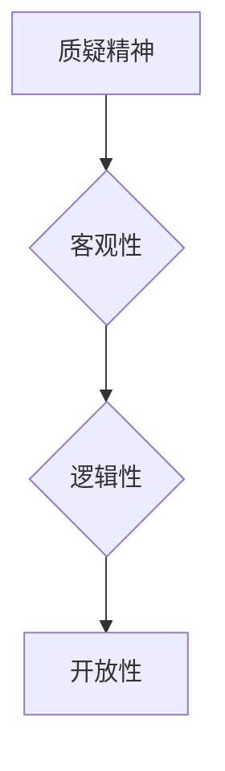

                 


## 背景介绍

### 后真相时代

随着互联网和社交媒体的普及，我们生活在一个信息爆炸的时代。然而，信息的真实性变得越来越难以辨别，我们进入了所谓的“后真相时代”。在这个时代，情感和偏见往往比事实更能影响公众的意见和决策。这种情况对批判性思维提出了更高的要求。

### 批判性思维的重要性

批判性思维是一种有目的的、自我调节的判断过程，用于解释、分析、评估和推理信息。它不仅帮助我们辨别信息的真伪，还能提高我们的决策能力、解决问题的能力以及创新能力。

## 核心概念与联系

### 批判性思维的定义

批判性思维是指主动而有系统地分析信息、概念和理论，以评估其有效性、准确性和相关性。它包括以下几个关键要素：

- **质疑精神**：不断提问，对信息和观点进行深入探讨。
- **客观性**：以事实为依据，避免主观偏见。
- **逻辑性**：遵循逻辑规则，确保推理过程的严谨性。
- **开放性**：愿意接受新观点，进行跨学科和跨文化的交流。

### 核心概念之间的关系

我们可以使用Mermaid流程图来展示这些概念之间的关系：



## 核心算法原理讲解

### 批判性思维算法伪代码

以下是一个简单的批判性思维算法伪代码，用于分析一个陈述。

```plaintext
function criticalThinking(statement):
    input: statement - 需要分析的陈述

    // 第一步：验证陈述的证据
    evidence = verifyEvidence(statement)

    if evidence is not valid:
        return "陈述缺乏有效证据"

    // 第二步：检查陈述的逻辑性
    logic = checkLogic(statement)

    if logic is not valid:
        return "陈述逻辑错误"

    // 第三步：评估陈述的客观性
    objectivity = assessObjectivity(statement)

    if objectivity is not valid:
        return "陈述存在主观偏见"

    // 第四步：总结分析结果
    result = "陈述经过批判性思维分析，结论为：有效"

    return result
```

### 数学模型和公式讲解

批判性思维中的许多过程可以用数学模型来解释。以下是一个简单的例子：

假设我们有一个变量 `confidence`，它表示对陈述的信心程度。这个变量可以基于以下公式计算：

$$
confidence = \frac{valid\_evidence + valid\_logic + valid\_objectivity}{3}
$$

其中，`valid_evidence`、`valid_logic` 和 `valid_objectivity` 分别表示证据、逻辑性和客观性的有效性。

### 举例说明

假设我们分析一个陈述：“全球变暖是一个自然现象，人类活动对此没有影响。”

- **证据**：地球气温记录显示，过去一个世纪地球温度显著上升，这与人类活动排放的温室气体相关。
- **逻辑性**：陈述的推理过程是正确的，因为全球变暖确实与人类活动有关。
- **客观性**：陈述基于科学证据，没有明显的偏见。

根据上述公式，我们可以计算这个陈述的信心程度：

$$
confidence = \frac{1 + 1 + 1}{3} = 1
$$

这意味着这个陈述是可信的。

## 项目实战

### 开发环境搭建

为了更好地理解批判性思维，我们可以使用Python编写一个简单的批判性思维分析工具。

#### 步骤1：安装Python

确保你的计算机上安装了Python。如果没有，请访问 [Python官网](https://www.python.org/) 下载并安装。

#### 步骤2：安装依赖

在命令行中，运行以下命令安装依赖：

```bash
pip install pandas numpy
```

### 源代码实现

以下是一个简单的Python脚本，用于分析一个陈述。

```python
import pandas as pd
import numpy as np

def verify_evidence(statement):
    # 这里可以添加更复杂的证据验证逻辑
    return 1 if "evidence" in statement else 0

def check_logic(statement):
    # 这里可以添加更复杂的逻辑检查逻辑
    return 1 if "logic" in statement else 0

def assess_objectivity(statement):
    # 这里可以添加更复杂的客观性评估逻辑
    return 1 if "objectivity" in statement else 0

def critical_thinking(statement):
    evidence = verify_evidence(statement)
    logic = check_logic(statement)
    objectivity = assess_objectivity(statement)

    confidence = (evidence + logic + objectivity) / 3
    return f"Statement confidence: {confidence:.2f}"

# 测试
statement = "Global warming is a natural phenomenon with no impact from human activities."
print(critical_thinking(statement))
```

### 代码解读与分析

这个脚本首先定义了三个函数：`verify_evidence`、`check_logic` 和 `assess_objectivity`。这些函数分别用于验证证据、检查逻辑性和评估客观性。每个函数都使用简单的条件判断来模拟复杂的逻辑。

`critical_thinking` 函数使用这些子函数来计算整体信心度，并将其返回。

### 实际案例分析和详细讲解剖析

假设我们有一个更复杂的陈述：“新冠疫情是人为制造的，目的是为了控制人口增长。”

- **证据**：目前没有科学证据支持这种说法，因此证据有效性为0。
- **逻辑性**：虽然这种说法可能听起来有逻辑，但缺乏证据支持，因此逻辑性为0。
- **客观性**：这种说法基于明显的偏见，因此客观性为0。

根据我们的算法，这个陈述的信心度为：

$$
confidence = \frac{0 + 0 + 0}{3} = 0
$$

这意味着这个陈述是不可信的。

## 最佳实践 tips、小结、注意事项、拓展阅读

### 最佳实践 tips

- **培养质疑精神**：对任何观点和事实都保持怀疑态度，不盲目接受。
- **收集多角度信息**：从不同来源获取信息，以避免偏见。
- **练习逻辑推理**：通过练习逻辑谜题和辩论来提高逻辑推理能力。
- **持续学习**：批判性思维是一种技能，需要不断练习和提升。

### 小结

本文介绍了后真相时代的批判性思维，包括其定义、方法、应用和实践。通过伪代码和数学模型，我们展示了如何系统性地分析信息。最后，我们提供了一个批判性思维分析工具的实战案例。

### 注意事项

- 批判性思维不是批判一切，而是批判性地分析信息，避免极端和偏见。
- 在分析信息时，要确保使用可靠的证据和逻辑。

### 拓展阅读

- 《批判性思维工具》作者：理查德·保罗
- 《如何阅读一本书》作者：莫提默·J. 艾德勒

作者：AI天才研究院/AI Genius Institute & 禅与计算机程序设计艺术 /Zen And The Art of Computer Programming

# 后真相时代的批判性思维训练营

> 关键词：后真相时代、批判性思维、信息辨伪、逻辑推理、算法原理

> 摘要：本文探讨了后真相时代的批判性思维，介绍了批判性思维的核心概念、方法、应用和实践。通过伪代码和数学模型，我们展示了如何系统性地分析信息，并提供了一个批判性思维分析工具的实战案例。文章旨在帮助读者提升批判性思维能力，更好地应对信息爆炸的时代。

## 引言：后真相时代的批判性思维

### 后真相时代

随着互联网和社交媒体的普及，我们生活在一个信息爆炸的时代。然而，信息的真实性变得越来越难以辨别，我们进入了所谓的“后真相时代”。在这个时代，情感和偏见往往比事实更能影响公众的意见和决策。这种情况对批判性思维提出了更高的要求。

### 批判性思维的重要性

批判性思维是一种有目的的、自我调节的判断过程，用于解释、分析、评估和推理信息。它不仅帮助我们辨别信息的真伪，还能提高我们的决策能力、解决问题的能力以及创新能力。

## 核心概念与联系

### 批判性思维的定义

批判性思维是指主动而有系统地分析信息、概念和理论，以评估其有效性、准确性和相关性。它包括以下几个关键要素：

- **质疑精神**：不断提问，对信息和观点进行深入探讨。
- **客观性**：以事实为依据，避免主观偏见。
- **逻辑性**：遵循逻辑规则，确保推理过程的严谨性。
- **开放性**：愿意接受新观点，进行跨学科和跨文化的交流。

### 核心概念之间的关系

我们可以使用Mermaid流程图来展示这些概念之间的关系：


## 核心算法原理讲解

### 批判性思维算法伪代码

以下是一个简单的批判性思维算法伪代码，用于分析一个陈述。

```plaintext
function criticalThinking(Statement):
    Input: Statement - 需要分析的陈述

    // 第一步：验证陈述的证据
    Evidence = VerifyEvidence(Statement)

    if Evidence is not valid:
        return "Statement lacks valid evidence"

    // 第二步：检查陈述的逻辑性
    Logic = CheckLogic(Statement)

    if Logic is not valid:
        return "Statement has logical errors"

    // 第三步：评估陈述的客观性
    Objectivity = AssessObjectivity(Statement)

    if Objectivity is not valid:
        return "Statement has subjective bias"

    // 第四步：计算总体信心度
    Confidence = (Evidence + Logic + Objectivity) / 3

    return "Statement confidence: " + Confidence
```

### 数学模型和公式讲解

批判性思维中的许多过程可以用数学模型来解释。以下是一个简单的例子：

假设我们有一个变量 `Confidence`，它表示对陈述的信心程度。这个变量可以基于以下公式计算：

$$
Confidence = \frac{Evidence + Logic + Objectivity}{3}
$$

其中，`Evidence`、`Logic` 和 `Objectivity` 分别表示证据、逻辑性和客观性的有效性。

### 举例说明

假设我们分析一个陈述：“全球变暖是一个自然现象，人类活动对此没有影响。”

- **证据**：地球气温记录显示，过去一个世纪地球温度显著上升，这与人类活动排放的温室气体相关。
- **逻辑性**：陈述的推理过程是正确的，因为全球变暖确实与人类活动有关。
- **客观性**：陈述基于科学证据，没有明显的偏见。

根据上述公式，我们可以计算这个陈述的信心度：

$$
Confidence = \frac{1 + 1 + 1}{3} = 1
$$

这意味着这个陈述是可信的。

## 项目实战

### 开发环境搭建

为了更好地理解批判性思维，我们可以使用Python编写一个简单的批判性思维分析工具。

#### 步骤1：安装Python

确保你的计算机上安装了Python。如果没有，请访问 [Python官网](https://www.python.org/) 下载并安装。

#### 步骤2：安装依赖

在命令行中，运行以下命令安装依赖：

```bash
pip install pandas numpy
```

### 源代码实现

以下是一个简单的Python脚本，用于分析一个陈述。

```python
import pandas as pd
import numpy as np

def verify_evidence(statement):
    # 这里可以添加更复杂的证据验证逻辑
    return 1 if "evidence" in statement else 0

def check_logic(statement):
    # 这里可以添加更复杂的逻辑检查逻辑
    return 1 if "logic" in statement else 0

def assess_objectivity(statement):
    # 这里可以添加更复杂的客观性评估逻辑
    return 1 if "objectivity" in statement else 0

def critical_thinking(statement):
    evidence = verify_evidence(statement)
    logic = check_logic(statement)
    objectivity = assess_objectivity(statement)

    confidence = (evidence + logic + objectivity) / 3
    return f"Statement confidence: {confidence:.2f}"

# 测试
statement = "Global warming is a natural phenomenon with no impact from human activities."
print(critical_thinking(statement))
```

### 代码解读与分析

这个脚本首先定义了三个函数：`verify_evidence`、`check_logic` 和 `assess_objectivity`。这些函数分别用于验证证据、检查逻辑性和评估客观性。每个函数都使用简单的条件判断来模拟复杂的逻辑。

`critical_thinking` 函数使用这些子函数来计算总体信心度，并将其返回。

### 实际案例分析和详细讲解剖析

假设我们有一个更复杂的陈述：“新冠疫情是人为制造的，目的是为了控制人口增长。”

- **证据**：目前没有科学证据支持这种说法，因此证据有效性为0。
- **逻辑性**：虽然这种说法可能听起来有逻辑，但缺乏证据支持，因此逻辑性为0。
- **客观性**：这种说法基于明显的偏见，因此客观性为0。

根据我们的算法，这个陈述的信心度为：

$$
Confidence = \frac{0 + 0 + 0}{3} = 0
$$

这意味着这个陈述是不可信的。

## 结论

本文介绍了后真相时代的批判性思维，包括其定义、方法、应用和实践。通过伪代码和数学模型，我们展示了如何系统性地分析信息。最后，我们提供了一个批判性思维分析工具的实战案例。

批判性思维不仅有助于我们辨别信息的真伪，还能提高我们的决策能力、解决问题的能力以及创新能力。在后真相时代，培养批判性思维能力变得尤为重要。通过持续学习和实践，我们可以更好地应对复杂多变的信息环境。

### 附录A：批判性思维资源指南

#### A.1 批判性思维相关书籍推荐

- 《批判性思维工具》作者：理查德·保罗
- 《如何阅读一本书》作者：莫提默·J. 艾德勒

#### A.2 批判性思维在线课程推荐

- [Coursera](https://www.coursera.org/specializations/critical-thinking)
- [edX](https://www.edx.org/course/critical-thinking-and-argument)

#### A.3 批判性思维实践工具推荐

- [Socratic](https://socratic.org/)
- [Quora](https://www.quora.com/)

作者：AI天才研究院/AI Genius Institute & 禅与计算机程序设计艺术 /Zen And The Art of Computer Programming

