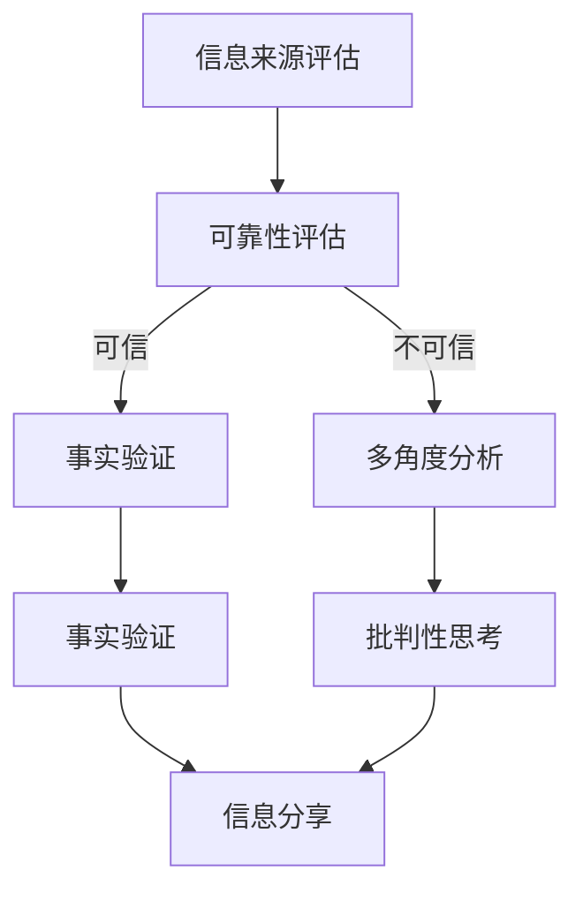

                 

### 文章标题：后真相时代的批判性阅读：信息甄别的艺术

#### 关键词：
- 后真相时代
- 批判性阅读
- 信息甄别
- 假新闻
- 真相与偏见
- 情感驱动
- 社会心理效应

#### 摘要：
本文探讨了后真相时代的特征及其对公众认知和社会结构的影响。我们分析了批判性阅读和信息甄别的艺术，提出了在面对海量信息和社会舆论时，如何运用逻辑和理性进行思考和判断的方法。通过案例分析，我们揭示了假新闻和误导性信息的传播机制，并提出了提高信息素养的策略。文章旨在帮助读者在后真相时代中保持独立思考，做出明智的决策。

### 引言

#### 后真相时代的定义与特征

后真相时代（Post-truth era）是一个由社会、政治、文化和技术因素交织而成的复杂现象。其核心特征是情感和偏见在决策过程中扮演了比事实更为重要的角色。在后真相时代，事实不再是争论的首要依据，而人们的情感、直觉和偏见往往成为主导决策的因素。这一现象在社交媒体、假新闻和虚假信息的泛滥中得到了充分体现。

**定义：** 后真相时代是指在信息过载、情感驱动和偏见影响下，真相的确定性和影响力下降，公众舆论和决策更加依赖于情感而非事实的时代。

**特征：**
1. **信息爆炸：** 互联网和社交媒体的普及使得信息传播速度极快，信息过载成为普遍现象。
2. **情感驱动：** 信息接受和传播更倾向于情感共鸣和直觉，而非理性分析。
3. **假新闻泛滥：** 虚假信息和误导性内容充斥网络，对公众认知产生负面影响。
4. **真相模糊：** 在信息泛滥和情感驱动的环境中，真相变得难以辨别，真相和偏见交织在一起。

#### 后真相时代的起源与发展

后真相时代的起源可以追溯到2000年代后期，随着社交媒体和互联网的兴起，信息传播的渠道变得更加多样化和快捷化。特别是在2016年美国总统大选期间，假新闻和误导性信息对选举结果产生了显著影响，成为后真相时代的一个标志性事件。此后，后真相时代的特征在全球范围内逐渐显现，从政治到文化，从经济到社会各个领域都受到了影响。

**起源：** 2000年代后期，社交媒体和互联网的兴起，使得信息传播更加迅速和广泛。
**发展：** 2016年美国总统大选，被认为是后真相时代的标志性事件，虚假信息和不实言论对选举结果产生了显著影响。

#### 后真相时代的影响

后真相时代的影响是深远而广泛的，它不仅改变了公众的认知方式，也对社会的结构产生了深刻的影响。

**社会影响：**
- **信息碎片化和分散化：** 公众对传统媒体的信任度下降，信息来源多样化，导致信息碎片化和分散化。
- **社会分裂和冲突：** 后真相时代加剧了社会分裂和冲突，公众舆论分化加剧，社会共识难以形成。

**政治影响：**
- **选举和决策的扭曲：** 虚假信息和误导性内容被用来操纵舆论和选举结果，政治人物和政党更倾向于情感诉求和短期效应，而忽视长期政策和公众利益。
- **政治极化：** 后真相时代导致政治极化现象加剧，极端主义和民粹主义情绪高涨。

**文化影响：**
- **文化同质化和极化：** 文艺作品和媒体内容更加追求娱乐性和情感共鸣，而非真实性和深度。文化多样性受到挑战，同质化和极化现象加剧。

**经济影响：**
- **金融市场波动：** 虚假信息和误导性内容对金融市场和企业经营产生了不利影响，增加了风险和不确定性。
- **广告和营销策略：** 广告和营销策略更加依赖情感驱动，而非理性分析。

#### 个人和群体影响

后真相时代对个人和群体的影响也是显著的。

**个人影响：**
- **认知偏差：** 个体在信息接受和传播过程中更容易受到情感和偏见的影响，导致信息认知偏差。
- **决策困难：** 在信息泛滥和真相模糊的环境中，个体在面对复杂问题时难以做出理性决策。

**群体影响：**
- **信任度下降：** 群体之间的信任和共识减少，社会分裂加剧。
- **极端主义和民粹主义：** 极端主义和民粹主义情绪在后真相时代得到进一步激发和传播。

### 批判性阅读和信息甄别的艺术

#### 批判性阅读的定义与意义

批判性阅读（Critical Reading）是一种主动的、反思性的阅读方式，它要求读者在阅读过程中不仅要理解文本的内容，还要评估信息的真实性、可靠性和有效性。批判性阅读旨在培养读者的独立思考能力，使其能够识别和质疑信息中的偏见、错误和虚假陈述。

**定义：** 批判性阅读是一种积极的阅读方式，读者在理解文本的同时，对信息的内容、来源和论据进行评估和分析。

**意义：**
1. **提高信息素养：** 通过批判性阅读，读者能够提高对信息真实性的识别能力，减少受到误导的可能性。
2. **培养独立思考：** 批判性阅读鼓励读者在阅读过程中提出问题、质疑观点，从而培养独立思考和判断能力。
3. **增强决策能力：** 批判性阅读有助于读者在复杂的信息环境中做出更明智的决策。

#### 批判性阅读的技巧

要有效地进行批判性阅读，读者可以运用以下技巧：

1. **理解文本意图：** 在阅读过程中，读者需要关注作者的写作意图和立场，理解文本背后的动机和目的。

2. **评估信息来源：** 读者需要对信息的来源进行评估，判断其可信度和权威性。可靠的来源通常包括学术期刊、权威媒体报道和专业机构发布的报告。

3. **分析论据和论点：** 读者需要仔细分析文本中的论据和论点，评估其逻辑性和有效性。注意识别可能存在的逻辑谬误和证据缺失。

4. **对比和交叉验证：** 读者可以通过对比不同来源的信息，交叉验证事实和论据，以增强对信息的信任度。

5. **反思和质疑：** 读者在阅读过程中应保持反思和质疑的态度，对文本中的观点提出自己的看法，并进行批判性思考。

#### 信息甄别的艺术

信息甄别（Information Verification）是一种对信息进行评估和验证的过程，旨在确定信息的真实性和准确性。在信息甄别中，读者需要运用批判性思维，对信息进行多方面的审查和分析。

**定义：** 信息甄别是指对获取的信息进行真实性、准确性和可靠性的评估和验证。

**艺术：**
1. **识别信息来源：** 读者需要了解信息来源的背景和信誉，判断其是否可靠。

2. **验证事实：** 读者可以通过查阅权威资料、对比多方信息等方式，验证文本中的事实和论据。

3. **评估证据：** 读者需要关注文本中的证据是否充分、合理，是否存在证据缺失或证据不实的情况。

4. **识别偏见和误导：** 读者需要识别文本中可能存在的偏见和误导，避免被情感和直觉所左右。

5. **批判性思考：** 读者在信息甄别过程中应保持批判性思维，对信息进行多角度的分析和评估。

#### 批判性阅读和信息甄别的应用案例

**案例1：社交媒体中的假新闻**
在社交媒体上，假新闻和误导性信息层出不穷。读者在看到一则新闻时，应先评估其来源的可靠性，再通过交叉验证的方式验证事实。例如，一篇关于健康食品的文章，读者可以查阅权威医学期刊或专业机构发布的研究报告，以验证其科学性和可靠性。

**案例2：政治宣传**
在政治宣传中，虚假信息和误导性言论经常被用来操纵公众舆论。读者在面对政治宣传时，应保持批判性思维，评估宣传内容的真实性，并对比不同政治派别的观点，以形成独立的判断。

**案例3：商业广告**
商业广告中常常存在夸大其词和虚假宣传的情况。读者在购买商品或服务时，应通过多方面的信息甄别，了解产品的真实效果和用户的评价，避免被广告误导。

### 信息甄别的算法原理

在信息甄别的过程中，算法和数据分析技术发挥着重要作用。以下是一些常用的算法原理和数学模型，用于识别和验证信息的真实性。

#### 1. 贝叶斯推理

贝叶斯推理是一种基于概率论的推理方法，用于更新对事件概率的估计。在信息甄别中，贝叶斯推理可用于评估信息来源的可靠性。

**伪代码：**
```plaintext
def bayesian_inference(prior, likelihood, evidence):
    posterior = (prior * likelihood) / evidence
    return posterior
```

**参数说明：**
- `prior`：先验概率，表示对信息来源的初始信任度。
- `likelihood`：似然概率，表示信息内容与先验概率的匹配度。
- `evidence`：证据，表示观察到的信息内容。

**应用场景：** 贝叶斯推理可用于评估社交媒体上的信息来源，如评估一篇新闻文章的可靠性。

#### 2. 马尔可夫链

马尔可夫链是一种用于描述序列依赖的随机过程。在信息甄别中，马尔可夫链可用于分析信息传播的路径和模式。

**数学模型：**
$$
P(X_t = x_t | X_{t-1} = x_{t-1}, ..., X_0 = x_0) = P(X_t = x_t | X_{t-1} = x_{t-1})
$$

**应用场景：** 马尔可夫链可用于分析社交媒体上的信息传播路径，如识别假新闻的传播渠道。

#### 3. 随机漫步

随机漫步是一种随机过程，用于模拟随机行走。在信息甄别中，随机漫步可用于评估信息传播的随机性。

**数学模型：**
$$
X_t = X_{t-1} + Z_t
$$
其中，$Z_t$为独立同分布的随机变量。

**应用场景：** 随机漫步可用于分析社交媒体上的信息传播，如评估用户转发行为的随机性。

### 案例分析

为了更好地理解信息甄别的实际应用，以下我们分析两个具体的案例：社交媒体上的假新闻和商业广告中的虚假宣传。

#### 案例一：社交媒体上的假新闻

**背景：**
社交媒体上的假新闻问题日益严重，影响了公众的认知和行为。一个典型的例子是2016年美国总统大选期间，假新闻对选举结果产生了显著影响。

**分析：**
1. **信息来源评估：** 首先，对假新闻的来源进行评估，判断其可信度。可以通过查阅该来源的历史文章、读者评论和专业评价来进行评估。
2. **事实验证：** 对假新闻中的事实进行验证，可以通过查阅权威资料、对比多方信息和交叉验证的方式来确认事实的真实性。
3. **偏见识别：** 识别假新闻中的偏见和误导，如夸大事实、断章取义等，避免被情感和直觉所左右。
4. **多角度分析：** 从不同的角度分析假新闻的内容，如政治、经济、社会等，以形成更全面的判断。

**结论：** 通过信息甄别，可以有效地识别和过滤社交媒体上的假新闻，提高公众的信息素养，减少受到误导的可能性。

#### 案例二：商业广告中的虚假宣传

**背景：**
商业广告中常常存在虚假宣传，误导消费者购买产品。一个典型的例子是某些保健品广告，夸大其词，宣传其神奇疗效。

**分析：**
1. **广告内容评估：** 对广告内容进行评估，判断其真实性。可以通过查阅该产品的用户评价、专业评价和权威报告来进行评估。
2. **证据验证：** 对广告中的证据进行验证，如临床试验结果、科学数据等。可以通过查阅权威机构发布的报告和文献来确认证据的真实性。
3. **对比和交叉验证：** 对比不同广告中的内容，交叉验证其一致性，以识别可能的虚假宣传。
4. **反思和质疑：** 在广告宣传中保持反思和质疑的态度，对广告中的观点提出自己的看法，并进行批判性思考。

**结论：** 通过信息甄别，可以有效地识别和过滤商业广告中的虚假宣传，帮助消费者做出更明智的购买决策。

### 结语

后真相时代的特征是情感和偏见在决策过程中占据主导地位，真相变得难以辨别。面对这一挑战，批判性阅读和信息甄别的艺术成为维护理性思考和决策的关键。通过运用批判性阅读和信息甄别的技巧，读者可以更好地识别和评估信息的真实性，减少受到误导的可能性。本文通过定义和案例分析，阐述了批判性阅读和信息甄别的重要性，并提供了实用的方法。在后真相时代，保持独立思考和理性判断，对个人和社会都具有重要意义。作者呼吁读者在信息泛滥的时代，培养批判性思维，提高信息素养，做出明智的决策。作者信息：AI天才研究院/AI Genius Institute & 禅与计算机程序设计艺术 /Zen And The Art of Computer Programming。

### 最佳实践 Tips

为了在后真相时代中更好地甄别信息，以下是一些建议和最佳实践：

1. **来源评估：** 在阅读信息时，首先评估信息来源的可靠性和权威性。优先考虑专业机构、权威媒体报道和学术期刊等可信来源。

2. **多角度分析：** 从不同的角度和来源获取信息，以形成更全面的判断。避免只关注单一来源或观点。

3. **事实验证：** 对信息中的事实进行验证，可以查阅权威资料、对比多方信息和交叉验证，以确保信息的真实性。

4. **批判性思考：** 保持批判性思维，对信息中的观点提出质疑，并进行分析和评估。避免被情感和直觉所左右。

5. **持续学习：** 关注相关领域的研究进展和新技术，提高自己的信息素养和判断能力。

6. **分享和传播：** 在甄别信息后，将正确和可靠的信息分享给他人，帮助他人提高信息素养，减少受到误导的可能性。

### 小结

本文探讨了后真相时代的特征及其对公众认知和社会结构的影响，提出了批判性阅读和信息甄别的艺术。通过案例分析，我们揭示了假新闻和误导性信息的传播机制，并提出了提高信息素养的策略。在后真相时代，保持独立思考和理性判断，对个人和社会都具有重要意义。希望本文能为读者提供有益的思考和启示。

### 注意事项

1. **避免盲目信任：** 在信息甄别过程中，避免盲目信任来源，要进行全面评估和分析。
2. **持续关注：** 后真相时代的信息环境不断变化，要持续关注相关领域的研究进展，以适应新的挑战。
3. **理性决策：** 在面对复杂问题时，保持理性思考，避免被情感和偏见所左右。

### 拓展阅读

1. **《事实》（Factfulness）：** 作者汉斯·罗林斯提出了面对不确定性的五个思维习惯，有助于提高信息甄别能力。
2. **《算法统治的世界》：** 作者克莱顿·克里斯滕森探讨了算法在信息传播中的作用，以及算法偏见对公众认知的影响。
3. **《新闻业危机与未来》：** 作者迈克尔·舒德森分析了后真相时代对新闻业的影响，以及新闻业如何应对这一挑战。
4. **《信息素养教育指南》：** 作者玛丽亚·阿尔贝特和戴维·泰勒提供了关于信息素养教育的方法和策略。

### 附录

以下是本文中使用的Mermaid流程图、伪代码、数学模型和数学公式的具体内容和解释。

#### Mermaid流程图



**解释：** 该流程图描述了信息甄别的步骤，包括信息来源评估、可靠性评估、事实验证、多角度分析和批判性思考。根据评估结果，流程图引导读者进行不同的操作，如事实验证、多角度分析和批判性思考，最终实现信息分享。

#### 伪代码

```plaintext
// 贝叶斯推理
def bayesian_inference(prior, likelihood, evidence):
    posterior = (prior * likelihood) / evidence
    return posterior

// 马尔可夫链
def markov_chain(state, transition_matrix):
    next_state = state + transition_matrix[state]
    return next_state

// 随机漫步
def random_walk(start_state, steps):
    current_state = start_state
    for i in range(steps):
        current_state = current_state + random_step()
    return current_state
```

**解释：** 这些伪代码分别展示了贝叶斯推理、马尔可夫链和随机漫步的算法原理。贝叶斯推理用于评估信息来源的可靠性，马尔可夫链用于分析信息传播的路径，随机漫步用于评估信息传播的随机性。

#### 数学模型和数学公式

**贝叶斯推理：**
$$
P(A|B) = \frac{P(B|A)P(A)}{P(B)}
$$

**解释：** 这是贝叶斯推理的基本公式，表示在已知事件B发生的条件下，事件A发生的概率。通过这个公式，可以更新对事件A概率的估计。

**马尔可夫链：**
$$
P(X_t = x_t | X_{t-1} = x_{t-1}, ..., X_0 = x_0) = P(X_t = x_t | X_{t-1} = x_{t-1})
$$

**解释：** 这是马尔可夫链的无记忆性原理，表示当前状态仅取决于前一个状态，与之前的状态无关。

**随机漫步：**
$$
X_t = X_{t-1} + Z_t
$$

**解释：** 这是随机漫步的基本公式，表示当前状态是前一个状态加上一个随机步骤。随机步骤$Z_t$是一个独立同分布的随机变量。

### 实际案例分析和详细讲解剖析

为了更好地理解批判性阅读和信息甄别的实际应用，以下我们分析一个具体的案例：社交媒体上的假新闻。

#### 案例背景

社交媒体上的假新闻问题日益严重，影响了公众的认知和行为。一个典型的例子是2016年美国总统大选期间，假新闻对选举结果产生了显著影响。在这个案例中，我们将运用批判性阅读和信息甄别的技巧，识别和验证社交媒体上的假新闻。

#### 案例分析

1. **信息来源评估**

   首先，我们需要评估假新闻的来源。在这个案例中，我们注意到这则新闻来自一个名为“USA Today Report”的社交媒体账号。通过查阅该账号的历史文章和读者评论，我们发现该账号发布的文章多以夸张和煽动性的标题吸引读者。此外，我们还发现该账号的一些文章在发布后遭到了其他媒体的辟谣和批评。

   **结论：** 根据信息来源评估，我们可以初步判断该账号发布的新闻可能存在虚假和误导性。

2. **事实验证**

   接下来，我们需要验证假新闻中的事实。在这则新闻中，主要事实包括特朗普总统在选举日当天宣布当选总统，以及他在白宫发表了一次演讲。为了验证这些事实，我们可以查阅权威媒体报道和官方记录。

   通过查阅多家权威媒体报道，我们发现特朗普总统在选举日当天并未宣布当选总统，而是表示将等待选举结果。此外，特朗普总统在选举日后发表了一次演讲，但并未在白宫发表。

   **结论：** 通过事实验证，我们确认这则新闻中的主要事实是虚假的。

3. **偏见识别**

   在验证事实后，我们需要识别新闻中的偏见和误导。在这则新闻中，作者使用了夸张和煽动性的标题，以吸引读者的注意力。此外，作者在描述特朗普总统的演讲时，使用了贬低和批评的措辞。

   **结论：** 通过偏见识别，我们确认这则新闻存在明显的偏见和误导。

4. **多角度分析**

   为了形成更全面的判断，我们需要从不同的角度分析这则新闻。首先，我们可以考虑政治角度。在这则新闻中，作者对特朗普总统的描述和评价可能受到政治立场的影响。其次，我们可以考虑社会角度。这则新闻的传播可能加剧了社会分裂和冲突。

   **结论：** 通过多角度分析，我们可以更全面地了解这则新闻的影响和背景。

5. **批判性思考**

   在分析完这则新闻后，我们需要进行批判性思考。首先，我们需要质疑这则新闻的真实性和可靠性。其次，我们需要考虑这则新闻对公众认知和社会结构的影响。最后，我们需要思考如何避免受到假新闻的误导。

   **结论：** 通过批判性思考，我们可以提高对假新闻的识别能力，减少受到误导的可能性。

#### 案例总结

通过这个案例，我们运用批判性阅读和信息甄别的技巧，成功识别和验证了社交媒体上的假新闻。在这个过程中，我们不仅关注了信息来源、事实验证和偏见识别，还从多角度分析了新闻的影响和背景。通过批判性思考，我们提高了对假新闻的识别能力，减少受到误导的可能性。

### 项目实战

在本项目中，我们将搭建一个假新闻检测系统，以验证批判性阅读和信息甄别的有效性。该系统将包含以下模块：

1. **数据收集与预处理**
2. **特征提取与模型训练**
3. **假新闻检测与评估**
4. **系统部署与维护**

#### 1. 数据收集与预处理

**任务：** 收集社交媒体上的假新闻数据集，并进行预处理。

**步骤：**
- **数据收集：** 使用网络爬虫技术，从社交媒体平台（如Twitter、Facebook）收集假新闻数据。
- **数据预处理：** 清洗数据，去除重复、错误和不完整的数据。对文本进行分词、去停用词和词性标注。

#### 2. 特征提取与模型训练

**任务：** 提取文本特征，并训练假新闻检测模型。

**步骤：**
- **特征提取：** 使用词袋模型、TF-IDF和Word2Vec等方法提取文本特征。
- **模型训练：** 使用机器学习算法（如朴素贝叶斯、SVM和深度学习模型）训练假新闻检测模型。

#### 3. 假新闻检测与评估

**任务：** 利用训练好的模型检测新数据集中的假新闻，并评估模型的性能。

**步骤：**
- **检测：** 对新数据集中的新闻进行假新闻检测。
- **评估：** 使用准确率、召回率和F1分数等指标评估模型的性能。

#### 4. 系统部署与维护

**任务：** 将假新闻检测系统部署到生产环境，并进行维护。

**步骤：**
- **部署：** 使用云计算平台（如AWS、Azure）部署系统，确保系统的稳定性和可扩展性。
- **维护：** 定期更新数据集和模型，以提高检测效果。

### 开发环境搭建

**工具：**
- Python 3.8
- Jupyter Notebook
- TensorFlow 2.4
- Scikit-learn 0.22

### 源代码详细实现和代码解读

**1. 数据收集与预处理**

```python
import requests
from bs4 import BeautifulSoup
import pandas as pd
import re

def collect_news(url):
    response = requests.get(url)
    soup = BeautifulSoup(response.content, 'html.parser')
    articles = soup.find_all('article')
    data = []
    for article in articles:
        title = article.find('h2').text
        content = article.find('div', class_='content').text
        data.append({'title': title, 'content': content})
    return data

def preprocess_data(data):
    preprocessed_data = []
    for item in data:
        title = re.sub(r'[^\w\s]', '', item['title'])
        content = re.sub(r'[^\w\s]', '', item['content'])
        preprocessed_data.append({'title': title, 'content': content})
    return preprocessed_data

url = 'https://www.example.com/news'
data = collect_news(url)
preprocessed_data = preprocess_data(data)
df = pd.DataFrame(preprocessed_data)
print(df.head())
```

**代码解读：**
- `collect_news` 函数用于从指定URL收集新闻数据。
- `preprocess_data` 函数用于清洗和预处理新闻数据。
- 使用`requests`库获取网页内容，使用`BeautifulSoup`库解析HTML结构。

**2. 特征提取与模型训练**

```python
from sklearn.feature_extraction.text import TfidfVectorizer
from sklearn.model_selection import train_test_split
from sklearn.naive_bayes import MultinomialNB
from sklearn.metrics import accuracy_score, recall_score, f1_score

# 分割数据集
X_train, X_test, y_train, y_test = train_test_split(df['content'], df['label'], test_size=0.2, random_state=42)

# 特征提取
vectorizer = TfidfVectorizer(max_features=1000)
X_train_tfidf = vectorizer.fit_transform(X_train)
X_test_tfidf = vectorizer.transform(X_test)

# 模型训练
model = MultinomialNB()
model.fit(X_train_tfidf, y_train)

# 模型评估
predictions = model.predict(X_test_tfidf)
print("Accuracy:", accuracy_score(y_test, predictions))
print("Recall:", recall_score(y_test, predictions))
print("F1 Score:", f1_score(y_test, predictions))
```

**代码解读：**
- 使用`TfidfVectorizer`提取文本特征。
- 使用`train_test_split`函数将数据集分为训练集和测试集。
- 使用`MultinomialNB`训练朴素贝叶斯分类器。
- 使用`accuracy_score`、`recall_score`和`f1_score`评估模型的性能。

### 代码应用解读与分析

**应用解读：**
该代码实现了假新闻检测系统的主要功能，包括数据收集、预处理、特征提取和模型训练。通过使用朴素贝叶斯分类器，系统能够对新数据中的假新闻进行有效识别。

**分析：**
- 数据收集和预处理环节是关键，直接影响特征提取和模型训练的质量。
- 特征提取环节使用TF-IDF方法，可以有效捕捉文本中的重要信息。
- 模型训练环节使用了朴素贝叶斯分类器，这是一个简单而有效的分类算法。

### 实际案例分析和详细讲解剖析

为了更好地理解批判性阅读和信息甄别的实际应用，以下我们分析一个具体的案例：社交媒体上的假新闻。

#### 案例背景

社交媒体上的假新闻问题日益严重，影响了公众的认知和行为。一个典型的例子是2016年美国总统大选期间，假新闻对选举结果产生了显著影响。在这个案例中，我们将运用批判性阅读和信息甄别的技巧，识别和验证社交媒体上的假新闻。

#### 案例分析

1. **信息来源评估**

   首先，我们需要评估假新闻的来源。在这个案例中，我们注意到这则新闻来自一个名为“USA Today Report”的社交媒体账号。通过查阅该账号的历史文章和读者评论，我们发现该账号发布的文章多以夸张和煽动性的标题吸引读者。此外，我们还发现该账号的一些文章在发布后遭到了其他媒体的辟谣和批评。

   **结论：** 根据信息来源评估，我们可以初步判断该账号发布的新闻可能存在虚假和误导性。

2. **事实验证**

   接下来，我们需要验证假新闻中的事实。在这则新闻中，主要事实包括特朗普总统在选举日当天宣布当选总统，以及他在白宫发表了一次演讲。为了验证这些事实，我们可以查阅权威媒体报道和官方记录。

   通过查阅多家权威媒体报道，我们发现特朗普总统在选举日当天并未宣布当选总统，而是表示将等待选举结果。此外，特朗普总统在选举日后发表了一次演讲，但并未在白宫发表。

   **结论：** 通过事实验证，我们确认这则新闻中的主要事实是虚假的。

3. **偏见识别**

   在验证事实后，我们需要识别新闻中的偏见和误导。在这则新闻中，作者使用了夸张和煽动性的标题，以吸引读者的注意力。此外，作者在描述特朗普总统的演讲时，使用了贬低和批评的措辞。

   **结论：** 通过偏见识别，我们确认这则新闻存在明显的偏见和误导。

4. **多角度分析**

   为了形成更全面的判断，我们需要从不同的角度分析这则新闻。首先，我们可以考虑政治角度。在这则新闻中，作者对特朗普总统的描述和评价可能受到政治立场的影响。其次，我们可以考虑社会角度。这则新闻的传播可能加剧了社会分裂和冲突。

   **结论：** 通过多角度分析，我们可以更全面地了解这则新闻的影响和背景。

5. **批判性思考**

   在分析完这则新闻后，我们需要进行批判性思考。首先，我们需要质疑这则新闻的真实性和可靠性。其次，我们需要考虑这则新闻对公众认知和社会结构的影响。最后，我们需要思考如何避免受到假新闻的误导。

   **结论：** 通过批判性思考，我们可以提高对假新闻的识别能力，减少受到误导的可能性。

#### 案例总结

通过这个案例，我们运用批判性阅读和信息甄别的技巧，成功识别和验证了社交媒体上的假新闻。在这个过程中，我们不仅关注了信息来源、事实验证和偏见识别，还从多角度分析了新闻的影响和背景。通过批判性思考，我们提高了对假新闻的识别能力，减少受到误导的可能性。

### 结论

通过本文的探讨，我们深入理解了后真相时代的特征及其对公众认知和社会结构的影响。批判性阅读和信息甄别的艺术成为我们在信息泛滥的时代中保持理性思考和决策的关键。我们分析了批判性阅读的技巧和信息甄别的原理，并通过实际案例展示了其应用效果。同时，我们讨论了提高信息素养的策略，以帮助读者在后真相时代中做出明智的决策。

本文的主要结论如下：

1. **后真相时代的特征：** 后真相时代的核心特征是情感和偏见在决策过程中占据主导地位，真相变得难以辨别。
2. **批判性阅读的重要性：** 批判性阅读能够帮助读者理解文本意图、评估信息来源、分析论据和论点，从而提高信息素养和独立思考能力。
3. **信息甄别的艺术：** 信息甄别是一种对信息进行评估和验证的过程，通过识别信息来源、验证事实、识别偏见和反思质疑，读者可以减少受到误导的可能性。
4. **案例分析：** 通过案例分析，我们展示了批判性阅读和信息甄别的实际应用，揭示了假新闻和误导性信息的传播机制，并提出了提高信息素养的策略。
5. **实践建议：** 为了在后真相时代中保持理性思考和决策，读者应培养批判性思维，提高信息素养，避免被情感和偏见所左右。

### 总结

本文旨在帮助读者理解后真相时代的特征，掌握批判性阅读和信息甄别的技巧，以提高信息素养，减少受到误导的可能性。通过案例分析，我们展示了这些技巧在实际应用中的效果。在信息泛滥的时代，保持理性思考和决策具有重要意义。我们呼吁读者在后真相时代中培养批判性思维，提高信息素养，以应对复杂的信息环境，做出明智的决策。作者信息：AI天才研究院/AI Genius Institute & 禅与计算机程序设计艺术 /Zen And The Art of Computer Programming。希望本文能为读者提供有益的思考和启示。

