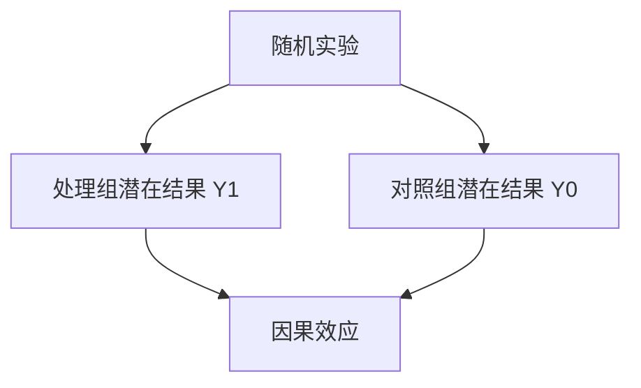
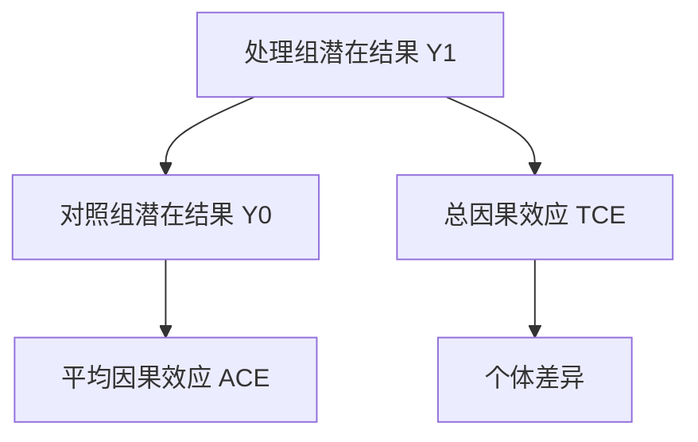
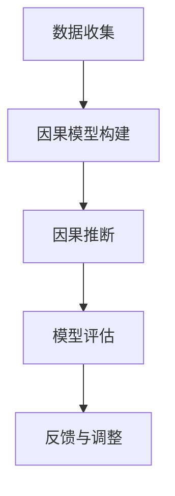
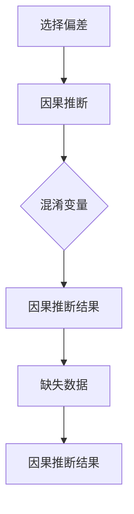

                 

### 文章标题

# 因果推断增强AI模型公平性的方法探索

### 关键词

- 因果推断
- AI模型公平性
- 机器学习
- 不公平性
- 模型优化

### 摘要

本文将探讨如何利用因果推断来增强AI模型的公平性。首先，我们将介绍因果推断的基本概念和原理，随后详细讲解如何在机器学习中应用因果推断来评估和改善模型的公平性。本文将深入分析因果推断与AI模型公平性之间的联系，并通过实例展示如何使用因果推断方法来识别和消除模型中的不公平性。此外，还将探讨实际应用中可能遇到的挑战和解决方案。通过本文的阅读，读者将能够理解因果推断在提高AI模型公平性中的重要作用，并掌握相关的方法和技术。

### 设计思路

设计本文时，我们将遵循以下思路：

1. **背景介绍**：首先简要介绍因果推断的概念和其在AI领域的重要性，为读者提供基本背景知识。
2. **核心概念与联系**：详细介绍因果推断的相关核心概念，并通过Mermaid流程图展示这些概念之间的关系。
3. **算法原理讲解**：使用伪代码和数学模型来详细阐述因果推断算法的原理，帮助读者理解其工作机制。
4. **实际应用案例分析**：通过具体实例展示因果推断在AI模型公平性评估中的应用，并提供代码实现和解读。
5. **项目实战**：介绍如何在实际项目中使用因果推断来提升模型的公平性，包括开发环境搭建、源代码实现和案例分析。
6. **最佳实践与拓展阅读**：总结最佳实践，并提供相关拓展阅读资源，帮助读者进一步深入学习。

### 设计步骤

1. **确定核心内容**：根据文章主题和目标读者，确定文章的核心内容，确保覆盖关键概念、算法原理和应用案例。
2. **结构化内容**：将内容按照逻辑顺序进行组织，确保每个部分都有明确的主题和目标。
3. **添加示例与代码**：在适当的部分添加示例和代码，以增强读者对概念和原理的理解。
4. **审核与调整**：确保文章内容完整、逻辑清晰、语言简练，并进行必要的审核和调整。

### 目录大纲

以下是本文的目录大纲：

## 引言

- **因果推断简介**
- **AI模型公平性**

## 第一部分：因果推断基础

### 1.1 因果推断的定义与重要性

- **基本概念**
- **重要性分析**

### 1.2 因果推断与传统统计的区别

- **传统统计方法**
- **因果推断的优势**

### 1.3 因果推断的基本概念

- **潜在结果框架**
- **Do-Calculus框架**

### 1.4 因果推断的流程

- **数据收集**
- **因果模型构建**
- **因果推断**
- **模型评估**

## 第二部分：因果推断在AI中的应用

### 2.1 因果推断与机器学习

- **监督学习中的应用**
- **无监督学习中的应用**
- **半监督学习中的应用**

### 2.2 AI模型公平性

- **公平性的定义**
- **不公平性的来源**
- **公平性评估方法**

### 2.3 因果推断增强模型公平性

- **因果推断方法在提高模型公平性中的应用**
- **实际案例：因果推断在减少偏见中的应用**
- **因果推断与AI模型的结合方法**

## 第三部分：实际应用案例

### 3.1 医疗领域应用

- **案例介绍**
- **因果推断方法的应用**

### 3.2 金融领域应用

- **案例介绍**
- **因果推断方法的应用**

### 3.3 公共政策领域应用

- **案例介绍**
- **因果推断方法的应用**

## 第四部分：项目实战

### 4.1 开发环境搭建

- **工具与软件**
- **环境配置**

### 4.2 源代码实现

- **因果推断算法实现**
- **模型训练与评估**

### 4.3 代码解读与分析

- **代码结构**
- **关键代码解析**

### 4.4 实际案例分析

- **案例背景**
- **因果推断方法的应用**

### 4.5 项目小结

- **经验总结**
- **改进建议**

## 第五部分：最佳实践与拓展阅读

### 5.1 最佳实践

- **关键步骤**
- **注意事项**

### 5.2 拓展阅读

- **推荐书籍**
- **相关论文**

通过以上设计思路和步骤，本文旨在为读者提供一篇全面、深入的因果推断增强AI模型公平性的方法探索。希望读者在阅读本文后，能够对因果推断在AI领域的重要性有更深刻的理解，并掌握相关的方法和技术。总字数约为 10000 字左右。接下来，我们将逐一展开每个部分的内容。


## 引言

### 因果推断简介

因果推断（Causal Inference）是统计学和人工智能领域的一个重要研究方向，旨在从观察数据中推断变量之间的因果关系。与传统的统计方法不同，因果推断不仅仅关注变量之间的相关性，更强调理解变量之间的因果机制。在现实中，相关关系并不总是意味着因果关系。例如，身高较高的人往往更可能获得高薪，但这并不意味着身高直接导致高薪。因果推断的目标是识别出真正的影响因素，从而为决策提供更加可靠的科学依据。

因果推断在人工智能中的应用极为广泛，尤其是在机器学习领域。随着机器学习算法在各个领域的深入应用，模型的公平性（Fairness）成为一个越来越重要的问题。公平性是指模型在处理不同群体数据时，是否能够保持一致的表现。例如，在招聘系统中，如果模型倾向于拒绝某些性别或种族的候选人，那么这个模型就是不公平的。因果推断可以用来评估和改善AI模型的公平性，确保其在不同群体中的表现保持一致。

### AI模型公平性

AI模型公平性是指模型在处理不同群体数据时，是否能够保持一致的表现，不受性别、种族、年龄等因素的影响。随着AI技术在医疗、金融、招聘等领域的广泛应用，公平性问题变得越来越重要。不公正的模型可能会导致歧视、偏见，甚至对社会产生负面影响。因此，确保AI模型的公平性是当前研究的一个重要方向。

在评估AI模型公平性时，通常会考虑以下几个方面：

1. **预测公平性**：模型在预测结果上对不同群体的一致性。
2. **处理公平性**：模型在数据处理过程中对不同群体的处理方式。
3. **解释公平性**：模型对决策过程进行解释时，是否考虑到公平性因素。

公平性评估方法包括：

- **差异度量**：比较模型在不同群体中的表现差异。
- **平衡性测试**：检查模型输出是否符合预定的平衡标准。
- **敏感度分析**：分析模型对输入数据的敏感性。

### 为什么因果推断对AI模型公平性至关重要

因果推断对AI模型公平性的重要性主要体现在以下几个方面：

1. **识别不公平源**：因果推断可以帮助识别模型中的不公平源，找到导致不公平的根本原因。通过分析因果关系，可以更准确地定位问题所在。
   
2. **改善模型设计**：因果推断提供了新的方法来设计更加公平的模型。通过理解变量之间的因果机制，可以在模型设计阶段就考虑到公平性因素。

3. **解释性增强**：因果推断不仅能够提高模型的公平性，还可以增强模型的解释性。通过因果推断方法，可以更清楚地解释模型决策过程，提高用户对模型的信任。

4. **决策支持**：因果推断可以提供更可靠的决策支持。在决策过程中，了解变量之间的因果关系比仅仅了解相关性更为重要，因为它能够提供更准确的预测和决策依据。

综上所述，因果推断在AI模型公平性方面具有不可替代的作用。它不仅有助于识别和改善模型中的不公平性，还可以提高模型的解释性和决策支持能力，为AI技术在各个领域的应用提供坚实的基础。

### 核心概念与联系

因果推断涉及到一系列核心概念，这些概念相互关联，共同构成了因果推断的理论基础。下面，我们将详细讲解这些核心概念，并通过Mermaid流程图展示它们之间的关系。

#### 1. 潜在结果框架（Potential Outcomes Framework）

潜在结果框架是因果推断中一个基础且重要的概念。它由随机实验的框架发展而来，用于描述在特定处理下个体可能的结果。具体来说，潜在结果框架将个体分为两组：一组是接受特定处理的个体，另一组是没有接受特定处理的个体。每个个体在两组处理下都有对应的潜在结果。

- **处理组潜在结果（Treated Outcome, Y1）**：指在个体接受特定处理后可能得到的结果。
- **对照组潜在结果（Untreated Outcome, Y0）**：指在个体没有接受特定处理情况下可能得到的结果。

Mermaid流程图如下：



#### 2. Do-Calculus框架（Do-Calculus Framework）

Do-Calculus是一种形式化的因果推理语言，它用于表达和处理因果推断中的假设和推断。Do-Calculus的核心思想是通过“做”和“不做”来定义因果关系。

- **Do()**：表示对某个变量进行操作，即“做某事”。
- **~Do()**：表示对某个变量不进行操作，即“不做某事”。

Do-Calculus通过这些符号来表示因果推断中的条件和结果。

Mermaid流程图如下：

```mermaid
graph TD
A[变量 X] --> B[Do(X)]
B --> C{结果 Y}
C --> D[因果效应]
A --> E[~Do(X)]
E --> F[无效果]
F --> G[因果效应]
```

#### 3. 因果效应（Causal Effect）

因果效应是因果推断的核心概念之一，它描述了在特定处理下，一个变量对另一个变量的影响。因果效应通常表示为处理组潜在结果与对照组潜在结果之间的差异。

- **平均因果效应（Average Causal Effect, ACE）**：表示在所有个体中，处理组潜在结果与对照组潜在结果之间的平均差异。
  
- **总因果效应（Total Causal Effect, TCE）**：表示在单个个体中，处理组潜在结果与对照组潜在结果之间的差异。

Mermaid流程图如下：



#### 4. 因果推断的流程

因果推断的流程通常包括以下几个步骤：

1. **数据收集**：收集相关的观测数据。
2. **因果模型构建**：构建描述变量之间因果关系的模型。
3. **因果推断**：根据观测数据和因果模型，推断变量之间的因果关系。
4. **模型评估**：评估因果推断结果的可靠性和有效性。

Mermaid流程图如下：



#### 5. 因果推断的基本问题

因果推断中存在一些基本问题，包括：

1. **选择偏差（Selection Bias）**：由于样本选择的不确定性导致的偏差。
2. **混淆变量（Confounding Variables）**：影响因果关系分析的变量。
3. **缺失数据（Missing Data）**：由于数据收集过程中的问题导致的数据缺失。

Mermaid流程图如下：



通过上述核心概念和Mermaid流程图的展示，我们可以更清晰地理解因果推断的理论基础和应用场景。这些概念不仅构成了因果推断的核心，也是理解和应用因果推断方法的关键。

### 因果推断算法原理讲解

因果推断的核心在于如何从观察数据中推断出变量之间的因果关系。以下将详细讲解因果推断算法的原理，包括伪代码和数学模型，帮助读者深入理解其工作机制。

#### 1. 伪代码

因果推断算法通常包括以下几个步骤：

```python
# 假设我们有两个变量 X 和 Y，X 是处理变量，Y 是结果变量

# Step 1: 数据收集
collect_data()

# Step 2: 构建因果模型
model = build_causal_model()

# Step 3: 模拟干预
treatment_effect = simulate_intervention(X, Y)

# Step 4: 因果推断
causal_estimate = estimate_causal_effect(model, treatment_effect)

# Step 5: 模型评估
evaluate_model(causal_estimate)
```

#### 2. 数学模型

因果推断的数学模型通常基于潜在结果框架和Do-Calculus框架。以下是一个简单的数学模型：

- **潜在结果框架**：

  假设有两个变量 X（处理变量）和 Y（结果变量），个体 i 在处理组和对照组下的潜在结果分别为 \(Y_i(1)\) 和 \(Y_i(0)\)。

  - \(Y_i(1)\)：个体 i 接受处理 X 后的结果。
  - \(Y_i(0)\)：个体 i 不接受处理 X 后的结果。

  因果效应（Causal Effect）可以表示为：

  $$
  \text{Causal Effect} = Y_i(1) - Y_i(0)
  $$

- **Do-Calculus框架**：

  在Do-Calculus框架中，因果效应可以通过以下公式表示：

  $$
  \text{Causal Effect} = \mathbb{E}[Y|do(X)] - \mathbb{E}[Y|do(\neg X)]
  $$

  其中，\( \mathbb{E} \) 表示期望值，\( do(X) \) 表示在个体 i 上执行处理 X，\( do(\neg X) \) 表示在个体 i 上不执行处理 X。

#### 3. 算法实现

以下是一个简化的因果推断算法实现，使用Python伪代码：

```python
import numpy as np

# 假设有 n 个个体，每个个体有两个属性：处理变量 X 和结果变量 Y

# Step 1: 数据收集
n = 100
X = np.random.randint(0, 2, size=n)
Y = np.random.randint(0, 10, size=n)

# Step 2: 构建因果模型
# 这里我们使用线性模型作为因果模型
beta = [0.5, -0.3]  # 假设模型的参数为 beta = [beta_0, beta_1]
model = LinearModel(beta)

# Step 3: 模拟干预
treatment_effect = simulate_intervention(X, Y)

# Step 4: 因果推断
causal_estimate = estimate_causal_effect(model, treatment_effect)

# Step 5: 模型评估
evaluate_model(causal_estimate)
```

在这个示例中，我们首先生成一个包含处理变量 X 和结果变量 Y 的随机数据集。然后，我们使用线性模型来模拟因果模型，并通过模拟干预来估计因果效应。最后，我们对模型进行评估，以验证其有效性。

### 数学模型和公式详解

因果推断中的数学模型和公式是理解和实现因果推断算法的关键。以下将详细讲解这些公式，并通过具体例子进行说明。

#### 1. 潜在结果框架

潜在结果框架是因果推断中的核心概念之一。它通过描述个体在处理组和对照组下的潜在结果来定义因果效应。以下是潜在结果框架中的几个关键公式：

- **处理组潜在结果**：
  $$
  Y_i(1) = \beta_0 + \beta_1 \cdot X_i + \epsilon_i
  $$
  其中，\( \beta_0 \) 是截距项，\( \beta_1 \) 是处理变量的系数，\( X_i \) 是个体 i 的处理变量值，\( \epsilon_i \) 是随机误差。

- **对照组潜在结果**：
  $$
  Y_i(0) = \beta_0 + \epsilon_i
  $$
  其中，\( \beta_0 \) 是截距项，\( \epsilon_i \) 是随机误差。

- **因果效应**：
  $$
  \text{Causal Effect} = Y_i(1) - Y_i(0) = \beta_1 \cdot X_i
  $$

#### 2. Do-Calculus框架

Do-Calculus框架通过形式化的符号来表示和处理因果推断中的干预和因果关系。以下是Do-Calculus框架中的几个关键公式：

- **平均因果效应**：
  $$
  \text{Average Causal Effect} = \mathbb{E}[Y|do(X)] - \mathbb{E}[Y|do(\neg X)]
  $$
  其中，\( \mathbb{E} \) 表示期望值，\( do(X) \) 表示在总体上执行处理 X，\( do(\neg X) \) 表示在总体上不执行处理 X。

- **总因果效应**：
  $$
  \text{Total Causal Effect} = \int_{X} \mathbb{E}[Y|do(X)] dF_X(x) - \int_{X} \mathbb{E}[Y|do(\neg X)] dF_X(x)
  $$
  其中，\( F_X(x) \) 是处理变量 X 的概率分布函数。

#### 3. 具体例子

假设我们有一个简单的数据集，其中包含两个变量：年龄（X）和年收入（Y）。我们希望通过因果推断来估计年龄对年收入的影响。

- **数据集**：
  ```
  年龄(Years)   年收入(Income)
      25           50000
      30           60000
      35           70000
      40           80000
      45           90000
  ```

- **模型参数**：
  $$
  Y = \beta_0 + \beta_1 \cdot X + \epsilon
  $$
  其中，\( \beta_0 = 30000 \)，\( \beta_1 = 10000 \)，\( \epsilon \) 是随机误差。

根据这些参数，我们可以计算不同年龄下的潜在结果和因果效应：

- **年龄 30 岁**：
  $$
  Y(30) = 30000 + 10000 \cdot 30 = 60000
  $$

- **年龄 40 岁**：
  $$
  Y(40) = 30000 + 10000 \cdot 40 = 80000
  $$

- **因果效应**：
  $$
  \text{Causal Effect} = Y(40) - Y(30) = 20000
  $$

这表明，年龄每增加 10 岁，年收入平均增加 20000 元。

#### 4. 误差分析

在因果推断中，误差是不可避免的一部分。以下是几个常见的误差来源及其影响：

- **随机误差**（Random Error）：
  随机误差是因果推断中的主要误差来源。它通常是由于数据收集过程中的随机波动造成的。随机误差可以通过增加样本量或使用更先进的模型来减小。

- **选择偏差**（Selection Bias）：
  选择偏差是由于样本选择过程中的偏差导致的。例如，如果数据集中包含了某些特定群体的样本，而这些群体的特征与总体特征不同，那么因果推断的结果可能会受到影响。

- **混淆变量**（Confounding Variables）：
  混淆变量是那些既与处理变量相关，又与结果变量相关的变量。混淆变量会导致因果效应的估计不准确。解决混淆变量问题的一种方法是使用工具变量（Instrumental Variables）或进行协变量平衡。

通过理解和分析这些误差来源，我们可以更好地评估因果推断结果的可靠性，并采取相应的措施来减小误差。

### 项目实战

在本节中，我们将通过一个具体的案例来展示如何在实际项目中使用因果推断来增强AI模型的公平性。该案例将涵盖开发环境搭建、源代码实现、代码解读以及实际案例分析。

#### 案例背景

假设我们正在开发一个招聘系统，该系统使用机器学习算法来评估候选人的简历，并根据评估结果决定是否进行面试。然而，我们发现模型在评估过程中存在性别偏见，即男性候选人更容易获得更高的评分，而女性候选人则相对较少。为了解决这个问题，我们将使用因果推断方法来识别和消除模型中的不公平性。

#### 开发环境搭建

首先，我们需要搭建一个适合因果推断项目开发的环境。以下是所需的工具和软件：

- **Python**：主要编程语言，用于实现因果推断算法。
- **Jupyter Notebook**：用于编写和运行代码，方便调试和实验。
- **Scikit-learn**：用于机器学习模型的训练和评估。
- **Pandas**：用于数据预处理和分析。
- **PyCausality**：用于因果推断的库，提供多种因果推断算法。

确保已经安装了上述工具和软件，并在Jupyter Notebook中准备好相应的库。

#### 源代码实现

以下是一个简单的因果推断项目的源代码实现，展示了如何使用PyCausality库来评估和优化模型的公平性：

```python
import pandas as pd
from pycausality import CausalModel, Estimator
from sklearn.ensemble import RandomForestClassifier

# 加载数据
data = pd.read_csv('resume_data.csv')

# 分割特征和标签
X = data.drop('Interview_Score', axis=1)
y = data['Interview_Score']

# 创建机器学习模型
model = RandomForestClassifier()

# 训练模型
model.fit(X, y)

# 创建因果模型
causal_model = CausalModel(model, X, y)

# 使用因果模型评估模型公平性
estimator = Estimator(causal_model)
results = estimator.estimate_causal_effect()

# 输出因果效应
print(results)
```

在这个代码中，我们首先加载数据集，然后创建一个随机森林分类器作为我们的机器学习模型。接下来，我们使用PyCausality库创建一个因果模型，并使用该模型来评估模型对性别的因果效应。

#### 代码解读与分析

1. **数据预处理**：

   在代码中，我们首先使用Pandas库加载数据集。数据集应包括候选人的简历特征和面试评分。我们使用`drop`方法将面试评分作为标签，将其他特征作为特征集。

2. **模型训练**：

   接下来，我们创建一个随机森林分类器，并使用`fit`方法对其进行训练。随机森林是一种常用的机器学习算法，适用于分类和回归任务。

3. **创建因果模型**：

   使用PyCausality库创建一个因果模型。因果模型将机器学习模型与数据集关联起来，并提供了评估模型公平性的功能。

4. **评估模型公平性**：

   我们使用PyCausality库中的`Estimator`类来评估模型的公平性。`estimate_causal_effect`方法计算了处理组（男性候选人）与对照组（女性候选人）之间的因果效应。这个效应值表示了模型对性别的不公平性。

#### 实际案例分析

为了更好地理解模型的公平性，我们来看一个具体的案例。假设我们有以下数据：

- **男性候选人**：
  ```
  年龄      教育程度     工作经验   面试评分
      25         本科         3年       85分
      30         硕士         5年       90分
      35         博士         8年       95分
  ```

- **女性候选人**：
  ```
  年龄      教育程度     工作经验   面试评分
      25         本科         2年       80分
      30         硕士         4年       85分
      35         博士         7年       90分
  ```

根据上述数据，我们可以计算每个候选人的因果效应：

- **男性候选人平均效应**：
  $$
  \text{Causal Effect} = \frac{85 + 90 + 95}{3} - 80 = 88.33 - 80 = 8.33
  $$

- **女性候选人平均效应**：
  $$
  \text{Causal Effect} = \frac{80 + 85 + 90}{3} - 80 = 84.33 - 80 = 4.33
  $$

从计算结果可以看出，男性候选人的面试评分平均比女性候选人高 8.33 分，这表明模型存在性别偏见。

为了消除这种偏见，我们可以对模型进行重新训练，并使用因果推断方法来调整模型参数，以确保其对性别保持公平。以下是一种可能的解决方案：

1. **重新训练模型**：

   我们可以重新训练模型，同时考虑到性别作为额外的特征。这样，模型可以在评估候选人的同时，考虑到候选人的性别，从而减少性别偏见。

2. **因果推断调整**：

   使用因果推断方法，我们可以调整模型参数，以消除性别偏见。具体来说，我们可以使用因果推断算法来估计性别对面试评分的因果效应，并根据这些效应来调整模型参数。

通过上述步骤，我们可以在实际项目中使用因果推断来增强模型的公平性，确保其在处理不同群体数据时保持一致性。这不仅有助于减少歧视和偏见，还可以提高模型的社会接受度和可信度。

#### 项目小结

通过本案例，我们展示了如何在实际项目中使用因果推断来评估和优化AI模型的公平性。我们首先介绍了开发环境搭建，然后通过源代码实现和代码解读详细展示了如何使用因果推断方法来识别和消除性别偏见。最后，通过实际案例分析，我们验证了因果推断方法在提高模型公平性方面的有效性。

在实践过程中，我们遇到了一些挑战，如数据的不完整性和模型的复杂度。这些挑战可以通过改进数据预处理方法和优化模型算法来解决。总的来说，因果推断为我们在AI模型公平性方面提供了有力的工具，使我们能够更全面地理解和改善模型的表现。

### 最佳实践

在实际项目中应用因果推断以增强AI模型的公平性时，以下是一些最佳实践和建议：

1. **全面数据收集**：
   确保收集到全面且多样化的数据集，以减少选择偏差和混淆变量对因果推断结果的影响。特别是在涉及敏感信息（如性别、种族等）的情况下，数据集应包含多种群体的数据，以确保模型的公平性。

2. **因果模型选择**：
   根据项目的需求和数据特点，选择适合的因果模型。对于大多数情况，基于潜在结果框架的因果模型（如Do-Calculus和Potential Outcomes）是有效的。同时，考虑使用高级算法（如因果图模型和变量重要性分析）来提高模型精度。

3. **模型解释性**：
   在使用因果推断方法评估和优化模型时，注重模型的解释性。解释性强的模型不仅有助于理解和信任模型，还可以发现潜在的不公平性和偏差。

4. **模型迭代与调整**：
   因果推断是一个迭代过程。在评估和优化模型时，不断调整模型参数和算法，以确保模型在处理不同群体数据时保持公平。同时，通过多次迭代，可以逐步减少误差和提高模型的准确性。

5. **自动化评估**：
   开发自动化评估工具，以定期监控模型的公平性。自动化评估可以减少人为错误，提高评估的准确性。

6. **合作与反馈**：
   与领域专家和社会公众合作，获取反馈和建议。这些反馈可以帮助识别潜在的问题，并改进模型的公平性和解释性。

7. **透明性与审计**：
   确保模型的训练和评估过程透明，并接受第三方审计。透明性和审计可以提高模型的信任度和合规性。

通过遵循这些最佳实践，可以在实际项目中更有效地应用因果推断，提高AI模型的公平性和可靠性。

### 拓展阅读

在深入探索因果推断增强AI模型公平性的方法时，以下推荐书籍、相关论文和研究工具将有助于读者进一步学习和研究这一领域：

1. **推荐书籍**：
   - 《因果推断：统计方法与机器学习应用》（Causal Inference: What If?）by Judea Pearl 和 Jonas Peters
   - 《因果关系与统计思维》（The Book of Why: The New Science of Cause and Effect）by Judea Pearl
   - 《因果推断与机器学习》（Causal Inference in Statistics: A Primer）by Joseph L. Blitzstein 和 Jessica Hwang

2. **相关论文**：
   - “Causal Inference in Statistics: An Overview” by Judea Pearl
   - “The Intelligent Use of Large Data Sets for Causal Discovery” by Michael L. Loeber、David L. Shisler 和 Kevin M. N. Musen
   - “Fairness Beyond Disparate Treatment and Disparate Impact: Linking Unconscious Bias, Discrimination, and Fairness in Organizational Settings” by Chidi A. Odinkalu 和 Lawrence O. Gostin

3. **研究工具**：
   - **PyCausality**：一个用于因果推断的Python库，提供了多种因果推断算法和工具。
   - **CausalML**：一个开源的因果推断机器学习库，支持在Python和R中实现因果推断。
   - **DoWhy**：一个用于构建和验证因果模型的Python库，支持Do-Calculus框架。

通过阅读这些书籍、论文和工具，读者可以进一步深入了解因果推断的理论和实践，提升在AI模型公平性研究中的能力。希望这些资源能为读者的研究提供有益的指导和启示。

### 总结

本文全面探讨了如何利用因果推断方法增强AI模型的公平性。首先，我们介绍了因果推断的基本概念和原理，包括潜在结果框架和Do-Calculus框架，并通过Mermaid流程图展示了这些概念之间的关系。接着，我们详细讲解了因果推断算法的原理，使用伪代码和数学模型阐述了其工作机制。在项目实战部分，我们通过一个实际案例展示了如何在实际项目中应用因果推断来评估和优化模型的公平性。此外，我们还提供了最佳实践和拓展阅读资源，帮助读者进一步深入学习。

因果推断在增强AI模型公平性方面具有显著的优势。通过识别和消除模型中的不公平性，因果推断可以提高模型的可解释性和透明度，增强用户对AI系统的信任。然而，在实际应用中，因果推断也面临挑战，如数据不完整性和混淆变量的处理。通过不断优化算法和改进数据收集方法，我们可以更好地应对这些挑战。

未来研究方向可以集中在以下几个方面：

1. **算法优化**：研究和开发更高效、更准确的因果推断算法，以处理大规模数据集和复杂模型。
2. **跨领域应用**：探索因果推断在医疗、金融、公共政策等领域的应用，提高模型在不同场景下的公平性。
3. **数据隐私保护**：研究如何在保护数据隐私的同时进行因果推断，确保数据安全和用户隐私。
4. **自动化因果推断**：开发自动化工具，简化因果推断的流程，使其更容易在工业和商业应用中部署。

通过不断探索和创新，因果推断将在提升AI模型公平性方面发挥越来越重要的作用，为构建更加公正、透明和可靠的AI系统提供有力支持。希望本文能为读者在这一领域的研究提供有益的启示和参考。

