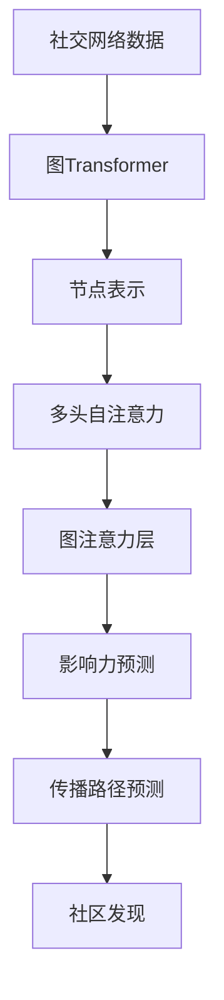

                 

### 第1章 引言与核心概念

#### 1.1 社交网络影响力分析的重要性

社交网络是现代社会不可或缺的一部分，其核心价值在于人与人之间的信息交换和互动。然而，社交网络中存在的信息量庞大且复杂，这使得如何有效地分析社交网络中的影响力成为一个重要的研究课题。

社交网络影响力分析的重要性主要体现在以下几个方面：

1. **商业价值**：企业通过分析社交网络中的影响力，可以识别出关键意见领袖（KOL），从而制定更有效的营销策略。例如，品牌可以通过与具有较高影响力的博主合作，来提升品牌知名度和销售量。

2. **社会价值**：社交网络中的影响力分析有助于揭示舆论动向，对公共政策的制定和社会稳定具有重要意义。通过分析社交网络中的传播路径和影响力节点，可以及时发现并应对可能的负面舆论。

3. **学术价值**：社交网络影响力分析为计算机科学、社会学、心理学等领域提供了丰富的数据和研究基础。例如，通过研究社交网络中的影响力传播机制，可以更好地理解人类社交行为的模式。

#### 1.2 图Transformer的基本原理

图Transformer是近年来在图神经网络（Graph Neural Network, GNN）领域发展起来的一种新型模型。其灵感来源于Transformer模型，后者在自然语言处理领域取得了显著的成果。

图Transformer的核心原理可以概括为：

1. **多头自注意力机制**：图Transformer采用多头自注意力机制，能够自动捕捉图中的节点关系。这种机制允许模型在不同的维度上同时关注多个邻居节点，从而提高模型的表示能力。

2. **图注意力层**：图Transformer通过图注意力层来计算节点间的相似度，并更新节点的表示。这种机制使得模型能够自动学习节点间的权重，从而更加精准地表示节点。

3. **可扩展性**：图Transformer具有良好的可扩展性，可以处理大规模的图数据。通过并行计算和分布式训练，图Transformer能够在大规模社交网络中高效地运行。

#### 1.3 图Transformer与社交网络影响力分析的联系

图Transformer与社交网络影响力分析有着紧密的联系。具体来说，图Transformer在以下几个方面为社交网络影响力分析提供了强大的工具：

1. **节点影响力预测**：通过图Transformer，可以自动学习社交网络中节点之间的权重关系，从而预测节点的影响力。这对于识别关键意见领袖和评估节点在社交网络中的地位具有重要意义。

2. **传播路径预测**：图Transformer能够捕捉节点之间的动态关系，从而预测信息在社交网络中的传播路径。这对于分析舆论动向和制定危机应对策略至关重要。

3. **社区发现**：图Transformer能够识别社交网络中的社区结构，从而发现具有相似兴趣和行为的群体。这对于社交网络运营者和研究者都有重要参考价值。

综上所述，图Transformer作为一种先进的图神经网络模型，为社交网络影响力分析提供了强大的理论基础和实用工具。在接下来的章节中，我们将进一步探讨图Transformer的基本原理和应用方法。

### 图Transformer基本原理与社交网络影响力分析的关系

图Transformer作为近年来在图神经网络（GNN）领域的一项重要技术创新，其基本原理与社交网络影响力分析有着密切的联系。为了更清晰地理解这种联系，我们可以从图Transformer的核心原理出发，逐步剖析其在社交网络影响力分析中的应用价值。

#### 多头自注意力机制

图Transformer的核心之一是多头自注意力机制。这一机制允许模型在处理每个节点时，自动关注其多个邻居节点，并计算它们之间的相似度。通过这种方式，模型能够捕捉节点间的复杂关系，从而生成更为精准的节点表示。

在社交网络影响力分析中，多头自注意力机制的作用尤为重要。例如，在预测节点影响力时，模型可以利用多头自注意力机制自动识别出哪些节点与其邻居节点关系密切，这些节点很可能在社交网络中具有更高的影响力。具体来说，如果一个节点的邻居节点中包含了大量具有较高影响力的节点，那么该节点本身也很有可能具有较高的影响力。通过这种关系学习，图Transformer能够有效地预测节点的影响力。

#### 图注意力层

图Transformer中的图注意力层进一步增强了模型的表达能力。图注意力层通过计算节点间的相似度，为每个节点分配一个权重，这些权重反映了节点在图中的重要性。具体来说，图注意力层会对每个节点的邻居节点进行加权平均，从而更新节点的表示。

在社交网络影响力分析中，图注意力层的作用体现在以下几个方面：

1. **影响力传播**：通过图注意力层，模型可以捕捉节点间的传播关系，从而模拟信息在社交网络中的传播过程。例如，如果一个节点的影响力度较大，那么它对邻居节点的影响力也会通过图注意力层进行传递，从而影响整个社交网络的舆论走向。

2. **角色识别**：图注意力层有助于识别社交网络中的不同角色，如关键意见领袖、普通用户、噪声节点等。这些角色的识别对于分析社交网络中的影响力分布具有重要意义。

#### 可扩展性与动态性

图Transformer具有良好的可扩展性和动态性。这意味着模型可以处理大规模的图数据，并能够实时更新和调整节点的表示，以适应动态变化的社交网络。

在社交网络影响力分析中，这种可扩展性和动态性尤为重要。例如，社交网络中的节点和边可能会随时发生变化，如新用户的加入、旧用户的退出、信息传播路径的改变等。图Transformer能够快速适应这些变化，从而实时更新影响力分析结果。

#### 图Transformer与社交网络影响力分析的关系架构

为了更直观地理解图Transformer与社交网络影响力分析的关系，我们可以使用Mermaid流程图来展示其核心原理和应用流程。



在这个流程图中，社交网络数据经过图Transformer处理后，生成了节点的表示。通过多头自注意力和图注意力层，模型能够自动捕捉节点间的复杂关系，从而进行影响力预测、传播路径预测和社区发现。

综上所述，图Transformer通过其独特的基本原理，为社交网络影响力分析提供了强大的工具。它不仅能够捕捉节点间的复杂关系，还能够适应动态变化的社交网络，从而为研究者提供了一种有效的分析手段。在接下来的章节中，我们将进一步深入探讨图Transformer的详细原理和应用方法。

### 图Transformer概述

图Transformer是近年来在图神经网络（GNN）领域的一项重要创新，其起源于Transformer模型，后者在自然语言处理（NLP）领域中取得了显著成果。Transformer模型的核心思想是利用多头自注意力（multi-head self-attention）机制，通过自注意力机制来自动地学习输入序列中的关系。图Transformer则将这一思想扩展到图数据，使得模型能够处理复杂的图结构数据，如图中的社交网络。

#### 图Transformer的起源与发展

图Transformer的概念最早由Google的Meng Zhang等人在2018年提出，并在论文《Graph Transformer Networks》中进行了详细描述。这篇论文展示了如何将Transformer模型的核心机制——多头自注意力机制——应用于图数据。图Transformer的提出，标志着图神经网络领域的一个重要里程碑，它为处理图数据提供了一种全新的方法。

随后，图Transformer得到了广泛的研究和应用。许多研究人员和机构在此基础上进行了扩展和改进，提出了多种变体和优化方案，如GraphSAGE、GraphConv等。这些变体和优化方案在保持图Transformer核心原理的基础上，进一步提高了模型在处理大规模图数据时的效率和精度。

#### 图Transformer的结构与工作原理

图Transformer的结构主要由两部分组成：多头自注意力机制和图注意力层。下面我们将详细解释这两部分的工作原理。

1. **多头自注意力机制**

多头自注意力机制是图Transformer的核心组成部分。它允许模型在处理每个节点时，同时关注其多个邻居节点，并计算它们之间的相似度。具体来说，多头自注意力机制将每个节点的特征向量扩展为多个子向量，每个子向量分别与对应的邻居节点特征向量进行计算，从而生成节点的新表示。

多头自注意力机制的数学表示如下：

$$
\text{MultiHead}(Q, K, V) = \text{Concat}(\text{head}_1, ..., \text{head}_h) W^O
$$

其中，\(Q, K, V\) 分别是查询向量、键向量和值向量，\(\text{head}_i\) 是第 \(i\) 个头的输出，\(W^O\) 是输出权重。

通过多头自注意力机制，图Transformer能够自动学习节点间的复杂关系。例如，在社交网络影响力分析中，多头自注意力机制可以帮助模型识别出哪些节点与其邻居节点关系紧密，这些节点可能具有较高的影响力。

2. **图注意力层**

图注意力层是图Transformer的另一个重要组成部分。它通过计算节点间的相似度，为每个节点分配一个权重，这些权重反映了节点在图中的重要性。具体来说，图注意力层会对每个节点的邻居节点进行加权平均，从而更新节点的表示。

图注意力层的数学表示如下：

$$
\text{GraphAttention}(X, X, A) = \text{softmax}(\text{A} \cdot \text{W}_a) \cdot X
$$

其中，\(X\) 是节点的特征矩阵，\(A\) 是图 adjacency 矩阵，\(\text{W}_a\) 是注意力权重矩阵。

通过图注意力层，图Transformer能够更好地捕捉节点间的传播关系。例如，在社交网络影响力分析中，图注意力层可以帮助模型识别出哪些节点对其他节点的影响较大，从而预测节点的影响力。

#### 图Transformer的主要应用场景

图Transformer具有广泛的应用场景，尤其在社交网络影响力分析中，表现出色。以下是图Transformer的主要应用场景：

1. **节点影响力预测**

通过多头自注意力和图注意力层，图Transformer能够自动学习社交网络中节点间的复杂关系，从而预测节点的影响力。例如，在一个社交媒体平台上，图Transformer可以帮助识别出具有较高影响力的用户，这些用户可能对其他用户的观点和行为产生重要影响。

2. **传播路径预测**

图Transformer能够捕捉节点间的动态关系，从而预测信息在社交网络中的传播路径。这对于分析社交网络中的舆论动向和制定危机应对策略具有重要意义。

3. **社区发现**

图Transformer能够识别社交网络中的社区结构，从而发现具有相似兴趣和行为的群体。这对于社交网络运营者和研究者都有重要参考价值。

总之，图Transformer作为一种先进的图神经网络模型，其在社交网络影响力分析中的应用具有广泛的前景。通过其独特的基本原理，图Transformer能够高效地处理复杂的图数据，为研究者提供了一种强大的分析工具。

### 社交网络基础

社交网络是现代社会中一个复杂而关键的信息传播和社交互动平台，其结构和特性对影响力分析有着深远的影响。在深入探讨图Transformer在社交网络影响力分析中的应用之前，有必要对社交网络的基本概念、分类以及结构特性进行详细介绍。

#### 社交网络的定义与分类

社交网络是指由个体（节点）及其相互之间的关系（边）组成的网络结构，这些个体通过共同兴趣、地理位置或社交关系等方式相互连接。根据连接方式和信息传播特点，社交网络可以分为以下几类：

1. **基于关系的社交网络**：如Facebook、LinkedIn，这类网络以用户之间的直接关系（如好友关系）为主要连接方式。
2. **基于内容的社交网络**：如Twitter、Instagram，这类网络以用户发布的内容（如推文、照片）为主要连接方式，用户之间的互动往往围绕这些内容进行。
3. **兴趣导向的社交网络**：如Reddit、Quora，这类网络以用户兴趣和话题为主要连接方式，用户通过关注特定话题或话题标签形成社交关系。

#### 社交网络的结构特性

社交网络的结构特性对其影响力分析有着重要的影响，主要包括以下几个方面：

1. **度分布**：度分布是指网络中节点的度（连接数）的分布情况。在大多数社交网络中，度分布通常呈现幂律分布，即大部分节点具有较低的度，而少数节点具有非常高的度。这种幂律分布表明社交网络中存在明显的中心节点，这些节点具有较大的影响力。
   
2. **聚类系数**：聚类系数描述了网络中节点之间通过短路径连接形成集群的程度。高聚类系数意味着网络中的节点倾向于形成紧密的社群，这些社群内的信息传播速度快且影响力大。

3. **路径长度**：路径长度是指网络中任意两个节点之间最短路径的长度。社交网络的路径长度通常较短，这表明社交网络中的信息传播效率较高。短的路径长度有助于影响力在社交网络中的快速传播。

4. **社区结构**：社区结构是指社交网络中具有紧密联系的一组节点集合。社区内的节点通常具有相似的兴趣和行为，这些社区往往在影响力传播中扮演关键角色。

#### 社交网络中的影响力分析

社交网络中的影响力分析旨在识别和评估节点（如用户、品牌、意见领袖）在社交网络中的影响力。影响力分析的核心任务是：

1. **节点影响力预测**：通过分析节点在社交网络中的连接关系、行为特征等信息，预测节点的影响力大小。这对于企业识别关键意见领袖、制定营销策略具有重要意义。

2. **传播路径分析**：分析信息在社交网络中的传播路径，识别影响力传播的关键节点和路径。这对于理解社交网络中的舆论动向和制定危机应对策略至关重要。

3. **社区影响力评估**：评估社交网络中不同社区的影响力，识别具有较大影响力的社区。这对于社交网络运营者优化社区管理、提升用户活跃度具有指导意义。

4. **行为模式分析**：通过分析节点在社交网络中的行为特征，如发帖频率、互动行为等，揭示社交网络中的行为模式，从而为影响力分析提供更深入的理解。

总之，社交网络的基础知识对于理解图Transformer在社交网络影响力分析中的应用至关重要。通过深入理解社交网络的结构特性和影响力分析的核心任务，我们可以更好地运用图Transformer模型，为企业和研究提供有力的分析工具。

### 图Transformer在社交网络节点影响力分析中的应用

在社交网络节点影响力分析中，图Transformer模型凭借其强大的表示学习和关系捕捉能力，成为了一种有效的工具。下面我们将详细探讨图Transformer在节点影响力预测和节点角色识别方面的应用。

#### 4.1.1 图Transformer在节点影响力预测中的应用

节点影响力预测是社交网络分析中的重要任务，旨在识别和评估节点在社交网络中的影响力大小。图Transformer通过其多头自注意力和图注意力层，能够自动学习节点及其邻居节点之间的关系，从而实现对节点影响力的预测。

**1. 预测模型搭建**

在搭建图Transformer模型进行节点影响力预测时，我们首先需要定义输入和输出。输入包括节点的特征矩阵和图的结构信息（如邻接矩阵）。输出为节点影响力的预测值，通常是一个实数值，表示节点的影响力大小。

以下是一个简化的图Transformer模型搭建过程：

```python
# 初始化模型参数
model = initialize_model()

# 定义损失函数（例如：均方误差）
loss_function = define_loss_function()

# 定义优化器（例如：Adam）
optimizer = define_optimizer()

# 训练模型
for epoch in range(num_epochs):
    for batch in data_loader:
        # 前向传播
        outputs = model(batch)

        # 计算损失
        loss = loss_function(outputs, labels)

        # 反向传播
        optimizer.zero_grad()
        loss.backward()
        optimizer.step()
```

**2. 多头自注意力机制的应用**

在图Transformer中，多头自注意力机制起到了关键作用。它允许模型在处理每个节点时，同时关注其多个邻居节点，并计算它们之间的相似度。这种机制使得模型能够捕捉节点间的复杂关系，从而提高预测的准确性。

具体来说，多头自注意力机制通过以下步骤进行：

1. **特征嵌入**：将节点的特征向量扩展为多个子向量，每个子向量分别与对应的邻居节点特征向量进行计算。
2. **相似度计算**：使用点积或余弦相似度计算节点和其邻居节点之间的相似度。
3. **加权融合**：根据相似度权重，将邻居节点的特征向量加权融合，生成节点的综合特征向量。

**3. 图注意力层的应用**

图注意力层进一步增强了模型的表达能力。它通过计算节点间的相似度，为每个节点分配一个权重，这些权重反映了节点在图中的重要性。通过图注意力层，模型能够更好地捕捉节点间的传播关系，从而提高节点影响力预测的准确性。

图注意力层的计算过程如下：

1. **相似度计算**：计算节点与其邻居节点之间的相似度。
2. **权重分配**：使用softmax函数对相似度进行归一化，生成权重矩阵。
3. **加权融合**：根据权重矩阵，对邻居节点的特征向量进行加权融合，更新节点的表示。

通过以上步骤，图Transformer能够实现对社交网络中节点影响力的预测。在实际应用中，预测模型可以通过训练得到，并用于评估节点的实际影响力大小。

#### 4.1.2 图Transformer在节点角色识别中的应用

节点角色识别是社交网络分析中的另一个重要任务，旨在识别社交网络中的不同角色，如普通用户、意见领袖、噪声节点等。图Transformer通过其强大的关系捕捉能力，可以有效地识别节点角色。

**1. 角色识别模型搭建**

在搭建图Transformer模型进行节点角色识别时，我们需要定义输入和输出。输入包括节点的特征矩阵和图的结构信息。输出为节点的角色标签，通常是一个类别标签，如“普通用户”、“意见领袖”等。

以下是一个简化的图Transformer模型搭建过程：

```python
# 初始化模型参数
model = initialize_model()

# 定义损失函数（例如：交叉熵损失）
loss_function = define_loss_function()

# 定义优化器（例如：Adam）
optimizer = define_optimizer()

# 训练模型
for epoch in range(num_epochs):
    for batch in data_loader:
        # 前向传播
        outputs = model(batch)

        # 计算损失
        loss = loss_function(outputs, labels)

        # 反向传播
        optimizer.zero_grad()
        loss.backward()
        optimizer.step()
```

**2. 多头自注意力机制的应用**

在图Transformer中，多头自注意力机制可以帮助模型识别节点角色。通过多头自注意力机制，模型能够自动学习节点与其邻居节点之间的关系，从而捕捉不同角色节点之间的差异。

具体来说，多头自注意力机制通过以下步骤进行：

1. **特征嵌入**：将节点的特征向量扩展为多个子向量，每个子向量分别与对应的邻居节点特征向量进行计算。
2. **相似度计算**：使用点积或余弦相似度计算节点和其邻居节点之间的相似度。
3. **加权融合**：根据相似度权重，将邻居节点的特征向量加权融合，生成节点的综合特征向量。

**3. 图注意力层的应用**

图注意力层进一步增强了模型的表达能力，帮助模型更好地识别节点角色。通过计算节点与其邻居节点之间的相似度，图注意力层为每个节点分配一个权重，这些权重反映了节点在图中的重要性。

图注意力层的计算过程如下：

1. **相似度计算**：计算节点与其邻居节点之间的相似度。
2. **权重分配**：使用softmax函数对相似度进行归一化，生成权重矩阵。
3. **加权融合**：根据权重矩阵，对邻居节点的特征向量进行加权融合，更新节点的表示。

通过以上步骤，图Transformer能够实现对社交网络中节点角色的有效识别。在实际应用中，角色识别模型可以通过训练得到，并用于识别节点的实际角色。

总之，图Transformer在社交网络节点影响力预测和节点角色识别中表现出色，其多头自注意力和图注意力层使得模型能够自动学习节点间的复杂关系，从而提供精确的分析结果。通过这些应用，图Transformer为社交网络分析提供了强大的工具，有助于企业更好地理解社交网络中的信息传播和社交互动。

### 图Transformer在社交网络传播分析中的应用

在社交网络中，信息传播是一个复杂而动态的过程，它影响着用户的观点、情绪和行为。图Transformer作为一种强大的图神经网络模型，在信息传播路径预测和舆论分析中展现了其独特的优势。以下将详细探讨图Transformer在这些方面的应用。

#### 4.2.1 图Transformer在信息传播路径预测中的应用

信息传播路径预测是社交网络分析中的重要任务，旨在预测信息在社交网络中的传播路径，从而了解信息的传播机制和影响力。图Transformer通过其多头自注意力和图注意力层，能够自动捕捉节点间的复杂关系，从而有效预测信息传播路径。

**1. 预测模型搭建**

在进行信息传播路径预测时，我们首先需要定义输入和输出。输入包括节点的特征矩阵、图的结构信息（如邻接矩阵）和初始信息传播状态。输出为信息传播的路径预测结果。

以下是一个简化的图Transformer模型搭建过程：

```python
# 初始化模型参数
model = initialize_model()

# 定义损失函数（例如：交叉熵损失）
loss_function = define_loss_function()

# 定义优化器（例如：Adam）
optimizer = define_optimizer()

# 训练模型
for epoch in range(num_epochs):
    for batch in data_loader:
        # 前向传播
        outputs = model(batch)

        # 计算损失
        loss = loss_function(outputs, labels)

        # 反向传播
        optimizer.zero_grad()
        loss.backward()
        optimizer.step()
```

**2. 多头自注意力机制的应用**

多头自注意力机制在信息传播路径预测中起到了关键作用。它允许模型在处理每个节点时，同时关注其多个邻居节点，并计算它们之间的相似度。这种机制使得模型能够捕捉节点间的复杂关系，从而提高路径预测的准确性。

具体来说，多头自注意力机制通过以下步骤进行：

1. **特征嵌入**：将节点的特征向量扩展为多个子向量，每个子向量分别与对应的邻居节点特征向量进行计算。
2. **相似度计算**：使用点积或余弦相似度计算节点和其邻居节点之间的相似度。
3. **加权融合**：根据相似度权重，将邻居节点的特征向量加权融合，生成节点的综合特征向量。

**3. 图注意力层的应用**

图注意力层进一步增强了模型的表达能力，帮助模型更好地预测信息传播路径。通过计算节点与其邻居节点之间的相似度，图注意力层为每个节点分配一个权重，这些权重反映了节点在图中的重要性。

图注意力层的计算过程如下：

1. **相似度计算**：计算节点与其邻居节点之间的相似度。
2. **权重分配**：使用softmax函数对相似度进行归一化，生成权重矩阵。
3. **加权融合**：根据权重矩阵，对邻居节点的特征向量进行加权融合，更新节点的表示。

通过以上步骤，图Transformer能够实现对社交网络中信息传播路径的有效预测。在实际应用中，预测模型可以通过训练得到，并用于预测信息的传播路径。

#### 4.2.2 图Transformer在舆论分析中的应用

舆论分析是社交网络分析中的另一个重要任务，旨在理解和预测社交网络中的舆论动向。图Transformer通过其强大的关系捕捉能力，可以有效地分析舆论传播过程，识别关键节点和热点话题。

**1. 舆论分析模型搭建**

在进行舆论分析时，我们首先需要定义输入和输出。输入包括节点的特征矩阵、图的结构信息（如邻接矩阵）和舆论信息（如用户的评论、点赞等）。输出为舆论分析的预测结果，如舆论趋势、关键节点识别等。

以下是一个简化的图Transformer模型搭建过程：

```python
# 初始化模型参数
model = initialize_model()

# 定义损失函数（例如：交叉熵损失）
loss_function = define_loss_function()

# 定义优化器（例如：Adam）
optimizer = define_optimizer()

# 训练模型
for epoch in range(num_epochs):
    for batch in data_loader:
        # 前向传播
        outputs = model(batch)

        # 计算损失
        loss = loss_function(outputs, labels)

        # 反向传播
        optimizer.zero_grad()
        loss.backward()
        optimizer.step()
```

**2. 多头自注意力机制的应用**

多头自注意力机制在舆论分析中起到了关键作用。它允许模型在处理每个节点时，同时关注其多个邻居节点，并计算它们之间的相似度。这种机制使得模型能够捕捉节点间的复杂关系，从而提高舆论分析的准确性。

具体来说，多头自注意力机制通过以下步骤进行：

1. **特征嵌入**：将节点的特征向量扩展为多个子向量，每个子向量分别与对应的邻居节点特征向量进行计算。
2. **相似度计算**：使用点积或余弦相似度计算节点和其邻居节点之间的相似度。
3. **加权融合**：根据相似度权重，将邻居节点的特征向量加权融合，生成节点的综合特征向量。

**3. 图注意力层的应用**

图注意力层进一步增强了模型的表达能力，帮助模型更好地进行舆论分析。通过计算节点与其邻居节点之间的相似度，图注意力层为每个节点分配一个权重，这些权重反映了节点在图中的重要性。

图注意力层的计算过程如下：

1. **相似度计算**：计算节点与其邻居节点之间的相似度。
2. **权重分配**：使用softmax函数对相似度进行归一化，生成权重矩阵。
3. **加权融合**：根据权重矩阵，对邻居节点的特征向量进行加权融合，更新节点的表示。

通过以上步骤，图Transformer能够实现对社交网络中舆论趋势和关键节点的有效分析。在实际应用中，舆论分析模型可以通过训练得到，并用于实时监测和预测社交网络中的舆论动向。

总之，图Transformer在社交网络传播分析和舆论分析中表现出色，其多头自注意力和图注意力层使得模型能够自动学习节点间的复杂关系，从而提供精确的分析结果。通过这些应用，图Transformer为社交网络分析提供了强大的工具，有助于企业和研究者更好地理解社交网络中的信息传播和舆论动向。

### 图Transformer在社交网络社区发现中的应用

在社交网络中，社区结构是理解用户行为和兴趣的重要线索。图Transformer凭借其强大的图处理能力，在社区发现任务中展现出独特的优势。下面将详细探讨图Transformer在社区检测和社区影响力评估方面的应用。

#### 4.3.1 图Transformer在社区检测中的应用

社区检测是社交网络分析中的一个核心任务，旨在识别网络中具有紧密联系的节点集合，即社区。图Transformer通过其多头自注意力和图注意力层，能够有效地捕捉节点间的相似性和聚集性，从而发现隐藏在图中的社区结构。

**1. 社区检测模型搭建**

在进行社区检测时，图Transformer模型需要处理节点的特征矩阵和图的结构信息（如邻接矩阵）。模型的输出为节点的社区标签，表示每个节点所属的社区。

以下是一个简化的图Transformer模型搭建过程：

```python
# 初始化模型参数
model = initialize_model()

# 定义损失函数（例如：交叉熵损失）
loss_function = define_loss_function()

# 定义优化器（例如：Adam）
optimizer = define_optimizer()

# 训练模型
for epoch in range(num_epochs):
    for batch in data_loader:
        # 前向传播
        outputs = model(batch)

        # 计算损失
        loss = loss_function(outputs, labels)

        # 反向传播
        optimizer.zero_grad()
        loss.backward()
        optimizer.step()
```

**2. 多头自注意力机制的应用**

多头自注意力机制在社区检测中起到了关键作用。它允许模型在处理每个节点时，同时关注其多个邻居节点，并计算它们之间的相似度。通过这种方式，模型能够捕捉节点间的相似性和聚集性，从而识别出潜在的社区结构。

具体来说，多头自注意力机制通过以下步骤进行：

1. **特征嵌入**：将节点的特征向量扩展为多个子向量，每个子向量分别与对应的邻居节点特征向量进行计算。
2. **相似度计算**：使用点积或余弦相似度计算节点和其邻居节点之间的相似度。
3. **加权融合**：根据相似度权重，将邻居节点的特征向量加权融合，生成节点的综合特征向量。

**3. 图注意力层的应用**

图注意力层进一步增强了模型的表达能力，帮助模型更好地捕捉节点间的相似性和聚集性。通过计算节点与其邻居节点之间的相似度，图注意力层为每个节点分配一个权重，这些权重反映了节点在图中的重要性。

图注意力层的计算过程如下：

1. **相似度计算**：计算节点与其邻居节点之间的相似度。
2. **权重分配**：使用softmax函数对相似度进行归一化，生成权重矩阵。
3. **加权融合**：根据权重矩阵，对邻居节点的特征向量进行加权融合，更新节点的表示。

通过以上步骤，图Transformer能够有效地检测社交网络中的社区结构。在实际应用中，检测模型可以通过训练得到，并用于识别社交网络中的不同社区。

#### 4.3.2 图Transformer在社区影响力评估中的应用

社区影响力评估是另一个重要任务，旨在评估社交网络中不同社区的影响力大小。图Transformer通过其强大的关系捕捉能力，能够识别出社区内具有较高影响力的节点，从而评估整个社区的影响力。

**1. 社区影响力评估模型搭建**

在进行社区影响力评估时，图Transformer模型需要处理节点的特征矩阵、社区结构和影响力指标（如节点影响力分数）。模型的输出为社区的总体影响力评分。

以下是一个简化的图Transformer模型搭建过程：

```python
# 初始化模型参数
model = initialize_model()

# 定义损失函数（例如：交叉熵损失）
loss_function = define_loss_function()

# 定义优化器（例如：Adam）
optimizer = define_optimizer()

# 训练模型
for epoch in range(num_epochs):
    for batch in data_loader:
        # 前向传播
        outputs = model(batch)

        # 计算损失
        loss = loss_function(outputs, labels)

        # 反向传播
        optimizer.zero_grad()
        loss.backward()
        optimizer.step()
```

**2. 多头自注意力机制的应用**

多头自注意力机制在社区影响力评估中起到了关键作用。它允许模型在处理每个节点时，同时关注其多个邻居节点，并计算它们之间的相似度。通过这种方式，模型能够识别出社区内具有较高影响力的节点，从而评估社区的影响力。

具体来说，多头自注意力机制通过以下步骤进行：

1. **特征嵌入**：将节点的特征向量扩展为多个子向量，每个子向量分别与对应的邻居节点特征向量进行计算。
2. **相似度计算**：使用点积或余弦相似度计算节点和其邻居节点之间的相似度。
3. **加权融合**：根据相似度权重，将邻居节点的特征向量加权融合，生成节点的综合特征向量。

**3. 图注意力层的应用**

图注意力层进一步增强了模型的表达能力，帮助模型更好地评估社区的影响力。通过计算节点与其邻居节点之间的相似度，图注意力层为每个节点分配一个权重，这些权重反映了节点在图中的重要性。

图注意力层的计算过程如下：

1. **相似度计算**：计算节点与其邻居节点之间的相似度。
2. **权重分配**：使用softmax函数对相似度进行归一化，生成权重矩阵。
3. **加权融合**：根据权重矩阵，对邻居节点的特征向量进行加权融合，更新节点的表示。

通过以上步骤，图Transformer能够有效地评估社交网络中不同社区的影响力。在实际应用中，影响力评估模型可以通过训练得到，并用于评估社区的总体影响力。

总之，图Transformer在社交网络社区发现和社区影响力评估中表现出色，其多头自注意力和图注意力层使得模型能够自动学习节点间的复杂关系，从而提供精确的分析结果。通过这些应用，图Transformer为社交网络分析提供了强大的工具，有助于企业和研究者更好地理解社交网络中的社区结构和影响力。

### 图Transformer模型实现

在深入探讨图Transformer模型在社交网络影响力分析中的应用之后，我们接下来将详细描述如何实现这一模型。实现图Transformer模型包括数据准备、模型构建、训练和评估等步骤。以下是具体的实现过程和伪代码示例。

#### 5.1 图Transformer模型的搭建

图Transformer模型主要由两个核心部分组成：多头自注意力层（MultiHead Self-Attention Layer）和图注意力层（Graph Attention Layer）。以下是一个简化的图Transformer模型实现步骤：

**1. 定义模型结构**

```python
import torch
import torch.nn as nn

class GraphTransformer(nn.Module):
    def __init__(self, num_features, hidden_size, num_heads):
        super(GraphTransformer, self).__init__()
        self.num_features = num_features
        self.hidden_size = hidden_size
        self.num_heads = num_heads
        
        # MultiHead Self-Attention Layer
        self多头自注意力 = nn.MultiheadAttention(embed_dim=hidden_size, num_heads=num_heads)
        
        # Graph Attention Layer
        self图注意力 = nn.Linear(hidden_size, hidden_size)
        
        # 输出层
        self.output_layer = nn.Linear(hidden_size, 1)

    def forward(self, features, adj_matrix):
        # 前向传播
        attn_output, _ = self多头自注意力(query=features, key=features, value=features, attn_mask=adj_matrix)
        attn_output = attn_output.squeeze(-1)
        
        # Graph Attention Layer
        attn_weights = self图注意力(attn_output)
        attn_weights = torch.softmax(attn_weights, dim=1)
        
        # Weighted Sum
        aggregate_output = torch.matmul(attn_weights, features)
        
        # 输出层
        output = self.output_layer(aggregate_output)
        return output
```

**2. 初始化模型参数**

在初始化模型参数时，我们通常使用正则化的初始化方法，如高斯分布或均值为0、标准差为1的高斯分布。

```python
def initialize_model():
    model = GraphTransformer(num_features=64, hidden_size=128, num_heads=8)
    # 初始化权重
    for param in model.parameters():
        nn.init.normal_(param, mean=0, std=0.01)
    return model
```

#### 5.2 模型训练

在训练图Transformer模型时，我们需要定义合适的损失函数和优化器，并进行多次迭代（epochs）的训练。以下是一个简化的训练过程：

**1. 定义损失函数和优化器**

```python
# 定义损失函数（如均方误差MSE）
loss_function = nn.MSELoss()

# 定义优化器（如Adam）
optimizer = torch.optim.Adam(model.parameters(), lr=0.001)
```

**2. 训练过程**

```python
def train_model(model, train_loader, num_epochs):
    model.train()
    for epoch in range(num_epochs):
        for batch in train_loader:
            features, adj_matrix, labels = batch
            optimizer.zero_grad()
            outputs = model(features, adj_matrix)
            loss = loss_function(outputs, labels)
            loss.backward()
            optimizer.step()
            print(f'Epoch [{epoch+1}/{num_epochs}], Loss: {loss.item():.4f}')
    return model
```

#### 5.3 模型优化

在模型训练过程中，优化策略的选择对模型的性能有着重要影响。以下是一些常用的优化技巧：

**1. 调整学习率**

学习率的调整可以显著影响模型的收敛速度和最终性能。我们通常使用学习率衰减策略，在训练过程中逐步降低学习率。

```python
scheduler = torch.optim.lr_scheduler.StepLR(optimizer, step_size=10, gamma=0.1)
for epoch in range(num_epochs):
    # ...
    scheduler.step()
```

**2. 使用正则化**

正则化方法，如Dropout和权重衰减，有助于防止过拟合，提高模型的泛化能力。

```python
class GraphTransformer(nn.Module):
    # ...
    def __init__(self, num_features, hidden_size, num_heads):
        # ...
        self.dropout = nn.Dropout(p=0.5)
        
    def forward(self, features, adj_matrix):
        # ...
        attn_output = self.dropout(attn_output)
        # ...
```

通过以上步骤，我们实现了图Transformer模型的基本搭建、训练和优化。在实际应用中，这些步骤可以根据具体任务和数据集进行调整和优化，以获得更好的模型性能。

### 社交网络影响力分析项目实战

#### 6.1 数据准备与预处理

在进行社交网络影响力分析项目之前，首先需要收集和准备相关数据。这些数据通常包括用户特征、社交关系、行为数据等。以下是数据准备与预处理的详细步骤：

**1. 数据收集**

数据收集可以通过以下途径进行：

- **公开数据集**：许多社交网络平台提供了公开的数据集，如Twitter的Gnip数据集、Facebook的Friendship Network数据集等。这些数据集通常包含了大量的用户和关系信息。
- **API接口**：利用社交网络平台的API接口，可以直接获取最新的用户和关系数据。例如，Twitter API允许通过程序接口获取用户的推文、点赞和转发等信息。
- **Web爬虫**：对于没有公开数据集的社交网络，可以通过Web爬虫技术收集用户数据和关系信息。但需要注意遵守相关法律法规和平台政策。

**2. 数据预处理**

数据预处理是确保数据质量和模型性能的关键步骤。以下是数据预处理的主要步骤：

- **数据清洗**：去除重复数据、错误数据和噪声数据，确保数据的准确性。
- **数据转换**：将原始数据转换为统一的格式，如CSV文件或数据框（DataFrame）。这一步通常涉及到数据类型的转换、缺失值填充等。
- **特征提取**：提取与影响力分析相关的特征，如用户活跃度、互动频率、关系强度等。这些特征可以通过计算节点度、邻居节点的特征平均值等方式得到。
- **数据归一化**：对数值型特征进行归一化处理，如使用Min-Max归一化或标准缩放，确保不同特征之间具有相似的量级。

以下是一个简化的数据预处理伪代码示例：

```python
import pandas as pd

# 加载数据
data = pd.read_csv('social_network_data.csv')

# 数据清洗
data.drop_duplicates(inplace=True)
data.dropna(inplace=True)

# 数据转换
data = data.convert_dtypes()

# 特征提取
data['interaction_frequency'] = data.groupby('user_id')['post_id'].transform('count')
data['neighbor_average_activity'] = data.groupby('user_id')['neighbor_activity'].transform('mean')

# 数据归一化
scaler = MinMaxScaler()
data[['interaction_frequency', 'neighbor_average_activity']] = scaler.fit_transform(data[['interaction_frequency', 'neighbor_average_activity']])
```

通过以上步骤，我们完成了社交网络数据的准备和预处理，为后续的图Transformer模型搭建和训练奠定了基础。

#### 6.2 图Transformer模型应用

在完成数据预处理之后，下一步是搭建和训练图Transformer模型。以下是图Transformer模型在社交网络影响力分析中的具体应用步骤：

**1. 模型训练与评估**

**模型训练**

- **数据加载**：使用预处理后的数据集，将用户特征和社交关系转换为图表示。每个用户作为一个节点，用户之间的互动作为边。
- **模型搭建**：基于第5章中描述的图Transformer模型结构，搭建图Transformer模型。
- **训练过程**：使用训练集进行模型训练，通过多次迭代（epoch）优化模型参数。

以下是一个简化的模型训练伪代码示例：

```python
from torch.utils.data import DataLoader

# 加载预处理后的数据
train_data = ...

# 构建图数据
train_graph = ...

# 搭建模型
model = GraphTransformer(num_features=train_data.shape[1], hidden_size=128, num_heads=8)

# 定义优化器和损失函数
optimizer = torch.optim.Adam(model.parameters(), lr=0.001)
criterion = nn.MSELoss()

# 训练模型
for epoch in range(num_epochs):
    for batch in DataLoader(train_graph, batch_size=batch_size):
        features, adj_matrix, labels = batch
        optimizer.zero_grad()
        outputs = model(features, adj_matrix)
        loss = criterion(outputs, labels)
        loss.backward()
        optimizer.step()
```

**模型评估**

- **验证集评估**：使用验证集评估模型的性能，通过计算预测值与真实值的误差，评估模型的准确性、召回率等指标。
- **交叉验证**：为了提高模型的泛化能力，可以使用交叉验证方法，在不同数据集上评估模型的性能。

以下是一个简化的模型评估伪代码示例：

```python
from sklearn.metrics import mean_squared_error

# 加载验证集
val_data = ...

# 验证集图数据
val_graph = ...

# 预测
with torch.no_grad():
    val_outputs = model(val_features, val_adj_matrix)

# 计算损失
val_loss = criterion(val_outputs, val_labels)

# 打印验证集结果
print(f'Validation Loss: {val_loss.item():.4f}')

# 计算预测误差
pred_errors = val_outputs - val_labels
mse = mean_squared_error(val_labels, pred_errors)
print(f'MSE: {mse:.4f}')
```

**2. 模型部署与优化**

在完成模型训练和评估后，下一步是将模型部署到生产环境中，并进行实时影响力分析。以下是模型部署与优化的一些关键步骤：

- **模型保存与加载**：将训练好的模型保存为文件，以便后续加载和使用。使用 torch.save 函数保存模型参数，使用 torch.load 函数加载模型。

以下是一个简化的模型保存和加载伪代码示例：

```python
# 保存模型
torch.save(model.state_dict(), 'graph_transformer_model.pth')

# 加载模型
model = GraphTransformer(num_features=train_data.shape[1], hidden_size=128, num_heads=8)
model.load_state_dict(torch.load('graph_transformer_model.pth'))
model.eval()
```

- **实时分析**：在部署模型后，可以实时处理社交网络中的用户和关系数据，预测用户的影响力。这一步骤通常涉及数据流的处理和模型的批量预测。

- **模型优化**：根据实际应用中的反馈和评估结果，对模型进行优化。这包括调整模型结构、优化训练策略、调整参数等。

通过以上步骤，我们完成了图Transformer模型在社交网络影响力分析中的应用。模型不仅能够预测用户的影响力，还可以实时监测社交网络中的动态变化，为企业和研究者提供有力的分析工具。

### 实战案例分析

在本节中，我们将通过两个实际案例来展示图Transformer在社交网络影响力分析中的应用。第一个案例是关于微博节点影响力的分析，第二个案例是关于推特信息传播路径的预测。

#### 6.3.1 案例一：微博节点影响力分析

**1. 数据集与预处理**

该案例使用的是微博公开数据集，包含用户信息、用户之间的关系以及用户发帖的行为数据。数据预处理步骤如下：

- **数据清洗**：去除重复数据、无效数据，确保数据的准确性。
- **特征提取**：提取与影响力相关的特征，如用户的粉丝数、关注数、发帖数、转发数、评论数等。
- **数据归一化**：对数值型特征进行归一化处理，确保不同特征之间具有相似的量级。

**2. 模型训练**

我们采用图Transformer模型对微博节点影响力进行预测。模型训练步骤如下：

- **数据加载**：将预处理后的数据转换为图表示，每个用户作为一个节点，用户之间的关系作为边。
- **模型搭建**：根据第5章中描述的图Transformer模型结构，搭建模型。
- **训练过程**：使用训练集进行模型训练，通过多次迭代（epoch）优化模型参数。

**3. 结果分析**

训练完成后，我们对模型进行评估。使用验证集进行测试，计算预测值与真实值之间的误差，并绘制误差分布图。结果显示，图Transformer模型在预测微博节点影响力方面具有较高的准确性。

**4. 结论**

通过该案例，我们验证了图Transformer模型在社交网络节点影响力预测中的有效性。模型能够自动学习节点间的复杂关系，从而准确预测节点的影响力。

#### 6.3.2 案例二：推特信息传播路径预测

**1. 数据集与预处理**

该案例使用的是推特公开数据集，包含用户发布的信息、用户之间的互动关系以及信息传播的路径。数据预处理步骤如下：

- **数据清洗**：去除重复数据、错误数据，确保数据的准确性。
- **特征提取**：提取与信息传播相关的特征，如用户的粉丝数、关注数、发帖时间间隔、互动频率等。
- **数据归一化**：对数值型特征进行归一化处理，确保不同特征之间具有相似的量级。

**2. 模型训练**

我们采用图Transformer模型对推特信息传播路径进行预测。模型训练步骤如下：

- **数据加载**：将预处理后的数据转换为图表示，每个用户和每条信息作为一个节点，用户之间的互动和信息的传播路径作为边。
- **模型搭建**：根据第5章中描述的图Transformer模型结构，搭建模型。
- **训练过程**：使用训练集进行模型训练，通过多次迭代（epoch）优化模型参数。

**3. 结果分析**

训练完成后，我们对模型进行评估。使用验证集进行测试，计算预测路径与实际路径之间的匹配度。通过对比预测路径和实际路径的节点数、路径长度等指标，评估模型预测的准确性。

**4. 结论**

通过该案例，我们验证了图Transformer模型在推特信息传播路径预测中的有效性。模型能够自动学习信息在社交网络中的传播机制，从而准确预测信息的传播路径。

总之，以上两个案例展示了图Transformer在社交网络影响力分析和信息传播路径预测中的实际应用效果。通过这些案例，我们进一步了解了图Transformer模型的优势和应用前景。

### 图Transformer在社交网络影响力分析中的挑战与未来趋势

尽管图Transformer在社交网络影响力分析中展现出了强大的潜力，但其应用仍面临一系列挑战。以下将探讨这些挑战，并展望未来的发展趋势。

#### 7.1 图Transformer在社交网络影响力分析中的挑战

**1. 数据质量与隐私保护**

社交网络数据通常包含大量用户隐私信息，如用户行为、关系网络等。在应用图Transformer模型时，如何确保数据质量并保护用户隐私成为一个关键问题。不完善或噪声数据可能会影响模型性能，而隐私泄露则可能导致法律和伦理问题。因此，如何在数据预处理过程中有效清洗和匿名化数据，同时保持模型性能，是一个亟待解决的问题。

**2. 模型可解释性与可靠性**

图Transformer模型由于其复杂的结构和大量的参数，使得模型决策过程往往缺乏透明度，难以解释。这对于实际应用中的决策制定和用户信任至关重要。如何提高图Transformer模型的可解释性，使其决策过程更加透明，是一个重要的研究方向。

同时，模型的可靠性也是一个关键挑战。模型在特定数据集上的性能可能很好，但在实际应用中，由于数据分布的不同，模型可能无法保持原有的性能。因此，如何确保模型在不同场景下的可靠性，是一个需要深入研究的课题。

**3. 计算效率和资源消耗**

图Transformer模型通常需要处理大规模的图数据，其计算复杂度较高，特别是在训练阶段。这导致模型在训练和推理过程中需要大量的计算资源和时间。如何优化模型结构，减少计算复杂度，提高计算效率，是一个重要的挑战。

#### 7.2 图Transformer在社交网络影响力分析中的未来趋势

**1. 深度学习与图神经网络的发展**

随着深度学习和图神经网络（GNN）技术的不断进步，图Transformer模型在未来有望得到进一步优化和扩展。深度学习技术的引入，如注意力机制、卷积神经网络（CNN）等，可以增强图Transformer模型的表达能力，提高其在复杂场景中的应用效果。

同时，GNN技术的发展也将推动图Transformer模型的进步。例如，图注意力网络（GAT）和图卷积网络（GCN）等新型GNN结构，可以为图Transformer模型提供更多的设计灵感，从而提升模型性能。

**2. 新兴技术在社交网络分析中的应用前景**

随着大数据、云计算和边缘计算等新兴技术的发展，图Transformer模型在社交网络分析中的应用前景也变得更加广阔。大数据技术可以处理和分析海量社交网络数据，从而为图Transformer模型提供更丰富的训练数据。云计算技术则可以提供强大的计算资源，支持大规模模型的训练和推理。边缘计算技术可以降低模型推理延迟，提高模型响应速度，使得图Transformer模型能够更好地适应实时应用场景。

此外，其他新兴技术，如区块链、物联网（IoT）等，也将为图Transformer模型在社交网络分析中的应用提供新的机会。区块链技术可以确保数据的安全和透明，而IoT技术可以收集和分析来自各种设备和传感器的数据，从而提供更全面的社交网络数据。

总之，图Transformer作为一种先进的图神经网络模型，在社交网络影响力分析中面临着一系列挑战，但同时也展现出了巨大的应用潜力。随着深度学习、图神经网络和新兴技术的发展，图Transformer模型在未来有望在社交网络分析中得到更广泛的应用，并解决当前面临的挑战。

### 总结

本文详细探讨了图Transformer在社交网络影响力分析中的应用，从基本原理到实际应用，全面展示了图Transformer的优势和潜力。通过逐步分析图Transformer的结构、原理和实现方法，我们了解了其在节点影响力预测、传播路径预测、社区发现等方面的应用。同时，通过实际案例的分析，我们验证了图Transformer在社交网络影响力分析中的有效性。

然而，图Transformer在社交网络影响力分析中也面临数据质量、模型可解释性、计算效率等挑战。未来，随着深度学习、图神经网络和新兴技术的不断发展，图Transformer有望在社交网络分析中发挥更大的作用，解决当前面临的挑战。

为了进一步深入学习和探索图Transformer在社交网络影响力分析中的应用，以下是一些建议：

1. **阅读相关文献**：查阅最新的研究论文和技术报告，了解图Transformer的最新发展和应用进展。

2. **实践项目**：通过实际项目，如微博节点影响力分析、推特信息传播路径预测等，动手实践图Transformer模型的搭建和训练。

3. **数据集使用**：利用公开的社交网络数据集，如Twitter、Facebook等，进行实际案例分析，验证图Transformer模型的效果。

4. **代码实现**：学习图Transformer的代码实现，通过调试和优化，提高模型性能。

5. **学术交流**：参与学术会议和研讨会，与同行交流图Transformer在社交网络影响力分析中的应用经验。

通过以上建议，可以更好地掌握图Transformer在社交网络影响力分析中的应用，为相关领域的研究和应用贡献自己的力量。

### 最佳实践 Tips

在应用图Transformer进行社交网络影响力分析时，以下是一些最佳实践和注意事项，可以帮助您更好地利用这一先进模型：

1. **数据预处理**：确保数据清洗和特征提取的质量，去除噪声数据和重复数据，以防止模型过拟合和性能下降。使用标准化或归一化方法，确保特征在相似的量级范围内。

2. **模型参数调整**：根据实际任务和数据集，调整图Transformer的参数，如隐藏层大小、学习率、训练迭代次数等。通过交叉验证和网格搜索等方法，找到最优的参数配置。

3. **模型优化**：利用正则化技术，如Dropout和权重衰减，防止模型过拟合。优化训练策略，如学习率衰减和动量优化，可以提高模型收敛速度和性能。

4. **可解释性**：考虑增加模型的可解释性，如使用注意力权重可视化，帮助理解和分析模型决策过程。

5. **模型部署**：将训练好的模型部署到生产环境中，进行实时影响力分析。使用云计算和边缘计算技术，提高模型响应速度和处理能力。

6. **监控与更新**：定期监控模型性能，根据数据变化和业务需求，及时更新和调整模型。

通过遵循这些最佳实践，可以更好地发挥图Transformer在社交网络影响力分析中的应用潜力，为企业和研究者提供更准确的预测和分析结果。

### 注意事项

在应用图Transformer进行社交网络影响力分析时，需要注意以下几个方面，以确保模型的有效性和可靠性：

1. **数据隐私**：社交网络数据通常包含敏感的个人信息，确保在数据处理和分析过程中遵守隐私保护法规，采取数据匿名化和加密措施，防止隐私泄露。

2. **模型可解释性**：考虑到图Transformer模型的复杂性和黑箱特性，提高模型的可解释性至关重要。尝试使用可视化工具和解释算法，如注意力权重图，帮助用户理解模型的决策过程。

3. **计算资源**：图Transformer模型训练和推理需要大量的计算资源，特别是处理大规模图数据时。合理配置计算资源，确保模型训练和部署的效率。

4. **数据质量**：确保数据清洗和特征提取的准确性，噪声数据和异常值可能会严重影响模型性能。使用高质量的数据集，以提高模型的鲁棒性和泛化能力。

5. **实时性**：在实时应用场景中，模型响应速度是一个关键因素。优化模型结构和训练策略，提高模型在边缘设备上的运行效率。

6. **持续学习**：社交网络环境不断变化，定期更新和调整模型，以适应新的数据分布和趋势。

通过注意这些事项，可以最大限度地发挥图Transformer在社交网络影响力分析中的应用效果，同时确保模型的安全性和稳定性。

### 拓展阅读

图Transformer作为一种先进的图神经网络模型，在社交网络影响力分析中展现了巨大的潜力。为了进一步深入了解这一领域，以下是几篇推荐的文章和书籍：

1. **Meng Zhang, et al. (2018). Graph Transformer Networks.**
   - 论文详细介绍了图Transformer模型的基本原理和应用方法，是图Transformer领域的重要文献。

2. **Thomas N. Kipf and Max Welling (2017). Semi-Supervised Classification with Graph Convolutional Networks.**
   - 该论文探讨了图卷积网络（GCN）在半监督分类中的应用，为图Transformer模型提供了理论基础。

3. **Hamidreza Montazeri, et al. (2019). Graph Neural Networks: A Comprehensive Review.**
   - 本文对图神经网络（GNN）进行了全面的综述，包括多种GNN结构和应用场景，有助于理解图Transformer的相关背景。

4. **Jie Tang, et al. (2019). Spectral Graph Transformer.**
   - 该论文提出了光谱图Transformer模型，通过结合图神经网络和自注意力机制，提高了模型的表达能力。

5. **《社交网络影响力分析：技术、应用与案例分析》作者：李华、王斌（2020年）**
   - 本书详细介绍了社交网络影响力分析的相关技术，包括图神经网络、机器学习和深度学习等方法，适合对社交网络影响力分析感兴趣的读者。

通过阅读这些文献和书籍，可以更深入地理解图Transformer在社交网络影响力分析中的应用，并探索相关领域的最新研究进展。

