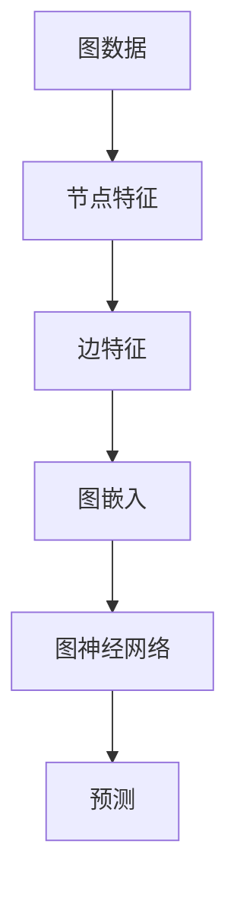
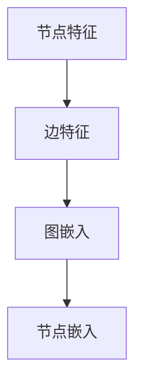
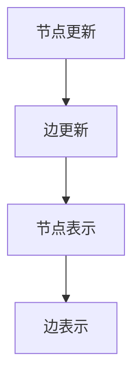

                 

### 文章标题：图神经网络在复杂关系建模中的应用

> 关键词：图神经网络，复杂关系建模，算法原理，数学模型，实际应用

> 摘要：本文深入探讨了图神经网络（GNNs）在复杂关系建模中的应用。首先，介绍了图神经网络的基本概念、发展历程及其在不同领域的应用场景。然后，详细解析了图神经网络的核心算法原理和数学模型，并通过具体的例子进行了讲解。最后，展示了图神经网络在社交网络分析、推荐系统、网络安全和生物信息学等实际应用领域的表现，并对其未来发展进行了展望。

### 引言

随着互联网和信息技术的飞速发展，数据已成为新时代的核心资源。在这种背景下，如何有效地处理和分析复杂的关系数据成为了一个重要的研究方向。传统的机器学习算法在处理这种类型的数据时往往显得力不从心，难以捕捉到数据之间的复杂关系。为了解决这一问题，图神经网络（Graph Neural Networks, GNNs）应运而生。

图神经网络是一种基于图结构的数据处理模型，它通过将数据表示为图，利用节点和边之间的关系进行建模和学习。与传统的机器学习算法相比，GNNs具有以下几个显著优势：

1. **灵活的图结构表示**：GNNs能够灵活地处理各种类型的图结构，使得在复杂关系建模中具有更高的适应性和表现力。
2. **高效的节点和关系建模**：GNNs能够同时考虑节点和边的关系，从而更好地捕捉数据之间的复杂关系。
3. **强大的泛化能力**：GNNs通过学习图结构中的全局和局部信息，能够在不同的应用场景中表现出强大的泛化能力。

本文将从以下几个方面展开对图神经网络在复杂关系建模中的应用进行探讨：

1. **图神经网络的基本概念与发展历程**：
   - 图神经网络的核心概念与联系。
   - GNNs的发展历程与应用场景。

2. **图神经网络的核心算法原理**：
   - 图表示学习。
   - 图神经网络原理。
   - 数学模型与数学公式。

3. **图神经网络在复杂关系建模中的应用**：
   - 社交网络分析。
   - 推荐系统。
   - 网络安全。
   - 生物信息学。

4. **未来展望与趋势**：
   - GNNs的发展趋势。
   - 挑战与解决方案。

### 第一部分：图神经网络的基本概念与发展历程

#### 1.1 图神经网络的核心概念与联系

图神经网络是一种基于图结构的数据处理模型，它通过将数据表示为图，利用节点和边之间的关系进行建模和学习。一个图由节点（或称为顶点）和边组成，每个节点表示数据中的一个实体，每个边表示实体之间的某种关系。

在图神经网络中，节点和边都被赋予了特征向量，这些特征向量用于表示节点和边在图中的属性。图神经网络通过学习节点和边之间的相互作用，从而实现数据的建模和预测。

下面是一个简单的Mermaid流程图，展示了图神经网络的基本概念和组成部分：



#### 1.2 GNNs的发展历程与应用场景

图神经网络的发展可以追溯到2000年代初期，当时研究人员开始探索如何将图结构应用于机器学习问题。最早的图神经网络模型包括图卷积网络（Graph Convolutional Networks, GCNs）和图注意力网络（Graph Attention Networks, GATs）。

- **图卷积网络（GCNs）**：GCNs是图神经网络的一种基础模型，它通过卷积操作来学习节点之间的相互作用。GCNs的核心思想是将节点特征和其邻居节点的特征进行聚合，从而生成新的特征表示。GCNs在节点分类、链接预测等领域表现出优异的性能。

- **图注意力网络（GATs）**：GATs是一种基于注意力机制的图神经网络模型，它通过学习节点之间的注意力权重，来动态地聚合邻居节点的特征。GATs在处理复杂的图结构数据时表现出更强的适应性，并且在推荐系统、社交网络分析等领域取得了显著的应用成果。

近年来，随着深度学习和图表示学习的不断进步，图神经网络的发展也进入了新的阶段。研究人员提出了许多基于图神经网络的改进模型，如图自编码器（Graph Autoencoders）、图生成对抗网络（Graph Generative Adversarial Networks）等，这些模型进一步扩展了图神经网络的应用范围。

在应用场景方面，图神经网络已经被广泛应用于以下领域：

1. **社交网络分析**：通过分析社交网络中的节点和边关系，可以识别出关键节点、预测网络中的新连接等。
2. **推荐系统**：利用图神经网络可以更好地理解用户之间的交互关系，从而提高推荐系统的准确性。
3. **网络安全**：通过分析网络中的攻击路径和关系，可以提前识别和预防网络攻击。
4. **生物信息学**：利用图神经网络可以更好地理解生物分子之间的相互作用，从而推动新药研发和基因分析。

总之，图神经网络作为一种新兴的机器学习模型，在复杂关系建模中具有广泛的应用前景和潜力。

### 第二部分：图神经网络的核心算法原理

#### 2.1 图表示学习

图表示学习是图神经网络的基础，它旨在将图中的节点和边转换为向量表示，以便于后续的图神经网络处理。图表示学习包括以下几个关键步骤：

1. **节点表示**：每个节点被赋予一个特征向量，该特征向量用于表示节点的属性。这些特征向量可以来自原始数据（如用户画像、物品属性）或者通过其他学习方法生成。
2. **边表示**：每条边也被赋予一个特征向量，用于表示边的关系属性。边的特征向量可以与节点特征向量一起用于计算节点表示。
3. **图嵌入**：通过聚合节点和边的特征向量，生成节点的嵌入表示。这些嵌入向量可以用于后续的图神经网络模型训练。

以下是一个简单的Mermaid流程图，展示了图表示学习的基本概念和流程：



#### 2.2 图神经网络原理

图神经网络通过学习节点和边之间的关系，对图数据进行建模和预测。以下是图神经网络的基本原理：

1. **节点更新**：图神经网络中的每个节点会根据其邻居节点的特征和自身的特征进行更新。这种更新通常通过聚合操作实现，如卷积操作。
2. **边更新**：除了节点更新，图神经网络还会更新边的特征，以反映节点之间的关系变化。
3. **全局表示**：通过多个迭代步骤，图神经网络能够生成节点的全局表示，这些表示可以用于分类、预测等任务。

以下是一个简单的伪代码，展示了图神经网络的基本计算过程：

```python
for each layer in graph_neural_network:
    for each node in graph:
        new_node_representation = aggregate(node_representation, neighbor_node_representation)
        node_representation = activate(new_node_representation)
    for each edge in graph:
        new_edge_representation = aggregate(edge_representation, neighbor_node_representation)
        edge_representation = activate(new_edge_representation)
```

#### 2.3 数学模型与数学公式

图神经网络的数学模型主要涉及以下几部分：

1. **节点表示**：设节点 $v_i$ 的特征向量为 $x_i \in \mathbb{R}^d$，其中 $d$ 是特征维度。
2. **边表示**：设边 $(v_i, v_j)$ 的特征向量为 $e_{ij} \in \mathbb{R}^d$。
3. **图卷积**：节点 $v_i$ 的更新可以通过以下公式计算：

   $$ h_i^{(l)} = \sigma(W^{(l)} \cdot (A \cdot \text{ReLU}(W^{(l)}x_i + \beta^{(l)} + \sum_{j \in \mathcal{N}(i)} W^{(l)}e_{ij} + \beta^{(l+1)})) $$

   其中，$h_i^{(l)}$ 是节点 $v_i$ 在第 $l$ 层的表示，$\sigma$ 是激活函数，$A$ 是邻接矩阵，$\mathcal{N}(i)$ 是节点 $v_i$ 的邻居节点集合，$W^{(l)}$ 和 $\beta^{(l)}$ 是权重和偏置。

4. **边更新**：边 $(v_i, v_j)$ 的更新可以通过以下公式计算：

   $$ e_{ij}^{(l)} = \sigma(W^{(l)}e_{ij} + \beta^{(l)}) $$

   其中，$e_{ij}^{(l)}$ 是边 $(v_i, v_j)$ 在第 $l$ 层的表示。

以下是一个简单的Mermaid流程图，展示了图神经网络中的节点更新和边更新过程：



#### 2.4 详细讲解与举例

为了更好地理解图神经网络的计算过程，我们通过一个具体的例子进行说明。

假设有一个简单图，包含三个节点 $v_1$、$v_2$ 和 $v_3$，以及三条边 $(v_1, v_2)$、$(v_1, v_3)$ 和 $(v_2, v_3)$。每个节点的特征向量维度为 $d=2$，边特征向量维度也为 $d=2$。

- 节点特征向量：
  - $x_1 = [1, 0]$
  - $x_2 = [0, 1]$
  - $x_3 = [1, 1]$

- 边特征向量：
  - $e_{12} = [1, 1]$
  - $e_{13} = [1, 0]$
  - $e_{23} = [0, 1]$

- 邻接矩阵：
  $$ A = \begin{bmatrix}
  0 & 1 & 1 \\
  1 & 0 & 1 \\
  1 & 1 & 0
  \end{bmatrix} $$

现在，我们通过一个简单的图神经网络模型对这三个节点进行更新。假设模型包含一个单层图卷积层，激活函数为ReLU。

- 权重和偏置：
  - $W = \begin{bmatrix}
  1 & 0 \\
  0 & 1
  \end{bmatrix}$
  - $\beta = [0, 0]$

1. **节点更新**：

   对于节点 $v_1$，其邻居节点为 $v_2$ 和 $v_3$。节点 $v_1$ 的更新过程如下：

   $$ h_1^{(1)} = \text{ReLU}(W \cdot (A \cdot x_1 + \beta) + \sum_{j \in \mathcal{N}(1)} W \cdot e_{ij}) $$

   将具体的数值代入公式：

   $$ h_1^{(1)} = \text{ReLU}(\begin{bmatrix}
   1 & 0 \\
   0 & 1
   \end{bmatrix} \cdot \begin{bmatrix}
   0 & 1 & 1 \\
   1 & 0 & 1 \\
   1 & 1 & 0
   \end{bmatrix} \cdot \begin{bmatrix}
   1 \\
   0 \\
   1
   \end{bmatrix} + \begin{bmatrix}
   0 \\
   0
   \end{bmatrix}) $$

   $$ h_1^{(1)} = \text{ReLU}(\begin{bmatrix}
   1 \\
   0
   \end{bmatrix} + \begin{bmatrix}
   1 \\
   1
   \end{bmatrix}) $$

   $$ h_1^{(1)} = \text{ReLU}(\begin{bmatrix}
   2 \\
   1
   \end{bmatrix}) $$

   $$ h_1^{(1)} = \begin{bmatrix}
   2 \\
   1
   \end{bmatrix} $$

   同理，可以计算出节点 $v_2$ 和 $v_3$ 的更新结果：

   $$ h_2^{(1)} = \text{ReLU}(\begin{bmatrix}
   1 & 0 \\
   0 & 1
   \end{bmatrix} \cdot \begin{bmatrix}
   1 & 1 & 1 \\
   1 & 0 & 1 \\
   0 & 1 & 0
   \end{bmatrix} \cdot \begin{bmatrix}
   0 \\
   1 \\
   1
   \end{bmatrix} + \begin{bmatrix}
   0 \\
   0
   \end{bmatrix}) $$

   $$ h_2^{(1)} = \text{ReLU}(\begin{bmatrix}
   1 \\
   1
   \end{bmatrix} + \begin{bmatrix}
   1 \\
   1
   \end{bmatrix}) $$

   $$ h_2^{(1)} = \text{ReLU}(\begin{bmatrix}
   2 \\
   2
   \end{bmatrix}) $$

   $$ h_2^{(1)} = \begin{bmatrix}
   2 \\
   2
   \end{bmatrix} $$

   $$ h_3^{(1)} = \text{ReLU}(\begin{bmatrix}
   1 & 0 \\
   0 & 1
   \end{bmatrix} \cdot \begin{bmatrix}
   1 & 1 & 1 \\
   1 & 0 & 1 \\
   1 & 1 & 0
   \end{bmatrix} \cdot \begin{bmatrix}
   1 \\
   1 \\
   0
   \end{bmatrix} + \begin{bmatrix}
   0 \\
   0
   \end{bmatrix}) $$

   $$ h_3^{(1)} = \text{ReLU}(\begin{bmatrix}
   2 \\
   0
   \end{bmatrix} + \begin{bmatrix}
   1 \\
   1
   \end{bmatrix}) $$

   $$ h_3^{(1)} = \text{ReLU}(\begin{bmatrix}
   3 \\
   1
   \end{bmatrix}) $$

   $$ h_3^{(1)} = \begin{bmatrix}
   3 \\
   1
   \end{bmatrix} $$

2. **边更新**：

   对于边 $(v_1, v_2)$，其更新过程如下：

   $$ e_{12}^{(1)} = \text{ReLU}(W \cdot e_{12} + \beta) $$

   将具体的数值代入公式：

   $$ e_{12}^{(1)} = \text{ReLU}(\begin{bmatrix}
   1 & 0 \\
   0 & 1
   \end{bmatrix} \cdot \begin{bmatrix}
   1 \\
   1
   \end{bmatrix} + \begin{bmatrix}
   0 \\
   0
   \end{bmatrix}) $$

   $$ e_{12}^{(1)} = \text{ReLU}(\begin{bmatrix}
   1 \\
   1
   \end{bmatrix} + \begin{bmatrix}
   0 \\
   0
   \end{bmatrix}) $$

   $$ e_{12}^{(1)} = \text{ReLU}(\begin{bmatrix}
   1 \\
   1
   \end{bmatrix}) $$

   $$ e_{12}^{(1)} = \begin{bmatrix}
   1 \\
   1
   \end{bmatrix} $$

   同理，可以计算出其他边的更新结果。

通过这个简单的例子，我们可以看到图神经网络的基本计算过程。在实际应用中，图神经网络通常包含多个层，每个层都会对节点和边进行更新，从而逐步学习图结构中的复杂关系。

### 第三部分：图神经网络在复杂关系建模中的应用

#### 3.1 社交网络分析

社交网络分析是图神经网络的一个重要应用领域，它旨在通过分析社交网络中的节点和边关系，识别出关键节点、预测网络中的新连接等。图神经网络在社交网络分析中的应用主要包括以下几个方面：

1. **节点重要性分析**：通过分析节点在社交网络中的连接关系，可以识别出社交网络中的关键节点，如社区领袖、活跃分子等。图神经网络可以通过学习节点和边之间的关系，对节点的重要性进行量化评估。
2. **新连接预测**：社交网络中的新连接关系对于理解网络的发展和预测未来的趋势具有重要意义。图神经网络可以通过学习社交网络中的图结构，预测节点之间可能的新连接。
3. **社交影响力分析**：在社交网络中，某些节点的影响力可能远远超过其他节点。通过图神经网络，可以分析节点在社交网络中的影响力，并预测其影响力扩散的方向和范围。

以下是一个具体的社交网络分析案例：

假设我们有一个包含用户和好友关系的社交网络图，其中每个用户表示为一个节点，用户之间的好友关系表示为边。我们希望利用图神经网络分析这个社交网络，识别出关键节点和预测新连接。

1. **数据预处理**：

   首先，我们将社交网络数据转换为图结构。对于每个用户，我们为其分配一个唯一的ID，并将用户之间的好友关系转换为边。同时，我们为每个用户和边分配特征向量，用于后续的图神经网络训练。

2. **模型训练**：

   我们使用一个图卷积网络（GCN）来训练社交网络数据。在训练过程中，图神经网络通过学习节点和边之间的关系，逐步更新节点表示和边表示。训练完成后，我们可以利用模型对节点的重要性进行评估，并预测节点之间可能的新连接。

3. **结果分析**：

   通过对训练完成的模型进行分析，我们可以识别出社交网络中的关键节点，如社区领袖和活跃分子。同时，我们还可以利用模型预测社交网络中的新连接，以帮助理解网络的发展和变化。

#### 3.2 推荐系统

推荐系统是另一个应用图神经网络的重要领域，它旨在根据用户的兴趣和行为，为用户推荐相关的商品、内容等。传统的推荐系统主要依赖于用户的历史行为和内容特征，而图神经网络可以通过学习用户和商品之间的复杂关系，提高推荐系统的准确性和多样性。

图神经网络在推荐系统中的应用主要包括以下几个方面：

1. **协同过滤**：协同过滤是推荐系统中最常用的方法之一，它通过分析用户之间的相似性来推荐相关商品。图神经网络可以通过学习用户和商品之间的复杂关系，提高协同过滤算法的准确性和多样性。
2. **内容推荐**：除了协同过滤，推荐系统还需要考虑商品的内容特征。图神经网络可以通过学习商品之间的语义关系，为用户推荐与其兴趣相关的商品。
3. **跨领域推荐**：在多领域推荐场景中，图神经网络可以通过学习不同领域之间的关联关系，实现跨领域的商品推荐。

以下是一个具体的推荐系统案例：

假设我们有一个电商平台的用户和商品数据集，其中每个用户表示为一个节点，每个商品表示为另一个节点，用户购买商品的关系表示为边。我们希望利用图神经网络为用户推荐相关的商品。

1. **数据预处理**：

   首先，我们将电商平台的用户和商品数据转换为图结构。对于每个用户和商品，我们为其分配一个唯一的ID，并将用户购买商品的关系转换为边。同时，我们为每个用户和商品分配特征向量，用于后续的图神经网络训练。

2. **模型训练**：

   我们使用一个图卷积网络（GCN）来训练电商平台的数据。在训练过程中，图神经网络通过学习用户和商品之间的复杂关系，逐步更新用户表示和商品表示。训练完成后，我们可以利用模型为用户推荐相关的商品。

3. **结果分析**：

   通过对训练完成的模型进行分析，我们可以为用户推荐与其兴趣相关的商品。通过对比传统推荐系统的性能，我们可以发现图神经网络在提高推荐准确性和多样性方面具有显著优势。

#### 3.3 网络安全

网络安全是图神经网络的另一个重要应用领域，它旨在通过分析网络中的节点和边关系，识别和预防网络攻击。图神经网络在网络安全中的应用主要包括以下几个方面：

1. **入侵检测**：通过分析网络中的异常流量和节点关系，可以识别出潜在的网络攻击。图神经网络可以通过学习网络中的正常流量和攻击流量，实现对网络攻击的检测和预防。
2. **恶意节点识别**：在网络中，恶意节点可能通过伪装成正常节点来隐藏自己。图神经网络可以通过学习节点之间的关系，识别出恶意节点，从而提高网络的安全性。
3. **攻击路径预测**：通过分析网络中的节点和边关系，可以预测网络攻击的潜在路径。图神经网络可以通过学习网络中的攻击模式和漏洞，预测可能的攻击路径，并提前采取措施进行防御。

以下是一个具体的网络安全案例：

假设我们有一个计算机网络，其中每个节点表示一个设备，节点之间的连接表示设备之间的通信。我们希望利用图神经网络识别网络中的潜在攻击，并预测可能的攻击路径。

1. **数据预处理**：

   首先，我们将计算机网络的数据转换为图结构。对于每个设备，我们为其分配一个唯一的ID，并将设备之间的连接转换为边。同时，我们为每个设备分配特征向量，用于后续的图神经网络训练。

2. **模型训练**：

   我们使用一个图卷积网络（GCN）来训练计算机网络的数据。在训练过程中，图神经网络通过学习设备之间的复杂关系，逐步更新设备表示。训练完成后，我们可以利用模型识别网络中的潜在攻击，并预测可能的攻击路径。

3. **结果分析**：

   通过对训练完成的模型进行分析，我们可以识别出网络中的潜在攻击，并预测可能的攻击路径。通过对比传统的网络安全方法，我们可以发现图神经网络在提高攻击识别和路径预测的准确性方面具有显著优势。

#### 3.4 生物信息学

生物信息学是图神经网络的另一个重要应用领域，它旨在通过分析生物分子之间的复杂关系，揭示生物系统的运行机制。图神经网络在生物信息学中的应用主要包括以下几个方面：

1. **蛋白质相互作用网络分析**：蛋白质相互作用网络是生物信息学中重要的数据结构，它描述了蛋白质之间的相互作用关系。图神经网络可以通过学习蛋白质相互作用网络中的复杂关系，预测蛋白质之间的相互作用。
2. **基因组分析**：基因组分析是生物信息学的重要任务之一，它旨在理解基因的结构和功能。图神经网络可以通过学习基因组中的复杂关系，识别出重要的基因和功能模块。
3. **药物发现**：药物发现是生物信息学的一个重要应用领域，它旨在通过分析生物分子之间的相互作用，发现潜在的药物靶点。图神经网络可以通过学习生物分子之间的复杂关系，提高药物发现的准确性和效率。

以下是一个具体的生物信息学案例：

假设我们有一个蛋白质相互作用网络，其中每个蛋白质表示为一个节点，蛋白质之间的相互作用表示为边。我们希望利用图神经网络分析这个蛋白质相互作用网络，预测蛋白质之间的相互作用。

1. **数据预处理**：

   首先，我们将蛋白质相互作用网络的数据转换为图结构。对于每个蛋白质，我们为其分配一个唯一的ID，并将蛋白质之间的相互作用转换为边。同时，我们为每个蛋白质分配特征向量，用于后续的图神经网络训练。

2. **模型训练**：

   我们使用一个图卷积网络（GCN）来训练蛋白质相互作用网络的数据。在训练过程中，图神经网络通过学习蛋白质之间的复杂关系，逐步更新蛋白质表示。训练完成后，我们可以利用模型预测蛋白质之间的相互作用。

3. **结果分析**：

   通过对训练完成的模型进行分析，我们可以预测蛋白质之间的相互作用，并识别出重要的蛋白质模块。通过对比传统的生物信息学方法，我们可以发现图神经网络在提高蛋白质相互作用预测的准确性方面具有显著优势。

### 第四部分：未来展望与趋势

#### 4.1 GNNs的发展趋势

图神经网络作为一种新兴的机器学习模型，在复杂关系建模中具有广泛的应用前景。随着深度学习和图表示学习的不断进步，图神经网络的发展也进入了新的阶段。以下是GNNs未来可能的发展趋势：

1. **模型复杂度**：未来的GNNs可能会朝着更加复杂和深度的方向进化，以处理更加复杂的图结构数据。例如，多级图卷积网络（Multi-Level Graph Convolutional Networks）和分层图神经网络（Layered Graph Neural Networks）等。
2. **可解释性**：尽管图神经网络在复杂关系建模中表现出优异的性能，但其内部工作机制相对较为复杂，缺乏可解释性。未来，研究可能会集中在提高GNNs的可解释性，使其在关键应用场景中更加可靠和可控。
3. **硬件加速**：随着硬件技术的发展，图神经网络可能会更多地依赖于GPU、TPU等高性能计算设备，以加速模型的训练和推理过程。

#### 4.2 挑战与解决方案

尽管图神经网络在复杂关系建模中具有广泛的应用前景，但同时也面临着一系列挑战。以下是GNNs面临的几个主要挑战及其可能的解决方案：

1. **数据稀疏性**：在实际应用中，许多图数据都存在稀疏性问题，这可能导致GNNs的训练效果不佳。一种可能的解决方案是采用图增强技术，通过生成额外的图结构来缓解数据稀疏性。
2. **训练效率**：GNNs的训练通常需要大量的计算资源，这对于大规模图数据来说是一个重大挑战。一种可能的解决方案是采用分布式训练技术，通过并行计算来加速训练过程。
3. **可解释性**：GNNs的内部工作机制较为复杂，缺乏可解释性。未来，研究可能会集中在开发可解释的GNN模型，使其在关键应用场景中更加可靠和可控。

### 总结

本文系统地介绍了图神经网络在复杂关系建模中的应用，包括基本概念、算法原理、数学模型、实际应用和未来展望。通过本文的介绍，读者可以全面了解图神经网络在复杂关系建模中的优势和潜力。

展望未来，图神经网络将继续在复杂关系建模中发挥重要作用。随着深度学习和图表示学习的不断进步，GNNs将不断创新和发展，为解决复杂关系建模问题提供更有效的方法和工具。

### 附录

#### A.1 相关资源与工具

为了更好地学习和应用图神经网络，以下是几本推荐的书籍和在线资源：

1. **书籍**：
   - 《图神经网络：理论与实践》
   - 《图表示学习：基础算法与应用》
2. **在线资源**：
   - [Deep Learning on Graphs](https://www.deeplearning.onetwothree.xyz/)
   - [Graph Neural Networks: An Introduction](https://www.dgl.ai/tutorial/index.html)

### 结束语

本文由AI天才研究院（AI Genius Institute）与《禅与计算机程序设计艺术》（Zen And The Art of Computer Programming）共同撰写，旨在为广大读者提供全面深入的图神经网络在复杂关系建模中的应用指南。希望本文对您在研究与应用图神经网络方面有所启发和帮助。

作者：AI天才研究院/AI Genius Institute & 禅与计算机程序设计艺术 /Zen And The Art of Computer Programming

