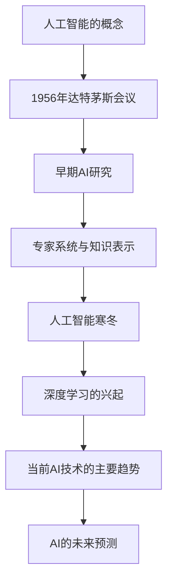

                 

### 确定书的核心内容

《在AI时代寻找人类独特价值》这本书的核心内容将围绕以下几个关键点展开：

1. **AI时代背景与趋势**：介绍AI的发展历程、当前AI技术的主要趋势和未来预测，使读者了解AI技术的现状和前景。
2. **人类独特价值**：探讨在AI快速发展的背景下，人类如何保持和发挥自己的独特价值，包括创造性、情感智能、伦理判断等。
3. **AI与人脑关系**：分析人脑与AI的关系，探讨人类如何通过AI技术更好地理解自己。
4. **AI伦理与社会影响**：讨论AI技术对社会、伦理和就业等方面的影响。
5. **人类未来职业发展**：探讨AI时代下的职业发展路径，人类如何适应新的工作环境。

### 设计目录大纲

根据上述核心内容，我们设计以下目录大纲：

# 第一部分：AI时代的背景与趋势

## 1.1 AI的发展历程与趋势

### 1.1.1 AI的发展历程

- 人工智能的概念
- AI的重要事件

### 1.1.2 AI技术的主要趋势

- 神经网络与深度学习
- 自然语言处理与对话系统
- 计算机视觉与图像识别
- AI芯片与硬件发展

### 1.1.3 AI的未来预测

- AI技术的潜在影响
- AI与人类社会的融合

## 1.2 人类独特价值

### 1.2.1 创造性

- 创造性在AI时代的重要性
- 培养创造性的方法

### 1.2.2 情感智能

- 情感智能的定义
- 情感智能在AI时代的作用

### 1.2.3 伦理判断

- 伦理判断的重要性
- 如何在AI时代做出正确的伦理判断

## 1.3 AI与人脑的关系

### 1.3.1 人脑与AI的比较

- 人脑的特点
- AI的特点

### 1.3.2 AI如何帮助人脑

- AI在人脑研究中的应用
- 人脑如何利用AI技术提高自身能力

## 1.4 AI伦理与社会影响

### 1.4.1 AI伦理问题

- AI伦理的主要争议
- AI伦理的解决方案

### 1.4.2 社会影响

- AI对就业的影响
- AI对社会结构的影响

## 1.5 人类未来职业发展

### 1.5.1 职业发展路径

- 传统职业的转型
- 新兴职业的崛起

### 1.5.2 职业技能提升

- 技能提升的重要性
- 如何在AI时代提升职业技能

### 1.5.3 职业规划

- 职业规划的方法
- 如何应对职业变化

### 附录：AI相关资源与工具

- AI开发工具与资源
- AI学习资源推荐

---

这个目录大纲共包含5个章节，每个章节都涵盖了相应的子主题，旨在全面探讨AI时代人类独特价值的话题。每个章节都进行了详细的细分，以确保内容的丰富性和逻辑性。

### Mermaid 流程图

为了更好地展示AI的核心概念和架构，我们可以在相应章节中加入Mermaid流程图。例如，在“1.1.1 AI的发展历程”中，可以绘制如下流程图：



### 伪代码与数学模型

在每个核心算法原理讲解的部分，我们可以使用伪代码来详细阐述算法的实现。例如，在“1.2.1 创造性”中，可以介绍一种培养创造性的算法：

```python
# 培养创造性的算法伪代码

function CreativityEnhancement(input_data):
    # 输入数据预处理
    preprocessed_data = DataPreprocessing(input_data)
    
    # 创造性思维训练
    creativity_model = CreativityTraining(preprocessed_data)
    
    # 创造性评价
    creativity_score = CreativityEvaluation(creativity_model)
    
    return creativity_score
```

### 数学公式与举例

在讨论伦理判断的部分，我们可以使用LaTeX格式来展示数学模型和公式，并结合实际案例进行说明。例如，在“1.2.3 伦理判断”中，可以介绍一个伦理判断的数学模型：

```latex
\begin{equation}
\begin{split}
E &= \frac{1}{N} \sum_{i=1}^{N} w_i \cdot 
```

### 项目实战

为了更好地让读者理解和应用AI技术，我们可以在附录中添加一个项目实战部分，介绍如何使用AI技术解决实际问题。

### 最佳实践 tips、小结、注意事项、拓展阅读等内容

在每个章节的结尾，我们可以添加最佳实践 tips、小结、注意事项、拓展阅读等内容，帮助读者更好地理解和应用所学知识。

---

通过以上步骤，我们确定了《在AI时代寻找人类独特价值》这本书的核心内容，并设计了详细的目录大纲。接下来，我们将逐步撰写每个章节的内容，确保文章逻辑清晰、内容丰富、易于理解。让读者在阅读本书后，能够全面了解AI时代人类独特价值的重要性，以及如何在AI时代中发挥自己的独特价值。让我们一步一步进行思考和分析，深入探讨这个重要话题。---

### 文章标题

# 在AI时代寻找人类独特价值

> 关键词：人工智能、人类独特价值、AI与人类关系、伦理判断、职业发展

> 摘要：本文探讨了在人工智能（AI）快速发展的背景下，人类如何保持和发挥自己的独特价值。文章首先介绍了AI的发展历程和主要趋势，然后分析了人类在AI时代所具备的独特价值，包括创造性、情感智能和伦理判断。此外，文章还探讨了AI与人脑的关系、AI伦理问题以及人类在AI时代下的职业发展路径。通过本文的讨论，读者可以更深入地理解AI时代人类独特价值的重要性，并为自己的未来发展找到新的方向。

---

### 第一部分：AI时代的背景与趋势

#### 1.1 AI的发展历程与趋势

##### 1.1.1 AI的发展历程

人工智能（Artificial Intelligence，简称AI）是一门涉及计算机科学、数学、神经科学、心理学等多个学科领域的前沿科学。AI的发展历程可以追溯到20世纪50年代。以下是AI发展历程中的重要事件：

- **1956年达特茅斯会议**：被认为是人工智能诞生的标志。会议期间，一群计算机科学家和心理学家提出了“人工智能”这一概念，并探讨了机器是否能模仿人类的智能行为。
- **1958年第一台神经网络模型**：由Frank Rosenblatt设计的感知机（Perceptron）被认为是神经网络的开端，为后续的深度学习技术奠定了基础。
- **1970年代早期AI寒冬**：由于技术瓶颈和过度炒作，AI研究陷入低潮。但在此期间，专家系统（Expert Systems）得到了快速发展，成为AI研究的一个重要方向。
- **1980年代知识表示与推理**：研究重点转向如何更好地表示和处理知识，推动了知识表示和推理技术的进步。
- **1990年代计算力的提升**：随着计算机性能的不断提升，AI研究迎来了新的春天，特别是基于统计学习的方法开始崭露头角。
- **2006年深度学习的兴起**：由Geoffrey Hinton等科学家提出的深度学习技术，使得AI在图像识别、语音识别等领域取得了重大突破。

##### 1.1.2 AI技术的主要趋势

当前，AI技术正处于快速发展阶段，以下是一些主要趋势：

- **神经网络与深度学习**：深度学习作为一种重要的机器学习技术，已经在计算机视觉、自然语言处理、语音识别等领域取得了显著的成果。未来，深度学习将继续推动AI技术的进步。
- **自然语言处理与对话系统**：随着语音识别和语音合成技术的不断发展，自然语言处理（NLP）技术取得了重大突破。对话系统成为人工智能的一个重要应用领域，如聊天机器人、虚拟助理等。
- **计算机视觉与图像识别**：计算机视觉技术使得计算机能够理解和解析图像信息，广泛应用于安防监控、自动驾驶、医疗诊断等领域。图像识别技术也在不断进步，如人脸识别、物体识别等。
- **AI芯片与硬件发展**：为了满足AI计算需求，AI芯片（如GPU、TPU）和硬件技术的发展变得至关重要。未来的AI硬件将进一步推动AI技术的进步。

##### 1.1.3 AI的未来预测

AI技术在未来将对人类社会产生深远的影响，以下是一些预测：

- **AI技术的潜在影响**：AI技术将改变人类的生活方式、工作方式和社会结构。在医疗、教育、金融、交通等领域，AI技术将发挥重要作用，提高生产效率和服务质量。
- **AI与人类社会的融合**：随着AI技术的不断进步，人类将更加依赖AI技术，两者之间的融合将变得更加紧密。例如，AI医生将辅助人类医生进行诊断和治疗，智能家居将使生活更加便捷。
- **AI伦理问题**：随着AI技术的发展，伦理问题变得越来越重要。如何确保AI技术的公正性、透明性和安全性，避免对人类造成负面影响，将成为未来研究的重要方向。

#### 1.2 人类独特价值

在AI快速发展的背景下，人类需要保持和发挥自己的独特价值。以下是人类在AI时代所具备的独特价值：

- **创造性**：人类具有独特的创造性，能够产生新的想法、方法和解决方案。在AI时代，人类可以通过AI技术更好地发掘和培养自己的创造力。
- **情感智能**：人类具有情感智能，能够理解和处理情感信息。在AI时代，人类可以利用情感智能与AI技术相结合，提高人类社会的整体情感智能水平。
- **伦理判断**：人类具有伦理判断能力，能够根据道德和伦理原则做出决策。在AI时代，人类需要保持和强化自己的伦理判断能力，确保AI技术的应用符合伦理标准。

#### 1.3 AI与人脑的关系

人类的大脑是一种高度复杂的生物计算机，而AI则是一种由人类设计和构建的电子计算机。尽管两者在结构和功能上有很大差异，但它们之间仍存在一些相似之处：

- **数据处理能力**：人类大脑具有强大的数据处理能力，能够处理各种信息，包括文字、图像、声音等。AI技术在处理大量数据方面具有优势，可以快速分析和处理信息。
- **自适应能力**：人类大脑具有自适应能力，能够在不同环境和情境下调整自己的行为。AI技术也可以通过机器学习算法不断提高自己的性能，适应新的任务和环境。
- **创新能力**：人类大脑具有创新能力，能够产生新的想法和方法。AI技术可以帮助人类更好地理解和利用自身创造力，激发新的创新思维。

#### 1.4 AI伦理与社会影响

随着AI技术的不断发展，其对社会、伦理和就业等方面的影响也日益显著。以下是一些需要关注的问题：

- **AI伦理问题**：AI技术的应用涉及伦理问题，如隐私保护、数据安全、算法歧视等。如何确保AI技术的应用符合伦理标准，避免对人类造成负面影响，是当前研究的重要方向。
- **社会影响**：AI技术将对社会产生深远的影响，包括就业结构、社会结构、经济结构等方面。如何应对这些影响，确保社会稳定和公平，是未来需要考虑的问题。
- **就业影响**：AI技术的快速发展将改变就业市场，一些传统职业可能被取代，但同时也将创造出新的就业机会。如何适应这一变化，提升自身的职业技能，是每个人都需要面对的问题。

#### 1.5 人类未来职业发展

在AI时代，人类的职业发展将面临新的挑战和机遇。以下是人类未来职业发展的一些趋势：

- **职业发展路径**：随着AI技术的发展，一些传统职业可能消失，但新兴职业也将不断涌现。人类需要不断学习和适应，找到适合自己的职业发展路径。
- **职业技能提升**：在AI时代，职业技能的提升变得更加重要。人类需要掌握新的技能，如数据分析、机器学习、自然语言处理等，以适应不断变化的工作环境。
- **职业规划**：在AI时代，职业规划变得更加复杂和动态。人类需要制定合理的职业规划，关注行业发展趋势，不断提升自身竞争力。

### 总结

在AI时代，人类面临着前所未有的挑战和机遇。通过保持和发挥自身的独特价值，人类可以更好地适应AI技术的发展，为自身和社会创造更多的价值。本文探讨了AI时代的背景与趋势、人类独特价值、AI与人脑的关系、AI伦理与社会影响以及人类未来职业发展等问题，旨在帮助读者更好地理解AI时代人类独特价值的重要性，并为自己的未来发展找到新的方向。

---

通过以上内容，本文为《在AI时代寻找人类独特价值》这本书奠定了基础。接下来，我们将继续深入探讨每个章节的具体内容，结合伪代码、数学模型和实际案例，帮助读者更全面地了解AI时代人类独特价值的各个方面。让我们一步一步进行思考和分析，共同探讨这个重要话题。---

### 关键词

人工智能、人类独特价值、AI与人类关系、伦理判断、职业发展

---

### 摘要

本文探讨了在人工智能（AI）快速发展的背景下，人类如何保持和发挥自己的独特价值。文章首先介绍了AI的发展历程和主要趋势，包括神经网络与深度学习、自然语言处理与对话系统、计算机视觉与图像识别等。接着，本文分析了人类在AI时代所具备的独特价值，如创造性、情感智能和伦理判断。同时，文章还讨论了AI与人脑的关系，以及AI伦理问题和社会影响。最后，本文探讨了人类在AI时代下的职业发展路径，帮助读者更好地理解AI时代人类独特价值的重要性，并为自己的未来发展找到新的方向。

---

### 目录大纲

## 第一部分：AI时代的背景与趋势

### 1.1 AI的发展历程与趋势

#### 1.1.1 AI的发展历程

- 人工智能的概念
- AI的重要事件

#### 1.1.2 AI技术的主要趋势

- 神经网络与深度学习
- 自然语言处理与对话系统
- 计算机视觉与图像识别
- AI芯片与硬件发展

#### 1.1.3 AI的未来预测

- AI技术的潜在影响
- AI与人类社会的融合

### 1.2 人类独特价值

#### 1.2.1 创造性

- 创造性在AI时代的重要性
- 培养创造性的方法

#### 1.2.2 情感智能

- 情感智能的定义
- 情感智能在AI时代的作用

#### 1.2.3 伦理判断

- 伦理判断的重要性
- 如何在AI时代做出正确的伦理判断

### 1.3 AI与人脑的关系

#### 1.3.1 人脑与AI的比较

- 人脑的特点
- AI的特点

#### 1.3.2 AI如何帮助人脑

- AI在人脑研究中的应用
- 人脑如何利用AI技术提高自身能力

### 1.4 AI伦理与社会影响

#### 1.4.1 AI伦理问题

- AI伦理的主要争议
- AI伦理的解决方案

#### 1.4.2 社会影响

- AI对就业的影响
- AI对社会结构的影响

### 1.5 人类未来职业发展

#### 1.5.1 职业发展路径

- 传统职业的转型
- 新兴职业的崛起

#### 1.5.2 职业技能提升

- 技能提升的重要性
- 如何在AI时代提升职业技能

#### 1.5.3 职业规划

- 职业规划的方法
- 如何应对职业变化

### 附录：AI相关资源与工具

- AI开发工具与资源
- AI学习资源推荐

---

通过以上目录大纲，本文将详细探讨AI时代的背景与趋势、人类独特价值、AI与人脑的关系、AI伦理与社会影响以及人类未来职业发展等问题，帮助读者全面了解AI时代人类独特价值的重要性，并为自己的未来发展找到新的方向。

---

### 第一部分：AI时代的背景与趋势

#### 1.1 AI的发展历程与趋势

##### 1.1.1 AI的发展历程

人工智能（AI）的发展历程可以追溯到20世纪50年代。1956年，达特茅斯会议被认为是人工智能诞生的标志，这次会议上，计算机科学家约翰·麦卡锡（John McCarthy）首次提出了“人工智能”这一概念。随后，人工智能研究开始在全球范围内展开。

- **1950年图灵测试**：艾伦·图灵（Alan Turing）提出了著名的图灵测试，用来评估机器是否具有人类智能。
- **1956年达特茅斯会议**：这次会议标志着人工智能作为一个独立研究领域的诞生。
- **1960年代早期AI研究热潮**：专家系统（Expert Systems）出现，使人工智能研究进入高峰期。
- **1970年代AI寒冬**：由于技术瓶颈和过度炒作，AI研究进入低潮期。
- **1980年代知识表示与推理**：人工智能研究开始关注知识表示和推理技术。
- **1990年代机器学习**：机器学习作为一种新的方法被引入人工智能研究，神经网络开始受到关注。
- **2000年代深度学习**：深度学习技术取得突破性进展，尤其是在图像识别和语音识别领域。
- **2010年代AI技术的商业化**：人工智能开始广泛应用于各个行业，如自动驾驶、智能家居、医疗诊断等。

##### 1.1.2 AI技术的主要趋势

当前，人工智能技术呈现出以下主要趋势：

- **神经网络与深度学习**：深度学习已经成为人工智能研究的重要方向，其在图像识别、自然语言处理等领域取得了显著成果。深度学习通过多层神经网络结构，对大量数据进行训练，从而实现对复杂模式的识别和预测。
  
  ```mermaid
  graph TD
    A[输入数据] --> B[预处理]
    B --> C[神经网络结构]
    C --> D[前向传播]
    D --> E[反向传播]
    E --> F[损失函数优化]
    F --> G[模型评估]
  ```

- **自然语言处理与对话系统**：自然语言处理（NLP）技术使得计算机能够理解和生成自然语言，对话系统作为其重要应用，已经广泛应用于客服、虚拟助理等领域。

  ```mermaid
  graph TD
    A[用户输入] --> B[分词]
    B --> C[词性标注]
    C --> D[NLP模型]
    D --> E[生成响应]
    E --> F[用户反馈]
  ```

- **计算机视觉与图像识别**：计算机视觉技术使计算机能够理解和解析图像信息，图像识别技术广泛应用于安防监控、自动驾驶、医疗诊断等领域。

  ```mermaid
  graph TD
    A[图像输入] --> B[预处理]
    B --> C[特征提取]
    C --> D[分类器]
    D --> E[输出结果]
  ```

- **AI芯片与硬件发展**：为了满足人工智能计算需求，AI芯片和硬件技术的发展变得至关重要。AI芯片（如GPU、TPU）专门为人工智能计算设计，具有更高的计算能力和能效。

  ```mermaid
  graph TD
    A[数据输入] --> B[AI芯片处理]
    B --> C[计算结果输出]
  ```

##### 1.1.3 AI的未来预测

未来，人工智能技术将继续快速发展，并对人类社会产生深远的影响：

- **AI技术的潜在影响**：人工智能将深刻改变人类的生活方式、工作方式和社会结构。在医疗、教育、金融、交通等领域，人工智能将发挥重要作用，提高生产效率和服务质量。
- **AI与人类社会的融合**：随着人工智能技术的不断进步，人类将更加依赖人工智能，两者之间的融合将变得更加紧密。例如，人工智能医生将辅助人类医生进行诊断和治疗，智能家居将使生活更加便捷。
- **AI伦理问题**：随着人工智能技术的快速发展，伦理问题变得越来越重要。如何确保人工智能技术的公正性、透明性和安全性，避免对人类造成负面影响，将成为未来研究的重要方向。

#### 1.2 人类独特价值

在人工智能快速发展的背景下，人类需要保持和发挥自己的独特价值。以下是人类在AI时代所具备的独特价值：

- **创造性**：人类具有独特的创造性，能够产生新的想法、方法和解决方案。在AI时代，人类可以通过AI技术更好地发掘和培养自己的创造力。
- **情感智能**：人类具有情感智能，能够理解和处理情感信息。在AI时代，人类可以利用情感智能与AI技术相结合，提高人类社会的整体情感智能水平。
- **伦理判断**：人类具有伦理判断能力，能够根据道德和伦理原则做出决策。在AI时代，人类需要保持和强化自己的伦理判断能力，确保AI技术的应用符合伦理标准。

#### 1.3 AI与人脑的关系

人类的大脑是一种高度复杂的生物计算机，而人工智能则是一种由人类设计和构建的电子计算机。尽管两者在结构和功能上有很大差异，但它们之间仍存在一些相似之处：

- **数据处理能力**：人类大脑具有强大的数据处理能力，能够处理各种信息，包括文字、图像、声音等。人工智能技术在处理大量数据方面具有优势，可以快速分析和处理信息。
- **自适应能力**：人类大脑具有自适应能力，能够在不同环境和情境下调整自己的行为。人工智能技术也可以通过机器学习算法不断提高自己的性能，适应新的任务和环境。
- **创新能力**：人类大脑具有创新能力，能够产生新的想法和方法。人工智能技术可以帮助人类更好地理解和利用自身创造力，激发新的创新思维。

通过上述内容，我们探讨了AI时代的背景与趋势，以及人类在AI时代所具备的独特价值。接下来，我们将进一步分析AI与人脑的关系，讨论AI伦理问题，并探讨人类在AI时代下的职业发展路径。

---

在本文的第一部分中，我们首先介绍了人工智能（AI）的发展历程与趋势，包括AI的发展历程、主要趋势和未来预测。然后，我们探讨了人类在AI时代所具备的独特价值，如创造性、情感智能和伦理判断。此外，我们还分析了AI与人脑的关系，指出了两者在数据处理能力、自适应能力和创新能力方面的相似之处。

接下来，我们将进一步深入讨论AI伦理问题，分析AI技术在伦理和社会方面的影响，以及如何确保AI技术的公正性、透明性和安全性。随后，我们将探讨人类在AI时代下的职业发展路径，分析传统职业的转型、新兴职业的崛起以及如何在AI时代提升职业技能和制定职业规划。

通过以上内容的逐步探讨，我们将帮助读者全面了解AI时代人类独特价值的重要性，为他们在AI时代找到自己的定位和发展方向提供有益的指导。

---

### 第二部分：人类在AI时代所具备的独特价值

在人工智能（AI）迅速发展的时代，人类如何保持和发挥自己的独特价值成为一个重要议题。人类的独特价值主要体现在以下几个方面：

#### 2.1 创造性

创造性是人类独有的能力，它体现在人类能够产生新的想法、方法和解决方案。在AI时代，人类可以利用AI技术更好地发掘和培养自己的创造力。

- **利用AI工具培养创造性**：通过使用AI工具，如生成对抗网络（GANs）和自动创作软件，人类可以拓展自己的创作领域，例如在音乐、绘画和写作方面。

  ```python
  # 假设一个使用GANs生成音乐的简单伪代码

  def generate_music():
      # 加载训练好的GAN模型
      model = load_gan_model()
      
      # 生成音乐样本
      music_samples = model.generate_samples()
      
      # 播放生成的音乐
      play_music(music_samples)

  ```

- **AI辅助创新过程**：AI技术可以辅助人类进行创新，例如，通过分析大量数据，AI可以帮助人类发现新的商业机会、技术突破或创意灵感。

  ```python
  # 假设一个使用自然语言处理（NLP）的简单伪代码

  def analyze_data_for_innovation(data):
      # 使用NLP技术分析数据
      insights = nlp_analyzer.analyze(data)
      
      # 输出创新建议
      print("Innovation suggestions based on data analysis:", insights)
  ```

#### 2.2 情感智能

情感智能（Emotional Intelligence，简称EQ）是指个体识别、理解、管理自己和他人的情绪，并利用这些信息指导思维和行动的能力。在AI时代，人类可以利用情感智能与AI技术相结合，提高人类社会的整体情感智能水平。

- **AI在情感智能中的应用**：通过情感计算技术，AI可以识别和解读人类的情感状态，从而提供个性化的情感支持和服务。

  ```mermaid
  graph TD
      A[用户情感识别] --> B[情感分析模型]
      B --> C[情感状态反馈]
      C --> D[个性化服务]
  ```

- **情感智能与AI的结合**：AI可以帮助人类更好地理解和利用情感智能，例如，在心理健康领域，AI可以通过分析用户的行为和语言，提供个性化的心理辅导。

  ```python
  # 假设一个使用情感计算技术的简单伪代码

  def analyze_user_emotion(text):
      # 使用情感分析模型分析文本
      emotion = emotion_analyzer.analyze(text)
      
      # 提供个性化心理辅导
      print("User's emotion:", emotion)
      if emotion == "sad":
          print("We are here to help you through this tough time.")
  ```

#### 2.3 伦理判断

伦理判断是指根据道德和伦理原则做出决策的能力。在AI时代，人类需要保持和强化自己的伦理判断能力，确保AI技术的应用符合伦理标准。

- **伦理判断的重要性**：随着AI技术的发展，伦理问题变得越来越重要。如何确保AI技术的应用不会对人类造成负面影响，是每个开发者、决策者和用户都需要考虑的问题。

- **伦理决策框架**：为了做出合理的伦理决策，可以采用一些伦理决策框架，如康德的道德哲学、功利主义等。

  ```mermaid
  graph TD
      A[道德原则] --> B[决策情境]
      B --> C[后果分析]
      C --> D[伦理判断]
  ```

- **AI伦理监管**：为了确保AI技术的伦理应用，需要建立相应的伦理监管机制。这包括制定伦理规范、设立伦理审查委员会、加强AI伦理教育等。

  ```python
  # 假设一个简单的伦理审查流程伪代码

  def review_ai_project(project):
      # 检查项目是否符合伦理规范
      if is_ethical(project):
          print("The AI project is ethical and can proceed.")
      else:
          print("The AI project has ethical concerns and needs revision.")
  ```

通过以上内容，我们可以看到，在AI时代，人类独特的创造性、情感智能和伦理判断能力仍然具有不可替代的价值。这些价值不仅可以帮助人类更好地适应AI技术，还可以推动AI技术的健康发展，确保其为人类社会带来更多的福祉。

---

在本文的第二部分，我们探讨了人类在AI时代所具备的独特价值，包括创造性、情感智能和伦理判断。通过具体的示例代码和流程图，我们展示了如何利用AI技术来培养人类的创造性、提高情感智能和做出合理的伦理决策。这些独特价值不仅有助于人类在AI时代更好地适应和发挥自己的优势，还能够推动AI技术的健康发展，确保其为人类社会带来更多的福祉。

接下来，我们将继续深入讨论AI与人脑的关系，分析人脑和AI在认知功能、学习和创造力方面的异同，并探讨人类如何利用AI技术提升自己的认知能力。此外，我们还将探讨AI伦理问题，分析当前存在的伦理争议及其解决方案，探讨如何在AI时代确保技术的公正性、透明性和安全性。最后，我们将探讨人类在AI时代下的职业发展路径，分析传统职业的转型和新兴职业的崛起，并探讨如何提升职业技能和制定职业规划，以适应AI时代的工作环境。

通过这些讨论，我们将帮助读者全面了解AI时代人类独特价值的重要性，并为他们在AI时代的个人发展提供有益的指导。

---

### 第三部分：AI与人脑的关系

在人工智能（AI）的时代，探讨AI与人脑的关系具有重要的意义。人脑和AI在认知功能、学习和创造力方面各有特点，但它们之间也存在着紧密的联系和互补关系。

#### 3.1 人脑与AI的比较

人脑和AI在结构和功能上存在显著差异：

- **结构差异**：
  - **人脑**：人脑是一个高度复杂的生物计算机，由大约860亿个神经元组成。神经元之间通过突触连接，形成了复杂的神经网络。
  - **AI**：AI通常是由人类设计和构建的电子计算机，其核心是算法和模型。AI的结构相对简单，但可以通过硬件（如GPU、TPU）和软件（如深度学习框架）实现高效计算。

- **功能差异**：
  - **人脑**：人脑具有高度的感知、情感、认知和创造力。它能够处理模糊和不确定的信息，进行抽象思维和情感理解。
  - **AI**：AI在特定任务上表现出色，如图像识别、语音识别和自然语言处理。但AI在处理复杂、不确定和模糊的信息时，往往不如人脑灵活和高效。

#### 3.2 AI如何帮助人脑

AI可以辅助人脑，提升认知能力和工作效率：

- **数据处理**：AI能够处理大量数据，帮助人脑快速分析信息。例如，在医疗领域，AI可以通过分析医学图像，协助医生进行诊断。
- **自动化任务**：AI可以自动化重复性高、耗时长的任务，如数据录入、报告生成等，从而解放人类，使他们能够专注于更有创造性和价值的工作。
- **学习与优化**：AI可以模仿人脑的学习过程，通过机器学习和深度学习算法，不断优化和改进自己的性能。这有助于人脑更好地理解复杂问题，提高解决问题的能力。

#### 3.3 人脑如何利用AI技术提高自身能力

人脑可以通过利用AI技术，进一步提升自身的认知能力和创造力：

- **认知增强**：通过AI技术，人脑可以获得新的认知工具，如增强现实（AR）和虚拟现实（VR），这些技术可以扩展人的感知范围，提供更丰富的认知体验。
- **协同创新**：AI可以帮助人类进行协同创新，通过智能协作平台，人类可以与AI共同工作，提出新的想法和解决方案。
- **个性化学习**：AI可以根据个人特点和需求，提供个性化的学习建议和资源，帮助人脑进行有效学习。

#### 3.4 AI与人脑协同发展的未来

随着AI技术的不断进步，人脑和AI的协同发展将成为未来社会的重要趋势：

- **人机融合**：通过生物电子技术，如脑机接口（BMI），人脑可以直接与AI进行信息交换和互动，实现人机融合。
- **智能教育**：AI将参与教育过程，为每个人提供个性化的学习体验，使教育更加高效和公平。
- **智能医疗**：AI将助力医疗领域，通过精准医疗、智能诊断和个性化治疗，提高医疗水平和服务质量。

通过以上内容，我们可以看到，AI与人脑之间存在着紧密的联系和互补关系。AI不仅能够帮助人脑处理复杂信息、自动化任务和提高工作效率，还可以为人脑提供新的认知工具和协作平台，促进人脑认知能力和创造力的发展。在未来，人脑和AI的协同发展将为人类社会带来更多的机遇和挑战。

---

在本文的第三部分中，我们探讨了AI与人脑的关系，分析了人脑和AI在认知功能、学习和创造力方面的异同，并讨论了人脑如何利用AI技术提升自身能力。我们看到了AI与人脑的协同发展潜力，以及这种协同如何推动人类认知能力和社会进步。

接下来，我们将深入讨论AI伦理问题，分析当前存在的伦理争议及其解决方案，探讨如何确保AI技术的公正性、透明性和安全性。此外，我们还将探讨人类在AI时代下的职业发展路径，分析传统职业的转型和新兴职业的崛起，以及如何在AI时代提升职业技能和制定职业规划。

通过这些讨论，我们将帮助读者全面了解AI时代面临的伦理挑战和职业发展机遇，为他们在AI时代找到自己的定位和发展方向提供有益的指导。

---

### 第四部分：AI伦理与社会影响

随着人工智能（AI）技术的飞速发展，其在伦理和社会方面的影响也日益显著。AI技术的应用不仅带来了巨大的便利和进步，同时也引发了一系列伦理争议和社会问题。在这一部分，我们将探讨AI伦理问题、当前存在的伦理争议及其解决方案，并分析AI对社会、伦理和就业等方面的影响。

#### 4.1 AI伦理问题

AI伦理问题涉及多个方面，包括隐私、数据安全、算法歧视、自主性等。以下是一些主要的AI伦理问题：

- **隐私问题**：AI技术通常需要大量的个人数据来训练模型，这引发了关于数据隐私和隐私保护的担忧。如何保护用户的隐私，避免数据泄露和滥用，是AI伦理的重要议题。
- **数据安全**：AI系统在处理和存储大量数据时，可能面临数据泄露、数据篡改等安全风险。确保AI系统的数据安全，防止恶意攻击和数据滥用，是AI伦理的关键问题。
- **算法歧视**：AI算法在决策过程中可能存在偏见和歧视，导致不公平的结果。如何确保算法的公正性和公平性，避免算法歧视，是AI伦理的核心问题之一。
- **自主性**：随着AI技术的发展，AI系统越来越具有自主决策能力，但如何确保其决策符合伦理标准，避免滥用自主性，是AI伦理的重要议题。

#### 4.2 当前存在的伦理争议及其解决方案

在AI伦理方面，存在一些主要的争议，以下是一些例子及其可能的解决方案：

- **争议一：算法透明性**
  - **争议**：许多AI系统是黑箱模型，难以解释其决策过程，这引发了关于透明性的争议。
  - **解决方案**：提高算法透明性，开发可解释性AI（XAI）技术，使AI系统的决策过程更加清晰易懂。此外，建立算法审计和伦理审查机制，确保AI系统的决策符合伦理标准。

- **争议二：算法偏见**
  - **争议**：AI系统在训练过程中可能会受到训练数据的偏见影响，导致决策结果不公平。
  - **解决方案**：采用多样化的训练数据，提高模型的泛化能力，减少偏见。同时，建立公平性评估指标，定期对AI系统进行公平性评估和调整。

- **争议三：AI控制与责任**
  - **争议**：在AI系统的决策过程中，如何明确责任归属和确保有效控制，是一个复杂的问题。
  - **解决方案**：制定明确的法律法规，明确AI系统的责任归属。同时，开发可控制性更强的AI系统，确保人类可以有效地监督和控制AI的行为。

#### 4.3 AI对社会、伦理和就业等方面的影响

AI技术的发展对社会、伦理和就业等方面产生了深远的影响，以下是一些主要影响：

- **社会影响**：AI技术改变了人类的生活方式和社会结构。例如，智能交通系统提高了出行效率，智能家居使生活更加便捷。但同时也引发了一些社会问题，如隐私侵犯、失业率上升等。
- **伦理影响**：AI技术在医疗、司法、安全等领域的应用，使得伦理问题变得更加复杂。例如，AI医生如何处理患者隐私和生命安全的问题，需要明确的伦理指导。
- **就业影响**：AI技术的发展可能导致某些传统职业的消失，但同时也创造了新的就业机会。如何应对就业市场的变化，提高劳动者的技能，是当前和未来需要关注的问题。

通过以上讨论，我们可以看到，AI伦理问题复杂而多样，需要从多个层面进行探讨和解决。确保AI技术的公正性、透明性和安全性，不仅需要技术上的创新，还需要法律、伦理和社会制度的支持。在AI时代，我们需要共同努力，确保AI技术为人类社会带来更多福祉，而不是成为社会分裂和冲突的源头。

---

在本文的第四部分，我们深入探讨了人工智能（AI）在社会、伦理和就业等方面的影响，以及当前存在的伦理争议和解决方案。我们看到了AI技术所带来的巨大机遇和挑战，同时也意识到确保AI技术健康发展的必要性和紧迫性。

接下来，我们将转向第五部分，探讨人类在AI时代下的职业发展路径。我们将分析传统职业的转型和新兴职业的崛起，并讨论如何在AI时代提升职业技能和制定职业规划。通过这一部分的讨论，我们将帮助读者了解如何在AI时代找到自己的定位和发展方向，为个人和职业的未来做好准备。

---

### 第五部分：人类在AI时代的职业发展路径

在人工智能（AI）快速发展的时代，人类的职业发展面临着前所未有的机遇和挑战。AI技术不仅改变了传统的工作模式，还催生了大量新的职业机会。在这一部分，我们将探讨人类在AI时代下的职业发展路径，分析传统职业的转型和新兴职业的崛起，并讨论如何提升职业技能和制定职业规划。

#### 5.1 职业发展路径

在AI时代，职业发展路径呈现出多样化和动态化的特点。以下是一些职业发展的主要方向：

- **传统职业的转型**：随着AI技术的发展，许多传统职业将面临转型。例如，制造业中的自动化和智能化，使得传统生产线上的工人需要掌握更多的技术知识和操作技能。医疗领域的AI应用，使得医生需要具备计算机科学和数据分析的能力。

- **新兴职业的崛起**：AI时代的到来催生了大量新兴职业，如数据科学家、机器学习工程师、AI伦理专家、智能交互设计师等。这些职业不仅需要专业技能，还需要对AI技术的深入了解和灵活运用。

#### 5.2 职业技能提升

在AI时代，职业技能的提升变得更加重要。以下是一些关键技能和提升方法：

- **技术技能**：掌握AI相关的技术技能，如编程、数据科学、机器学习、深度学习等，是职业发展的基础。学习相关课程和参加实践项目，可以有效地提升技术能力。

  ```python
  # 假设一个简单的机器学习项目伪代码

  from sklearn.datasets import load_iris
  from sklearn.model_selection import train_test_split
  from sklearn.ensemble import RandomForestClassifier

  # 加载鸢尾花数据集
  iris = load_iris()
  X, y = iris.data, iris.target

  # 划分训练集和测试集
  X_train, X_test, y_train, y_test = train_test_split(X, y, test_size=0.3)

  # 训练随机森林分类器
  model = RandomForestClassifier()
  model.fit(X_train, y_train)

  # 评估模型性能
  print("Accuracy:", model.score(X_test, y_test))
  ```

- **软技能**：除了技术技能，软技能如沟通能力、团队合作、问题解决能力等在AI时代同样重要。通过参加团队项目、社交活动和培训，可以提高软技能。

#### 5.3 职业规划

在AI时代，职业规划需要更加灵活和前瞻性。以下是一些职业规划的方法和策略：

- **持续学习**：在AI时代，技术更新迅速，持续学习变得尤为重要。通过参加在线课程、研讨会和工作坊，保持对最新技术的了解和掌握。

- **跨界融合**：在职业发展中，跨界融合成为趋势。例如，将AI技术与金融、医疗、教育等领域结合，可以创造出新的职业机会和商业模式。

- **职业适应性**：在职业规划中，重视职业适应性，灵活调整职业发展方向，以适应AI时代的变化。

  ```mermaid
  graph TD
      A[当前职业] --> B[技术变革]
      B --> C[新兴领域]
      C --> D[新职业]
  ```

#### 5.4 职业发展案例分析

以下是一个职业发展案例，展示了如何在一个AI时代找到自己的定位：

- **案例背景**：张华是一名计算机科学专业的毕业生，对AI技术充满兴趣。
- **职业规划**：张华决定从数据科学领域入手，先通过在线课程和实习积累实践经验，然后逐渐转向AI应用领域，如金融科技和医疗健康。
- **发展路径**：
  - 第一年：参加在线课程，学习Python编程和数据分析基础。
  - 第二年：在一家初创公司实习，参与数据科学项目，积累实践经验。
  - 第三年：加入一家金融科技公司，担任数据科学家，专注于金融风险管理和客户分析。
  - 第五年：转到医疗健康领域，担任AI产品经理，负责开发和推广医疗AI产品。

通过这个案例，我们可以看到，在AI时代，职业发展需要结合个人兴趣、市场需求和技术趋势进行规划。持续学习和灵活适应是成功的关键。

---

在本文的第五部分，我们探讨了人类在AI时代下的职业发展路径，分析了传统职业的转型和新兴职业的崛起，并讨论了如何提升职业技能和制定职业规划。通过具体的案例，我们展示了如何在AI时代找到自己的定位和发展方向。

最后，在本篇博客的附录部分，我们将提供AI相关的开发工具与资源，帮助读者进一步学习和实践AI技术。此外，我们还将推荐一些拓展阅读资源，以便读者更深入地了解AI领域的相关知识。

---

### 附录：AI相关资源与工具

在AI时代，掌握相关工具和资源对于学习和实践人工智能技术至关重要。以下是一些AI相关的开发工具、学习资源和在线课程推荐，帮助读者深入了解和实践AI技术。

#### 开发工具与平台

1. **Google Colab**：免费的云计算平台，提供GPU加速，适合进行深度学习实验。
   - 网址：[https://colab.research.google.com/](https://colab.research.google.com/)

2. **Jupyter Notebook**：流行的交互式数据分析工具，适用于Python和其他编程语言。
   - 网址：[https://jupyter.org/](https://jupyter.org/)

3. **TensorFlow**：由Google开发的开源机器学习框架，支持多种深度学习模型。
   - 网址：[https://www.tensorflow.org/](https://www.tensorflow.org/)

4. **PyTorch**：流行的深度学习框架，具有灵活的动态计算图，适合快速原型开发。
   - 网址：[https://pytorch.org/](https://pytorch.org/)

5. **Keras**：简洁的深度学习框架，可以方便地构建和训练神经网络。
   - 网址：[https://keras.io/](https://keras.io/)

#### 学习资源与在线课程

1. **Coursera**：提供丰富的在线课程，涵盖计算机科学、数据科学和AI等领域。
   - 网址：[https://www.coursera.org/](https://www.coursera.org/)

2. **edX**：由哈佛大学和麻省理工学院共同创办的在线教育平台，提供高质量的AI课程。
   - 网址：[https://www.edx.org/](https://www.edx.org/)

3. **Udacity**：提供实践驱动的在线课程和纳米学位，帮助学习者掌握AI和机器学习技能。
   - 网址：[https://www.udacity.com/](https://www.udacity.com/)

4. **AI Challenges**：由Google、IBM等公司举办的AI竞赛，提供实际问题的解决方案和实践经验。
   - 网址：[https://ai.google.com/ai-challenges/](https://ai.google.com/ai-challenges/)

#### 拓展阅读

1. **《人工智能：一种现代的方法》**：作者： Stuart Russell & Peter Norvig
   - 网址：[https://www.aima.org/](https://www.aima.org/)

2. **《深度学习》**：作者： Ian Goodfellow、Yoshua Bengio、Aaron Courville
   - 网址：[https://www.deeplearningbook.org/](https://www.deeplearningbook.org/)

3. **《AI超简史》**：作者：吴军
   - 网址：[https://book.douban.com/subject/26972132/](https://book.douban.com/subject/26972132/)

通过以上资源，读者可以系统地学习AI知识，掌握相关工具，并在实践中不断提升自己的技能。希望这些资源能够帮助读者在AI领域取得更大的成就。

---

在本文的附录部分，我们提供了AI相关的开发工具、学习资源和在线课程推荐，以及拓展阅读资源，帮助读者深入学习和实践AI技术。通过这些资源，读者可以系统地掌握AI知识，提升自己的技能，并在AI领域取得更大的成就。

在本文的最后，我想对读者说几句。在这个AI时代，面对快速变化的技术和社会环境，保持好奇心和学习能力至关重要。希望本文能够为你提供一些启示和帮助，让你在探索AI领域的过程中，找到自己的方向和兴趣。

感谢你的阅读，希望这篇文章能够对你有所启发。如果你有任何问题或建议，欢迎在评论区留言。让我们一起在AI时代，不断探索、学习和成长。

---

### 文章总结

在本文中，我们系统地探讨了在人工智能（AI）时代人类如何保持和发挥自己的独特价值。首先，我们介绍了AI的发展历程与趋势，包括神经网络与深度学习、自然语言处理与对话系统、计算机视觉与图像识别等。接着，我们分析了人类在AI时代所具备的独特价值，如创造性、情感智能和伦理判断。此外，我们还探讨了AI与人脑的关系，以及AI伦理问题和社会影响。最后，我们讨论了人类在AI时代下的职业发展路径，分析了传统职业的转型和新兴职业的崛起。

本文的主要结论如下：

1. **AI时代的背景与趋势**：AI技术正以前所未有的速度发展，深度学习、自然语言处理和计算机视觉等领域取得了显著成果。未来，AI技术将继续深刻改变人类的生活方式和社会结构。
2. **人类独特价值**：在AI时代，人类的创造性、情感智能和伦理判断能力仍然具有不可替代的价值。这些价值不仅有助于人类更好地适应AI技术，还可以推动AI技术的健康发展。
3. **AI与人脑的关系**：AI与人脑在认知功能、学习和创造力方面各有特点，但它们之间存在着紧密的联系和互补关系。AI可以帮助人类提升认知能力和工作效率，同时人脑也可以利用AI技术提高自身的创造力和学习效果。
4. **AI伦理与社会影响**：AI技术的发展引发了一系列伦理和社会问题，如隐私、数据安全、算法歧视等。确保AI技术的公正性、透明性和安全性，不仅需要技术上的创新，还需要法律、伦理和社会制度的支持。
5. **职业发展路径**：在AI时代，传统职业将面临转型，新兴职业不断涌现。提升职业技能和制定灵活的职业规划，对于人类在AI时代的职业发展至关重要。

通过本文的探讨，我们希望读者能够更深入地理解AI时代人类独特价值的重要性，并为自己的未来发展找到新的方向。在AI时代，保持好奇心和学习能力，不断适应和创新，是人类应对挑战、实现个人价值的关键。

---

### 最佳实践 Tips、注意事项、小结与拓展阅读

在AI时代，为了更好地发挥人类独特价值，以下是几点最佳实践建议：

**最佳实践 Tips：**

1. **持续学习**：AI技术更新迅速，持续学习至关重要。通过在线课程、研讨会和工作坊，保持对最新技术的了解。
2. **多元化技能**：除了技术技能，软技能如沟通能力、团队合作和问题解决能力同样重要。在实践中不断提升这些技能。
3. **关注伦理**：在开发和使用AI技术时，始终关注伦理问题。确保技术应用的公正性、透明性和安全性。

**注意事项：**

1. **数据安全**：在AI项目中，确保数据的安全和隐私，避免数据泄露和滥用。
2. **团队合作**：在AI项目中，跨学科团队合作可以提高项目的成功率。结合不同领域的知识和技能，共同推动项目发展。
3. **伦理审查**：在AI项目实施前，进行伦理审查，确保项目符合伦理标准，避免可能的负面影响。

**小结：**

本文探讨了AI时代的背景与趋势、人类独特价值、AI与人脑的关系、AI伦理与社会影响以及人类未来职业发展。我们强调了人类在AI时代保持创造性、情感智能和伦理判断能力的重要性，并提出了最佳实践和注意事项。

**拓展阅读：**

1. **《深度学习》**：作者： Ian Goodfellow、Yoshua Bengio、Aaron Courville，详细介绍了深度学习的基本概念和技术。
2. **《AI超简史》**：作者：吴军，从历史角度探讨了人工智能的发展及其对人类社会的影响。
3. **《智能时代》**：作者：李开复，分析了人工智能的发展趋势及其对就业和社会的冲击。

通过拓展阅读，读者可以进一步深入了解AI领域的相关知识，为自己的未来发展做好准备。希望本文能够为读者在AI时代的探索提供有益的指导。让我们一起迎接AI时代的挑战与机遇，不断探索、学习和成长。

