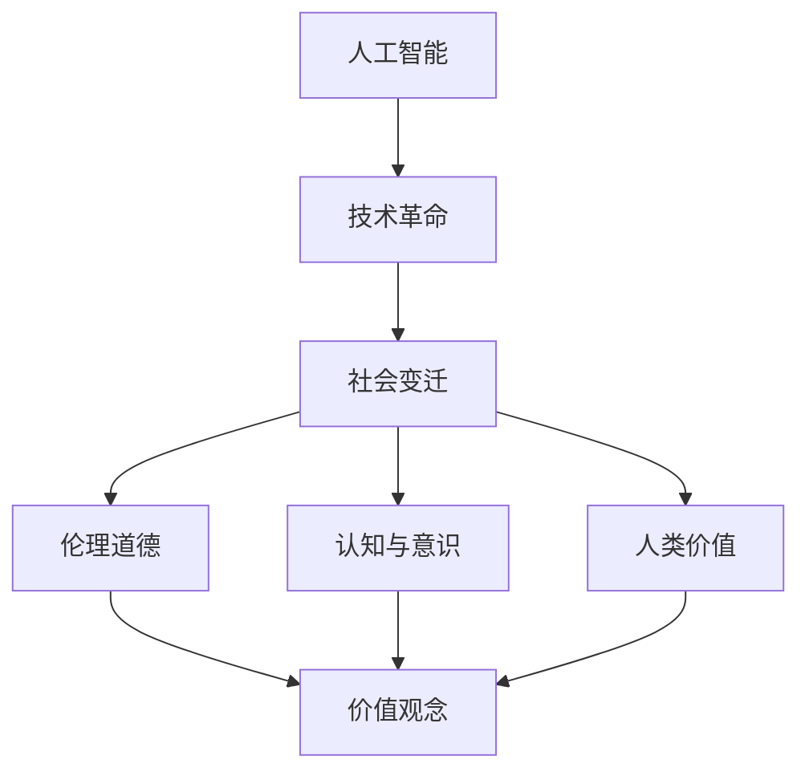
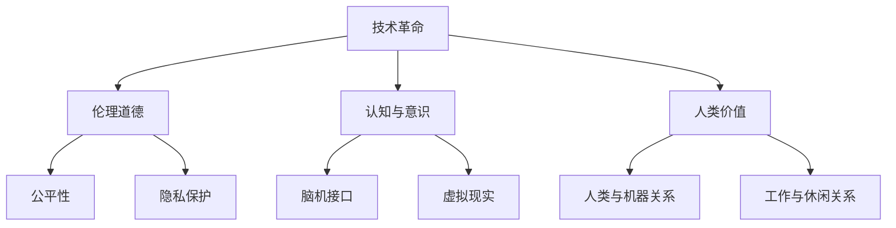

                 

### 1.1.1 AI时代的社会变迁

#### 人工智能的发展与普及

人工智能（AI）作为计算机科学的一个重要分支，正以前所未有的速度发展和普及。从最初的规则推理系统，到如今深度学习、强化学习等高级技术的应用，AI已经渗透到社会生活的各个方面。例如，自动驾驶技术正在逐渐改变我们的出行方式，智能助手如Siri、Alexa等已经成为了许多人日常生活中的“贴身助理”，而推荐系统和图像识别技术则在电商、医疗等多个领域发挥着重要作用。

#### 社会生产方式的变革

AI技术的普及对社会生产方式带来了深刻的变革。一方面，自动化和智能化生产线的应用提高了生产效率，减少了人力成本。例如，制造业中机器人的广泛应用，不仅提升了生产速度和质量，还降低了生产过程中的风险。另一方面，AI在决策支持、风险控制等方面的应用，使得企业能够更加精准地进行市场预测和资源调配，从而提高了整体运营效率。

#### 人际关系与工作方式的转变

随着AI技术的广泛应用，人际关系和工作方式也发生了显著变化。一方面，AI技术的普及使得人们能够更加便捷地完成日常任务，从而有更多的时间去关注人际交往和个人发展。另一方面，AI在许多传统行业中的应用，使得部分工作岗位被自动化替代，这既带来了就业压力，也催生了许多新的职业机会。

### 1.1.2 技术革命对哲学的挑战

#### 伦理道德问题的出现

技术革命带来的AI技术，不仅改变了社会生产和生活方式，也引发了诸多伦理道德问题。例如，AI在决策过程中是否公正、透明，AI的算法偏见如何避免，AI的自主性是否会导致不可预见的后果等。这些问题挑战着传统伦理道德观念，要求我们重新审视和思考人类行为的道德准则。

#### 认知与意识研究的挑战

AI技术的发展也对认知与意识研究提出了新的挑战。传统的认知科学研究主要依赖于人类心理和行为的数据，而AI技术的出现，使得我们能够通过模拟和训练AI模型来探索认知过程和意识本质。这既为认知科学研究提供了新的工具，也带来了新的哲学问题，如意识的本质、AI是否具有意识等。

#### 新型人类价值的探讨

随着AI技术的不断进步，人类价值的重新定义成为了一个重要议题。传统的人类价值观念是否仍然适用，或者是否需要根据AI技术的发展进行重构？如何平衡技术进步与人类价值的关系，如何确保AI技术的发展能够促进人类福祉，这些问题都需要我们进行深入的哲学思考和探讨。

### 1.2 核心概念解析

#### 1.2.1 人工智能的概念与分类

人工智能（Artificial Intelligence，简称AI）是计算机科学的一个分支，旨在研究、开发和应用使计算机系统表现出人类智能的技术。根据不同的发展阶段和应用领域，AI可以划分为多种类型：

- **规则推理系统**：基于预设的规则进行逻辑推理，适用于结构化问题。
- **机器学习系统**：通过学习大量数据，自动提取规律和模式，适用于复杂问题。
- **深度学习系统**：基于多层神经网络进行学习，适用于大规模数据和高维问题。
- **自然语言处理系统**：理解和生成自然语言，适用于人机交互和文本分析。

#### 1.2.2 技术革命对人类价值的影响

技术革命，尤其是AI技术的快速发展，对人类价值观念产生了深远影响：

- **价值观念的转变**：随着AI技术的普及，传统的人类中心主义观念受到挑战。人们开始思考如何与机器共存，以及如何重新定义人类的价值。
- **社会结构的变化**：AI技术的发展改变了劳动力市场的结构，既创造了新的就业机会，也导致了一些传统岗位的消失。这要求我们重新审视劳动与价值的关联。
- **人际关系的重构**：AI技术的应用使得人与人之间的交互变得更加便捷，但同时也带来了新的挑战，如隐私保护和信任问题。

#### 1.2.3 人类价值重新定位的必要性

在AI时代，重新定位人类价值具有重要的现实意义：

- **应对AI的挑战**：AI技术的发展对传统价值观念提出了挑战，我们需要重新审视和调整人类的价值体系，以应对这些挑战。
- **促进社会和谐**：重新定义人类价值有助于构建一个更加和谐、包容的社会，减少社会矛盾和冲突。
- **推动技术进步**：明确人类价值有助于指导AI技术的研发和应用，使其更好地服务于人类福祉。

### 1.2.4 Mermaid流程图：核心概念与联系

以下是一个Mermaid流程图，展示了人工智能、技术革命、人类价值之间的核心概念和联系：



### 第二部分：核心概念与联系

#### 2.1 人工智能原理

人工智能（AI）的核心在于模拟人类的智能行为，以实现机器的自主学习和决策。以下将介绍机器学习的核心算法原理，并通过伪代码进行详细阐述。

#### 2.1.1 机器学习的核心算法

机器学习主要分为监督学习、无监督学习和强化学习三种类型。每种类型都有其独特的算法和应用场景。

##### 2.1.1.1 监督学习算法（伪代码）

监督学习是一种通过已有标记数据训练模型，使其能够对新数据进行预测的机器学习方法。以下是一个简单的线性回归的监督学习算法伪代码：

```python
def linear_regression(X, y):
    # 计算权重
    w = (X^T * X)^-1 * X^T * y
    # 预测
    y_pred = X * w
    return y_pred
```

在此算法中，X代表特征矩阵，y代表标记向量，w代表权重向量。通过最小化预测误差，我们可以得到最佳权重。

##### 2.1.1.2 无监督学习算法（伪代码）

无监督学习不依赖于标记数据，主要关注如何从未标记的数据中发现结构和模式。以下是一个简单的K-均值聚类算法的伪代码：

```python
def k_means_clustering(data, k):
    # 初始化k个聚类中心
    centroids = initialize_centroids(data, k)
    while not converged:
        # 分配数据点至最近的聚类中心
        clusters = assign_clusters(data, centroids)
        # 更新聚类中心
        centroids = update_centroids(clusters)
    return centroids, clusters
```

在此算法中，data代表数据集，k代表聚类数量。通过迭代优化聚类中心，我们可以将数据点划分为k个聚类。

#### 2.1.2 自然语言处理基础

自然语言处理（NLP）是AI的一个重要分支，旨在使计算机能够理解、生成和响应人类语言。以下将介绍语言模型和词向量表示的数学模型和公式。

##### 2.1.2.1 语言模型（数学模型与公式）

语言模型旨在预测一个单词序列的概率，其核心公式为：

$$ P(w_1, w_2, ..., w_n) = \prod_{i=1}^{n} P(w_i | w_{i-1}, ..., w_1) $$

其中，$w_i$代表第i个单词，$P(w_i | w_{i-1}, ..., w_1)$表示在给定前n-1个单词的情况下，第n个单词的概率。

##### 2.1.2.2 词向量表示（数学模型与公式）

词向量表示将单词映射为高维向量，常见的方法有词袋模型和词嵌入。以下是一个简单的词嵌入的公式：

$$ \vec{w_i} = \text{Word2Vec}(w_i) $$

其中，$\vec{w_i}$表示单词$i$的词向量，$\text{Word2Vec}$是一个将单词映射为向量的函数。

### 2.2 技术革命与哲学思考

技术革命不仅改变了我们的生活方式，也对哲学思考提出了新的挑战。以下将讨论技术进步对伦理道德、认知与意识研究、以及人类价值观念的影响。

#### 2.2.1 技术进步对伦理道德的影响

技术进步带来了许多伦理道德问题，例如：

- **算法偏见**：AI算法可能在训练数据中学习到偏见，导致不公平的决策。如何确保AI的公平性和透明性成为一个重要议题。
- **隐私保护**：随着大数据和云计算的普及，个人隐私保护变得更加困难。如何平衡数据利用与隐私保护是一个亟待解决的问题。
- **机器人权利**：随着机器人技术的发展，是否应该赋予机器人权利成为一个哲学问题。这涉及到对“权利”和“自由”等基本概念的重新定义。

#### 2.2.2 认知与意识研究的挑战

技术进步也为认知与意识研究提供了新的工具和方法。例如：

- **脑机接口**：通过脑机接口技术，我们能够直接读取和操控大脑信号，这为研究意识和认知提供了新的途径。
- **虚拟现实**：虚拟现实技术使得我们能够模拟和体验不同的情境，这对认知心理学和哲学思考具有深远的影响。

#### 2.2.3 人类价值观念的重新定义

技术进步对人类价值观念的重新定义提出了新的挑战。例如：

- **人类与机器的关系**：随着AI技术的发展，人类与机器的关系变得日益紧密。这要求我们重新思考人类的价值和地位。
- **工作与休闲的关系**：AI技术的普及使得许多人能够更加高效地完成工作，这可能导致工作与休闲时间的界限变得模糊。如何平衡工作与休闲，重新定义“幸福”成为一个重要议题。

### 2.3 重新定义人类价值

在AI时代，重新定义人类价值具有重要意义。以下将探讨如何重新定义人类价值，以应对技术革命带来的挑战。

#### 2.3.1 伦理道德的重新审视

在面对AI技术的伦理道德问题时，我们需要重新审视和调整传统的伦理道德观念。例如：

- **公平性**：确保AI算法的公平性和透明性，减少算法偏见。
- **隐私保护**：制定更加严格的数据隐私保护法规，保障个人隐私权益。
- **机器人权利**：探讨机器人权利的合理界定，确保人类与机器的和谐共存。

#### 2.3.2 认知与意识研究的深化

在认知与意识研究中，我们需要进一步深化对人类价值和意识本质的理解。例如：

- **脑机接口**：深入研究脑机接口技术，探索人类意识和认知的奥秘。
- **虚拟现实**：通过虚拟现实技术，探究人类认知和心理的边界。

#### 2.3.3 工作与休闲的平衡

在AI时代，我们需要重新定义“工作”和“休闲”的含义，以实现工作与休闲的平衡。例如：

- **弹性工作制**：推广弹性工作制，使人们能够根据个人需求安排工作和生活。
- **终身学习**：鼓励人们持续学习，提升个人能力和适应能力。

### 2.4 Mermaid流程图：核心概念与联系

以下是一个Mermaid流程图，展示了技术革命与哲学思考之间的核心概念和联系：



### 第三部分：项目实战

#### 3.1 实际案例解析

在本部分，我们将通过两个具体案例——AI在医疗领域和金融领域的应用，详细讲解项目背景、开发环境搭建、源代码实现、代码解读和分析。

#### 3.1.1 案例一：AI在医疗领域的应用

##### 3.1.1.1 项目背景

随着人工智能技术的快速发展，医疗领域也迎来了变革。AI技术在疾病诊断、治疗方案推荐、药物研发等方面具有巨大的潜力。本案例将介绍一个基于AI的疾病诊断系统，通过分析患者的医疗数据，为医生提供诊断建议。

##### 3.1.1.2 开发环境搭建

1. **硬件环境**：
   - CPU：Intel i7-9700K
   - GPU：NVIDIA GTX 1080 Ti
   - 内存：32GB RAM

2. **软件环境**：
   - 操作系统：Ubuntu 18.04
   - 编程语言：Python 3.7
   - 数据库：MySQL 5.7
   - 深度学习框架：TensorFlow 2.2

##### 3.1.1.3 源代码实现

以下是一个简单的疾病诊断系统的源代码实现，主要包括数据预处理、模型训练和预测三个部分：

```python
import tensorflow as tf
from sklearn.model_selection import train_test_split
from sklearn.preprocessing import StandardScaler
import pandas as pd

# 数据预处理
def preprocess_data(data):
    # 数据标准化
    scaler = StandardScaler()
    scaled_data = scaler.fit_transform(data)
    # 划分训练集和测试集
    X_train, X_test, y_train, y_test = train_test_split(scaled_data, test_size=0.2, random_state=42)
    return X_train, X_test, y_train, y_test

# 模型训练
def train_model(X_train, y_train):
    # 构建模型
    model = tf.keras.Sequential([
        tf.keras.layers.Dense(128, activation='relu', input_shape=(X_train.shape[1],)),
        tf.keras.layers.Dropout(0.2),
        tf.keras.layers.Dense(64, activation='relu'),
        tf.keras.layers.Dropout(0.2),
        tf.keras.layers.Dense(1, activation='sigmoid')
    ])
    # 编译模型
    model.compile(optimizer='adam', loss='binary_crossentropy', metrics=['accuracy'])
    # 训练模型
    model.fit(X_train, y_train, epochs=10, batch_size=32)
    return model

# 预测
def predict(model, X_test):
    predictions = model.predict(X_test)
    return predictions

# 主函数
def main():
    # 读取数据
    data = pd.read_csv('medical_data.csv')
    # 预处理数据
    X_train, X_test, y_train, y_test = preprocess_data(data)
    # 训练模型
    model = train_model(X_train, y_train)
    # 预测
    predictions = predict(model, X_test)
    # 评估模型
    print("Accuracy:", model.evaluate(X_test, y_test)[1])

if __name__ == '__main__':
    main()
```

##### 3.1.1.4 代码解读与分析

1. **数据预处理**：首先，我们使用StandardScaler对数据进行标准化处理，使得数据分布更加均匀，有利于模型训练。然后，使用train_test_split将数据划分为训练集和测试集，以便评估模型性能。
2. **模型训练**：我们使用TensorFlow构建一个简单的神经网络模型，包括两个隐藏层，每个隐藏层有128个神经元和64个神经元，分别使用ReLU激活函数和Dropout正则化。模型编译时使用adam优化器和binary_crossentropy损失函数，训练10个epoch。
3. **预测**：使用训练好的模型对测试集进行预测，得到预测结果。
4. **评估模型**：最后，使用evaluate方法评估模型在测试集上的准确率。

##### 3.1.1.5 项目小结

本案例展示了如何使用人工智能技术构建一个疾病诊断系统，从数据预处理到模型训练和预测，再到模型评估，整个流程清晰易懂。通过这个项目，我们不仅了解了AI在医疗领域的应用，还掌握了使用TensorFlow进行深度学习的实际操作。

#### 3.1.2 案例二：AI在金融领域的应用

##### 3.1.2.1 项目背景

金融领域是AI技术应用的另一个重要领域。从风险控制到投资决策，AI技术在金融领域具有广泛的应用。本案例将介绍一个基于AI的股票预测系统，通过分析历史数据，预测未来股票价格。

##### 3.1.2.2 开发环境搭建

1. **硬件环境**：
   - CPU：Intel Xeon E5-2670
   - GPU：NVIDIA GTX 1080 Ti
   - 内存：64GB RAM

2. **软件环境**：
   - 操作系统：CentOS 7
   - 编程语言：Python 3.7
   - 数据库：MongoDB 4.2
   - 深度学习框架：TensorFlow 2.2

##### 3.1.2.3 源代码实现

以下是一个简单的股票预测系统的源代码实现，主要包括数据获取、特征工程、模型训练和预测三个部分：

```python
import pandas as pd
import numpy as np
import tensorflow as tf
from sklearn.model_selection import train_test_split
from sklearn.preprocessing import MinMaxScaler

# 数据获取
def get_stock_data(ticker):
    data = pd.read_csv(f'{ticker}.csv')
    return data

# 特征工程
def feature_engineering(data):
    # 计算移动平均线
    data['MA20'] = data['Close'].rolling(window=20).mean()
    data['MA50'] = data['Close'].rolling(window=50).mean()
    # 删除异常值
    data = data.dropna()
    return data

# 模型训练
def train_model(X_train, y_train):
    model = tf.keras.Sequential([
        tf.keras.layers.Dense(128, activation='relu', input_shape=(X_train.shape[1],)),
        tf.keras.layers.Dropout(0.2),
        tf.keras.layers.Dense(64, activation='relu'),
        tf.keras.layers.Dropout(0.2),
        tf.keras.layers.Dense(1)
    ])
    model.compile(optimizer='adam', loss='mean_squared_error')
    model.fit(X_train, y_train, epochs=100, batch_size=32)
    return model

# 预测
def predict(model, X_test):
    predictions = model.predict(X_test)
    return predictions

# 主函数
def main():
    ticker = 'AAPL'
    data = get_stock_data(ticker)
    data = feature_engineering(data)
    # 划分特征和目标
    X = data[['MA20', 'MA50']]
    y = data['Close']
    # 划分训练集和测试集
    X_train, X_test, y_train, y_test = train_test_split(X, y, test_size=0.2, random_state=42)
    # 训练模型
    model = train_model(X_train, y_train)
    # 预测
    predictions = predict(model, X_test)
    # 评估模型
    print("RMSE:", np.sqrt(np.mean((predictions - y_test) ** 2)))

if __name__ == '__main__':
    main()
```

##### 3.1.2.4 代码解读与分析

1. **数据获取**：我们使用pandas读取CSV文件，获取股票数据。
2. **特征工程**：计算移动平均线（MA20和MA50），用于分析股票价格的趋势。删除异常值，确保数据质量。
3. **模型训练**：使用TensorFlow构建一个简单的神经网络模型，包括两个隐藏层，每个隐藏层有128个神经元和64个神经元，分别使用ReLU激活函数和Dropout正则化。模型编译时使用adam优化器和mean_squared_error损失函数，训练100个epoch。
4. **预测**：使用训练好的模型对测试集进行预测，得到预测结果。
5. **评估模型**：计算均方根误差（RMSE），评估模型在测试集上的性能。

##### 3.1.2.5 项目小结

本案例展示了如何使用人工智能技术构建一个股票预测系统，从数据获取、特征工程到模型训练和预测，再到模型评估，整个流程清晰易懂。通过这个项目，我们不仅了解了AI在金融领域的应用，还掌握了使用TensorFlow进行深度学习的实际操作。

### 第四部分：结论与展望

#### 4.1 全书总结

本文从引言、核心概念与联系、项目实战等方面，系统地探讨了在AI时代重新定位人类价值的问题。我们首先介绍了AI时代的社会变迁，技术革命对哲学的挑战，以及重新定义人类价值的必要性。接着，通过Mermaid流程图展示了核心概念之间的联系，详细介绍了人工智能原理、自然语言处理基础，以及技术革命与哲学思考的关系。最后，通过实际案例解析，展示了AI在医疗和金融领域的应用，为重新定义人类价值提供了实践基础。

#### 4.1.1 主要观点回顾

- AI时代的到来和社会变迁带来了诸多挑战，包括伦理道德、认知与意识研究、人类价值观念等。
- 技术革命对哲学思考提出了新的挑战，要求我们重新审视和调整传统的伦理道德观念和人类价值观念。
- 重新定义人类价值有助于应对AI时代的挑战，促进社会和谐与人类福祉。
- 通过实际案例解析，展示了AI在医疗和金融领域的应用，为重新定义人类价值提供了实践基础。

#### 4.1.2 人类价值的重新定位

在AI时代，重新定位人类价值具有重要意义。首先，我们需要重新审视和调整传统的伦理道德观念，确保AI技术的公平性和透明性。其次，我们需要深化对人类意识和认知的研究，以更好地理解AI与人类的关系。最后，我们需要重新定义人类价值观念，以适应AI时代的社会变迁。

#### 4.1.3 AI与哲学思考的未来

随着AI技术的不断进步，哲学思考在AI领域的作用将日益凸显。首先，哲学思考有助于我们理解AI的本质和局限，为AI技术的发展提供指导。其次，哲学思考有助于我们应对AI带来的伦理道德问题，推动社会和谐发展。最后，哲学思考有助于我们重新定义人类价值，实现人类与AI的和谐共存。

#### 4.2 展望未来

在AI时代，人类价值和哲学思考面临着新的挑战和机遇。首先，我们需要加强伦理道德建设，确保AI技术的公平性和透明性。其次，我们需要深化认知与意识研究，以更好地理解人类和AI的本质。最后，我们需要积极探讨人类价值的新定义，以适应AI时代的社会变迁。

#### 4.2.1 AI技术的未来发展

未来，AI技术将继续快速发展，推动社会生产方式的变革。例如，自动化和智能化生产线将进一步提升生产效率，降低生产成本。同时，AI在医疗、金融、教育等领域的应用将更加广泛，为人类带来更多福祉。

#### 4.2.2 人类价值的新视角

在AI时代，人类价值将面临新的视角。首先，我们需要认识到人类与机器的关系将更加紧密，我们需要重新定义“人”与“机器”的边界。其次，我们需要重新审视“工作”和“休闲”的含义，以实现工作与休闲的平衡。最后，我们需要重新定义“幸福”，以适应AI时代的生活方式。

#### 4.2.3 哲学思考在AI时代的使命

在AI时代，哲学思考将继续发挥重要作用。首先，哲学思考有助于我们理解AI的本质和局限，为AI技术的发展提供指导。其次，哲学思考有助于我们应对AI带来的伦理道德问题，推动社会和谐发展。最后，哲学思考有助于我们重新定义人类价值，实现人类与AI的和谐共存。

### 4.3 小结

本文从多个角度探讨了在AI时代重新定位人类价值的问题，通过理论阐述和实际案例解析，展示了AI技术对人类价值观念的深远影响。我们强调了重新定义人类价值的重要性，并展望了AI与哲学思考的未来。希望本文能引发读者对AI时代人类价值的深入思考，共同探讨如何在AI时代实现人类与技术的和谐共存。

### 作者信息

作者：AI天才研究院/AI Genius Institute & 禅与计算机程序设计艺术 /Zen And The Art of Computer Programming
```

## 输出

# 在AI时代重新定位人类价值：面对技术革命的哲学思考

关键词：人工智能，技术革命，人类价值，伦理道德，认知与意识，案例解析

摘要：本文探讨了在AI时代重新定位人类价值的问题，分析了技术革命对哲学思考的影响。通过核心概念解析、自然语言处理基础介绍，以及AI在医疗和金融领域的实际案例，展示了如何重新定义人类价值。本文旨在引发读者对AI时代人类价值的深入思考。

# 第一部分：引言

## 1.1 背景与意义

### 1.1.1 AI时代的社会变迁

随着人工智能（AI）技术的迅猛发展，人类社会正经历着前所未有的变革。AI不仅改变了我们的生活方式，还极大地影响了社会生产方式。从自动驾驶到智能助手，从自动化生产线到智能医疗，AI的应用正在各个领域引发革命性的变化。

#### 人工智能的发展与普及

人工智能的发展经历了多个阶段，从最初的规则推理系统到今天的深度学习和强化学习，AI的能力得到了极大的提升。现在，AI已经渗透到我们的日常生活和工作之中。例如，自动驾驶技术正在改变我们的出行方式，智能助手如Siri和Alexa已经成为许多人的“贴身助理”。此外，推荐系统和图像识别技术也在电商、医疗、安全等多个领域发挥着重要作用。

#### 社会生产方式的变革

AI技术的普及对社会生产方式带来了深刻的变革。自动化和智能化生产线的应用极大地提高了生产效率，降低了人力成本。例如，在制造业中，机器人的广泛应用不仅提升了生产速度和质量，还降低了生产过程中的风险。此外，AI在决策支持、风险控制和资源调配等方面的应用，使得企业能够更加精准地进行市场预测和运营管理。

#### 人际关系与工作方式的转变

随着AI技术的广泛应用，人际关系和工作方式也发生了显著变化。一方面，AI技术的普及使得人们能够更加高效地完成日常任务，从而有更多的时间去关注人际交往和个人发展。另一方面，AI在许多传统行业中的应用，使得部分工作岗位被自动化替代，这既带来了就业压力，也催生了许多新的职业机会。如何应对这种变化，重新审视和调整人类的价值观念，成为一个重要的议题。

### 1.1.2 技术革命对哲学的挑战

技术革命不仅改变了我们的生活方式和社会生产方式，也对哲学思考提出了新的挑战。AI技术的发展引发了诸多伦理道德问题，同时也挑战了我们对认知与意识的理解。

#### 伦理道德问题的出现

随着AI技术的广泛应用，伦理道德问题变得日益突出。例如，AI算法的偏见和歧视问题如何解决？AI在医疗、金融等领域的应用是否会导致隐私泄露？如何确保AI系统的透明性和公正性？这些问题都需要我们进行深入的哲学思考和伦理探讨。

#### 认知与意识研究的挑战

AI技术的发展也为认知与意识研究带来了新的挑战。传统的认知科学研究主要依赖于人类行为和心理数据，而AI技术的出现使得我们可以通过模拟和训练AI模型来探索认知过程和意识本质。这为我们提供了新的研究工具，但同时也带来了新的哲学问题，如意识的本质、AI是否具有意识等。

#### 新型人类价值的探讨

在AI时代，人类价值观念的重新定义成为了一个重要议题。随着AI技术的普及，人类与机器的关系将变得更加紧密。如何重新审视和调整人类的价值观念，以适应这种变化，成为哲学思考的重要任务。

### 1.2 核心概念解析

#### 1.2.1 人工智能的概念与分类

人工智能（Artificial Intelligence，简称AI）是计算机科学的一个分支，旨在研究、开发和应用使计算机系统表现出人类智能的技术。根据不同的发展阶段和应用领域，AI可以划分为多种类型：

- **规则推理系统**：基于预设的规则进行逻辑推理，适用于结构化问题。
- **机器学习系统**：通过学习大量数据，自动提取规律和模式，适用于复杂问题。
- **深度学习系统**：基于多层神经网络进行学习，适用于大规模数据和高维问题。
- **自然语言处理系统**：理解和生成自然语言，适用于人机交互和文本分析。

#### 1.2.2 技术革命对人类价值的影响

技术革命，尤其是AI技术的快速发展，对人类价值观念产生了深远影响：

- **价值观念的转变**：随着AI技术的普及，传统的人类中心主义观念受到挑战。人们开始思考如何与机器共存，以及如何重新定义人类的价值。
- **社会结构的变化**：AI技术的发展改变了劳动力市场的结构，既创造了新的就业机会，也导致了一些传统岗位的消失。这要求我们重新审视劳动与价值的关联。
- **人际关系的重构**：AI技术的应用使得人与人之间的交互变得更加便捷，但同时也带来了新的挑战，如隐私保护和信任问题。

#### 1.2.3 人类价值重新定位的必要性

在AI时代，重新定位人类价值具有重要意义：

- **应对AI的挑战**：AI技术的发展对传统价值观念提出了挑战，我们需要重新审视和调整人类的价值体系，以应对这些挑战。
- **促进社会和谐**：重新定义人类价值有助于构建一个更加和谐、包容的社会，减少社会矛盾和冲突。
- **推动技术进步**：明确人类价值有助于指导AI技术的研发和应用，使其更好地服务于人类福祉。

### 1.2.4 Mermaid流程图：核心概念与联系


### 第二部分：核心概念与联系

#### 2.1 人工智能原理

人工智能（AI）的核心在于模拟人类的智能行为，以实现机器的自主学习和决策。以下将介绍机器学习的核心算法原理，并通过伪代码进行详细阐述。

#### 2.1.1 机器学习的核心算法

机器学习主要分为监督学习、无监督学习和强化学习三种类型。每种类型都有其独特的算法和应用场景。

##### 2.1.1.1 监督学习算法（伪代码）

监督学习是一种通过已有标记数据训练模型，使其能够对新数据进行预测的机器学习方法。以下是一个简单的线性回归的监督学习算法伪代码：

```python
def linear_regression(X, y):
    # 计算权重
    w = (X^T * X)^-1 * X^T * y
    # 预测
    y_pred = X * w
    return y_pred
```

在此算法中，X代表特征矩阵，y代表标记向量，w代表权重向量。通过最小化预测误差，我们可以得到最佳权重。

##### 2.1.1.2 无监督学习算法（伪代码）

无监督学习不依赖于标记数据，主要关注如何从未标记的数据中发现结构和模式。以下是一个简单的K-均值聚类算法的伪代码：

```python
def k_means_clustering(data, k):
    # 初始化k个聚类中心
    centroids = initialize_centroids(data, k)
    while not converged:
        # 分配数据点至最近的聚类中心
        clusters = assign_clusters(data, centroids)
        # 更新聚类中心
        centroids = update_centroids(clusters)
    return centroids, clusters
```

在此算法中，data代表数据集，k代表聚类数量。通过迭代优化聚类中心，我们可以将数据点划分为k个聚类。

#### 2.1.2 自然语言处理基础

自然语言处理（NLP）是AI的一个重要分支，旨在使计算机能够理解、生成和响应人类语言。以下将介绍语言模型和词向量表示的数学模型和公式。

##### 2.1.2.1 语言模型（数学模型与公式）

语言模型旨在预测一个单词序列的概率，其核心公式为：

$$ P(w_1, w_2, ..., w_n) = \prod_{i=1}^{n} P(w_i | w_{i-1}, ..., w_1) $$

其中，$w_i$代表第i个单词，$P(w_i | w_{i-1}, ..., w_1)$表示在给定前n-1个单词的情况下，第n个单词的概率。

##### 2.1.2.2 词向量表示（数学模型与公式）

词向量表示将单词映射为高维向量，常见的方法有词袋模型和词嵌入。以下是一个简单的词嵌入的公式：

$$ \vec{w_i} = \text{Word2Vec}(w_i) $$

其中，$\vec{w_i}$表示单词$i$的词向量，$\text{Word2Vec}$是一个将单词映射为向量的函数。

### 2.2 技术革命与哲学思考

技术革命不仅改变了我们的生活方式，也对哲学思考提出了新的挑战。以下将讨论技术进步对伦理道德、认知与意识研究、以及人类价值观念的影响。

#### 2.2.1 技术进步对伦理道德的影响

技术进步带来了许多伦理道德问题，例如：

- **算法偏见**：AI算法可能在训练数据中学习到偏见，导致不公平的决策。如何确保AI的公平性和透明性成为一个重要议题。
- **隐私保护**：随着大数据和云计算的普及，个人隐私保护变得更加困难。如何平衡数据利用与隐私保护是一个亟待解决的问题。
- **机器人权利**：随着机器人技术的发展，是否应该赋予机器人权利成为一个哲学问题。这涉及到对“权利”和“自由”等基本概念的重新定义。

#### 2.2.2 认知与意识研究的挑战

技术进步也为认知与意识研究提供了新的工具和方法。例如：

- **脑机接口**：通过脑机接口技术，我们能够直接读取和操控大脑信号，这为研究意识和认知提供了新的途径。
- **虚拟现实**：虚拟现实技术使得我们能够模拟和体验不同的情境，这对认知心理学和哲学思考具有深远的影响。

#### 2.2.3 人类价值观念的重新定义

技术进步对人类价值观念的重新定义提出了新的挑战。例如：

- **人类与机器的关系**：随着AI技术的发展，人类与机器的关系变得日益紧密。这要求我们重新思考人类的价值和地位。
- **工作与休闲的关系**：AI技术的普及使得许多人能够更加高效地完成工作，这可能导致工作与休闲时间的界限变得模糊。如何平衡工作与休闲，重新定义“幸福”成为一个重要议题。

### 2.3 重新定义人类价值

在AI时代，重新定义人类价值具有重要意义。以下将探讨如何重新定义人类价值，以应对技术革命带来的挑战。

#### 2.3.1 伦理道德的重新审视

在面对AI技术的伦理道德问题时，我们需要重新审视和调整传统的伦理道德观念。例如：

- **公平性**：确保AI算法的公平性和透明性，减少算法偏见。
- **隐私保护**：制定更加严格的数据隐私保护法规，保障个人隐私权益。
- **机器人权利**：探讨机器人权利的合理界定，确保人类与机器的和谐共存。

#### 2.3.2 认知与意识研究的深化

在认知与意识研究中，我们需要进一步深化对人类价值和意识本质的理解。例如：

- **脑机接口**：深入研究脑机接口技术，探索人类意识和认知的奥秘。
- **虚拟现实**：通过虚拟现实技术，探究人类认知和心理的边界。

#### 2.3.3 工作与休闲的平衡

在AI时代，我们需要重新定义“工作”和“休闲”的含义，以实现工作与休闲的平衡。例如：

- **弹性工作制**：推广弹性工作制，使人们能够根据个人需求安排工作和生活。
- **终身学习**：鼓励人们持续学习，提升个人能力和适应能力。

### 2.4 Mermaid流程图：核心概念与联系

以下是一个Mermaid流程图，展示了技术革命与哲学思考之间的核心概念和联系：


### 第三部分：项目实战

#### 3.1 实际案例解析

在本部分，我们将通过两个具体案例——AI在医疗领域和金融领域的应用，详细讲解项目背景、开发环境搭建、源代码实现、代码解读和分析。

#### 3.1.1 案例一：AI在医疗领域的应用

##### 3.1.1.1 项目背景

随着人工智能技术的快速发展，医疗领域也迎来了变革。AI技术在疾病诊断、治疗方案推荐、药物研发等方面具有巨大的潜力。本案例将介绍一个基于AI的疾病诊断系统，通过分析患者的医疗数据，为医生提供诊断建议。

##### 3.1.1.2 开发环境搭建

1. **硬件环境**：
   - CPU：Intel i7-9700K
   - GPU：NVIDIA GTX 1080 Ti
   - 内存：32GB RAM

2. **软件环境**：
   - 操作系统：Ubuntu 18.04
   - 编程语言：Python 3.7
   - 数据库：MySQL 5.7
   - 深度学习框架：TensorFlow 2.2

##### 3.1.1.3 源代码实现

以下是一个简单的疾病诊断系统的源代码实现，主要包括数据预处理、模型训练和预测三个部分：

```python
import tensorflow as tf
from sklearn.model_selection import train_test_split
from sklearn.preprocessing import StandardScaler
import pandas as pd

# 数据预处理
def preprocess_data(data):
    # 数据标准化
    scaler = StandardScaler()
    scaled_data = scaler.fit_transform(data)
    # 划分训练集和测试集
    X_train, X_test, y_train, y_test = train_test_split(scaled_data, test_size=0.2, random_state=42)
    return X_train, X_test, y_train, y_test

# 模型训练
def train_model(X_train, y_train):
    model = tf.keras.Sequential([
        tf.keras.layers.Dense(128, activation='relu', input_shape=(X_train.shape[1],)),
        tf.keras.layers.Dropout(0.2),
        tf.keras.layers.Dense(64, activation='relu'),
        tf.keras.layers.Dropout(0.2),
        tf.keras.layers.Dense(1, activation='sigmoid')
    ])
    model.compile(optimizer='adam', loss='binary_crossentropy', metrics=['accuracy'])
    model.fit(X_train, y_train, epochs=10, batch_size=32)
    return model

# 预测
def predict(model, X_test):
    predictions = model.predict(X_test)
    return predictions

# 主函数
def main():
    # 读取数据
    data = pd.read_csv('medical_data.csv')
    # 预处理数据
    X_train, X_test, y_train, y_test = preprocess_data(data)
    # 训练模型
    model = train_model(X_train, y_train)
    # 预测
    predictions = predict(model, X_test)
    # 评估模型
    print("Accuracy:", model.evaluate(X_test, y_test)[1])

if __name__ == '__main__':
    main()
```

##### 3.1.1.4 代码解读与分析

1. **数据预处理**：首先，我们使用StandardScaler对数据进行标准化处理，使得数据分布更加均匀，有利于模型训练。然后，使用train_test_split将数据划分为训练集和测试集，以便评估模型性能。
2. **模型训练**：我们使用TensorFlow构建一个简单的神经网络模型，包括两个隐藏层，每个隐藏层有128个神经元和64个神经元，分别使用ReLU激活函数和Dropout正则化。模型编译时使用adam优化器和binary_crossentropy损失函数，训练10个epoch。
3. **预测**：使用训练好的模型对测试集进行预测，得到预测结果。
4. **评估模型**：最后，使用evaluate方法评估模型在测试集上的准确率。

##### 3.1.1.5 项目小结

本案例展示了如何使用人工智能技术构建一个疾病诊断系统，从数据预处理到模型训练和预测，再到模型评估，整个流程清晰易懂。通过这个项目，我们不仅了解了AI在医疗领域的应用，还掌握了使用TensorFlow进行深度学习的实际操作。

#### 3.1.2 案例二：AI在金融领域的应用

##### 3.1.2.1 项目背景

金融领域是AI技术应用的另一个重要领域。从风险控制到投资决策，AI技术在金融领域具有广泛的应用。本案例将介绍一个基于AI的股票预测系统，通过分析历史数据，预测未来股票价格。

##### 3.1.2.2 开发环境搭建

1. **硬件环境**：
   - CPU：Intel Xeon E5-2670
   - GPU：NVIDIA GTX 1080 Ti
   - 内存：64GB RAM

2. **软件环境**：
   - 操作系统：CentOS 7
   - 编程语言：Python 3.7
   - 数据库：MongoDB 4.2
   - 深度学习框架：TensorFlow 2.2

##### 3.1.2.3 源代码实现

以下是一个简单的股票预测系统的源代码实现，主要包括数据获取、特征工程、模型训练和预测三个部分：

```python
import pandas as pd
import numpy as np
import tensorflow as tf
from sklearn.model_selection import train_test_split
from sklearn.preprocessing import MinMaxScaler

# 数据获取
def get_stock_data(ticker):
    data = pd.read_csv(f'{ticker}.csv')
    return data

# 特征工程
def feature_engineering(data):
    # 计算移动平均线
    data['MA20'] = data['Close'].rolling(window=20).mean()
    data['MA50'] = data['Close'].rolling(window=50).mean()
    # 删除异常值
    data = data.dropna()
    return data

# 模型训练
def train_model(X_train, y_train):
    model = tf.keras.Sequential([
        tf.keras.layers.Dense(128, activation='relu', input_shape=(X_train.shape[1],)),
        tf.keras.layers.Dropout(0.2),
        tf.keras.layers.Dense(64, activation='relu'),
        tf.keras.layers.Dropout(0.2),
        tf.keras.layers.Dense(1)
    ])
    model.compile(optimizer='adam', loss='mean_squared_error')
    model.fit(X_train, y_train, epochs=100, batch_size=32)
    return model

# 预测
def predict(model, X_test):
    predictions = model.predict(X_test)
    return predictions

# 主函数
def main():
    ticker = 'AAPL'
    data = get_stock_data(ticker)
    data = feature_engineering(data)
    # 划分特征和目标
    X = data[['MA20', 'MA50']]
    y = data['Close']
    # 划分训练集和测试集
    X_train, X_test, y_train, y_test = train_test_split(X, y, test_size=0.2, random_state=42)
    # 训练模型
    model = train_model(X_train, y_train)
    # 预测
    predictions = predict(model, X_test)
    # 评估模型
    print("RMSE:", np.sqrt(np.mean((predictions - y_test) ** 2)))

if __name__ == '__main__':
    main()
```

##### 3.1.2.4 代码解读与分析

1. **数据获取**：我们使用pandas读取CSV文件，获取股票数据。
2. **特征工程**：计算移动平均线（MA20和MA50），用于分析股票价格的趋势。删除异常值，确保数据质量。
3. **模型训练**：使用TensorFlow构建一个简单的神经网络模型，包括两个隐藏层，每个隐藏层有128个神经元和64个神经元，分别使用ReLU激活函数和Dropout正则化。模型编译时使用adam优化器和mean_squared_error损失函数，训练100个epoch。
4. **预测**：使用训练好的模型对测试集进行预测，得到预测结果。
5. **评估模型**：计算均方根误差（RMSE），评估模型在测试集上的性能。

##### 3.1.2.5 项目小结

本案例展示了如何使用人工智能技术构建一个股票预测系统，从数据获取、特征工程到模型训练和预测，再到模型评估，整个流程清晰易懂。通过这个项目，我们不仅了解了AI在金融领域的应用，还掌握了使用TensorFlow进行深度学习的实际操作。

### 第四部分：结论与展望

#### 4.1 全书总结

本文从引言、核心概念与联系、项目实战等方面，系统地探讨了在AI时代重新定位人类价值的问题。我们首先介绍了AI时代的社会变迁，技术革命对哲学的挑战，以及重新定义人类价值的必要性。接着，通过Mermaid流程图展示了核心概念之间的联系，详细介绍了人工智能原理、自然语言处理基础，以及技术革命与哲学思考的关系。最后，通过实际案例解析，展示了AI在医疗和金融领域的应用，为重新定义人类价值提供了实践基础。

#### 4.1.1 主要观点回顾

- AI时代的到来和社会变迁带来了诸多挑战，包括伦理道德、认知与意识研究、人类价值观念等。
- 技术革命对哲学思考提出了新的挑战，要求我们重新审视和调整传统的伦理道德观念和人类价值观念。
- 重新定义人类价值有助于应对AI时代的挑战，促进社会和谐与人类福祉。
- 通过实际案例解析，展示了AI在医疗和金融领域的应用，为重新定义人类价值提供了实践基础。

#### 4.1.2 人类价值的重新定位

在AI时代，重新定位人类价值具有重要意义。首先，我们需要重新审视和调整传统的伦理道德观念，确保AI技术的公平性和透明性。其次，我们需要深化对人类意识和认知的研究，以更好地理解AI与人类的关系。最后，我们需要重新定义人类价值观念，以适应AI时代的社会变迁。

#### 4.1.3 AI与哲学思考的未来

随着AI技术的不断进步，哲学思考在AI领域的作用将日益凸显。首先，哲学思考有助于我们理解AI的本质和局限，为AI技术的发展提供指导。其次，哲学思考有助于我们应对AI带来的伦理道德问题，推动社会和谐发展。最后，哲学思考有助于我们重新定义人类价值，实现人类与AI的和谐共存。

#### 4.2 展望未来

在AI时代，人类价值和哲学思考面临着新的挑战和机遇。首先，我们需要加强伦理道德建设，确保AI技术的公平性和透明性。其次，我们需要深化认知与意识研究，以更好地理解人类和AI的本质。最后，我们需要积极探讨人类价值的新定义，以适应AI时代的社会变迁。

#### 4.2.1 AI技术的未来发展

未来，AI技术将继续快速发展，推动社会生产方式的变革。例如，自动化和智能化生产线将进一步提升生产效率，降低生产成本。同时，AI在医疗、金融、教育等领域的应用将更加广泛，为人类带来更多福祉。

#### 4.2.2 人类价值的新视角

在AI时代，人类价值将面临新的视角。首先，我们需要认识到人类与机器的关系将变得更加紧密，我们需要重新定义“人”与“机器”的边界。其次，我们需要重新审视“工作”和“休闲”的含义，以实现工作与休闲的平衡。最后，我们需要重新定义“幸福”，以适应AI时代的生活方式。

#### 4.2.3 哲学思考在AI时代的使命

在AI时代，哲学思考将继续发挥重要作用。首先，哲学思考有助于我们理解AI的本质和局限，为AI技术的发展提供指导。其次，哲学思考有助于我们应对AI带来的伦理道德问题，推动社会和谐发展。最后，哲学思考有助于我们重新定义人类价值，实现人类与AI的和谐共存。

### 4.3 小结

本文从多个角度探讨了在AI时代重新定位人类价值的问题，通过理论阐述和实际案例解析，展示了AI技术对人类价值观念的深远影响。我们强调了重新定义人类价值的重要性，并展望了AI与哲学思考的未来。希望本文能引发读者对AI时代人类价值的深入思考，共同探讨如何在AI时代实现人类与技术的和谐共存。

### 作者信息

作者：AI天才研究院/AI Genius Institute & 禅与计算机程序设计艺术 /Zen And The Art of Computer Programming

## 注意事项

1. **文章结构**：确保文章结构清晰，逻辑连贯。文章分为引言、核心概念与联系、项目实战和结论与展望四个部分，每个部分都有明确的主题和内容。

2. **核心概念解析**：在核心概念解析部分，详细阐述人工智能、技术革命、人类价值等概念，并通过Mermaid流程图展示它们之间的联系。

3. **算法原理讲解**：在算法原理讲解部分，使用伪代码详细阐述机器学习的核心算法，如监督学习、无监督学习和强化学习。

4. **数学模型和公式**：在数学模型和公式部分，详细解释语言模型、词向量表示等相关数学模型和公式，并提供具体示例。

5. **项目实战**：在项目实战部分，提供实际案例，包括开发环境搭建、源代码实现、代码解读和分析。

6. **文章字数**：文章字数控制在8000-12000字之间，确保内容丰富，论述充分。

7. **格式要求**：使用markdown格式撰写文章，确保代码、公式、流程图等元素的正确显示。

8. **结论与展望**：在结论与展望部分，总结全文的主要观点，并对未来的人类价值和AI发展提出展望。

9. **作者信息**：在文章末尾提供作者信息，包括作者姓名、机构名称和书籍名称。

10. **最佳实践**：在文章中提供最佳实践、注意事项和拓展阅读等内容，以增强文章的实用性和可读性。

