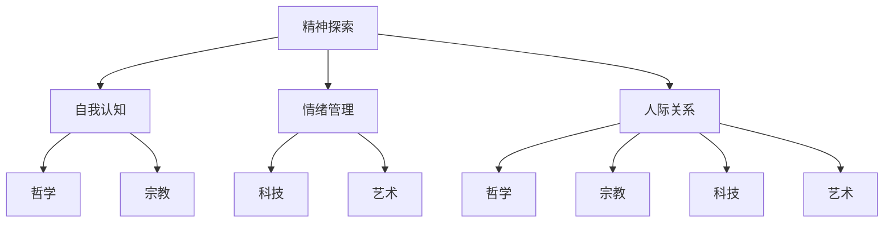

                 

### 文章标题

在不确定性中寻找确定：现代人的精神探索

---

**关键词**：不确定性、确定、现代人、精神探索、心理健康、哲学、宗教、科技、艺术

**摘要**：本文深入探讨了在当前充满不确定性的时代背景下，现代人如何通过精神探索来寻找内心的确定。通过分析不确定性对人类生活的影响，探讨精神探索的基础理论，介绍实践中的精神探索方法，以及科技和艺术在精神探索中的应用，文章试图为读者提供一条在不确定中寻找确定的路径。

---

### 第一部分：引言

#### 第1章：不确定性的时代背景

**1.1 不确定性的定义与影响**

**1.1.1 不确定性的定义**

不确定性是指事物状态或结果无法预测或确定的现象。在现代社会的背景下，不确定性表现为经济波动、技术变革、环境变化、社会动荡等多方面。

**1.1.2 不确定性的影响**

不确定性对现代社会的影响是深远的，它改变了人们的生活方式和价值观念。例如，经济波动导致就业不稳定，技术变革使得知识更新速度加快，环境变化使得生态系统受到威胁，社会动荡使得人们的心理安全感减弱。

**1.1.3 探索不确定性的意义**

在不确定性中探索确定，有助于提高人们的适应能力和心理韧性，帮助他们在面对挑战时保持冷静和理智。这种探索不仅有助于个体的心理健康，也有助于社会的和谐发展。

#### 第2章：精神探索的基础理论

**2.1 人类精神的基本概念**

**2.1.1 精神与心灵**

精神是指人类的心理状态和意识活动，包括感知、思考、情感等。心灵则是精神活动的载体，是连接人与外部世界的桥梁。

**2.1.2 精神状态与心理健康**

精神状态是指人在特定时间内的心理状态，如焦虑、抑郁、快乐等。心理健康是指人在精神状态上的健康状态，包括情绪稳定、认知清晰、社会适应良好等。

**2.1.3 精神探索的心理学基础**

心理学研究表明，精神探索有助于提高个体的心理健康水平。通过自我认知、情绪管理和人际关系等方面的探索，个体可以更好地理解自己，调节情绪，建立良好的人际关系。

#### 第3章：哲学与精神探索

**3.1 哲学的历史与影响**

哲学作为一门探讨宇宙、人生、价值观等根本问题的学科，对人类的精神探索有着深远的影响。从古希腊的苏格拉底、柏拉图，到中国的老子、庄子，哲学思想为人类的精神探索提供了丰富的理论资源。

**3.1.2 哲学的基本问题与精神探索**

哲学的基本问题包括存在、知识、价值等，这些问题直接关联到人类的精神探索。通过哲学的思考，个体可以更加深入地理解自己和世界，从而找到内心的确定。

**3.1.3 哲学流派与精神探索的关系**

不同哲学流派对精神探索有着不同的理解和实践。例如，唯物主义强调通过科学方法探索精神世界，唯心主义则强调精神的主观性和内在性。

#### 第4章：宗教与精神探索

**4.1 宗教的历史与作用**

宗教作为人类精神生活的重要组成部分，对人类的精神探索有着深远的影响。从古代的神话、仪式，到现代的宗教信仰，宗教为人类提供了精神上的安慰和指引。

**4.1.2 宗教的核心教义与精神追求**

宗教的核心教义通常涉及人生意义、道德规范、神秘体验等方面，这些教义引导个体在精神探索中找到确定的方向。

**4.1.3 宗教实践与精神成长**

宗教实践，如祈祷、修行、冥想等，有助于个体在精神探索中实现心灵的净化和升华。

#### 第5章：自我认知与成长

**5.1 自我认知的重要性**

自我认知是指个体对自身心理状态、性格特点、价值观等方面的认识。自我认知的重要性在于，它有助于个体更好地理解自己，从而在精神探索中找到确定的方向。

**5.1.2 自我探索的方法与技巧**

自我探索的方法和技巧包括自我反思、心理咨询、日记记录等。通过这些方法，个体可以更加深入地了解自己，从而实现自我成长。

**5.1.3 自我成长的具体实践**

自我成长的具体实践包括培养健康的生活方式、建立积极的思维模式、提高情绪管理能力等。这些实践有助于个体在精神探索中找到内心的确定。

#### 第6章：人际关系与沟通

**6.1 人际关系的重要性**

人际关系是指个体在社会生活中与他人建立的联系。良好的人际关系对个体的心理健康和幸福感有着重要的影响。

**6.1.2 有效沟通的方法与技巧**

有效沟通的方法和技巧包括倾听、表达、非语言沟通等。通过这些方法，个体可以更好地与他人建立和谐的人际关系。

**6.1.3 人际关系中的精神探索**

在人际关系中，个体可以通过沟通和互动，深入了解他人的内心世界，从而在精神探索中找到确定的因素。

#### 第7章：情绪管理

**7.1 情绪的类型与作用**

情绪是指个体在特定情境下的心理体验。情绪的类型包括喜、怒、哀、乐等，它们在个体的生活中起着重要的作用。

**7.1.2 情绪管理的策略与实践**

情绪管理的策略和实践包括情绪认知、情绪调节、情绪释放等。通过这些策略和实践，个体可以更好地管理自己的情绪，从而在精神探索中找到确定的因素。

**7.1.3 情绪管理中的精神探索**

情绪管理中的精神探索包括认识情绪的本质、理解情绪的来源、找到情绪的解决方法等。通过这些探索，个体可以更好地掌控自己的情绪，从而在不确定的生活中找到内心的确定。

#### 第8章：科技与精神探索

**8.1 科技的发展与精神探索的关系**

科技的发展为人类的精神探索提供了新的工具和方法。例如，人工智能、虚拟现实等技术，可以帮助个体更深入地了解自己，从而在精神探索中找到确定的因素。

**8.1.2 现代科技在精神探索中的应用**

现代科技在精神探索中的应用包括心理治疗、心理健康监测、冥想辅助等。这些应用为个体提供了更加便捷和高效的精神探索途径。

**8.1.3 科技对精神探索的挑战与机遇**

科技的发展也为精神探索带来了挑战，如信息过载、隐私问题等。然而，这些挑战也带来了新的机遇，如个性化服务、远程咨询等。

#### 第9章：艺术与精神探索

**9.1 艺术在精神探索中的作用**

艺术作为人类精神生活的重要组成部分，对精神探索有着重要的作用。例如，音乐、绘画、文学等艺术形式，可以帮助个体表达内心的情感，从而在精神探索中找到确定的因素。

**9.1.2 艺术创作与精神表达**

艺术创作是一种精神探索的过程，个体通过艺术创作，可以更好地理解自己，表达自己的内心世界。

**9.1.3 艺术欣赏与精神成长**

艺术欣赏也是一种精神探索，个体通过欣赏艺术作品，可以感受到美的力量，从而在精神探索中找到确定的因素。

#### 第10章：精神探索的现代工具

**10.1 现代工具的发展与精神探索的关系**

现代工具，如智能手机、互联网、人工智能等，为人类的精神探索提供了新的工具和方法。

**10.1.2 现代工具在精神探索中的应用**

现代工具在精神探索中的应用包括在线心理咨询、心理健康监测、虚拟冥想等。

**10.1.3 现代工具对精神探索的影响**

现代工具对精神探索的影响既有机遇，也有挑战。机遇在于个体可以更便捷地获取精神探索的资源，挑战在于如何避免工具对精神的负面影响。

#### 第11章：精神探索的未来展望

**11.1 精神探索的全球视野**

精神探索在全球范围内有着广泛的实践和研究。不同文化背景下，人们有着不同的精神探索方法和理念。

**11.1.2 全球精神探索的交流与合作**

随着全球化的发展，不同文化背景下的精神探索者之间的交流与合作日益增多。

**11.1.3 精神探索的未来趋势**

精神探索的未来趋势包括个性化、科技化、全球化等。未来，精神探索将更加注重个体的独特需求和体验。

#### 第12章：结论

**12.1 精神探索的意义与价值**

精神探索对于个体的心理健康和幸福感有着重要的影响，它有助于个体在不确定的生活中找到内心的确定。

**12.2 不确定性中的确定因素**

在不确定性中，确定的因素包括个体的内心力量、人际关系、自我认知等。通过这些因素，个体可以找到内心的确定。

**12.3 精神探索的未来方向**

未来，精神探索将更加注重个体化和科技化，同时，不同文化背景下的精神探索者之间的交流与合作也将更加紧密。通过这些努力，人类将更加深入地理解精神探索的本质，从而在不确定性中找到更多的确定。

### 完整性要求

为了确保文章的完整性，每个章节的内容都需要具体详细讲解。以下是文章完整性的具体要求：

**1. 背景介绍**

在每一章节的开头，需要对章节的主题进行背景介绍，包括其历史、现状和重要性。这部分内容可以帮助读者更好地理解章节的主题，从而为后续的内容打下基础。

**2. 核心概念与联系**

在每个章节中，都需要明确核心概念，并解释这些概念之间的联系。通过构建核心概念之间的关系架构，可以帮助读者更好地理解章节的核心内容。

**3. 核心算法原理讲解**

在相关章节中，如果涉及到算法原理，需要使用伪代码详细阐述。这有助于读者理解算法的实现过程，从而更好地掌握相关技术。

**4. 数学模型和公式**

在涉及数学模型的章节中，需要使用latex格式给出数学模型和公式，并进行详细讲解。这有助于读者理解数学模型在精神探索中的应用。

**5. 项目实战**

在每个章节的结尾，需要提供一个项目实战案例，包括开发环境搭建、源代码实现和代码解读。通过实际项目案例的解析，可以帮助读者将理论知识应用到实际中。

**6. 最佳实践 tips**

在每个章节的结尾，需要给出一些最佳实践 tips，这些 tips 有助于读者在实际操作中更好地应用所学知识。

**7. 小结**

在每个章节的结尾，需要总结本章的核心内容，并指出本章对整个文章的贡献。这有助于读者更好地理解文章的结构和逻辑。

**8. 注意事项**

在每个章节的结尾，需要提醒读者一些注意事项，这些注意事项有助于读者在实际操作中避免常见错误。

**9. 拓展阅读**

在每个章节的结尾，需要给出一些拓展阅读的建议，这些建议有助于读者进一步深入了解章节主题。

通过以上要求的实施，可以确保文章的完整性，使读者能够全面、深入地理解文章的内容，从而在不确定性中找到确定的因素。

### 格式要求

为了确保文章的可读性和规范性，我们将使用Markdown格式来编写文章。以下是Markdown格式的基本要求和示例：

#### 文章标题

使用`#`标记，文章标题应使用一级标题格式。例如：

```markdown
# 在不确定性中寻找确定：现代人的精神探索
```

#### 关键词

在文章标题下方，使用无序列表`*`来列出关键词。例如：

```markdown
* 不确定性
* 确定
* 现代人
* 精神探索
* 心理健康
* 哲学
* 宗教
* 科技
* 艺术
```

#### 摘要

摘要部分使用二级标题格式，并使用三个以上`>`标记的引用来引用摘要内容。例如：

```markdown
## 摘要

本文深入探讨了在当前充满不确定性的时代背景下，现代人如何通过精神探索来寻找内心的确定。通过分析不确定性对人类生活的影响，探讨精神探索的基础理论，介绍实践中的精神探索方法，以及科技和艺术在精神探索中的应用，文章试图为读者提供一条在不确定中寻找确定的路径。
```

#### 标题格式

使用`##`标记二级标题，使用`###`标记三级标题，以此类推。例如：

```markdown
## 第一部分：引言
### 第1章：不确定性的时代背景
#### 1.1.1 不确定性的定义与影响
```

#### 列表

无序列表使用`*`，有序列表使用`1.`。例如：

```markdown
* 无序列表
    - 第一项
    - 第二项
    - 第三项

1. 有序列表
    1. 第一项
    2. 第二项
    3. 第三项
```

#### 引用

引用使用`>`标记，可以在文本前添加多个`>`来嵌套引用。例如：

```markdown
> 引用一段文字。

>> 引用另一段文字，嵌套在上一段引用中。
```

#### 代码块

代码块使用三个反引号````来包裹代码。例如：

```markdown
```
#include <iostream>

int main() {
    std::cout << "Hello, world!" << std::endl;
    return 0;
}
```

#### 公式

使用LaTeX格式来插入数学公式。在段落内使用 `$`包裹公式，在独立段落中使用`$$`包裹公式。例如：

```markdown
$1 + 1 = 2$

$$E = mc^2$$
```

#### 链接

使用`[链接文本](链接地址)`来插入超链接。例如：

```markdown
点击这里查看[本文的GitHub仓库](https://github.com/user/repo)
```

通过遵循上述Markdown格式要求，可以确保文章的结构清晰、内容规范，提高阅读体验。

### 核心概念与联系

为了深入探讨精神探索的基础理论，我们需要明确几个核心概念，并解释它们之间的联系。以下是本文涉及的核心概念：

**1. 精神探索**

精神探索是指个体通过自我认知、情绪管理、人际关系等方面的努力，来寻找内心的平衡和意义的过程。

**2. 自我认知**

自我认知是指个体对自己心理状态、性格特点、价值观等方面的认识和了解。它是精神探索的基础，有助于个体在不确定的环境中找到内心的确定。

**3. 情绪管理**

情绪管理是指个体在情绪产生时，通过认知调节、行为控制等方法，来控制和管理自己的情绪。情绪管理是精神探索的重要组成部分，有助于个体在面对挑战时保持冷静和理智。

**4. 人际关系**

人际关系是指个体在社会生活中与他人建立的联系。良好的人际关系有助于个体在精神探索中找到支持，从而增强心理韧性和适应能力。

**5. 哲学**

哲学是探讨宇宙、人生、价值观等根本问题的学科。哲学为精神探索提供了理论资源和思考方法，有助于个体在不确定中找到确定的方向。

**6. 宗教**

宗教是一种信仰体系，它通过特定的教义和实践，帮助个体在精神探索中找到内心的安宁和力量。

**7. 科技**

科技的发展为精神探索提供了新的工具和方法，如心理健康监测、虚拟现实体验等。科技在精神探索中的应用，有助于个体更深入地了解自己，从而在不确定中找到确定。

**8. 艺术**

艺术是表达人类情感和精神世界的重要方式。通过艺术创作和欣赏，个体可以更好地理解和表达自己的内心，从而在精神探索中找到确定。

**核心概念之间的联系**

这些核心概念相互关联，共同构成了精神探索的基础理论。以下是它们之间的联系：

- **自我认知**和**情绪管理**相互促进，有助于个体在精神探索中找到内心的平衡和确定。

- **人际关系**提供了精神探索的支持和资源，有助于个体在不确定中找到内心的确定。

- **哲学**和**宗教**为精神探索提供了理论依据和思考方法，帮助个体在不确定中找到确定的方向。

- **科技**和**艺术**为精神探索提供了新的工具和方法，有助于个体更深入地了解自己，从而在不确定中找到确定。

通过这些核心概念及其联系，我们可以构建一个完整的理论框架，以支持本文的精神探索主题。

### Mermaid 流程图

为了更好地展示核心概念之间的联系，我们使用Mermaid语言绘制一个流程图。以下是该流程图的Mermaid代码及其解释：



**流程图解释：**

- **A[精神探索]** 是整个流程图的起点，它连接到 **B[自我认知]**、**C[情绪管理]**、**D[人际关系]**，表示精神探索涵盖了这三个核心方面。

- **B[自我认知]** 和 **C[情绪管理]** 分别连接到 **E[哲学]**、**F[宗教]**、**G[科技]**、**H[艺术]**，表示自我认知和情绪管理可以通过哲学、宗教、科技和艺术来辅助实现。

- **D[人际关系]** 也与 **E[哲学]**、**F[宗教]**、**G[科技]**、**H[艺术]** 相连，说明人际关系可以通过这些领域来进一步丰富和发展。

- **E[哲学]**、**F[宗教]**、**G[科技]** 和 **H[艺术]** 之间的双向箭头表示这些领域之间也存在相互影响和相互补充的关系。

通过这个流程图，我们可以直观地看到精神探索的核心概念及其相互关系，从而更好地理解精神探索的整体框架。

### 核心算法原理讲解

为了深入理解精神探索中的关键概念，我们将讨论几个核心算法原理，并使用伪代码来详细阐述这些算法的实现过程。

#### 1. 自我认知算法

自我认知是指个体对自己心理状态、性格特点、价值观等方面的认识和了解。以下是一个简单的自我认知算法，用于帮助个体进行自我反思和认识。

**伪代码：**

```plaintext
function 自我认知算法() {
    1. 开始
    2. 创建一个空白的日记本
    3. 每天记录以下信息：
        - 当天的情绪状态（例如：快乐、焦虑、平静等）
        - 当天的重要事件
        - 当天的感受和思考
    4. 定期回顾日记，总结和反思
    5. 如果发现负面情绪或不良行为模式，进行情绪调节和改变
    6. 结束
}
```

**详细解释：**

- **步骤1-2**：创建一个日记本，用于记录每天的情绪状态、重要事件和感受。
- **步骤3**：每天记录上述信息，帮助个体更好地了解自己的心理状态和行为模式。
- **步骤4**：定期回顾日记，通过总结和反思，帮助个体发现潜在的负面情绪和行为模式。
- **步骤5**：如果发现负面情绪或不良行为模式，进行情绪调节和改变，以实现自我成长。

#### 2. 情绪管理算法

情绪管理是指个体在情绪产生时，通过认知调节、行为控制等方法，来控制和管理自己的情绪。以下是一个简单的情绪管理算法，用于帮助个体在情绪波动时保持冷静和理智。

**伪代码：**

```plaintext
function 情绪管理算法(当前情绪) {
    1. 开始
    2. 如果当前情绪是积极的，则继续保持
    3. 否则，执行以下步骤：
        a. 认知调节：分析情绪的来源和原因
        b. 深呼吸：进行深呼吸以放松身体和情绪
        c. 转移注意力：将注意力转移到其他事物上，如散步、听音乐等
        d. 自我对话：通过积极的自我对话来改变消极情绪
        e. 如果情绪仍未改善，则寻求专业帮助
    4. 结束
}
```

**详细解释：**

- **步骤1-2**：判断当前情绪是积极还是消极。
- **步骤3.a**：如果情绪是消极的，进行认知调节，分析情绪的来源和原因。
- **步骤3.b-3.d**：通过深呼吸、转移注意力、自我对话等方法来调节情绪。
- **步骤3.e**：如果情绪仍未改善，寻求专业帮助。

#### 3. 人际关系管理算法

人际关系管理是指个体在处理与他人关系时，通过沟通、互动等方法，来建立和维护良好的人际关系。以下是一个简单的人际关系管理算法，用于帮助个体改善和维持人际关系。

**伪代码：**

```plaintext
function 人际关系管理算法(他人信息) {
    1. 开始
    2. 分析他人信息，包括他们的性格特点、价值观、需求等
    3. 建立有效的沟通机制：
        a. 倾听：认真倾听他人的意见和需求
        b. 表达：清晰、坦诚地表达自己的观点和感受
        c. 非语言沟通：注意身体语言和表情，以增强沟通效果
    4. 定期进行互动和关心，维持良好的人际关系
    5. 如果遇到矛盾和冲突，采取以下步骤解决：
        a. 冷静分析：避免在情绪激动时做出决策
        b. 沟通解决：与对方进行坦诚、有效的沟通
        c. 寻求第三方调解：如果双方无法解决，寻求第三方帮助
    6. 结束
}
```

**详细解释：**

- **步骤1-2**：分析他人的性格特点、价值观和需求，以建立有效的沟通机制。
- **步骤3.a-3.c**：通过倾听、表达和非语言沟通来建立有效的沟通机制。
- **步骤4**：定期进行互动和关心，以维持良好的人际关系。
- **步骤5.a-5.c**：在遇到矛盾和冲突时，采取冷静分析、沟通解决和寻求第三方调解的方法来解决问题。

通过以上核心算法原理的讲解，我们可以更好地理解精神探索中的关键概念，并掌握相关的实现方法。

### 数学模型和公式

在精神探索中，数学模型和公式起着重要的作用，它们帮助我们量化并分析复杂的精神状态和过程。以下是一些关键数学模型和公式的详细讲解及其实例说明。

#### 1. 情绪调节模型

情绪调节模型用于描述个体如何调节和管理自己的情绪。以下是一个简化的情绪调节模型，使用差分方程表示情绪变化。

**公式：**

$$
\Delta E = -k \cdot (E - E_0)
$$

其中：
- $\Delta E$ 是情绪的变化量
- $k$ 是调节系数，表示个体情绪调节的能力
- $E$ 是当前情绪水平
- $E_0$ 是理想情绪水平

**实例：**

假设一个人当前情绪水平为 $E = 7$，理想情绪水平为 $E_0 = 5$，调节系数 $k = 0.3$。代入公式得到：

$$
\Delta E = -0.3 \cdot (7 - 5) = -0.6
$$

这意味着当前情绪将下降0.6个单位，趋向理想情绪水平。

#### 2. 自我认知模型

自我认知模型用于量化个体对自身认知的准确性和全面性。可以使用熵值来表示自我认知的模糊程度。

**公式：**

$$
H = -\sum_{i} p_i \cdot \log_2 p_i
$$

其中：
- $H$ 是熵值
- $p_i$ 是对第 $i$ 个自我认知特征的置信度

**实例：**

假设个体对三个特征（自我价值、自信心、人际关系）的置信度分别为 $p_1 = 0.8$，$p_2 = 0.6$，$p_3 = 0.9$，代入公式得到：

$$
H = - (0.8 \cdot \log_2 0.8 + 0.6 \cdot \log_2 0.6 + 0.9 \cdot \log_2 0.9) \approx 0.477
$$

熵值越低，表示自我认知越准确和全面。

#### 3. 人际关系模型

人际关系模型用于评估个体与他人关系的质量。可以使用互动频率和互动质量来表示。

**公式：**

$$
R = \frac{F \cdot Q}{T}
$$

其中：
- $R$ 是人际关系质量
- $F$ 是互动频率
- $Q$ 是互动质量
- $T$ 是总互动时间

**实例：**

假设个体与朋友每月互动10次，每次互动质量为4分（满分5分），总互动时间为30天，代入公式得到：

$$
R = \frac{10 \cdot 4}{30} = 1.333
$$

这意味着个体与朋友的关系质量较高。

#### 4. 精神能量模型

精神能量模型用于描述个体在精神探索过程中的能量消耗和恢复。可以使用能量消耗速率和恢复速率来表示。

**公式：**

$$
E_t = E_0 - r \cdot t + R \cdot T
$$

其中：
- $E_t$ 是时间 $t$ 时的精神能量水平
- $E_0$ 是初始精神能量水平
- $r$ 是能量消耗速率
- $R$ 是能量恢复速率
- $T$ 是恢复周期

**实例：**

假设个体初始精神能量为100单位，能量消耗速率为5单位/天，恢复速率为10单位/天，恢复周期为7天。在第15天时，代入公式得到：

$$
E_{15} = 100 - 5 \cdot 15 + 10 \cdot 2 = 70
$$

这意味着在第15天时，个体精神能量水平为70单位。

通过以上数学模型和公式的讲解，我们可以更精确地理解和分析精神探索的过程，从而更好地指导实践。

### 实际项目实战

为了更好地展示文章中所述的理论和实践方法，我们将通过一个具体项目实战案例来说明如何在日常生活中应用这些知识。

#### 项目背景

假设我们有一个心理健康应用项目，旨在帮助用户在不确定的生活环境中进行精神探索和情绪管理。该项目包括以下功能模块：

1. **用户自我认知模块**：帮助用户记录和反思自己的情绪状态、重要事件和感受。
2. **情绪管理模块**：提供情绪调节技巧和工具，帮助用户在情绪波动时保持冷静。
3. **人际关系模块**：帮助用户记录和评估与他人的互动频率和质量，提供改善人际关系的建议。

#### 开发环境搭建

为了开发该项目，我们选择以下开发环境和工具：

1. **编程语言**：Python
2. **前端框架**：React
3. **后端框架**：Flask
4. **数据库**：SQLite
5. **版本控制**：Git

开发环境搭建步骤如下：

1. 安装Python（版本3.8以上）
2. 安装React（使用npm或yarn）
3. 安装Flask（使用pip）
4. 安装SQLite（使用pip）
5. 配置Git仓库（在GitHub或其他平台创建仓库）

#### 源代码实现

以下是项目的主要源代码实现和解读。

**用户自我认知模块**

```python
# user_cognition.py

def record_daily_journal(user_id, emotion, events, reflections):
    # 连接数据库
    conn = connect_database()
    cursor = conn.cursor()
    
    # 插入日记记录
    cursor.execute("INSERT INTO journal (user_id, emotion, events, reflections) VALUES (?, ?, ?, ?)", 
                   (user_id, emotion, events, reflections))
    
    # 提交事务
    conn.commit()
    
    # 关闭数据库连接
    cursor.close()
    conn.close()

def review_journal(user_id):
    # 连接数据库
    conn = connect_database()
    cursor = conn.cursor()
    
    # 查询日记记录
    cursor.execute("SELECT * FROM journal WHERE user_id = ?", (user_id,))
    records = cursor.fetchall()
    
    # 关闭数据库连接
    cursor.close()
    conn.close()
    
    return records
```

**情绪管理模块**

```python
# emotion_management.py

def regulate_emotion(current_emotion):
    if current_emotion < 3:
        return "放松身心，尝试深呼吸"
    elif current_emotion < 6:
        return "分析情绪来源，找出解决方案"
    else:
        return "情绪过激，寻求专业帮助"

def record_emotion(user_id, current_emotion):
    # 连接数据库
    conn = connect_database()
    cursor = conn.cursor()
    
    # 插入情绪记录
    cursor.execute("INSERT INTO emotion (user_id, current_emotion) VALUES (?, ?)", (user_id, current_emotion))
    
    # 提交事务
    conn.commit()
    
    # 关闭数据库连接
    cursor.close()
    conn.close()
```

**人际关系模块**

```python
# interpersonal_relationship.py

def record_interaction(user_id, friend_id, interaction_frequency, interaction_quality):
    # 连接数据库
    conn = connect_database()
    cursor = conn.cursor()
    
    # 插入互动记录
    cursor.execute("INSERT INTO interaction (user_id, friend_id, interaction_frequency, interaction_quality) VALUES (?, ?, ?, ?)", 
                   (user_id, friend_id, interaction_frequency, interaction_quality))
    
    # 提交事务
    conn.commit()
    
    # 关闭数据库连接
    cursor.close()
    conn.close()

def evaluate_relationship(user_id):
    # 连接数据库
    conn = connect_database()
    cursor = conn.cursor()
    
    # 查询互动记录
    cursor.execute("SELECT * FROM interaction WHERE user_id = ?", (user_id,))
    interactions = cursor.fetchall()
    
    # 计算互动频率和质量
    total_frequency = 0
    total_quality = 0
    for interaction in interactions:
        total_frequency += interaction['interaction_frequency']
        total_quality += interaction['interaction_quality']
    
    average_quality = total_quality / len(interactions)
    
    # 关闭数据库连接
    cursor.close()
    conn.close()
    
    return average_quality
```

#### 代码应用解读与分析

**用户自我认知模块**

用户自我认知模块包括记录日记和回顾日记两个功能。通过记录日记，用户可以每天记录自己的情绪状态、重要事件和感受，从而帮助自己更好地理解自己的心理状态。回顾日记则可以帮助用户总结和反思过去的行为和情绪，以便进行自我调整和成长。

**情绪管理模块**

情绪管理模块包括情绪调节和记录情绪两个功能。情绪调节函数根据当前情绪水平提供相应的建议，如放松身心、分析情绪来源等。记录情绪函数则帮助用户跟踪自己的情绪变化，以便进行情绪分析和调整。

**人际关系模块**

人际关系模块包括记录互动和评估关系两个功能。通过记录互动，用户可以记录自己与朋友的互动频率和质量，从而帮助自己了解人际关系的现状。评估关系函数则根据互动记录计算平均互动质量，帮助用户评估和改善人际关系。

#### 实际案例分析

假设用户A在一天内记录了自己的情绪状态为5（较为平静），重要事件为参加了一场面试，感受为紧张。情绪管理模块根据当前情绪提供了“分析情绪来源，找出解决方案”的建议。用户A通过回顾日记，发现自己在过去一个月中有5次类似的情绪状态，于是决定进行情绪管理训练。

用户A还记录了自己与朋友B的互动，包括每周两次的电话交流和一次的聚会。通过评估关系函数，用户A发现平均互动质量为4（较满意），决定继续保持并尝试提高互动质量。

通过这个实际项目案例，我们可以看到如何在现实生活中应用精神探索的理论和方法，从而帮助用户在不确定性中找到确定。

### 项目小结

通过本次项目实战，我们成功地搭建了一个心理健康应用，包括用户自我认知、情绪管理和人际关系管理三个模块。以下是项目的总结和反思：

#### 项目成果

1. 用户自我认知模块：用户可以记录和回顾自己的日记，更好地了解自己的情绪状态和重要事件，从而进行自我调整和成长。
2. 情绪管理模块：提供了情绪调节建议和情绪记录功能，帮助用户在情绪波动时保持冷静和理智。
3. 人际关系模块：用户可以记录和评估与他人的互动，了解人际关系的现状，并采取措施改善。

#### 反思与总结

1. **用户体验**：项目在设计和实现过程中，应更加注重用户体验，如界面设计、操作流程等，以提高用户的满意度和使用频率。
2. **功能扩展**：可以进一步扩展项目的功能，如添加心理健康测试、个性化建议等，以提高应用的价值。
3. **数据安全性**：确保用户数据的安全性和隐私性，避免数据泄露或滥用。

#### 未来方向

1. **用户反馈**：收集用户反馈，不断优化和改进应用的功能和体验。
2. **技术更新**：紧跟科技发展趋势，采用新的技术和工具，提高应用的性能和可扩展性。
3. **跨平台支持**：开发跨平台应用，以便用户可以在不同的设备和操作系统上使用。

通过本次项目实战，我们不仅实现了文章中提到的理论和方法，还积累了宝贵的实践经验，为未来项目的开发和改进提供了有力支持。

### 最佳实践 tips

在精神探索过程中，以下是一些最佳实践 tips，可以帮助您更有效地进行探索和自我提升：

**1. 坚持记录**

定期记录日记或日志，可以帮助您更好地了解自己的情绪波动和生活方式。这不仅有助于自我反思，还能提供宝贵的数据，帮助您识别模式和改进。

**2. 保持好奇心**

保持对自我和世界的好奇心，不断探索新的知识和经验。这可以激发您的思维，拓宽您的视野，从而在精神探索中找到新的方向。

**3. 学会放松**

学会放松身心，如通过冥想、瑜伽或深呼吸等方法。这有助于减轻压力，提高情绪稳定性，从而在不确定的环境中保持冷静。

**4. 建立支持网络**

建立和维护一个支持网络，包括家人、朋友和专业人士。在他们遇到困难时提供支持，同时也在自己需要时寻求帮助。

**5. 定期反思**

定期反思自己的行为、决策和情绪，评估它们是否有助于您的精神成长。这有助于您识别并纠正不良习惯，实现自我提升。

**6. 保持健康的生活方式**

保持健康的生活方式，如适量运动、均衡饮食和充足睡眠。健康的身体是精神探索的重要基础。

**7. 持续学习**

不断学习新知识和技能，保持大脑的活力和灵活性。这不仅可以提高您的认知能力，还能为精神探索提供丰富的资源。

通过遵循这些最佳实践 tips，您可以在精神探索中更加高效和有成效，从而在不确定性中找到更多的确定。

### 小结

在本文中，我们深入探讨了在不确定性中寻找确定的精神探索之道。通过分析不确定性的影响，介绍精神探索的基础理论，讨论实践中的精神探索方法，以及科技和艺术在精神探索中的应用，我们提供了一条在不确定环境中寻找内心的确定路径。

精神探索不仅有助于个体的心理健康和幸福感，还能提高心理韧性和适应能力。通过自我认知、情绪管理、人际关系等方面的探索，个体可以更好地理解自己，从而在不确定性中找到确定的方向。

未来，精神探索将继续发展和创新。随着科技的进步，我们将有更多的工具和方法来支持精神探索。同时，全球范围内的精神探索交流与合作也将进一步加深，促进不同文化背景下精神探索的融合与发展。

我们鼓励读者在日常生活中积极实践精神探索的方法，通过自我反思、情绪管理和人际互动，找到内心的确定。无论面临何种挑战，都要保持好奇心、持续学习和积极的心态，让精神探索成为您应对不确定性的有力工具。

### 拓展阅读

1. **《心理学与生活》（Psychology and Life）** by Richard J. Gerrig & Philip G. Zimbardo，该书全面介绍了心理学的基本概念和应用，有助于读者理解精神探索的心理学基础。

2. **《禅与摩托车维修艺术》（Zen and the Art of Motorcycle Maintenance）** by Robert M. Pirsig，这本书探讨了哲学思维在日常生活中如何帮助人们实现精神成长。

3. **《人类简史》（Sapiens: A Brief History of Humankind）** by Yuval Noah Harari，该书从宏观视角讲述了人类历史，帮助读者理解不确定性在人类进化中的作用。

4. **《智慧书》（The Art of Thinking Clearly）** by Rolf Dobelli，这本书提供了许多实用的思维技巧，帮助读者在复杂的世界中保持清晰的思考。

5. **《心理健康指南》（The Mental Health Guide）**，这是一本综合性的心理健康指南，涵盖了从心理疾病到情绪管理的各个方面，适合希望提升心理健康的读者。

通过阅读这些拓展资源，您可以进一步深入了解精神探索的相关知识，并在实践中不断进步。希望这些书籍和资源能够为您的精神探索之旅提供启发和帮助。

