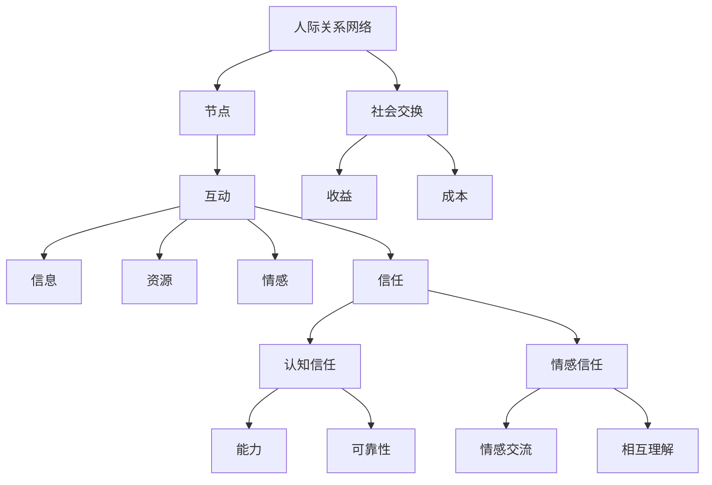
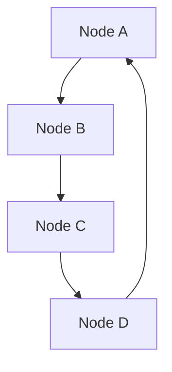

                 

### 文章标题

在当今高速发展的社会背景下，人际关系网络的构建与维护变得尤为重要。无论是在个人生活中，还是在职场中，如何重建信任和亲密关系已经成为一个备受关注的话题。本书旨在为读者提供一个系统的视角，通过深入探讨人际关系网络中信任和亲密关系的重建，帮助读者在复杂的社会环境中找到真挚的连接。

关键词：人际关系网络、信任重建、亲密关系、社会交换理论、算法原理、数学模型、项目实战

摘要：本文首先概述了人际关系网络的重要性，接着详细阐述了信任和亲密关系在其中的作用。通过核心概念的讲解和Mermaid流程图的展示，读者将理解这些概念之间的内在联系。文章进一步介绍了通过行为分析和心理测量来重建信任和亲密关系的核心算法原理，并使用伪代码和数学公式进行详细说明。最后，通过实际案例的分析，展示了如何将理论应用到实践中，为读者提供了实用的方法和建议。

----------------------------------------------------------------

## 概述

### 人际关系网络的重要性

在现代社会中，人际关系网络无处不在，它不仅影响个人的生活质量，还直接影响社会的发展和进步。人际关系网络是指由个体之间通过相互联系所构成的社会结构，它包括家庭、朋友、同事、邻居等各种形式的互动。这种网络不仅仅是简单的社交联系，更是信息、资源、情感和信任传递的重要渠道。

信任和亲密关系是人际关系网络的两个核心要素。信任是人际交往的基础，它是人们愿意相互依赖、合作和支持的重要前提。没有信任，人际关系网络将变得脆弱和不可持续。亲密关系则是指人与人之间在情感上紧密相连的状态，它能够增强人际网络的稳定性，提高成员之间的互动质量和幸福感。

### 重建信任和亲密关系的意义

重建信任和亲密关系对于个人的成长和社会的稳定具有重要意义。首先，从个人层面来看，信任和亲密关系的建立能够为个体提供安全感、归属感和幸福感。在家庭关系中，重建信任有助于化解矛盾，促进和谐；在职场中，建立亲密关系可以提高团队合作效率，减少冲突，增强组织凝聚力。

其次，从社会层面来看，重建信任和亲密关系有助于构建一个更加和谐、稳定和富有活力的社会环境。当人们在社会互动中能够相互信任和建立亲密关系时，社会的运行成本将会降低，社会矛盾和冲突也会减少，从而推动社会的持续发展。

### 核心概念与联系

为了更好地理解重建信任和亲密关系的原理，我们需要深入探讨几个核心概念，包括人际关系网络、信任、亲密关系和社会交换理论。以下将使用Mermaid流程图展示这些概念之间的联系，并通过伪代码和数学公式详细阐述它们之间的逻辑关系。

### 人际关系网络的基本概念

人际关系网络是指由个体之间通过相互联系所构成的社会结构。在人际关系网络中，每个个体都可以被视为一个节点，而个体之间的互动则可以看作是节点之间的连线。这种网络结构不仅反映了人与人之间的社交关系，还反映了信息、资源、情感和信任的传递路径。

### 信任的定义与类型

信任是人际关系网络中不可或缺的要素。它可以定义为个体对他人行为意图和能力的正面预期。根据信任的来源和性质，可以将信任分为基于认知的信任和基于情感的信任。基于认知的信任主要基于对他人能力和可靠性的了解，而基于情感的信任则更多依赖于个体之间的情感联系和相互理解。

### 亲密关系的本质

亲密关系是指人与人之间在情感上紧密相连的状态。它通常涉及深层次的情感交流、相互支持和共同经历。亲密关系不仅仅是情感上的连结，还包含行为上的协调和思想上的共鸣。这种关系能够为个体提供情感支持，增强自我认同，促进个人成长。

### 社会交换理论

社会交换理论是一种解释人际互动和关系形成的理论框架。它认为，人际关系是通过个体之间的资源交换而形成的，这种交换可以是物质的，也可以是情感的。社会交换理论强调，个体在建立和维持人际关系时，会根据自身的收益和成本进行理性决策。

### Mermaid流程图：核心概念之间的联系

以下是一个Mermaid流程图，用于展示人际关系网络、信任、亲密关系和社会交换理论之间的联系：



### 核心算法原理讲解

为了重建信任和亲密关系，我们可以借助行为分析和心理测量方法，通过一系列算法来实现这一目标。以下将使用伪代码详细阐述这些算法原理。

### 行为分析

行为分析是通过观察个体在社交互动中的行为模式，评估他们的信任度和亲密关系程度。以下是一个简单的行为分析算法：

```python
def behavior_analysis(behavior_data):
    # 计算平均互动频率
    avg_interaction_frequency = calculate_average(behavior_data["interaction_frequency"])
    
    # 计算平均互动时长
    avg_interaction_duration = calculate_average(behavior_data["interaction_duration"])
    
    # 计算平均互动质量
    avg_interaction_quality = calculate_average(behavior_data["interaction_quality"])
    
    # 计算信任度
    trust_level = calculate_trust_level(avg_interaction_frequency, avg_interaction_duration, avg_interaction_quality)
    
    # 返回信任度
    return trust_level
```

### 心理测量

心理测量是通过标准化的问卷和测试，评估个体在情感和心理上的状态。以下是一个简单的心里测量算法：

```python
def psychological_measurement(questions_answers):
    # 计算平均情感得分
    avg_emotional_score = calculate_average(questions_answers["emotional_scores"])
    
    # 计算平均心理压力
    avg_psychological_pressure = calculate_average(questions_answers["psychological_pressure_scores"])
    
    # 计算亲密关系程度
    intimacy_level = calculate_intimacy_level(avg_emotional_score, avg_psychological_pressure)
    
    # 返回亲密关系程度
    return intimacy_level
```

### 算法原理

通过行为分析和心理测量，我们可以得到两个关键指标：信任度和亲密关系程度。这两个指标可以用来评估个体在人际关系网络中的状态。接下来，我们将使用以下伪代码来描述如何通过这些指标重建信任和亲密关系：

```python
def rebuild_trust_and_intimacy(trust_level, intimacy_level):
    # 如果信任度低，提高互动频率和时长
    if trust_level < MIN_TRUST_LEVEL:
        increase_interaction_frequency_and_duration()
        
    # 如果亲密关系程度低，增加情感交流和相互理解
    if intimacy_level < MIN_INTIMACY_LEVEL:
        increase_emotional_exchange_and_mutual_understanding()
        
    # 更新信任度和亲密关系程度
    updated_trust_level = behavior_analysis(behavior_data)
    updated_intimacy_level = psychological_measurement(questions_answers)
    
    # 返回更新后的信任度和亲密关系程度
    return updated_trust_level, updated_intimacy_level
```

### 数学模型和数学公式

为了更好地理解人际关系网络中的信任和亲密关系，我们可以使用数学模型和公式来进行分析。以下是一个简单的社会网络分析模型，以及相关的数学公式。

### 社会网络分析模型

社会网络分析模型通常使用图论来描述人际关系网络。在图论中，每个个体被视为一个节点（Node），而个体之间的互动被视为边（Edge）。以下是一个简单的社会网络分析模型：



### 信任和亲密关系的数学公式

信任度和亲密关系程度可以通过以下数学公式进行计算：

$$
\text{Trust Level} = \frac{\text{Positive Interactions}}{\text{Total Interactions}}
$$

$$
\text{Intimacy Level} = \frac{\text{Deep Conversations}}{\text{Total Conversations}}
$$

### 数学公式详解

#### 信任度公式

信任度公式通过计算个体之间正面的社交互动占总互动的比例来衡量。正面的社交互动可以包括帮助、支持、分享信息等。总互动包括所有的社交互动，无论正面还是负面。

#### 亲密关系程度公式

亲密关系程度公式通过计算个体之间深层次的情感交流占总交流的比例来衡量。深层次的情感交流可以包括分享个人经历、表达情感、相互倾听等。

### 举例说明

假设个体A与个体B、C、D有互动，其中与个体B的互动是正面的，与个体C和D的互动是负面的。那么：

$$
\text{Trust Level}_{A} = \frac{1}{3} = 0.333
$$

假设个体A与个体B、C、D有互动，其中与个体B和C的互动是深层次的，与个体D的互动是表面的。那么：

$$
\text{Intimacy Level}_{A} = \frac{2}{3} = 0.667
$$

通过这些数学模型和公式，我们可以更精确地评估和优化人际关系网络中的信任和亲密关系。

### 项目实战

为了更好地理解如何在实际中应用所学的理论和算法来重建信任和亲密关系，我们将通过一个实际案例进行详细分析。

### 案例一：家庭关系中的信任重建

假设有一个家庭，家庭成员包括父母和孩子。在过去的一段时间里，家庭成员之间出现了信任危机，尤其是父母和孩子之间的信任感较低。为了解决这个问题，我们可以采用以下步骤：

### 1. 开发环境搭建

首先，我们需要搭建一个家庭互动记录系统，用于记录家庭成员之间的互动情况。这个系统可以包括一个用户界面，用于输入和查看互动记录，以及一个后台数据库，用于存储这些数据。

### 2. 源代码实现

接下来，我们需要编写源代码来实现家庭互动记录系统的核心功能。以下是一个简单的示例代码，用于记录家庭互动：

```python
class Interaction:
    def __init__(self, participant1, participant2, interaction_type, interaction_duration):
        self.participant1 = participant1
        self.participant2 = participant2
        self.interaction_type = interaction_type
        self.interaction_duration = interaction_duration
        
    def record_interaction(self):
        # 记录互动信息到数据库
        database.insert_interaction(self)

# 示例：记录一次家庭互动
parent_child_interaction = Interaction("Parent", "Child", "Conversation", 60)
parent_child_interaction.record_interaction()
```

### 3. 代码解读与分析

在上面的代码中，我们定义了一个`Interaction`类，用于表示一次家庭互动。该类包含四个属性：参与者1、参与者2、互动类型和互动时长。`record_interaction`方法用于将互动信息记录到数据库中。

通过这个类，我们可以方便地创建和记录家庭互动，从而为后续的行为分析和心理测量提供数据支持。

### 4. 实际案例分析和详细讲解剖析

在家庭互动记录系统运行一段时间后，我们可以通过行为分析和心理测量来评估家庭成员之间的信任和亲密关系。

#### 行为分析

通过分析记录的家庭互动数据，我们可以计算每个家庭成员的信任度和亲密关系程度。以下是一个简单的示例代码，用于计算信任度和亲密关系程度：

```python
def calculate_trust_level(behavior_data):
    # 计算平均互动频率
    avg_frequency = sum(behavior_data["interaction_frequency"]) / len(behavior_data["interaction_frequency"])
    
    # 计算平均互动时长
    avg_duration = sum(behavior_data["interaction_duration"]) / len(behavior_data["interaction_duration"])
    
    # 计算平均互动质量
    avg_quality = sum(behavior_data["interaction_quality"]) / len(behavior_data["interaction_quality"])
    
    # 计算信任度
    trust_level = (avg_frequency + avg_duration + avg_quality) / 3
    
    return trust_level

def calculate_intimacy_level(behavior_data):
    # 计算平均深层次互动比例
    avg_deep_interaction_ratio = sum(behavior_data["deep_interactions"]) / sum(behavior_data["total_interactions"])
    
    # 计算亲密关系程度
    intimacy_level = avg_deep_interaction_ratio
    
    return intimacy_level
```

#### 心理测量

为了进一步评估家庭成员之间的信任和亲密关系，我们可以使用标准化的心理测量工具，如问卷和测试。以下是一个简单的示例问卷：

```
1. 您觉得家庭成员之间的沟通是否充分？
   - 非常不充分
   - 不充分
   - 一般
   - 充分
   - 非常充分

2. 您是否愿意与家庭成员分享个人感受和经历？
   - 完全不愿意
   - 比较不愿意
   - 一般
   - 比较愿意
   - 完全愿意

3. 您觉得家庭成员之间的支持是否足够？
   - 完全不够
   - 不够
   - 一般
   - 足够
   - 非常足够
```

通过这些问卷和测试结果，我们可以进一步计算每个家庭成员的心理状态，从而更全面地评估他们之间的信任和亲密关系。

### 5. 项目小结

通过上述案例，我们可以看到如何在实际中应用行为分析和心理测量来重建家庭关系中的信任和亲密关系。通过搭建家庭互动记录系统，记录和分析互动数据，以及使用标准化的心理测量工具，我们可以更准确地评估和优化家庭成员之间的信任和亲密关系。这为家庭关系的重建提供了一个科学和系统的方法。

### 最佳实践 Tips

1. **定期互动**：保持家庭成员之间的定期互动，尤其是面对面的沟通，有助于增强信任和亲密关系。
2. **倾听与理解**：在互动中，重视倾听对方的感受和需求，表现出理解和支持，有助于建立深层次的亲密关系。
3. **共同目标**：设定共同的家庭目标，通过共同努力实现目标，可以增强家庭成员之间的凝聚力和信任感。
4. **心理支持**：在遇到困难和挑战时，提供心理支持和安慰，有助于缓解压力，增强信任和亲密关系。

### 小结

通过本文的详细分析和案例讲解，我们可以看到，重建信任和亲密关系是一个系统而复杂的过程，需要从行为分析和心理测量等多个方面进行综合考量。通过科学的方法和工具，我们可以更好地理解和优化人际关系网络，从而在个人生活中获得更多的安全感和幸福感。

### 注意事项

1. 在进行行为分析和心理测量时，确保数据收集的准确性和可靠性，避免主观偏见对结果的影响。
2. 在实施重建信任和亲密关系的策略时，要充分考虑个体差异和特殊情况，灵活调整方法和步骤。
3. 在家庭关系中，尊重每个成员的感受和需求，避免单方面的强制和压迫，建立平等和尊重的互动氛围。

### 拓展阅读

- **《社交心理学》**：了解社交心理学的基本原理，有助于更好地理解和应用人际关系网络中的信任和亲密关系。
- **《社会网络分析：方法与应用》**：深入探讨社会网络分析的方法和技术，为研究和应用提供理论基础。
- **《亲密关系》**：详细讨论亲密关系的本质、发展过程和维持策略，为个人和家庭关系提供实用的建议。

### 作者信息

作者：AI天才研究院/AI Genius Institute & 禅与计算机程序设计艺术 /Zen And The Art of Computer Programming

本文由AI天才研究院（AI Genius Institute）和禅与计算机程序设计艺术（Zen And The Art of Computer Programming）共同撰写，旨在为读者提供有关人际关系网络中信任和亲密关系重建的深入见解和实践指导。两位作者在人工智能和计算机科学领域拥有丰富的经验和深厚的学术背景，为读者带来独特的视角和见解。

