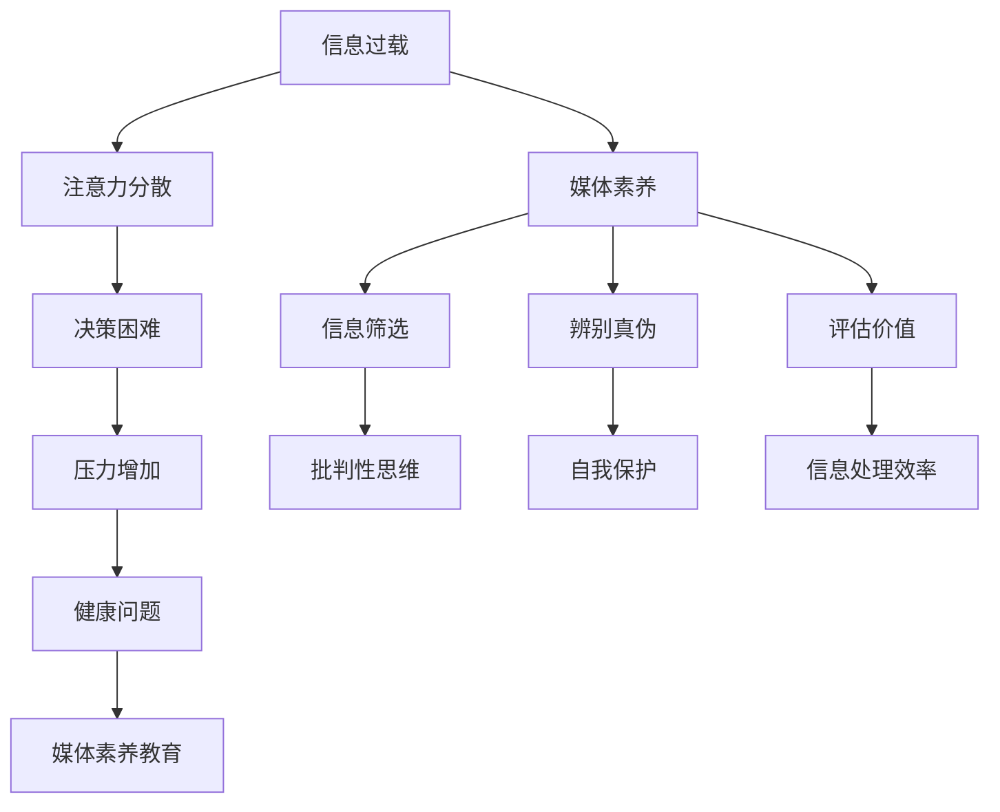

                 


# 在信息泛滥时代培养辨别能力：提高媒体素养

## 关键词
- 信息泛滥
- 媒体素养
- 辨别能力
- 批判性思维
- 信息筛选

## 摘要
本文旨在探讨在信息泛滥的时代，如何通过提高媒体素养来培养辨别能力。文章首先介绍了信息泛滥对个人和社会的挑战，然后阐述了媒体素养的定义和重要性。接着，文章深入分析了辨别能力的核心概念和培养策略，并通过实际案例展示了媒体素养教育的成功经验。最后，文章提出了实用的技巧和策略，以及未来发展的趋势和展望。

## 引言

### 信息泛滥时代的挑战

随着互联网的普及和移动设备的广泛使用，信息已经成为我们生活中不可或缺的一部分。然而，信息泛滥也带来了诸多挑战。首先，信息过载导致我们的注意力分散，难以集中精力处理重要信息。其次，面对海量的信息，人们容易陷入决策困难，无法做出明智的选择。此外，信息泛滥还可能导致压力增加，甚至引发健康问题。

### 媒体素养的重要性

在这个信息泛滥的时代，提高媒体素养变得尤为重要。媒体素养不仅包括对信息内容的理解和批判，还涉及到信息筛选、辨别真伪和评估信息价值的能力。具备良好的媒体素养，可以帮助我们更好地应对信息过载，提高信息处理效率，培养批判性思维，增强自我保护能力。

### 核心概念与联系

为了更好地理解媒体素养和辨别能力，我们可以通过以下Mermaid流程图来展示它们之间的核心概念和联系。



### 核心算法原理讲解

为了提高媒体素养，我们可以通过以下伪代码来描述核心算法原理。

```python
# 提高媒体素养核心算法
def improve_media_literacy():
    # 提高信息筛选能力
    improve_information_filtering_ability()
    # 培养批判性思维
    cultivate_critical_thinking()
    # 增强自我保护能力
    enhance_self_protection_ability()
    # 提高信息处理效率
    improve_information_processing_efficiency()
```

### 数学模型和公式

为了更好地理解媒体素养对信息处理效率的影响，我们可以使用以下LaTeX公式来表示。

```latex
\documentclass{article}
\usepackage{amsmath}
\begin{document}
\section*{数学模型和公式}
媒体素养对信息处理效率的影响可以用以下公式表示：
\begin{equation}
E = f(M_L)
\end{equation}
其中，E 表示信息处理效率，M_L 表示媒体素养水平。
```

## 培养辨别能力的核心概念

### 辨别能力的定义

辨别能力是指在面对复杂信息和各种观点时，能够准确判断信息真伪、价值大小和适用性的能力。在信息泛滥的时代，辨别能力尤为重要，它可以帮助我们筛选出有价值的信息，避免受到虚假信息的误导。

### 辨别能力的构成

辨别能力包括以下几个方面：

1. **信息筛选能力**：能够快速识别出重要信息，排除干扰和无关信息。
2. **批判性思维**：能够对信息进行深入分析，判断其真实性和可靠性。
3. **自我保护能力**：能够识别并避免接触有害信息，保护自己的心理健康。
4. **信息处理效率**：能够在有限的时间内高效地处理大量信息。

### 辨别能力的培养策略

为了提高辨别能力，我们可以采取以下策略：

1. **持续学习**：不断更新自己的知识储备，增强对各种信息源的了解。
2. **批判性思维训练**：通过阅读、讨论和思考，培养对信息的批判性思维。
3. **自我反思**：经常对自己的判断进行反思，找出错误和不足，不断改进。
4. **实践应用**：将辨别能力应用于实际生活中，不断积累经验。

### 详细讲解与举例说明

为了更好地理解辨别能力的培养策略，我们可以通过以下例子来说明。

#### 信息筛选能力

假设你是一名职场新人，面对大量的招聘信息，你需要具备良好的信息筛选能力，快速识别出适合你的职位。

- **步骤1**：阅读招聘信息，了解职位要求。
- **步骤2**：根据自身条件，排除不符合要求的职位。
- **步骤3**：对比剩余职位，选择最适合自己的职位。

通过以上步骤，你可以有效地筛选出适合自己的职位，提高求职效率。

#### 批判性思维

假设你看到一篇文章，文章作者认为某种食品对健康非常有益。

- **步骤1**：查找相关研究，了解该食品的真实效果。
- **步骤2**：分析研究方法是否科学，结果是否可靠。
- **步骤3**：结合自身情况，判断该食品是否适合自己的健康需求。

通过以上步骤，你可以形成自己的判断，而不是盲目接受文章作者的观点。

## 实际案例分析

### 媒体素养教育的成功案例

许多国家和地区已经认识到媒体素养教育的重要性，并采取了相应的措施。以下是一些成功案例：

1. **美国**：美国许多学校已经将媒体素养教育纳入课程体系，培养学生的信息筛选和批判性思维能力。
2. **芬兰**：芬兰的教育体系注重培养学生的批判性思维和创造力，包括对信息源的评估和分析能力。
3. **中国**：中国一些高校已经开始进行媒体素养教育的探索，通过讲座、研讨会等形式，提高学生的媒体素养。

### 辨别能力的实际应用

辨别能力在实际生活中具有广泛的应用。以下是一些例子：

1. **网络购物**：在面对各种商品广告时，具备辨别能力的消费者能够快速识别出真实的商品信息和虚假广告，避免受骗。
2. **社交媒体**：在浏览社交媒体时，具备辨别能力的用户能够识别出虚假信息和谣言，保护自己的心理健康。
3. **新闻报道**：在阅读新闻报道时，具备辨别能力的读者能够准确判断新闻的真实性和客观性，形成独立见解。

### 媒体素养教育的挑战与解决方案

尽管媒体素养教育取得了一定的成果，但仍然面临诸多挑战：

1. **教育资源不足**：许多地区缺乏专业的媒体素养教育资源，难以开展系统性的教育。
2. **师资力量不足**：许多教育工作者缺乏相关的媒体素养知识和经验，难以胜任媒体素养教育的任务。
3. **家长和社会支持不足**：家长和社会对媒体素养教育的重视程度不高，缺乏相应的支持。

为了解决这些挑战，可以采取以下措施：

1. **加强教育资源建设**：政府和社会组织可以加大对媒体素养教育的资源投入，提供高质量的教育资源。
2. **提升师资力量**：通过培训、研讨会等形式，提升教育工作者的媒体素养知识和教学能力。
3. **提高家长和社会支持**：通过宣传、讲座等活动，提高家长和社会对媒体素养教育的重视程度，营造良好的教育环境。

## 实用技巧与策略

### 提高媒体素养的方法

1. **定期阅读高质量媒体**：选择具有权威性和可靠性的媒体，如专业的新闻报道、学术期刊等，提高对信息来源的判断力。
2. **培养批判性思维**：通过阅读、讨论和思考，培养对信息的批判性思维，学会从多个角度分析问题。
3. **关注多元观点**：尽量接触不同观点，了解各种观点的优缺点，形成独立见解。
4. **自我反思**：经常对自己的判断进行反思，找出错误和不足，不断改进。

### 培养辨别能力的实用工具

1. **搜索引擎**：利用搜索引擎的高级搜索功能，如限定时间范围、网站来源等，提高信息筛选效率。
2. **引用信息核实工具**：使用在线引用信息核实工具，如Google Scholar、Crossref等，验证引用信息的真实性。
3. **社交媒体监测工具**：使用社交媒体监测工具，如Twitter、Facebook等，了解热门话题和谣言传播情况。

### 家庭教育与学校教育的结合

1. **家长教育**：家长可以通过阅读相关书籍、参加培训课程等，提高自己的媒体素养和辨别能力，从而更好地指导孩子。
2. **学校教育**：学校可以开设专门的媒体素养课程，结合实际案例，培养学生的信息筛选、批判性思维和自我保护能力。
3. **家校互动**：家长和学校可以共同关注孩子的媒体素养教育，通过家长会、线上交流等方式，分享教育经验和成果。

## 未来趋势与展望

### 媒体素养教育的发展趋势

1. **数字化教育**：随着互联网技术的发展，数字化教育将成为媒体素养教育的主要形式。
2. **个性化教育**：根据学生的兴趣和需求，提供个性化的媒体素养教育。
3. **跨学科教育**：将媒体素养教育与其他学科相结合，提高学生的综合素质。

### 技术在媒体素养教育中的应用

1. **人工智能**：利用人工智能技术，为学生提供个性化的学习建议和评估。
2. **虚拟现实**：通过虚拟现实技术，模拟真实场景，提高学生的媒体素养和辨别能力。
3. **区块链**：利用区块链技术，提高信息的安全性和可信度，为媒体素养教育提供可靠的数据支持。

### 社会责任与媒体素养

1. **媒体责任**：媒体机构应承担起社会责任，提供准确、客观、负责任的新闻报道。
2. **公民素养**：公民应提高自己的媒体素养，积极参与社会事务，为构建健康的社会舆论环境贡献力量。

## 结论与建议

### 媒体素养教育的重要性

媒体素养教育在信息泛滥的时代具有重要意义。它不仅有助于提高个人的信息筛选和辨别能力，还能培养批判性思维和自我保护能力，为构建健康的社会舆论环境贡献力量。

### 教育者的角色

教育者在媒体素养教育中扮演着关键角色。他们应提高自己的媒体素养，掌握有效的教育方法和策略，为学生提供高质量的教育资源。

### 家庭与社会的作用

家庭和社会应共同努力，提高对媒体素养教育的重视程度。家庭可以通过家庭教育，培养学生的媒体素养和辨别能力；社会可以通过宣传、培训等活动，提高公众的媒体素养水平。

### 拓展阅读

1. **《信息过载时代的应对策略》**：详细介绍了如何应对信息过载的挑战。
2. **《批判性思维训练指南》**：提供了培养批判性思维的实用方法和技巧。
3. **《媒体素养教育理论与实践》**：系统地阐述了媒体素养教育的理论基础和实践经验。

## 参考文献

1. **Pew Research Center.** (2020). How Americans Value News and Media. Retrieved from [https://www.pewresearch.org/internet/2019/11/07/how-americans-value-news-and-media/](https://www.pewresearch.org/internet/2019/11/07/how-americans-value-news-and-media/)
2. **Organization for Economic Cooperation and Development (OECD).** (2016). Literacy in the Digital Age. Retrieved from [http://www.oecd.org/education/Literacy-in-the-Digital-Age.pdf](http://www.oecd.org/education/Literacy-in-the-Digital-Age.pdf)
3. **Smith, S. A.** (2018). Teaching Media Literacy in the Age of Digital Information. Journal of Media Literacy Education, 10(2), 45-58.
4. **Newman, N., & Silva, R.** (2019). The Digital Natives Debate: A Review of the Evidence. Journal of Computer Assisted Learning, 35(3), 435-447.

## 附录

- **附录A：媒体素养教育课程大纲**
- **附录B：媒体素养教育实践案例**
- **附录C：媒体素养教育资源推荐**

## 作者信息

作者：AI天才研究院/AI Genius Institute & 禅与计算机程序设计艺术 /Zen And The Art of Computer Programming

