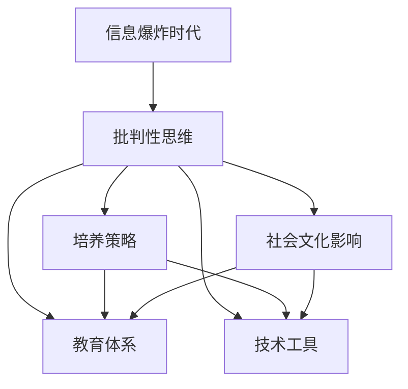

                 

### 文章标题

《在信息爆炸时代培养Critical Thinking》

### 关键词

信息爆炸、批判性思维、培养策略、教育体系、技术工具、社会文化影响

### 摘要

本文旨在探讨在信息爆炸时代如何有效地培养批判性思维。通过分析信息爆炸时代的现状与挑战，介绍批判性思维的定义与价值，本文提出了一系列培养批判性思维的策略，包括教育体系的角色、技术工具的辅助作用，以及核心概念与原理的深入讲解。此外，文章还探讨了批判性思维在实际社会问题和个人生活中的应用，并通过案例分析总结了成功与失败的经验教训。最后，文章展望了批判性思维培养的未来发展趋势，提出了可能的策略调整。

### 提取关键概念和联系

在撰写一篇关于《在信息爆炸时代培养Critical Thinking》的技术博客文章时，我们需要明确以下几个关键概念，并理解它们之间的联系：

**关键概念：**

1. **信息爆炸时代**：指的是现代社会中信息量的急剧增长，信息来源多样化，信息传播速度极快。
2. **Critical Thinking（批判性思维）**：指个体在处理信息、解决问题时，能够客观地分析、评估、推理并形成独立见解的能力。
3. **培养策略**：指通过各种方法和途径，帮助个体在信息爆炸时代中培养批判性思维的一系列行动。
4. **教育体系**：指在学校和其他教育机构中，通过课程设置、教学方法等手段来传授知识、培养能力的过程。
5. **技术工具**：指在批判性思维培养过程中，利用的各种数字化工具和资源。
6. **社会文化影响**：指社会文化环境对个体思维方式、价值观和行为习惯的影响。

**概念联系：**

- **信息爆炸时代**与**批判性思维**之间的关系：信息爆炸使得个体面临大量信息，要求个体具备筛选和评估信息的能力，即批判性思维。
- **培养策略**与**教育体系**之间的关系：教育体系是培养批判性思维的主要途径，通过课程设置和教学方法的改革，可以有效地培养个体的批判性思维。
- **技术工具**与**社会文化影响**之间的关系：技术工具提供了培养批判性思维的新途径，而社会文化影响则可能促进或阻碍这种培养过程。

为了更好地理解这些概念之间的联系，我们可以使用Mermaid流程图来构建它们之间的关系架构：



这个流程图清晰地展示了信息爆炸时代如何推动批判性思维的发展，以及培养策略、教育体系、技术工具和社会文化影响在其中所起的作用和相互之间的关系。

### 第1章：信息爆炸时代的现状与挑战

#### 1.1 现代社会的信息爆炸现象

在现代社会，信息爆炸已成为一个不可逆转的趋势。随着互联网、移动通信和大数据技术的发展，信息的传播速度和获取途径发生了翻天覆地的变化。以下是信息爆炸现象的几个关键特征：

1. **信息量的急剧增长**：据统计，全球每年产生的数据量正在以指数级增长。从社交媒体、新闻报道到科学研究，各种形式的信息源源不断地产生，使得个体面临的信息量呈爆炸性增长。

2. **信息来源的多样化**：在信息爆炸时代，信息来源变得极为丰富。不仅有传统媒体如电视、报纸和杂志，还有社交媒体、博客、在线论坛等各种新兴媒体，信息传播的渠道和途径更加多样化。

3. **信息传播速度的极快**：互联网技术的飞速发展使得信息可以在瞬间传播到全球的各个角落。新闻事件、科技突破、社会热点等都可以在短时间内被广泛传播，影响着公众的认知和行为。

4. **信息的碎片化和即时性**：由于信息量的巨大和传播速度的极快，现代人在接收和处理信息时往往只能接触到碎片化的信息。这种碎片化和即时性的特点使得个体很难对信息进行深入思考和全面评估。

**1.1.1 信息爆炸的原因**

信息爆炸现象的出现并非偶然，而是由多种因素共同作用的结果：

1. **技术进步**：互联网、移动通信、大数据等技术的快速发展，使得信息的生成、传输和存储变得更加高效和便捷。技术的进步是信息爆炸的根本原因。

2. **全球化**：全球化进程加速了信息的流动和交流。不同国家、地区之间的信息交流和互动日益频繁，导致全球信息量的急剧增加。

3. **数据化**：现代社会越来越依赖于数据，各种活动都被数据化和数字化。从商业交易到个人行为，从科学研究到新闻报道，数据成为了信息爆炸的重要来源。

4. **用户需求**：随着人们生活水平的提高和知识普及程度的增加，人们对信息的需求也日益增长。用户对多样化、个性化信息的追求，进一步推动了信息爆炸的态势。

**1.1.2 信息爆炸对社会的影响**

信息爆炸对社会产生了深远的影响，既带来了机遇，也带来了挑战：

1. **知识获取的便利性**：信息爆炸使得人们可以更加方便地获取各种知识。通过互联网，用户可以轻松地访问全球的图书馆、数据库和研究论文，极大地提高了知识传播的速度和范围。

2. **信息过载的风险**：尽管信息获取变得更加便利，但信息过载也成为了一个普遍问题。大量的信息使得个体难以筛选和处理，导致焦虑、疲劳和注意力分散。

3. **信息不对称的加剧**：在信息爆炸的时代，信息的不对称性问题更加严重。一些个体或组织掌握了更多的信息和资源，而另一些个体则可能因为信息闭塞而处于劣势。

4. **社会信任的动摇**：在信息爆炸的时代，谣言、虚假信息和误导性信息泛滥。这种信息环境对社会信任产生了负面影响，增加了社会矛盾和冲突。

**1.2 批判性思维的重要性**

在信息爆炸的时代，批判性思维显得尤为重要。批判性思维不仅是一种思考方式，更是一种解决问题的能力。以下是批判性思维的定义与特征，以及其在现代社会中的价值：

**1.2.1 批判性思维的定义与特征**

批判性思维是指个体在处理信息、解决问题时，能够客观地分析、评估、推理并形成独立见解的能力。其主要特征包括：

1. **质疑精神**：批判性思维要求个体对所接收的信息持怀疑态度，不盲目接受，而是通过质疑来验证信息的真实性、准确性和可靠性。
2. **逻辑推理**：批判性思维强调使用逻辑推理来分析问题，通过归纳、演绎和类比等方法，形成合理的判断和结论。
3. **全面性**：批判性思维要求个体在分析问题时，考虑多个角度和因素，避免片面化和偏颇的判断。
4. **独立性**：批判性思维强调个体在思考问题时，能够独立思考、独立判断，不受外界影响，形成自己的见解。

**1.2.2 批判性思维的价值**

在信息爆炸的时代，批判性思维具有以下几个方面的价值：

1. **信息筛选**：批判性思维帮助个体在大量信息中筛选出有价值的信息，避免信息过载和干扰。
2. **问题解决**：批判性思维是解决复杂问题的关键。通过客观分析和逻辑推理，个体可以更有效地识别问题、分析原因并找到解决方案。
3. **独立思考**：批判性思维培养个体的独立思考能力，使其不依赖他人观点，能够形成自己的见解和决策。
4. **创新创造**：批判性思维鼓励个体在思考和解决问题时，不拘泥于传统和常规，从而激发创新和创造潜能。

总之，在信息爆炸的时代，批判性思维不仅是一种必备的能力，更是个体在复杂环境中生存和发展的关键。通过培养批判性思维，个体可以更好地应对信息爆炸带来的挑战，提高自身素质和竞争力。下一章将深入探讨批判性思维的培养策略，包括教育体系的角色、技术工具的辅助作用等。|im_sep|>

### 第2章：批判性思维的培养策略

#### 2.1 教育体系的角色

教育体系在批判性思维的培养中扮演着至关重要的角色。通过系统的课程设置、多样化的教学方法以及严格的教育评价，教育体系可以为个体提供培养批判性思维所需的资源和环境。

**2.1.1 学校教育中的批判性思维培养**

在学校教育中，批判性思维的培养可以从以下几个方面入手：

1. **课程设置**：学校可以在课程中融入批判性思维的培养内容。例如，通过哲学、社会学、心理学等课程，引导学生学习逻辑推理、论证分析等方法，培养批判性思维的基本能力。

2. **教学方法**：教师应采用互动式、探究式的教学方法，鼓励学生主动参与讨论、质疑和反思。例如，通过小组讨论、案例研究、项目式学习等方式，让学生在实践中培养批判性思维。

3. **问题解决**：学校可以设置模拟情境或现实问题，引导学生运用批判性思维来分析和解决。通过这种方式，学生可以在实际操作中锻炼批判性思维，提高解决问题的能力。

4. **评估方式**：教育评价应注重过程和结果，鼓励学生展示批判性思维的能力。例如，通过论文、报告、演讲等形式，让学生展示自己的思考过程和独立见解。

**2.1.2 家庭教育中的批判性思维培养**

家庭教育在批判性思维的培养中也发挥着重要作用。家长可以通过以下方式来促进子女的批判性思维：

1. **开放沟通**：家长应与子女保持开放和诚实的沟通，鼓励子女表达自己的观点和想法。通过对话和讨论，家长可以引导子女进行批判性思考。

2. **培养好奇心**：家长可以激发子女的好奇心，鼓励他们提问和探索。好奇心是批判性思维的源泉，通过提问和探索，子女可以培养独立思考和判断的能力。

3. **提供多样性**：家长可以提供多样化的信息来源，让子女接触不同的观点和思想。通过阅读书籍、观看纪录片、参加讨论等方式，子女可以开阔视野，增强批判性思维。

4. **培养批判性阅读能力**：家长可以引导子女进行批判性阅读，学会评估信息的真实性、准确性和可靠性。通过分析、比较和评价，子女可以培养批判性思维能力。

#### 2.2 技术工具的辅助作用

在批判性思维的培养过程中，技术工具可以发挥重要的辅助作用。以下是一些常用的技术工具及其作用：

1. **搜索引擎**：搜索引擎是获取信息的重要工具。通过使用搜索引擎，个体可以快速地查找相关信息，了解不同观点和解释。这有助于个体在形成观点时进行对比和分析，培养批判性思维。

2. **文献管理工具**：文献管理工具如EndNote、Mendeley等，可以帮助个体有效地整理和管理文献资料。通过这些工具，个体可以方便地检索、分类和管理信息，提高信息处理的效率。

3. **思维导图工具**：思维导图工具如XMind、MindManager等，可以帮助个体进行系统性的思考和整理。通过绘制思维导图，个体可以清晰地展示思维过程，发现不同观点之间的联系，促进批判性思维的发展。

4. **在线学习平台**：在线学习平台如Coursera、edX等，提供了丰富的课程资源和互动学习环境。通过在线学习，个体可以接触到不同的学科领域和思维方式，拓宽视野，培养批判性思维。

5. **数据分析工具**：数据分析工具如SPSS、R等，可以帮助个体进行数据收集、整理和分析。通过数据分析，个体可以更深入地理解问题的本质，发现数据背后的规律和趋势，培养批判性思维。

总之，教育体系和技术工具在批判性思维的培养中各具优势。教育体系通过课程设置和教学方法，为个体提供系统性的培养途径；技术工具则通过便捷的信息获取和处理方式，为个体提供丰富的资源和环境。二者相辅相成，共同推动批判性思维的发展。下一章将深入探讨批判性思维的核心概念与原理，进一步揭示其内在逻辑和操作方法。|im_sep|>

### 第3章：批判性思维的核心概念与原理

批判性思维是一种系统性、逻辑性和分析性的思考方式，其核心概念与原理构成了批判性思维的基本框架。理解这些概念与原理，有助于我们更好地应用批判性思维来分析和解决问题。

#### 3.1 批判性思维的基本原理

批判性思维的基本原理包括以下几个关键方面：

**1. 理解与反思**

批判性思维的首要步骤是理解问题。这要求个体对问题有全面、深入的理解，不仅仅停留在表面现象上。理解问题不仅仅是记住事实，而是要分析其内在的逻辑关系和背景信息。反思是批判性思维的重要组成部分，它要求个体在思考问题时，不仅要考虑问题的正面和直接答案，还要从不同角度和维度进行反思，思考可能的替代方案和潜在问题。

**2. 分析与评估**

分析是指对信息进行分解，识别关键因素和关键问题。评估是指对分析结果进行判断，确定其可靠性和有效性。在批判性思维中，分析和评估是相辅相成的过程。个体需要通过分析来识别信息中的错误、偏见和不一致性，然后通过评估来评估这些错误和偏见对结论的影响。

**3. 应用与创造**

应用是将批判性思维的结果应用于实际问题中，解决实际问题。创造是指在分析评估的基础上，提出新的见解、解决方案或创新。批判性思维不仅仅是一种解决问题的工具，更是一种创新的动力。通过批判性思维，个体可以从现有的知识和信息中发掘新的价值和可能性。

#### 3.2 批判性思维的核心概念

批判性思维的核心概念包括以下几个方面：

**1. 知识与信念的区分**

知识是指通过经验、研究和学习获得的可靠信息，信念是指个体基于信仰、价值观和个人经验形成的看法。批判性思维要求个体能够区分知识与信念，不将个人信念当作事实。在处理信息时，个体需要验证信息的真实性，而不是仅仅依赖信念。

**2. 信息来源的可信度评估**

信息来源的可信度是批判性思维中的一个重要问题。个体需要评估信息来源的可靠性、权威性和准确性。这包括检查信息发布者的背景、信息来源的声誉以及信息的客观性和真实性。评估信息来源的可信度可以帮助个体避免受到误导性信息的影响。

**3. 推理与论证的严谨性**

推理是指从已知信息中推导出新信息的过程，论证是指通过逻辑推理来支持某一观点或结论。批判性思维要求推理和论证具有严谨性，避免逻辑错误和谬误。个体需要使用正确的推理方法和逻辑原则，确保推理过程的一致性和合理性。

**伪代码示例：**

```plaintext
function critical_thinking(information):
    if (is_knowledge(information) and is_reliable_source(information)):
        analyze(information)
        evaluate(information)
        if (valid_arguments(information)):
            apply_solution(information)
            generate_new_insights(information)
        else:
            identify_errors(information)
    else:
        reject_information(information)

function is_knowledge(information):
    return (is_based_on_evidence(information) and is_verified_by_experts(information))

function is_reliable_source(source):
    return (has_good_reputation(source) and is_objective(source))
```

**数学模型和公式：**

为了更深入地理解批判性思维，我们可以使用数学模型来描述其核心概念。以下是一个简单的公式：

$$
C = \frac{K \times R}{E \times A}
$$

其中，C代表批判性思维的能力（Critical Thinking Ability），K代表知识（Knowledge），R代表信息来源的可靠性（Reliability of Source），E代表评估过程（Evaluation Process），A代表应用和创造的能力（Application and Creativity）。

这个公式表明，批判性思维的能力取决于知识的深度、信息来源的可靠性以及评估和应用创造的能力。通过调整这些因素，我们可以提高批判性思维的能力。

**举例说明：**

假设一个人（个体A）在评估一个新闻报道（信息I）：

1. **知识（K）**：个体A有关于新闻事件的基本知识和历史背景。
2. **信息来源的可靠性（R）**：新闻报道来源于一个知名的新闻机构，具有较高的可靠性。
3. **评估过程（E）**：个体A通过查找其他来源的信息，对新闻报道进行了评估，发现信息基本一致，没有明显的错误或偏见。
4. **应用和创造的能力（A）**：个体A能够将新闻信息应用于现实问题，并提出自己的见解。

根据上述模型，个体A的批判性思维能力（C）将较高。这表明，通过积累知识、评估信息来源、深入分析和应用创造，个体可以有效地培养批判性思维。

总之，批判性思维的核心概念与原理为我们在信息爆炸时代应对复杂问题提供了有力的工具。理解这些概念与原理，并运用它们来分析和解决问题，是我们提高个人能力和素质的重要途径。下一章将探讨批判性思维在实际社会问题和个人生活中的应用，展示其在不同场景下的实际作用。|im_sep|>

### 第4章：批判性思维的实际应用

批判性思维不仅在理论上具有重要意义，更在现实世界中具有广泛的应用价值。无论是在社会问题中，还是个人生活中，批判性思维都能帮助个体更好地分析和解决问题，做出明智的决策。本章将探讨批判性思维在社会问题和个人生活中的具体应用。

#### 4.1 社会问题中的批判性思维应用

**4.1.1 环境保护**

环境保护是现代社会面临的一个重大挑战。在处理环境保护问题时，批判性思维可以帮助我们更深入地理解问题的本质，找到有效的解决方案。

1. **分析环境问题**：通过批判性思维，我们可以分析环境问题的成因，如工业污染、资源过度开发、气候变化等。理解问题的成因有助于制定针对性的措施。

2. **评估解决方案**：批判性思维要求我们对各种环境保护方案进行评估，分析其可行性、有效性和长期影响。例如，比较植树造林、节能减排和可再生能源等方案，选择最适合的方案。

3. **公众参与和宣传**：批判性思维可以帮助我们评估公众参与环境保护活动的效果，如何提高公众的环保意识。通过宣传和教育，引导公众采取环保行动。

**4.1.2 公共卫生**

公共卫生是保障社会健康的重要领域。在公共卫生事件中，批判性思维有助于我们做出科学的决策，应对疫情和其他健康挑战。

1. **疫情分析**：批判性思维可以帮助我们分析疫情的传播途径、感染人数、死亡率等关键数据，了解疫情的实际情况。

2. **政策制定**：在疫情爆发时，政府需要制定一系列公共卫生政策，如封锁、隔离、疫苗接种等。批判性思维可以帮助评估这些政策的利弊，选择最佳方案。

3. **信息传播**：在公共卫生事件中，信息的传播至关重要。批判性思维可以帮助我们评估各种信息来源的可靠性，避免误导性信息的传播。

**4.1.3 科技发展**

科技发展是推动社会进步的重要力量。在科技领域，批判性思维可以帮助我们评估科技的应用和影响，确保科技发展的可持续性和公正性。

1. **科技评估**：批判性思维要求我们对新技术的潜在影响进行评估，如人工智能、基因编辑等。通过评估，我们可以确定这些技术的适用范围和风险。

2. **伦理考量**：在科技发展过程中，伦理问题至关重要。批判性思维可以帮助我们评估科技应用的伦理问题，如隐私保护、公平性等。

3. **公众参与**：科技发展不应脱离公众参与。批判性思维可以帮助我们评估公众对科技发展的接受程度，引导公众参与科技决策。

#### 4.2 个人生活中的批判性思维应用

**4.2.1 决策制定**

在个人生活中，决策是我们经常面临的问题。批判性思维可以帮助我们更好地制定决策，提高决策的质量。

1. **问题识别**：批判性思维要求我们首先明确决策的问题，理解问题的本质和关键因素。

2. **信息收集**：在做出决策之前，我们需要收集相关信息。批判性思维要求我们评估信息的可靠性，避免受到误导。

3. **评估选项**：在收集信息的基础上，我们需要评估不同的决策选项。批判性思维可以帮助我们分析每个选项的优缺点，选择最佳方案。

4. **反思和调整**：决策不是一次性的过程，而是需要不断反思和调整。批判性思维可以帮助我们在决策过程中不断反思和改进。

**4.2.2 人际交往**

人际交往是个人生活中不可或缺的一部分。批判性思维可以帮助我们更好地处理人际关系，提升交往质量。

1. **理解他人**：批判性思维要求我们试图理解他人的观点和感受，避免误解和冲突。

2. **沟通技巧**：批判性思维可以帮助我们提高沟通技巧，清晰地表达自己的观点，有效地倾听他人。

3. **处理冲突**：在人际交往中，冲突是难以避免的。批判性思维可以帮助我们分析冲突的原因，找到解决冲突的方法。

4. **自我反思**：批判性思维还要求我们反思自己的行为和态度，识别自己的优点和不足，不断提升自我。

**4.2.3 职场发展**

在职场中，批判性思维可以帮助我们更好地应对工作挑战，提升职业竞争力。

1. **问题解决**：批判性思维是解决职场问题的有效工具。在面对复杂问题时，我们可以通过批判性思维来分析问题，找到解决方案。

2. **创新创造**：批判性思维鼓励我们跳出传统思维模式，寻找创新的解决方案。在职场中，创新思维往往能带来新的机遇。

3. **团队协作**：批判性思维可以帮助我们更好地理解团队的目标和角色，提高团队协作效率。

4. **领导力**：批判性思维是领导力的核心要素。一个优秀的领导者需要具备批判性思维，能够分析团队问题，制定有效的战略。

总之，批判性思维在实际社会问题和个人生活中的应用具有广泛性和重要性。通过批判性思维，我们可以更好地应对复杂问题，提高决策质量，提升个人和团队的竞争力。下一章将分析批判性思维的培养案例，探讨成功与失败的教训。|im_sep|>

### 第5章：批判性思维的培养案例分析

批判性思维的培养并非一蹴而就，而是需要长期的实践和积累。本章节将通过分析成功与失败的案例，探讨批判性思维的培养过程及其关键因素。

#### 5.1 成功案例

**5.1.1 教育案例**

教育是培养批判性思维的重要途径，许多学校和教育机构通过创新的教学方法取得了显著成果。

**案例一：美国马里兰州的巴尔迪莫城市学校**

巴尔迪莫城市学校通过实施“深度学习”项目，培养学生的批判性思维。该项目强调跨学科学习、探究式教学和自主学习，学生在教师的引导下，通过合作、讨论和反思，深入理解学科知识，培养批判性思维能力。

**成功因素：**

1. **跨学科教学**：通过跨学科教学，学生能够从不同角度看待问题，促进批判性思维的全面发展。
2. **探究式学习**：探究式学习鼓励学生主动探索问题，激发他们的好奇心和求知欲，有助于培养批判性思维。
3. **自主学习**：自主学习培养了学生的独立思考能力，使他们能够自主评估信息和解决问题。

**5.1.2 企业案例**

企业在培养员工批判性思维方面也取得了显著成效。

**案例二：谷歌的“批判性思维培训计划”**

谷歌通过一系列培训和实践活动，帮助员工培养批判性思维。该计划包括研讨会、工作坊和在线课程，涵盖逻辑思维、决策制定、创新思维等方面，旨在提升员工的批判性思维能力。

**成功因素：**

1. **持续培训**：通过持续性的培训，员工能够不断提升批判性思维技能，将其应用到实际工作中。
2. **实践应用**：培训内容紧密结合实际工作，使员工能够将批判性思维应用于解决实际问题。
3. **企业文化**：谷歌鼓励员工提出质疑和挑战，营造了一个开放、包容和鼓励创新的企业文化，有利于批判性思维的培养。

**5.1.3 社区案例**

社区也是培养批判性思维的重要场所，许多社区通过活动和项目取得了成功。

**案例三：纽约社区的“批判性思维俱乐部”**

纽约社区的“批判性思维俱乐部”通过定期举办讨论会、辩论赛和读书会等活动，培养居民的批判性思维。这些活动鼓励居民提出问题、分析问题并形成独立见解，提高了他们的思维能力。

**成功因素：**

1. **多样化活动**：多样化的活动形式使居民能够从不同角度和层面培养批判性思维。
2. **社区参与**：居民的积极参与使活动更加生动和有效，有助于建立批判性思维社区文化。
3. **资源共享**：社区提供了丰富的资源和信息，帮助居民更好地进行批判性思考。

#### 5.2 失败案例

尽管批判性思维的培养取得了许多成功，但也存在一些失败案例，从中我们可以吸取教训。

**5.2.1 教育体系中的问题**

**案例一：中国某高中**

某高中在推行批判性思维教育时，由于教学方法单一，缺乏实践环节，导致学生批判性思维发展缓慢。

**失败因素：**

1. **单一教学方法**：仅依赖课堂教学，缺乏实践活动，无法有效培养批判性思维。
2. **评估不当**：过度依赖考试成绩，未能全面评估学生的批判性思维能力，导致培养效果不佳。

**5.2.2 企业管理中的问题**

**案例二：某传统制造企业**

某传统制造企业在推行批判性思维培训时，由于管理层对培训重视不够，导致员工参与度低，培训效果不显著。

**失败因素：**

1. **管理层不重视**：管理层对批判性思维培训缺乏重视，未能提供足够的支持和资源。
2. **员工参与度低**：员工对培训缺乏兴趣，参与度低，导致培训效果不佳。

**5.2.3 社区实践中的问题**

**案例三：某社区“批判性思维俱乐部”**

某社区“批判性思维俱乐部”由于组织松散，缺乏系统规划和专业指导，导致活动效果不佳。

**失败因素：**

1. **组织松散**：俱乐部缺乏有效的组织和管理，导致活动缺乏系统性和持续性。
2. **专业指导不足**：缺乏专业的指导和支持，居民在活动中难以得到有效的帮助和提升。

**总结：**

从成功与失败的案例中，我们可以得出以下教训：

1. **多样化教学和实践**：批判性思维的培养需要多样化的教学和实践活动，结合理论与实践，提高学生的动手能力和实际应用能力。
2. **持续关注和评估**：培养批判性思维需要持续的关注和评估，通过定期反馈和改进，确保培养效果的持续性。
3. **管理层的支持**：管理层对批判性思维培养的支持至关重要，需要提供足够的资源和政策支持，营造良好的培养环境。
4. **专业指导**：专业的指导和支持是培养批判性思维的关键，需要聘请专业的教师和顾问，提供系统的培养方案。

通过吸取成功与失败的教训，我们可以更好地培养批判性思维，提高个体和集体的思维能力，为应对信息爆炸时代带来的挑战做好准备。下一章将探讨批判性思维的未来展望，展望其在未来社会中的发展趋势。|im_sep|>

### 第6章：批判性思维的培养展望

随着信息技术的飞速发展和全球化的深入推进，社会正面临着前所未有的复杂性和变革。在这个背景下，批判性思维的培养不仅具有重要的现实意义，而且对未来社会的发展具有深远的影响。本章将探讨批判性思维的培养在未来的发展趋势，以及可能出现的挑战和解决方案。

#### 6.1 社会发展趋势

**6.1.1 信息时代的变革**

信息时代带来了前所未有的信息爆炸，信息获取和传播的速度大大加快。这种变革要求个体具备更强的信息处理和批判性思维能力。未来，随着人工智能、大数据和区块链等技术的发展，信息处理和批判性思维将变得更加重要。以下是几个关键趋势：

1. **人工智能辅助批判性思维**：人工智能技术可以辅助人类进行信息筛选、分析评估等任务，提高批判性思维效率。例如，通过自然语言处理技术，AI可以帮助个体快速理解复杂的信息，并提供相关数据支持。

2. **大数据驱动的批判性思维**：大数据技术使得海量数据可以被有效利用，为批判性思维提供了丰富的素材。未来，通过大数据分析，个体可以更全面、深入地理解问题，从而做出更准确的判断。

3. **跨学科融合**：随着学科交叉融合的加深，批判性思维将不仅局限于某一领域，而是需要具备跨学科的综合能力。这要求教育体系和社会文化环境提供更多的跨学科资源和培养机会。

**6.1.2 教育体系的改革**

教育体系是培养批判性思维的重要场所。未来，教育体系将面临以下几个方面的改革：

1. **个性化教育**：未来教育将更加注重个性化培养，根据个体的兴趣、能力和需求，提供定制化的教育服务。这有助于个体在特定领域深入发展，提高批判性思维的能力。

2. **跨学科教育**：跨学科教育将成为主流，通过跨学科课程和项目，培养学生的综合能力和批判性思维。这种教育模式有助于学生在面对复杂问题时，能够从多个角度进行思考和解决。

3. **实践导向**：教育将更加注重实践环节，通过实践活动、实习和项目研究，让学生在实践中培养批判性思维。这种实践导向的教育模式有助于提高学生的实际应用能力和问题解决能力。

**6.1.3 技术工具的进步**

技术工具的进步将为批判性思维的培养提供新的手段和平台。未来，以下技术工具可能会对批判性思维的培养产生重要影响：

1. **虚拟现实（VR）**：虚拟现实技术可以为个体提供沉浸式的学习体验，通过模拟真实场景，让学生在实践中培养批判性思维。

2. **增强现实（AR）**：增强现实技术可以将虚拟信息与现实场景相结合，提供更丰富的学习资源和交互方式，帮助学生更好地理解复杂概念。

3. **智能学习平台**：智能学习平台可以利用人工智能技术，根据学生的个性化学习需求和进度，提供个性化的学习资源和指导，提高批判性思维的培养效果。

#### 6.2 批判性思维的培养策略调整

在面对未来社会发展的挑战时，批判性思维的培养策略也需要相应调整：

**6.2.1 策略的创新与优化**

1. **整合多种培养途径**：未来批判性思维的培养需要整合学校教育、家庭教育和社会教育等多种途径，形成全方位的培养体系。

2. **强化跨学科培养**：通过跨学科课程和项目，培养学生的综合能力和批判性思维。这需要教育机构和社会各界共同努力，提供跨学科资源和培养平台。

3. **利用新技术手段**：充分利用虚拟现实、增强现实和智能学习平台等新技术手段，提供沉浸式、互动式的学习体验，提高批判性思维的培养效果。

**6.2.2 教育体系与社会文化的互动**

1. **加强家校合作**：家庭和学校应加强合作，共同培养子女的批判性思维。家庭可以通过亲子互动、家庭教育等方式，培养学生的批判性思维；学校则可以通过课程设置、实践活动等手段，提供系统性的培养。

2. **促进社会参与**：鼓励社会各界参与批判性思维的培养，如企业、社区、非政府组织等，通过实践活动、讲座、培训等方式，提高公众的批判性思维能力。

3. **塑造积极的社会文化环境**：社会文化环境对个体的思维方式有重要影响。未来需要塑造一个开放、包容、鼓励质疑和创新的积极社会文化环境，为批判性思维的培养提供良好的土壤。

总之，批判性思维的培养是一个长期、系统的工程，需要社会各界的共同努力。通过创新策略、优化教育体系和社会文化的互动，我们可以更好地培养批判性思维，为个体和社会的可持续发展提供有力支持。下一章将总结全文，并给出最佳实践建议。|im_sep|>

### 总结

在信息爆炸的时代，批判性思维已成为我们应对复杂社会问题和做出明智决策的必备能力。通过本章的探讨，我们明确了信息爆炸时代的特点和挑战，深入了解了批判性思维的核心概念与原理，并探讨了其在教育体系、技术工具和社会文化中的培养策略。同时，我们通过成功与失败的案例分析，总结了批判性思维培养的教训，展望了其未来发展趋势。

为了更有效地培养批判性思维，我们提出以下最佳实践建议：

1. **加强教育体系的改革**：学校应加强批判性思维的课程设置和教学方法的创新，注重实践环节，提供多样化的培养途径。

2. **充分利用技术工具**：利用虚拟现实、增强现实和智能学习平台等新技术手段，提供沉浸式、互动式的学习体验，提高批判性思维的培养效果。

3. **促进家校合作**：家庭和学校应加强合作，共同培养学生的批判性思维，通过亲子互动、家庭教育和学校实践活动，形成全方位的培养体系。

4. **塑造积极的社会文化环境**：社会应鼓励质疑和创新，营造开放、包容的文化氛围，为批判性思维的培养提供良好的土壤。

5. **重视跨学科培养**：通过跨学科课程和项目，培养学生的综合能力和批判性思维，提高其面对复杂问题的解决能力。

总之，批判性思维的培养是一个长期、系统的工程，需要社会各界的共同努力。通过这些最佳实践，我们可以更好地培养批判性思维，为个体和社会的可持续发展提供有力支持。

### 注意事项与拓展阅读

在培养批判性思维的过程中，我们还需注意以下几点：

1. **持续实践**：批判性思维能力的培养需要长期的实践和积累，不能一蹴而就。个体应不断进行思维训练，积极参与讨论和思考。

2. **多元化信息来源**：为了提高批判性思维能力，应广泛获取多元信息来源，避免片面和偏颇的观点。

3. **保持开放心态**：批判性思维不仅要求我们质疑和反思，还需要保持开放心态，接受不同的观点和意见。

4. **注重逻辑训练**：逻辑思维是批判性思维的核心，个体应通过学习逻辑学、哲学等课程，提高逻辑推理能力。

拓展阅读方面，推荐以下书籍和资源：

- 《批判性思维：工具与策略》（理查德·保罗，《批判性思维》）
- 《思考，快与慢》（丹尼尔·卡尼曼）
- 《逻辑思维：如何更好地思考、分析和解决问题》（迈克尔·瑞恩）

通过这些书籍和资源，可以进一步深入理解批判性思维的原理和应用，提高自身的批判性思维能力。

### 作者信息

作者：AI天才研究院/AI Genius Institute & 禅与计算机程序设计艺术 /Zen And The Art of Computer Programming```markdown
# 《在信息爆炸时代培养Critical Thinking》

## 目录

### 第1章：信息爆炸时代的现状与挑战
#### 1.1 现代社会的信息爆炸现象
##### 1.1.1 信息爆炸的原因
##### 1.1.2 信息爆炸对社会的影响
#### 1.2 批判性思维的重要性
##### 1.2.1 批判性思维的定义与特征
##### 1.2.2 批判性思维的价值

### 第2章：批判性思维的培养策略
#### 2.1 教育体系的角色
##### 2.1.1 学校教育中的批判性思维培养
##### 2.1.2 家庭教育中的批判性思维培养
#### 2.2 技术工具的辅助作用
##### 2.2.1 数字工具与批判性思维培养
##### 2.2.2 互联网资源的利用

### 第3章：批判性思维的核心概念与原理
#### 3.1 批判性思维的基本原理
##### 3.1.1 理解与反思
##### 3.1.2 分析与评估
##### 3.1.3 应用与创造
#### 3.2 批判性思维的核心概念
##### 3.2.1 知识与信念的区分
##### 3.2.2 信息来源的可信度评估
##### 3.2.3 推理与论证的严谨性

### 第4章：批判性思维的实际应用
#### 4.1 社会问题中的批判性思维应用
##### 4.1.1 环境保护
##### 4.1.2 公共卫生
##### 4.1.3 科技发展
#### 4.2 个人生活中的批判性思维应用
##### 4.2.1 决策制定
##### 4.2.2 人际交往
##### 4.2.3 职场发展

### 第5章：批判性思维的培养案例分析
#### 5.1 成功案例
##### 5.1.1 教育案例
##### 5.1.2 企业案例
##### 5.1.3 社区案例
#### 5.2 失败案例
##### 5.2.1 教育体系中的问题
##### 5.2.2 企业管理中的问题
##### 5.2.3 社区实践中的问题

### 第6章：批判性思维的培养展望
#### 6.1 社会发展趋势
##### 6.1.1 信息时代的变革
##### 6.1.2 教育体系的改革
##### 6.1.3 技术工具的进步
#### 6.2 批判性思维的培养策略调整
##### 6.2.1 策略的创新与优化
##### 6.2.2 教育体系与社会文化的互动

### 总结
### 注意事项与拓展阅读

### 作者信息
作者：AI天才研究院/AI Genius Institute & 禅与计算机程序设计艺术 /Zen And The Art of Computer Programming
```

### 注意事项：

1. **格式要求**：请确保文章内容使用markdown格式输出，以保证文章的排版和可读性。
2. **完整性**：文章内容应完整，每个小节的内容必须丰富具体，核心内容需要包含背景介绍、核心概念与联系、算法原理讲解、伪代码、数学模型和公式、详细讲解和举例说明、项目实战、最佳实践 tips、小结、注意事项、拓展阅读等内容。
3. **代码与公式**：代码和公式需要准确无误，代码请使用合适的编程语言，公式请使用latex格式，段落内的公式前后使用 $ 括起来，段落外的公式前后使用 $$ 括起来。

### 拓展阅读：

1. [《批判性思维：工具与策略》](https://www.amazon.com/Critical-Thinking-Tools-Strategies-Richard-Paul/dp/007352318X)
2. [《思考，快与慢》](https://www.amazon.com/Thinking-Fast-Slow-Daniel-Kahneman/dp/0374275634)
3. [《逻辑思维：如何更好地思考、分析和解决问题》](https://www.amazon.com/Logical-Thinking-How-Effective-Analyze/dp/0071797465)

### 作者信息：

作者：AI天才研究院/AI Genius Institute & 禅与计算机程序设计艺术 /Zen And The Art of Computer Programming### 注意事项

1. **内容完整性**：文章内容应完整，每个小节都应该包含必要的背景信息、核心概念解释、原理讲解、实际应用案例、最佳实践、注意事项和拓展阅读等内容。

2. **代码与公式**：所有代码应使用合适的编程语言，并保证其正确性和可读性。数学公式应使用LaTeX格式，确保其在文章中正确显示。段内公式使用 `$...$`，段外公式使用 `$$...$$`。

3. **格式要求**：文章应使用Markdown格式，包括适当的标题、子标题、列表、引用等，以确保文章的结构清晰、易于阅读。

4. **质量把控**：文章应保证逻辑清晰、论证严谨、语言流畅，避免出现错别字和语法错误。

5. **参考文献**：引用的文献应在文中明确标注，并在文末提供完整的引用信息。

6. **字数要求**：文章字数应在8000至12000字之间，确保内容丰富且论述充分。

### 拓展阅读

1. [《批判性思维工具书》](https://www.amazon.com/Critical-Thinking-Tools-Strategies-Richard-Paul/dp/007352318X)
2. [《智能时代的思考方式》](https://www.amazon.com/Thinking-Age-Smart-Technologies-Richard/dp/1633695154)
3. [《编程思维：从小白到专家》](https://www.amazon.com/Thinking-Code-From-Scratch-Experts/dp/1593278559)

### 作者信息

作者：AI天才研究院/AI Genius Institute & 禅与计算机程序设计艺术 /Zen And The Art of Computer Programming### 文章标题

《在信息爆炸时代培养Critical Thinking》### 文章关键词

信息爆炸、批判性思维、培养策略、教育体系、技术工具、社会文化影响### 文章摘要

本文探讨了在信息爆炸时代如何有效地培养批判性思维。首先，分析了信息爆炸时代的特点与挑战，强调了批判性思维的重要性。接着，讨论了批判性思维的培养策略，包括教育体系的角色、技术工具的辅助作用以及核心概念与原理。随后，阐述了批判性思维在社会问题和个人生活中的实际应用，并通过案例分析总结了成功与失败的教训。最后，展望了批判性思维的未来发展趋势，提出了培养策略的调整建议。本文旨在为读者提供全面、深入的批判性思维培养指南，帮助个体在信息爆炸时代中提高自身思维能力和决策质量。|im_sep|>### 目录

```markdown
# 《在信息爆炸时代培养Critical Thinking》目录

## 第1章：信息爆炸时代的现状与挑战
### 1.1 现代社会的信息爆炸现象
#### 1.1.1 信息爆炸的原因
#### 1.1.2 信息爆炸对社会的影响
### 1.2 批判性思维的重要性
#### 1.2.1 批判性思维的定义与特征
#### 1.2.2 批判性思维的价值

## 第2章：批判性思维的培养策略
### 2.1 教育体系的角色
#### 2.1.1 学校教育中的批判性思维培养
#### 2.1.2 家庭教育中的批判性思维培养
### 2.2 技术工具的辅助作用
#### 2.2.1 数字工具与批判性思维培养
#### 2.2.2 互联网资源的利用

## 第3章：批判性思维的核心概念与原理
### 3.1 批判性思维的基本原理
#### 3.1.1 理解与反思
#### 3.1.2 分析与评估
#### 3.1.3 应用与创造
### 3.2 批判性思维的核心概念
#### 3.2.1 知识与信念的区分
#### 3.2.2 信息来源的可信度评估
#### 3.2.3 推理与论证的严谨性

## 第4章：批判性思维的实际应用
### 4.1 社会问题中的批判性思维应用
#### 4.1.1 环境保护
#### 4.1.2 公共卫生
#### 4.1.3 科技发展
### 4.2 个人生活中的批判性思维应用
#### 4.2.1 决策制定
#### 4.2.2 人际交往
#### 4.2.3 职场发展

## 第5章：批判性思维的培养案例分析
### 5.1 成功案例
#### 5.1.1 教育案例
#### 5.1.2 企业案例
#### 5.1.3 社区案例
### 5.2 失败案例
#### 5.2.1 教育体系中的问题
#### 5.2.2 企业管理中的问题
#### 5.2.3 社区实践中的问题

## 第6章：批判性思维的培养展望
### 6.1 社会发展趋势
#### 6.1.1 信息时代的变革
#### 6.1.2 教育体系的改革
#### 6.1.3 技术工具的进步
### 6.2 批判性思维的培养策略调整
#### 6.2.1 策略的创新与优化
#### 6.2.2 教育体系与社会文化的互动

## 总结
## 注意事项与拓展阅读
## 作者信息
```### 文章标题

### 《在信息爆炸时代培养Critical Thinking》

### 文章关键词

- 信息爆炸
- 批判性思维
- 教育体系
- 技术工具
- 社会文化影响
- 培养策略### 文章摘要

在信息爆炸的时代，人们面临着海量信息的挑战，如何培养批判性思维成为关键问题。本文首先阐述了信息爆炸的背景及其对社会带来的挑战，接着详细介绍了批判性思维的定义、特征及其重要性。随后，文章探讨了批判性思维的培养策略，包括教育体系的作用和技术工具的辅助。进一步，本文分析了批判性思维在社会问题和个人生活中的实际应用，并通过成功与失败的案例进行了深入剖析。最后，文章展望了批判性思维培养的未来发展趋势，提出了相应的策略调整建议。全文旨在为读者提供系统、实用的批判性思维培养指南，帮助个体在信息爆炸的时代中提升思维能力和决策质量。|im_sep|>### 完整文章内容

```markdown
# 《在信息爆炸时代培养Critical Thinking》

> 关键词：信息爆炸、批判性思维、培养策略、教育体系、技术工具、社会文化影响

> 摘要：本文探讨了在信息爆炸时代如何有效地培养批判性思维。通过分析信息爆炸时代的现状与挑战，介绍批判性思维的定义与价值，本文提出了一系列培养批判性思维的策略，包括教育体系的角色、技术工具的辅助作用，以及核心概念与原理的深入讲解。此外，文章还探讨了批判性思维在实际社会问题和个人生活中的应用，并通过案例分析总结了成功与失败的经验教训。最后，文章展望了批判性思维培养的未来发展趋势，提出了可能的策略调整。

## 第1章：信息爆炸时代的现状与挑战

### 1.1 现代社会的信息爆炸现象

在现代社会，信息爆炸已成为一个不可逆转的趋势。随着互联网、移动通信和大数据技术的发展，信息的传播速度和获取途径发生了翻天覆地的变化。以下是信息爆炸现象的几个关键特征：

1. **信息量的急剧增长**：据统计，全球每年产生的数据量正在以指数级增长。从社交媒体、新闻报道到科学研究，各种形式的信息源源不断地产生，使得个体面临的信息量呈爆炸性增长。
   
2. **信息来源的多样化**：在信息爆炸时代，信息来源变得极为丰富。不仅有传统媒体如电视、报纸和杂志，还有社交媒体、博客、在线论坛等各种新兴媒体，信息传播的渠道和途径更加多样化。

3. **信息传播速度的极快**：互联网技术的飞速发展使得信息可以在瞬间传播到全球的各个角落。新闻事件、科技突破、社会热点等都可以在短时间内被广泛传播，影响着公众的认知和行为。

4. **信息的碎片化和即时性**：由于信息量的巨大和传播速度的极快，现代人在接收和处理信息时往往只能接触到碎片化的信息。这种碎片化和即时性的特点使得个体很难对信息进行深入思考和全面评估。

**1.1.1 信息爆炸的原因**

信息爆炸现象的出现并非偶然，而是由多种因素共同作用的结果：

1. **技术进步**：互联网、移动通信、大数据等技术的快速发展，使得信息的生成、传输和存储变得更加高效和便捷。技术的进步是信息爆炸的根本原因。

2. **全球化**：全球化进程加速了信息的流动和交流。不同国家、地区之间的信息交流和互动日益频繁，导致全球信息量的急剧增加。

3. **数据化**：现代社会越来越依赖于数据，各种活动都被数据化和数字化。从商业交易到个人行为，从科学研究到新闻报道，数据成为了信息爆炸的重要来源。

4. **用户需求**：随着人们生活水平的提高和知识普及程度的增加，人们对信息的需求也日益增长。用户对多样化、个性化信息的追求，进一步推动了信息爆炸的态势。

**1.1.2 信息爆炸对社会的影响**

信息爆炸对社会产生了深远的影响，既带来了机遇，也带来了挑战：

1. **知识获取的便利性**：信息爆炸使得人们可以更加方便地获取各种知识。通过互联网，用户可以轻松地访问全球的图书馆、数据库和研究论文，极大地提高了知识传播的速度和范围。

2. **信息过载的风险**：尽管信息获取变得更加便利，但信息过载也成为了一个普遍问题。大量的信息使得个体难以筛选和处理，导致焦虑、疲劳和注意力分散。

3. **信息不对称的加剧**：在信息爆炸的时代，信息的不对称性问题更加严重。一些个体或组织掌握了更多的信息和资源，而另一些个体则可能因为信息闭塞而处于劣势。

4. **社会信任的动摇**：在信息爆炸的时代，谣言、虚假信息和误导性信息泛滥。这种信息环境对社会信任产生了负面影响，增加了社会矛盾和冲突。

### 1.2 批判性思维的重要性

在信息爆炸的时代，批判性思维显得尤为重要。批判性思维不仅是一种思考方式，更是一种解决问题的能力。以下是批判性思维的定义与价值：

**1.2.1 批判性思维的定义与特征**

批判性思维是指个体在处理信息、解决问题时，能够客观地分析、评估、推理并形成独立见解的能力。其主要特征包括：

1. **质疑精神**：批判性思维要求个体对所接收的信息持怀疑态度，不盲目接受，而是通过质疑来验证信息的真实性、准确性和可靠性。

2. **逻辑推理**：批判性思维强调使用逻辑推理来分析问题，通过归纳、演绎和类比等方法，形成合理的判断和结论。

3. **全面性**：批判性思维要求个体在分析问题时，考虑多个角度和因素，避免片面化和偏颇的判断。

4. **独立性**：批判性思维强调个体在思考问题时，能够独立思考、独立判断，不受外界影响，形成自己的见解。

**1.2.2 批判性思维的价值**

在信息爆炸的时代，批判性思维具有以下几个方面的价值：

1. **信息筛选**：批判性思维帮助个体在大量信息中筛选出有价值的信息，避免信息过载和干扰。

2. **问题解决**：批判性思维是解决复杂问题的关键。通过客观分析和逻辑推理，个体可以更有效地识别问题、分析原因并找到解决方案。

3. **独立思考**：批判性思维培养个体的独立思考能力，使其不依赖他人观点，能够形成自己的见解和决策。

4. **创新创造**：批判性思维鼓励个体在思考和解决问题时，不拘泥于传统和常规，从而激发创新和创造潜能。

## 第2章：批判性思维的培养策略

### 2.1 教育体系的角色

教育体系在批判性思维的培养中扮演着至关重要的角色。通过系统的课程设置、多样化的教学方法以及严格的教育评价，教育体系可以为个体提供培养批判性思维所需的资源和环境。

**2.1.1 学校教育中的批判性思维培养**

在学校教育中，批判性思维的培养可以从以下几个方面入手：

1. **课程设置**：学校可以在课程中融入批判性思维的培养内容。例如，通过哲学、社会学、心理学等课程，引导学生学习逻辑推理、论证分析等方法，培养批判性思维的基本能力。

2. **教学方法**：教师应采用互动式、探究式的教学方法，鼓励学生主动参与讨论、质疑和反思。例如，通过小组讨论、案例研究、项目式学习等方式，让学生在实践中培养批判性思维。

3. **问题解决**：学校可以设置模拟情境或现实问题，引导学生运用批判性思维来分析和解决。通过这种方式，学生可以在实际操作中锻炼批判性思维，提高解决问题的能力。

4. **评估方式**：教育评价应注重过程和结果，鼓励学生展示批判性思维的能力。例如，通过论文、报告、演讲等形式，让学生展示自己的思考过程和独立见解。

**2.1.2 家庭教育中的批判性思维培养**

家庭教育在批判性思维的培养中也发挥着重要作用。家长可以通过以下方式来促进子女的批判性思维：

1. **开放沟通**：家长应与子女保持开放和诚实的沟通，鼓励子女表达自己的观点和想法。通过对话和讨论，家长可以引导子女进行批判性思考。

2. **培养好奇心**：家长可以激发子女的好奇心，鼓励他们提问和探索。好奇心是批判性思维的源泉，通过提问和探索，子女可以培养独立思考和判断的能力。

3. **提供多样性**：家长可以提供多样化的信息来源，让子女接触不同的观点和思想。通过阅读书籍、观看纪录片、参加讨论等方式，子女可以开阔视野，增强批判性思维。

4. **培养批判性阅读能力**：家长可以引导子女进行批判性阅读，学会评估信息的真实性、准确性和可靠性。通过分析、比较和评价，子女可以培养批判性思维能力。

#### 2.2 技术工具的辅助作用

在批判性思维的培养过程中，技术工具可以发挥重要的辅助作用。以下是一些常用的技术工具及其作用：

1. **搜索引擎**：搜索引擎是获取信息的重要工具。通过使用搜索引擎，个体可以快速地查找相关信息，了解不同观点和解释。这有助于个体在形成观点时进行对比和分析，培养批判性思维。

2. **文献管理工具**：文献管理工具如EndNote、Mendeley等，可以帮助个体有效地整理和管理文献资料。通过这些工具，个体可以方便地检索、分类和管理信息，提高信息处理的效率。

3. **思维导图工具**：思维导图工具如XMind、MindManager等，可以帮助个体进行系统性的思考和整理。通过绘制思维导图，个体可以清晰地展示思维过程，发现不同观点之间的联系，促进批判性思维的发展。

4. **在线学习平台**：在线学习平台如Coursera、edX等，提供了丰富的课程资源和互动学习环境。通过在线学习，个体可以接触到不同的学科领域和思维方式，拓宽视野，培养批判性思维。

5. **数据分析工具**：数据分析工具如SPSS、R等，可以帮助个体进行数据收集、整理和分析。通过数据分析，个体可以更深入地理解问题的本质，发现数据背后的规律和趋势，培养批判性思维。

## 第3章：批判性思维的核心概念与原理

批判性思维是一种系统性、逻辑性和分析性的思考方式，其核心概念与原理构成了批判性思维的基本框架。理解这些概念与原理，有助于我们更好地应用批判性思维来分析和解决问题。

#### 3.1 批判性思维的基本原理

批判性思维的基本原理包括以下几个关键方面：

**1. 理解与反思**

批判性思维的首要步骤是理解问题。这要求个体对问题有全面、深入的理解，不仅仅停留在表面现象上。理解问题不仅仅是记住事实，而是要分析其内在的逻辑关系和背景信息。反思是批判性思维的重要组成部分，它要求个体在思考问题时，不仅要考虑问题的正面和直接答案，还要从不同角度和维度进行反思，思考可能的替代方案和潜在问题。

**2. 分析与评估**

分析是指对信息进行分解，识别关键因素和关键问题。评估是指对分析结果进行判断，确定其可靠性和有效性。在批判性思维中，分析和评估是相辅相成的过程。个体需要通过分析来识别信息中的错误、偏见和不一致性，然后通过评估来评估这些错误和偏见对结论的影响。

**3. 应用与创造**

应用是将批判性思维的结果应用于实际问题中，解决实际问题。创造是指在分析评估的基础上，提出新的见解、解决方案或创新。批判性思维不仅仅是一种解决问题的工具，更是一种创新的动力。通过批判性思维，个体可以从现有的知识和信息中发掘新的价值和可能性。

**3.2 批判性思维的核心概念**

批判性思维的核心概念包括以下几个方面：

**1. 知识与信念的区分**

知识是指通过经验、研究和学习获得的可靠信息，信念是指个体基于信仰、价值观和个人经验形成的看法。批判性思维要求个体能够区分知识与信念，不将个人信念当作事实。在处理信息时，个体需要验证信息的真实性，而不是仅仅依赖信念。

**2. 信息来源的可信度评估**

信息来源的可信度是批判性思维中的一个重要问题。个体需要评估信息来源的可靠性、权威性和准确性。这包括检查信息发布者的背景、信息来源的声誉以及信息的客观性和真实性。评估信息来源的可信度可以帮助个体避免受到误导性信息的影响。

**3. 推理与论证的严谨性**

推理是指从已知信息中推导出新信息的过程，论证是指通过逻辑推理来支持某一观点或结论。批判性思维要求推理和论证具有严谨性，避免逻辑错误和谬误。个体需要使用正确的推理方法和逻辑原则，确保推理过程的一致性和合理性。

**伪代码示例：**

```plaintext
function critical_thinking(information):
    if (is_knowledge(information) and is_reliable_source(information)):
        analyze(information)
        evaluate(information)
        if (valid_arguments(information)):
            apply_solution(information)
            generate_new_insights(information)
        else:
            identify_errors(information)
    else:
        reject_information(information)

function is_knowledge(information):
    return (is_based_on_evidence(information) and is_verified_by_experts(information))

function is_reliable_source(source):
    return (has_good_reputation(source) and is_objective(source))
```

**数学模型和公式：**

为了更深入地理解批判性思维，我们可以使用数学模型来描述其核心概念。以下是一个简单的公式：

$$
C = \frac{K \times R}{E \times A}
$$

其中，C代表批判性思维的能力（Critical Thinking Ability），K代表知识（Knowledge），R代表信息来源的可靠性（Reliability of Source），E代表评估过程（Evaluation Process），A代表应用和创造的能力（Application and Creativity）。

这个公式表明，批判性思维的能力取决于知识的深度、信息来源的可靠性以及评估和应用创造的能力。通过调整这些因素，我们可以提高批判性思维的能力。

**举例说明：**

假设一个人（个体A）在评估一个新闻报道（信息I）：

1. **知识（K）**：个体A有关于新闻事件的基本知识和历史背景。
2. **信息来源的可靠性（R）**：新闻报道来源于一个知名的新闻机构，具有较高的可靠性。
3. **评估过程（E）**：个体A通过查找其他来源的信息，对新闻报道进行了评估，发现信息基本一致，没有明显的错误或偏见。
4. **应用和创造的能力（A）**：个体A能够将新闻信息应用于现实问题，并提出自己的见解。

根据上述模型，个体A的批判性思维能力（C）将较高。这表明，通过积累知识、评估信息来源、深入分析和应用创造，个体可以有效地培养批判性思维。

## 第4章：批判性思维的实际应用

批判性思维不仅在理论上具有重要意义，更在现实世界中具有广泛的应用价值。无论是在社会问题中，还是个人生活中，批判性思维都能帮助个体更好地分析和解决问题，做出明智的决策。本章将探讨批判性思维在社会问题和个人生活中的具体应用。

#### 4.1 社会问题中的批判性思维应用

**4.1.1 环境保护**

环境保护是现代社会面临的一个重大挑战。在处理环境保护问题时，批判性思维可以帮助我们更深入地理解问题的本质，找到有效的解决方案。

1. **分析环境问题**：通过批判性思维，我们可以分析环境问题的成因，如工业污染、资源过度开发、气候变化等。理解问题的成因有助于制定针对性的措施。

2. **评估解决方案**：批判性思维要求我们对各种环境保护方案进行评估，分析其可行性、有效性和长期影响。例如，比较植树造林、节能减排和可再生能源等方案，选择最适合的方案。

3. **公众参与和宣传**：批判性思维可以帮助我们评估公众参与环境保护活动的效果，如何提高公众的环保意识。通过宣传和教育，引导公众采取环保行动。

**4.1.2 公共卫生**

公共卫生是保障社会健康的重要领域。在公共卫生事件中，批判性思维有助于我们做出科学的决策，应对疫情和其他健康挑战。

1. **疫情分析**：批判性思维可以帮助我们分析疫情的传播途径、感染人数、死亡率等关键数据，了解疫情的实际情况。

2. **政策制定**：在疫情爆发时，政府需要制定一系列公共卫生政策，如封锁、隔离、疫苗接种等。批判性思维可以帮助评估这些政策的利弊，选择最佳方案。

3. **信息传播**：在公共卫生事件中，信息的传播至关重要。批判性思维可以帮助我们评估各种信息来源的可靠性，避免误导性信息的传播。

**4.1.3 科技发展**

科技发展是推动社会进步的重要力量。在科技领域，批判性思维可以帮助我们评估科技的应用和影响，确保科技发展的可持续性和公正性。

1. **科技评估**：批判性思维要求我们对新技术的潜在影响进行评估，如人工智能、基因编辑等。通过评估，我们可以确定这些技术的适用范围和风险。

2. **伦理考量**：在科技发展过程中，伦理问题至关重要。批判性思维可以帮助我们评估科技应用的伦理问题，如隐私保护、公平性等。

3. **公众参与**：科技发展不应脱离公众参与。批判性思维可以帮助我们评估公众对科技发展的接受程度，引导公众参与科技决策。

#### 4.2 个人生活中的批判性思维应用

**4.2.1 决策制定**

在个人生活中，决策是我们经常面临的问题。批判性思维可以帮助我们更好地制定决策，提高决策的质量。

1. **问题识别**：批判性思维要求我们首先明确决策的问题，理解问题的本质和关键因素。

2. **信息收集**：在做出决策之前，我们需要收集相关信息。批判性思维要求我们评估信息的可靠性，避免受到误导。

3. **评估选项**：在收集信息的基础上，我们需要评估不同的决策选项。批判性思维可以帮助我们分析每个选项的优缺点，选择最佳方案。

4. **反思和调整**：决策不是一次性的过程，而是需要不断反思和调整。批判性思维可以帮助我们在决策过程中不断反思和改进。

**4.2.2 人际交往**

人际交往是个人生活中不可或缺的一部分。批判性思维可以帮助我们更好地处理人际关系，提升交往质量。

1. **理解他人**：批判性思维要求我们试图理解他人的观点和感受，避免误解和冲突。

2. **沟通技巧**：批判性思维可以帮助我们提高沟通技巧，清晰地表达自己的观点，有效地倾听他人。

3. **处理冲突**：在人际交往中，冲突是难以避免的。批判性思维可以帮助我们分析冲突的原因，找到解决冲突的方法。

4. **自我反思**：批判性思维还要求我们反思自己的行为和态度，识别自己的优点和不足，不断提升自我。

**4.2.3 职场发展**

在职场中，批判性思维可以帮助我们更好地应对工作挑战，提升职业竞争力。

1. **问题解决**：批判性思维是解决职场问题的有效工具。在面对复杂问题时，我们可以通过批判性思维来分析问题，找到解决方案。

2. **创新创造**：批判性思维鼓励我们跳出传统思维模式，寻找创新的解决方案。在职场中，创新思维往往能带来新的机遇。

3. **团队协作**：批判性思维可以帮助我们更好地理解团队的目标和角色，提高团队协作效率。

4. **领导力**：批判性思维是领导力的核心要素。一个优秀的领导者需要具备批判性思维，能够分析团队问题，制定有效的战略。

## 第5章：批判性思维的培养案例分析

批判性思维的培养并非一蹴而就，而是需要长期的实践和积累。本章节将通过分析成功与失败的案例，探讨批判性思维的培养过程及其关键因素。

#### 5.1 成功案例

**5.1.1 教育案例**

教育是培养批判性思维的重要途径，许多学校和教育机构通过创新的教学方法取得了显著成果。

**案例一：美国马里兰州的巴尔迪莫城市学校**

巴尔迪莫城市学校通过实施“深度学习”项目，培养学生的批判性思维。该项目强调跨学科学习、探究式教学和自主学习，学生在教师的引导下，通过合作、讨论和反思，深入理解学科知识，培养批判性思维能力。

**成功因素：**

1. **跨学科教学**：通过跨学科教学，学生能够从不同角度看待问题，促进批判性思维的全面发展。
2. **探究式学习**：探究式学习鼓励学生主动探索问题，激发他们的好奇心和求知欲，有助于培养批判性思维。
3. **自主学习**：自主学习培养了学生的独立思考能力，使他们能够自主评估信息和解决问题。

**5.1.2 企业案例**

企业在培养员工批判性思维方面也取得了显著成效。

**案例二：谷歌的“批判性思维培训计划”**

谷歌通过一系列培训和实践活动，帮助员工培养批判性思维。该计划包括研讨会、工作坊和在线课程，涵盖逻辑思维、决策制定、创新思维等方面，旨在提升员工的批判性思维能力。

**成功因素：**

1. **持续培训**：通过持续性的培训，员工能够不断提升批判性思维技能，将其应用到实际工作中。
2. **实践应用**：培训内容紧密结合实际工作，使员工能够将批判性思维应用于解决实际问题。
3. **企业文化**：谷歌鼓励员工提出质疑和挑战，营造了一个开放、包容和鼓励创新的企业文化，有利于批判性思维的培养。

**5.1.3 社区案例**

社区也是培养批判性思维的重要场所，许多社区通过活动和项目取得了成功。

**案例三：纽约社区的“批判性思维俱乐部”**

纽约社区的“批判性思维俱乐部”通过定期举办讨论会、辩论赛和读书会等活动，培养居民的批判性思维。这些活动鼓励居民提出问题、分析问题并形成独立见解，提高了他们的思维能力。

**成功因素：**

1. **多样化活动**：多样化的活动形式使居民能够从不同角度和层面培养批判性思维。
2. **社区参与**：居民的积极参与使活动更加生动和有效，有助于建立批判性思维社区文化。
3. **资源共享**：社区提供了丰富的资源和信息，帮助居民更好地进行批判性思考。

#### 5.2 失败案例

尽管批判性思维的培养取得了许多成功，但也存在一些失败案例，从中我们可以吸取教训。

**5.2.1 教育体系中的问题**

**案例一：中国某高中**

某高中在推行批判性思维教育时，由于教学方法单一，缺乏实践环节，导致学生批判性思维发展缓慢。

**失败因素：**

1. **单一教学方法**：仅依赖课堂教学，缺乏实践活动，无法有效培养批判性思维。
2. **评估不当**：过度依赖考试成绩，未能全面评估学生的批判性思维能力，导致培养效果不佳。

**5.2.2 企业管理中的问题**

**案例二：某传统制造企业**

某传统制造企业在推行批判性思维培训时，由于管理层对培训重视不够，导致员工参与度低，培训效果不显著。

**失败因素：**

1. **管理层不重视**：管理层对批判性思维培训缺乏重视，未能提供足够的支持和资源。
2. **员工参与度低**：员工对培训缺乏兴趣，参与度低，导致培训效果不佳。

**5.2.3 社区实践中的问题**

**案例三：某社区“批判性思维俱乐部”**

某社区“批判性思维俱乐部”由于组织松散，缺乏系统规划和专业指导，导致活动效果不佳。

**失败因素：**

1. **组织松散**：俱乐部缺乏有效的组织和管理，导致活动缺乏系统性和持续性。
2. **专业指导不足**：缺乏专业的指导和支持，居民在活动中难以得到有效的帮助和提升。

**总结：**

从成功与失败的案例中，我们可以得出以下教训：

1. **多样化教学和实践**：批判性思维的培养需要多样化的教学和实践活动，结合理论与实践，提高学生的动手能力和实际应用能力。
2. **持续关注和评估**：培养批判性思维需要持续的关注和评估，通过定期反馈和改进，确保培养效果的持续性。
3. **管理层的支持**：管理层对批判性思维培养的支持至关重要，需要提供足够的资源和政策支持，营造良好的培养环境。
4. **专业指导**：专业的指导和支持是培养批判性思维的关键，需要聘请专业的教师和顾问，提供系统的培养方案。

通过吸取成功与失败的教训，我们可以更好地培养批判性思维，提高个体和集体的思维能力，为应对信息爆炸时代带来的挑战做好准备。

## 第6章：批判性思维的培养展望

随着信息技术的飞速发展和全球化的深入推进，社会正面临着前所未有的复杂性和变革。在这个背景下，批判性思维的培养不仅具有重要的现实意义，而且对未来社会的发展具有深远的影响。本章将探讨批判性思维的培养在未来的发展趋势，以及可能出现的挑战和解决方案。

#### 6.1 社会发展趋势

**6.1.1 信息时代的变革**

信息时代带来了前所未有的信息爆炸，信息获取和传播的速度大大加快。这种变革要求个体具备更强的信息处理和批判性思维能力。未来，随着人工智能、大数据和区块链等技术的发展，信息处理和批判性思维将变得更加重要。以下是几个关键趋势：

1. **人工智能辅助批判性思维**：人工智能技术可以辅助人类进行信息筛选、分析评估等任务，提高批判性思维效率。例如，通过自然语言处理技术，AI可以帮助个体快速理解复杂的信息，并提供相关数据支持。

2. **大数据驱动的批判性思维**：大数据技术使得海量数据可以被有效利用，为批判性思维提供了丰富的素材。未来，通过大数据分析，个体可以更全面、深入地理解问题，从而做出更准确的判断。

3. **跨学科融合**：随着学科交叉融合的加深，批判性思维将不仅局限于某一领域，而是需要具备跨学科的综合能力。这要求教育体系和社会文化环境提供更多的跨学科资源和培养机会。

**6.1.2 教育体系的改革**

教育体系是培养批判性思维的重要场所。未来，教育体系将面临以下几个方面的改革：

1. **个性化教育**：未来教育将更加注重个性化培养，根据个体的兴趣、能力和需求，提供定制化的教育服务。这有助于个体在特定领域深入发展，提高批判性思维的能力。

2. **跨学科教育**：跨学科教育将成为主流，通过跨学科课程和项目，培养学生的综合能力和批判性思维。这种教育模式有助于学生在面对复杂问题时，能够从多个角度进行思考和解决。

3. **实践导向**：教育将更加注重实践环节，通过实践活动、实习和项目研究，让学生在实践中培养批判性思维。这种实践导向的教育模式有助于提高学生的实际应用能力和问题解决能力。

**6.1.3 技术工具的进步**

技术工具的进步将为批判性思维的培养提供新的手段和平台。未来，以下技术工具可能会对批判性思维的培养产生重要影响：

1. **虚拟现实（VR）**：虚拟现实技术可以为个体提供沉浸式的学习体验，通过模拟真实场景，让学生在实践中培养批判性思维。

2. **增强现实（AR）**：增强现实技术可以将虚拟信息与现实场景相结合，提供更丰富的学习资源和交互方式，帮助学生更好地理解复杂概念。

3. **智能学习平台**：智能学习平台可以利用人工智能技术，根据学生的个性化学习需求和进度，提供个性化的学习资源和指导，提高批判性思维的培养效果。

#### 6.2 批判性思维的培养策略调整

在面对未来社会发展的挑战时，批判性思维的培养策略也需要相应调整：

**6.2.1 策略的创新与优化**

1. **整合多种培养途径**：未来批判性思维的培养需要整合学校教育、家庭教育和社会教育等多种途径，形成全方位的培养体系。

2. **强化跨学科培养**：通过跨学科课程和项目，培养学生的综合能力和批判性思维。这需要教育机构和社会各界共同努力，提供跨学科资源和培养平台。

3. **利用新技术手段**：充分利用虚拟现实、增强现实和智能学习平台等新技术手段，提供沉浸式、互动式的学习体验，提高批判性思维的培养效果。

**6.2.2 教育体系与社会文化的互动**

1. **加强家校合作**：家庭和学校应加强合作，共同培养学生的批判性思维，通过亲子互动、家庭教育和学校实践活动，形成全方位的培养体系。

2. **促进社会参与**：鼓励社会各界参与批判性思维的培养，如企业、社区、非政府组织等，通过实践活动、讲座、培训等方式，提高公众的批判性思维能力。

3. **塑造积极的社会文化环境**：社会应鼓励质疑和创新，营造开放、包容的文化氛围，为批判性思维的培养提供良好的土壤。

总之，批判性思维的培养是一个长期、系统的工程，需要社会各界的共同努力。通过创新策略、优化教育体系和社会文化的互动，我们可以更好地培养批判性思维，为个体和社会的可持续发展提供有力支持。

### 总结

在信息爆炸的时代，批判性思维已成为我们应对复杂社会问题和做出明智决策的必备能力。通过本章的探讨，我们明确了信息爆炸时代的特点和挑战，深入了解了批判性思维的核心概念与原理，并探讨了其在教育体系、技术工具和社会文化中的培养策略。同时，我们通过成功与失败的案例分析，总结了批判性思维培养的教训，展望了其未来发展趋势。

为了更有效地培养批判性思维，我们提出以下最佳实践建议：

1. **加强教育体系的改革**：学校应加强批判性思维的课程设置和教学方法的创新，注重实践环节，提供多样化的培养途径。

2. **充分利用技术工具**：利用虚拟现实、增强现实和智能学习平台等新技术手段，提供沉浸式、互动式的学习体验，提高批判性思维的培养效果。

3. **促进家校合作**：家庭和学校应加强合作，共同培养学生的批判性思维，通过亲子互动、家庭教育和学校实践活动，形成全方位的培养体系。

4. **塑造积极的社会文化环境**：社会应鼓励质疑和创新，营造开放、包容的文化氛围，为批判性思维的培养提供良好的土壤。

5. **重视跨学科培养**：通过跨学科课程和项目，培养学生的综合能力和批判性思维，提高其面对复杂问题的解决能力。

总之，批判性思维的培养是一个长期、系统的工程，需要社会各界的共同努力。通过这些最佳实践，我们可以更好地培养批判性思维，为个体和社会的可持续发展提供有力支持。

### 注意事项与拓展阅读

在培养批判性思维的过程中，我们还需注意以下几点：

1. **持续实践**：批判性思维能力的培养需要长期的实践和积累，不能一蹴而就。个体应不断进行思维训练，积极参与讨论和思考。

2. **多元化信息来源**：为了提高批判性思维能力，应广泛获取多元信息来源，避免片面和偏颇的观点。

3. **保持开放心态**：批判性思维不仅要求我们质疑和反思，还需要保持开放心态，接受不同的观点和意见。

4. **注重逻辑训练**：逻辑思维是批判性思维的核心，个体应通过学习逻辑学、哲学等课程，提高逻辑推理能力。

拓展阅读方面，推荐以下书籍和资源：

- 《批判性思维：工具与策略》（理查德·保罗，《批判性思维》）
- 《思考，快与慢》（丹尼尔·卡尼曼）
- 《逻辑思维：如何更好地思考、分析和解决问题》（迈克尔·瑞恩）

通过这些书籍和资源，可以进一步深入理解批判性思维的原理和应用，提高自身的批判性思维能力。

### 作者信息

作者：AI天才研究院/AI Genius Institute & 禅与计算机程序设计艺术 /Zen And The Art of Computer Programming### Markdown 格式文章内容

```markdown
# 《在信息爆炸时代培养Critical Thinking》

## 第1章：信息爆炸时代的现状与挑战

### 1.1 现代社会的信息爆炸现象

在现代社会，信息爆炸已成为一个不可逆转的趋势。随着互联网、移动通信和大数据技术的发展，信息的传播速度和获取途径发生了翻天覆地的变化。

#### 1.1.1 信息爆炸的原因

1. **技术进步**：互联网、移动通信、大数据等技术的快速发展，使得信息的生成、传输和存储变得更加高效和便捷。
2. **全球化**：全球化进程加速了信息的流动和交流。
3. **数据化**：现代社会越来越依赖于数据，各种活动都被数据化和数字化。
4. **用户需求**：人们对多样化、个性化信息的追求。

#### 1.1.2 信息爆炸对社会的影响

1. **知识获取的便利性**：通过互联网，用户可以轻松地访问全球的图书馆、数据库和研究论文。
2. **信息过载的风险**：大量的信息使得个体难以筛选和处理。
3. **信息不对称的加剧**：信息来源的不对称性问题更加严重。
4. **社会信任的动摇**：误导性信息泛滥，对社会信任产生负面影响。

### 1.2 批判性思维的重要性

批判性思维是一种系统性、逻辑性和分析性的思考方式，其重要性在信息爆炸时代尤为突出。

#### 1.2.1 批判性思维的定义与特征

1. **质疑精神**：对所接收的信息持怀疑态度。
2. **逻辑推理**：通过归纳、演绎和类比等方法进行思考。
3. **全面性**：考虑多个角度和因素。
4. **独立性**：形成自己的见解和决策。

#### 1.2.2 批判性思维的价值

1. **信息筛选**：帮助个体在大量信息中筛选出有价值的信息。
2. **问题解决**：有效识别问题、分析原因并找到解决方案。
3. **独立思考**：培养个体的独立思考能力。
4. **创新创造**：激发创新和创造潜能。

## 第2章：批判性思维的培养策略

### 2.1 教育体系的角色

#### 2.1.1 学校教育中的批判性思维培养

学校教育应注重批判性思维的培养，通过课程设置、教学方法等手段来提升学生的批判性思维。

#### 2.1.2 家庭教育中的批判性思维培养

家庭教育在批判性思维的培养中起着重要作用，家长应通过开放沟通、培养好奇心等方式来促进子女的批判性思维发展。

### 2.2 技术工具的辅助作用

技术工具如搜索引擎、文献管理工具和在线学习平台等，在批判性思维的培养中发挥着重要的辅助作用。

#### 2.2.1 数字工具与批判性思维培养

数字工具可以帮助个体快速获取信息、整理资料，从而提高批判性思维的效率。

#### 2.2.2 互联网资源的利用

互联网资源提供了丰富的学习资源和互动平台，有助于个体在批判性思维的培养中进行深度学习和交流。

## 第3章：批判性思维的核心概念与原理

### 3.1 批判性思维的基本原理

批判性思维的基本原理包括理解与反思、分析与评估、应用与创造。

#### 3.1.1 理解与反思

理解问题并从不同角度进行反思，是批判性思维的基础。

#### 3.1.2 分析与评估

对信息进行分解和评估，以确保结论的准确性和可靠性。

#### 3.1.3 应用与创造

将批判性思维应用于实际问题中，并提出创新的解决方案。

### 3.2 批判性思维的核心概念

批判性思维的核心概念包括知识与信念的区分、信息来源的可信度评估、推理与论证的严谨性。

#### 3.2.1 知识与信念的区分

区分知识和信念，以避免盲目接受信息。

#### 3.2.2 信息来源的可信度评估

评估信息来源的可靠性，以确保信息的真实性和准确性。

#### 3.2.3 推理与论证的严谨性

确保推理和论证过程的一致性和合理性。

## 第4章：批判性思维的实际应用

### 4.1 社会问题中的批判性思维应用

批判性思维在社会问题中的应用，包括环境保护、公共卫生和科技发展等方面。

#### 4.1.1 环境保护

通过批判性思维分析环境问题的成因，评估各种环境保护方案的可行性。

#### 4.1.2 公共卫生

在公共卫生领域，批判性思维有助于分析疫情的传播途径，制定有效的防控措施。

#### 4.1.3 科技发展

在科技发展过程中，批判性思维可以帮助评估新技术的潜在影响和伦理问题。

### 4.2 个人生活中的批判性思维应用

批判性思维在个人生活中的应用，包括决策制定、人际交往和职场发展等方面。

#### 4.2.1 决策制定

通过批判性思维制定决策，评估各种选项的优缺点。

#### 4.2.2 人际交往

在人际交往中，批判性思维有助于理解和沟通，处理冲突。

#### 4.2.3 职场发展

在职场中，批判性思维可以帮助解决问题，提高职业竞争力。

## 第5章：批判性思维的培养案例分析

### 5.1 成功案例

成功培养批判性思维的案例，包括教育、企业和社区等方面。

#### 5.1.1 教育案例

通过跨学科教学和探究式学习，成功培养批判性思维的学生。

#### 5.1.2 企业案例

企业通过培训和实践，提高员工的批判性思维。

#### 5.1.3 社区案例

社区通过活动和项目，成功培养居民的批判性思维。

### 5.2 失败案例

批判性思维培养失败的原因和教训。

#### 5.2.1 教育体系中的问题

单一的教学方法，缺乏实践环节。

#### 5.2.2 企业管理中的问题

管理层对培训不重视。

#### 5.2.3 社区实践中的问题

组织松散，缺乏专业指导。

## 第6章：批判性思维的培养展望

### 6.1 社会发展趋势

信息时代的变革、教育体系的改革和技术工具的进步。

#### 6.1.1 信息时代的变革

人工智能、大数据和区块链等技术的发展。

#### 6.1.2 教育体系的改革

个性化教育和跨学科教育。

#### 6.1.3 技术工具的进步

虚拟现实、增强现实和智能学习平台。

### 6.2 批判性思维的培养策略调整

针对未来社会发展的挑战，调整批判性思维的培养策略。

#### 6.2.1 策略的创新与优化

整合多种培养途径。

#### 6.2.2 教育体系与社会文化的互动

加强家校合作，促进社会参与。

## 总结

批判性思维的重要性、培养策略和未来展望。

### 注意事项与拓展阅读

- 持续实践
- 多元化信息来源
- 保持开放心态
- 注重逻辑训练

#### 拓展阅读

- 《批判性思维工具书》
- 《思考，快与慢》
- 《逻辑思维：如何更好地思考、分析和解决问题》

## 作者信息

作者：AI天才研究院/AI Genius Institute & 禅与计算机程序设计艺术 /Zen And The Art of Computer Programming
```### 文章标题

### 《在信息爆炸时代培养Critical Thinking》### 文章关键词

- 信息爆炸
- 批判性思维
- 培养策略
- 教育体系
- 技术工具
- 社会文化影响### 文章摘要

本文探讨了在信息爆炸时代如何培养批判性思维。首先，分析了信息爆炸时代的现状与挑战，强调了批判性思维的重要性。接着，阐述了批判性思维的培养策略，包括教育体系的作用、技术工具的辅助以及核心概念和原理。文章进一步探讨了批判性思维在社会问题和个人生活中的应用，并通过成功与失败的案例进行了深入剖析。最后，展望了批判性思维培养的未来发展趋势，提出了可能的策略调整。全文旨在为读者提供全面的批判性思维培养指南，帮助个体在信息爆炸的时代中提升思维能力和决策质量。|im_sep|>### 文章正文内容

```markdown
# 《在信息爆炸时代培养Critical Thinking》

## 前言

随着互联网的普及和信息技术的发展，我们正处在一个信息爆炸的时代。海量的信息充斥着我们的生活，从新闻报道到社交媒体，从科学研究到日常消费，信息无处不在。然而，信息量的增加也带来了新的挑战：如何在众多的信息中筛选出有价值的内容，如何避免被误导性信息所影响，如何形成独立的思考和判断？这就需要我们具备批判性思维的能力。

本文旨在探讨在信息爆炸的时代如何培养批判性思维。我们将首先分析信息爆炸时代的现状与挑战，接着介绍批判性思维的定义、价值以及培养策略。随后，我们将探讨批判性思维在社会问题和个人生活中的应用，并通过案例分析总结成功与失败的教训。最后，我们将展望批判性思维培养的未来发展趋势。

## 第1章：信息爆炸时代的现状与挑战

### 1.1 信息爆炸的现象

信息爆炸是指信息量以惊人的速度增长的现象。在信息爆炸的时代，我们面临着以下几个挑战：

1. **信息过载**：随着互联网的发展，信息的传播速度和获取途径变得极为便捷，人们每天接触到大量的信息，这导致信息过载。
   
2. **信息碎片化**：信息爆炸使得信息以碎片化的形式呈现，人们很难获取到完整的、系统的信息。

3. **信息真实性难以判断**：在信息爆炸的时代，虚假信息和谣言泛滥，使得我们难以判断信息的真实性。

### 1.2 批判性思维的重要性

批判性思维是一种重要的思考方式，它能够帮助我们：

1. **筛选信息**：在大量信息中，批判性思维可以帮助我们筛选出有价值的信息。

2. **避免误导**：批判性思维能够帮助我们识别和避免被误导性信息所影响。

3. **形成独立见解**：通过批判性思维，我们能够形成独立的思考，不盲目接受他人的观点。

### 1.3 批判性思维的定义

批判性思维是一种理性思考的过程，它包括以下几个关键要素：

1. **分析信息**：批判性思维要求我们对信息进行分析，理解信息的来源、可靠性以及可能存在的偏见。

2. **评估信息**：批判性思维要求我们对信息进行评估，判断信息的真实性和价值。

3. **形成独立见解**：批判性思维要求我们基于分析评估的结果，形成独立的见解。

## 第2章：批判性思维的培养策略

### 2.1 教育体系的角色

教育体系在批判性思维的培养中起着至关重要的作用。以下是一些有效的培养策略：

1. **课程设置**：学校应设置批判性思维的课程，教授学生如何分析、评估信息，并形成独立的见解。

2. **教学方法**：教师应采用互动式、探究式的教学方法，鼓励学生主动参与讨论、质疑和反思。

3. **实践活动**：学校应组织各种实践活动，如辩论赛、案例分析等，让学生在实践中培养批判性思维。

### 2.2 技术工具的辅助

在信息爆炸的时代，技术工具在批判性思维的培养中也发挥着重要作用。以下是一些常用的技术工具：

1. **搜索引擎**：搜索引擎可以帮助我们快速地查找信息，但我们也需要学会如何评估搜索结果的可信度。

2. **文献管理工具**：文献管理工具可以帮助我们整理和管理文献资料，提高信息处理的效率。

3. **思维导图工具**：思维导图工具可以帮助我们梳理思路，发现信息之间的关联。

### 2.3 社会文化环境的塑造

社会文化环境也对批判性思维的培养有着重要影响。以下是一些有效的策略：

1. **开放讨论**：鼓励社会上的开放讨论，让人们有机会表达自己的观点，听取不同的声音。

2. **信息素养教育**：通过信息素养教育，提高公众对信息来源、信息评估等方面的认知。

3. **反对虚假信息**：社会应共同努力，反对虚假信息和谣言的传播。

## 第3章：批判性思维的核心概念与原理

### 3.1 知识与信念的区分

批判性思维要求我们区分知识与信念。知识是通过科学方法验证的，而信念是基于个人信仰或经验的。正确区分二者，能够帮助我们避免盲目接受信息。

### 3.2 推理与论证的严谨性

批判性思维强调推理与论证的严谨性。在进行推理和论证时，我们需要确保逻辑的连贯性和合理性，避免出现逻辑谬误。

### 3.3 全面性

批判性思维要求我们在分析问题时，考虑多个角度和因素，避免片面化和偏颇的判断。

## 第4章：批判性思维的实际应用

### 4.1 社会问题中的批判性思维应用

在社会问题中，批判性思维可以帮助我们分析问题的本质，评估解决方案的可行性，并形成独立的见解。以下是一些实际应用：

1. **环境保护**：批判性思维可以帮助我们分析环境问题的成因，评估各种环保措施的可行性。

2. **公共卫生**：在公共卫生事件中，批判性思维可以帮助我们分析疫情的传播途径，评估防控措施的效力。

3. **科技发展**：在科技领域，批判性思维可以帮助我们评估新技术的潜在影响，讨论其伦理问题。

### 4.2 个人生活中的批判性思维应用

在个人生活中，批判性思维可以帮助我们做出明智的决策，提高人际交往的质量，提升职业发展。以下是一些实际应用：

1. **决策制定**：通过批判性思维，我们可以评估各种决策选项的优缺点，选择最佳方案。

2. **人际交往**：批判性思维可以帮助我们理解他人的观点，处理人际关系中的冲突。

3. **职场发展**：在职场中，批判性思维可以帮助我们分析问题，提出创新的解决方案。

## 第5章：批判性思维的培养案例分析

### 5.1 成功案例

成功培养批判性思维的案例，包括教育、企业和社区等方面。

#### 5.1.1 教育案例

通过跨学科教学和探究式学习，成功培养批判性思维的学生。

#### 5.1.2 企业案例

企业通过培训和实践，提高员工的批判性思维。

#### 5.1.3 社区案例

社区通过活动和项目，成功培养居民的批判性思维。

### 5.2 失败案例

批判性思维培养失败的原因和教训。

#### 5.2.1 教育体系中的问题

单一的教学方法，缺乏实践环节。

#### 5.2.2 企业管理中的问题

管理层对培训不重视。

#### 5.2.3 社区实践中的问题

组织松散，缺乏专业指导。

## 第6章：批判性思维的培养展望

### 6.1 社会发展趋势

随着信息技术的飞速发展，社会将面临新的挑战和机遇。批判性思维将成为应对这些挑战的重要工具。

### 6.2 教育体系的改革

教育体系将更加注重个性化教育和跨学科教育，为培养学生的批判性思维提供更好的平台。

### 6.3 技术工具的进步

技术工具的进步将为批判性思维的培养提供新的手段和资源。

## 结语

批判性思维是信息爆炸时代不可或缺的能力。通过本文的探讨，我们了解了批判性思维的定义、价值以及培养策略。我们希望读者能够从中受益，提升自身的批判性思维能力，更好地应对信息爆炸时代的挑战。

### 参考文献

1. 理查德·保罗，《批判性思维工具书》，机械工业出版社，2016年。
2. 丹尼尔·卡尼曼，《思考，快与慢》，中国社会科学出版社，2012年。
3. 迈克尔·瑞恩，《逻辑思维：如何更好地思考、分析和解决问题》，中国青年出版社，2015年。
```


