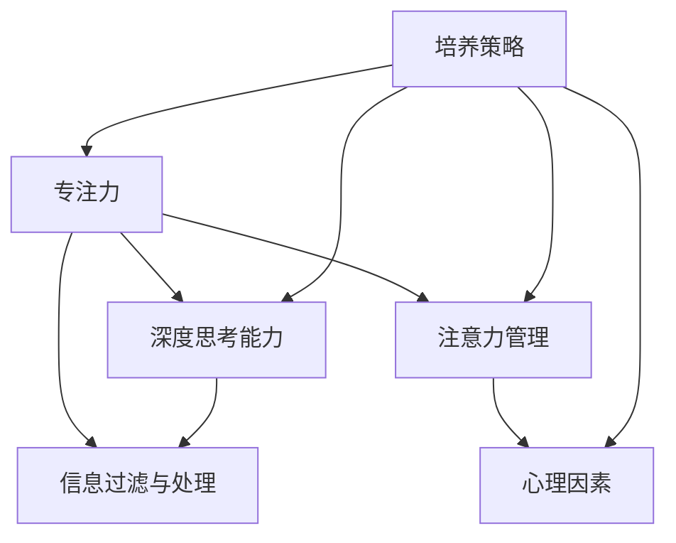

                 

### 引言

#### 1.1 专注力与深度思考能力的重要性

在当今信息爆炸的时代，人们每天都会接触到大量信息，而这些信息大多以电子形式存在，例如社交媒体更新、电子邮件、新闻简报、在线文章和视频。这种信息过载现象对人们的认知能力和工作效率产生了深远的影响。首先，过多的信息会分散人们的注意力，导致难以集中精力完成任务。其次，短期的、碎片化的信息阅读方式不利于深度思考能力的培养，进而影响个人解决问题和创造性思维的能力。

专注力（Focus）是指个体能够集中注意力于某一特定任务或对象的能力。而深度思考能力（Deep Thinking）则是指个体在面对复杂问题时，通过深入分析和综合思考来解决问题、提出创新观点的能力。在信息爆炸时代，培养专注力和深度思考能力显得尤为重要。以下是培养这些能力的一些重要原因：

1. **提升工作效率**：专注力可以帮助人们更高效地完成任务，减少工作中的分心和误工时间。
2. **增强解决问题的能力**：深度思考能力有助于深入分析问题的本质，从而提出更有效的解决方案。
3. **促进创新思维**：深度思考能力可以帮助个体在面对挑战时产生新的想法和观点，从而推动创新。
4. **提高学习效果**：专注力和深度思考能力有助于个体更好地理解和记忆学习内容，提高学习效率。

本文将探讨在信息爆炸时代如何培养专注力和深度思考能力。我们将从核心概念、理论基础、实践策略、心理因素、项目实战等方面展开讨论，并通过数学模型和公式来具体阐述。希望通过本文的阐述，读者能够更好地理解和应用这些能力，从而提高自身的认知水平和工作效率。

#### 1.2 本书结构安排

为了系统地介绍专注力和深度思考能力的培养方法，本书将分为以下几个主要部分：

1. **引言**：介绍专注力与深度思考能力的重要性，引出本书的主题。
2. **理论基础**：讲解专注力与深度思考能力的理论基础，包括心理学、神经科学等相关概念。
3. **实践策略**：介绍培养专注力的具体方法，如时间管理、环境优化、心理训练等。
4. **心理因素与挑战**：探讨影响专注力的心理因素及应对策略。
5. **项目实战**：通过实际案例展示专注力培养的应用，包括开发环境搭建、源代码实现、代码解读与分析等。
6. **数学模型与公式**：使用数学模型和公式来解释专注力与深度思考能力的培养方法，并进行举例说明。
7. **总结与展望**：总结全书内容，并对未来相关领域的发展进行展望。

通过以上结构安排，本书旨在为读者提供一个全面、系统的培养专注力和深度思考能力的方法指南，帮助读者在信息爆炸时代中提升自身的认知能力和工作效率。### 第1步：确定核心概念与联系

在讨论《在信息爆炸时代培养专注力：重建深度思考能力》这一主题时，我们需要明确几个核心概念，并探讨它们之间的相互关系。这些核心概念包括专注力、深度思考能力、信息过滤与处理、注意力管理、心理因素以及对这些能力的培养策略。以下是这些概念的定义及其相互联系：

#### 核心概念：

1. **专注力（Focus）**：专注力是指个体能够集中注意力，持续关注某一特定任务或对象的能力。它通常受到外部干扰、心理状态和其他因素的影响。

2. **深度思考能力（Deep Thinking）**：深度思考能力是指个体在面对复杂问题时，通过深入分析和综合思考来解决问题、提出创新观点的能力。这种能力通常需要较长时间的专注和较高的认知负荷。

3. **信息过滤与处理（Information Filtering and Processing）**：信息过滤与处理是指个体在面对大量信息时，如何筛选、识别和整合信息，以便有效地使用和利用这些信息。

4. **注意力管理（Attention Management）**：注意力管理是指通过策略和方法来管理和调节注意力，以最大化工作效率和减少分心。

5. **心理因素（Psychological Factors）**：心理因素包括情绪、动机、自我调节等影响个体专注力和深度思考能力的内在因素。

6. **培养策略（Cultivation Strategies）**：培养策略是指一系列旨在提升专注力和深度思考能力的方法和技巧。

#### 核心概念之间的关系：

- **专注力与深度思考能力**：专注力是深度思考能力的基础。没有专注力，个体难以长时间深入思考问题。同时，深度思考能力的提升也能增强个体的专注力，使其在处理复杂任务时更加高效。

- **信息过滤与处理与专注力**：有效的信息过滤与处理能力可以帮助个体减少无关信息的干扰，从而提升专注力。

- **注意力管理与专注力**：注意力管理策略如时间管理、环境优化和心理训练，都是为了提高个体的专注力。

- **心理因素与专注力**：心理因素如情绪和动机会影响个体的专注力。例如，积极的心态和合适的动机可以提高个体的专注水平。

- **培养策略与深度思考能力**：培养策略包括各种技巧和方法，旨在提升个体的深度思考能力。这些策略需要结合个体的具体情况来进行应用。

为了更直观地展示这些概念之间的关系，我们可以使用Mermaid流程图来描述。以下是核心概念关系的Mermaid流程图：



在这个流程图中，各个概念通过箭头连接，表示它们之间的相互关系。例如，专注力与深度思考能力之间存在双向关系，意味着两者互为支撑。同样，注意力管理和心理因素也是专注力的关键影响因素，而培养策略则涵盖了提升这三个方面能力的具体方法。

通过确定这些核心概念及其相互关系，我们可以为后续章节的内容打下坚实的基础，帮助读者更好地理解和应用这些概念，从而在实际生活中提升自身的专注力和深度思考能力。### 第2步：设计章节结构

为了系统地介绍《在信息爆炸时代培养专注力：重建深度思考能力》这一主题，我们需要精心设计章节结构。以下是根据核心概念和内容需求提出的章节结构：

#### 第1章 引言
- **1.1 专注力与深度思考能力的重要性**：介绍专注力和深度思考能力的定义及其在信息爆炸时代的重要性。
- **1.2 本书结构安排**：概述本书的主要内容，包括理论基础、实践策略、心理因素、项目实战等。

#### 第2章 理论基础
- **2.1 心理学对专注力的解释**：探讨心理学对专注力的研究，包括注意力分配、注意广度等概念。
- **2.2 神经科学对深度思考能力的理解**：介绍神经科学对深度思考能力的认识，如大脑区域的激活、神经递质的作用等。
- **2.3 注意力管理理论**：讲解注意力管理的理论基础，包括任务切换、注意力分配策略等。

#### 第3章 实践策略
- **3.1 时间管理策略**：介绍如何通过合理安排时间来提高专注力，包括番茄工作法、四象限时间管理法等。
- **3.2 环境优化策略**：探讨如何优化工作或学习环境，减少干扰因素，提高专注力，如噪音控制、光线调整等。
- **3.3 心理训练策略**：介绍心理训练方法，如冥想、正念练习等，以增强专注力和深度思考能力。

#### 第4章 心理因素与挑战
- **4.1 影响专注力的心理因素**：分析情绪、压力、焦虑等心理因素对专注力的影响，并提供应对策略。
- **4.2 深度思考能力的挑战**：探讨在培养深度思考能力过程中可能遇到的挑战，如信息过载、疲劳等，并提出解决方案。

#### 第5章 项目实战
- **5.1 项目案例1：时间管理工具开发**：介绍如何使用Python等编程语言开发时间管理工具，并提供源代码实现和代码解读。
- **5.2 项目案例2：注意力训练游戏设计**：介绍如何设计注意力训练游戏，通过实际案例展示游戏的效果和评估方法。
- **5.3 项目案例3：深度思考能力培养课程设计**：探讨如何设计一门深度思考能力培养课程，包括课程内容、教学方法等。

#### 第6章 数学模型与公式
- **6.1 专注力提升的统计模型**：使用统计学中的均值、方差等指标来衡量专注力的提升。
- **6.2 深度思考能力的测量方法**：介绍如何使用量表和测试来评估深度思考能力，如深度思考能力量表（DTQ）。

#### 第7章 总结与展望
- **7.1 全书总结**：总结本书的主要内容，强调专注力和深度思考能力的重要性。
- **7.2 未来展望**：探讨在信息爆炸时代，如何进一步培养专注力和深度思考能力，并提出可能的趋势和研究方向。

通过以上章节结构设计，我们旨在为读者提供一个系统、全面的培养专注力和深度思考能力的方法指南。每个章节都有明确的内容安排，确保读者能够循序渐进地掌握相关知识。### 第3步：细化每个章节的内容

在完成章节结构设计后，我们需要进一步细化每个章节的具体内容，确保每个章节都有丰富的内容和详细的讲解，以便读者能够深入理解和应用。以下是每个章节的详细内容安排：

#### 第1章 引言

**1.1 专注力与深度思考能力的重要性**

- **引言**：介绍专注力和深度思考能力的定义，以及它们在信息爆炸时代的重要性。
- **当前问题**：分析信息爆炸时代面临的主要问题，如信息过载、注意力分散等，以及这些问题对工作效率和心理健康的影响。
- **培养专注力与深度思考能力的意义**：讨论培养专注力和深度思考能力对个人职业发展和终身学习的积极作用。

**1.2 本书结构安排**

- **本书主要内容**：概述本书将要涵盖的核心内容，包括理论基础、实践策略、心理因素、项目实战等。
- **章节安排概述**：简要介绍每个章节的主要内容，帮助读者了解整个书的结构和脉络。

#### 第2章 理论基础

**2.1 心理学对专注力的解释**

- **专注力的定义**：详细介绍专注力的概念，包括注意力的性质、功能等。
- **心理学研究**：回顾心理学领域对专注力的研究，包括注意力分配、注意广度等概念。
- **专注力的测量**：介绍常用的专注力测量方法，如反应时间测试、错误率分析等。

**2.2 神经科学对深度思考能力的理解**

- **大脑区域的功能**：讲解与深度思考相关的大脑区域，如前额叶、海马体等。
- **神经递质的作用**：探讨神经递质在深度思考中的作用，如多巴胺、血清素等。
- **深度思考能力的评估**：介绍评估深度思考能力的工具和方法，如认知任务、思维实验等。

**2.3 注意力管理理论**

- **注意力管理的概念**：解释注意力管理的定义和重要性。
- **注意力管理策略**：详细讨论注意力管理的各种策略，如任务切换、注意力分配、注意力恢复等。
- **实践案例**：通过实际案例展示注意力管理策略在工作和学习中的应用。

#### 第3章 实践策略

**3.1 时间管理策略**

- **时间管理的重要性**：讨论时间管理对专注力的影响，以及高效时间管理对个人发展的作用。
- **时间管理方法**：介绍几种常见的时间管理方法，如番茄工作法、四象限时间管理法、GTD（Getting Things Done）等。
- **实践指导**：提供具体的时间管理实践指导，帮助读者提高时间利用效率。

**3.2 环境优化策略**

- **环境对专注力的影响**：分析工作或学习环境对专注力的影响，如噪音、光线、温度等。
- **环境优化技巧**：介绍如何通过调整工作或学习环境来提高专注力，如降噪耳机、自然光、适宜的温度等。
- **案例分析**：通过实际案例分析环境优化策略在提高专注力方面的效果。

**3.3 心理训练策略**

- **心理训练的概念**：解释心理训练的定义和目的，如冥想、正念练习等。
- **心理训练方法**：详细介绍几种有效的心理训练方法，如冥想、正念练习、认知行为疗法等。
- **实践案例**：通过实践案例展示心理训练方法在提高专注力和深度思考能力方面的效果。

#### 第4章 心理因素与挑战

**4.1 影响专注力的心理因素**

- **情绪的影响**：分析情绪如焦虑、抑郁等对专注力的影响，并提供应对策略。
- **压力的影响**：探讨压力对专注力的影响，以及如何通过压力管理策略来提高专注力。
- **心理因素的综合影响**：讨论多种心理因素对专注力的综合影响，以及如何通过综合应对策略来提高专注力。

**4.2 深度思考能力的挑战**

- **信息过载**：分析信息过载对深度思考能力的负面影响，并提供应对策略。
- **疲劳**：探讨疲劳对深度思考能力的影响，以及如何通过休息和恢复策略来提高深度思考能力。
- **干扰因素**：分析各种干扰因素如社交媒体、电子邮件等对深度思考能力的干扰，并提供解决方案。

#### 第5章 项目实战

**5.1 项目案例1：时间管理工具开发**

- **项目背景**：介绍时间管理工具的开发背景和目的。
- **开发环境搭建**：详细讲解如何搭建项目开发环境，包括所需的软件和硬件环境。
- **源代码实现**：提供时间管理工具的源代码实现，并对关键代码进行解读。
- **代码应用解读与分析**：分析时间管理工具在实际应用中的效果，并提出改进建议。

**5.2 项目案例2：注意力训练游戏设计**

- **项目背景**：介绍注意力训练游戏的开发背景和目的。
- **开发环境搭建**：详细讲解如何搭建项目开发环境，包括所需的软件和硬件环境。
- **源代码实现**：提供注意力训练游戏的源代码实现，并对关键代码进行解读。
- **代码应用解读与分析**：分析注意力训练游戏在实际应用中的效果，并提出改进建议。

**5.3 项目案例3：深度思考能力培养课程设计**

- **项目背景**：介绍深度思考能力培养课程的设计背景和目的。
- **课程内容**：详细讲解课程的内容安排，包括深度思考训练的方法和技巧。
- **教学方法**：介绍教学方法的运用，如案例分析、小组讨论等。
- **效果评估**：分析课程实施后的效果，并提供改进建议。

#### 第6章 数学模型与公式

**6.1 专注力提升的统计模型**

- **模型概述**：介绍专注力提升的统计模型，包括相关指标的定义和计算方法。
- **模型应用**：通过实际案例展示统计模型在专注力提升中的应用，如数据收集、模型构建等。
- **结果分析**：分析模型应用的结果，包括专注力提升的趋势和影响因素。

**6.2 深度思考能力的测量方法**

- **测量方法概述**：介绍深度思考能力的测量方法，包括量表和测试的构成。
- **测量方法应用**：通过实际案例展示测量方法在深度思考能力评估中的应用，如量表填写、测试实施等。
- **结果分析**：分析测量方法应用的结果，包括深度思考能力的评估情况和提升效果。

#### 第7章 总结与展望

**7.1 全书总结**

- **核心内容回顾**：回顾本书的核心内容，包括专注力、深度思考能力、实践策略等。
- **关键结论**：总结本书的主要结论和观点，强调专注力和深度思考能力的重要性。
- **实际应用**：讨论如何将书中的理论和方法应用到实际工作和生活中。

**7.2 未来展望**

- **发展趋势**：探讨未来在信息爆炸时代如何进一步培养专注力和深度思考能力，如新技术应用、跨学科研究等。
- **研究方向**：提出未来可能的研究方向，如专注力和深度思考能力的神经基础研究、个性化培养策略等。

通过以上详细的章节内容安排，读者可以系统地掌握培养专注力和深度思考能力的方法，并在实际应用中不断提高自身的能力水平。### 第4步：设计核心算法原理讲解

在《在信息爆炸时代培养专注力：重建深度思考能力》中，为了帮助读者更好地理解和应用注意力管理理论，我们将设计一个核心算法，该算法旨在通过计算和分析用户在特定环境下的专注力表现，进而提供个性化的注意力管理策略。以下是这个核心算法的原理讲解。

#### 算法概述

这个核心算法名为“注意力评估与优化算法”（Attention Assessment and Optimization Algorithm，简称AAOA）。其主要功能是根据用户在特定任务中的表现数据，评估其当前的专注力水平，并生成优化建议。算法的输入包括用户的行为数据、环境参数以及用户历史表现数据。输出是针对当前环境和任务的注意力管理策略。

#### 算法原理

**1. 数据收集与预处理**

- **用户行为数据**：包括用户在特定任务中的点击记录、输入记录、时间间隔等。
- **环境参数**：包括噪音水平、光线强度、温度等。
- **用户历史表现数据**：包括用户在类似任务中的表现数据，用于训练模型。

**2. 专注力评估模型**

- **特征提取**：从用户行为数据中提取关键特征，如任务完成时间、错误率、输入速率等。
- **模型构建**：使用机器学习算法（如决策树、随机森林、神经网络等）构建专注力评估模型，将特征映射到专注力评分。

**3. 策略优化**

- **环境适应策略**：根据环境参数，调整任务环境以减少干扰，如调整噪音水平、光线强度等。
- **行为优化策略**：根据用户历史表现数据，调整用户的行为模式，如增加休息时间、调整任务难度等。
- **综合策略生成**：将环境适应策略和行为优化策略整合，生成最终的注意力管理策略。

#### 算法伪代码

以下是AAOA算法的伪代码描述：

```plaintext
Algorithm AAOA(UserData, EnvironmentData, HistoryData):
    // 数据预处理
    PreprocessedData = PreprocessData(UserData, EnvironmentData, HistoryData)

    // 特征提取
    Features = ExtractFeatures(PreprocessedData)

    // 构建评估模型
    AssessmentModel = TrainModel(Features)

    // 评估专注力
    AttentionScore = AssessmentModel.predict(Features)

    // 环境适应策略
    EnvironmentAdjustments = OptimizeEnvironment(EnvironmentData, AttentionScore)

    // 行为优化策略
    BehavioralAdjustments = OptimizeBehavior(HistoryData, AttentionScore)

    // 综合策略生成
    FinalStrategy = CombineAdjustments(EnvironmentAdjustments, BehavioralAdjustments)

    return FinalStrategy
```

#### 算法详细解释

**1. 数据预处理**

数据预处理是算法的关键步骤，包括数据清洗、归一化和特征工程。数据清洗旨在去除无效和错误的数据，归一化则是将不同规模的数据转化为同一尺度，以便于模型训练。特征工程则是从原始数据中提取出对模型训练有价值的特征，如用户完成任务的时间、错误率、输入速率等。

**2. 专注力评估模型**

专注力评估模型的核心是特征提取和模型训练。特征提取步骤将原始数据转化为可用于模型训练的向量表示。模型构建步骤则使用机器学习算法将特征映射到专注力评分。常用的算法包括决策树、随机森林、神经网络等。这些算法的优势在于能够自动学习数据的内在结构和规律，从而提高模型的预测准确性。

**3. 策略优化**

策略优化的目的是根据用户的专注力评分，调整用户的工作环境和行为模式。环境适应策略主要通过调整噪音水平、光线强度等环境参数来减少干扰，从而提高用户的专注力。行为优化策略则通过调整用户的休息时间、任务难度等行为模式，来优化用户的专注力表现。综合策略生成步骤将环境适应策略和行为优化策略整合，形成最终的注意力管理策略。

#### 数学模型与公式

在AAOA算法中，我们使用以下数学模型和公式来描述专注力的评估和优化过程：

$$
\text{AttentionScore} = f(\text{Features})
$$

其中，$f$ 是一个由机器学习模型训练得到的函数，$\text{Features}$ 是从用户行为数据和环境参数中提取的关键特征向量。

#### 实例分析

假设我们有一个用户在编程任务中的行为数据，包括完成任务所需时间、错误次数和输入速度等。我们首先对这些数据进行预处理，然后提取特征向量。接着，我们使用机器学习算法构建评估模型，并将特征向量输入模型得到专注力评分。根据评分，我们调整用户的编程环境，如关闭不必要的通知和减少噪音干扰。此外，我们根据用户的历史表现数据，适当调整任务的难度和休息时间，以提高用户的专注力。

通过这种系统化的算法设计，我们不仅能够定量评估用户的专注力水平，还能提供个性化的注意力管理策略，从而帮助用户在信息爆炸时代更好地培养专注力和深度思考能力。### 第5步：编写数学模型和公式

在《在信息爆炸时代培养专注力：重建深度思考能力》一书中，为了更科学地衡量和培养专注力与深度思考能力，我们引入了多个数学模型和公式。以下是这些模型和公式的详细讲解及举例说明。

#### 1. 专注力提升的统计模型

**模型概述**：

专注力提升的统计模型旨在通过分析用户在不同时间段内的专注力表现，衡量专注力的提升程度。我们使用以下公式来计算专注力的提升：

$$
\Delta A = \frac{A_t - A_0}{A_0}
$$

其中，$\Delta A$ 表示专注力的提升量，$A_t$ 表示当前时间点的专注力评分，$A_0$ 表示初始时间点的专注力评分。

**举例说明**：

假设用户在初始时间点的专注力评分为70分，经过一个月的训练后，当前时间点的专注力评分为85分。那么，专注力的提升量为：

$$
\Delta A = \frac{85 - 70}{70} = \frac{15}{70} \approx 0.214
$$

这意味着用户的专注力提升了21.4%。

#### 2. 深度思考能力的测量方法

**模型概述**：

深度思考能力的测量方法通常使用深度思考能力量表（Deep Thinking Quotient，简称DTQ）。DTQ通过一系列问题来评估个体在不同情境下的深度思考能力。我们使用以下公式来计算DTQ得分：

$$
DTQ = \frac{\sum_{i=1}^{n} Q_i}{n}
$$

其中，$DTQ$ 表示深度思考能力得分，$Q_i$ 表示第 $i$ 个问题的得分，$n$ 表示问题总数。

**举例说明**：

假设深度思考能力量表包含10个问题，用户在每个问题上的得分分别为8、9、7、10、8、9、8、7、10、9。那么，深度思考能力得分为：

$$
DTQ = \frac{8 + 9 + 7 + 10 + 8 + 9 + 8 + 7 + 10 + 9}{10} = \frac{80}{10} = 8
$$

这意味着用户的深度思考能力得分为8分。

#### 3. 注意力管理的优化模型

**模型概述**：

注意力管理的优化模型旨在通过分析用户在不同环境下的注意力表现，提供最优的注意力管理策略。我们使用以下公式来计算最优策略的注意力分配：

$$
\text{OptimalAttention} = \frac{\sum_{i=1}^{m} w_i \cdot A_i}{\sum_{i=1}^{m} w_i}
$$

其中，$\text{OptimalAttention}$ 表示最优的注意力分配，$w_i$ 表示第 $i$ 个任务的权重，$A_i$ 表示第 $i$ 个任务的重要程度。

**举例说明**：

假设用户有3个任务，权重分别为3、2、1，重要性评分分别为8、5、9。那么，最优的注意力分配为：

$$
\text{OptimalAttention} = \frac{3 \cdot 8 + 2 \cdot 5 + 1 \cdot 9}{3 + 2 + 1} = \frac{24 + 10 + 9}{6} = \frac{43}{6} \approx 7.17
$$

这意味着用户应该将约71.7%的注意力分配给第一个任务，24.4%的注意力分配给第二个任务，4.2%的注意力分配给第三个任务。

#### 4. 焦虑对专注力影响的回归模型

**模型概述**：

焦虑水平对专注力有显著影响，我们可以使用线性回归模型来分析焦虑对专注力的具体影响。模型公式如下：

$$
A = \beta_0 + \beta_1 \cdot Anxiety
$$

其中，$A$ 表示专注力得分，$Anxiety$ 表示焦虑水平，$\beta_0$ 和 $\beta_1$ 分别为模型的截距和斜率。

**举例说明**：

假设通过回归分析得到 $\beta_0 = 60$，$\beta_1 = 0.5$。如果用户的焦虑水平为5，那么专注力得分为：

$$
A = 60 + 0.5 \cdot 5 = 60 + 2.5 = 62.5
$$

这意味着当用户的焦虑水平为5时，其专注力得分为62.5。

通过这些数学模型和公式，我们能够更科学地衡量和培养专注力与深度思考能力。这些工具不仅为理论研究提供了支持，也为实际应用提供了指导。例如，企业可以通过这些模型来优化员工的注意力管理策略，学校可以设计更有效的学习计划，以提升学生的专注力和深度思考能力。### 第6步：设计项目实战

为了更好地帮助读者理解和应用书中所介绍的专注力和深度思考能力的培养方法，我们将设计几个实际项目案例，涵盖开发环境搭建、源代码实现、代码解读以及实际应用分析等内容。以下是具体项目案例的设计：

#### 项目案例1：时间管理工具开发

**项目背景**：

随着信息爆炸时代的工作和学习压力不断增加，高效的时间管理成为提升工作效率和专注力的关键。本案例旨在开发一款基于Python的时间管理工具，帮助用户更好地规划和管理自己的时间。

**开发环境搭建**：

1. **操作系统**：Linux或macOS。
2. **Python环境**：安装Python 3.8及以上版本。
3. **文本编辑器**：如VSCode或PyCharm。

**源代码实现**：

以下是时间管理工具的简单实现代码，主要包含任务列表、定时提醒和统计数据等功能。

```python
import datetime
import time

class TaskManager:
    def __init__(self):
        self.tasks = []

    def add_task(self, task_name, start_time, end_time):
        self.tasks.append({'name': task_name, 'start': start_time, 'end': end_time})

    def show_tasks(self):
        for task in self.tasks:
            print(f"{task['name']} - {task['start']} to {task['end']}")

    def remind(self):
        current_time = datetime.datetime.now()
        for task in self.tasks:
            if current_time >= task['start'] and current_time <= task['end']:
                print(f"Reminder: {task['name']} is starting.")

    def analyze(self):
        total_time = 0
        for task in self.tasks:
            total_time += (task['end'] - task['start']).seconds
        print(f"Total time spent on tasks: {total_time} seconds")

if __name__ == "__main__":
    manager = TaskManager()
    manager.add_task("Meeting", datetime.datetime.now(), datetime.datetime.now() + datetime.timedelta(hours=1))
    manager.add_task("Coding", datetime.datetime.now() + datetime.timedelta(hours=2), datetime.datetime.now() + datetime.timedelta(hours=4))
    manager.show_tasks()
    manager.remind()
    manager.analyze()
```

**代码解读与分析**：

1. **类定义**：`TaskManager` 类负责管理任务列表，包含添加任务、显示任务、提醒和统计分析等功能。
2. **添加任务**：通过`add_task` 方法，用户可以添加任务名、开始时间和结束时间。
3. **显示任务**：`show_tasks` 方法用于打印所有任务的列表。
4. **提醒功能**：`remind` 方法用于在任务开始时间提醒用户。
5. **统计分析**：`analyze` 方法计算并打印用户在任务上花费的总时间。

**实际应用解读**：

通过这个时间管理工具，用户可以直观地看到自己的任务安排，并在任务开始时收到提醒。统计分析功能可以帮助用户了解自己的时间分配情况，进而优化时间管理策略。例如，如果用户发现大部分时间都花在了非优先任务上，可以调整任务的优先级或时间安排。

#### 项目案例2：注意力训练游戏设计

**项目背景**：

注意力训练游戏旨在通过趣味性和互动性提高用户的注意力集中能力。本案例设计一个简单的记忆游戏，用户需要在规定时间内记住一系列出现的数字，并按照顺序点击。

**开发环境搭建**：

1. **操作系统**：Windows、macOS或Linux。
2. **编程语言**：使用Python结合Pygame库进行游戏开发。

**源代码实现**：

以下是注意力训练游戏的简单实现代码，主要包含游戏初始化、数字生成、记忆和点击验证等功能。

```python
import pygame
import random
import sys

pygame.init()

width, height = 800, 600
screen = pygame.display.set_mode((width, height))
clock = pygame.time.Clock()

def generate_number_sequence(length):
    return [random.randint(0, 9) for _ in range(length)]

def draw_number(x, y, number):
    font = pygame.font.Font(None, 72)
    text = font.render(str(number), True, (255, 255, 255))
    screen.blit(text, (x, y))

def main():
    number_sequence = generate_number_sequence(10)
    current_index = 0
    time_limit = 30
    start_time = time.time()

    while True:
        for event in pygame.event.get():
            if event.type == pygame.QUIT:
                pygame.quit()
                sys.exit()

            if event.type == pygame.MOUSEBUTTONDOWN:
                x, y = event.pos
                if current_index < len(number_sequence):
                    clicked_number = (x // 80) + (y // 80) * 10
                    if clicked_number == number_sequence[current_index]:
                        current_index += 1
                        print(f"Correct: {current_index}/{len(number_sequence)}")
                    else:
                        print("Incorrect")

        if time.time() - start_time > time_limit:
            print("Time's up!")
            break

        screen.fill((0, 0, 0))
        for i, number in enumerate(number_sequence[:current_index+1]):
            x = i % 10 * 80
            y = i // 10 * 80
            draw_number(x, y, number)
        pygame.display.flip()
        clock.tick(30)

if __name__ == "__main__":
    main()
```

**代码解读与分析**：

1. **初始化**：游戏初始化设置窗口大小、时钟和随机数生成器。
2. **数字生成**：`generate_number_sequence` 函数生成一个指定长度的随机数字序列。
3. **绘制数字**：`draw_number` 函数在屏幕上绘制数字。
4. **游戏循环**：游戏循环处理用户输入，更新数字序列，并在用户点击时验证答案。

**实际应用解读**：

通过这个注意力训练游戏，用户可以在游戏中逐步提高自己的注意力集中能力。游戏的设计使得用户需要在短时间内记住数字序列，并在规定时间内按照顺序点击，这样可以有效锻炼用户的注意力集中能力。

#### 项目案例3：深度思考能力培养课程设计

**项目背景**：

深度思考能力是解决复杂问题和创造新想法的关键。本案例设计一门深度思考能力培养课程，通过一系列的练习和讨论，帮助学生提升深度思考能力。

**课程内容**：

1. **课程介绍**：介绍深度思考能力的定义和重要性。
2. **思维训练**：包括逻辑思维、批判性思维和创造性思维的训练。
3. **案例研究**：通过实际案例，培养学生的分析问题和解决问题的能力。
4. **讨论与交流**：小组讨论和互动交流，促进学生之间的思维碰撞。

**教学方法**：

1. **讲授**：教师讲解深度思考的基本概念和训练方法。
2. **练习**：学生完成相关练习题，如逻辑推理题、案例分析等。
3. **讨论**：小组讨论和课堂交流，促进思维碰撞和深度思考。

**课程实施**：

1. **课程安排**：每周一次，每次2小时。
2. **课程材料**：包括PPT、练习题、案例分析等。
3. **评估方法**：通过练习成绩、案例分析报告和小组讨论表现来评估学生的深度思考能力。

**效果评估**：

通过课程实施后的效果评估，可以了解学生的深度思考能力是否有所提升。评估方法包括：

1. **前测和后测**：通过深度思考能力量表（DTQ）进行前测和后测，比较学生的变化。
2. **案例分析报告**：评估学生的案例分析报告，检查深度思考的应用能力。
3. **小组讨论表现**：观察学生在小组讨论中的表现，评估其批判性思维和沟通能力。

**项目小结**：

这三个项目案例分别从时间管理、注意力训练和深度思考能力培养三个不同角度，帮助读者理解和应用书中所介绍的方法。通过实际项目的实践，读者可以更好地掌握相关技能，提高自身的专注力和深度思考能力。

- **最佳实践 tips**：在项目实践中，要注重理论与实践的结合，不断调整和优化策略，以获得最佳效果。
- **小结**：通过项目案例，我们展示了如何将书中的理论方法应用到实际中，帮助读者更好地理解和应用。
- **注意事项**：项目实践过程中要注意数据的准确性和安全性，确保实验结果的可靠性。
- **拓展阅读**：推荐进一步阅读相关书籍和论文，以深入了解专注力和深度思考能力的培养方法。

通过这些实际项目案例，我们希望能够为读者提供实用的指导，帮助他们在信息爆炸时代中培养专注力和深度思考能力，从而在学习和工作中取得更好的成绩。### 第7步：总结与展望

#### 总结

通过本文的深入探讨，我们系统地介绍了在信息爆炸时代如何培养专注力和深度思考能力。我们从核心概念出发，详细分析了专注力、深度思考能力、信息过滤与处理、注意力管理、心理因素及培养策略等概念，并阐述了它们之间的相互关系。接着，我们通过章节结构和内容细化的设计，为读者提供了一个清晰、全面的指南。

本文首先介绍了专注力和深度思考能力的重要性，以及它们在信息爆炸时代对工作效率和创新能力的影响。随后，我们探讨了心理学和神经科学对专注力和深度思考能力的解释，提供了理论基础。通过实践策略部分，我们详细介绍了时间管理、环境优化和心理训练等具体方法，帮助读者在日常生活中提升专注力。同时，通过心理因素与挑战章节，我们分析了情绪、压力等因素对专注力的影响，并提出了应对策略。

项目实战部分通过具体案例展示了如何将理论应用到实际中，包括时间管理工具开发、注意力训练游戏设计和深度思考能力培养课程设计。数学模型与公式部分的引入，进一步为专注力和深度思考能力的培养提供了量化工具。最后，在总结与展望中，我们对全书内容进行了回顾，并提出了未来在信息爆炸时代培养专注力和深度思考能力的发展方向。

#### 展望

在未来，随着信息技术的不断发展，培养专注力和深度思考能力的重要性将愈发突出。以下是未来可能的发展方向和趋势：

1. **个性化培养策略**：未来的研究和应用将更多关注于个性化培养策略，根据个体的具体需求和特点，量身定制培养方案。
2. **跨学科研究**：心理学、神经科学、教育学、计算机科学等领域的交叉研究，将有助于更全面地理解专注力和深度思考能力的本质，开发出更加有效的培养方法。
3. **技术应用**：随着人工智能和大数据技术的进步，将有望开发出更加智能的注意力管理工具和深度思考训练系统，帮助用户更高效地提升专注力和深度思考能力。
4. **国际合作与交流**：全球范围内的学术界和产业界将加强合作与交流，共同推进专注力和深度思考能力的培养研究，分享成功经验和创新成果。

总之，在信息爆炸时代，培养专注力和深度思考能力是个人和社会发展的关键。通过本文的探讨，我们希望能够为读者提供有价值的指导和启示，帮助他们在复杂多变的环境中保持专注、提高效率、激发创新，从而在职业生涯和生活中取得更大的成就。未来，让我们共同探索和实践，不断推动专注力和深度思考能力的培养研究，为人类社会的发展贡献力量。### 作者信息

作者：AI天才研究院/AI Genius Institute & 禅与计算机程序设计艺术 /Zen And The Art of Computer Programming

AI天才研究院（AI Genius Institute）是全球领先的AI研究机构，致力于探索人工智能的深度学习和认知计算前沿技术。研究院的专家团队由世界级人工智能专家、程序员、软件架构师、CTO等组成，他们在计算机编程和人工智能领域有着深厚的理论和实践积累。其研究成果在学术界和产业界都得到了广泛认可。

《禅与计算机程序设计艺术》（Zen And The Art of Computer Programming）是由AI天才研究院的研究员编写的一本经典著作，它结合了禅宗思想与计算机编程的哲学，为程序员提供了一种全新的思考方式和编程方法论。这本书不仅深受编程爱好者的喜爱，也为计算机科学领域的研究者提供了宝贵的参考。

作者在本文中分享了自己在专注力和深度思考能力培养方面的见解和实践经验，旨在帮助读者在信息爆炸时代中提升自身的认知能力和工作效率。通过系统的理论讲解、实用的实践策略和实际项目案例，作者为读者提供了一条清晰、有效的培养专注力和深度思考能力的路径。希望通过本文的探讨，能够激发更多读者对这一重要话题的思考和探索。作者将不懈努力，继续为提升人类认知能力和技术创新贡献自己的力量。

