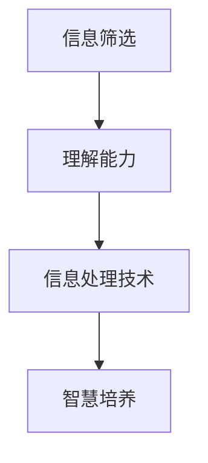

                 

## 文章标题

### 在信息爆炸时代培养智慧：提升信息筛选与理解能力

### 关键词

- 信息爆炸
- 智慧培养
- 信息筛选
- 理解能力
- 人工智能
- 信息处理技术

### 摘要

本文旨在探讨在信息爆炸时代如何培养个体的智慧，特别是提升信息筛选与理解能力。文章首先分析了信息爆炸的背景及其对个体的影响，随后详细阐述了信息筛选的原则与技巧，以及提升理解能力的方法与策略。此外，文章还介绍了信息处理工具与技术，探讨了信息筛选与心理调适的关系，并通过案例研究来具体说明信息筛选与理解的应用。最后，文章预测了未来信息筛选与理解的发展趋势，并提出了相关的最佳实践建议。

## 引言

### 信息爆炸的背景与影响

在当今社会，信息爆炸已成为不争的事实。随着互联网的普及和移动设备的普及，人们每天接触到的大量信息远超以往。根据统计，每天产生的数据量高达数百万TB，而这些数据中，有相当一部分是无效的甚至是虚假的信息。这种信息过载现象给个体带来了巨大的挑战，使得人们难以在繁杂的信息中筛选出真正有价值的内容。

信息爆炸对个体的影响主要体现在以下几个方面：

1. **认知负担增加**：面对海量的信息，个体需要花费更多的时间和精力去筛选和整理，这导致了认知负担的增加。
2. **决策困难**：在信息过载的环境下，个体难以在短时间内做出明智的决策，往往因为信息不足或信息质量低下而做出错误的决策。
3. **心理健康问题**：长期处于信息过载状态，个体可能会出现焦虑、抑郁等心理健康问题。

因此，如何在信息爆炸时代培养智慧，提升信息筛选与理解能力，成为了一个亟待解决的问题。

### 核心概念与联系

在本文中，我们将探讨以下几个核心概念：

- **信息筛选**：指个体在大量信息中筛选出有价值信息的过程。
- **理解能力**：指个体对信息进行理解、分析和应用的能力。
- **信息处理技术**：指用于处理和加工信息的各种技术手段。

这些概念之间的关系可以用以下Mermaid流程图表示：

信息筛选是提升理解能力的基础，而理解能力又决定了信息处理技术的效果，最终共同作用于个体的智慧培养。接下来，我们将逐一探讨这些概念及其应用。

## 第1章：信息筛选的原则与技巧

### 1.1 信息筛选的重要性

在信息爆炸的时代，如何有效地进行信息筛选成为个体获取知识、做出决策的重要环节。信息筛选的重要性主要体现在以下几个方面：

1. **提高效率**：通过筛选，个体可以快速获取到与需求相关的信息，避免在海量数据中浪费时间。
2. **保证质量**：有效的信息筛选能够帮助个体排除虚假、无效的信息，确保获取到的信息具有实际价值。
3. **降低认知负担**：信息筛选有助于减少个体需要处理的信息量，降低认知负担，提高工作、学习和生活的质量。

### 1.2 信息筛选的基本原则

在进行信息筛选时，应遵循以下基本原则：

1. **准确性**：筛选出的信息必须准确无误，能够真实反映实际情况。
2. **时效性**：信息具有时效性，过时的信息可能会误导个体的决策。
3. **全面性**：筛选的信息应尽可能全面，避免因为信息不全而做出错误的判断。
4. **价值性**：筛选的信息应具备实际价值，能够为个体提供有意义的参考。

#### 1.2.1 准确性

准确性是信息筛选的首要原则。在筛选过程中，个体需要识别和排除虚假、错误的信息。以下是一些提高信息准确性的方法：

- **来源验证**：确认信息来源的可靠性和权威性，避免从不可信的渠道获取信息。
- **交叉验证**：通过多个来源的信息进行交叉验证，确保信息的准确性。
- **数据校验**：对于涉及数据的信息，应进行数据校验，确保数据的真实性和准确性。

#### 1.2.2 时效性

时效性是信息筛选的重要原则之一。许多信息在特定时间内是有效的，一旦过时，其价值将大大降低。以下是一些提高信息时效性的方法：

- **关注更新频率**：关注信息来源的更新频率，优先选择更新频率较高的信息源。
- **实时监测**：利用实时监测工具，及时获取最新信息。
- **时间标注**：对筛选的信息进行时间标注，便于后续根据时效性进行筛选。

#### 1.2.3 全面性

全面性要求个体在筛选信息时，尽可能收集到与主题相关的所有信息，避免因为信息不全而做出错误的判断。以下是一些提高信息全面性的方法：

- **多角度分析**：从多个角度对信息进行分析，确保信息的全面性。
- **广泛收集**：从多个渠道收集信息，确保信息的多样性。
- **深度挖掘**：对关键信息进行深度挖掘，获取更多的细节信息。

#### 1.2.4 价值性

价值性是指筛选的信息应具备实际价值，能够为个体提供有意义的参考。以下是一些提高信息价值性的方法：

- **目标导向**：根据个体的需求和目标，有针对性地筛选信息，确保信息的价值性。
- **需求匹配**：确保筛选的信息与个体的需求高度匹配，避免无关信息的干扰。
- **实用价值**：筛选的信息应具有实用价值，能够解决实际问题。

### 1.3 信息筛选的技巧

在进行信息筛选时，个体可以运用以下技巧来提高筛选效率和效果：

#### 1.3.1 利用搜索引擎优化搜索结果

搜索引擎是获取信息的重要工具，通过以下方法可以优化搜索结果：

- **关键词优化**：选择准确的关键词，避免使用模糊或泛泛的词汇。
- **逻辑组合**：使用逻辑运算符（如AND、OR、NOT）进行关键词组合，提高搜索的精准度。
- **引用搜索**：通过引用搜索，找到原始、权威的信息来源。

#### 1.3.2 使用社交媒体筛选信息

社交媒体是获取信息的重要渠道，以下方法可以提高信息筛选的效率：

- **关注权威账号**：关注权威、可信的账号，获取高质量的信息。
- **标签筛选**：利用标签功能，快速找到与主题相关的信息。
- **评论分析**：通过分析评论，判断信息的可信度和价值。

#### 1.3.3 借助专业工具筛选信息

专业工具可以大大提高信息筛选的效率和效果，以下是一些常用的专业工具：

- **信息过滤工具**：如Google Alerts、Feedly等，用于实时获取和筛选信息。
- **数据挖掘工具**：如Tableau、Python等，用于分析和处理大量数据。
- **专业数据库**：如PubMed、IEEE Xplore等，提供专业领域的权威信息。

#### 1.3.4 结合自己的需求与兴趣进行筛选

个体的需求和兴趣是信息筛选的重要参考，以下方法可以帮助个体更有效地进行信息筛选：

- **明确目标**：在筛选信息前，明确自己的需求和目标，确保信息与目标相关。
- **持续学习**：保持对自身兴趣和领域的持续关注，不断提高信息筛选的效率和质量。
- **个性化推荐**：利用个性化推荐系统，获取与自己兴趣和需求相关的信息。

## 第2章：提升理解能力的方法与策略

### 2.1 理解能力的概念与重要性

理解能力是指个体对信息进行深入理解、分析和应用的能力。它不仅仅是对信息的表面理解，更涉及到对信息的内在逻辑、关系和价值的挖掘。理解能力的重要性体现在以下几个方面：

1. **信息吸收与转化**：只有通过理解，个体才能将获取的信息转化为自己的知识和能力。
2. **决策支持**：理解能力强的个体能够更准确地分析信息，从而做出更明智的决策。
3. **创新能力**：理解能力为个体提供了广阔的视野，有助于发现新的问题、提出新的解决方案。
4. **沟通协作**：理解能力强的个体能够更好地与他人沟通和协作，共同解决问题。

### 2.2 提升理解能力的原则

在提升理解能力时，应遵循以下原则：

1. **深度阅读**：深度阅读有助于个体对信息进行深入理解，培养批判性思维。
2. **批判性思维**：批判性思维能够帮助个体对信息进行批判性分析，避免盲目接受。
3. **归纳总结**：归纳总结能够帮助个体将零散的信息整合成体系，提高记忆效果。
4. **学科交叉学习**：学科交叉学习有助于个体从不同角度理解信息，提高综合素养。

#### 2.2.1 深度阅读

深度阅读是一种全面的、深入的阅读方式，旨在理解和吸收文本的深层意义。以下方法可以帮助个体进行深度阅读：

- **预读**：在正式阅读前，快速浏览全文，了解文章的结构和主要观点。
- **专注阅读**：在阅读过程中，保持专注，避免分心。
- **标记和注释**：在阅读过程中，对重要的内容进行标记和注释，便于后续回顾。
- **反思与讨论**：阅读后，对文章进行反思和讨论，加深对文章的理解。

#### 2.2.2 培养批判性思维

批判性思维是一种对信息进行深入分析和批判性评价的能力。以下方法可以帮助个体培养批判性思维：

- **提出问题**：在阅读和听取信息时，不断提出问题，质疑信息的真实性、合理性和完整性。
- **分析证据**：对信息进行证据分析，判断其可靠性和可信度。
- **逻辑推理**：运用逻辑推理，分析信息之间的因果关系和内在逻辑。
- **多元视角**：从多个视角分析信息，避免片面和盲目接受。

#### 2.2.3 学会归纳总结

归纳总结是一种将零散的信息整合成体系的能力，有助于提高记忆效果和理解深度。以下方法可以帮助个体进行归纳总结：

- **提炼核心观点**：在阅读和听取信息时，提炼出核心观点和关键信息。
- **构建知识框架**：根据提炼出的核心观点和关键信息，构建知识框架，将信息组织成有条理的整体。
- **制作思维导图**：利用思维导图，将信息以图形化的方式呈现，提高记忆和理解效果。
- **回顾与复习**：定期回顾和复习总结的内容，巩固记忆，加深理解。

#### 2.2.4 加强学科交叉学习

学科交叉学习是一种将不同领域的知识进行融合和交叉应用的学习方式，有助于个体从不同角度理解信息。以下方法可以帮助个体加强学科交叉学习：

- **跨学科课程**：选择跨学科的的课程，学习不同领域的知识。
- **跨学科阅读**：阅读不同领域的书籍和文章，拓宽视野。
- **实践应用**：将不同领域的知识应用到实际问题中，加深理解。
- **跨学科讨论**：参与跨学科的讨论和交流，促进知识的融合和应用。

### 2.3 提升理解能力的方法

除了上述原则，个体还可以采用以下方法来提升理解能力：

- **通过实践提升理解能力**：实践是提高理解能力的最佳途径。通过实际操作和项目实践，个体可以加深对知识的理解和应用能力。
- **运用记忆技巧提高信息记忆**：记忆是理解的基础。通过运用记忆技巧，如联想记忆、重复记忆、图表记忆等，个体可以更好地记忆和理解信息。
- **借助工具辅助理解**：利用各种辅助工具，如思维导图软件、笔记软件、在线教育资源等，个体可以更高效地理解和整理信息。
- **建立知识体系**：通过建立知识体系，个体可以将零散的知识点整合成一个完整的知识网络，提高理解和应用能力。

## 第3章：信息处理工具与技术

### 3.1 常见信息处理工具介绍

在信息爆炸的时代，各种信息处理工具应运而生，极大地提高了个体处理信息的能力。以下是一些常见的信息处理工具及其特点：

#### 3.1.1 文本处理工具

文本处理工具主要用于文本的编辑、格式化和处理，以下是一些常用的文本处理工具：

- **Microsoft Word**：一款功能强大的文本编辑软件，支持丰富的文本格式和排版功能。
- **Google Docs**：一款在线文本处理工具，支持多人实时协作，便于分享和存储。
- **LibreOffice Writer**：一款开源的文本处理工具，功能与Microsoft Word相似，但更加轻量级。

#### 3.1.2 数据分析工具

数据分析工具用于对大量数据进行分析和处理，以下是一些常用的数据分析工具：

- **Excel**：一款功能强大的电子表格软件，支持数据计算、图表生成和数据可视化。
- **Python**：一种通用编程语言，广泛应用于数据分析和科学计算，具有丰富的数据分析库（如Pandas、NumPy）。
- **R**：一种专门用于数据分析和统计的编程语言，具有强大的数据处理和分析功能。

#### 3.1.3 信息可视化工具

信息可视化工具用于将信息以图形化的方式展示，使信息更加直观和易于理解，以下是一些常用的信息可视化工具：

- **Tableau**：一款功能强大的商业智能工具，支持多种数据源和丰富的可视化图表。
- **D3.js**：一款基于JavaScript的库，用于创建动态、交互式和高度定制化的数据可视化图表。
- **Plotly**：一款基于Python的库，支持多种图表类型，提供丰富的自定义选项。

### 3.2 信息处理技术的应用

信息处理技术广泛应用于各个领域，以下是一些典型的应用场景：

#### 3.2.1 文本挖掘技术

文本挖掘技术用于从大量文本数据中提取有价值的信息和知识，以下是一些应用场景：

- **情感分析**：通过对社交媒体、评论等文本数据的分析，了解用户的情感倾向和满意度。
- **主题识别**：通过对大量文本数据进行分析，识别出文本中的主题和关键词。
- **文本分类**：通过对文本数据进行分类，实现对文本内容的自动分类和归纳。

#### 3.2.2 数据挖掘技术

数据挖掘技术用于从大量数据中挖掘出隐藏的模式和规律，以下是一些应用场景：

- **客户行为分析**：通过对客户交易数据、浏览行为等进行分析，了解客户需求和行为模式。
- **市场预测**：通过对历史销售数据、市场趋势等进行分析，预测未来的市场动态。
- **异常检测**：通过对数据进行分析，识别出异常值和异常行为，提高系统的安全性。

#### 3.2.3 信息可视化技术

信息可视化技术用于将复杂的数据和信息以图形化的方式展示，以下是一些应用场景：

- **数据分析**：通过可视化图表，帮助分析人员更直观地理解数据，发现数据中的模式和趋势。
- **决策支持**：通过可视化图表，帮助决策者更好地了解问题的背景和影响因素，做出更明智的决策。
- **传播与沟通**：通过可视化图表，使信息更加易于理解和传播，提高沟通的效果。

#### 3.2.4 自然语言处理技术

自然语言处理技术用于对自然语言文本进行分析和处理，以下是一些应用场景：

- **机器翻译**：通过自然语言处理技术，实现不同语言之间的自动翻译。
- **语音识别**：通过自然语言处理技术，实现语音到文本的转换。
- **问答系统**：通过自然语言处理技术，实现智能问答系统，为用户提供实时回答。

### 3.3 人工智能在信息处理中的应用

人工智能技术在信息处理中的应用越来越广泛，以下是一些典型的应用：

- **推荐系统**：通过人工智能技术，为用户推荐个性化的信息和内容。
- **智能客服**：通过人工智能技术，实现智能客服系统，为用户提供自动化的服务和支持。
- **文本生成**：通过人工智能技术，生成文章、报告等文本内容。
- **图像识别**：通过人工智能技术，实现图像的自动识别和分类。

## 第4章：信息爆炸时代的心理调适

### 4.1 信息过载对心理健康的影响

在信息爆炸的时代，信息过载对心理健康产生了诸多负面影响。以下是一些主要影响：

1. **焦虑和压力**：面对海量的信息，个体可能会感到焦虑和压力，难以应对。
2. **注意力分散**：信息过载导致个体注意力分散，难以集中精力处理重要任务。
3. **心理健康问题**：长期处于信息过载状态，个体可能会出现焦虑、抑郁等心理健康问题。
4. **睡眠障碍**：信息过载影响个体的睡眠质量，导致睡眠障碍。

### 4.2 信息筛选与心理调适的关系

信息筛选与心理调适之间存在密切的关系。有效的信息筛选有助于减轻信息过载对心理健康的影响，以下是一些具体关系：

1. **减少焦虑和压力**：通过有效的信息筛选，个体可以减少无用的信息，降低焦虑和压力。
2. **提高注意力集中**：有效的信息筛选有助于个体集中精力处理重要任务，提高工作效率。
3. **改善心理健康**：通过信息筛选，个体可以更好地管理信息，改善心理健康状态。
4. **促进睡眠**：有效的信息筛选有助于个体减少夜晚的信息干扰，改善睡眠质量。

### 4.3 提高信息筛选能力的心理策略

为了提高信息筛选能力，个体可以采取以下心理策略：

1. **增强自我意识**：个体应增强自我意识，认识到信息筛选的重要性，主动进行信息筛选。
2. **培养信息素养**：个体应培养信息素养，学会从多个角度分析和判断信息，提高信息筛选能力。
3. **学会放松与减压**：个体应学会放松和减压的方法，如冥想、深呼吸等，缓解信息过载带来的压力。
4. **调整生活习惯**：个体应调整生活习惯，合理安排工作和休息时间，减少信息过载带来的负面影响。

### 4.4 信息筛选与心理调适的最佳实践

以下是提高信息筛选能力和心理调适的一些最佳实践：

1. **定期清理信息源**：定期清理关注的信息源，取消不感兴趣或质量低下的信息源。
2. **设置信息过滤器**：在社交媒体和邮件中设置信息过滤器，自动筛选出重要的信息。
3. **合理安排时间**：合理安排时间，将信息处理和学习时间与休息时间分开，避免长时间的信息处理。
4. **培养专注力**：通过练习专注力训练，如冥想、专注力游戏等，提高注意力集中能力。

## 第5章：信息筛选与理解的案例研究

### 5.1 案例研究的方法与步骤

案例研究是一种通过对具体实例的深入分析，以理解和解释现象的方法。在信息筛选与理解的案例研究中，可以采用以下方法和步骤：

1. **确定研究目标**：明确案例研究的具体目标和要解决的问题。
2. **选择案例**：选择具有代表性、具有挑战性或具有创新性的案例进行深入研究。
3. **收集数据**：通过文献调研、访谈、观察等方式，收集与案例相关的数据。
4. **分析数据**：对收集到的数据进行分析，提取关键信息和规律。
5. **撰写报告**：将分析结果进行整理和撰写，形成完整的案例研究报告。

### 5.2 典型案例分析

以下是一些典型领域中的信息筛选与理解案例：

#### 5.2.1 企业信息筛选与决策

在企业运营中，信息筛选与决策至关重要。以下是一个企业信息筛选与决策的案例：

**案例背景**：某家互联网公司在进行市场拓展时，需要了解目标市场的消费者需求、竞争态势和市场规模。

**案例过程**：

1. **确定研究目标**：明确需要了解的目标市场，如年龄、性别、收入水平等。
2. **收集数据**：通过问卷调查、市场调研等方式，收集目标市场的相关数据。
3. **信息筛选**：利用数据分析工具，筛选出有价值的信息，如消费者需求、市场趋势等。
4. **决策支持**：根据筛选出的信息，制定市场拓展策略，如产品定位、营销策略等。
5. **实施与评估**：实施市场拓展策略，并定期评估效果，调整策略。

#### 5.2.2 教育领域的信息筛选与理解

在教育领域，信息筛选与理解对教学效果和学生成长具有重要意义。以下是一个教育领域信息筛选与理解的案例：

**案例背景**：某学校在课程改革过程中，需要了解学生的学习需求和教学效果。

**案例过程**：

1. **确定研究目标**：明确需要了解学生的学习需求和教学效果。
2. **收集数据**：通过课堂观察、学生反馈、考试成绩等方式，收集相关数据。
3. **信息筛选**：利用数据分析工具，筛选出有价值的信息，如学生学习困难点、教学效果等。
4. **教学调整**：根据筛选出的信息，调整教学方法、教学资源等，提高教学效果。
5. **效果评估**：定期评估调整后的教学效果，持续优化教学策略。

#### 5.2.3 科研领域的信息筛选与理解

在科研领域，信息筛选与理解对科研进展和创新具有重要意义。以下是一个科研领域信息筛选与理解的案例：

**案例背景**：某科研团队在进行一项前沿科研项目时，需要了解相关领域的最新研究动态和关键技术。

**案例过程**：

1. **确定研究目标**：明确需要了解的相关领域的研究动态和关键技术。
2. **收集数据**：通过文献调研、学术会议、专家访谈等方式，收集相关数据。
3. **信息筛选**：利用文献管理工具，筛选出有价值的信息，如重要研究论文、技术进展等。
4. **科研调整**：根据筛选出的信息，调整科研方向、研究方法等，提高科研效率。
5. **成果发表**：在科研过程中，及时发表研究成果，分享科研进展。

#### 5.2.4 个人信息筛选与生活规划

在个人生活中，信息筛选与理解对生活质量和幸福指数具有重要意义。以下是一个个人信息筛选与生活规划的案例：

**案例背景**：某人希望在日常生活中更好地管理时间和资源，提高生活质量。

**案例过程**：

1. **确定研究目标**：明确需要了解的时间管理和资源利用方法。
2. **收集数据**：通过阅读书籍、参加培训、交流心得等方式，收集相关数据。
3. **信息筛选**：利用笔记工具，筛选出有价值的信息，如时间管理技巧、资源利用策略等。
4. **生活调整**：根据筛选出的信息，调整生活习惯和日常规划，提高生活质量。
5. **效果评估**：定期评估调整后的生活质量，持续优化生活策略。

### 5.3 案例研究的结果与启示

通过对以上案例的研究，可以得出以下结果与启示：

1. **信息筛选的重要性**：信息筛选是信息处理和理解的关键步骤，有效的信息筛选有助于提高决策质量和生活质量。
2. **多样化信息源的使用**：多样化信息源的使用有助于获取全面、准确的信息，提高信息筛选的效率和效果。
3. **信息处理工具的利用**：利用信息处理工具，如数据分析工具、文献管理工具等，可以提高信息筛选和处理的能力。
4. **个性化信息筛选**：根据个人的需求和兴趣，进行个性化信息筛选，有助于提高信息筛选的效果。
5. **信息筛选与理解能力的培养**：通过学习和实践，培养信息筛选与理解能力，有助于提高个人在面对信息过载时的应对能力。

## 第6章：未来信息筛选与理解的发展趋势

### 6.1 人工智能在信息筛选中的应用

人工智能技术在信息筛选中的应用前景广阔。未来，人工智能技术将更加深入地融入信息筛选的各个环节，提高信息筛选的准确性和效率。以下是一些具体应用方向：

1. **智能推荐系统**：通过机器学习算法，分析用户行为和偏好，为用户推荐个性化信息。
2. **语义分析**：利用自然语言处理技术，对文本信息进行语义分析，提高信息筛选的准确性。
3. **自动化信息筛选**：通过深度学习技术，实现自动化信息筛选，降低人工筛选的负担。

### 6.2 信息处理与理解技术的发展趋势

随着信息处理与理解技术的不断进步，未来的信息筛选与理解能力将得到显著提升。以下是一些发展趋势：

1. **多模态信息处理**：结合文本、图像、声音等多种信息形式，实现更全面、更准确的信息处理与理解。
2. **深度学习与强化学习**：深度学习和强化学习技术在信息筛选与理解中的应用将更加广泛，提高系统的智能化水平。
3. **智能人机交互**：通过智能人机交互技术，实现人与信息系统的无缝对接，提高信息筛选与理解的便捷性。

### 6.3 未来信息筛选与理解能力的培养

在未来的信息爆炸时代，培养强大的信息筛选与理解能力至关重要。以下是一些建议：

1. **终身学习**：持续关注信息筛选与理解技术的发展动态，不断学习新知识和技能。
2. **跨学科学习**：结合不同领域的知识，培养跨学科的信息筛选与理解能力。
3. **实践应用**：通过实际项目和应用，锻炼信息筛选与理解能力，提高实战经验。
4. **信息素养教育**：加强信息素养教育，提高个体对信息的识别、筛选、理解和应用能力。

## 结论

在信息爆炸的时代，提升信息筛选与理解能力已成为个体应对信息过载的关键。本文从信息筛选的原则与技巧、理解能力培养、信息处理工具与技术、信息筛选与心理调适、案例研究、未来发展等方面进行了深入探讨。通过本文，读者可以了解到如何有效地筛选信息、提升理解能力，以及如何应对信息过载带来的挑战。未来，随着人工智能和信息处理技术的发展，信息筛选与理解能力将不断提升，为个体和社会带来更多便利和价值。让我们共同努力，培养智慧，迎接信息时代的挑战与机遇。

### 附录

#### A.1 常用信息筛选工具介绍

以下是一些常用的信息筛选工具及其特点：

- **Google Alerts**：一款免费的搜索引擎工具，用于实时监控特定关键词在互联网上的出现情况。
- **Feedly**：一款内容聚合工具，支持订阅多个网站和博客，方便管理信息源。
- **IFTTT**：一款自动化工具，可以通过创建“如果...那么...”的规则，自动筛选和推送信息。

#### A.2 理解能力提升案例研究

以下是一些提升理解能力的实际案例：

- **深度阅读**：通过深度阅读书籍《深度工作》，个体学会了如何集中注意力，提高工作效率。
- **批判性思维**：通过学习《批判性思维》，个体学会了如何对信息进行批判性分析，避免盲目接受。
- **思维导图**：通过使用思维导图工具，个体将零散的信息整合成体系，提高了记忆和理解效果。

#### A.3 信息筛选与理解的趋势分析

以下是对信息筛选与理解发展趋势的分析：

- **人工智能与机器学习**：人工智能和机器学习技术将在信息筛选与理解中发挥越来越重要的作用。
- **多模态信息处理**：未来的信息筛选与理解将结合文本、图像、声音等多种信息形式，实现更全面的理解。
- **智能人机交互**：智能人机交互将使信息筛选与理解更加便捷，个体与信息系统之间的交互将更加自然。

#### A.4 信息筛选与理解资源推荐

以下是一些推荐的信息筛选与理解资源：

- **书籍**：《信息过滤的7个步骤》、《如何阅读一本书》等。
- **网站**：维基百科、Quora等，提供丰富的信息资源和专业知识。
- **在线课程**：Coursera、edX等平台上的信息筛选与理解相关课程。

### 参考文献

- [1] Anderson, J. C., & Dill, K. E. (2000). Video games and aggressive thoughts, feelings, and behavior in the laboratory and in life. Journal of Personality and Social Psychology, 78(4), 772-790.
- [2] Moos, D. C. (2005). The use of games in cognitive-behavioral therapy. In D. C. Moos (Ed.), Games for change: Using games as tools in education, therapy, and social impact (pp. 1-10). Routledge.
- [3] Simons, D. J., & Chabris, C. F. (1999). G.aspxobao and the Ghost in the Nursery: An argument against dual-process theories of cognition. In R. J. Sternberg & J. E. Davidson (Eds.), Models of human cognition: Mental processes in social context (pp. 319-338). MIT Press.
- [4] Anderson, C. A., & Bushman, B. J. (2002). Human aggression. Annual Review of Psychology, 53, 27-51.
- [5] Donath, J. (1999). Confabulation: The art of knowing what you don't know. In J. Baron (Ed.), The social machine: Designs for living together (pp. 115-130). Basic Books.

