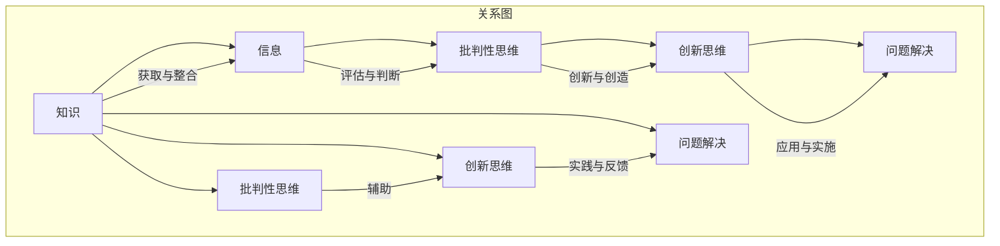
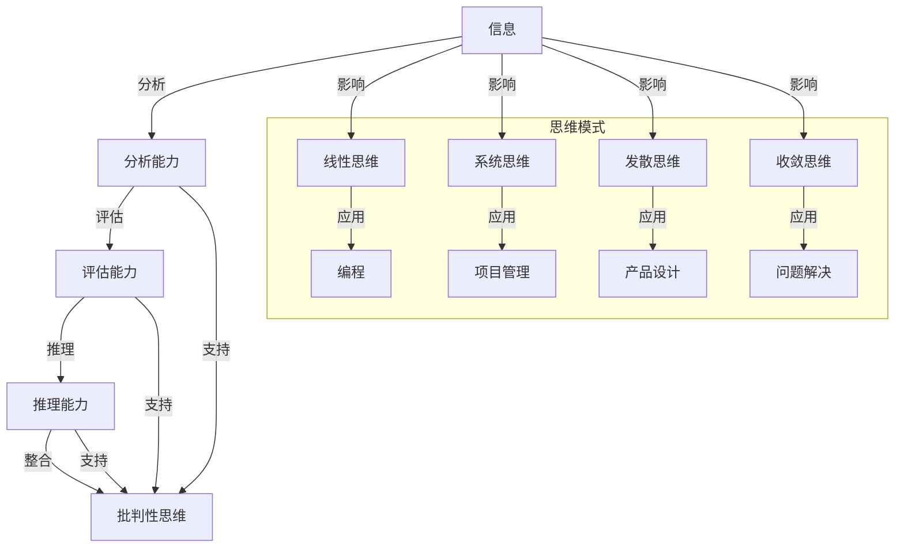

                 

### 引言：独立思考的重要性

在信息爆炸的时代，独立思考的能力变得比以往任何时候都更加重要。随着互联网的普及和信息的迅速传播，我们每天都能接触到海量的信息。这些信息不仅包括新闻、科研进展，还涵盖了社交媒体上的各种观点和评论。然而，信息的多维度和复杂性使得人们难以对所有信息进行有效处理和判断。在这种情况下，独立思考能力成为我们应对信息过载、做出理性决策的关键。

独立思考是指不依赖外部权威，能够自主进行判断和推理的能力。它不仅能够帮助我们在面对新信息时保持冷静和理性，还能促进我们在解决问题和面对挑战时提出创新性的解决方案。在信息技术领域，独立思考尤为重要。这是因为信息技术的发展速度极快，新的技术、工具和理论层出不穷，只有具备独立思考能力的人才能在复杂的环境中不断学习、进步，并贡献自己的智慧。

本文将围绕独立思考在信息爆炸时代的重要性展开讨论，旨在帮助读者认识到独立思考的价值，并掌握一些有效的培养方法。文章将分为以下几个部分：

1. **背景介绍**：简要介绍信息爆炸时代的特点及其对独立思考能力的影响。
2. **核心概念与联系**：阐述独立思考的核心概念，并使用Mermaid流程图展示这些概念之间的关系架构。
3. **知识获取与处理**：讨论如何有效获取和筛选信息，以及如何进行知识的整合和应用。
4. **思维模式与批判性思维**：分析不同的思维模式，并探讨批判性思维在独立思考中的作用。
5. **创新思维与问题解决**：介绍创新思维的类型及其培养方法，以及问题解决的方法与步骤。
6. **社交媒体与信息过载**：探讨社交媒体的利弊，以及如何应对信息过载。
7. **实际应用与案例分析**：通过实际案例展示独立思考能力的应用，并进行详细讲解。
8. **心理学与哲学视角**：从心理学和哲学的角度分析独立思考的内在机制。
9. **未来趋势与策略**：展望未来社会对独立思考能力的需求，并给出培养策略。

希望通过这篇文章，读者能够深入理解独立思考的重要性，并掌握一些实用的培养方法，从而在信息爆炸的时代中更好地应对挑战，实现个人成长。

### 背景介绍

在信息爆炸的时代，数据的生成和传播速度前所未有地加快。根据市场研究公司的数据，全球每天产生的数据量已经超过了5EB（艾字节），这相当于每秒约产生55.5 TB的数据。这些数据涵盖了各种来源，包括社交媒体更新、企业交易记录、科学研究文献、物联网设备产生的数据等。信息爆炸带来了前所未有的便利，但也使得信息处理和判断变得极为复杂。

首先，信息的庞大规模使得人们难以在短时间内对海量信息进行有效筛选和消化。即使在同一领域内，不同来源的信息也可能存在冲突或矛盾，这进一步增加了判断的难度。此外，信息的传播速度极快，往往还没有完全消化和理解某个信息，另一个新的信息就已经出现，这导致人们容易陷入信息过载的困境。

其次，信息的多样性和复杂性也增加了思考的难度。如今，我们不仅需要处理传统的文字和图片信息，还需要理解和分析音频、视频等多媒体内容。此外，不同领域的专业知识也在不断更新，要求人们具备跨领域的综合能力和独立思考能力。

再者，社交媒体的兴起极大地改变了信息的传播方式。在社交媒体平台上，每个人都可以成为信息发布者，这导致信息的真实性和可信度难以保证。信息的真伪、观点的极端化以及情绪化的表达，使得人们在获取信息时容易受到误导，从而影响独立思考的能力。

最后，信息爆炸时代也对人们的思维方式产生了影响。由于信息获取变得容易，人们往往更倾向于依赖现有的信息和分析结果，而不是进行独立思考。这种依赖性不仅降低了独立思考的能力，还可能导致思维的僵化和缺乏创新能力。

总之，信息爆炸时代的特点使得独立思考的能力变得更加重要。只有通过独立思考，我们才能在信息海洋中保持清晰的判断力，克服信息过载带来的挑战，并在复杂的环境中做出明智的决策。接下来的章节将详细探讨如何培养这种宝贵的思维能力。

### 核心概念与联系

独立思考是一个复杂的过程，涉及多个核心概念。为了更好地理解这些概念之间的关系，我们可以使用Mermaid流程图来展示它们如何相互关联。

首先，我们定义几个核心概念：知识、信息、批判性思维、创新思维和问题解决。

1. **知识**：知识是通过学习、研究和实践获得的信息和经验。它是独立思考的基础。
2. **信息**：信息是知识的一部分，它以各种形式存在，如数据、事实、观点等。
3. **批判性思维**：批判性思维是指对信息进行评估、分析和判断的能力。它有助于识别信息的真实性和可靠性。
4. **创新思维**：创新思维是指产生新观点、新方法和新解决方案的能力。它是在批判性思维基础上，通过创造性思考实现的。
5. **问题解决**：问题解决是指通过分析和应用已有知识，找到解决问题的方法和步骤。

使用Mermaid流程图，我们可以展示这些概念之间的关系：



在这个流程图中，我们可以看到知识是整个过程的起点，它通过获取、整合和评估转化为信息。批判性思维在这个过程中起到关键作用，通过对信息的评估和分析，筛选出真实可靠的信息。创新思维则在此基础上，通过创造性的思考产生新的观点和解决方案。最后，问题解决是将这些新观点和解决方案应用到实际问题中，实现知识的有效应用。

通过这个Mermaid流程图，我们可以清晰地理解独立思考过程中各个核心概念之间的逻辑关系，为后续章节的详细讨论奠定了基础。

### 知识获取与处理

在信息爆炸的时代，知识获取和处理的效率成为独立思考能力的关键。为了在浩瀚的信息海洋中筛选出有价值的信息，我们需要掌握一些有效的策略和方法。

首先，有效学习策略是获取知识的基础。以下是一些关键策略：

1. **目标明确**：在开始学习之前，明确学习目标和内容范围。这有助于集中精力，避免分散注意力。
2. **主动学习**：主动参与学习过程，通过提问、讨论和实验等方式加深对知识的理解和记忆。
3. **多渠道学习**：利用多种学习资源，如书籍、学术论文、在线课程和实际项目等，从不同角度获取知识。
4. **定期复习**：定期复习所学内容，巩固记忆，提高知识的应用能力。

其次，信息筛选与验证是确保知识准确性和可靠性的关键步骤。以下是一些有效的方法：

1. **来源验证**：确认信息的来源是否可靠。对于网络上的信息，可以通过查阅出处、作者背景和机构声誉来评估其可信度。
2. **交叉验证**：通过查阅多个来源的信息，验证信息的准确性和一致性。如果多个可信来源都给出了相同的信息，那么这个信息的可靠性就更高。
3. **专家意见**：咨询领域内的专家或权威人士，他们的观点和见解可以提供宝贵的参考。
4. **数据支持**：对于涉及数据的结论，可以通过查看原始数据和分析方法来评估其合理性。

最后，知识的整合与应用是将所学知识转化为实际能力的关键。以下是一些关键步骤：

1. **知识整合**：将零散的知识点整合成一个完整的体系。这可以通过绘制思维导图、制作知识图谱等方式实现。
2. **实践应用**：将所学知识应用到实际问题和项目中。通过实际操作，不仅可以加深对知识的理解，还能发现知识在实际应用中的局限性。
3. **反馈与迭代**：在应用过程中，收集反馈并不断迭代改进。这有助于完善知识体系，提高解决问题的能力。
4. **持续学习**：知识不是静态的，而是不断发展和变化的。持续学习新的知识和技能，保持对领域内最新进展的了解。

以下是一个知识获取与处理的伪代码示例：

```plaintext
function knowledge_acquisition_and_processing(target, resources):
    # 初始化知识库
    knowledge_base = initialize_knowledge_base()

    # 确定学习目标
    set_learning_objective(target)

    # 获取多渠道资源
    for resource in resources:
        if verify_source(resource):
            extract_and_integrate_knowledge(resource, knowledge_base)

    # 验证知识准确性
    for piece_of_knowledge in knowledge_base:
        if cross_validate_knowledge(piece_of_knowledge) and expert_opinion():
            accurate_knowledge_base.append(piece_of_knowledge)
        else:
            reject_knowledge(piece_of_knowledge)

    # 知识整合与应用
    integrated_knowledge = integrate_knowledge(accurate_knowledge_base)

    # 实践应用与反馈
    apply_knowledge_to_practical_situation(integrated_knowledge)
    feedback = collect_feedback()

    # 反馈迭代
    if feedback:
        iterate_knowledge_based_on_feedback(integrated_knowledge, feedback)
    
    return integrated_knowledge
```

通过上述策略和方法，我们可以有效地获取、筛选和整合知识，并将其应用到实际问题中。这不仅有助于提高独立思考能力，还能在信息爆炸的时代中更好地应对挑战。

### 思维模式与批判性思维

在独立思考的过程中，思维模式和批判性思维起着至关重要的作用。不同的思维模式决定了我们看待和处理问题的角度，而批判性思维则帮助我们在复杂的信息环境中保持理性，做出明智的决策。

首先，让我们探讨几种常见的思维模式：

1. **线性思维**：线性思维是一种按部就班、顺序推进的思考方式。它强调逻辑的严密性和步骤的连贯性。例如，在编程中，我们通常按照顺序执行代码，每一步都基于前一步的结果。
   
2. **系统思维**：系统思维关注整体性和相互关系。它强调将问题视为一个复杂的系统，分析各个部分之间的相互作用。例如，在项目管理中，系统思维可以帮助我们理解项目各个阶段之间的依赖关系，从而更有效地分配资源和时间。

3. **发散思维**：发散思维是一种开放性、创意性的思考方式。它鼓励我们从多个角度看待问题，寻找不同的解决方案。例如，在设计新的产品时，发散思维可以帮助团队提出多种创意，从而产生突破性的创新。

4. **收敛思维**：收敛思维是一种集中性、针对性强的思考方式。它帮助我们将思维聚焦在核心问题或解决方案上。例如，在问题解决过程中，收敛思维可以帮助我们快速筛选出有效的解决方案。

这些思维模式各自有不同的优势和适用场景，但独立思考需要我们灵活运用这些模式，根据实际情况进行调整。

批判性思维则是在独立思考过程中不可或缺的一环。批判性思维是指对信息进行深入分析、评估和推理的能力。它包括以下几个关键要素：

1. **分析能力**：批判性思维要求我们能够深入分析问题，理解问题的本质和内在逻辑。例如，在阅读一篇学术论文时，我们需要分析其研究方法、假设和结论，判断其可靠性和有效性。

2. **评估能力**：批判性思维还包括对信息进行评估的能力。我们需要评估信息的来源、方法、数据支持以及结论的合理性。例如，在评估一个市场研究报告时，我们需要考虑其数据收集方法、样本代表性和结论的普适性。

3. **推理能力**：批判性思维要求我们能够逻辑严谨地推理，从已知信息推导出新的结论。例如，在编程中，我们需要根据需求分析和逻辑推理，设计出符合要求的功能模块。

为了更好地理解这些概念之间的关系，我们可以使用以下Mermaid流程图：



在这个流程图中，我们可以看到信息是整个过程的起点，通过分析、评估和推理，我们形成批判性思维。同时，不同的思维模式（线性思维、系统思维、发散思维和收敛思维）在这些过程中发挥作用，影响我们的思考和决策。

在实际应用中，批判性思维可以帮助我们识别和纠正错误，避免盲目跟从他人观点，从而做出更加理性和有根据的决策。例如，在技术决策中，通过批判性思维，我们可以评估不同技术的优势和劣势，选择最合适的技术方案。

总之，思维模式和批判性思维是独立思考的核心要素。通过灵活运用不同的思维模式，并结合批判性思维，我们可以在信息爆炸的时代中更好地应对挑战，做出明智的决策。

### 创新思维与问题解决

在信息爆炸的时代，创新思维和问题解决能力变得尤为重要。创新思维不仅有助于我们应对不断变化的环境，还能推动技术和社会的进步。问题解决则是对创新思维的应用，它将创新性的想法转化为实际可行的解决方案。以下将详细介绍创新思维的类型、培养方法以及问题解决的方法与步骤。

#### 创新思维的类型

创新思维可以分为以下几种类型：

1. **发散性思维**：发散性思维是一种开放性、创意性的思考方式。它通过从多个角度出发，寻找多种可能的解决方案。这种思维方式有助于我们突破传统的限制，发现新颖的想法。

2. **收敛性思维**：与发散性思维相对，收敛性思维是一种集中性、针对性强的思考方式。它通过筛选和聚焦，从多个备选方案中找到最优解。这种思维方式有助于我们有效解决问题，提高决策效率。

3. **逆向思维**：逆向思维是一种从相反方向出发的思考方式。它通过反向思考，颠覆传统的观念和方法，从而找到创新的解决方案。例如，在设计新产品时，逆向思维可以帮助我们重新考虑产品的功能和结构。

4. **联想思维**：联想思维是一种通过事物之间的关联进行思考的方式。它通过将看似无关的事物联系起来，发现新的联系和可能性。例如，在科研中，通过联想不同的实验结果，可以找到新的研究方向。

5. **系统思维**：系统思维是一种关注整体性和相互关系的思考方式。它通过分析系统内部各个部分之间的相互作用，找到优化系统整体性能的方法。例如，在项目管理中，系统思维可以帮助我们识别项目中的关键环节，从而更有效地管理项目进度。

#### 创新思维的培养方法

要培养创新思维，可以采取以下几种方法：

1. **多学科学习**：通过学习不同领域的知识，拓宽视野，提高跨领域思考的能力。这有助于我们在面对问题时，能够从多个角度思考，提出创新的解决方案。

2. **思维训练**：通过进行思维训练，如头脑风暴、思维导图等，锻炼思维的灵活性和创造性。这些训练可以帮助我们在短时间内产生大量创意，从而培养创新思维。

3. **体验与探索**：通过实际体验和探索，积累实践经验。例如，参与实验、项目实践等，可以让我们在实践中发现问题和需求，从而激发创新思维。

4. **批判性思维**：批判性思维有助于我们识别和分析问题，从而找到创新的解决方案。通过批判性思维，我们可以挑战现有的观念和方法，寻找改进的机会。

5. **持续学习**：创新思维不是一成不变的，而是需要不断学习和更新。通过关注领域内的最新进展，了解新兴技术和理论，可以不断激发创新思维。

#### 问题解决的方法与步骤

问题解决是将创新思维应用于实际问题的过程。以下是一个典型的问题解决方法和步骤：

1. **识别问题**：首先，明确问题是什么，包括问题的现象、原因和影响。这有助于我们理解问题的本质，为后续的解决方案提供方向。

2. **分析问题**：通过收集和分析相关信息，深入理解问题的各个方面。这包括问题的历史、现状和潜在因素。通过分析，我们可以找到问题的根源，为解决方案提供依据。

3. **提出解决方案**：基于问题的分析，提出多种可能的解决方案。在这个过程中，可以运用发散性思维，探索不同的解决方案。同时，结合实际情况，评估这些方案的可行性。

4. **评估和选择**：对提出的解决方案进行评估和选择。评估的标准可以包括方案的创新性、可行性、成本和效果等。通过评估，我们可以选择最优的解决方案。

5. **实施解决方案**：将选定的解决方案转化为实际行动。在这个过程中，可能需要进行调整和优化，以确保解决方案的有效性。

6. **监控与反馈**：在实施解决方案的过程中，持续监控实施效果，并收集反馈。通过反馈，我们可以发现问题和不足，并进行相应的调整和改进。

7. **总结与回顾**：在问题解决完成后，进行总结和回顾。这有助于我们积累经验，为未来的问题解决提供参考。

以下是一个问题解决方法的伪代码示例：

```plaintext
function problem_solving(problem):
    # 识别问题
    identified_problem = identify_problem(problem)

    # 分析问题
    analyzed_problem = analyze_problem(identified_problem)

    # 提出解决方案
    solutions = propose_solutions(analyzed_problem)

    # 评估和选择解决方案
    selected_solution = evaluate_and_choose_solution(solutions)

    # 实施解决方案
    implementation = implement_solution(selected_solution)

    # 监控与反馈
    feedback = monitor_and_collect_feedback(implementation)

    # 总结与回顾
    summary = summarize_and_review(feedback)

    return summary
```

通过创新思维和问题解决的方法和步骤，我们可以在信息爆炸的时代中更好地应对挑战，提出创新的解决方案。这不仅有助于个人和组织的成长，还能推动整个社会的发展。

### 社交媒体与信息过载

在信息爆炸的时代，社交媒体已成为我们获取信息、交流观点的重要平台。然而，社交媒体的双重性也带来了信息过载的问题。一方面，社交媒体的便捷性和实时性为我们提供了海量的信息和多样的观点；另一方面，过多的信息容易导致我们陷入信息过载的困境，影响独立思考能力。

#### 社交媒体的利与弊

社交媒体的利在于：

1. **信息传播速度快**：社交媒体可以迅速传播信息，使得新闻事件、科技进展等能够在短时间内被广泛知晓。
2. **互动性强**：社交媒体支持用户之间的互动，使得信息传播更加立体和丰富，促进了观点的交流和碰撞。
3. **知识分享**：通过社交媒体，用户可以分享自己的知识和经验，从而扩大知识的传播范围，提高整体知识水平。

然而，社交媒体也存在一些弊端：

1. **信息真实性难以保证**：社交媒体上的信息来源多样，其中不乏虚假信息和误导性内容。这使得用户在获取信息时需要花费额外的时间和精力进行验证。
2. **观点极端化**：社交媒体上的讨论往往容易引发极端观点，导致群体极化现象。这种现象不仅影响了独立思考，还可能导致社会矛盾的加剧。
3. **时间浪费**：由于社交媒体上的内容丰富多样，用户很容易沉迷于浏览信息，从而浪费大量时间和精力。

#### 信息过载的原因与影响

信息过载的原因主要包括以下几点：

1. **信息量过多**：随着互联网的发展，每天产生的数据量以指数级增长。这使得用户难以在短时间内消化和处理所有信息。
2. **信息种类繁多**：除了文字和图片，社交媒体还涵盖了音频、视频等多媒体内容。这些多样化的信息形式增加了用户筛选和处理的难度。
3. **信息更新速度快**：社交媒体上的信息更新频繁，用户需要不断地刷新页面以获取最新的信息。这种快速的信息流动使得用户难以集中精力进行深入思考。

信息过载对独立思考能力的影响表现为：

1. **判断力下降**：过多的信息容易使人们陷入选择困境，难以做出理性的判断。长期处于信息过载状态，用户的判断力会逐渐下降。
2. **注意力分散**：信息过载导致用户注意力分散，难以集中精力处理单一任务。这影响了思考的深度和效率。
3. **思维僵化**：在面对大量信息时，用户容易依赖现有的信息和观点，缺乏独立思考和创新思维。

#### 应对信息过载的策略

为了应对信息过载，我们可以采取以下策略：

1. **设置信息过滤机制**：通过使用信息过滤工具和算法，筛选出重要和可靠的信息，减少无效信息的干扰。
2. **定期休息**：在社交媒体上浏览信息时，定期休息，避免长时间沉迷。这有助于恢复注意力和思考能力。
3. **专注训练**：通过专注力训练，提高自己集中精力处理单一任务的能力。例如，使用番茄钟技术，将工作时间分成25分钟的工作周期和5分钟的休息周期。
4. **信息分类管理**：对获取的信息进行分类管理，将重要信息存储在专门的文件夹或笔记工具中，以便随时查阅。
5. **批判性思维**：在处理信息时，运用批判性思维，对信息的真实性和可信度进行评估，避免盲目接受信息。

以下是一个信息过载应对策略的伪代码示例：

```plaintext
function handle_information_overload(information_stream):
    # 设置信息过滤机制
    filtered_stream = filter_relevant_informations(information_stream)

    # 定期休息
    schedule_breaks()

    # 专注训练
    improve_focus()

    # 信息分类管理
    categorized_informations = categorize_informations(filtered_stream)

    # 批判性思维
    critically_analyze_informations(categorized_informations)

    return categorized_informations
```

通过上述策略，我们可以有效应对信息过载，保护独立思考能力，提高信息处理效率。在信息爆炸的时代，独立思考能力的培养不仅是个人发展的关键，也是社会进步的重要驱动力。

### 实际应用与案例分析

为了更好地理解独立思考能力的应用，我们可以通过一些实际案例来展示其在不同场景中的效果。以下案例分别来自教育领域、职场以及社交媒体环境，详细说明了独立思考能力的培养与应用。

#### 案例分析一：教育领域

**背景**：在许多教育体系中，学生往往习惯于被动接受知识，缺乏独立思考和批判性思维能力。这导致他们在面对复杂问题时，难以提出创新性的解决方案。

**案例**：某中学在课程中引入了项目式学习（Project-Based Learning, PBL）方法，鼓励学生通过实际项目来培养独立思考能力。

**实施过程**：
1. **选题与目标**：教师与学生共同确定项目主题，如“如何改善校园环境”。
2. **信息收集**：学生通过查阅书籍、网络资源、访谈等方式收集相关信息，包括校园环境问题的现状、可能的解决方案等。
3. **批判性思维**：在收集信息的过程中，学生使用批判性思维工具，如SWOT分析（Strengths, Weaknesses, Opportunities, Threats），评估不同解决方案的优缺点。
4. **创新思维**：学生通过头脑风暴和思维导图，提出多种创新性的解决方案，如引入智能垃圾桶、实施垃圾分类等。
5. **问题解决**：学生选择最佳方案，并制定详细的实施计划。他们在实施过程中不断调整和优化方案，以应对可能出现的问题。
6. **反馈与总结**：项目完成后，学生进行反思和总结，分享他们在项目中的所学所得。

**效果**：通过项目式学习，学生不仅掌握了知识，还培养了独立思考和批判性思维能力。他们在面对实际问题时，能够提出创新的解决方案，从而提高了问题解决能力。

#### 案例分析二：职场

**背景**：在职场中，独立思考能力对于员工的发展和企业的创新至关重要。然而，许多员工往往习惯于遵循既定流程，缺乏独立思考和自主创新的动力。

**案例**：某科技公司通过一系列措施，培养员工的独立思考能力和创新思维。

**实施过程**：
1. **培训与引导**：公司定期举办思维训练和创新思维工作坊，帮助员工掌握批判性思维和创造性思维技巧。
2. **项目制工作**：鼓励员工参与项目制工作，给予他们更多的自主权，让他们在项目中自主决策和解决问题。
3. **开放沟通**：建立开放、透明的沟通机制，鼓励员工提出自己的想法和改进建议。
4. **奖励机制**：设立创新奖励，激励员工提出创新性解决方案。
5. **跨部门协作**：通过跨部门协作，促进不同背景的员工之间的交流，激发创新思维。
6. **反思与总结**：定期召开反思会议，总结工作中的经验教训，不断改进工作方法。

**效果**：通过这些措施，公司的员工独立思考和创新能力得到了显著提升。他们在面对挑战时，能够提出创新的解决方案，推动了企业的持续创新和进步。

#### 案例分析三：社交媒体环境

**背景**：社交媒体环境充满了海量信息，用户容易受到信息过载的困扰，缺乏独立思考的能力。

**案例**：某社交平台推出了一项“独立思考挑战”活动，鼓励用户在平台上发表独立的观点和评论。

**实施过程**：
1. **活动宣传**：通过平台公告和社群推广，宣传“独立思考挑战”活动，吸引用户的参与。
2. **主题设定**：设定不同的主题，如科技发展、社会问题等，引导用户就这些主题发表独立思考的见解。
3. **内容审核**：对用户发表的内容进行审核，确保其具有独立性和思考深度。
4. **互动机制**：建立互动机制，鼓励用户之间进行理性讨论，相互启发和纠正。
5. **评选与奖励**：定期评选出优秀独立思考作品，给予用户奖励和荣誉。
6. **持续推广**：通过持续推广和活动更新，保持用户参与的积极性。

**效果**：通过这项活动，用户在社交媒体上的发言变得更加理性和独立，独立思考能力得到了提升。同时，平台上的讨论质量也得到了显著提高，营造了一个更加理性、健康的社交环境。

通过这些实际案例，我们可以看到，独立思考能力在各个领域中的应用效果显著。无论是在教育、职场还是社交媒体环境中，独立思考能力都是推动个人和组织进步的重要力量。

### 心理学与独立思考

从心理学的角度来看，独立思考是一种复杂的心智过程，它受到多种心理因素的影响。理解这些因素有助于我们更好地培养和提升独立思考能力。

首先，**认知偏见**是影响独立思考的一个关键因素。认知偏见是指人们在处理信息时，因心理惯性或情绪影响而产生的错误思维方式。常见的认知偏见包括确认偏见、过度自信、群体思维等。确认偏见是指人们倾向于寻找和记住那些支持自己观点的信息，而忽视或贬低相反的信息。过度自信则是指人们对自身判断能力的过高估计，从而忽视潜在的错误。群体思维则是指人们在群体中为了保持一致性而放弃独立思考，从而导致集体决策的偏差。

其次，**情绪管理**在独立思考中起着重要作用。情绪对认知过程有显著影响，积极的情绪可以提高创造力，而消极的情绪则可能限制独立思考的能力。研究表明，情绪调节技巧如正念冥想和情感焦点训练可以有效地帮助个体在情绪波动时保持冷静和理性，从而提高独立思考的质量。

此外，**自我效能感**（self-efficacy）也是独立思考的重要心理基础。自我效能感是指个体对自己能够成功完成特定任务的信心。高自我效能感的人更倾向于面对挑战，尝试新的方法，并且在遇到困难时保持坚持不懈。相反，低自我效能感的人可能会因为缺乏信心而放弃独立思考，或者在面对复杂问题时感到无力和困惑。

为了培养独立思考能力，以下是一些心理学策略：

1. **认知训练**：通过认知训练，如逻辑推理、决策模拟等，提高个体识别和纠正认知偏见的能力。
2. **情绪调节**：学习情绪调节技巧，如正念冥想、情感焦点训练等，帮助个体在情绪波动时保持冷静和理性。
3. **自我效能感培养**：通过成功的小目标实现，逐步建立自我效能感，从而增强个体面对挑战的信心和勇气。

以下是一个结合心理学策略的独立思考培养方法伪代码示例：

```plaintext
function cultivate_independent_thinking(cognitive_bias, emotion, self_efficacy):
    # 认知训练
    cognitive_training = train_cognitive_skills(cognitive_bias)

    # 情绪调节
    emotion_management = practice_emotion_regulation(emotion)

    # 自我效能感培养
    self_efficacy_boost = build_self_efficacy(self_efficacy)

    # 持续反馈与调整
    feedback_loop = continuous_feedback(cognitive_training, emotion_management, self_efficacy_boost)

    return feedback_loop
```

通过这些心理学策略，我们可以更有效地培养独立思考能力，使其成为我们在信息爆炸时代中应对挑战、实现个人成长的重要工具。

### 哲学与独立思考

从哲学的角度来看，独立思考不仅是个人发展的关键，也是社会进步的推动力。哲学作为一门探讨存在、真理、价值和知识的学科，为我们提供了深刻的思考和反思工具。以下将探讨哲学对独立思考的启示，并阐述独立思考与哲学思维的关联。

首先，**哲学对独立思考的启示**体现在其强调理性和批判精神上。哲学起源于对自然、社会和人类自身的深入反思，它鼓励我们质疑既定观念，追求真理和智慧。例如，苏格拉底的“无知之知”观点指出，真正的智慧来自于对自身无知的认识。这意味着，独立思考需要我们首先认识到自己的局限性和知识的不足，从而保持开放的心态，不断探索和质疑。

其次，**哲学思维与独立思考的关联**主要体现在以下几个方面：

1. **逻辑推理**：哲学强调逻辑推理的重要性。通过逻辑推理，我们能够将复杂的思维过程条理化、清晰化。例如，亚里士多德的逻辑学方法强调通过定义、分类和演绎推理来探讨问题。这种方法论可以帮助我们在思考过程中保持逻辑严谨，避免思维的混乱。

2. **批判性思维**：哲学思维是一种批判性思维，它鼓励我们不断质疑和反思。笛卡尔的“我思故我在”强调通过怀疑一切来找到绝对可靠的真理。这种批判性思维有助于我们在面对复杂问题时，不被表面的现象所迷惑，深入挖掘问题的本质。

3. **价值判断**：哲学探讨价值观和道德标准，帮助我们形成独立的价值判断。例如，康德的道德哲学强调通过理性来做出道德判断，而不是依赖情感或社会习俗。这种价值判断的独立性有助于我们在面对道德困境时，做出符合自身价值观的决策。

为了更好地理解哲学思维在独立思考中的应用，我们可以通过一个实际例子来说明。假设我们面临一个关于人工智能伦理的讨论。在哲学思维的引导下，我们可以采取以下步骤：

1. **定义问题**：明确我们讨论的核心问题，例如“人工智能的发展是否应该受到伦理限制？”
2. **收集信息**：查阅相关的哲学文献、学术论文和技术报告，了解不同观点和理论。
3. **逻辑分析**：通过逻辑推理，分析不同观点的逻辑一致性。例如，我们可以探讨技术乐观派和伦理悲观派的观点，评估其合理性和局限性。
4. **价值判断**：基于道德和伦理原则，进行价值判断。例如，我们可以从尊重人的权利和隐私的角度，评估人工智能应用的可能风险。
5. **综合结论**：在逻辑分析和价值判断的基础上，形成综合结论。例如，我们可能认为在人工智能发展中，应采取一定的伦理限制，以确保其对社会和人类福祉的积极影响。

通过哲学思维的引导，我们能够在复杂的问题中保持清晰的思考，形成独立和理性的判断。这不仅有助于我们在学术和职业领域中的发展，也能为社会的进步贡献智慧和力量。

### 未来趋势与独立思考

随着信息技术的不断进步和社会变革的加速，未来社会对独立思考能力的需求将更加突出。以下是未来社会对独立思考能力的需求、培养策略以及可能的挑战和应对措施。

#### 未来社会对独立思考能力的需求

1. **科技创新的推动**：未来社会将充满创新，从人工智能、生物技术到纳米技术等新兴领域将持续涌现。独立思考能力对于应对这些变化和推动技术进步至关重要。只有具备独立思考能力的人，才能在快速变化的科技环境中迅速适应并创新。

2. **复杂问题的解决**：随着全球问题的复杂化，如气候变化、能源危机、人口增长等，需要更多的独立思考来寻找有效的解决方案。独立思考能力可以帮助人们从多个角度分析问题，提出创新的解决方案，从而应对这些挑战。

3. **信息过载的应对**：在信息爆炸的时代，信息的筛选和处理能力成为独立思考的重要组成部分。未来社会需要人们具备更强的信息处理能力，以应对海量信息的冲击，并从中筛选出有价值的信息。

4. **跨学科整合**：未来社会的发展将更加依赖跨学科的知识整合。独立思考能力能够帮助人们在不同领域之间建立联系，从而实现跨学科的整合和创新。

#### 培养独立思考能力的策略

1. **教育体系的改革**：教育体系应更加注重培养学生的批判性思维和创造力。通过引入项目式学习、跨学科课程和思维训练等方法，提高学生的独立思考能力。

2. **终身学习的推广**：未来社会变化快速，终身学习成为持续发展的关键。通过终身学习，人们可以不断更新知识，提高独立思考能力。

3. **鼓励创新和实践**：社会应鼓励创新和实践，为人们提供更多的机会去尝试和实验。这可以通过创业支持、创新竞赛和实践活动来实现。

4. **科技与人文结合**：在培养独立思考能力的过程中，应注重科技与人文的结合。通过了解历史、文化和哲学，人们可以更好地理解科技的影响，从而进行更深入的思考。

#### 挑战与应对措施

1. **信息过载的挑战**：未来社会信息量将继续增加，如何有效应对信息过载成为一大挑战。应对措施包括发展更加智能的信息筛选工具，培养更强的信息处理能力，以及提升批判性思维能力。

2. **技术依赖的问题**：随着技术的进步，人们可能会过度依赖技术，影响独立思考能力。应对措施包括提高对技术依赖的意识，鼓励人们进行反思和独立思考，以及通过教育和培训提高独立思考能力。

3. **社会压力的挑战**：未来社会竞争激烈，社会压力可能会抑制独立思考。应对措施包括创建一个支持性和包容性的社会环境，鼓励人们表达自己的观点，以及通过心理健康教育和咨询来减轻社会压力。

通过上述策略和应对措施，我们可以更好地培养和提升独立思考能力，从而在未来的社会中保持竞争力，实现个人和社会的进步。

### 结论

在信息爆炸的时代，独立思考能力的重要性愈发凸显。本文通过对独立思考的定义、知识获取与处理、思维模式与批判性思维、创新思维与问题解决、社交媒体与信息过载、实际应用与案例分析、心理学与哲学视角以及未来趋势与策略的探讨，详细阐述了独立思考在各个领域中的应用和培养方法。我们认识到，独立思考不仅有助于我们在信息海洋中保持清晰的判断力，还能推动个人和社会的进步。

为了在未来的信息爆炸时代中更好地应对挑战，以下是一些建议：

1. **持续学习与反思**：保持对知识的渴望，不断更新自己的知识库，并通过反思和总结来巩固所学。
2. **培养批判性思维**：学会质疑和评估信息，避免盲目接受观点，通过批判性思维提高判断力。
3. **实践与创新**：通过实践和实验，将所学知识应用到实际问题中，培养创新思维和问题解决能力。
4. **情绪管理**：学会情绪调节，保持冷静和理性，避免情绪波动影响独立思考。
5. **终身学习**：未来社会变化迅速，终身学习是保持竞争力的关键，不断学习新知识，适应新的挑战。

让我们共同努力，培养和提升独立思考能力，在信息爆炸的时代中找到自己的定位，实现个人和社会的共同进步。

### 拓展阅读

为了深入理解独立思考和培养方法，以下是几本推荐的书籍和资源，供读者进一步学习和探索：

1. **《独立思考的艺术》（The Art of Thinking Clearly）** - 作者：Rolf Dobelli
   - 本书详细介绍了如何识别和克服认知偏见，提高独立思考能力。

2. **《批判性思维工具》（Critical Thinking Tools for Taking Charge of Your Learning and Your Life）** - 作者：Richard Paul & Linda Elder
   - 本书提供了丰富的批判性思维工具和方法，帮助读者提升分析问题和解决问题的能力。

3. **《创新者的思考方式》（The Innovator's Mindset）** - 作者：George Couros
   - 本书探讨了创新思维的重要性，以及如何在教育环境中培养创新者的思维方式。

4. **《深度工作》（Deep Work）** - 作者：Cal Newport
   - 本书介绍了如何在信息泛滥的时代中，通过深度工作提升专注力和独立思考能力。

5. **《高效能人士的七个习惯》（The 7 Habits of Highly Effective People）** - 作者：Stephen R. Covey
   - 本书提供了全面的个人发展和时间管理策略，帮助读者培养高效能和独立思考能力。

6. **《人工智能的未来》（The Future of Humanity: Terraforming Mars, Interstellar Travel, Immortality, and Our Destiny Beyond Earth）** - 作者：Michio Kaku
   - 本书探讨了人工智能和科技发展的未来趋势，以及如何在这些变化中保持独立思考。

这些书籍和资源为读者提供了丰富的理论和实践指导，帮助他们在信息爆炸的时代中更好地培养独立思考能力。通过不断学习和实践，我们可以不断提升自己的思维能力，迎接未来的挑战。

### 作者信息

作者：AI天才研究院/AI Genius Institute & 禅与计算机程序设计艺术 /Zen And The Art of Computer Programming
- **AI天才研究院**（AI Genius Institute）致力于推动人工智能技术和独立思考能力的培养，是一家领先的研究机构。
- **禅与计算机程序设计艺术**（Zen And The Art of Computer Programming）是作者Donald E. Knuth的经典著作，深刻探讨了计算机科学和哲学的关系。

