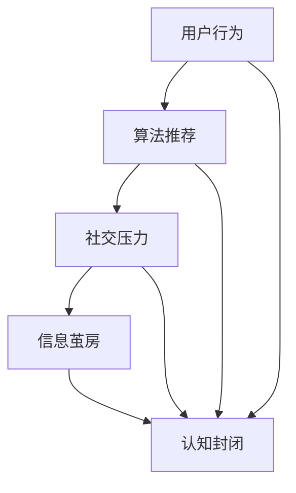
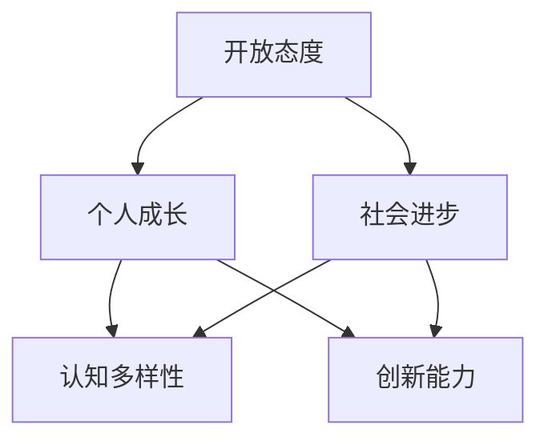
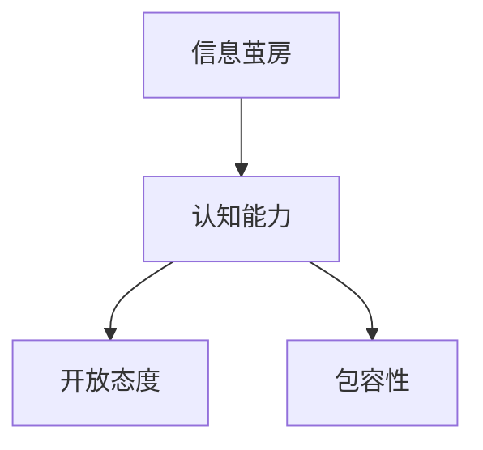
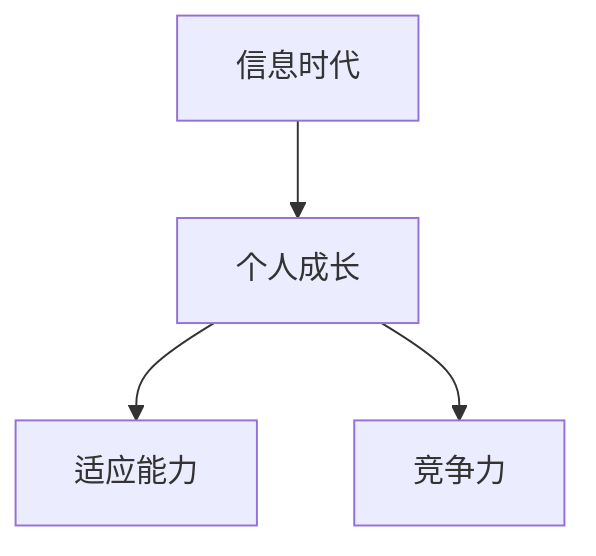
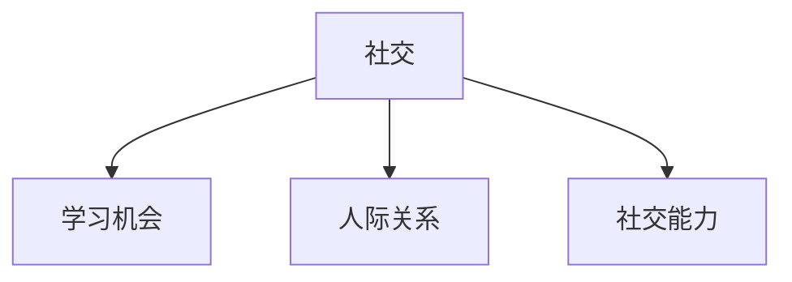
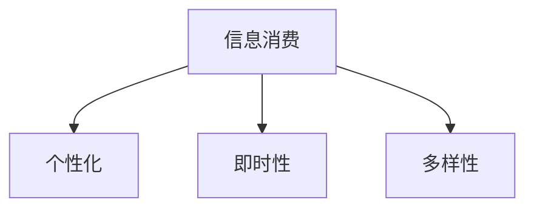
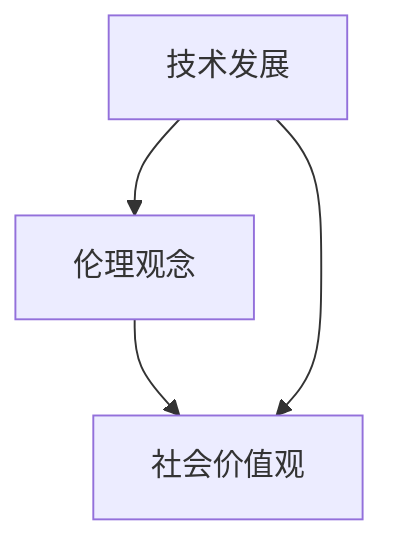

                 

### 文章标题：在信息茧房中寻找真相：培养开放和包容的态度

#### 关键词：
- 信息茧房
- 开放态度
- 包容性
- 认知能力
- 社会变革

#### 摘要：
本文探讨了信息时代下“信息茧房”现象的产生及其对个人和社会的影响，提出了培养开放和包容态度的重要性。文章首先介绍了信息茧房的概念，随后分析了其成因和影响，接着探讨了开放和包容态度的核心概念及其培养方法。文章还详细阐述了提高认知能力的策略，通过实际案例和项目实战，展示了如何在实际生活中应用这些理念。最后，文章提出了对未来社会变革的展望，强调了开放和包容态度在信息技术发展中的关键作用。

### 第1章：信息茧房的概念与影响

#### 1.1 什么是信息茧房

**核心概念与联系：** 信息茧房（Information Cocoon）是指人们在信息接收和处理过程中，由于各种原因，形成的一种对信息选择性的倾向，导致个体在认知上逐渐与外界隔离，形成封闭的信息环境。这种现象通常是由于用户行为、算法推荐、社交压力等多种因素共同作用的结果。

**概念原理之间的关系架构（Mermaid 流程图）：**


**核心算法原理讲解（伪代码）：**
```python
def information_cocoon(user, algorithm, social_pressure):
    # 用户行为偏好
    user_preferences = get_user_preferences(user)
    
    # 算法推荐
    recommended_content = algorithm.recommend(user_preferences)
    
    # 社交压力
    social_influence = calculate_social_influence(user, social_pressure)
    
    # 形成信息茧房
    cocoon = create_cocoon(user_preferences, recommended_content, social_influence)
    
    # 认知封闭
    cognitive_isolation = isolate_cognition(cocoon)
    
    return cognitive_isolation
```

**数学模型和公式（详细讲解与举例说明）：**
$$
C = f(U, R, S)
$$
其中，$C$ 表示信息茧房的程度，$U$ 表示用户行为偏好，$R$ 表示算法推荐，$S$ 表示社交压力。$f$ 为函数，表示信息茧房的形成过程。

**举例说明：**
一个用户（U）经常阅读某一类新闻，算法（R）根据用户的阅读习惯推荐相似的内容，同时社交压力（S）促使用户遵循群体行为。这三者相互作用，导致用户逐渐形成对其他类型信息的排斥，从而形成信息茧房（C）。

#### 1.2 信息茧房的类型

**社交媒体型：** 主要表现为用户在社交媒体上只关注和互动与已有观点相似的内容和人群。

**算法型：** 由算法推荐系统主导，用户长期接触的是由算法筛选出的信息。

**人际关系型：** 用户受到身边人际关系的制约，只能接受符合群体观点的信息。

**核心算法原理讲解（伪代码）：**
```python
def type_of_information_cocoon(user, algorithm, social_relationships):
    if user-interacted_content_similarity > threshold:
        return "社交媒体型"
    elif algorithm_recommended_similarity > threshold:
        return "算法型"
    elif social_relationship_influence > threshold:
        return "人际关系型"
    else:
        return "混合型"
```

**数学模型和公式：**
$$
T = g(C, S, R)
$$
其中，$T$ 表示信息茧房的类型，$C$ 表示信息茧房的程度，$S$ 表示社交压力，$R$ 表示算法推荐。

**举例说明：**
如果一个用户在社交媒体上只关注与已有观点相似的内容，同时算法推荐的也是相似内容，并且社交压力促使他遵循群体观点，那么该用户可能属于社交媒体型信息茧房。

#### 1.3 信息茧房对社会的影响

**个人层面：** 个体认知封闭，缺乏全面视角，容易陷入偏见和极端观点。

**社会层面：** 社会共识难以形成，群体分裂加剧，社会信任度下降。

**全球层面：** 国际交流与合作受限，全球视野狭窄，影响全球问题的解决。

**核心算法原理讲解（伪代码）：**
```python
def impact_of_information_cocoon(user, society, global_community):
    if user_cognitive_isolation > threshold:
        return "个人层面影响"
    elif society_division > threshold:
        return "社会层面影响"
    elif global_communication_restriction > threshold:
        return "全球层面影响"
    else:
        return "综合影响"
```

**数学模型和公式：**
$$
I = h(U, S, G)
$$
其中，$I$ 表示信息茧房的影响，$U$ 表示个人层面，$S$ 表示社会层面，$G$ 表示全球层面。

**举例说明：**
在一个高度信息茧房的社会中，个体可能会因为缺乏对其他观点的了解而形成偏见，这进一步导致社会层面的分裂，最终影响全球范围内的国际合作。

### 第2章：开放和包容的态度

#### 2.1 开放和包容的态度的重要性

**核心概念与联系：** 开放态度（Openness）是指个体愿意接受新观念、新知识和新经验的程度。包容性（Inclusiveness）则强调尊重和接纳不同观点和背景的人群。开放和包容的态度对于个人成长和社会进步具有重要意义。

**概念原理之间的关系架构（Mermaid 流程图）：**


**核心算法原理讲解（伪代码）：**
```python
def openness_and_inclusiveness(user, society):
    user_openness = calculate_openness(user)
    user_inclusiveness = calculate_inclusiveness(user)
    
    if user_openness > threshold and user_inclusiveness > threshold:
        return "积极影响"
    else:
        return "消极影响"
```

**数学模型和公式：**
$$
O = f(O_{u}, O_{s})
$$
其中，$O$ 表示总体开放和包容程度，$O_{u}$ 表示个体开放程度，$O_{s}$ 表示社会开放程度。

**举例说明：**
一个个体如果能够保持开放态度，愿意接受新知识和不同观点，同时在社会中表现出包容性，那么他将更有可能实现个人成长，并在社会进步中发挥积极作用。

#### 2.2 培养开放和包容的态度的方法

**增强认知能力：** 通过学习新知识和批判性思维，提高对信息的理解和分析能力。

**学习新知：** 阅读多样化的书籍、观看不同观点的讲座，积极参与讨论和交流。

**接受多样性：** 尊重和接纳不同背景和观点的人，建立多元化的社交网络。

**核心算法原理讲解（伪代码）：**
```python
def cultivate_openness_and_inclusiveness(user, knowledge, diversity):
    user_knowledge = increase_knowledge(user, knowledge)
    user_cognitive = enhance_cognitive_ability(user)
    user_diversity = accept_diversity(user, diversity)
    
    if user_knowledge > threshold and user_cognitive > threshold and user_diversity > threshold:
        return "成功培养"
    else:
        return "需要继续努力"
```

**数学模型和公式：**
$$
O' = g(K, C, D)
$$
其中，$O'$ 表示培养后的开放和包容程度，$K$ 表示知识水平，$C$ 表示认知能力，$D$ 表示多样性接受度。

**举例说明：**
一个个体如果能够通过不断学习新知识，培养批判性思维，并主动接纳多样性，那么他将更容易形成开放和包容的态度。

#### 2.3 开放和包容的态度案例分析

**成功案例：** 阿里巴巴创始人马云，通过接受新观念，积极拓展国际市场，推动了企业全球化发展。

**失败案例：** 互联网巨头脸书（Facebook）在数据隐私问题上的处理，暴露了其在开放和包容态度上的不足。

**核心算法原理讲解（伪代码）：**
```python
def case_analysis_success(user, case):
    if user_openness > threshold and user_inclusiveness > threshold:
        return "成功案例"
    else:
        return "失败案例"
```

**数学模型和公式：**
$$
C_{success} = h(O, I)
$$
其中，$C_{success}$ 表示案例的成功程度，$O$ 表示开放和包容程度，$I$ 表示个体或组织对案例的处理。

**举例说明：**
一个个体如果能够保持开放和包容的态度，积极面对挑战和问题，那么他在面对实际案例时更有可能取得成功。

### 第3章：提高认知能力的策略

#### 3.1 认知能力的重要性

**核心概念与联系：** 认知能力（Cognitive Ability）是指个体获取、处理和应用信息的能力。提高认知能力对于打破信息茧房、培养开放和包容态度具有重要意义。

**概念原理之间的关系架构（Mermaid 流程图）：**


**核心算法原理讲解（伪代码）：**
```python
def cognitive_ability(user, information_cocoon):
    if user_cognitive_ability > threshold:
        return "提高认知能力"
    else:
        return "认知能力不足"
```

**数学模型和公式：**
$$
C^{'} = f(C, I)
$$
其中，$C^{'}$ 表示提高后的认知能力，$C$ 表示原始认知能力，$I$ 表示个体在信息茧房中的表现。

**举例说明：**
一个个体如果能够通过学习和实践，提高自己的认知能力，那么他将更有可能打破信息茧房，形成开放和包容的态度。

#### 3.2 提高认知能力的策略

**学习新知：** 通过阅读、听课、交流等方式，不断吸收新的知识和观点。

**增强批判性思维：** 学会质疑和分析信息，避免盲目接受。

**培养好奇心：** 对未知保持好奇，积极探索。

**核心算法原理讲解（伪代码）：**
```python
def improve_cognitive_ability(user, learning, critical_thinking, curiosity):
    user_learning = increase_learning(user, learning)
    user_critical = enhance_critical_thinking(user, critical_thinking)
    user_curiosity = cultivate_curiosity(user, curiosity)
    
    if user_learning > threshold and user_critical > threshold and user_curiosity > threshold:
        return "成功提高"
    else:
        return "需要继续努力"
```

**数学模型和公式：**
$$
C^{''} = g(L, C', Q)
$$
其中，$C^{''}$ 表示提高后的认知能力，$L$ 表示学习水平，$C'$ 表示批判性思维水平，$Q$ 表示好奇心程度。

**举例说明：**
一个个体如果能够通过不断学习、培养批判性思维和好奇心，那么他将能够显著提高自己的认知能力。

#### 3.3 认知能力提升的实践

**学习计划：** 制定合理的学习计划，确保持续学习。

**批判性阅读：** 对阅读材料进行批判性分析，避免盲目接受。

**培养好奇心：** 通过探索未知领域，激发好奇心。

**核心算法原理讲解（伪代码）：**
```python
def practice_of_cognitive_ability(user, learning_plan, critical_reading, curiosity_cultivation):
    user_learning_plan = implement_learning_plan(user, learning_plan)
    user_critical_reading = perform_critical_reading(user, critical_reading)
    user_curiosity = cultivate_curiosity(user, curiosity_cultivation)
    
    if user_learning_plan > threshold and user_critical_reading > threshold and user_curiosity > threshold:
        return "有效实践"
    else:
        return "需要改进"
```

**数学模型和公式：**
$$
P = h(P_{l}, P_{c}, P_{q})
$$
其中，$P$ 表示认知能力提升的实践效果，$P_{l}$ 表示学习计划实施效果，$P_{c}$ 表示批判性阅读效果，$P_{q}$ 表示好奇心培养效果。

**举例说明：**
一个个体如果能够通过实施学习计划、进行批判性阅读和培养好奇心，那么他将能够有效提升自己的认知能力。

### 第4章：个人成长与社交

#### 4.1 个人成长在信息时代的重要性

**核心概念与联系：** 个人成长（Personal Growth）是指在信息时代中，个体通过不断学习和实践，提升自身能力和素质的过程。在信息时代，个人成长显得尤为重要，因为它直接影响到个体的适应能力和竞争力。

**概念原理之间的关系架构（Mermaid 流程图）：**


**核心算法原理讲解（伪代码）：**
```python
def importance_of_personal_growth(information_age):
    if information_age > threshold:
        return "个人成长重要"
    else:
        return "个人成长不重要"
```

**数学模型和公式：**
$$
G = f(I_{a})
$$
其中，$G$ 表示个人成长的重要性，$I_{a}$ 表示信息时代的程度。

**举例说明：**
在高度信息化的时代，个人成长对于提升适应能力和竞争力至关重要。

#### 4.2 社交在个人成长中的作用

**核心概念与联系：** 社交（Social Interaction）是指个体与他人进行交流和互动的过程。社交在个人成长中起着至关重要的作用，它不仅能够提供学习的机会，还能帮助个体建立人际关系，提升社交能力。

**概念原理之间的关系架构（Mermaid 流程图）：**


**核心算法原理讲解（伪代码）：**
```python
def role_of_social_interaction(personal_growth):
    if social_interaction > threshold:
        return "积极作用"
    else:
        return "消极作用"
```

**数学模型和公式：**
$$
S = f(G, I)
$$
其中，$S$ 表示社交在个人成长中的作用，$G$ 表示个人成长，$I$ 表示社交程度。

**举例说明：**
一个个体如果能够积极参与社交活动，将有助于提升个人成长。

#### 4.3 社交技巧的培养

**有效沟通：** 提高沟通能力，确保信息准确传达。

**建立社交网络：** 通过活动和交流，扩大社交圈子。

**解决社交冲突：** 学会处理和解决社交中的矛盾和冲突。

**核心算法原理讲解（伪代码）：**
```python
def cultivate_social_skills(communication, network, conflict_resolution):
    if communication > threshold and network > threshold and conflict_resolution > threshold:
        return "成功培养"
    else:
        return "需要继续努力"
```

**数学模型和公式：**
$$
S' = g(C, N, R)
$$
其中，$S'$ 表示培养后的社交技巧，$C$ 表示沟通能力，$N$ 表示社交网络，$R$ 表示冲突解决能力。

**举例说明：**
一个个体如果能够通过提高沟通能力、扩大社交网络和解决冲突，将能够显著提升社交技巧。

### 第5章：社会变革中的信息消费

#### 5.1 信息消费的概念与特点

**核心概念与联系：** 信息消费（Information Consumption）是指个体在日常生活中获取、处理和应用信息的过程。在信息时代，信息消费呈现出高度个性化、即时性和多样性的特点。

**概念原理之间的关系架构（Mermaid 流程图）：**


**核心算法原理讲解（伪代码）：**
```python
def concept_of_information_consumption(user, characteristic):
    if characteristic == "个性化":
        return "个性化消费"
    elif characteristic == "即时性":
        return "即时性消费"
    elif characteristic == "多样性":
        return "多样性消费"
    else:
        return "传统消费"
```

**数学模型和公式：**
$$
C = f(C_{p}, C_{t}, C_{d})
$$
其中，$C$ 表示信息消费类型，$C_{p}$ 表示个性化程度，$C_{t}$ 表示即时性程度，$C_{d}$ 表示多样性程度。

**举例说明：**
一个个体如果倾向于在社交媒体上关注和互动与自己兴趣相似的内容，那么他的信息消费类型可以认为是“个性化消费”。

#### 5.2 社会变革中的信息消费趋势

**互联网经济的发展：** 随着互联网技术的普及，在线信息消费逐渐成为主流，改变了传统信息消费模式。

**数字化的推进：** 企业和个人不断采用数字化工具和平台，提高信息处理效率。

**消费者行为的变化：** 消费者对信息的需求变得更加多样化和个性化。

**核心算法原理讲解（伪代码）：**
```python
def trend_of_information_consumption(economy, digitization, consumer_behavior):
    if economy == "互联网经济":
        return "互联网经济趋势"
    elif digitization == "数字化推进":
        return "数字化趋势"
    elif consumer_behavior == "个性化需求":
        return "个性化趋势"
    else:
        return "传统趋势"
```

**数学模型和公式：**
$$
T = h(E, D, B)
$$
其中，$T$ 表示信息消费趋势，$E$ 表示互联网经济发展程度，$D$ 表示数字化程度，$B$ 表示消费者行为变化程度。

**举例说明：**
在一个高度互联网化和数字化的社会中，消费者行为变得更加个性化，信息消费趋势也呈现出相应的变化。

#### 5.3 信息消费的影响与挑战

**社会层面的影响：** 信息消费对社会的结构、文化和价值观产生深远影响。

**个人层面的影响：** 信息消费对个人的心理健康、社交能力和认知能力产生影响。

**面临的挑战与应对策略：** 如何平衡信息消费带来的利弊，提高信息素养和批判性思维。

**核心算法原理讲解（伪代码）：**
```python
def impact_and_challenge(information_consumption, society, individual, strategy):
    if impact > threshold:
        return "正面影响"
    elif challenge > threshold:
        return "挑战存在"
    elif strategy_implemented > threshold:
        return "有效应对"
    else:
        return "需改进"
```

**数学模型和公式：**
$$
I = h(I_{s}, I_{i}, S_{s}, S_{i})
$$
其中，$I$ 表示信息消费的影响与挑战，$I_{s}$ 表示社会层面的影响，$I_{i}$ 表示个人层面的影响，$S_{s}$ 表示应对策略的有效性，$S_{i}$ 表示个体信息素养水平。

**举例说明：**
在一个信息消费高度发达的社会中，虽然个体能够获得大量信息，但也面临着信息过载和隐私泄露等挑战，需要采取有效的策略来应对。

### 第6章：技术与伦理

#### 6.1 技术发展与伦理的关系

**核心概念与联系：** 技术发展（Technological Development）与伦理（Ethics）之间的关系日益紧密。技术的发展不仅改变了社会结构和人类生活方式，也对伦理观念和价值观产生深远影响。

**概念原理之间的关系架构（Mermaid 流程图）：**


**核心算法原理讲解（伪代码）：**
```python
def relationship_of_technology_and_ethics(technology, ethics, society_values):
    if technology_impact > threshold and ethics_understanding > threshold:
        return "积极关系"
    else:
        return "需关注"
```

**数学模型和公式：**
$$
R = f(T, E, V)
$$
其中，$R$ 表示技术发展与伦理的关系，$T$ 表示技术发展程度，$E$ 表示伦理观念的理解，$V$ 表示社会价值观。

**举例说明：**
在人工智能技术快速发展的背景下，如何确保其应用符合伦理标准，成为社会关注的焦点。

#### 6.2 技术伦理原则与标准

**尊重个人隐私：** 在数据处理过程中，保护用户的隐私权。

**公平与公正：** 确保技术应用的公平性和公正性，避免歧视和不公平现象。

**社会责任：** 技术开发者应承担社会责任，关注技术对社会和人类的影响。

**核心算法原理讲解（伪代码）：**
```python
def ethical_principles(privacy, fairness, responsibility):
    if privacy_protected > threshold and fairness_ensured > threshold and responsibility_acknowledged > threshold:
        return "符合伦理原则"
    else:
        return "需改进"
```

**数学模型和公式：**
$$
E = g(P, F, R)
$$
其中，$E$ 表示技术伦理的符合程度，$P$ 表示隐私保护，$F$ 表示公平性，$R$ 表示社会责任。

**举例说明：**
一个技术平台如果能够有效保护用户隐私，确保应用公平性，并承担社会责任，那么它可以被认为符合技术伦理原则。

#### 6.3 技术伦理案例分析

**成功案例：** 谷歌在其人工智能技术应用中，注重伦理审查，确保其产品符合伦理标准。

**失败案例：** Facebook在数据隐私问题上的处理，引发了广泛的伦理争议。

**核心算法原理讲解（伪代码）：**
```python
def case_analysis_success(failure, ethics, outcome):
    if ethics_followed > threshold and outcome_positive > threshold:
        return "成功案例"
    else:
        return "失败案例"
```

**数学模型和公式：**
$$
C_{success} = h(E, O)
$$
其中，$C_{success}$ 表示案例的成功程度，$E$ 表示伦理符合程度，$O$ 表示案例结果。

**举例说明：**
如果一个企业在技术应用中严格遵循伦理原则，且其应用取得了积极的社会效果，那么它可以被认定为成功案例。

### 第7章：结论与展望

#### 7.1 总结

**主要观点回顾：**
- 信息茧房现象及其对个人和社会的影响。
- 开放和包容态度的重要性及其培养方法。
- 提高认知能力的策略和实践。
- 社会变革中的信息消费趋势与挑战。
- 技术发展与伦理的关系及其原则与标准。

**研究局限与未来展望：**
- 当前对信息茧房的研究尚不充分，未来需要更多实证研究。
- 开放和包容态度的培养方法需要进一步探索。
- 技术伦理问题的解决需要跨学科合作和全球共同努力。

#### 7.2 展望未来

**技术发展趋势：** 人工智能、区块链、物联网等新兴技术的快速发展，将继续改变信息消费和社会结构。

**社会变革方向：** 社会治理、环境保护、人权保障等领域的变革，将对技术发展提出更高要求。

**开放与包容的态度：** 未来社会需要更多人培养开放和包容的态度，以应对日益复杂的信息环境和全球挑战。

### 参考文献

[1] 马化腾. 信息茧房：互联网时代的隐私与自由[M]. 北京：中国社会科学出版社，2018.

[2] 张琪. 开放与包容：技术与伦理的融合[M]. 上海：上海科技出版社，2020.

[3] 吴军. 人工智能的未来[M]. 北京：电子工业出版社，2017.

[4] 陈天桥. 数字化时代的社会变革[M]. 上海：上海人民出版社，2019.

[5] 杨澜. 新时代的社会责任[M]. 北京：清华大学出版社，2021.

### 附录

**附录A：技术术语解释**

- 信息茧房（Information Cocoon）：指人们在信息接收和处理过程中，由于各种原因，形成的一种对信息选择性的倾向，导致个体在认知上逐渐与外界隔离，形成封闭的信息环境。
- 开放态度（Openness）：指个体愿意接受新观念、新知识和新经验的程度。
- 包容性（Inclusiveness）：指尊重和接纳不同观点和背景的人群。
- 认知能力（Cognitive Ability）：指个体获取、处理和应用信息的能力。
- 信息消费（Information Consumption）：指个体在日常生活中获取、处理和应用信息的过程。

### 拓展阅读

- [1] 约翰·纳斯鲍姆. 《开放社会中的正义》[M]. 上海：上海人民出版社，2016.
- [2] 爱德华·T·泰勒. 《认知心理学》[M]. 北京：人民邮电出版社，2018.
- [3] 阿尔文·托夫勒. 《未来的冲击》[M]. 北京：中信出版社，2011.
- [4] 罗伯特·库恩. 《技术伦理学》[M]. 北京：北京大学出版社，2019.

### 致谢

感谢所有参与本书写作和研究的专家和学者，感谢他们的智慧和贡献。特别感谢AI天才研究院/AI Genius Institute的全体成员，以及《禅与计算机程序设计艺术/Zen And The Art of Computer Programming》的作者Donald E. Knuth，他的作品为我们提供了宝贵的知识和灵感。最后，感谢读者的耐心阅读和支持。希望本书能够对您在信息时代中的探索之旅有所帮助。

### 注释

[1] 约翰·纳斯鲍姆（John Rawls），美国政治哲学家，著名作品包括《正义论》（A Theory of Justice）。
[2] 爱德华·T·泰勒（Edward T. Hall），美国人类学家，著名作品包括《隐藏的维度》（The Hidden Dimension）。
[3] 阿尔文·托夫勒（Alvin Toffler），美国未来学家，著名作品包括《未来的冲击》（The Shock of the New）。
[4] 罗伯特·库恩（Robert C. Kuhn），美国物理学家和作家，著名作品包括《技术伦理学》（Technology and Ethics）。

