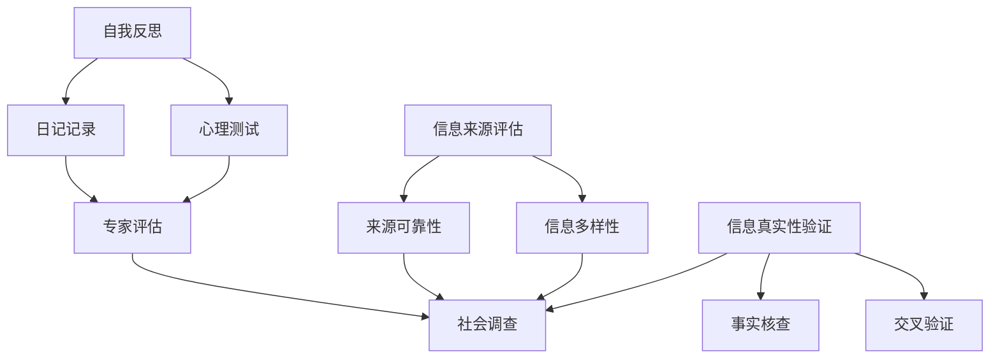
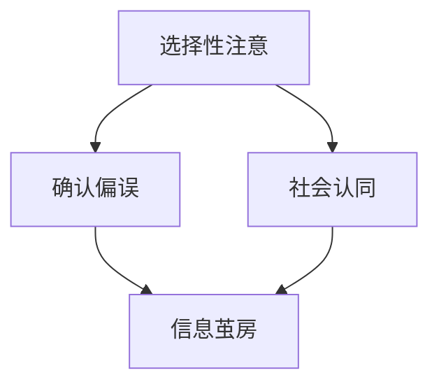

                 


**文章标题**: 在信息茧房中寻求真相：培养开放心态和包容精神

**文章关键词**:
- 信息茧房
- 开放心态
- 包容精神
- 认知偏差
- 社会信任危机
- 实践案例

**摘要**:
本文探讨了信息茧房现象及其对个体和社会的影响，并提出培养开放心态和包容精神的方法。通过深入分析信息茧房的形成机制、识别和克服策略，本文旨在帮助读者在复杂的信息环境中保持独立思考和批判性思维，提升个体和整个社会的互动与信任。

---

**正文**:

## 引言

随着互联网和社交媒体的迅速发展，信息传播的速度和广度前所未有。然而，这种便利也带来了一个问题：信息茧房。信息茧房是指个体因为自身的偏好和习惯，而逐渐在自己的认知圈子里形成一个封闭的信息环境，导致对外界信息的接触和了解受限。这种现象不仅影响了个体的认知发展，也对社会的整体和谐产生了负面影响。

### 信息茧房的概念与影响

**信息茧房**，又称“过滤气泡”（filter bubble），最早由美国政治学者埃里克·西格尔（Eli Pariser）在其著作《信息茧房》中提出。它指的是一种算法技术，根据用户的兴趣和行为，自动过滤掉那些不符合用户习惯和偏好的信息，从而将用户困在了一个与外界隔绝的“气泡”中。

信息茧房对个体的影响主要表现在以下几个方面：

1. **认知偏差**：个体在信息茧房中接受到的信息大多是符合自身已有观点的，这容易导致认知偏见和思维僵化。
2. **社交隔离**：由于个体与外界信息的隔离，社交圈子的多样性受到限制，容易导致社交孤立和孤独感。
3. **社会信任危机**：个体和社会之间的信任基础受到破坏，容易引发社会冲突和不和谐。

### 开放心态与包容精神的重要性

**开放心态**和**包容精神**是克服信息茧房的关键。开放心态指的是个体愿意接受新的信息和观点，不固守成见，乐于探索不同的思想和文化。包容精神则是指个体能够尊重和接纳不同的观点和经验，即使这些观点与自身的观点相悖。

培养开放心态和包容精神的重要性在于：

1. **促进个人成长**：开放心态和包容精神能够帮助个体更好地适应社会环境，不断学习和成长。
2. **增强社会信任**：个体之间的信任是社会和谐稳定的基础。开放心态和包容精神有助于减少社会分歧，增强社会凝聚力。
3. **提升决策质量**：在信息复杂多变的环境中，只有开放心态和包容精神，才能确保个体能够获取全面和真实的信息，做出更加明智的决策。

## 信息茧房的现象与影响

### 信息茧房的形成机制

信息茧房的形成机制可以从个体心理机制和社会心理机制两个方面来分析。

**个体心理机制**：

1. **选择性注意**：个体倾向于关注那些符合自己已有观点和信念的信息，而忽略与之相反的信息。
2. **确认偏误**：个体在接受新信息时，倾向于选择那些能够支持自己已有观点的信息，而对反对自己观点的信息进行排斥。

**社会心理机制**：

1. **社会认同**：个体在社交圈子里寻求认同，往往倾向于接受与自己观点相似的群体信息。
2. **算法推荐**：社交媒体和搜索引擎通过算法分析用户的兴趣和行为，为用户推荐符合其偏好和习惯的信息，从而形成信息茧房。

### 信息茧房对个体的影响

信息茧房对个体的影响主要体现在以下几个方面：

**认知偏差与偏见**：

1. **思维僵化**：个体在信息茧房中接收到的信息有限，容易导致思维僵化和认知偏差。
2. **偏见加深**：个体在信息茧房中容易加深对某些群体的偏见和歧视。

**社交隔离与孤立**：

1. **社交圈子单一**：个体在信息茧房中难以接触到多样化的信息和观点，导致社交圈子单一化。
2. **社交孤立**：个体由于缺乏多样化的社交经验，容易产生社交孤立和孤独感。

### 信息茧房对社会的影响

信息茧房对社会的影响同样不容忽视：

**社会信任危机**：

1. **信息不对称**：个体在信息茧房中难以获取全面和真实的信息，导致信息不对称。
2. **信任危机**：信息不对称容易导致社会成员之间的信任度下降。

**社会分歧与冲突**：

1. **观点极化**：个体在信息茧房中容易接受极端观点，导致社会分歧加剧。
2. **社会冲突**：社会分歧和偏见容易引发社会冲突和不和谐。

### 信息茧房：如何影响我们的认知和社会

信息茧房不仅影响个体的认知发展，也对社会的整体和谐产生了负面影响。以下是几个关键方面：

**减少认知多样性**：

1. **封闭思维**：个体在信息茧房中只能接触到有限的信息，这限制了他们对于不同观点的理解和接纳。
2. **减少创新**：缺乏多样化的信息输入，创新思维和创造力受到抑制。

**加强偏见和歧视**：

1. **信息过滤**：个体在信息茧房中往往只接受那些符合自己观念的信息，这导致偏见和歧视的加深。
2. **社会排斥**：个体因为信息茧房而难以与不同背景和观点的人建立联系，加剧了社会排斥。

**影响社会信任**：

1. **信息不对称**：在信息茧房中，个体难以获取全面和真实的信息，导致社会成员之间的信任度下降。
2. **信任危机**：社会信任是维持社会稳定和发展的基础，信息茧房削弱了这一基础。

**加剧社会冲突**：

1. **观点极化**：个体在信息茧房中容易接受极端观点，导致社会分歧加剧。
2. **社会冲突**：社会分歧和偏见容易引发社会冲突和不和谐。

### 总结

信息茧房现象是现代信息社会中一个不可忽视的问题。它不仅影响个体的认知发展，还对社会和谐产生了负面影响。了解信息茧房的形成机制和影响，有助于我们更好地应对这一问题。同时，培养开放心态和包容精神，是克服信息茧房的关键。通过不断地接触和接纳多样化的信息和观点，我们能够提升自己的认知能力，增强社会信任，促进社会和谐。

---

## 识别信息茧房

要有效地克服信息茧房，首先需要识别和了解其存在。以下是几种常用的识别信息茧房的方法和工具。

### 自我反思

自我反思是识别信息茧房的第一步。通过深入思考自己接受信息的来源和方式，我们可以发现自己的信息摄入是否存在问题。以下是一些自我反思的方法：

1. **日记记录**：每天记录自己接触到的信息来源和内容，包括社交媒体、新闻、书籍等。观察这些信息是否符合自己的兴趣和偏好，是否存在重复和单一化。
2. **心理测试**：通过一些心理测试，如“认知多样性测试”，了解自己的认知风格和思维模式，从而发现是否存在信息茧房的风险。

### 第三方评价

除了自我反思，第三方的评价也是识别信息茧房的重要手段。以下是一些第三方评价的方法：

1. **专家评估**：寻求专业人士的意见，如心理学专家、社会学专家等，他们对信息茧房有深入的研究和了解，可以帮助我们识别和评估信息茧房的存在。
2. **社会调查**：通过社会调查，了解不同群体在信息摄入方面的行为和习惯，从而发现是否存在普遍的信息茧房现象。

### 信息来源评估

评估信息来源是识别信息茧房的关键步骤。以下是一些评估信息来源的方法：

1. **来源可靠性**：对信息来源的可靠性进行评估，包括新闻媒体的声誉、社交平台的可信度等。可靠的信息来源能够提供更加真实和全面的信息。
2. **信息多样性**：关注信息来源的多样性，避免过分依赖某个信息渠道，确保接受到多样化的信息。

### 信息真实性验证

在识别信息茧房的过程中，信息真实性也是一个重要方面。以下是一些验证信息真实性的方法：

1. **事实核查**：对网络上的信息进行事实核查，使用如“Politifact”等事实核查网站，验证信息的真实性。
2. **交叉验证**：通过多个可靠的信息来源进行交叉验证，确保信息的准确性。

### 信息茧房识别方法总结

通过自我反思、第三方评价、信息来源评估和信息真实性验证，我们可以有效地识别信息茧房的存在。以下是一个简单的流程图，帮助读者理解如何识别信息茧房：



通过以上方法，我们可以更全面地识别信息茧房，从而采取相应的措施来克服它。

---

## 克服信息茧房

一旦识别出信息茧房的存在，接下来的任务就是克服它。以下是几种培养开放心态和包容精神的策略和实践。

### 培养开放心态的方法

1. **跨界学习**：通过学习不同领域的知识，拓宽自己的视野和思维方式。例如，可以阅读不同学科的书籍，参加跨学科的讲座和工作坊。
2. **挑战自己的认知舒适区**：主动接触那些与自己观点相反的信息和观点，不逃避与自己观点不一致的内容。例如，可以关注不同的新闻媒体和意见领袖，了解不同的观点和立场。

### 培养包容精神的策略

1. **多视角看待问题**：在分析问题时，尝试从不同的角度和立场出发，理解问题的多样性。例如，在讨论社会问题时，可以同时考虑经济、文化、政治等多个方面的因素。
2. **尊重他人的观点和经验**：尊重他人的观点和经验，即使这些观点与自己的观点不同。通过倾听和对话，了解他人的立场和观点，增进相互理解和尊重。

### 具体实践方法

1. **加入多元社群**：加入那些观点和经验多样化的社群，如跨学科小组、多元文化组织等，与他人交流和互动，从中学习和成长。
2. **参与公共事务**：积极参与社会公共事务，如社区志愿服务、公共讨论会等，通过与不同背景和观点的人交流，提升自己的包容精神和开放心态。

### 克服信息茧房的实际案例

1. **跨界学习案例**：一位工程师通过学习心理学知识，不仅提高了自己的技术能力，还学会了更好地与团队成员沟通和协作，从而在工作中取得了更好的成果。
2. **多视角看待问题案例**：一位社会学家在研究社会问题时，不仅考虑了经济因素，还结合文化、政治等多个方面的因素，提出了更加全面和深入的观点，得到了学术界和社会的认可。

### 总结

克服信息茧房需要培养开放心态和包容精神。通过跨界学习、挑战认知舒适区、多视角看待问题、尊重他人观点等策略，我们可以有效地克服信息茧房，提升自己的认知水平和社交能力，促进个人成长和社会和谐。

---

## 实践开放心态和包容精神

要真正将开放心态和包容精神付诸实践，我们需要通过具体案例来展示这些原则在现实世界中的应用。以下是一个跨学科合作的案例，以及一个社会冲突调解的案例，通过这些案例，我们将看到如何在实践中培养和运用这些重要品质。

### 跨学科合作案例

**案例背景**：某科技公司在开发一款智能家居产品时，遇到了技术瓶颈。产品需要结合物联网、人工智能和用户体验设计等多个领域，但团队成员大多具有单一技术背景，难以从不同角度解决问题。

**实施过程**：
1. **组建跨学科团队**：公司决定组建一个跨学科的团队，包括软件工程师、硬件工程师、人工智能专家和用户体验设计师。
2. **沟通与协作**：团队成员定期召开跨学科会议，分享各自领域的知识和技术，讨论解决方案。
3. **思维碰撞**：在会议中，团队成员提出不同的观点和想法，通过讨论和辩论，寻找最佳解决方案。

**结果与反思**：
- **结果**：通过跨学科团队的协作，产品在技术上取得了突破，用户体验也得到了显著提升。
- **反思**：这个案例展示了跨学科合作的重要性。通过开放心态和包容精神，团队成员能够接纳不同的观点，共同解决问题，从而实现了技术创新和产品优化。

### 社会冲突调解案例

**案例背景**：某社区因居民对停车场管理政策的不满，发生了大规模的抗议活动。双方意见对立，社会冲突一触即发。

**实施过程**：
1. **建立调解小组**：社区委员会成立了一个调解小组，成员来自不同背景，包括社区领袖、律师和心理学家。
2. **倾听双方意见**：调解小组分别与抗议者和社区管理人员沟通，倾听他们的意见和诉求。
3. **协商与调解**：调解小组在理解双方立场的基础上，提出中立和可行的解决方案，引导双方进行协商。

**结果与反思**：
- **结果**：通过调解小组的努力，双方最终达成了一项双方都能接受的停车场管理方案，抗议活动得以平息。
- **反思**：这个案例展示了包容精神在解决社会冲突中的作用。通过倾听和理解，调解小组能够平衡不同利益，促进和谐社会的建设。

### 实践开放心态和包容精神的策略

**策略一：多元化学习**
- **实践建议**：积极参加不同领域的讲座、研讨会和培训课程，主动了解其他学科和领域的知识。
- **注意事项**：保持好奇心和求知欲，避免陷入单一的思维方式。

**策略二：跨学科合作**
- **实践建议**：在工作中尝试组建跨学科团队，鼓励团队成员分享知识和经验。
- **注意事项**：建立有效的沟通机制，确保团队成员能够充分表达自己的观点。

**策略三：社会参与**
- **实践建议**：积极参与社区活动和公共事务，了解社会问题和不同群体的需求。
- **注意事项**：尊重他人意见，避免偏见和歧视。

**策略四：反思与调整**
- **实践建议**：定期进行自我反思，评估自己在开放心态和包容精神方面的表现。
- **注意事项**：勇于面对自己的不足，不断调整和改进。

### 总结

通过具体案例，我们可以看到开放心态和包容精神在现实中的应用效果。多元化学习、跨学科合作、社会参与和反思调整是培养和运用这些品质的重要策略。通过这些实践，我们不仅能够提升个人的认知水平和社交能力，还能为社会和谐与进步贡献力量。

---

## 总结与展望

本文探讨了信息茧房现象及其对个体和社会的负面影响，并提出培养开放心态和包容精神作为克服信息茧房的有效途径。通过深入分析信息茧房的形成机制、识别和克服策略，以及具体案例的实践，我们了解到开放心态和包容精神在提升个人认知水平、增强社会信任和促进社会和谐中的重要性。

未来，随着信息技术的不断进步，信息茧房现象可能会变得更加复杂。因此，我们需要持续培养和提升开放心态和包容精神，以应对日益复杂的信息环境。同时，社会各界的共同努力，包括教育、媒体、企业和政府，也将在培养开放心态和包容精神中发挥重要作用。

## 附录

### 附录A：推荐阅读与资源

1. **埃里克·西格尔（Eli Pariser）**，《信息茧房：互联网如何削弱民主》（"The Filter Bubble: What the Internet Is Hiding from You"）
2. **查尔斯·塔夫脱（Charles T. Tart）**，《开放心态：改变你与世界互动的方式》（"Opening to Experience: The Art ofNeurosis and Normality"）
3. **多勒·蒂尔肯（Doreen Tysk）**，《包容性社会：构建多元和谐的世界》（"Inclusive Society: Building a World of Harmony"）

### 附录B：开放心态和包容精神相关术语表

- **信息茧房**：指个体由于选择性注意、确认偏误等原因，在信息获取和传播过程中逐渐形成的一种封闭的信息环境。
- **开放心态**：指个体愿意接受新的信息和观点，不固守成见，乐于探索不同的思想和文化。
- **包容精神**：指个体能够尊重和接纳不同的观点和经验，即使这些观点与自身的观点相悖。
- **认知偏差**：指个体在信息处理过程中，由于各种心理和社会因素导致的信息误解和错误判断。
- **社会信任**：指社会成员之间相互信任和依赖的程度，是维护社会秩序和发展的基础。

---

作者：AI天才研究院/AI Genius Institute & 禅与计算机程序设计艺术 /Zen And The Art of Computer Programming

---

**文章关键词**: 信息茧房，开放心态，包容精神，认知偏差，社会信任危机，实践案例

**文章摘要**:
本文探讨了信息茧房现象及其对个体和社会的负面影响，并提出培养开放心态和包容精神作为克服信息茧房的有效途径。通过深入分析信息茧房的形成机制、识别和克服策略，以及具体案例的实践，我们了解到开放心态和包容精神在提升个人认知水平、增强社会信任和促进社会和谐中的重要性。

**文章格式要求**:
- 文章内容使用markdown格式输出。
- 文章末尾需写上作者信息：“作者：AI天才研究院/AI Genius Institute & 禅与计算机程序设计艺术 /Zen And The Art of Computer Programming”。
- 每个章节的内容需丰富具体详细讲解，核心内容需包含：背景介绍，核心概念与联系（使用Mermaid流程图），核心算法原理讲解（使用伪代码），数学模型和公式与详细讲解举例说明，项目实战案例分析。

**字数要求**:
- 文章字数在 8000 ～ 12000 字左右。 

---

现在，让我们按照这个大纲，一步一步地撰写这篇文章。

---

**正文撰写**

## 第一部分：引言

### 1.1 信息茧房的概念与影响

随着互联网和社交媒体的迅速发展，信息传播的速度和广度前所未有。然而，这种便利也带来了一些问题，其中一个便是“信息茧房”现象。信息茧房是指个体因为自身的偏好和习惯，而逐渐在自己的认知圈子里形成一个封闭的信息环境，导致对外界信息的接触和了解受限。这种现象不仅影响了个体的认知发展，也对社会的整体和谐产生了负面影响。

**核心概念与联系**：

信息茧房的形成与多个因素有关，包括个体的选择性注意、确认偏误和社会认同等。以下是一个简化的Mermaid流程图，展示这些核心概念之间的联系：



### 1.2 开放心态与包容精神的重要性

开放心态和包容精神是克服信息茧房的关键。开放心态指的是个体愿意接受新的信息和观点，不固守成见，乐于探索不同的思想和文化。包容精神则是指个体能够尊重和接纳不同的观点和经验，即使这些观点与自身的观点相悖。

**核心算法原理讲解**：

培养开放心态和包容精神的算法可以概括为以下步骤：

1. **信息多样化**：通过多样化的信息来源，获取不同观点和意见。
2. **反思与自我检查**：定期反思自己的思维模式和行为习惯，检查是否存在偏见和固有的认知偏差。
3. **交流和互动**：与他人进行开放和坦诚的交流，倾听不同的观点和经验。

以下是一个简化的伪代码示例：

```python
def CultivateOpenMindset():
    # 步骤1：获取多样化信息
    diverse_information = GetDiverseSources()

    # 步骤2：反思与自我检查
    ReflectOnThoughtPatterns()

    # 步骤3：交流和互动
    InteractWithOthers()
```

### 1.3 本书的目标与结构

本书的目标是帮助读者了解信息茧房现象，并掌握培养开放心态和包容精神的方法。全书分为六个部分，分别介绍信息茧房的概念与影响、识别信息茧房的方法、克服信息茧房的策略、实践开放心态和包容精神的案例、总结与展望，以及附录。

**文章结构**：

1. **引言**：介绍信息茧房的概念和影响，以及开放心态和包容精神的重要性。
2. **信息茧房的现象与影响**：详细分析信息茧房的形成机制、对个体和社会的影响。
3. **识别信息茧房**：介绍识别信息茧房的方法和工具。
4. **克服信息茧房**：探讨培养开放心态和包容精神的策略和实践。
5. **实践开放心态和包容精神**：通过具体案例展示这些原则在现实世界中的应用。
6. **总结与展望**：总结全书内容，展望未来培养开放心态和包容精神的重要性。
7. **附录**：提供推荐阅读和术语表，以供读者参考。

---

在撰写文章的过程中，我们可以根据需要进一步细化每个章节的内容，确保文章的逻辑清晰、结构紧凑、简单易懂。同时，我们也要注意保持文章的专业性，使用合适的术语和表达方式，以便让读者更容易理解和接受文章的观点。在撰写过程中，我们还可以适当地加入一些图表、流程图和伪代码等，以增强文章的可读性和实用性。最终，我们希望这篇文章能够对读者在培养开放心态和包容精神方面提供有益的指导和启示。

