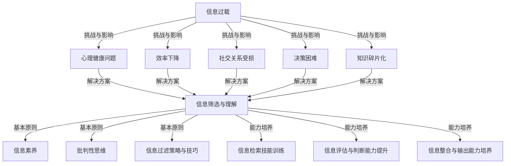
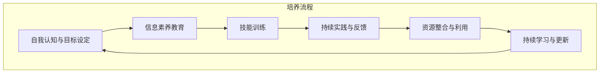

                 

### 文章标题：在信息过载时代培养智慧：提升信息筛选与理解能力

#### 关键词：信息过载、信息筛选、理解能力、智慧培养、批判性思维

#### 摘要：
在当今信息爆炸的时代，信息过载成为普遍现象，给个人和社会带来了巨大的挑战。本文旨在探讨如何在这个背景下培养个体的智慧，提升信息筛选与理解能力。文章将首先介绍信息过载的概念及其影响，接着讨论培养智慧的基本原则，包括信息素养、批判性思维和有效的信息过滤策略。随后，文章将详细分析信息筛选与理解能力的培养方法，从信息检索技能、信息评估与判断到信息整合与输出。此外，本文将通过具体案例研究，展示这些方法在实际应用中的效果。最后，文章将探讨教育与培训体系在智慧培养中的角色，以及信息筛选与理解相关的伦理与法律问题，为未来的发展提供思路和建议。通过这一系列探讨，本文希望能够帮助读者在信息过载的时代中，更有效地筛选和理解信息，提升个人智慧。

### 第1章: 在信息过载时代培养智慧

#### 1.1 信息过载时代的挑战与影响

#### 1.1.1 信息过载的概念与现象

信息过载是指信息量超出了个体或社会可以处理的能力范围，导致信息处理效率下降，甚至出现信息疲劳的现象。随着互联网和数字技术的发展，信息过载已经成为现代社会的一个普遍现象。人们每天接触到海量的信息，包括社交媒体、新闻报道、电子邮件、广告等，这些信息不仅数量庞大，而且质量参差不齐。这种现象在学术领域、商业领域和日常生活中都表现尤为突出。

在学术领域，研究者需要从大量的学术论文、研究报告和书籍中筛选有用的信息，而学术界的快速扩张使得这一过程变得更加复杂。商业领域也面临着信息过载的挑战，企业需要处理来自市场、客户、竞争对手的大量数据，以做出及时有效的决策。在日常生活中，人们通过网络和社交媒体获取信息，但信息的真实性和可靠性难以保证，往往需要花费大量时间和精力来筛选和处理。

#### 1.1.2 信息过载对个体和社会的影响

信息过载对个体和社会的影响是多方面的，其中包括：

1. **心理健康问题**：信息过载可能导致焦虑、抑郁等心理问题。人们在面对大量信息时，容易出现决策困难和选择困难，导致心理压力增大。

2. **效率下降**：信息过载使得人们无法高效地处理信息，从而降低工作效率。研究表明，长时间处于信息过载状态的人，其注意力和记忆力都会受到负面影响。

3. **社交关系受损**：信息过载使得人们难以有效地进行社交互动。人们往往通过社交媒体来获取信息，但过多的信息流可能导致社交关系的疏远。

4. **决策困难**：在信息过载的环境中，个体很难从大量信息中筛选出真正有价值的信息，从而做出正确的决策。

5. **知识碎片化**：信息过载导致知识的碎片化，人们往往只能获取零散的信息片段，而无法形成系统的知识结构。

#### 1.1.3 信息筛选与理解的重要性

面对信息过载的挑战，提高信息筛选与理解能力显得尤为重要。有效的信息筛选与理解能力不仅能够帮助个体在繁杂的信息中找到有价值的信息，还能提高工作效率，减轻心理压力，增强社交互动的质量。以下是信息筛选与理解的重要性具体体现：

1. **提高决策质量**：通过有效的信息筛选与理解，个体能够从大量信息中提取关键信息，从而做出更高质量的决策。

2. **减轻工作负担**：通过高效的筛选，个体可以减少处理冗余信息的负担，提高工作效率。

3. **促进知识整合**：有效的信息理解能够帮助个体将零散的信息片段整合成系统的知识结构，提升知识的整体水平。

4. **增强社交互动**：通过理解信息的真实性和可靠性，个体能够更好地参与社交互动，建立更高质量的人际关系。

5. **提高生活质量**：有效的信息筛选与理解能力可以帮助个体在日常生活中做出更明智的选择，从而提高生活质量。

#### 1.2 培养智慧的基本原则

在信息过载的时代，培养智慧是应对挑战的重要途径。以下是一些基本原则，有助于提升个体的信息筛选与理解能力，从而培养智慧：

##### 1.2.1 信息素养与批判性思维

信息素养是指个体在信息社会中有效地查找、评估、利用信息的能力。它包括信息检索、信息评估和信息应用等方面。批判性思维则是指个体在面对信息时，能够运用逻辑推理和判断力进行分析和评价，而不是盲目接受或拒绝信息。信息素养与批判性思维相辅相成，共同构成了个体在信息社会中培养智慧的基础。

- **信息检索**：通过搜索引擎、数据库等工具，高效地获取所需信息。
- **信息评估**：判断信息的真实性和可靠性，避免被误导。
- **信息应用**：将获取的信息应用到实际问题中，解决具体问题。

批判性思维则体现在以下方面：

- **分析信息**：对信息进行深入分析，理解其背后的逻辑和原因。
- **评估证据**：考察信息的证据是否充分、可靠。
- **推理判断**：运用逻辑推理，对信息进行判断和评价。

##### 1.2.2 信息过滤策略与技巧

面对海量信息，有效的信息过滤策略与技巧能够帮助个体在繁杂的信息中筛选出有价值的信息。以下是一些常用的信息过滤策略与技巧：

- **来源筛选**：选择可信度高的信息来源，如权威媒体、专业网站等。
- **关键词搜索**：使用关键词进行精确搜索，缩小信息范围。
- **信息分类**：将信息按照主题、类型等进行分类，便于管理和查找。
- **信息验证**：对获取的信息进行验证，确保其真实性和可靠性。

##### 1.2.3 培养智慧的教育体系

培养智慧需要系统的教育体系支持。以下是一些教育体系中的智慧培养措施：

- **课程设置**：在课程设置中融入信息素养和批判性思维培养的内容，如信息检索技巧、数据分析方法、逻辑推理等。
- **教学方法**：采用探究式教学、项目式学习等教学方法，鼓励学生主动思考、解决问题。
- **实践机会**：提供丰富的实践机会，如实验室研究、社会实践等，让学生在实际情境中培养智慧。
- **评价机制**：建立多元化的评价机制，不仅评估学生的知识水平，还评估其批判性思维和信息处理能力。

#### 1.3 信息筛选与理解的能力培养

在信息过载的时代，培养信息筛选与理解的能力是一项长期而艰巨的任务。以下是一些具体的方法和步骤，有助于提升这一能力：

##### 1.3.1 信息检索技能训练

信息检索是信息筛选的第一步，也是关键的一步。以下是一些信息检索技能训练的方法：

- **关键词选择**：掌握如何选择合适的关键词，以便在搜索过程中能够快速找到所需信息。
- **搜索引擎使用**：熟练使用各种搜索引擎的高级搜索功能，如筛选、排序、自定义搜索范围等。
- **数据库检索**：学习如何使用学术数据库和专业数据库进行检索，获取高质量的信息资源。
- **信息定位**：掌握快速定位信息的方法，如使用书签、收藏夹、标签等工具。

##### 1.3.2 信息评估与判断能力提升

信息评估与判断能力是信息筛选与理解的核心。以下是一些提升这一能力的方法：

- **信息验证**：学会对信息进行验证，如检查引用来源、考察数据来源的可靠性等。
- **批判性思维**：运用批判性思维，对信息进行分析和评价，判断其真实性和价值。
- **多角度分析**：从不同角度分析信息，全面理解其背景和内涵。
- **参考意见**：借鉴他人的看法和意见，进行综合评估和判断。

##### 1.3.3 信息整合与输出能力培养

信息整合与输出能力是信息筛选与理解的最终目的。以下是一些培养这一能力的方法：

- **信息整理**：学会将获取的信息进行整理和归纳，形成系统化的知识结构。
- **信息转化**：将信息转化为自己能够理解和应用的形式，如笔记、总结、报告等。
- **信息表达**：提高信息表达能力，能够清晰、准确地传达信息。
- **信息输出**：通过演讲、写作、演示等方式，将整合的信息输出，与他人分享。

#### 1.4 核心概念与联系

在本章中，我们探讨了信息过载的概念及其对个体和社会的影响，信息筛选与理解的重要性，以及培养智慧的基本原则和能力培养方法。以下是这些核心概念之间的关系架构：



通过上述架构，我们可以清晰地看到信息过载带来的挑战与信息筛选与理解解决方案之间的联系，以及这些解决方案与培养智慧基本原则和能力培养方法之间的关系。

### 1.4.1 信息过载、信息素养、批判性思维的关系

信息过载是现代社会的普遍现象，它对个体和社会产生了深远的影响。为了应对这一挑战，提升信息素养和批判性思维显得尤为重要。信息素养和批判性思维不仅有助于个体在信息过载的环境中有效筛选和理解信息，还能提升其整体智慧水平。

**信息素养**：信息素养是指个体在信息社会中获取、评估、利用信息的能力。它包括信息检索、信息评估、信息应用等方面。面对信息过载，高信息素养的个体能够更高效地获取所需信息，并对其进行评估和利用。例如，通过熟练掌握搜索引擎的高级搜索功能，个体可以快速找到高质量的信息资源。

**批判性思维**：批判性思维则强调个体在面对信息时，能够运用逻辑推理和判断力进行分析和评价，而不是盲目接受或拒绝信息。批判性思维使个体能够从多个角度分析信息，判断其真实性和可靠性。例如，在评估新闻报道时，批判性思维者会考察报道的来源、证据是否充分，从而做出更准确的判断。

**关系**：信息素养和批判性思维相辅相成，共同构成了应对信息过载的强大工具。信息素养为个体提供了获取和处理信息的能力，而批判性思维则帮助个体在处理信息时保持理性，避免被信息误导。二者结合，能够显著提升个体的信息筛选与理解能力，使其在信息过载的时代中游刃有余。

例如，在一个学术研究中，研究者需要从大量文献中筛选相关资料。高信息素养的研究者能够快速找到高质量的文献，而高批判性思维的研究者则能够对这些文献进行深入分析，判断其价值，从而选择最合适的资料作为研究的基础。

**实际应用**：在商业领域，企业高管需要处理来自市场、客户和竞争对手的大量信息，以做出及时有效的决策。高信息素养和高批判性思维的高管能够迅速筛选出有价值的信息，并对其进行深入分析，从而做出更明智的决策。

**结论**：信息素养和批判性思维是应对信息过载的重要工具。通过提升这两个方面的能力，个体能够在信息过载的时代中更好地筛选和理解信息，提升整体智慧水平。信息素养和批判性思维不仅有助于个人发展，还能为社会创造更多价值。

### 1.4.2 信息筛选与理解能力培养的流程

为了在信息过载的时代中培养信息筛选与理解能力，我们需要制定一个系统的培养流程，包括以下几个关键步骤：

**1. 自我认知与目标设定**

在开始培养信息筛选与理解能力之前，个体需要首先进行自我认知，明确自己的信息需求和能力现状。通过自我评估，个体可以了解自己在信息检索、评估和应用等方面的优劣势，从而设定具体的培养目标。例如，如果某人在信息检索方面存在困难，那么可以设定提高搜索引擎使用技巧的目标。

**2. 信息素养教育**

信息素养教育是培养信息筛选与理解能力的基础。通过系统的教育，个体可以学习如何高效地检索信息、评估信息来源、应用信息等。信息素养教育可以通过课程学习、实践操作和培训等方式进行。例如，在大学课程中，可以设置信息素养课程，教授信息检索技巧、批判性思维方法等。

**3. 技能训练**

在明确培养目标和接受信息素养教育之后，个体需要进行针对性的技能训练。技能训练包括信息检索技能、信息评估与判断能力、信息整合与输出能力等。以下是一些具体的训练方法：

- **信息检索技能训练**：通过练习使用搜索引擎、数据库等工具，提高检索效率和质量。例如，可以通过设置不同难度的检索任务，逐步提升检索能力。
- **信息评估与判断能力训练**：通过模拟真实情境，让个体在面对大量信息时进行评估和判断。例如，可以设定一个主题，要求个体从不同来源获取信息，并对其进行评估和筛选。
- **信息整合与输出能力训练**：通过写作、演讲、报告等形式，提升个体的信息整合与输出能力。例如，可以设定一个项目报告，要求个体在收集和整理信息的基础上，进行整合和输出。

**4. 持续实践与反馈**

培养信息筛选与理解能力是一个持续的过程，需要个体在实践中不断反思和改进。以下是一些具体的实践方法：

- **日常实践**：在日常生活中，个体可以通过阅读书籍、新闻、学术论文等，不断积累信息，并对其进行筛选与理解。例如，可以设定每天阅读一篇学术论文，分析其研究方法、结论等。
- **项目实践**：通过参与实际项目，个体可以在实践中应用所学技能，提高信息筛选与理解能力。例如，可以参与一个研究项目，从大量文献中筛选相关资料，进行分析和总结。
- **反馈与改进**：在实践过程中，个体需要及时获取反馈，了解自己的不足之处，并进行改进。例如，可以通过与导师、同学或同事交流，获取他们的意见和建议，从而不断提升自己的能力。

**5. 资源整合与利用**

在培养信息筛选与理解能力的过程中，个体需要充分利用各种资源，如图书馆、数据库、网络课程等。以下是一些建议：

- **图书馆资源**：图书馆是获取信息的重要场所，个体可以充分利用图书馆的书籍、期刊、数据库等资源，提高信息检索能力。
- **在线课程**：在线课程提供了丰富的学习资源，个体可以通过参加在线课程，学习信息素养和批判性思维等知识。
- **网络论坛与社区**：网络论坛和社区是获取信息和建议的重要渠道，个体可以通过加入相关论坛或社区，与他人交流、分享经验。

**6. 持续学习与更新**

信息环境不断变化，个体需要持续学习，更新自己的知识和技能。以下是一些建议：

- **定期学习**：设定固定的学习时间，定期学习新知识，保持学习的动力。
- **跟进研究**：关注领域内的最新研究进展，了解新技术、新方法等，不断提升自己的专业水平。
- **反思与总结**：定期反思自己的学习和实践过程，总结经验教训，为未来的发展做好准备。

通过以上流程，个体可以逐步培养信息筛选与理解能力，提升整体智慧水平，从而在信息过载的时代中更好地应对挑战。

### 1.4.3 Mermaid流程图展示

以下是信息筛选与理解能力培养流程的Mermaid流程图：



通过这个流程图，我们可以清晰地看到信息筛选与理解能力培养的各个步骤及其相互关系，有助于读者更好地理解和应用这一流程。

### 第2章: 提升信息筛选与理解能力的方法

#### 2.1 信息筛选的方法与技巧

在信息过载的时代，提升信息筛选能力是应对信息泛滥的关键。以下是一些有效的信息筛选方法和技巧：

##### 2.1.1 信息源选择

选择可靠的信息源是信息筛选的第一步。以下是一些评估信息源可靠性的方法：

- **权威性评估**：选择具有权威性的信息源，如权威媒体、专业机构、学术期刊等。这些信息源通常经过严格的编辑和审查，具有较高的可信度。
- **背景调查**：了解信息源的背景，如成立时间、历史记录、人员组成等，可以帮助评估其可靠性和专业性。
- **同行评价**：查阅同行对信息源的评论和评分，了解其在专业领域内的声誉。

##### 2.1.2 信息验证与核实

验证信息的真实性是确保信息筛选质量的重要环节。以下是一些信息验证与核实的技巧：

- **交叉验证**：通过多个来源核对信息，确保其一致性。如果多个可靠来源都报道同一信息，则该信息的可信度较高。
- **查证数据来源**：对于数据信息，需要核实数据来源的可靠性和准确性，如查看原始数据集或报告。
- **引用检查**：查看信息源中引用的文献或资料，确认其真实性和可靠性。

##### 2.1.3 信息分类与归纳

对获取的信息进行分类和归纳可以帮助更好地管理和利用信息。以下是一些信息分类与归纳的技巧：

- **主题分类**：根据信息的主要内容，将其分为不同的主题类别，便于查找和整理。
- **关键字分类**：使用关键词或标签对信息进行分类，便于快速检索和查找。
- **层次结构**：建立信息层次结构，将信息按照重要性、相关性等层次进行组织，便于管理和分析。

#### 2.2 信息理解的策略与技巧

提升信息理解能力是有效利用信息的关键。以下是一些提高信息理解能力的策略与技巧：

##### 2.2.1 信息解构与分析

对信息进行解构和分析是理解信息的有效方法。以下是一些具体步骤：

- **拆解信息**：将信息拆分成各个部分，如事实、观点、证据等，逐一分析其含义和关系。
- **逻辑推理**：运用逻辑推理，分析信息的逻辑结构和论证方式，判断其合理性和可信度。
- **比较分析**：将信息与已知事实、其他观点等进行比较，识别差异和共同点，从而更全面地理解信息。

##### 2.2.2 信息比较与关联

通过比较和关联信息，可以加深对信息的理解。以下是一些具体方法：

- **横向比较**：将同一主题的不同信息进行比较，识别其差异和共同点，从而获得更全面的认识。
- **纵向比较**：将同一信息在不同时间或不同情境下的表现进行比较，分析其变化和趋势。
- **关联分析**：将信息与其他相关领域或事件进行关联，发现其潜在联系，从而拓宽理解视野。

##### 2.2.3 信息转化与应用

将信息转化为自己能够理解和应用的形式是信息理解的最终目标。以下是一些信息转化的方法：

- **总结提炼**：将大量信息总结为简洁的摘要或要点，提炼核心内容，便于记忆和应用。
- **图表展示**：使用图表、图像等视觉化工具，将复杂信息转化为易于理解的形式，提高信息的可接受性和记忆性。
- **实践应用**：将信息应用到实际问题中，通过实际操作和实践，加深对信息的理解和掌握。

#### 2.3 信息评估与判断的技巧

评估和判断信息的真实性和价值是信息筛选与理解的重要环节。以下是一些评估与判断的技巧：

##### 2.3.1 评估方法与工具

以下是一些常用的评估方法与工具：

- **五级评估法**：将信息分为五个等级，从“可信度极高”到“不可信”，根据信息的来源、证据、逻辑等因素进行评估。
- **可信度评分**：为信息源和内容分配可信度分数，分数越高，可信度越高。例如，可以采用10分制进行评分。
- **专家评审**：邀请领域内的专家对信息进行评审，根据专家的意见进行评估。

##### 2.3.2 判断标准与准则

以下是一些判断标准与准则：

- **准确性**：信息是否准确无误，是否与事实相符。
- **可靠性**：信息来源是否可靠，是否有权威支持。
- **逻辑性**：信息论证是否合理，逻辑是否清晰。
- **全面性**：信息是否提供了全面的信息，是否有遗漏。
- **时效性**：信息是否反映了最新的情况，是否过时。

##### 2.3.3 评估与判断实例分析

以下是一个评估与判断的实例分析：

**实例**：评估一篇新闻报道的真实性和可靠性。

1. **准确性评估**：查阅其他可靠来源，确认报道中提到的事实是否准确无误。如果其他来源也报道了相同的事实，则说明该报道具有较高的准确性。
2. **可靠性评估**：了解该新闻报道的来源，如媒体机构的声誉和历史记录。如果来源是权威媒体，则报道的可靠性较高。
3. **逻辑性评估**：分析报道的论证方式，判断其逻辑是否清晰。如果报道使用了逻辑严密的论证方式，则其逻辑性较高。
4. **全面性评估**：检查报道是否提供了全面的信息，是否有遗漏。如果报道包含了主要事实和相关背景信息，则其全面性较高。
5. **时效性评估**：了解报道的时间，判断其是否反映了最新的情况。如果报道是最近发布的，则其时效性较高。

通过以上评估，可以判断该新闻报道的真实性和可靠性。如果评估结果均较高，则可以认为该报道具有较高的可信度。

#### 2.4 信息整合与输出能力培养

提升信息整合与输出能力是信息筛选与理解的目标之一。以下是一些培养这一能力的方法：

##### 2.4.1 信息整合的技巧

以下是一些信息整合的技巧：

- **归纳总结**：将获取的信息归纳为摘要或要点，提炼核心内容，形成系统的知识结构。
- **图表展示**：使用图表、图像等视觉化工具，将复杂信息转化为易于理解的形式，提高信息的可接受性和记忆性。
- **逻辑框架**：建立逻辑框架，将信息按照一定的逻辑关系进行组织，提高信息的连贯性和理解性。

##### 2.4.2 信息输出的形式与技巧

以下是一些信息输出的形式与技巧：

- **写作**：通过撰写文章、报告、论文等形式，将整合的信息以文字形式输出。
- **演讲**：通过演讲、报告、演示等形式，将整合的信息以口头形式输出。
- **可视化**：通过图表、图像、动画等形式，将整合的信息以视觉化形式输出。
- **实践应用**：通过实际操作、项目实施等形式，将整合的信息应用到实际问题中。

##### 2.4.3 信息整合与输出的实际应用

以下是一个信息整合与输出的实际应用案例：

**案例**：在一次市场调研项目中，团队从多个渠道获取了大量的数据和市场信息。为了整合这些信息并输出有价值的结果，团队采取了以下步骤：

1. **数据整理**：将获取的数据按照主题、来源等进行分类，形成结构化的数据集。
2. **信息提炼**：对每个数据集进行归纳总结，提炼出关键数据和结论。
3. **逻辑框架**：根据调研目标，建立逻辑框架，将数据和信息按照逻辑关系进行组织。
4. **报告撰写**：撰写市场调研报告，将整合的信息以文字形式输出，包括数据展示、结论和建议等。
5. **演示展示**：通过PPT或视频形式，将报告的内容以视觉化形式展示，提高听众的理解和接受度。
6. **应用实施**：根据调研结果，制定具体的市场营销策略和行动计划，将整合的信息应用到实际项目中。

通过以上步骤，团队成功地将大量信息整合为有价值的报告，并在实际项目中取得了显著的效果。

#### 2.5 培养信息筛选与理解能力的最佳实践

以下是一些培养信息筛选与理解能力的最佳实践：

##### 2.5.1 自我管理技巧

- **时间管理**：合理安排时间，确保有足够的时间进行信息筛选和理解。例如，设定固定的阅读和学习时间，避免信息处理过程中的时间浪费。
- **注意力管理**：保持专注，减少信息干扰。例如，在处理信息时，关闭社交媒体通知，避免分心。

##### 2.5.2 学习与反思

- **定期学习**：定期学习新知识和技能，保持信息素养和批判性思维的更新。例如，每周阅读一本专业书籍，参加在线课程等。
- **反思与总结**：在信息处理过程中，及时反思和总结，了解自己的不足和改进方向。例如，定期进行学习日志，记录学习心得和反思。

##### 2.5.3 建立知识体系

- **构建框架**：建立知识框架，将零散的信息整合成系统的知识体系。例如，使用思维导图或大纲形式，整理和归纳所学知识。
- **持续更新**：随着新信息的不断获取，及时更新和优化知识体系，保持其完整性。

##### 2.5.4 实践与应用

- **实际操作**：通过实际项目或实验，将所学知识应用到实际问题中，提高信息筛选与理解能力。例如，参与研究项目，进行市场调研等。
- **反馈与改进**：在实践中获取反馈，了解自己的优势和不足，并进行改进。例如，与导师、同事交流，获取他们的意见和建议。

##### 2.5.5 拓展阅读与学习

- **推荐书籍**：阅读经典书籍和最新研究成果，拓宽知识视野。例如，推荐阅读《信息社会》、《批判性思维》等。
- **学术论文**：查阅学术论文，了解领域内的最新研究进展。例如，通过学术数据库检索相关论文，阅读和分析。
- **在线资源**：利用网络资源，如在线课程、论坛、博客等，学习他人的经验和技巧。例如，加入专业论坛，参与讨论和交流。

通过以上最佳实践，可以系统地培养信息筛选与理解能力，提升整体智慧水平。

### 案例研究：信息筛选与理解在学术研究中的应用

#### 3.1.1 研究背景与目标

在信息过载的时代，学术研究面临着前所未有的挑战。研究者需要从海量文献中筛选出有价值的信息，以便进行深入研究和创新。本案例研究旨在探讨信息筛选与理解在学术研究中的应用，通过具体实例展示如何提升信息筛选与理解能力，从而提高研究效率和质量。

本案例研究的背景是某个研究领域，研究者需要从大量学术文献中筛选出与课题相关的文献，以便进行深入研究。研究目标是通过信息筛选与理解的方法，提升文献筛选的效率，确保所选文献的相关性和可靠性。

#### 3.1.2 信息筛选与理解的实践过程

1. **信息检索**：

   研究者首先使用学术搜索引擎（如Google Scholar、Web of Science等）进行初步检索，输入关键词，获取相关文献列表。为了提高检索效率，研究者使用高级搜索功能，如精确匹配、文献类型筛选、时间范围限定等。

   ```plaintext
   检索关键词：人工智能、机器学习、深度学习
   精确匹配：标题中包含“人工智能”
   文献类型：学术文章
   时间范围：过去五年
   ```

2. **信息评估**：

   在获得初步检索结果后，研究者需要对文献进行评估，筛选出高质量、可靠的文献。以下是一些评估标准：

   - **来源可靠性**：评估文献来源的权威性和专业性，如顶级期刊、知名会议等。
   - **引用频次**：查看文献的引用次数，引用频次较高的文献通常具有较高的学术价值。
   - **内容质量**：阅读文献摘要和部分内容，判断其研究内容、方法、结论等是否与课题相关，是否具有较高的科学价值和实用性。

   研究者使用以下方法进行信息评估：

   - **多源交叉验证**：通过查阅多个可靠来源的文献，验证文献的内容和结论。
   - **专家意见**：请教领域内的专家，获取其对文献的评估意见。
   - **引用分析**：查看文献的引用情况，分析其学术影响力。

3. **信息整合与输出**：

   在筛选出高质量的文献后，研究者需要对文献进行整合，提炼出关键观点、方法、结论等，形成系统的知识体系。以下是一些整合方法：

   - **思维导图**：使用思维导图工具，将文献内容、观点、方法等以图形化形式展示，便于理解和记忆。
   - **文献综述**：撰写文献综述，对筛选出的文献进行总结和归纳，提炼出主要研究成果、不足之处和发展趋势。
   - **报告撰写**：撰写研究报告，将整合的信息和结论以文字形式输出，为后续研究提供参考。

#### 3.1.3 结果与启示

通过信息筛选与理解的方法，研究者成功筛选出了一批与课题相关的、高质量的文献。这些文献为研究提供了丰富的理论依据和实践经验，显著提高了研究的效率和成果质量。以下是研究结果的几个关键点：

1. **研究效率提升**：通过高效的信息检索和评估，研究者能够在较短的时间内获取大量高质量的信息，节省了大量时间和精力。
2. **研究质量提高**：筛选出高质量的文献，确保了研究的基础坚实可靠，从而提高了研究的科学性和创新性。
3. **知识整合与输出**：通过整合和输出信息，研究者建立了系统的知识体系，为后续研究提供了有益的参考和启示。

本案例研究结果表明，在信息过载的时代，通过有效的信息筛选与理解方法，研究者能够克服信息泛滥的挑战，提高研究效率和质量。这一方法不仅适用于学术研究，还可广泛应用于其他领域，如企业决策、政策制定等。

#### 案例二：信息筛选与理解在企业决策中的应用

##### 3.2.1 企业决策背景与问题

企业决策是企业运营和发展的关键环节。在当今信息过载的时代，企业决策面临着巨大的挑战。企业需要处理来自市场、客户、竞争对手的大量信息，以做出及时、有效的决策。然而，这些信息往往质量参差不齐，且信息量巨大，导致企业决策效率低下，甚至可能做出错误的决策。

本案例研究旨在探讨信息筛选与理解在企业决策中的应用，通过具体实例展示如何通过有效的信息筛选与理解方法，提高企业决策的效率和准确性。

##### 3.2.2 信息筛选与理解的策略与实践

1. **信息源选择**：

   为了确保决策信息的可靠性和相关性，企业需要精心选择信息源。以下是一些选择信息源的方法：

   - **权威媒体**：选择权威媒体发布的市场报告、行业分析等，作为决策信息的重要来源。
   - **专业数据库**：利用专业数据库，如市场研究数据库、商业数据库等，获取高质量的行业数据。
   - **内部报告**：收集企业内部的销售报告、财务报告等，作为决策信息的补充。

2. **信息验证与核实**：

   在获取信息后，企业需要对其进行验证和核实，以确保信息的真实性和准确性。以下是一些验证与核实的技巧：

   - **交叉验证**：通过多个来源的信息进行交叉验证，确保其一致性。
   - **数据核实**：对数据信息进行核实，确保其来源可靠，数据准确。
   - **专家评审**：邀请领域内的专家对信息进行评审，提高信息的可靠性。

3. **信息筛选与处理**：

   企业需要从海量信息中筛选出有价值的信息，以便进行深入分析和决策。以下是一些信息筛选与处理的方法：

   - **关键词搜索**：使用关键词进行精确搜索，缩小信息范围，提高筛选效率。
   - **信息分类**：将信息按照主题、类型等进行分类，便于管理和查找。
   - **信息归纳**：对筛选出的信息进行归纳和总结，提炼出关键信息，形成系统的信息结构。

4. **信息评估与判断**：

   企业需要评估筛选出的信息，判断其真实性和价值，以便进行决策。以下是一些评估与判断的方法：

   - **五级评估法**：将信息分为五个等级，从“可信度极高”到“不可信”，根据信息的来源、证据、逻辑等因素进行评估。
   - **专家意见**：结合领域内专家的意见，对信息进行综合评估和判断。

5. **信息整合与输出**：

   企业需要将筛选和评估后的信息进行整合，形成决策报告，以便进行决策。以下是一些信息整合与输出的方法：

   - **报告撰写**：撰写详细的决策报告，包括信息来源、筛选过程、评估结果等，为决策提供全面的参考。
   - **可视化展示**：使用图表、图像等可视化工具，将信息以图形化形式展示，提高信息的可接受性和理解性。

##### 3.2.3 决策结果与影响

通过信息筛选与理解的方法，企业成功筛选出了一批高质量的信息，并对其进行了深入分析和评估。基于这些信息，企业做出了以下决策：

1. **市场进入策略**：根据市场数据和分析结果，企业决定进入一个新市场，以抓住市场机遇。
2. **产品研发方向**：根据客户需求和竞争对手的产品特点，企业调整了产品研发方向，以满足市场需求。
3. **资源分配**：根据财务报告和市场分析，企业重新调整了资源分配，确保重点项目的资金支持。

决策结果表明，通过有效的信息筛选与理解，企业能够准确把握市场动态和客户需求，提高决策的准确性和有效性。决策结果对企业的发展产生了积极影响：

1. **市场占有率提升**：企业进入的新市场取得了显著的成功，市场占有率大幅提升。
2. **产品竞争力增强**：调整后的产品研发方向和客户需求更加契合，产品竞争力显著增强。
3. **资源利用效率提高**：通过合理的资源分配，企业确保了重点项目的资金支持，提高了资源利用效率。

本案例研究结果表明，在信息过载的时代，通过有效的信息筛选与理解方法，企业能够提高决策的效率和准确性，从而在激烈的市场竞争中取得优势。这一方法不仅适用于企业决策，还可广泛应用于其他领域的决策过程，如政策制定、项目评估等。

### 第4章: 培养智慧的教育与培训

#### 4.1 教育体系中的智慧培养

在信息过载的时代，教育体系在智慧培养中扮演着至关重要的角色。智慧的培养不仅关乎个体的未来发展，也关系到社会的整体进步。以下将从教育体系现状、智慧培养的课程设计、实践机会以及评价机制等方面，探讨如何通过教育体系培养智慧。

##### 4.1.1 教育体系现状与挑战

当前，全球教育体系在智慧培养方面存在一些普遍的挑战：

1. **知识传授为主**：传统教育体系以知识传授为主，重视学科知识的学习，而忽视了批判性思维和信息处理能力的培养。
2. **应试教育倾向**：应试教育模式使得教育过程过于注重考试成绩，导致学生在面对实际问题时缺乏解决问题的能力和创新思维。
3. **课程内容滞后**：课程内容往往滞后于科技发展的步伐，难以涵盖最新的信息和知识，导致学生缺乏应对未来挑战的能力。
4. **教育资源不均衡**：不同地区和学校之间的教育资源分配存在不均衡现象，导致学生获得的教育质量和培养智慧的机会存在差异。

##### 4.1.2 智慧培养的课程设计与实践

为了应对上述挑战，教育体系需要从课程设计、教学方法、实践机会等方面进行改革，以培养具备智慧能力的下一代。以下是一些具体措施：

1. **跨学科课程设计**：打破传统学科的界限，设计跨学科的课程体系，强调知识整合和跨领域思维。例如，设置“信息素养与批判性思维”课程，涵盖信息检索、评估、应用等方面。
2. **项目式学习**：采用项目式学习（Project-Based Learning, PBL）方法，让学生在实际项目中学习和应用知识，培养解决问题的能力。例如，组织学生进行科技竞赛、创新项目等，提供真实的学习情境。
3. **案例教学**：通过案例教学，引导学生分析实际案例，培养其批判性思维和决策能力。例如，在商业课程中，分析企业成功的案例，探讨其战略决策过程。
4. **思维训练课程**：开设专门的思维训练课程，如逻辑思维、创造性思维等，帮助学生提升思维品质，培养其创新能力和批判性思维。

##### 4.1.3 教育评价与反思

教育评价是智慧培养的重要环节。以下是一些教育评价的反思和建议：

1. **多元化评价**：打破单一的考试成绩评价模式，采用多元化评价方法，如过程评价、项目评价等，全面评估学生的知识和能力。
2. **发展性评价**：注重学生的发展过程，鼓励学生自主学习，培养学生的自我评价和反思能力。例如，通过学生自评、互评和教师评价相结合，促进学生的全面发展。
3. **反思与改进**：教育者需要不断反思和改进教学方法，根据学生的实际情况调整课程设计和教学策略，确保智慧培养的有效性。

#### 4.2 培训体系中的智慧培养

除了教育体系，培训体系也在智慧培养中发挥着重要作用。以下将探讨培训体系现状、智慧培养的培训项目与方案以及培训效果评估与持续改进。

##### 4.2.1 培训体系现状与问题

当前，培训体系在智慧培养方面存在以下问题：

1. **培训内容单一**：培训内容往往侧重于技能培训，忽视了对批判性思维、信息素养等综合素质的培养。
2. **培训方式单一**：多数培训采用传统讲授方式，缺乏互动性和实践性，难以有效培养学员的智慧能力。
3. **培训资源不足**：培训资源分配不均，导致部分培训项目质量不高，难以满足学员的需求。

##### 4.2.2 智慧培养的培训项目与方案

为了提升培训体系的智慧培养能力，以下是一些具体的项目和方案：

1. **智慧型培训项目**：设计智慧型培训项目，涵盖信息素养、批判性思维、团队协作等方面，注重培养学员的综合素质。
2. **案例式培训**：通过案例分析、小组讨论等方式，提高学员的实践能力和问题解决能力。
3. **在线培训**：利用互联网和在线教育平台，提供灵活、互动的在线培训课程，满足不同学员的学习需求。
4. **导师制培训**：引入导师制培训，为学员配备经验丰富的导师，指导其学习和发展。

##### 4.2.3 培训效果评估与持续改进

培训效果评估是确保智慧培养质量的重要环节。以下是一些培训效果评估和持续改进的方法：

1. **过程评估**：在培训过程中，通过问卷调查、课堂互动等方式，了解学员的学习情况和反馈，及时调整培训内容和方式。
2. **成果评估**：在培训结束后，通过项目展示、考试成绩等方式，评估学员的学习成果和能力提升情况。
3. **持续改进**：根据评估结果，不断优化培训项目和方案，提高培训质量和效果。例如，根据学员的反馈，调整培训内容，增加互动环节，提升培训的实践性。
4. **反馈机制**：建立有效的反馈机制，鼓励学员和培训师之间的沟通和交流，收集学员的宝贵意见和建议，为培训改进提供参考。

通过以上措施，培训体系可以更好地培养学员的智慧能力，提升其在信息过载时代中的竞争力和适应能力。

#### 4.3 信息化时代的智慧教育

信息化时代为智慧教育带来了新的机遇和挑战。以下将探讨信息化对智慧教育的影响、智慧教育的发展趋势与挑战，以及信息化智慧教育的实践案例。

##### 4.3.1 信息化对智慧教育的影响

信息化对智慧教育的影响主要体现在以下几个方面：

1. **教育资源丰富**：信息化使得教育资源更加丰富和便捷，学生可以随时随地获取全球优质的教育资源，扩大了学习的范围。
2. **教学方式变革**：信息化技术推动了教学方式的变革，如在线教育、虚拟现实（VR）教学等，使教学更加灵活、互动和个性化。
3. **知识更新加速**：信息化加速了知识的更新和传播，学生能够更快地获取最新的知识和信息，培养其快速学习和适应能力。
4. **学习体验丰富**：信息化技术为学生提供了丰富的学习体验，如在线互动、虚拟实验室等，增强了学习的趣味性和参与度。

##### 4.3.2 智慧教育的发展趋势与挑战

智慧教育的发展趋势和挑战主要包括：

1. **个性化教育**：智慧教育将更加注重个性化教育，通过大数据分析和人工智能技术，为学生提供定制化的学习方案。
2. **跨界融合**：智慧教育将与其他领域（如艺术、体育等）深度融合，培养具备多学科知识的全面发展人才。
3. **技术驱动**：智慧教育将依赖于先进的信息技术，如大数据、云计算、人工智能等，提高教育质量和效率。
4. **教育公平**：智慧教育有望缩小教育资源差距，促进教育公平，使更多学生享受到优质教育资源。

然而，智慧教育也面临以下挑战：

1. **技术依赖**：过度依赖信息技术可能导致学生失去自主学习能力和批判性思维。
2. **数据隐私**：信息化教育过程中涉及大量的个人数据，数据隐私和安全问题亟待解决。
3. **教师适应**：教师需要不断提升信息技术素养，以适应智慧教育的需求，这对教师的专业发展提出了新的要求。

##### 4.3.3 信息化智慧教育的实践案例

以下是一些信息化智慧教育的实践案例：

1. **在线教育平台**：如Coursera、edX等在线教育平台，提供了丰富的课程资源和学习工具，学生可以自主选择课程和学习进度，提高学习效率和质量。
2. **虚拟现实（VR）教学**：在教育中应用VR技术，为学生提供沉浸式的学习体验。例如，通过VR技术模拟实验操作，让学生在虚拟环境中进行实践操作，提高其动手能力和实际操作技能。
3. **智能教学系统**：利用大数据和人工智能技术，构建智能教学系统，为学生提供个性化的学习支持和反馈。例如，通过分析学生的学习行为和成绩，智能教学系统可以为学生推荐合适的学习资源和策略。
4. **智能校园**：通过信息化技术建设智能校园，实现校园管理的智能化和便捷化。例如，利用物联网技术实现校园设施的智能化管理，通过移动应用实现校园生活的无纸化、智能化。

通过以上实践案例，可以看出信息化智慧教育在提升教育质量、丰富学习体验、促进教育公平等方面具有巨大潜力。然而，在实际应用中，还需要不断探索和解决相关挑战，以实现智慧教育的全面发展。

### 第5章: 技术与工具在信息筛选与理解中的应用

在信息过载的时代，技术和工具的应用对于提升信息筛选与理解能力具有重要意义。以下将介绍几种关键技术和工具，包括信息检索技术、数据分析和挖掘技术以及信息可视化技术，并探讨它们在信息筛选与理解中的应用。

#### 5.1 信息检索技术

信息检索技术是信息筛选与理解的基础，它帮助用户在庞大的信息库中快速找到所需信息。以下是一些常用的信息检索技术：

1. **搜索引擎**：搜索引擎如Google、Bing等，使用复杂的算法对网页内容进行索引和排序，使用户能够通过关键词快速检索到相关网页。搜索引擎优化（SEO）技术也使得网站内容能够更好地被搜索引擎索引。

   ```plaintext
   关键词：人工智能，算法，深度学习
   搜索引擎：Google
   排序方式：相关性排序
   ```

2. **数据库检索**：数据库检索技术如SQL查询，用于在结构化数据中快速查找所需数据。数据库管理系统（DBMS）如MySQL、PostgreSQL等提供了强大的查询功能。

   ```sql
   SELECT * FROM articles WHERE topic='artificial intelligence' AND year>2020;
   ```

3. **元搜索引擎**：元搜索引擎如Dogpile、SwissSearch等，可以同时查询多个搜索引擎的结果，提供更全面的信息检索服务。

#### 5.2 数据分析与挖掘技术

数据分析和挖掘技术能够从大量数据中提取有价值的信息，为决策提供支持。以下是一些常用的数据分析和挖掘技术：

1. **统计分析**：统计分析方法如回归分析、聚类分析等，用于识别数据中的趋势和模式。例如，通过回归分析预测市场趋势。

   ```plaintext
   Y = a * X1 + b * X2 + ...
   ```

2. **机器学习**：机器学习方法如决策树、随机森林、支持向量机等，能够自动从数据中学习，进行分类和预测。例如，通过决策树分类新客户是否忠诚。

   ```python
   from sklearn import tree
   clf = tree.DecisionTreeClassifier()
   clf.fit(X_train, y_train)
   ```

3. **数据挖掘算法**：数据挖掘算法如关联规则挖掘（Apriori算法）、分类算法（K-Means聚类）、聚类算法（K-Means聚类）等，用于从数据中发现隐藏的关联和模式。

   ```python
   from sklearn.cluster import KMeans
   kmeans = KMeans(n_clusters=3, random_state=0).fit(X)
   ```

#### 5.3 信息可视化技术

信息可视化技术将复杂的信息以图形化的方式展示，帮助用户更好地理解和分析信息。以下是一些常用的信息可视化技术：

1. **图表**：使用图表如柱状图、折线图、饼图等，展示数据的分布和趋势。例如，通过柱状图展示不同产品的销售数据。

   ```mermaid
   graph LR
   A[Sales Data] --> B[Product A]
   A --> C[Product B]
   A --> D[Product C]
   ```

2. **网络图**：使用网络图展示实体之间的关系，如社交网络分析中的关系网络。例如，通过网络图展示人物之间的关系。

   ```mermaid
   graph LR
   A(Sally) --> B(Jane)
   B --> C(John)
   A --> D(Tom)
   ```

3. **交互式可视化**：使用交互式可视化工具如D3.js、Highcharts等，提供动态交互功能，使用户能够动态地探索和操作数据。例如，通过交互式图表分析股票市场的波动。

#### 5.4 技术与工具的实际应用

以下是一些技术与工具在信息筛选与理解中的实际应用案例：

1. **企业信息管理**：企业利用搜索引擎和数据库检索技术，从大量业务数据中筛选出关键信息，进行数据分析和挖掘，从而制定更精准的市场策略和业务决策。

2. **学术研究**：学者利用信息检索技术获取相关文献，通过文本挖掘和数据分析技术提取关键观点和趋势，从而进行更深入的学术研究。

3. **社交媒体分析**：通过信息可视化技术，企业可以分析社交媒体上的用户行为和趋势，识别潜在的市场机会和风险。

4. **智能推荐系统**：利用机器学习和信息检索技术，构建智能推荐系统，根据用户的行为和偏好推荐相关产品或信息，提高用户体验。

通过以上技术与工具的应用，企业和个人能够更高效地筛选和理解信息，提升决策质量和工作效率，从而在信息过载的时代中游刃有余。

### 第6章: 信息筛选与理解的伦理与法律问题

在信息过载的时代，信息筛选与理解不仅涉及技术问题，还涉及到伦理与法律问题。以下将探讨信息筛选与理解中的伦理问题，包括信息过载与心理健康、信息筛选与隐私保护等，以及相关法律问题，如法律法规与信息筛选、法律责任与信息理解。

#### 6.1 信息筛选与理解中的伦理问题

##### 6.1.1 信息过载与心理健康

信息过载是现代社会的一大挑战，它不仅影响工作效率，还可能对心理健康产生负面影响。以下是一些与心理健康相关的伦理问题：

1. **压力与焦虑**：信息过载可能导致个体面临过多的选择和信息，产生选择困难和决策困难，从而增加心理压力和焦虑感。
2. **信息疲劳**：长时间接触大量信息，可能导致个体的注意力和专注力下降，出现信息疲劳现象，影响心理健康。
3. **隐私侵犯**：在信息筛选过程中，个体可能无意间泄露个人信息，引发隐私侵犯的问题，影响个人隐私和安全感。

##### 6.1.2 信息筛选与隐私保护

信息筛选与隐私保护是信息处理过程中必须考虑的伦理问题。以下是一些隐私保护相关的伦理问题：

1. **数据透明度**：信息筛选过程中，数据收集和处理应保持透明，确保用户了解其数据的使用方式和目的。
2. **数据安全**：在信息筛选过程中，保护用户数据的安全至关重要，防止数据泄露和滥用。
3. **用户知情权**：用户有权了解其信息被如何使用，以及如何控制其信息的共享和传播。

#### 6.2 信息筛选与理解中的法律问题

在信息筛选与理解的过程中，还需要遵守相关法律法规，确保信息的合法性和合规性。以下是一些法律问题：

##### 6.2.1 法律法规与信息筛选

1. **个人信息保护法**：在信息筛选过程中，应遵守《个人信息保护法》等法律法规，确保个人信息的安全和隐私。
2. **知识产权法**：在信息筛选和利用过程中，应尊重知识产权，避免侵犯他人的著作权、商标权等。
3. **网络信息安全法**：在信息筛选与处理过程中，应遵守《网络信息安全法》，防止信息泄露和网络攻击。

##### 6.2.2 法律责任与信息理解

1. **信息真实性**：在信息筛选和传播过程中，应确保信息的真实性和准确性，避免虚假信息的传播。
2. **责任归属**：在信息筛选与理解过程中，如果出现侵权或违法行为，应明确责任归属，确保相关方承担相应的法律责任。
3. **法律合规性**：在信息筛选和利用过程中，企业、机构和个人都应遵守相关法律法规，确保其行为合法合规。

#### 6.3 信息筛选与理解的伦理与法律案例分析

以下是一些信息筛选与理解的伦理与法律案例分析：

1. **案例一：社交媒体隐私泄露**：某社交媒体平台因用户隐私保护措施不当，导致大量用户数据泄露，引发社会广泛关注。该事件暴露了信息筛选与处理过程中隐私保护的重要性，以及对用户知情权和数据安全的忽视。

2. **案例二：虚假信息传播**：在一场选举期间，某候选人的竞选团队故意传播虚假信息，误导选民。这种行为违反了相关法律法规，侵犯了选民的知情权，引发了一系列法律纠纷和社会问题。

3. **案例三：信息筛选不当**：某企业因信息筛选不当，导致其业务决策出现重大失误，遭受了巨额损失。该事件揭示了信息筛选与理解中的风险，以及信息真实性和准确性在决策过程中的重要性。

通过上述案例分析，我们可以看到信息筛选与理解不仅涉及技术问题，还涉及到伦理与法律问题。在信息过载的时代，我们需要在技术、伦理和法律等多方面综合考虑，确保信息筛选与理解的有效性和合规性。

### 第7章: 总结与展望

#### 7.1 总结

在信息过载的时代，培养智慧、提升信息筛选与理解能力已成为个人和社会发展的关键。本文从信息过载的挑战、信息筛选与理解的重要性、培养智慧的基本原则和方法、实际应用案例、教育与培训体系以及伦理与法律问题等方面，全面探讨了如何在信息过载的时代中培养智慧。

**主要观点回顾**：

- **信息过载**：信息过载对个体和社会产生了深远的影响，包括心理健康问题、效率下降、社交关系受损等。
- **信息筛选与理解的重要性**：提升信息筛选与理解能力能够帮助个体在繁杂的信息中找到有价值的信息，提高决策质量，减轻心理压力。
- **培养智慧的基本原则**：包括信息素养、批判性思维、信息过滤策略与技巧，以及信息检索、评估与判断能力等。
- **实际应用案例**：通过学术研究和企业决策的案例，展示了信息筛选与理解能力在实际中的应用和效果。
- **教育与培训体系**：教育和培训体系在智慧培养中发挥着重要作用，需要从课程设计、实践机会和评价机制等方面进行改革。
- **伦理与法律问题**：信息筛选与理解过程中涉及伦理和法律问题，如信息过载与心理健康、信息筛选与隐私保护、法律法规与信息筛选等。

#### 7.2 未来发展方向与挑战

尽管在信息筛选与理解方面已经取得了一些进展，但仍面临许多挑战和问题，以下是一些未来发展方向和挑战：

1. **技术进步**：随着人工智能、大数据等技术的发展，信息筛选与理解的方法和工具将更加智能化和高效化。但这也带来了新的技术伦理和安全问题。
2. **教育改革**：教育体系需要不断改革，以适应信息化时代的需求，培养具备信息素养和批判性思维的人才。
3. **隐私保护**：在信息筛选与理解过程中，如何平衡信息的利用与隐私保护，是一个长期的挑战。
4. **法律规范**：需要进一步完善相关法律法规，确保信息筛选与理解活动的合法性和合规性。
5. **跨领域合作**：信息筛选与理解涉及多个领域，需要跨学科、跨领域的合作，以实现更全面、更深入的研究和应用。

#### 7.3 培养智慧的建议与展望

为了在信息过载的时代中培养智慧，以下是一些建议：

1. **提升信息素养**：通过教育和培训，提高个体的信息检索、评估和应用能力，培养信息素养。
2. **培养批判性思维**：鼓励个体在信息筛选与理解过程中，运用批判性思维，分析和判断信息的真实性和价值。
3. **多样化实践**：通过学术研究、项目实践等多样化方式，提升个体的信息筛选与理解能力。
4. **关注伦理与法律**：在信息筛选与理解过程中，严格遵守伦理规范和法律要求，确保信息利用的合法性和道德性。
5. **持续学习**：随着信息环境的不断变化，个体需要持续学习，更新知识和技能，以适应未来的挑战。

展望未来，信息筛选与理解将在智慧培养中发挥更加重要的作用。通过不断探索和创新，我们可以更好地应对信息过载的挑战，培养具备智慧能力的新一代，推动社会和个人的全面发展。

### 附录

#### 附录 A: 进一步阅读资料

##### A.1 经典书籍推荐

1. 《信息过载时代的生存指南》 - 保罗·索伦蒂诺
2. 《信息素养：面向信息社会的素养教育》 - 李宗浩
3. 《批判性思维：超越感觉，理性思考的技巧》 - 罗伯特·恩贝尔
4. 《数据挖掘：概念与技术》 - 普拉迪普·K. 德吉、丹尼尔·J. 布朗、马库斯·霍特利宁
5. 《智慧教育：信息化时代的教育变革》 - 李小融

##### A.2 学术论文精选

1. "Information Overload: Causes, Effects, and Remedies" - Richard J. Healey
2. "Cognitive Load Theory: Learning without Thinking" - John Sweller
3. "The Impact of Information overload on Decision Making" - David Straker
4. "Information Literacy in the Age of Information Overload" - Michelle Haas
5. "Big Data: A Revolution That Will Transform How We Live, Work, and Think" - Viktor Mayer-Schönberger

##### A.3 网络资源推荐

1. Coursera（课程平台）：提供丰富的在线课程，涵盖信息素养、批判性思维等领域。
2. edX（课程平台）：由哈佛大学和麻省理工学院共同创办，提供全球领先的在线课程。
3. IEEE Xplore（数据库）：提供计算机科学、电子工程、通信等领域的学术资源。
4. Google Scholar（学术搜索引擎）：用于检索学术文献和研究论文。
5. ACM Digital Library（数据库）：计算机科学领域的权威资源库。

### 目录大纲总结

本文目录大纲分为七个主要章节，从信息过载的概念与挑战、信息筛选与理解的重要性、培养智慧的基本原则、实际应用案例、教育与培训体系、技术与工具应用，到伦理与法律问题，全面探讨了在信息过载的时代如何培养智慧。通过理论阐述、方法技巧、实际案例分析和未来展望，本文为读者提供了一套系统的指导和实用的策略，帮助个体和社会应对信息过载的挑战，提升信息筛选与理解能力，从而培养智慧。

