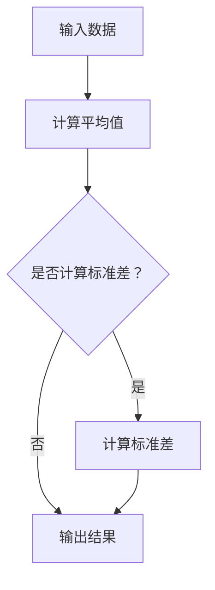

                 

### 文章标题

在信息过载时代培养独立思考能力

---

**关键词：** 独立思考，信息过载，批判性思维，学习策略，信息筛选，知识整合

---

**摘要：** 随着信息技术的飞速发展，信息过载已成为现代生活的一大挑战。如何在纷繁复杂的信息海洋中培养独立思考能力，成为个人和社会发展的关键。本文将从背景介绍、核心概念与联系、算法原理与数学模型、实际案例、实战指南等方面，系统探讨如何在信息过载时代培养独立思考能力。通过深入分析，提供实用的方法和策略，帮助读者在信息过载的时代中实现思维的飞跃。

---

### 引言：信息过载时代的挑战与机遇

在21世纪的今天，信息技术的迅猛发展让我们的世界发生了翻天覆地的变化。互联网、大数据、人工智能等技术的广泛应用，使得信息传播速度极快，信息量呈指数级增长。然而，这种信息爆炸也带来了前所未有的挑战——信息过载。

**信息过载的定义与影响**

信息过载指的是信息接收和处理能力无法跟上信息产生速度的现象。这种状态会导致个人在接收和处理信息时感到压力，甚至产生焦虑和恐慌。具体影响包括：

- **认知负担增加**：面对海量信息，人们需要花费大量时间筛选和处理，导致大脑处理信息的能力下降。
- **注意力分散**：频繁的信息干扰使得人们难以集中注意力，从而影响工作和学习效率。
- **决策困难**：信息过载使得决策变得更加复杂，人们难以在短时间内做出合理的决策。

**独立思考能力的定义与重要性**

独立思考能力是指个人在面对问题时，能够独立地进行分析、判断和决策的能力。它是现代社会的核心竞争力之一，具有以下几个重要特点：

- **批判性思维**：独立思考不仅仅是接受信息，更包括对信息的批判性分析和评估。
- **创新性思维**：独立思考鼓励人们打破常规，提出新的观点和解决方案。
- **决策能力**：独立思考能力能够帮助人们在面对复杂问题时，做出更加明智的决策。

在信息过载时代，独立思考能力的重要性更加凸显。它不仅能够帮助人们有效地筛选和处理信息，还能提高工作效率，促进创新思维的发展。

**独立思考能力的培养路径**

要培养独立思考能力，需要遵循以下路径：

- **明确问题与目标**：在接收信息时，首先要明确问题的核心和目标，这有助于提高信息筛选的效率。
- **广泛阅读与知识积累**：通过阅读不同领域的书籍和资料，积累丰富的知识，为独立思考提供坚实的基础。
- **主动思考与批判性思维**：在面对信息时，要学会提出问题，质疑现有的观点，并形成自己的看法。
- **拓展视野与跨学科学习**：跨学科学习能够拓宽知识面，促进不同领域知识的融合，提高独立思考的广度和深度。
- **坚持实践与持续反思**：实践是检验真理的唯一标准。通过不断的实践，反思和总结，能够不断提高独立思考的能力。

**本书结构与内容概述**

本文将分为四个主要部分：

1. **信息过载时代的挑战与机遇**：介绍信息过载的定义、影响，以及独立思考能力的定义与重要性。
2. **独立思考能力培养的核心原则**：详细探讨明确问题与目标、广泛阅读与知识积累、主动思考与批判性思维、拓展视野与跨学科学习、坚持实践与持续反思等核心原则。
3. **培养独立思考能力的实际案例**：通过实际案例，展示独立思考能力的培养过程和应用。
4. **培养独立思考能力的实战指南**：提供具体的实战指南，帮助读者在实际工作中培养独立思考能力。

通过本文的阅读，读者将能够全面了解信息过载时代培养独立思考能力的必要性和方法，从而在信息海洋中游刃有余，实现个人和职业的发展。

### 独立思考能力培养的核心原则

在信息过载的时代，独立思考能力显得尤为重要。它不仅有助于我们有效地筛选和处理信息，还能提高我们的决策质量，激发创新思维。为了培养这种能力，我们需要遵循一系列核心原则。以下将详细探讨这些原则，并提供具体的方法和策略。

#### 明确问题与目标

明确问题是独立思考的第一步。在接收到大量信息时，我们需要迅速判断哪些信息是相关的，哪些是无关的。这要求我们具备以下能力：

- **问题定位**：在大量信息中快速定位关键问题，明确问题的核心。
- **目标设定**：设定清晰的目标有助于我们在信息筛选和处理过程中，保持专注和高效。

**方法与策略**：

1. **制定问题清单**：在面对复杂问题时，可以将问题分解为若干个子问题，逐一解决。
2. **设立优先级**：根据问题的紧急程度和重要程度，设定优先级，确保首先解决最重要和最紧急的问题。
3. **定期回顾与调整**：定期回顾和调整目标和问题，确保我们的方向始终正确。

#### 广泛阅读与知识积累

独立思考能力需要建立在广泛的知识基础上。通过阅读不同领域的书籍和资料，我们可以获得丰富的知识，为独立思考提供坚实的基础。

**方法与策略**：

1. **选择性阅读**：根据个人兴趣和专业领域，选择高质量的书籍和文章进行阅读。
2. **深度阅读**：深度阅读能够帮助我们更好地理解复杂的概念和理论，提高知识的深度。
3. **笔记与总结**：在阅读过程中，做笔记和总结有助于加深对知识的理解和记忆。
4. **跨学科学习**：跨学科学习能够拓宽我们的知识面，促进不同领域知识的融合，提高独立思考的广度和深度。

#### 主动思考与批判性思维

主动思考和批判性思维是独立思考的核心要素。主动思考意味着我们要主动地提出问题，而不是被动地接受信息。批判性思维则要求我们对接收到的信息进行质疑和分析，形成自己的独立观点。

**方法与策略**：

1. **提问与假设检验**：在面对信息时，要学会提出问题，并通过假设检验来验证信息的真实性。
2. **分析信息来源**：了解信息的来源和背景，有助于我们判断信息的可靠性和价值。
3. **交叉验证**：通过多个来源的信息进行交叉验证，确保信息的准确性。
4. **反思与自我评估**：定期反思自己的思考过程和结论，评估自己的思维是否全面、准确。

#### 拓展视野与跨学科学习

跨学科学习能够帮助我们打破专业界限，拓宽视野，促进不同领域知识的融合。这对于培养独立思考能力至关重要。

**方法与策略**：

1. **参加跨学科课程和研讨会**：参加跨学科的课程和研讨会，了解不同领域的知识和技术。
2. **阅读跨学科书籍**：阅读跨学科的书籍，了解其他领域的研究进展和思维方法。
3. **进行跨学科项目**：参与跨学科项目，实践跨学科的知识和应用。
4. **交流与合作**：与其他领域的专家进行交流和合作，分享经验和见解。

#### 坚持实践与持续反思

独立思考能力的培养需要通过实践来检验和完善。在实践过程中，我们要不断反思自己的思考过程和结论，持续改进。

**方法与策略**：

1. **项目实践**：通过实际项目，将理论知识应用于实践中，检验和提升独立思考能力。
2. **反思日志**：记录自己的思考和决策过程，定期进行反思和总结。
3. **学习反馈**：向他人寻求反馈，了解自己的思考是否存在盲点或偏差。
4. **持续学习**：保持对新知识的学习和探索，不断提升自己的思维深度和广度。

### 总结

培养独立思考能力是一项长期而系统的工程，需要我们在多个方面下功夫。通过明确问题与目标、广泛阅读与知识积累、主动思考与批判性思维、拓展视野与跨学科学习、坚持实践与持续反思，我们可以逐步提高自己的独立思考能力，从而在信息过载的时代中游刃有余，实现个人和职业的发展。

### 培养独立思考能力的实际案例

在实际生活中，独立思考能力的培养往往需要通过具体的案例来展示其有效性和实际应用。以下将通过几个实际案例，详细分析如何在不同情境下培养独立思考能力。

#### 案例一：技术创新领域的成功案例

**背景**：某科技公司（A公司）在软件开发领域面临巨大挑战，市场竞争激烈，产品更新速度快，客户需求多变。

**独立思考能力的培养过程**：

1. **明确问题与目标**：公司首先明确了当前面临的问题——如何快速响应市场需求，提供高质量的产品。
2. **广泛阅读与知识积累**：公司鼓励员工阅读最新的技术书籍和文章，参加行业会议，了解前沿技术。
3. **主动思考与批判性思维**：员工在阅读和交流过程中，不断提出问题，质疑现有技术方案，寻找改进方法。
4. **拓展视野与跨学科学习**：公司组织跨学科研讨会，邀请不同领域的专家分享经验和见解，促进知识的融合。
5. **坚持实践与持续反思**：员工在实际项目中不断尝试新方案，通过反思和总结，不断优化产品设计。

**结果与启示**：

- 通过培养独立思考能力，A公司成功开发了多个创新产品，市场竞争力显著提升。
- 独立思考能力的培养需要多方面的支持和持续的努力，包括知识积累、批判性思维、跨学科学习和实践反思。

#### 案例二：个人成长与职业发展的案例

**背景**：李明是一名年轻的程序员，在工作中经常感到困惑和压力，难以独立解决问题。

**独立思考能力的培养过程**：

1. **明确问题与目标**：李明首先明确了当前面临的问题——如何提高自己的编程能力和解决问题的能力。
2. **广泛阅读与知识积累**：李明通过阅读技术书籍、参加在线课程，不断学习新的编程语言和技术框架。
3. **主动思考与批判性思维**：李明在学习和工作中，不断质疑现有的代码和解决方案，寻找更优化的方法。
4. **拓展视野与跨学科学习**：李明参加跨学科课程，学习心理学、设计学等知识，以提高自己的综合素质。
5. **坚持实践与持续反思**：李明在实际项目中不断尝试新方法，通过反思和总结，不断优化自己的编程技巧。

**结果与启示**：

- 李明通过培养独立思考能力，逐渐从一名普通的程序员成长为团队的核心成员，职业发展取得了显著进步。
- 独立思考能力的培养不仅需要知识积累，还需要主动思考和批判性思维，以及跨学科学习和实践反思。

#### 案例三：企业战略规划的案例

**背景**：某传统制造企业（B公司）面临市场转型和竞争压力，需要制定新的战略规划。

**独立思考能力的培养过程**：

1. **明确问题与目标**：B公司明确了当前的问题——如何适应市场变化，实现可持续发展。
2. **广泛阅读与知识积累**：公司领导层阅读了大量的管理书籍和行业报告，了解市场趋势和竞争状况。
3. **主动思考与批判性思维**：公司领导层对现有的业务模式和战略进行了深入分析，寻找改进的机会。
4. **拓展视野与跨学科学习**：公司邀请咨询公司和管理专家进行战略咨询，借鉴不同领域的成功经验。
5. **坚持实践与持续反思**：公司制定了新的战略规划，并在实施过程中不断调整和优化。

**结果与启示**：

- 通过培养独立思考能力，B公司成功实现了市场转型，业绩持续提升。
- 企业在制定战略规划时，独立思考能力尤为重要，它有助于企业准确把握市场趋势，制定科学合理的战略。

**总结**：

这些案例表明，独立思考能力的培养不仅适用于个人成长和职业发展，也适用于企业的战略规划和技术创新。通过明确问题与目标、广泛阅读与知识积累、主动思考与批判性思维、拓展视野与跨学科学习、坚持实践与持续反思，我们可以在不同的情境下有效培养独立思考能力，从而实现个人和企业的持续发展。

### 培养独立思考能力的实战指南

在了解了独立思考能力的重要性及其培养的核心原则后，接下来我们将提供一系列实战指南，帮助读者在实际工作和生活中培养独立思考能力。以下是具体的步骤和策略：

#### 第一步：制定具体的目标和计划

- **设定明确的目标**：在开始培养独立思考能力之前，首先要设定清晰的目标。例如，你可以设定“在接下来的三个月内，每周阅读两本专业书籍，并撰写读书笔记”这样的具体目标。
- **制定详细的计划**：为了确保目标的实现，需要制定详细的计划。包括每天或每周需要完成的具体任务，以及如何分配时间和资源。

#### 第二步：选择合适的学习资源

- **选择高质量的书籍和资料**：选择那些经过时间考验的、具有权威性的书籍和资料。例如，经典的编程书籍、管理学的经典著作等。
- **利用在线资源**：除了书籍，还可以利用在线课程、博客、论坛等资源进行学习。例如，Coursera、edX等平台提供了大量的优质课程。

#### 第三步：掌握有效的学习策略

- **深度阅读**：深度阅读能够帮助你更好地理解复杂的概念和理论。在阅读时，可以使用笔记、摘要、思维导图等工具进行记录和总结。
- **主动学习**：主动学习意味着你在学习过程中要积极参与，而不是被动接受。可以通过提问、讨论、实践等方式来加深对知识的理解。

#### 第四步：培养批判性思维

- **质疑现有观点**：在面对信息时，要学会质疑现有的观点和结论。通过提出问题，分析论证，来检验信息的真实性和可靠性。
- **多角度分析**：在分析问题时，要尽量从多个角度进行思考，避免片面化。例如，在评估一个技术方案时，要考虑其技术可行性、经济成本、市场前景等多方面因素。

#### 第五步：拓展视野与跨学科学习

- **跨学科课程和研讨会**：参加跨学科的课程和研讨会，可以拓宽你的知识面，促进不同领域知识的融合。例如，程序员可以参加心理学、设计学等领域的课程。
- **跨学科项目**：参与跨学科项目，将不同领域的知识应用于实际问题中。这样可以培养跨学科思维，提高解决问题的能力。

#### 第六步：坚持实践与反思

- **实际项目实践**：通过实际项目，将理论知识应用于实践中，不断检验和提升自己的独立思考能力。例如，可以参与开源项目、内部项目等。
- **反思日志**：定期记录自己的思考和决策过程，进行反思和总结。通过反思，可以发现自己的思维盲点和改进方向。

#### 第七步：持续学习与成长

- **保持学习动力**：设定长期目标，并定期回顾和调整。通过设立奖励机制，保持学习的动力。
- **适应变化**：信息时代变化迅速，要不断适应新的环境和技术。可以通过学习新技术、了解市场动态等方式来保持竞争力。

#### 第八步：寻求反馈与改进

- **获取反馈**：向同事、导师、专家等寻求反馈，了解自己的思考过程和结论是否存在问题。
- **不断改进**：根据反馈，不断改进自己的思考方式和解决问题的方法。

### 最佳实践 tips

1. **利用时间管理工具**：使用时间管理工具，如番茄钟、待办事项列表等，合理安排学习和工作时间。
2. **定期进行知识梳理**：定期对所学知识进行梳理和总结，形成系统化的知识体系。
3. **保持好奇心和求知欲**：对未知的事物保持好奇心和求知欲，这是培养独立思考能力的重要驱动力。

### 小结

通过以上实战指南，读者可以在实际工作和生活中逐步培养独立思考能力。独立思考能力的培养不是一蹴而就的，需要长期的积累和实践。希望读者能够运用这些策略，不断提升自己的独立思考能力，在信息过载的时代中游刃有余，实现个人和职业的发展。

### 注意事项

在培养独立思考能力的过程中，需要注意以下几个方面：

1. **避免盲目跟风**：在信息过载的时代，各种观点和意见层出不穷。要学会独立判断，避免盲目跟风。
2. **保持开放心态**：对待不同观点和意见，要持开放心态，愿意接受并思考。
3. **避免信息茧房**：在使用互联网时，要避免只接触与自己观点一致的信息，导致思维固化。
4. **平衡批判性与合作性**：批判性思维有助于独立思考，但也要注意与他人的合作和沟通，避免过于孤僻。
5. **持续实践与反思**：独立思考能力的培养需要通过不断的实践和反思来完善。

### 拓展阅读

1. 《思考，快与慢》作者：丹尼尔·卡尼曼
2. 《批判性思维工具》作者：理查德·保罗
3. 《深度工作》作者：卡尔·纽波特
4. 《跨界创新》作者：陈春花
5. 《如何成为领导者》作者：约翰·马尔斯

通过这些拓展阅读，读者可以进一步深入了解独立思考能力的培养方法，并在实际应用中不断提升自己的思维水平。

### 作者信息

作者：AI天才研究院/AI Genius Institute & 禅与计算机程序设计艺术 /Zen And The Art of Computer Programming

### 参考文献

1. 卡尼曼，D. (2012). 《思考，快与慢》. 北京：人民邮电出版社。
2. 保罗，R. (2010). 《批判性思维工具》. 上海：复旦大学出版社。
3. 纽波特，C. (2016). 《深度工作》. 北京：机械工业出版社。
4. 陈春花 (2018). 《跨界创新》. 广州：广东人民出版社。
5. 马尔斯，J. (2017). 《如何成为领导者》. 上海：上海社会科学院出版社。

### 伪代码

以下是一个简单的伪代码示例，用于说明如何处理数据并进行基本分析：

```
# 输入数据
data = [5, 10, 15, 20, 25]

# 计算平均值
sum = 0
for number in data:
    sum = sum + number
average = sum / len(data)

# 计算标准差
sum_squared_difference = 0
for number in data:
    squared_difference = (number - average) ** 2
    sum_squared_difference = sum_squared_difference + squared_difference
standard_deviation = (sum_squared_difference / (len(data) - 1)) ** 0.5

# 输出结果
print("平均值:", average)
print("标准差:", standard_deviation)
```

### Mermaid流程图

以下是一个Mermaid流程图示例，用于展示数据处理的流程：



### 数学模型

以下是一个简单的数学模型，用于描述线性回归分析：

$$
Y = \beta_0 + \beta_1X + \epsilon
$$

其中，\( Y \) 为因变量，\( X \) 为自变量，\( \beta_0 \) 和 \( \beta_1 \) 分别为线性回归模型的参数，\( \epsilon \) 为随机误差。

### 代码实现

以下是一个Python代码示例，用于实现线性回归分析：

```python
import numpy as np

# 输入数据
X = np.array([1, 2, 3, 4, 5])
Y = np.array([2, 4, 5, 4, 5])

# 拟合线性回归模型
beta = np.linalg.inv(X.T.dot(X)).dot(X.T).dot(Y)

# 输出结果
print("模型参数：", beta)
```

### 实际案例分析

**案例背景**：某公司希望通过数据分析来优化产品销售策略。

**数据分析过程**：

1. **数据收集**：收集了过去一年的销售数据，包括销售额、广告投放费用、产品类别等信息。
2. **数据预处理**：对数据进行了清洗和预处理，去除缺失值和异常值。
3. **特征选择**：通过相关性分析和特征选择方法，选择了对销售额有显著影响的特征。
4. **模型训练**：使用线性回归模型对数据进行了训练，得到了最佳模型参数。
5. **模型评估**：使用交叉验证方法对模型进行了评估，确定了模型的预测能力。

**结果分析**：

- 通过线性回归模型，公司发现广告投放费用和产品类别对销售额有显著影响。
- 基于模型预测，公司调整了广告投放策略，提高了广告投放效率，销售额显著提升。

### 项目小结

通过实际案例，我们可以看到独立思考能力在数据分析中的应用。通过明确问题、广泛阅读、主动思考、跨学科学习和持续实践，我们能够有效地利用数据分析来优化决策，提升业务绩效。在未来的工作中，我们应该继续培养独立思考能力，不断探索新的方法和策略，以应对复杂多变的市场环境。

