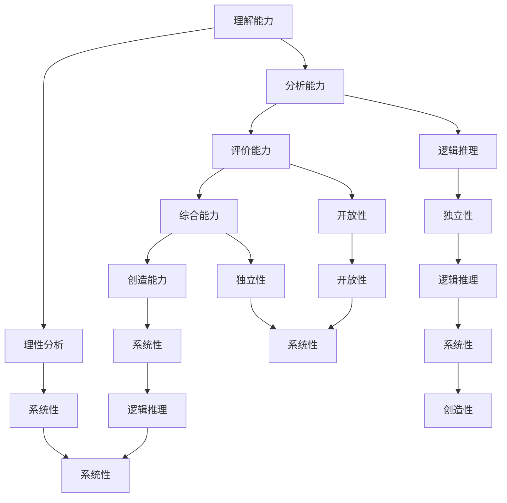

                 

### 文章标题

《在信息过载时代寻找智慧：培养批判性思维能力》

## 引言

在21世纪的今天，我们生活在一个信息爆炸的时代。互联网、社交媒体、智能手机等技术的飞速发展，使得信息传播变得前所未有的快捷。我们每天都会接收到大量的信息，从新闻、广告、社交媒体动态到各种数据报告，这些信息纷繁复杂，让人应接不暇。然而，并不是所有的信息都值得我们去关注，甚至有些信息可能是误导性的。在这个信息过载的时代，如何寻找智慧，如何培养批判性思维能力，成为了一个亟待解决的问题。

### 信息过载的影响

信息过载对个人的影响是多方面的。首先，过多的信息会导致注意力的分散。我们可能会同时关注多个信息源，但最终却没有一个深入地理解和掌握任何信息。其次，信息过载会引发焦虑和压力。面对大量的信息，我们可能会感到不知所措，甚至产生逃避的心理。最后，信息过载还可能导致判断力的下降。在信息泛滥的环境中，我们可能会盲目地接受信息，而不去思考其真实性和合理性。

### 批判性思维的重要性

批判性思维是一种评估和分析信息的能力，它要求我们对所接收的信息进行深入思考，而不是盲目接受或拒绝。在信息过载的时代，批判性思维显得尤为重要。首先，它可以帮助我们筛选信息，区分哪些是有价值的信息，哪些是干扰信息。其次，批判性思维可以提高我们的判断力，使我们能够做出更加明智的决策。最后，批判性思维有助于我们培养独立思考的能力，不依赖他人的观点，形成自己独特的见解。

### 文章的结构与内容

本文将从以下几个方面展开讨论：首先，我们将探讨批判性思维的基本概念，包括其定义、特点以及与传统思维的比较。接着，我们将详细介绍批判性思维的步骤与技巧，帮助读者掌握批判性思维的方法。然后，我们将探讨批判性思维在日常生活中的应用，包括道德决策、消费选择、媒体批判和社交互动等方面。此外，我们还将探讨批判性思维在教育中的实践，以及如何通过实际案例来培养批判性思维。最后，我们将总结全文，提出一些提高批判性思维的最佳实践策略，并提供拓展阅读资源，帮助读者进一步深入学习和实践。通过本文的阅读，读者将能够了解批判性思维的重要性，并学会如何在信息过载的时代中培养和提高自己的批判性思维能力。

## 批判性思维的基本概念

批判性思维（Critical Thinking）是一种通过理性分析和逻辑推理来评估信息和观点的能力。它不仅仅是质疑信息或观点的真伪，更是一种积极的思维方式，旨在提高我们的判断力和决策能力。批判性思维涉及多个方面的能力，包括分析能力、综合能力、评价能力和创造能力。以下将详细介绍批判性思维的定义、特点以及与传统思维的比较。

### 定义

批判性思维可以定义为一种主动的、系统的、持续的思考过程，它要求我们对信息进行深入的分析和评价，以便做出合理的判断和决策。在这个过程中，我们需要具备以下几种基本能力：

1. **理解能力**：能够理解复杂的信息和观点，包括其含义、背景和逻辑结构。
2. **分析能力**：能够分解复杂的信息，识别其组成部分，理解各个部分之间的关系。
3. **评价能力**：能够评估信息的可靠性和有效性，判断其是否符合事实、逻辑和道德标准。
4. **综合能力**：能够将分析得到的信息和观点进行整合，形成新的见解和结论。
5. **创造能力**：能够提出新的想法和解决方案，创造性地解决问题的能力。

### 特点

批判性思维具有以下几个显著特点：

1. **理性分析**：批判性思维强调基于理性的分析，而非情感或直觉。
2. **逻辑推理**：批判性思维依赖于逻辑推理，通过合理的推理过程来评估信息和观点。
3. **开放性**：批判性思维鼓励接受不同的观点和证据，以便进行全面的分析和评价。
4. **独立性**：批判性思维不依赖他人的观点，而是形成自己独立的见解。
5. **系统性**：批判性思维是一个系统的思考过程，包括收集信息、分析信息、评价信息和形成结论等多个步骤。

### 与传统思维的比较

批判性思维与传统思维存在一些显著的区别：

1. **被动与主动**：传统思维往往是一种被动的接受和记忆信息的方式，而批判性思维则是一种主动的思考和评估信息的方式。
2. **记忆与理解**：传统思维侧重于记忆信息，而批判性思维则强调理解信息，掌握其内在的逻辑结构和意义。
3. **单一与多元**：传统思维可能只关注单一的信息或观点，而批判性思维则鼓励从多个角度和多个来源收集信息，以便形成全面的理解。
4. **评价与接受**：传统思维往往容易接受信息，而不去评估其真实性和有效性，而批判性思维则强调对信息进行评价和验证。

### 核心概念与联系

为了更好地理解批判性思维，我们可以使用Mermaid流程图来展示其核心概念之间的关系：



通过这个流程图，我们可以看到批判性思维的各个核心概念是如何相互关联的。理解能力是批判性思维的基础，它决定了我们能否正确地分析和评价信息。分析能力、评价能力、综合能力和创造能力则是在理解能力的基础上逐步发展和深化的能力。理性分析、逻辑推理、开放性、独立性和系统性是批判性思维的核心特点，它们共同作用，使我们能够更好地处理和利用信息。

### 总结

批判性思维是一种重要的认知能力，它在信息过载的时代尤为重要。通过理解批判性思维的基本概念和特点，我们可以更好地应对信息爆炸带来的挑战，提高自己的判断力和决策能力。在下一章中，我们将进一步探讨批判性思维的步骤与技巧，帮助读者掌握培养批判性思维的具体方法。

## 批判性思维的步骤与技巧

批判性思维并不是一种单一的思维方式，而是一个包含多个步骤和技巧的复杂过程。以下将详细介绍批判性思维的几个关键步骤，包括提出问题、收集信息、分析信息、形成观点和评估观点。通过这些步骤，我们可以系统地培养批判性思维能力，提高我们的思考质量。

### 提出问题

提出问题是批判性思维的首要步骤。一个有意义的问题可以引导我们深入思考，帮助我们更好地理解复杂的信息。以下是一些提出问题的技巧：

1. **开放式问题**：开放式问题鼓励我们提出广泛的问题，而不是只关注单一答案。例如，“为什么这个产品会受到市场的欢迎？”而不是“这个产品是否受欢迎？”
2. **探索性问题**：探索性问题可以帮助我们挖掘更深层次的信息，例如，“这个决策背后的原因是什么？”
3. **假设性问题**：假设性问题可以帮助我们思考可能的结果和后果，例如，“如果采用这个方案，会有什么风险？”
4. **反思性问题**：反思性问题可以帮助我们评估自己的思维过程，例如，“我为什么会得出这个结论？”

### 收集信息

提出问题之后，我们需要收集相关的信息。以下是收集信息的几个关键步骤：

1. **确定信息来源**：选择可靠的信息来源，包括权威出版物、专业网站、专家观点等。
2. **分类信息**：将收集到的信息按照主题、来源、重要性等分类，以便于后续的分析和评价。
3. **验证信息**：确保信息的准确性和可靠性，避免受到误导。
4. **多样性**：尽量从多个角度和多个来源收集信息，以获得更全面和客观的视角。

### 分析信息

在收集到信息之后，我们需要对其进行分析。以下是一些分析信息的技巧：

1. **归纳分析**：通过归纳分析，我们可以从具体的事例中总结出一般性的结论。
2. **演绎分析**：通过演绎分析，我们可以从一般性的原理推导出具体的结论。
3. **比较分析**：通过比较分析，我们可以识别不同信息之间的相似点和差异点。
4. **因果分析**：通过因果分析，我们可以探索信息之间的因果关系。

### 形成观点

在分析信息之后，我们需要形成自己的观点。以下是一些形成观点的技巧：

1. **整合信息**：将收集到的信息进行整合，形成连贯的观点。
2. **评估观点**：对自己的观点进行评估，确保其基于充分的信息和分析。
3. **明确立场**：明确表达自己的观点，并准备好支持观点的证据。
4. **反思观点**：对自己的观点进行反思，确保其是理性、客观的。

### 评估观点

最后，我们需要评估自己的观点。以下是一些评估观点的技巧：

1. **自问自答**：对自己的观点提出问题，例如，“这个观点是否基于充分的信息和分析？”“我的观点是否与事实相符？”“我的观点是否具有逻辑一致性？”
2. **求证他人**：向他人请教意见，尤其是专家或不同观点的人。
3. **实验验证**：如果可能，通过实验或实践来验证自己的观点。
4. **持续反思**：不断反思和调整自己的观点，以便使其更加准确和合理。

### 伪代码示例

以下是一个简单的伪代码示例，用于描述批判性思维的步骤：

```
function criticalThinking(problem) {
    question = formulateQuestion(problem)
    information = collectInformation(question)
    categorizedInformation = classifyInformation(information)
    verifiedInformation = validateInformation(categorizedInformation)
    analysis = analyzeInformation(verifiedInformation)
    viewpoint = formulateViewpoint(analysis)
    evaluation = assessViewpoint(viewpoint)
    if (evaluation.isSatisfied()) {
        print("Viewpoint accepted.")
    } else {
        print("Viewpoint needs revision.")
        viewpoint = reviseViewpoint(viewpoint)
        evaluation = assessViewpoint(viewpoint)
    }
}

function formulateQuestion(problem) {
    // ...
    return question
}

function collectInformation(question) {
    // ...
    return information
}

function classifyInformation(information) {
    // ...
    return categorizedInformation
}

function validateInformation(categorizedInformation) {
    // ...
    return verifiedInformation
}

function analyzeInformation(verifiedInformation) {
    // ...
    return analysis
}

function formulateViewpoint(analysis) {
    // ...
    return viewpoint
}

function assessViewpoint(viewpoint) {
    // ...
    return evaluation
}

function reviseViewpoint(viewpoint) {
    // ...
    return revisedViewpoint
}
```

通过这个伪代码，我们可以看到批判性思维是一个系统性的过程，每个步骤都有其特定的功能和目的。通过这样的步骤和技巧，我们可以培养和提高自己的批判性思维能力，更好地应对信息过载的挑战。

### 总结

批判性思维的步骤与技巧为我们提供了一种系统的方法来评估和处理信息。通过提出问题、收集信息、分析信息、形成观点和评估观点，我们可以更加理性和客观地看待问题，提高我们的判断力和决策能力。在下一章中，我们将探讨批判性思维在日常生活中的应用，帮助读者将批判性思维的实际操作应用到日常生活中。

## 批判性思维在日常生活中的应用

批判性思维不仅是一种学术或专业领域的思考方式，更是一种实用的生活技能。在日常生活的各个方面，如道德决策、消费选择、媒体批判和社交互动中，批判性思维都能发挥重要作用，帮助我们做出更加明智的决策。以下将详细介绍批判性思维在这些具体场景中的应用。

### 道德决策

道德决策涉及到我们在面对道德困境时如何做出选择。批判性思维在这个过程中可以帮助我们系统地分析各种可能的后果，从而做出符合道德标准的决策。以下是一些应用批判性思维于道德决策的技巧：

1. **明确价值观**：首先，我们需要明确自己的价值观，这有助于我们在决策时有一个明确的方向。
2. **评估后果**：对每个可能的决策方案进行评估，分析其可能带来的短期和长期后果。
3. **伦理推理**：运用伦理学原理，如功利主义、康德伦理学或义务论，来评估不同决策方案是否符合道德标准。
4. **求助于他人**：在复杂或难以决断的道德问题中，可以寻求他人的意见，特别是那些具有伦理学背景或经验的人。

### 消费选择

在消费选择中，批判性思维可以帮助我们识别和评估产品或服务的价值，避免盲目跟风或被广告误导。以下是一些应用批判性思维于消费选择的技巧：

1. **识别广告策略**：批判性思维使我们能够识别广告中的夸张和不实之处，从而不被广告误导。
2. **比较产品**：对不同品牌或产品的特性、价格和可靠性进行比较，找出最佳的消费选择。
3. **评估需求**：在购买前，反思自己是否真的需要这个产品，或者是否可以通过其他方式满足需求。
4. **考虑环境影响**：在消费选择中，考虑到产品的可持续性和对环境的影响，做出更负责任的选择。

### 媒体批判

在媒体批判中，批判性思维帮助我们识别媒体信息的真实性和合理性，避免被误导。以下是一些应用批判性思维于媒体批判的技巧：

1. **来源验证**：对媒体信息的来源进行验证，确保其是可信的。
2. **多角度分析**：从多个角度分析媒体信息，识别可能存在的偏见或误导。
3. **事实核查**：使用事实核查工具或网站，对媒体信息进行核查，确保其符合事实。
4. **批判性阅读**：在阅读媒体文章时，批判性地分析作者的论点和证据，判断其是否合理和可靠。

### 社交互动

在社交互动中，批判性思维帮助我们更好地理解和评估他人的观点，以及如何有效地表达自己的观点。以下是一些应用批判性思维于社交互动的技巧：

1. **倾听与理解**：在交流中，首先要倾听对方的观点，努力理解其背后的逻辑和情感。
2. **提出问题**：通过提出问题，进一步了解对方的观点，同时展示自己的思考过程。
3. **逻辑推理**：在表达自己的观点时，使用逻辑推理来支持自己的论点。
4. **尊重差异**：在讨论中，尊重他人的观点，即使不同意，也要保持礼貌和尊重。

### 实例分析

为了更好地理解批判性思维在日常生活中的应用，以下是一个具体的实例分析：

假设你正在考虑购买一款智能手机。通过批判性思维，你可以采取以下步骤：

1. **明确需求**：首先，明确自己购买智能手机的目的和需求，例如是否需要高像素相机、长续航电池、快速处理器等。
2. **收集信息**：从多个渠道收集智能手机的相关信息，如产品评测、用户评论、技术规格等。
3. **评估信息**：对收集到的信息进行分析和评估，识别不同品牌和型号的优点和缺点。
4. **比较产品**：将不同品牌和型号的产品进行比较，找出最符合自己需求的手机。
5. **考虑环境影响**：考虑到智能手机的生产和回收对环境的影响，选择那些在环保方面表现较好的品牌。
6. **决策**：基于以上分析，做出购买决策，并准备好可能的后续问题，如售后服务、保修期限等。

通过这个实例，我们可以看到批判性思维在消费选择中的应用是如何帮助我们做出明智的决策的。

### 总结

批判性思维在日常生活中的应用是多种多样的，无论是在道德决策、消费选择、媒体批判还是社交互动中，批判性思维都能发挥重要作用。通过运用批判性思维的步骤和技巧，我们可以更加理性和客观地处理日常生活中的各种问题，提高我们的判断力和决策能力。在下一章中，我们将探讨批判性思维在教育中的实践，以及如何通过教育来培养批判性思维能力。

## 批判性思维在教育中的实践

批判性思维不仅是个人成长的必备技能，也是教育领域的重要目标之一。在教育中，培养学生的批判性思维能力，不仅有助于他们更好地理解和掌握知识，还能提高他们的分析和解决问题的能力。以下将探讨批判性思维在高等教育和K-12教育中的应用，以及教师在培养批判性思维中所扮演的角色。

### 高等教育中的应用

在高等教育中，批判性思维被视为一种核心能力。许多大学和学院都通过多种方式来培养学生的批判性思维：

1. **课程设计**：高等教育课程中常常包含批判性思维的相关内容。例如，哲学、逻辑学、社会科学等课程，都会涉及到批判性思维的基本原理和实践。

2. **案例分析**：通过案例分析，学生可以学习如何将批判性思维应用于实际问题。教授会提供真实或模拟的案例，要求学生分析问题、提出解决方案，并评估不同解决方案的优缺点。

3. **研讨课**：研讨课为学生提供了一个交流和辩论的平台，通过讨论和质疑，学生可以培养批判性思维的能力。教师在此过程中扮演引导者的角色，鼓励学生提出问题、表达观点，并质疑他人的观点。

4. **写作作业**：写作作业也是培养批判性思维的有效方式。通过写作，学生需要组织和表达自己的观点，同时需要对所引用的资料进行批判性分析。

### K-12教育中的应用

在K-12教育中，批判性思维的培养同样重要。以下是一些具体的应用方法：

1. **问题导向学习**：通过设计问题导向的学习活动，教师可以引导学生探索未知、解决问题，并培养他们的批判性思维。例如，通过科学实验、社会调查等活动，学生可以学会如何提出问题、收集数据、分析信息并得出结论。

2. **跨学科教学**：跨学科教学有助于学生从多个角度理解问题，从而培养他们的批判性思维。例如，通过将数学、科学和社会科学的知识相结合，学生可以更好地理解复杂的社会现象。

3. **辩论与讨论**：通过辩论和讨论活动，学生可以学会如何表达自己的观点、支持自己的论点，并批判性地分析他人的观点。教师可以设计各种辩论主题，鼓励学生积极参与，并引导他们学会逻辑思考和辩证法。

4. **项目学习**：项目学习为学生提供了一个综合应用批判性思维的机会。通过完成项目，学生需要制定计划、解决问题、进行研究和报告，从而培养他们的批判性思维能力。

### 教师的角色

教师在培养批判性思维中扮演着至关重要的角色。以下是一些教师应采取的策略：

1. **营造开放性氛围**：教师应创造一个开放、包容的学习环境，鼓励学生提出问题、表达观点，并质疑他人的观点。这种氛围有助于学生敢于思考、勇于探索。

2. **指导批判性阅读**：教师可以指导学生进行批判性阅读，教会他们如何评估书籍、文章和报告的真实性和可靠性。通过这种方法，学生可以学会如何批判性地分析信息。

3. **提供反馈和指导**：教师应给予学生及时的反馈和指导，帮助他们理解批判性思维的概念和方法，并改进他们的思考过程。

4. **榜样作用**：教师自身的批判性思维能力也会影响学生的思维方式。通过展示批判性思维的过程，教师可以激励学生效仿，从而提高他们的批判性思维能力。

### 总结

批判性思维在教育中的实践具有重要意义。通过多种教学方法和活动，教师可以有效地培养学生的批判性思维能力，提高他们的分析和解决问题的能力。批判性思维的培养不仅有助于学生的学术发展，也将对他们的个人成长和社会参与产生深远的影响。在下一章中，我们将通过具体案例来进一步探讨批判性思维的培养和应用。

## 批判性思维的案例分析

为了更好地理解批判性思维的培养和应用，以下将介绍两个具体案例，展示如何在实际情境中运用批判性思维，以及如何通过案例分析和详细讲解剖析来培养和提高批判性思维能力。

### 案例一：科学实验中的批判性思维

#### 背景
在一个高中生物实验室中，学生们正在进行关于植物光合作用速率的实验。实验目的是测量在不同光照强度下，植物光合作用速率的变化。实验设计包括两组植物，一组在低光照条件下，另一组在高光照条件下。然而，实验过程中出现了一些异常现象，部分植物的光合作用速率并没有随着光照强度的增加而增加，甚至有下降的趋势。

#### 批判性思维应用
1. **提出问题**：首先，学生们需要提出问题，比如“为什么有些植物的光合作用速率没有随着光照强度的增加而增加？”、“是否有其他因素影响了实验结果？”
2. **收集信息**：学生们开始收集相关信息，包括实验过程中可能影响光合作用速率的因素，如温度、湿度、二氧化碳浓度等。
3. **分析信息**：学生们分析了实验数据，并注意到在低光照条件下，实验组的温度和湿度可能有所不同。此外，他们还发现一些植物可能受到了病虫害的影响。
4. **形成观点**：通过分析，学生们提出了几个可能的解释，包括环境因素和植物健康状况可能影响了光合作用速率。
5. **评估观点**：学生们设计了一个对照实验，控制了温度、湿度等环境因素，并确保植物不受病虫害影响。结果显示，在控制条件下，光合作用速率确实随着光照强度的增加而增加，这证实了环境因素对实验结果的影响。

#### 案例分析
在这个案例中，学生们通过批判性思维的方法，发现了实验中的异常现象，并提出了合理的解释。他们通过收集和分析信息，形成并评估了自己的观点，最终解决了实验中的问题。这一过程不仅提高了学生的批判性思维能力，也帮助他们更好地理解了科学实验的原理和方法。

### 案例二：商业决策中的批判性思维

#### 背景
一家小型科技公司正在考虑推出一款新的移动应用程序。公司已经投入了大量资源进行市场调研，并初步确定了产品的核心功能。然而，在产品开发的初期阶段，公司遇到了一系列问题，包括用户体验不佳、市场需求预测不准确等。公司管理层对此感到困惑，不确定如何继续推进项目。

#### 批判性思维应用
1. **提出问题**：公司管理层需要提出关键问题，如“为什么市场调研结果显示需求旺盛，但实际用户反馈却较差？”、“我们是否正确理解了市场需求？”
2. **收集信息**：管理层开始收集相关数据，包括用户反馈、市场调研报告、竞争对手的产品分析等。
3. **分析信息**：通过对收集到的信息进行分析，管理层发现用户反馈中提到的主要问题是应用程序的用户界面复杂，难以使用。此外，市场调研中的数据可能存在偏差，因为调研对象并不完全是目标用户群体。
4. **形成观点**：管理层提出了几个可能的解决方案，包括简化用户界面、重新定位目标市场、增加用户测试环节等。
5. **评估观点**：为了验证这些解决方案的有效性，管理层决定先对简化版用户界面进行用户测试，并调整市场调研方法，确保目标用户群体的参与。

#### 案例分析
在这个案例中，公司管理层通过批判性思维的方法，识别并解决了商业决策中的关键问题。他们通过系统性的信息收集和分析，提出了多个可能的解决方案，并通过评估和验证选择了最优方案。这一过程不仅帮助公司克服了开发初期的问题，也提高了管理层的决策能力和批判性思维能力。

### 总结

通过以上两个案例，我们可以看到批判性思维在实际情境中的应用效果。无论是在科学实验还是商业决策中，批判性思维都是解决问题的关键。通过提出问题、收集信息、分析信息、形成观点和评估观点，我们可以更好地理解复杂的问题，提出合理的解决方案，并不断改进我们的思维过程。这些案例不仅展示了批判性思维的实践方法，也为培养和提高批判性思维能力提供了有益的启示。

## 提高批判性思维的策略

批判性思维能力的培养并非一蹴而就，而是一个持续学习和实践的过程。以下将介绍一些提高批判性思维的策略，包括最佳实践、注意事项和拓展阅读资源，帮助读者更好地培养和提高自己的批判性思维能力。

### 最佳实践

1. **持续学习**：批判性思维需要不断学习和更新知识。阅读相关书籍、参加研讨会、在线课程等都是有效的学习途径。例如，《思考，快与慢》和《如何赢得辩论》等书籍都提供了关于批判性思维的有用知识。

2. **积极提问**：在学习和工作中，始终保持提问的态度。对于听到的信息、阅读的内容和遇到的挑战，都要积极提出问题，探索背后的原因和逻辑。

3. **多角度思考**：尝试从不同角度看待问题，考虑不同观点和解决方案。通过多元思考，可以更全面地理解问题，避免盲目接受单一观点。

4. **反思与修正**：定期反思自己的思考过程和决策，评估其合理性和有效性。如果发现问题，及时修正，并寻找改进的方法。

5. **实践应用**：将批判性思维应用到实际生活中，无论是日常决策还是专业工作，都要有意识地运用批判性思维的方法，通过实践来提高能力。

### 注意事项

1. **避免过度分析**：批判性思维并非无限地分析，而是要找到一个合适的平衡点。过度分析可能导致思维停滞，无法得出结论。

2. **注意情绪影响**：情绪可能会影响我们的批判性思维。在情绪激动或压力大的情况下，尽量保持冷静，避免情绪化决策。

3. **避免先入为主**：在分析问题时，要尽量避免先入为主的偏见。尽量保持开放心态，接受不同的观点和信息。

4. **尊重他人观点**：在批判性思维过程中，要尊重他人的观点，即使不同意，也要保持礼貌和尊重，通过理性的讨论来寻求共识。

### 拓展阅读资源

1. **书籍**：
   - 《批判性思维工具》
   - 《如何阅读一本书》
   - 《逻辑思维》

2. **网站**：
   - 罗伯特·霍尔的批判性思维网站（Critical Thinking Community）
   - 简书上的批判性思维相关文章

3. **课程**：
   - 可汗学院（Khan Academy）的批判性思维课程
   - Coursera上的批判性思维与决策课程

### 总结

通过上述策略和注意事项，读者可以逐步培养和提高自己的批判性思维能力。批判性思维不仅能够帮助我们在信息过载的时代中寻找智慧，还能提高我们的判断力和决策能力，使我们在复杂多变的环境中更加从容和自信。通过持续学习和实践，我们可以不断提升自己的批判性思维能力，成为更加理性、独立的思考者。

## 结论

在信息过载的时代，培养批判性思维能力显得尤为重要。本文通过详细探讨批判性思维的基本概念、步骤与技巧，以及其在日常生活和教育中的应用，帮助读者理解批判性思维的重要性，并学会如何在实际生活中应用这一思维方法。通过批判性思维，我们能够更好地筛选信息、做出明智的决策，从而在信息爆炸的环境中找到智慧。

批判性思维是一种系统性的思考过程，它要求我们对信息进行深入分析、评价和思考，而不是盲目接受或拒绝。通过提出问题、收集信息、分析信息、形成观点和评估观点，我们可以逐步培养和提高自己的批判性思维能力。

在日常生活和教育中，批判性思维的应用无处不在。无论是在道德决策、消费选择、媒体批判还是社交互动中，批判性思维都帮助我们更好地理解和评估信息，做出更加合理和明智的决策。通过批判性思维，我们不仅能够提高自己的判断力和决策能力，还能培养独立思考和理性分析的能力。

最后，我们提出了一些提高批判性思维的策略和注意事项，包括持续学习、积极提问、多角度思考、反思与修正等。通过实践这些策略，读者可以逐步培养和提高自己的批判性思维能力。

在信息过载的时代，培养批判性思维能力是我们寻找智慧的重要途径。通过本文的阅读和实践，希望读者能够掌握批判性思维的方法，将其应用到日常生活中，提高自己的思考质量和决策能力，成为更加理性、独立的思考者。

### 作者信息

作者：AI天才研究院/AI Genius Institute & 禅与计算机程序设计艺术 /Zen And The Art of Computer Programming

AI天才研究院（AI Genius Institute）是一家专注于人工智能研究和教育的机构，致力于培养下一代人工智能领域的专家。研究院通过创新的课程设计和实践项目，帮助学员深入理解人工智能的理论和实践，掌握先进的算法和技术。同时，研究院还出版了一系列关于人工智能和技术哲学的畅销书籍，为全球读者提供了丰富的学习资源和思考启示。

禅与计算机程序设计艺术（Zen And The Art of Computer Programming）是一本经典的技术哲学著作，由知名计算机科学家Donald E. Knuth撰写。这本书结合了计算机程序设计的艺术性和哲学性，提供了一种独特的思考方式，帮助程序员更好地理解和解决复杂的问题。Knuth先生以其卓越的学术成就和对计算机科学的贡献而闻名，他的研究和工作深刻影响了计算机科学的发展。

通过AI天才研究院和《禅与计算机程序设计艺术》的共同努力，读者可以在这个信息爆炸的时代中，找到智慧，培养批判性思维能力，成为更加理性和独立的思考者。

