                 

### 文章标题

# 在全球化背景下维护文化认同：应对身份危机的创新方法

## 文章关键词

- 全球化
- 文化认同
- 身份危机
- 创新方法
- 文化融合

### 文章摘要

在全球化的浪潮中，文化认同和身份危机成为不可忽视的社会现象。本文探讨了全球化背景下文化认同的重要性，以及由此引发的身份危机。通过分析教育、媒体、政策和数字化技术等领域的创新方法，本文提出了应对身份危机的有效策略，以维护文化认同，促进多元文化的和谐发展。

---

## 第一部分：全球化背景下的文化认同与身份危机

### 第1章：全球化趋势下的文化认同

#### 1.1 全球化的影响与挑战

全球化使世界变得更加紧密，促进了经济、技术和信息的交流，但同时也带来了文化同质化的风险。文化的多样性受到了威胁，可能导致本土文化的消失和个体身份的模糊。

**核心概念与联系**

全球化对文化认同的影响可以概括为以下架构：

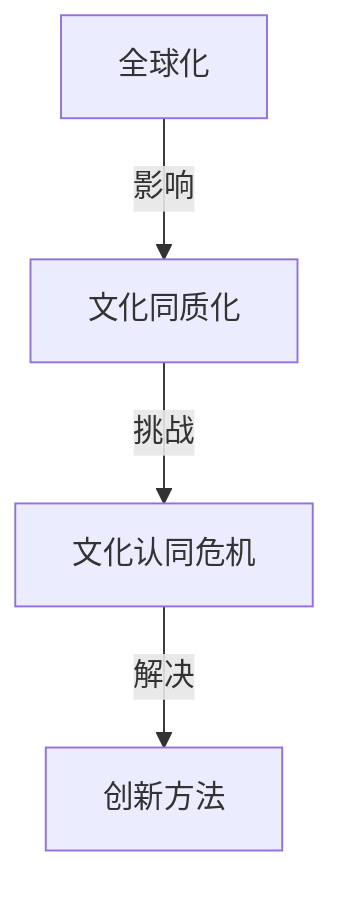

**核心算法原理讲解**

没有具体的算法原理，但可以通过以下步骤来理解全球化对文化认同的影响：

1. **经济一体化**：国际贸易和资本流动加剧，可能导致本土文化产品和服务在国际市场上的竞争压力。
2. **技术进步**：信息技术的发展使文化传播变得更加便捷，但可能削弱了本土文化的影响力。
3. **文化交流**：全球化促进了不同文化之间的交流，但也可能导致文化融合而非文化认同的增强。

**数学模型和公式**

没有特定的数学模型，但可以通过以下公式来描述全球化与文化认同之间的关系：

$$ 文化认同 = f(文化交流, 本土文化保护, 教育投入) $$

**举例说明**

举例来说，随着跨国公司和西方文化的渗透，许多国家面临本土文化认同下降的风险。例如，中国的传统文化和价值观在某些地区受到西方文化的冲击，导致年轻人更倾向于接受西方的生活方式。

#### 1.2 文化认同的概念与重要性

文化认同是指个体或群体对于其所属文化的认同感和归属感。它不仅影响个人的行为和价值观，也影响社会的稳定和发展。

**核心概念与联系**

文化认同的概念可以与以下流程图进行关联：

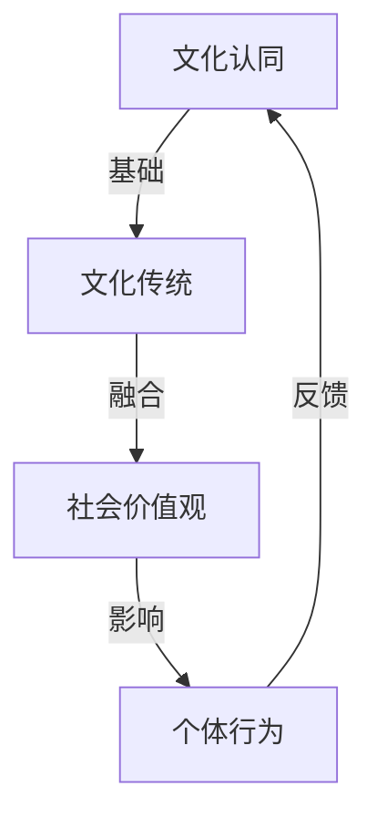

**核心算法原理讲解**

理解文化认同的原理可以通过以下步骤：

1. **文化传统**：文化认同建立在个体的文化传统之上，这些传统包括语言、宗教、习俗和价值观。
2. **社会价值观**：社会价值观是文化认同的重要组成部分，它们指导个体的行为和决策。
3. **个体行为**：个体的行为反过来影响和塑造了文化认同。

**数学模型和公式**

可以通过以下公式来描述文化认同的形成：

$$ 文化认同 = f(文化传统, 社会价值观, 个人经历) $$

**举例说明**

一个例子是，许多移民在新的国家中努力保持其原有的文化传统和价值观，这不仅有助于他们适应新环境，也能丰富当地社会的文化多样性。

#### 1.3 身份危机的根源与表现形式

身份危机是指个体在面临文化冲击时，对其自身身份认同的困惑和不安。它是全球化背景下文化认同危机的一个重要表现。

**核心概念与联系**

身份危机的根源和表现形式可以概括为以下流程图：

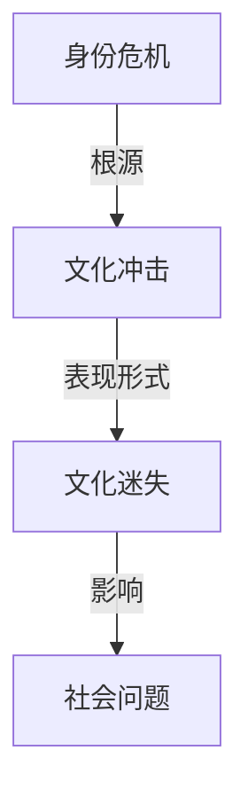

**核心算法原理讲解**

理解身份危机的根源和表现形式可以通过以下步骤：

1. **文化冲击**：全球化带来的文化冲击导致个体面临新的文化和价值观，从而引发身份认同的危机。
2. **文化迷失**：个体在面临多种文化时，可能会感到迷茫，无法确定自己的身份。
3. **社会问题**：身份危机可能导致一系列社会问题，如社会排斥、文化冲突和心理健康问题。

**数学模型和公式**

可以通过以下公式来描述身份危机的形成：

$$ 身份危机 = f(文化冲击, 个人适应能力, 社会支持系统) $$

**举例说明**

例如，在移民过程中，一些人可能会感到自己的文化传统被削弱，从而导致对自身身份的质疑和不安。

### 第2章：全球化背景下的文化同质化

#### 2.1 文化同质化的现象与影响

文化同质化是指全球范围内文化多样性的减少，导致文化趋于一致的现象。这种现象可能是由于全球化带来的文化影响所致。

**核心概念与联系**

文化同质化的现象和影响可以概括为以下流程图：

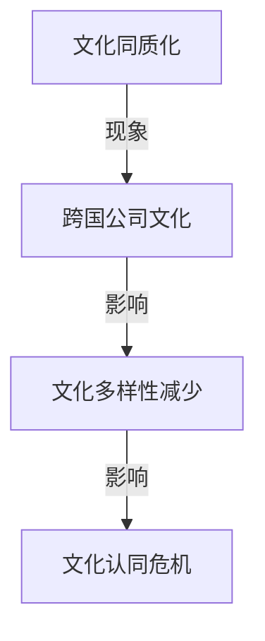

**核心算法原理讲解**

理解文化同质化的现象和影响可以通过以下步骤：

1. **跨国公司文化**：跨国公司的全球化经营可能导致其文化的传播，从而影响本土文化。
2. **文化多样性减少**：文化同质化可能导致本土文化的消失，减少文化多样性。
3. **文化认同危机**：文化同质化可能加剧文化认同危机，导致个体对其身份认同的不确定。

**数学模型和公式**

可以通过以下公式来描述文化同质化对文化认同的影响：

$$ 文化认同危机 = f(文化同质化程度, 文化多样性水平) $$

**举例说明**

例如，快餐文化的全球化可能导致当地传统饮食文化的消失，从而影响当地居民的文化认同。

#### 2.2 文化多样性的保护与促进

为了应对文化同质化，保护文化多样性成为一项重要任务。以下是一些保护与促进文化多样性的方法：

**核心概念与联系**

文化多样性的保护与促进可以概括为以下流程图：

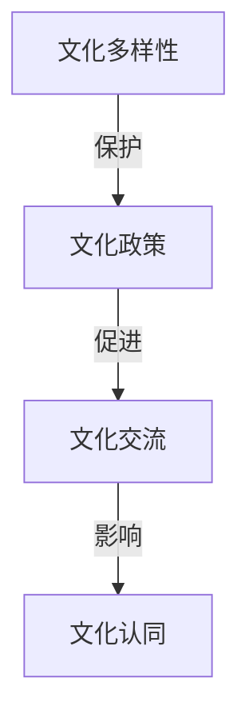

**核心算法原理讲解**

理解文化多样性的保护与促进可以通过以下步骤：

1. **文化政策**：政府制定文化政策，保护本土文化，限制文化同质化。
2. **文化交流**：通过文化交流活动，促进不同文化之间的理解与尊重。
3. **文化认同**：文化多样性的保护有助于增强文化认同，减少身份危机。

**数学模型和公式**

可以通过以下公式来描述文化多样性对文化认同的影响：

$$ 文化认同 = f(文化多样性, 文化交流, 文化政策) $$

**举例说明**

例如，中国通过推广国潮文化，保护并促进本土文化的多样性，增强了国民的文化认同感。

#### 2.3 文化融合与创新

文化融合与创新是应对文化同质化的一种有效方法。它强调在尊重本土文化多样性的基础上，通过创新手段促进文化的交流与发展。

**核心概念与联系**

文化融合与创新可以概括为以下流程图：

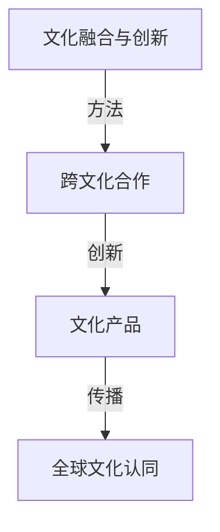

**核心算法原理讲解**

理解文化融合与创新可以通过以下步骤：

1. **跨文化合作**：通过不同文化之间的合作，创造出新的文化产品和体验。
2. **文化产品**：创新的文化产品可以促进文化的传播，增强文化认同。
3. **全球文化认同**：全球文化认同的形成有助于减少文化同质化，促进文化的多样性。

**数学模型和公式**

可以通过以下公式来描述文化融合与创新对文化认同的影响：

$$ 文化认同 = f(跨文化合作, 创新文化产品, 全球文化传播) $$

**举例说明**

例如，迪士尼将本土故事和文化元素融入其作品中，创造出全球受欢迎的文化产品，促进了文化的融合与创新。

## 第二部分：文化认同的维护策略

### 第3章：教育领域中的文化认同教育

#### 3.1 学校教育中的文化认同教育

学校教育在培养文化认同方面发挥着重要作用。通过课程设置和教学活动，学校可以引导学生了解和尊重不同文化，增强文化认同。

**核心概念与联系**

学校教育中的文化认同教育可以概括为以下流程图：

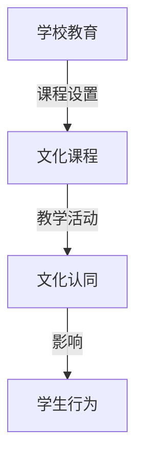

**核心算法原理讲解**

理解学校教育中的文化认同教育可以通过以下步骤：

1. **课程设置**：学校应设置多样化的文化课程，涵盖不同文化的知识。
2. **教学活动**：通过实地考察、文化交流等活动，增强学生对不同文化的理解。
3. **文化认同**：文化认同教育的目标在于培养学生的文化认同感，减少身份危机。

**数学模型和公式**

可以通过以下公式来描述学校教育对文化认同的影响：

$$ 文化认同 = f(文化课程设置, 教学活动, 学生参与度) $$

**举例说明**

例如，一些学校设置了中文和外语双语的课程，鼓励学生了解和尊重不同文化。

#### 3.2 社区教育中的文化认同教育

社区教育在文化认同教育中也扮演着重要角色。通过社区活动和文化传承项目，社区可以促进居民对本土文化的认同和尊重。

**核心概念与联系**

社区教育中的文化认同教育可以概括为以下流程图：

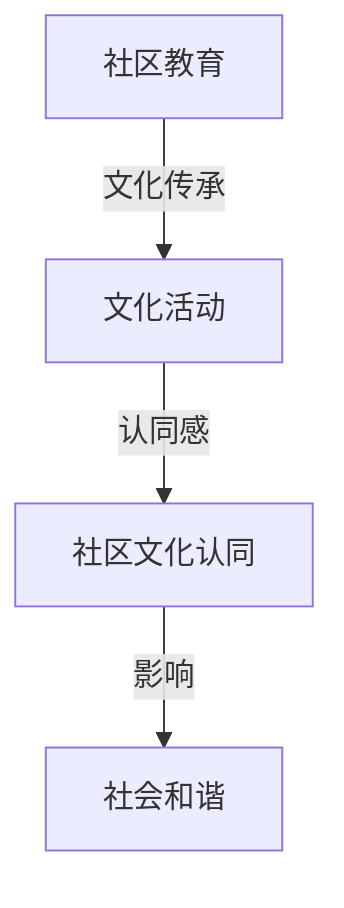

**核心算法原理讲解**

理解社区教育中的文化认同教育可以通过以下步骤：

1. **文化传承**：社区通过举办文化节、民俗活动等，传承和弘扬本土文化。
2. **文化活动**：社区活动可以增强居民对本土文化的认同感。
3. **社区文化认同**：社区文化认同的增强有助于促进社会和谐。

**数学模型和公式**

可以通过以下公式来描述社区教育对文化认同的影响：

$$ 社区文化认同 = f(文化传承活动, 文化活动参与度, 社区支持) $$

**举例说明**

例如，许多社区通过举办传统节日庆祝活动，如春节、中秋节等，增强居民对本土文化的认同。

#### 3.3 家庭教育中的文化认同教育

家庭教育在文化认同教育中同样重要。家长可以通过日常互动和家庭教育活动，培养孩子的文化认同感。

**核心概念与联系**

家庭教育中的文化认同教育可以概括为以下流程图：

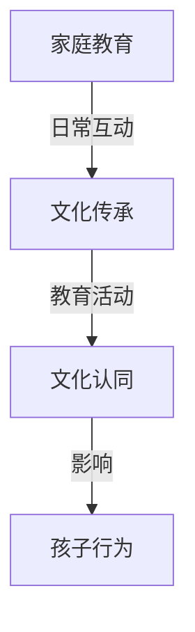

**核心算法原理讲解**

理解家庭教育中的文化认同教育可以通过以下步骤：

1. **日常互动**：家长通过与孩子的日常交流，传递文化价值观和传统。
2. **教育活动**：家长可以组织家庭文化活动，如讲故事、制作手工艺品等，培养孩子的文化认同。
3. **文化认同**：家庭教育的目标是培养孩子的文化认同感，减少身份危机。

**数学模型和公式**

可以通过以下公式来描述家庭教育对文化认同的影响：

$$ 文化认同 = f(日常互动, 教育活动，家长文化知识水平) $$

**举例说明**

例如，一些家庭通过庆祝传统节日，如中秋节、春节等，增强孩子的文化认同感。

### 第4章：媒体与文化传播中的文化认同

#### 4.1 媒体对文化认同的影响

媒体是文化传播的重要渠道，对文化认同有着深远的影响。不同的媒体形式，如电视、电影、社交媒体等，都能在潜移默化中影响人们的文化认同。

**核心概念与联系**

媒体对文化认同的影响可以概括为以下流程图：

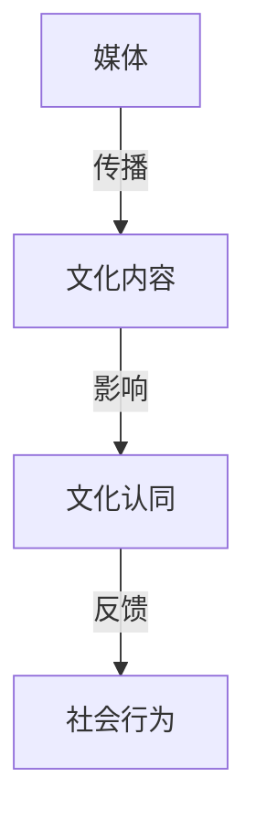

**核心算法原理讲解**

理解媒体对文化认同的影响可以通过以下步骤：

1. **文化内容**：媒体通过传播不同的文化内容，影响人们的文化认同。
2. **文化认同**：媒体内容的多样性可以增强人们的文化认同感。
3. **社会行为**：文化认同的改变可能导致社会行为的改变。

**数学模型和公式**

可以通过以下公式来描述媒体对文化认同的影响：

$$ 文化认同 = f(媒体传播内容，媒体多样性，受众接受度) $$

**举例说明**

例如，电影《哪吒之魔童降世》的上映，激发了观众对本土传统文化的兴趣，增强了文化认同。

#### 4.2 文化传播的渠道与方式

文化传播的渠道和方式多样化，包括电视、电影、社交媒体、出版物等。不同的传播渠道和方式对文化认同有着不同的影响。

**核心概念与联系**

文化传播的渠道与方式可以概括为以下流程图：

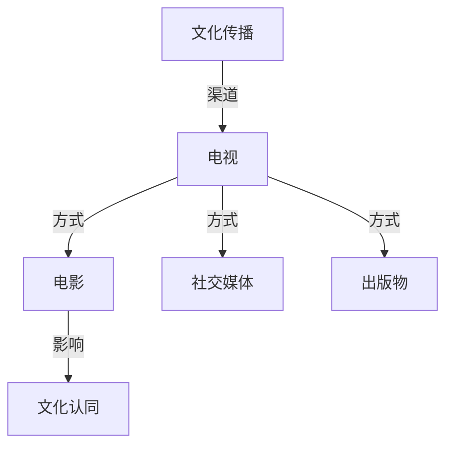

**核心算法原理讲解**

理解文化传播的渠道与方式可以通过以下步骤：

1. **电视**：通过新闻、电视剧等节目传播文化内容。
2. **电影**：通过电影故事和视觉艺术传播文化价值观。
3. **社交媒体**：通过社交媒体平台分享和传播文化内容。
4. **出版物**：通过书籍、杂志等传播文化知识。

**数学模型和公式**

可以通过以下公式来描述文化传播对文化认同的影响：

$$ 文化认同 = f(传播渠道，传播方式，受众接受度) $$

**举例说明**

例如，社交媒体上的“抖音”通过短视频形式传播了大量的本土文化内容，受到年轻人的广泛欢迎。

#### 4.3 媒体在促进文化认同中的作用

媒体在促进文化认同中发挥着重要作用。通过多样化的传播内容和方式，媒体可以帮助人们更好地理解和尊重不同文化，增强文化认同。

**核心概念与联系**

媒体在促进文化认同中的作用可以概括为以下流程图：

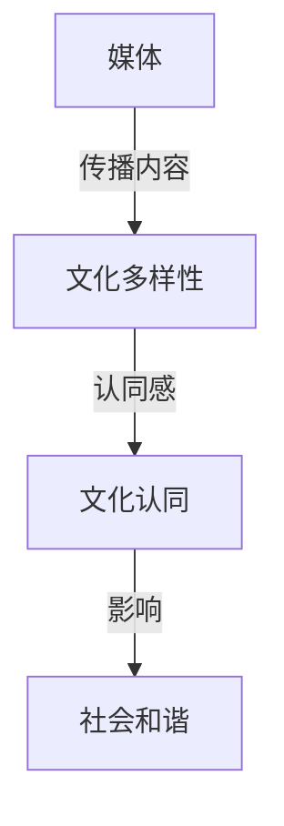

**核心算法原理讲解**

理解媒体在促进文化认同中的作用可以通过以下步骤：

1. **传播内容**：媒体通过多样化的内容展示文化多样性。
2. **认同感**：多样化的文化内容可以增强人们对不同文化的认同感。
3. **社会和谐**：文化认同感的增强有助于社会和谐。

**数学模型和公式**

可以通过以下公式来描述媒体在促进文化认同中的作用：

$$ 文化认同 = f(媒体传播内容多样性，受众文化认同度，社会互动) $$

**举例说明**

例如，新闻媒体通过报道不同文化的庆祝活动，增强了观众对文化多样性的认同和尊重。

### 第5章：政策与法律框架中的文化认同

#### 5.1 文化政策对文化认同的保障

文化政策是政府通过法律、法规和规划来保护和促进文化多样性和文化认同的重要手段。有效的文化政策可以保障文化认同，减少身份危机。

**核心概念与联系**

文化政策对文化认同的保障可以概括为以下流程图：

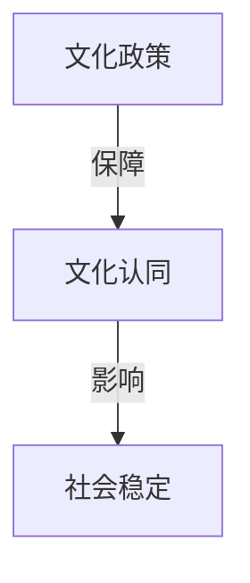

**核心算法原理讲解**

理解文化政策对文化认同的保障可以通过以下步骤：

1. **法律框架**：政府通过制定相关法律，保障文化多样性和文化认同。
2. **政策规划**：政府通过制定文化发展政策，促进文化认同和社会稳定。

**数学模型和公式**

可以通过以下公式来描述文化政策对文化认同的影响：

$$ 文化认同 = f(文化政策，法律保障，社会支持) $$

**举例说明**

例如，中国政府通过《中华人民共和国非物质文化遗产保护法》来保护文化多样性和文化认同。

#### 5.2 文化法律框架的建设与完善

文化法律框架是保障文化认同的重要基础。通过完善文化法律框架，可以更好地保护文化多样性和文化认同。

**核心概念与联系**

文化法律框架的建设与完善可以概括为以下流程图：

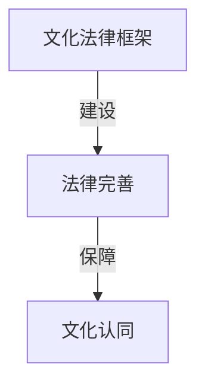

**核心算法原理讲解**

理解文化法律框架的建设与完善可以通过以下步骤：

1. **法律制定**：政府制定文化相关法律，为文化认同提供法律保障。
2. **法律执行**：加强法律执行力度，确保文化法律的有效实施。

**数学模型和公式**

可以通过以下公式来描述文化法律框架对文化认同的影响：

$$ 文化认同 = f(法律制定，法律执行，社会监督) $$

**举例说明**

例如，欧盟通过《欧洲文化公约》来保护和促进文化多样性。

#### 5.3 国际合作与文化交流

国际合作与文化交流是促进文化认同的重要途径。通过国际合作和文化交流，不同国家和地区可以相互学习和尊重，增强文化认同。

**核心概念与联系**

国际合作与文化交流可以概括为以下流程图：

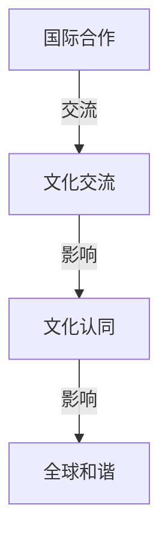

**核心算法原理讲解**

理解国际合作与文化交流可以通过以下步骤：

1. **国际合作**：通过国际组织和文化项目，促进不同国家之间的文化交流。
2. **文化交流**：文化交流活动可以增进不同文化之间的理解和尊重。
3. **文化认同**：国际合作与文化交流有助于增强全球范围内的文化认同。

**数学模型和公式**

可以通过以下公式来描述国际合作与文化交流对文化认同的影响：

$$ 文化认同 = f(国际合作，文化交流，全球互动) $$

**举例说明**

例如，联合国教科文组织通过世界遗产项目，促进了全球对文化多样性的认识和尊重。

## 第三部分：创新方法在文化认同维护中的应用

### 第6章：数字化技术与文化认同

#### 6.1 数字化技术对文化认同的影响

数字化技术已经成为现代文化传播和交流的重要工具。通过数字化技术，文化内容可以更加广泛和快速地传播，从而影响文化认同。

**核心概念与联系**

数字化技术对文化认同的影响可以概括为以下流程图：

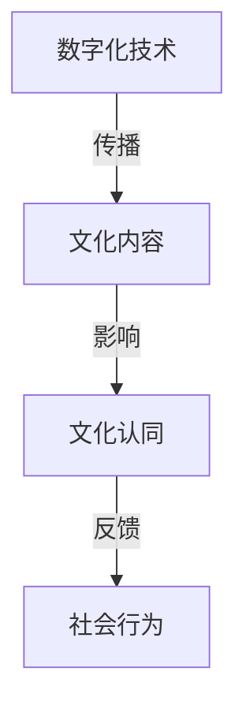

**核心算法原理讲解**

理解数字化技术对文化认同的影响可以通过以下步骤：

1. **文化内容传播**：数字化技术使得文化内容能够迅速传播，扩大了文化的传播范围。
2. **文化认同**：广泛传播的文化内容可以增强人们对文化的认同感。
3. **社会行为**：文化认同的改变可能影响人们的社会行为和价值观。

**数学模型和公式**

可以通过以下公式来描述数字化技术对文化认同的影响：

$$ 文化认同 = f(数字化传播速度，文化内容多样性，受众接受度) $$

**举例说明**

例如，互联网和社交媒体使得传统文化艺术如京剧、粤剧等得到了更广泛的关注和传承。

#### 6.2 数字文化产品的创作与传播

数字文化产品的创作与传播是数字化技术在文化认同维护中的应用之一。通过数字文化产品，可以更好地展示和传播本土文化，增强文化认同。

**核心概念与联系**

数字文化产品的创作与传播可以概括为以下流程图：

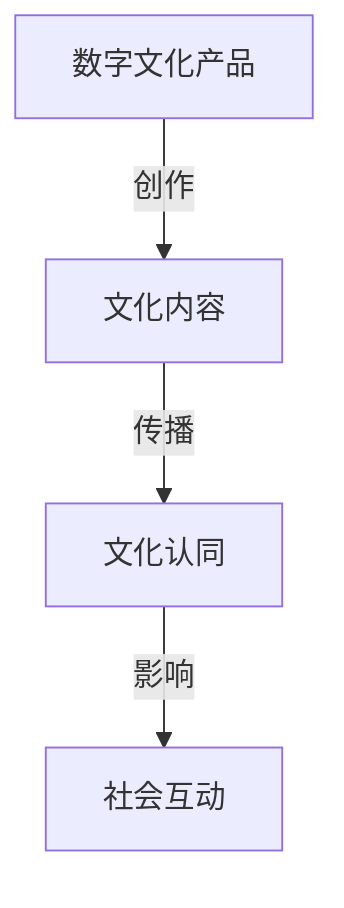

**核心算法原理讲解**

理解数字文化产品的创作与传播可以通过以下步骤：

1. **文化内容创作**：利用数字化技术，创作者可以创作出更多样化的文化产品。
2. **文化内容传播**：通过互联网和社交媒体，数字文化产品可以迅速传播。
3. **文化认同**：数字文化产品的广泛传播有助于增强文化认同。

**数学模型和公式**

可以通过以下公式来描述数字文化产品对文化认同的影响：

$$ 文化认同 = f(数字文化产品多样性，传播渠道广泛性，受众互动参与度) $$

**举例说明**

例如，一些艺术家通过制作数字艺术作品，如数字插画、动画等，展示了中国传统文化，受到了广泛的关注。

#### 6.3 数字化文化认同教育的实践案例

数字化文化认同教育是利用数字化技术来培养学生的文化认同感。以下是一些实践案例：

**核心概念与联系**

数字化文化认同教育的实践案例可以概括为以下流程图：

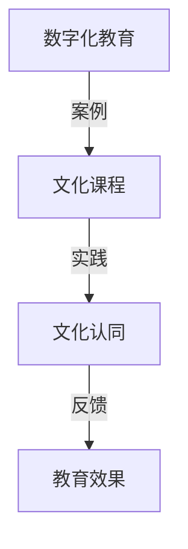

**核心算法原理讲解**

理解数字化文化认同教育的实践案例可以通过以下步骤：

1. **文化课程开发**：利用数字化技术，开发具有文化认同教育功能的文化课程。
2. **课程实践**：学生在数字化学习平台上参与文化课程，增强文化认同。
3. **教育反馈**：通过反馈机制，评估文化认同教育的效果。

**数学模型和公式**

可以通过以下公式来描述数字化文化认同教育的效果：

$$ 教育效果 = f(数字化课程质量，学生参与度，教育反馈机制) $$

**举例说明**

例如，一些学校利用数字化平台，提供在线文化课程，如中文课程、民族舞蹈课程等，增强了学生对本土文化的认同。

### 第7章：跨界合作与多元文化认同

#### 7.1 跨界合作的模式与优势

跨界合作是指不同领域或行业之间的合作，以实现共同的目标。在文化认同维护中，跨界合作可以整合资源，发挥不同领域的优势，促进多元文化认同。

**核心概念与联系**

跨界合作的模式与优势可以概括为以下流程图：

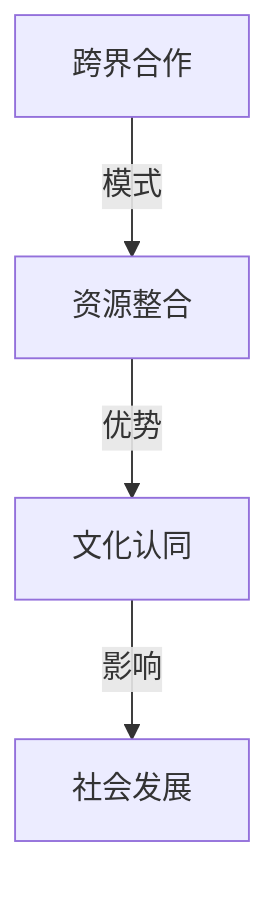

**核心算法原理讲解**

理解跨界合作的模式与优势可以通过以下步骤：

1. **资源整合**：跨界合作可以将不同领域的资源和优势整合起来，形成合力。
2. **文化认同**：跨界合作有助于促进不同文化之间的理解与尊重，增强文化认同。
3. **社会发展**：跨界合作可以推动社会的发展，促进文化的多样性和繁荣。

**数学模型和公式**

可以通过以下公式来描述跨界合作对文化认同的影响：

$$ 文化认同 = f(跨界合作模式，资源整合效率，文化多样性) $$

**举例说明**

例如，博物馆与科技公司的跨界合作，通过数字化技术展示文物，增强了公众对文化的认同。

#### 7.2 多元文化认同的实践探索

多元文化认同的实践探索是指在不同文化背景下，通过具体的实践项目来促进文化认同。以下是一些实践探索：

**核心概念与联系**

多元文化认同的实践探索可以概括为以下流程图：

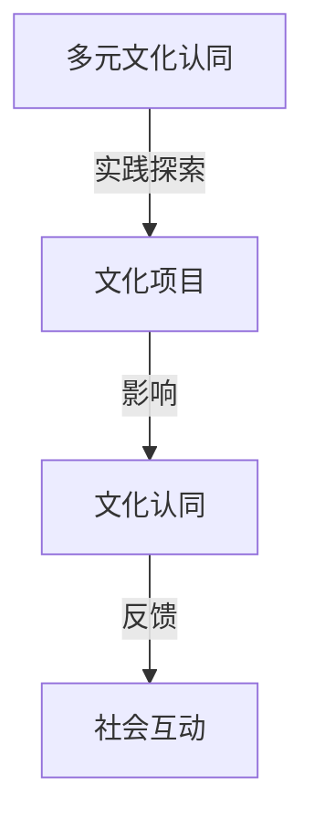

**核心算法原理讲解**

理解多元文化认同的实践探索可以通过以下步骤：

1. **文化项目开发**：设计并实施具有文化认同教育功能的文化项目。
2. **文化项目执行**：通过具体的文化活动，促进不同文化之间的交流与理解。
3. **文化认同**：文化项目的执行可以增强文化认同。

**数学模型和公式**

可以通过以下公式来描述多元文化认同实践探索的效果：

$$ 文化认同 = f(文化项目设计，项目执行效果，社会参与度) $$

**举例说明**

例如，一些城市通过举办多元文化节，吸引了不同文化背景的居民参与，增强了文化认同。

#### 7.3 跨界合作在文化认同维护中的应用

跨界合作在文化认同维护中的应用是指通过不同领域或行业的合作，共同促进文化认同。以下是一些具体应用：

**核心概念与联系**

跨界合作在文化认同维护中的应用可以概括为以下流程图：

```mermaid
graph TD
    A[跨界合作] -->|应用| B[文化认同]
    B -->|影响| C[社会和谐]
    C -->|反馈| D[可持续发展]
```

**核心算法原理讲解**

理解跨界合作在文化认同维护中的应用可以通过以下步骤：

1. **文化认同**：跨界合作通过整合资源和优势，促进文化认同。
2. **社会和谐**：跨界合作有助于不同文化之间的和谐共处。
3. **可持续发展**：跨界合作可以推动文化认同的长期发展。

**数学模型和公式**

可以通过以下公式来描述跨界合作在文化认同维护中的应用效果：

$$ 文化认同维护 = f(跨界合作模式，资源整合效率，文化多样性维护) $$

**举例说明**

例如，音乐产业与旅游业的跨界合作，通过音乐节和旅游项目，促进了文化的传播和认同。

## 第四部分：案例分析与实践指导

### 第8章：案例分析

#### 8.1 案例一：某地区文化认同维护项目

本案例介绍了某地区在文化认同维护方面所开展的项目，包括项目背景、目标、实施过程和效果。

**案例背景**

随着全球化的推进，某地区面临文化同质化和社会分裂的风险。为了维护文化认同，当地政府决定开展一项文化认同维护项目。

**案例目标**

项目的主要目标是增强居民的文化认同，促进文化多样性的保护和传承。

**实施过程**

1. **文化调研**：项目团队对当地文化进行了深入调研，了解居民的文化需求和偏好。
2. **课程开发**：根据调研结果，开发了一系列具有本土特色的文化课程。
3. **文化活动**：通过举办文化节、传统工艺展示等活动，促进文化的传承和传播。
4. **教育推广**：在学校和社区推广文化课程，提高居民的文化素养。

**效果评估**

通过项目实施，居民的文化认同感显著提高，文化多样性的保护和传承得到加强。项目也受到了社会各界的认可和好评。

#### 8.2 案例二：某品牌文化认同营销策略

本案例分析了某品牌在文化认同营销方面的成功实践，包括品牌定位、市场策略和效果评估。

**品牌定位**

该品牌以本土文化为特色，强调文化认同和价值观的传承。

**市场策略**

1. **文化产品开发**：品牌推出了具有本土文化特色的产品，如手工艺品、文化主题服饰等。
2. **营销活动**：通过社交媒体和文化节等活动，推广品牌文化，吸引消费者。
3. **文化体验**：品牌开设文化体验店，让消费者亲身体验本土文化。

**效果评估**

通过文化认同营销策略，品牌的知名度显著提高，销售额和市场份额也实现了增长。消费者对品牌的认同感和忠诚度也明显提升。

#### 8.3 案例三：某学校文化认同教育实践

本案例介绍了某学校在文化认同教育方面的实践，包括课程设置、教学方法和效果评估。

**课程设置**

学校开设了多样化的文化课程，包括本土文化、世界文化、艺术文化等。

**教学方法**

1. **互动教学**：教师通过互动教学，激发学生对文化的兴趣和探究欲望。
2. **实地考察**：组织学生参加文化实地考察，增强学生对文化的理解和认同。
3. **跨学科教学**：将文化内容融入不同学科，提高学生的综合素质。

**效果评估**

通过文化认同教育实践，学生的文化素养和认同感显著提高，学科成绩也有所提升。学校也获得了家长和社会的认可。

### 第9章：实践指导

#### 9.1 文化认同维护策略制定

在制定文化认同维护策略时，需要考虑以下几个方面：

1. **文化需求调研**：了解居民和学生的文化需求，为策略制定提供依据。
2. **资源整合**：整合政府、学校、社区等资源，形成合力。
3. **目标设定**：明确文化认同维护的目标和预期效果。
4. **实施方案**：制定具体的实施方案，包括课程设置、活动安排等。

#### 9.2 文化认同教育实践方案

文化认同教育实践方案应包括以下几个方面：

1. **课程设置**：根据文化需求，设置多样化的文化课程。
2. **教学方法**：采用互动教学、实地考察等多元化教学方法。
3. **师资培训**：对教师进行文化培训，提高他们的文化素养。
4. **评价机制**：建立评价机制，评估文化认同教育的效果。

#### 9.3 文化认同维护中的问题与解决策略

在文化认同维护过程中，可能会遇到以下问题：

1. **文化同质化**：解决策略包括加强本土文化保护和推广。
2. **资源不足**：解决策略包括争取政府和社会支持，加大投入。
3. **认同感不足**：解决策略包括增强文化教育，提高居民和学生对文化的认同感。

## 结尾

在全球化的背景下，维护文化认同和应对身份危机成为一项重要的任务。通过教育、媒体、政策和数字化技术等领域的创新方法，我们可以有效地维护文化认同，促进社会的和谐发展。希望本文能为您提供有益的启示，共同为文化认同的维护贡献力量。

---

### 作者信息

**作者：AI天才研究院/AI Genius Institute & 禅与计算机程序设计艺术 /Zen And The Art of Computer Programming**

本文由AI天才研究院的专家撰写，结合了计算机科学和文化研究的深刻见解，旨在为读者提供关于文化认同维护的全面理解和实践指导。作者致力于通过技术手段推动文化认同的传承与发展，为全球文化的和谐共处贡献智慧。

### 最佳实践 tips

1. **文化保护与传承**：政府和社区应加强文化保护与传承工作，通过立法和政策支持，确保本土文化得到传承。
2. **教育推广**：学校应加强文化认同教育，设置多样化的文化课程，提高学生的文化素养。
3. **媒体宣传**：媒体应积极宣传文化多样性，推广本土文化，增强公众的文化认同感。
4. **国际合作**：加强国际合作，通过文化交流促进文化认同的全球发展。

### 小结

本文探讨了全球化背景下文化认同的重要性，以及由此引发的身份危机。通过分析教育、媒体、政策和数字化技术等领域的创新方法，本文提出了应对身份危机的有效策略，以维护文化认同。希望本文能激发读者对文化认同问题的关注，共同为文化多样性和社会和谐做出贡献。

### 注意事项

1. **文化尊重**：在推动文化认同维护的过程中，应尊重和保护不同文化的多样性，避免文化冲突。
2. **持续关注**：文化认同是一个长期的过程，需要持续关注和努力，以应对不断变化的社会环境。

### 拓展阅读

1. 《文化认同与社会和谐：全球化背景下的挑战与机遇》
2. 《数字化时代的文化认同：创新与挑战》
3. 《跨界合作与多元文化认同：实践与启示》

通过阅读这些文献，您可以获得更多关于文化认同维护的深入研究和实践案例，进一步提升对这一问题的理解。

