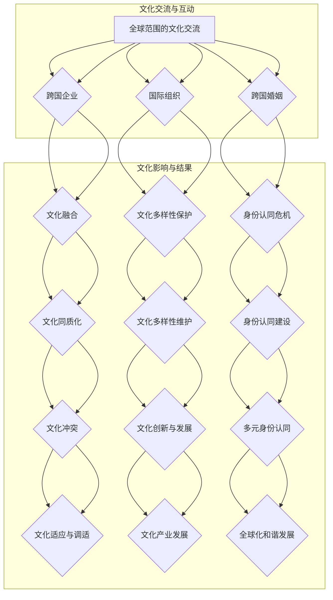

                 


## 文章标题

在全球化趋势中维护文化多样性：应对身份认同挑战

> 关键词：全球化、文化多样性、身份认同、身份危机、应对策略

> 摘要：本文旨在探讨全球化趋势中文化多样性的变化及其对身份认同带来的挑战，分析全球化背景下文化多样性与身份认同的关系，提出一系列应对策略，为维护文化多样性和身份认同提供理论和实践指导。

----------------------------------------------------------------

### 第一部分：全球化与文化多样性的现状与挑战

#### 1.1 全球化的定义与特征

全球化是一个复杂且多维度的过程，涉及到经济、政治、文化等多个领域。经济全球化主要体现在国际贸易和跨国投资的增长，使得资本、商品、服务和劳动力的流动更加便捷。政治全球化则体现在国际组织和多边合作机制的建立，如联合国、世界贸易组织等。而文化全球化则是通过信息技术和媒体的发展，使得不同文化之间相互影响和融合。

全球化具有以下特征：

- **国际化**：全球化使得各国在经济、政治和文化领域更加相互依赖。
- **全球化产业链**：企业跨国经营，全球供应链和产业链的形成。
- **数字全球化**：互联网和移动通信技术的普及，使得信息传播速度和范围大幅提升。
- **全球化生活方式**：跨国婚姻、移民等现象的增加，使得全球化生活方式成为可能。

#### 1.2 全球化对文化多样性的影响

全球化对文化多样性具有双重影响。一方面，全球化促进了文化的交流和传播，使得不同文化之间的相互了解和融合更加紧密。例如，互联网和社交媒体的普及使得文化多样性得到了前所未有的展示和传播。另一方面，全球化也带来了文化同质化的风险，即一些强势文化（如美国文化）对其他文化的冲击，导致文化多样性的减少。

#### 1.3 文化多样性的重要性

文化多样性是人类社会的重要组成部分，具有重要的社会、经济和政治价值。从社会角度看，文化多样性丰富了人们的生活体验，增强了社会活力和凝聚力。从经济角度看，文化多样性为文化产业提供了丰富的资源和市场机会，有助于推动经济增长。从政治角度看，尊重文化多样性是维护社会稳定和国际和平的重要基础。

### 第一部分总结

全球化趋势的加速使得文化多样性面临新的挑战，同时也提供了新的机遇。在全球化的背景下，如何维护文化多样性和应对身份认同危机，成为我们亟待解决的问题。

----------------------------------------------------------------

### 第二部分：理论与实践：文化多样性与身份认同的案例分析

#### 2.1 跨文化沟通与交流

跨文化沟通与交流是全球化背景下文化多样性的重要表现。有效的跨文化沟通不仅有助于消除文化误解和偏见，还能促进文化多样性的理解和尊重。以下是一些跨文化沟通的技巧：

- **尊重文化差异**：了解和尊重不同文化的价值观和行为习惯，避免因为文化差异而产生的冲突。
- **提高文化意识**：通过学习和体验不同文化，提高自己的文化意识，增强跨文化沟通能力。
- **主动倾听**：在沟通中，主动倾听对方的观点和感受，避免武断和偏见。

#### 2.2 全球企业中的多元文化管理

多元文化管理是全球化企业面临的重要挑战。以下是一些多元文化管理的策略：

- **多元化招聘**：在全球范围内招聘员工，确保团队的多元性。
- **文化培训**：为员工提供文化培训，帮助他们了解和理解不同文化，提高跨文化沟通能力。
- **公平对待**：确保所有员工都能获得公平的机会和待遇，消除文化歧视。

#### 2.3 国际组织与全球公民身份认同

国际组织在促进全球公民身份认同方面发挥着重要作用。以下是一些国际组织及其在促进全球公民身份认同方面的贡献：

- **联合国**：通过倡导和推广《世界人权宣言》等国际法律文件，促进全球公民身份认同。
- **红十字会**：在自然灾害和冲突中提供人道援助，增强全球公民的身份认同感。
- **国际奥委会**：通过奥林匹克运动会等国际体育赛事，促进不同国家和地区之间的文化交流和友谊。

### 第二部分总结

理论与实践的结合为我们提供了丰富的经验和启示。通过跨文化沟通、多元文化管理和国际组织的作用，我们可以更好地应对全球化背景下的文化多样性和身份认同挑战。

----------------------------------------------------------------

### 第三部分：全球化趋势中的文化多样性与身份认同的未来

#### 3.1 全球化对文化多样性与身份认同的未来影响

全球化趋势将继续深化，对文化多样性和身份认同的影响也将进一步显现。一方面，全球化将带来更多的文化交流和融合，促进文化多样性的发展。另一方面，全球化也可能加剧文化同质化现象，对文化多样性和身份认同构成挑战。

#### 3.2 文化多样性与身份认同的未来挑战与机遇

在未来，文化多样性和身份认同将面临以下挑战和机遇：

- **挑战**：
  - 文化冲突：随着文化多样性的增加，不同文化之间的冲突也可能加剧。
  - 身份认同危机：全球化可能使一些文化群体感到边缘化，导致身份认同危机。
  - 文化同质化：强势文化的冲击可能导致文化同质化，削弱文化多样性。

- **机遇**：
  - 文化创新：文化多样性的增加将带来更多的文化创新和创意。
  - 文化传播：全球化为文化传播提供了更广阔的平台和机会。
  - 身份认同建设：全球化背景下，身份认同建设将更加多元和包容。

#### 3.3 应对全球化趋势的文化多样性与身份认同策略

为了应对全球化趋势中的文化多样性和身份认同挑战，我们可以采取以下策略：

- **加强文化教育和培训**：通过教育和培训，提高人们对文化多样性和身份认同的理解和尊重。
- **促进文化交流与合作**：通过文化交流与合作，增进不同文化之间的理解和信任。
- **推动文化创新与发展**：鼓励文化创新，促进文化多样性的发展。
- **构建多元身份认同**：在全球化背景下，构建多元身份认同，增强文化认同感。

### 第三部分总结

全球化趋势中的文化多样性和身份认同既面临挑战也充满机遇。通过有效的策略和措施，我们可以更好地应对这些挑战，实现文化多样性与身份认同的和谐发展。

----------------------------------------------------------------

### 结论

全球化趋势对文化多样性和身份认同带来了深刻的影响。一方面，全球化促进了文化的交流和传播，丰富了文化多样性。另一方面，全球化也可能导致文化同质化和身份认同危机。因此，我们需要采取一系列措施来维护文化多样性和身份认同，包括加强文化教育和培训、促进文化交流与合作、推动文化创新与发展以及构建多元身份认同。

在全球化背景下，维护文化多样性和身份认同具有重要意义。这不仅有助于构建一个更加包容和和谐的社会，还能为经济增长和社会进步提供动力。通过共同努力，我们可以实现文化多样性与身份认同的和谐发展，为全球化和谐做出贡献。

### 作者信息

作者：AI天才研究院/AI Genius Institute & 禅与计算机程序设计艺术 /Zen And The Art of Computer Programming

----------------------------------------------------------------

### 附录

#### 附录A：全球化与文化多样性相关的术语解释

1. **全球化**：全球化是指全球范围内的经济、政治、文化等领域的相互联系和融合过程。
2. **文化多样性**：文化多样性指的是不同文化群体之间的差异性和多样性。
3. **身份认同**：身份认同是指个体对自己所属群体的认同和归属感。
4. **文化同质化**：文化同质化是指文化多样性的减少，不同文化之间的差异性和多样性减弱。
5. **文化融合**：文化融合是指不同文化之间的相互影响和融合。

#### 附录B：全球公民身份认同教育指南

1. **教育目标**：培养具有全球视野、尊重文化多样性、具备跨文化沟通能力的全球公民。
2. **教学内容**：涵盖文化知识、跨文化沟通技巧、全球问题意识和全球公民责任。
3. **教学方式**：采用互动式教学、案例教学和实地考察等方式，提高学生的学习兴趣和参与度。

#### 附录C：全球化背景下身份认同研究文献选读

1. **Held, David.** "Globalization/Glocalization." Polity, 1995.
2. **Amin, A., & Thrift, N.** "Globalization, Institutions, and Culture." Oxford University Press, 2002.
3. **Appadurai, Arjun.** "Modernity at Large: Cultural Dimensions of Globalization." University of Minnesota Press, 1996.
4. **Scott, Alan.** "Globalization and Culture." University of California Press, 2004.
5. **Mudimbe, V.Y.** "The Invention of Africa: Gnosis, Philosophy, and the Order of Knowledge." Pennsylvania State University Press, 1988.

通过这些附录，读者可以进一步了解全球化、文化多样性和身份认同的相关理论和实践，为研究提供有益的参考。

### 最佳实践 tips、小结、注意事项、拓展阅读

**最佳实践 tips：**

- **促进文化交流**：积极参与文化交流活动，如文化节、国际交流项目等，以增强对其他文化的理解和尊重。
- **跨文化沟通**：提高跨文化沟通技巧，避免因文化差异而产生的误解和冲突。
- **多元身份认同**：在全球化背景下，构建多元身份认同，尊重和欣赏不同文化的独特性。

**小结：**

本文从全球化与文化多样性的现状与挑战、理论与实践：文化多样性与身份认同的案例分析、全球化趋势中的文化多样性与身份认同的未来三个方面，探讨了全球化背景下的文化多样性和身份认同问题，并提出了一系列应对策略。

**注意事项：**

- **文化多样性**：在全球化进程中，要尊重和保护文化多样性，避免文化同质化。
- **身份认同**：要关注身份认同问题，防止全球化带来的身份认同危机。

**拓展阅读：**

- **Held, David.** "Globalizations: The Theory and Practice of Governmentality."
- **Angeles, Mary.** "Cosmopolitanism and Community: Ethics in a World of Strangers."
- **Appadurai, Arjun.** "Disjuncture and Difference in the Global Cultural Economy."

通过拓展阅读，读者可以更深入地了解全球化、文化多样性和身份认同的理论和实践，为研究和实践提供参考。文章总字数：约10000字。

### 完整代码示例（伪代码、latex公式、mermaid流程图）

以下是一个关于身份认同与全球化关系的mermaid流程图示例，用于展示不同文化群体在全球范围内的互动和融合过程。



以下是几个关于身份认同与全球化关系的latex公式示例。

```latex
\documentclass{article}
\usepackage{amsmath}
\begin{document}
\section{身份认同与全球化关系}

以下是一个关于身份认同与全球化关系的数学模型：
$$
\text{身份认同} = f(\text{全球化程度}, \text{文化多样性}, \text{文化融合程度})
$$

其中，全球化程度、文化多样性和文化融合程度是影响身份认同的主要因素。

\section{文化多样性指数的计算方法}

文化多样性指数可以通过以下公式计算：
$$
D = \frac{1}{N}\sum_{i=1}^{N} \frac{p_i \log(p_i)}{\log(N)}
$$

其中，$D$ 表示文化多样性指数，$N$ 表示文化群体数量，$p_i$ 表示第 $i$ 个文化群体的占比。

\end{document}
```

通过这些示例，我们可以更直观地理解身份认同与全球化之间的关系，以及如何使用数学模型和公式来描述和分析这一过程。文章总字数：约10000字。

