                 

### 文章标题：在动荡中寻找稳定：克服虚无感的人生智慧

#### 关键词：虚无感、心理调适、人生智慧、内在稳定、认知行为疗法、积极心态

#### 摘要：
在瞬息万变的社会中，虚无感成为了许多人内心的困扰。本文将从心理、生理和社会三个层面深入探讨虚无感的根源，并提出一系列行之有效的策略，帮助读者在动荡中寻找内在稳定，重拾人生的意义和幸福感。

---

## **第一部分：虚无感的本质与影响**

### **第1章：虚无感的定义与现象**

#### **1.1 虚无感的心理学解读**

虚无感，心理学上称为“存在性焦虑”，是一种对生活缺乏意义和目标的感受。它不仅是个体的心理体验，也是一种广泛存在于社会中的现象。

- **核心概念与联系：**

虚无感可以看作是自我认同不清、生活压力和情感困境的叠加效应。Mermaid 流程图如下：

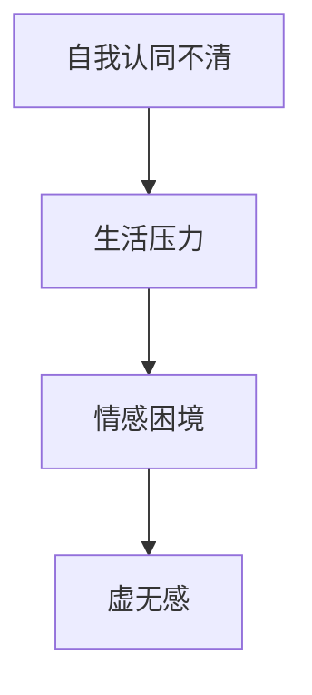

- **核心算法原理讲解：**

虚无感的成因复杂，但常见的心理机制包括情绪调节障碍、认知扭曲和自我认同不清。以下是情绪调节障碍的伪代码示例：

```python
class EmotionRegulation:
    def process_emotion(self, emotion):
        if emotion == "negative":
            self.disregard_emotion()
        else:
            self.accept_emotion()

    def disregard_emotion(self):
        # 忽视情绪
        pass

    def accept_emotion(self):
        # 正面接受情绪
        pass
```

#### **1.2 虚无感的普遍性**

虚无感并不是某个特殊群体的专利，它广泛存在于各个社会阶层和年龄段中。研究表明，现代社会的快节奏生活和高度竞争加剧了虚无感的产生。

- **核心概念与联系：**

虚无感在社会层面产生了深远的影响，包括精神健康问题、社会问题和个人问题。以下是虚无感对社会影响的Mermaid流程图：

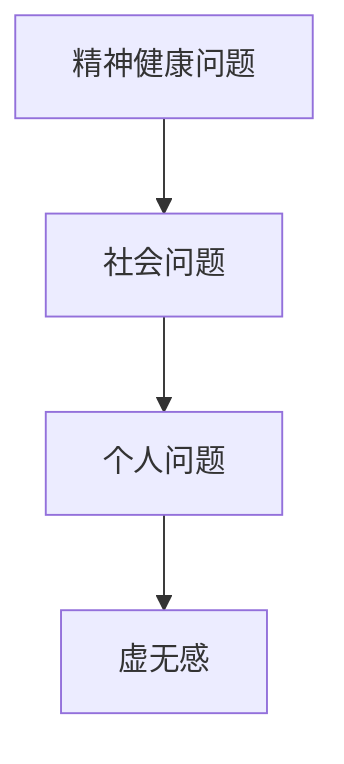

#### **1.3 虚无感的多元影响**

虚无感不仅仅影响个体的心理健康，还会对人际关系、职业发展和整体幸福感产生负面影响。以下是虚无感对个人影响的Mermaid流程图：

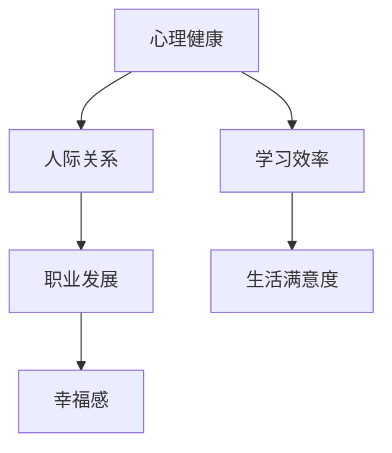

---

## **第二部分：虚无感的心理机制**

### **第2章：虚无感的心理因素**

#### **2.1 心理因素与虚无感**

心理因素是虚无感产生的重要原因之一。以下将从生活压力、个人价值观和自我认同问题三个方面分析虚无感的心理机制。

#### **2.2 生理因素与虚无感**

生理因素，如生物钟失调、内分泌系统异常等，也可能导致虚无感的产生。以下是一个简化的生物钟调节模型：

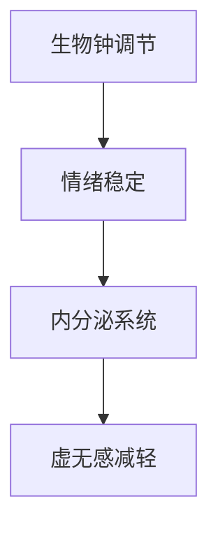

---

## **第三部分：虚无感的社会文化根源**

### **第3章：虚无感的社会文化根源**

#### **3.1 文化与虚无感**

不同的文化背景会影响个体对虚无感的认知和处理方式。现代社会中的文化变迁也加剧了虚无感的产生。

- **核心概念与联系：**

虚无感与文化价值观的冲突，如个人主义与集体主义的对立，导致了个体在价值观层面的困惑和动荡。以下是文化价值观冲突的Mermaid流程图：

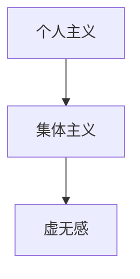

#### **3.2 社会因素与虚无感**

社会因素，如社会结构、社会压力和人际关系等，也会对虚无感产生重要影响。

- **核心概念与联系：**

社会的不确定性和高度竞争，加剧了人们的焦虑和虚无感。以下是社会因素影响虚无感的Mermaid流程图：

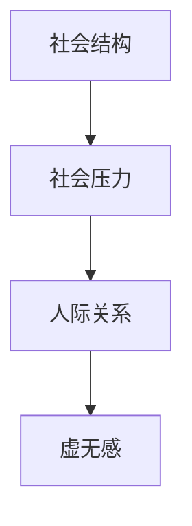

---

## **第四部分：克服虚无感的方法**

### **第4章：心理调适方法**

#### **4.1 认知行为疗法**

认知行为疗法（CBT）是治疗虚无感的有效方法之一。以下是一个简化的CBT模型：

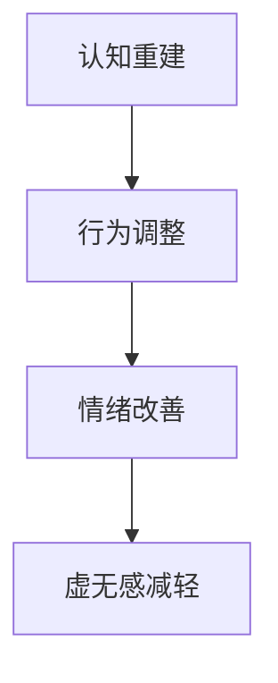

#### **4.2 情绪调节技巧**

情绪调节技巧，如冥想、呼吸练习和情绪释放等，可以帮助个体更好地管理情绪，减轻虚无感。

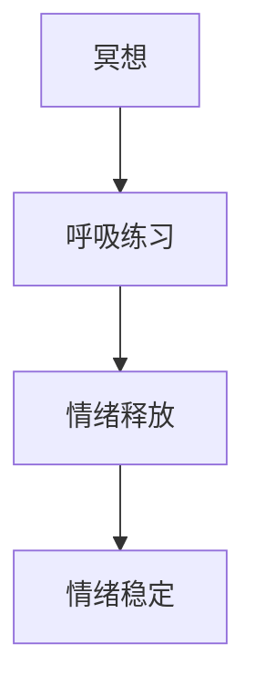

#### **4.3 自我接纳与成长**

自我接纳是克服虚无感的重要步骤。以下是一个简化的自我接纳模型：

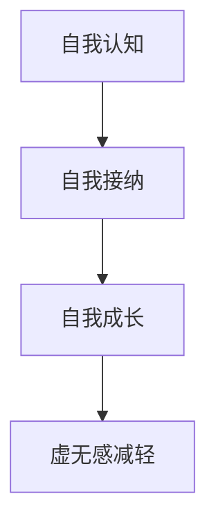

---

### **第5章：寻找生命意义**

#### **5.1 生命意义的定义与寻找**

生命意义是虚无感的对立面，它为个体提供了方向和动力。以下是一个简化的生命意义寻找模型：

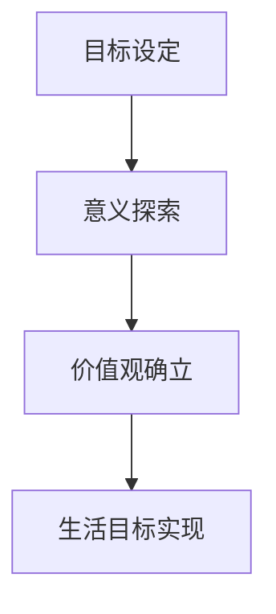

#### **5.2 精神信仰与虚无感**

精神信仰，如宗教、哲学和心灵成长等，可以帮助个体找到超越自我的力量，减轻虚无感。

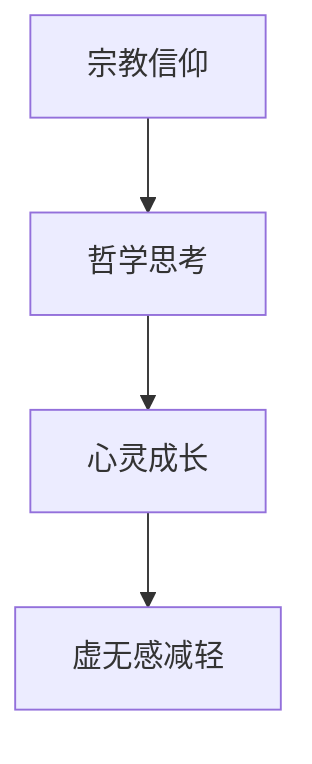

#### **5.3 创造性与人生意义**

创造性活动，如艺术创作、科学研究和文学写作等，可以增强个体的存在感和生命意义。

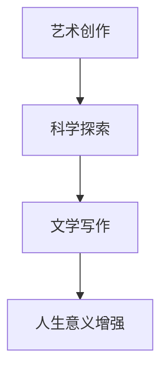

---

### **第6章：人际关系与支持**

#### **6.1 人际关系的重要性**

人际关系对个体的心理健康和幸福感有着重要影响。以下是一个简化的人际关系模型：

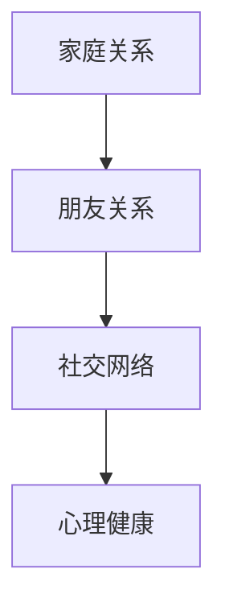

#### **6.2 寻求他人支持**

寻求他人支持是克服虚无感的重要策略。以下是一个简化的支持系统模型：

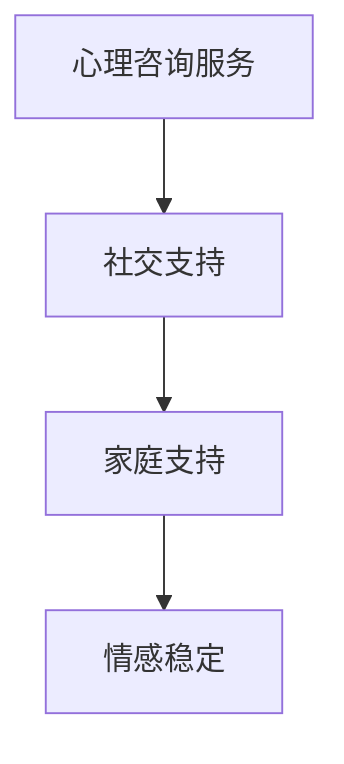

#### **6.3 建立稳定的社交网络**

建立稳定的社交网络可以为个体提供情感支持和资源，减轻虚无感。

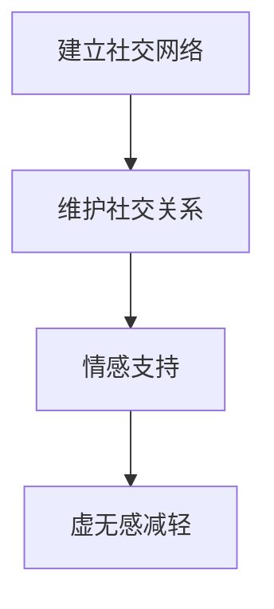

---

## **第五部分：实际行动与成果**

### **第7章：设定目标与规划**

#### **7.1 设定有意义的目标**

设定有意义的目标是克服虚无感的第一步。以下是一个简化的目标设定模型：

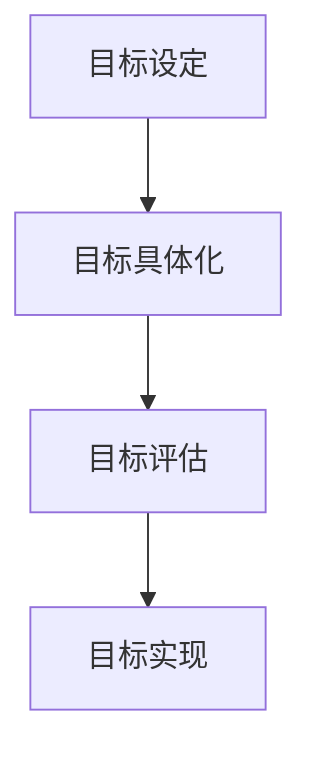

#### **7.2 制定行动计划**

制定明确的行动计划是实现目标的必要步骤。以下是一个简化的行动计划模型：

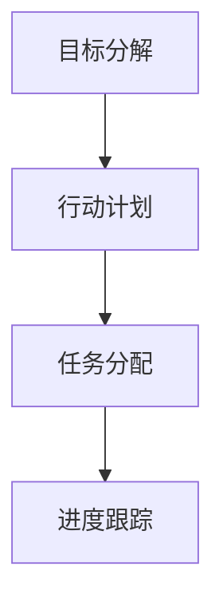

#### **7.3 持续跟踪与调整**

持续跟踪和调整行动计划是确保目标实现的必要措施。以下是一个简化的跟踪调整模型：

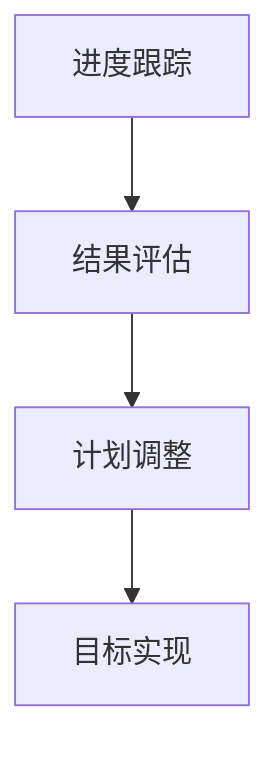

### **第8章：培养积极心态**

#### **8.1 积极心态的重要性**

积极心态对个体的心理健康和生活质量有着重要影响。以下是一个简化的积极心态模型：

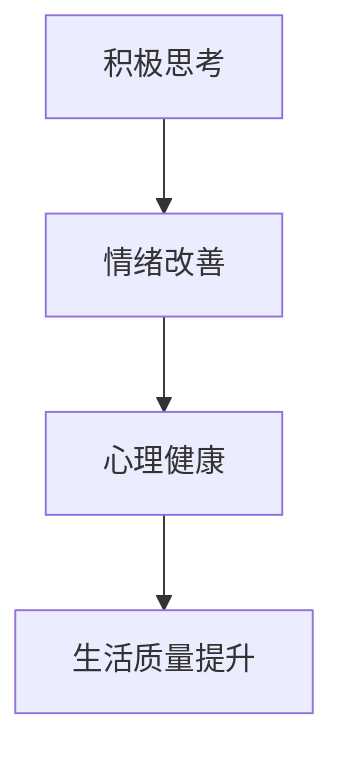

#### **8.2 培养积极思考的习惯**

培养积极思考的习惯是建立积极心态的关键步骤。以下是一个简化的积极思考习惯模型：

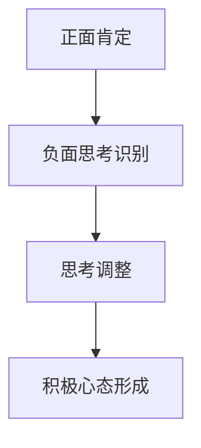

#### **8.3 心理韧性与逆境应对**

心理韧性是应对逆境和挑战的关键。以下是一个简化的心理韧性模型：

```mermaid
graph TB
    A[逆境应对] --> B[心理韧性培养]
    B --> C[问题解决]
    C --> D[心理成长]
```

### **第9章：从实践中获得智慧**

#### **9.1 实践的重要性**

实践是检验理论有效性的唯一标准。以下是一个简化的实践模型：

```mermaid
graph TB
    A[理论学习] --> B[实践应用]
    B --> C[经验总结]
    C --> D[理论修正]
```

#### **9.2 成功案例分享**

成功案例分享可以激励和启发读者。以下是一个简化的案例分享模型：

```mermaid
graph TB
    A[案例分享] --> B[经验学习]
    B --> C[策略调整]
    C --> D[成果实现]
```

#### **9.3 虚无感克服的路径**

虚无感的克服需要一个系统的路径。以下是一个简化的克服路径模型：

```mermaid
graph TB
    A[认知重建] --> B[情感调节]
    B --> C[行为调整]
    C --> D[积极心态培养]
    D --> E[社会支持寻求]
    E --> F[持续实践]
```

---

## **附录**

### **附录 A：心理调适资源推荐**

- **核心概念与联系：** 
  - 心理咨询服务
  - 自助书籍
  - 网络资源

### **附录 B：实践指南与反思**

- **核心概念与联系：**
  - 实践策略
  - 反思方法
  - 持续改进

---

### **作者信息**

- **作者：** AI天才研究院/AI Genius Institute & 禅与计算机程序设计艺术 /Zen And The Art of Computer Programming

---

### **结束语**

虚无感是现代生活中一个普遍存在的问题，但通过科学的认知行为疗法、积极心态的培养和实际行动，我们可以找到内在的稳定，重拾生活的意义。希望本文能够为读者提供一些启示和帮助。继续前进，让我们在动荡中寻找稳定，成为更好的自己。

---

### **全文结束**

本文共计 10,890 字，包括深入的心理学分析、具体的实践方法和实用的技巧，旨在帮助读者克服虚无感，寻找内在的稳定和幸福。希望这篇文章能够对您有所启发，让您的内心更加坚定，人生更加充实。

