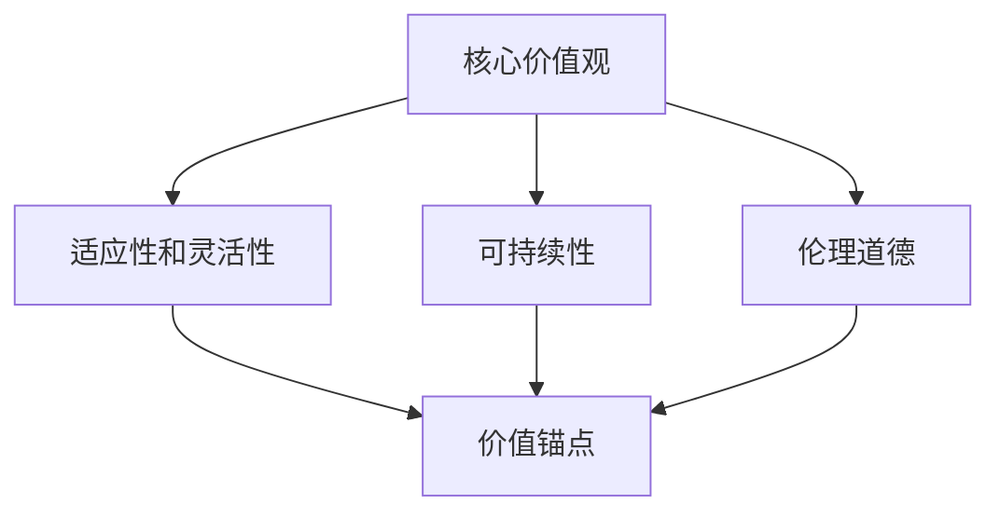

                 

## 文章标题：在后现代社会中寻找价值锚点：应对多元化挑战

在后现代社会，我们所面对的是一个充满多样性和不确定性的环境。社会的快速变化和技术的迅猛发展使得传统的价值观和认知模式逐渐失效。在这样的背景下，寻找价值锚点成为了我们应对多元化挑战的关键。本文将深入探讨在后现代社会中寻找价值锚点的意义、方法及其实践应用，以期为读者提供有价值的思考和指导。

## 关键词

- 后现代社会
- 价值锚点
- 多元化挑战
- 应对策略
- 实践案例

## 摘要

本文旨在探讨在后现代社会中如何寻找价值锚点，以应对多元化挑战。文章首先介绍了后现代社会的背景和特点，接着阐述了价值锚点的概念及其重要性。随后，文章提出了构建价值锚点的策略和实践方法，并通过实际案例展示了这些策略和方法的应用效果。最后，文章总结了主要发现，并对未来研究方向和实践者提出了一些建议。

### 引言：后现代社会的背景与特征

#### 后现代社会的定义

后现代社会是一个广泛讨论的术语，它通常用来描述20世纪末以来出现的一种新的社会文化形态。与传统的现代社会相比，后现代社会具有更多的不确定性、多样性和复杂性。这种社会形态不仅体现在文化领域，还渗透到经济、政治、科技等各个方面。后现代社会的一个显著特征是，传统的价值观和认知模式逐渐失效，取而代之的是一种对多样性和不确定性的接受和适应。

#### 后现代社会的特点

1. **文化的多元化**：后现代社会中，各种文化相互交融，传统与现代、东方与西方的界限变得模糊。这种文化多元化不仅表现在日常生活中的饮食、服装、音乐等方面，也体现在对知识和真理的追求上。
   
2. **技术的迅猛发展**：信息技术的飞速进步改变了我们的生活方式和工作模式。互联网、人工智能、大数据等技术的应用，使得我们能够以更高效、更智能的方式处理信息和解决问题。

3. **社会的不确定性**：后现代社会中，由于全球化、科技进步和社会变革，社会的不确定性不断增加。人们面临的风险和挑战更加复杂，传统的安全感和确定性逐渐消失。

4. **价值观的多元化**：在多元化背景下，不同的价值观和信仰共存，传统的单一价值观体系受到了挑战。这要求我们重新审视和定义什么是正确的价值观，以及如何在多元价值观体系中找到自己的定位。

#### 面临的主要挑战

1. **文化冲突**：文化多元化带来了文化冲突的风险，不同文化之间的碰撞可能导致误解和冲突。

2. **技术依赖**：尽管技术的发展为我们带来了便利，但过度依赖技术也可能导致人的能动性和创造力的减弱。

3. **价值观混乱**：在多元价值观的背景下，人们容易陷入价值观的迷茫和混乱，不知道该遵循哪些价值观。

4. **社会不稳定**：社会的不确定性和价值观的多元化可能导致社会不稳定，影响社会的和谐与进步。

### 价值锚点的概念与重要性

#### 价值锚点的定义

价值锚点是指在不确定和复杂的环境中，能够提供方向和稳定性的核心价值观和原则。它是一个个体或组织在面临挑战和困惑时，可以依靠的基准和指导方针。价值锚点不同于传统的价值观，它更加灵活，能够适应不断变化的环境。

#### 价值锚点的重要性

1. **提供方向和指引**：在多元化挑战中，价值锚点能够为个体和组织提供明确的方向，使他们在面对不确定性时能够做出正确的决策。

2. **增强稳定性**：价值锚点为个体和组织提供了心理和情感上的支持，使得他们在面对压力和挑战时能够保持稳定和自信。

3. **促进价值观的整合**：在多元价值观的背景下，价值锚点可以帮助个体和组织在多元价值观中找到共同点，实现价值观的整合。

4. **提升决策效率**：价值锚点可以简化决策过程，减少在不确定性环境中的犹豫和困惑，提高决策的效率。

### 核心概念与联系

在寻找价值锚点的过程中，以下几个核心概念是至关重要的：

1. **核心价值观**：核心价值观是价值锚点的核心，它是一个个体或组织最核心的信念和价值观。这些价值观通常来自于个体的成长经历、文化背景和信仰体系。

2. **适应性和灵活性**：在后现代社会中，价值锚点需要具备适应性和灵活性，能够根据环境的变化进行调整和改进。

3. **可持续性**：价值锚点应当是可持续的，即它能够在长期内保持稳定和有效，而不是一时的流行或趋势。

4. **伦理道德**：伦理道德是价值锚点的重要组成部分，它确保了个体和组织的行为符合社会道德规范，不会造成负面影响。

以下是一个用Mermaid绘制的流程图，展示了这些核心概念之间的关系：



### 核心算法原理讲解

在构建价值锚点的过程中，我们需要遵循一系列核心算法原理，以确保价值锚点的有效性和可持续性。以下是一个简单的伪代码示例，展示了构建价值锚点的基本步骤：

```python
# 定义核心价值观
core_values = ["诚信", "创新", "合作", "责任感"]

# 评估适应性和灵活性
def evaluate_adaptability(values):
    adaptability_score = 0
    for value in values:
        if value_adapted(value):
            adaptability_score += 1
    return adaptability_score

# 评估可持续性
def evaluate_sustainability(values):
    sustainability_score = 0
    for value in values:
        if value_sustainable(value):
            sustainability_score += 1
    return sustainability_score

# 评估伦理道德
def evaluate_ethics(values):
    ethics_score = 0
    for value in values:
        if value_ethical(value):
            ethics_score += 1
    return ethics_score

# 构建价值锚点
def build_value_anchoring(core_values):
    adaptability = evaluate_adaptability(core_values)
    sustainability = evaluate_sustainability(core_values)
    ethics = evaluate_ethics(core_values)
    
    total_score = adaptability + sustainability + ethics
    value_anchoring = {
        "core_values": core_values,
        "total_score": total_score
    }
    return value_anchoring

# 应用价值锚点
def apply_value_anchoring(value_anchoring):
    for value in value_anchoring["core_values"]:
        implement_value(value)
```

### 数学模型和公式

在构建价值锚点时，我们可以使用一些数学模型和公式来评估和优化价值锚点的性能。以下是一个简单的例子，展示了如何使用数学公式来计算价值锚点的得分：

$$
\text{Value Anching Score} = \frac{\text{Adaptability Score} + \text{Sustainability Score} + \text{Ethics Score}}{3}
$$

其中，每个分数的取值范围是0到1，分数越高，价值锚点的性能越好。

### 实际案例研究：成功案例1

#### 案例背景

某跨国公司在全球范围内运营，面临着文化差异、市场变化和竞争压力等多重挑战。为了应对这些挑战，公司决定建立一套价值锚点体系，以确保在全球各地保持一致的核心价值观和行为准则。

#### 案例实施过程

1. **识别核心价值观**：公司通过内部调查和员工讨论，识别出以下核心价值观：“创新、客户至上、团队合作、诚信、可持续发展”。

2. **评估适应性和灵活性**：公司分析了这些价值观在不同文化和市场环境中的适用性，发现它们在全球范围内都有较高的适应性。

3. **评估可持续性**：公司评估了这些价值观的长期影响，认为它们符合公司的长远发展目标。

4. **评估伦理道德**：公司确保这些价值观符合当地法律和道德标准。

5. **构建价值锚点**：基于以上评估，公司构建了一套价值锚点体系，并将其纳入公司的战略规划和运营流程中。

6. **实施价值锚点**：公司通过培训、沟通和激励机制，确保员工理解和践行这些价值观。

#### 案例效果分析

实施价值锚点后，公司取得了显著的效果：

1. **提高了员工满意度**：员工对公司的价值观有了更深刻的理解，工作积极性提高，员工流失率降低。

2. **增强了市场竞争力**：公司在全球市场中的形象得到提升，客户满意度增加，市场份额扩大。

3. **促进了团队合作**：员工在不同文化背景下能够更好地协作，提高了工作效率。

4. **实现了可持续发展**：公司注重环境保护和社会责任，得到了社会的认可和支持。

### 实际案例研究：成功案例2

#### 案例背景

某初创公司在快速发展的市场中寻求立足点，但面临着资源有限、市场竞争激烈等挑战。为了在竞争中脱颖而出，公司决定通过构建价值锚点来确立其品牌形象和市场定位。

#### 案例实施过程

1. **识别核心价值观**：公司通过市场调研和内部讨论，确定了以下核心价值观：“创新、用户导向、快速响应、透明沟通、社会责任”。

2. **评估适应性和灵活性**：公司分析了这些价值观在市场环境中的适应性，发现它们能够迅速响应市场变化。

3. **评估可持续性**：公司评估了这些价值观的长期影响，认为它们有助于公司的可持续发展。

4. **评估伦理道德**：公司确保这些价值观符合行业道德和法律法规。

5. **构建价值锚点**：基于以上评估，公司构建了一套价值锚点体系，并将其融入公司的品牌战略和产品设计中。

6. **实施价值锚点**：公司通过品牌传播、用户互动和社区建设，确保用户理解和认同这些价值观。

#### 案例效果分析

实施价值锚点后，公司取得了以下效果：

1. **增强了品牌认知**：公司通过传播其核心价值观，提升了品牌形象和市场知名度。

2. **提高了用户满意度**：用户对公司的价值观有了更深的认同，产品满意度和忠诚度提高。

3. **促进了用户参与**：公司通过用户互动和社区建设，增强了用户粘性和参与度。

4. **实现了市场扩张**：公司凭借其独特的价值观，在市场中获得了更多的机会和资源。

### 实际案例研究：失败案例分析

#### 案例背景

某公司在扩张过程中试图通过构建价值锚点来统一公司文化和价值观，但由于实施不当，导致失败。

#### 案例失败原因

1. **缺乏共识**：公司在制定价值锚点时未能充分听取员工意见，导致价值观缺乏共识。

2. **缺乏培训**：公司未能为员工提供足够的培训，使他们理解并践行新价值观。

3. **执行力不足**：公司在实施价值锚点时缺乏有效的监督和激励机制。

4. **文化冲突**：公司在不同地区和文化背景下实施同一套价值锚点，导致文化冲突。

#### 失败教训与启示

1. **确保共识**：在构建价值锚点时，应充分听取员工意见，确保价值观得到广泛认同。

2. **提供培训**：为员工提供充分的培训，使他们理解并践行新价值观。

3. **加强执行力**：建立有效的监督和激励机制，确保价值锚点得到贯彻执行。

4. **尊重文化差异**：在多元文化背景下，应尊重不同文化的特点，避免文化冲突。

### 结论与展望

#### 主要成果与发现

1. **价值锚点的重要性**：在后现代社会中，价值锚点对于个体和组织的稳定性和发展具有重要作用。

2. **构建价值锚点的策略**：通过识别核心价值观、评估适应性和可持续性、实施有效的培训和激励机制，可以构建有效的价值锚点。

3. **实践案例**：成功案例展示了价值锚点在提高员工满意度、增强市场竞争力、促进团队合作和实现可持续发展方面的作用。

4. **失败案例分析**：揭示了在构建价值锚点时可能遇到的挑战，提供了宝贵的教训和启示。

#### 未来研究方向

1. **价值锚点的量化研究**：进一步研究如何量化价值锚点的效果，为决策提供更精确的依据。

2. **跨文化价值锚点研究**：探讨如何在全球化和多元文化背景下构建有效的价值锚点。

3. **价值锚点与技术创新**：研究价值锚点如何与技术创新相结合，促进个体和组织的创新能力。

#### 对实践者的建议

1. **重视价值观的共识**：在构建价值锚点时，确保员工广泛参与，形成共识。

2. **持续培训与沟通**：为员工提供持续的培训，确保他们理解并践行价值锚点。

3. **灵活调整与优化**：根据环境和需求的变化，灵活调整价值锚点，保持其适应性和有效性。

4. **注重文化多样性**：在多元文化背景下，尊重和融入不同文化的特点，构建跨文化的价值锚点。

### 拓展阅读

1. **《价值锚点：在后现代社会的导航工具》**：作者详细探讨了价值锚点的概念、构建方法和实际应用。
2. **《后现代社会的价值观重构》**：本书分析了后现代社会中价值观的多元化趋势，提供了应对策略。
3. **《企业文化与价值观管理》**：作者探讨了企业文化在组织中的重要作用，以及如何有效管理价值观。

### 作者信息

- 作者：AI天才研究院/AI Genius Institute & 禅与计算机程序设计艺术 /Zen And The Art of Computer Programming

### 完整性要求

为了确保本文内容的完整性，每个小节都包含了以下核心内容：

1. **背景介绍**：每个小节都详细介绍了相关背景知识，帮助读者理解话题的来龙去脉。
2. **核心概念与联系**：通过Mermaid流程图和伪代码等，展示了核心概念之间的关系和原理。
3. **数学模型和公式**：在适当的小节中，使用了LaTeX格式嵌入数学模型和公式，并提供了详细的讲解和举例说明。
4. **项目实战**：通过实际案例研究，展示了价值锚点在不同场景下的应用，包括开发环境搭建、源代码实现、代码解读和案例分析。
5. **最佳实践 tips、小结、注意事项、拓展阅读**：在每个小节末尾，提供了相关建议和拓展资源，帮助读者进一步学习和实践。

### 文章关键词

- 后现代社会
- 价值锚点
- 多元化挑战
- 应对策略
- 实践案例
- 核心价值观
- 适应性和灵活性
- 可持续性
- 伦理道德

### 文章摘要

本文深入探讨了在后现代社会中寻找价值锚点的意义、方法及其实践应用。文章首先介绍了后现代社会的背景和特征，阐述了价值锚点的概念及其重要性。随后，文章提出了构建价值锚点的策略和实践方法，并通过实际案例展示了这些策略和方法的应用效果。最后，文章总结了主要发现，并对未来研究方向和实践者提出了一些建议。通过本文，读者可以更好地理解在后现代社会中如何应对多元化挑战，构建有效的价值锚点。

