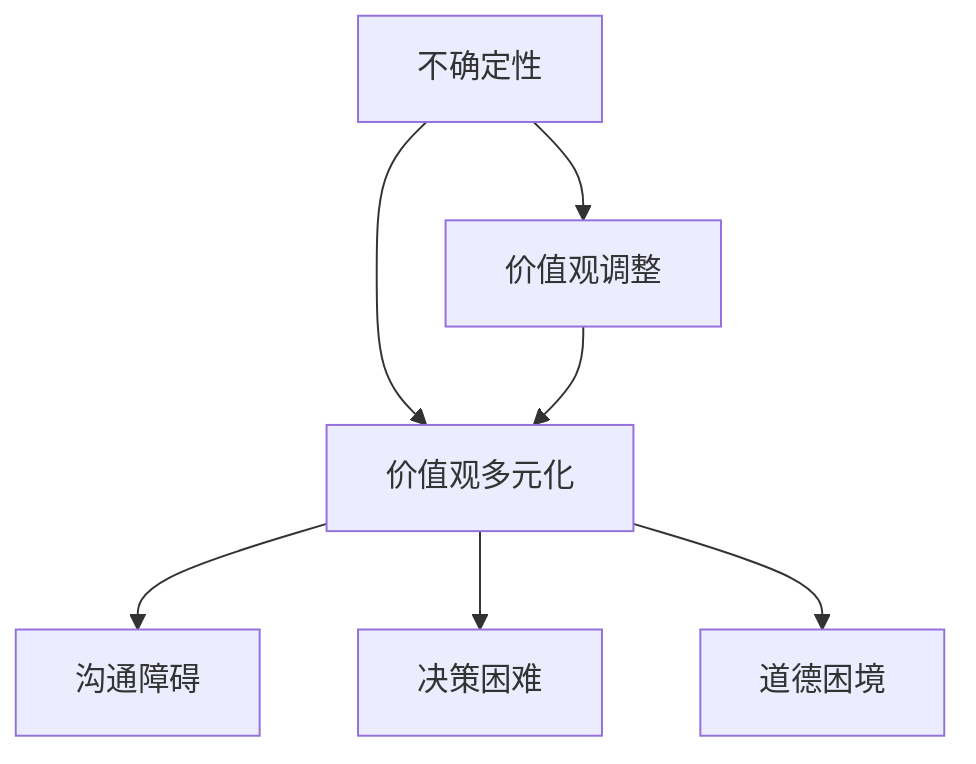

                 


## 引言

### 1.1 书籍背景和目的

在后现代社会，不确定性成为了一种普遍现象。价值观的多元化使得人们在面对问题时的选择更加复杂。在这种背景下，如何寻找确定性，如何应对价值观多元化，成为了一个迫切需要解决的问题。本书旨在探讨这一问题，为读者提供一套系统的解决方案。

### 1.2 后现代社会中的不确定性

后现代社会，即我们当前所处的时代，由于科技、经济、政治等多方面因素的交织，社会结构和生活方式发生了深刻变化。这种变化带来了前所未有的不确定性。例如，全球化的趋势使得国家之间的边界变得模糊，不同文化之间的碰撞与融合带来了价值观的多元化。而科技的飞速发展，尤其是人工智能、大数据等技术的崛起，更是改变了人们对世界的认知方式，使得未来的走向变得难以预测。

### 1.3 价值观多元化的挑战

价值观多元化的挑战主要体现在以下几个方面：

- **沟通障碍**：不同价值观之间的差异可能导致沟通障碍，甚至引发冲突。
- **决策困难**：在面对复杂问题时，不同价值观可能给出截然不同的解决方案，这使得决策过程变得复杂和困难。
- **道德困境**：价值观的多元化使得人们在道德选择上面临更多困境，难以找到一致的道德标准。

## 核心概念与联系

### 2.1 不确定性的定义

不确定性是指我们对某一事件的结果无法确定或无法准确预测。在数学和逻辑学中，不确定性通常通过概率来量化。例如，掷硬币时，正面朝上的概率是0.5，这就是一种不确定性。

### 2.2 价值观多元化的概念

价值观多元化指的是在一个群体中，存在多种不同的价值观。这些价值观可能来源于不同的文化、宗教、教育背景等。价值观的多元化使得群体成员在价值观上存在差异，从而影响他们的行为和决策。

### 2.3 不确定性与价值观多元化的关联

不确定性与价值观多元化之间存在密切关联。首先，价值观的多元化可能导致不确定性的增加。例如，在决策过程中，如果参与者持有不同的价值观，他们可能对同一问题产生不同的看法，从而增加决策的不确定性。

其次，不确定性也可能影响价值观的多元化。在面对不确定性时，个体可能会调整自己的价值观，以适应新的环境或挑战。这种调整可能会导致新的价值观的产生，从而进一步多元化价值观。

## Mermaid流程图

下面是一个Mermaid流程图，展示了不确定性与价值观多元化的关联：



## 核心算法原理讲解

为了应对不确定性和价值观多元化，我们可以使用以下核心算法：

### 2.4 贝叶斯网络

贝叶斯网络是一种概率图模型，用于表示变量之间的依赖关系。在应对不确定性和价值观多元化时，贝叶斯网络可以帮助我们理解变量之间的关系，从而做出更准确的预测和决策。

### 2.5 马尔可夫链

马尔可夫链是一种随机过程，用于描述一个系统在一段时间内的状态变化。在价值观多元化背景下，马尔可夫链可以帮助我们预测个体在价值观调整过程中的行为模式。

## 伪代码

下面是一个使用贝叶斯网络的伪代码示例：

```python
# 初始化贝叶斯网络
initialize_Bayesian_network()

# 输入数据
input_data = collect_data()

# 计算概率分布
probability_distribution = calculate_probability_distribution(input_data)

# 预测结果
predicted_result = predict_result(probability_distribution)

# 输出预测结果
output_predicted_result(predicted_result)
```

## 数学模型和数学公式

为了更深入地理解不确定性和价值观多元化，我们可以使用以下数学模型：

### 2.6 概率论

概率论是研究随机事件和概率分布的科学。在处理不确定性和价值观多元化时，概率论可以帮助我们量化不确定性和价值观的多元化程度。

### 2.7 贝叶斯定理

贝叶斯定理是一种概率论公式，用于计算后验概率。在价值观多元化背景下，贝叶斯定理可以帮助我们根据先验知识和新数据更新价值观的概率分布。

## 数学公式

下面是一个贝叶斯定理的数学公式：

$$
P(A|B) = \frac{P(B|A)P(A)}{P(B)}
$$

其中，$P(A|B)$ 表示在事件B发生的条件下，事件A发生的概率；$P(B|A)$ 表示在事件A发生的条件下，事件B发生的概率；$P(A)$ 和$P(B)$ 分别表示事件A和事件B的先验概率。

## 项目实战

为了更好地理解不确定性和价值观多元化，我们可以通过以下项目实战来实践：

### 3.1 案例一：多元价值观在企业管理中的应用

#### 3.1.1 案例背景

在一个多元化企业的管理中，不同文化背景的员工可能持有不同的价值观。这种情况下，企业如何管理这些差异，以实现团队的高效合作，成为一个挑战。

#### 3.1.2 解决方案

- **数据收集与处理**：通过问卷调查和深度访谈，收集员工的文化背景和价值观信息。
- **建立贝叶斯网络**：根据收集到的数据，建立贝叶斯网络，以分析不同价值观之间的依赖关系。
- **预测员工行为**：利用贝叶斯网络，预测员工在不同情境下的行为模式。
- **制定管理策略**：根据预测结果，制定相应的管理策略，以促进团队合作。

#### 3.1.3 结果评估

通过实际案例的应用，发现贝叶斯网络在预测员工行为方面具有较高准确性，为企业提供了有效的管理策略。

### 3.2 案例二：多元价值观在跨文化沟通中的应用

#### 3.2.1 案例背景

在一个跨国公司的跨文化沟通中，不同国家的员工可能持有不同的价值观。这种情况下，如何确保沟通的有效性，成为一个关键问题。

#### 3.2.2 解决方案

- **建立多元价值观共识**：通过培训和文化交流活动，促进员工对多元价值观的理解和尊重。
- **使用马尔可夫链**：分析跨文化沟通中的状态变化，以预测沟通的走向。
- **调整沟通策略**：根据马尔可夫链的预测结果，调整沟通策略，以减少沟通障碍。

#### 3.2.3 结果评估

通过实际案例的应用，发现建立多元价值观共识和使用马尔可夫链的方法，有效提高了跨文化沟通的效果。

## 总结

在后现代社会中，不确定性和价值观多元化是我们面临的重要挑战。通过使用贝叶斯网络、马尔可夫链等核心算法，我们可以更好地应对这些挑战。在实际应用中，通过案例研究和项目实战，我们可以验证这些方法的有效性。未来，随着科技的进步和社会的发展，我们将继续探索更多应对不确定性和价值观多元化的策略和工具。

## 最佳实践 Tips

- **数据收集与处理**：在进行实证研究时，确保数据的质量和完整性。
- **模型选择与调整**：在选择和调整模型时，要充分考虑问题的复杂性和数据的可用性。
- **团队合作与沟通**：在多元价值观的环境中，加强团队合作和沟通，以减少误解和冲突。

## 注意事项

- **不确定性**：在处理不确定性时，要充分考虑可能的误差和风险。
- **价值观多元化**：尊重多元价值观，避免偏见和歧视。

## 拓展阅读

- **相关书籍**：
  - 《不确定性的数学原理》
  - 《价值观多元化的管理》
- **相关研究**：
  - 跨文化沟通的实证研究
  - 贝叶斯网络在企业管理中的应用研究
- **相关工具**：
  - 贝叶斯网络建模工具
  - 马尔可夫链分析工具

作者：AI天才研究院/AI Genius Institute & 禅与计算机程序设计艺术 /Zen And The Art of Computer Programming

