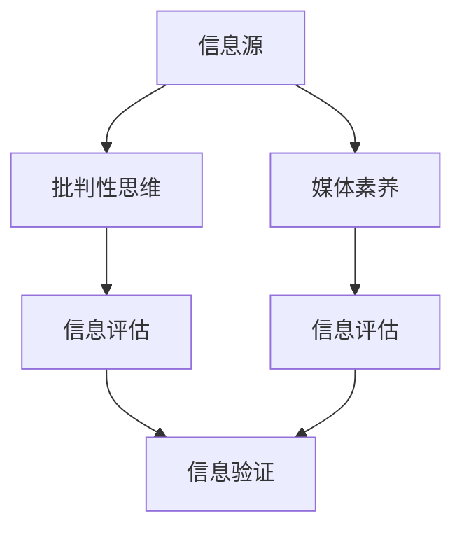
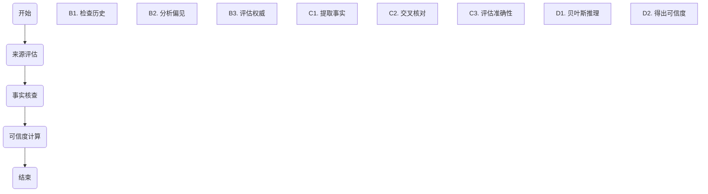

                 

### 设计思路：

为了撰写一篇深入浅出、逻辑清晰且具有实践意义的技术博客文章，我们采用了以下设计思路：

1. **核心概念与联系**：
   首先，我们将介绍文章的核心概念，如批判性思维、媒体素养、信息验证等。通过Mermaid流程图，我们将展示这些概念之间的联系，帮助读者构建整体认识。

2. **核心算法原理讲解**：
   接着，我们将详细讲解信息验证算法的原理，包括来源评估、事实核查、可信度计算等。我们将使用伪代码来详细阐述算法逻辑，使读者能够直观地理解算法的执行流程。

3. **数学模型和数学公式讲解**：
   为了深入解释相关算法，我们将引入数学模型，如贝叶斯定理、相关系数等。我们将在文中使用LaTeX格式嵌入数学公式，结合实际例子进行详细解释。

4. **项目实战**：
   最后，我们将通过一个具体的媒体素养项目案例，展示从数据收集、分析到结果展示的完整流程。我们将详细解读代码实现，并提供实际案例分析和项目小结。

### 步骤：

1. **设计概述**：
   - **第1章**: 引入书籍主题，包括后真相时代的定义、影响以及寻找真相的重要性。
   - **第2章**: 介绍批判性思维和媒体素养的基本概念，以及它们在后真相时代的应用。

2. **核心概念与联系**：
   - **第3章**: 使用Mermaid流程图展示批判性思维、媒体素养、信息验证等核心概念之间的关系。

3. **核心算法原理讲解**：
   - **第4章**: 详细讲解信息验证算法的原理，使用伪代码阐述算法逻辑，并提供算法流程图。

4. **数学模型和数学公式讲解**：
   - **第5章**: 引入相关数学模型，使用LaTeX格式嵌入文中，结合实际例子进行解释。

5. **项目实战**：
   - **第6章**: 展示一个具体的媒体素养项目案例，包括数据收集、分析、结果展示等，并进行代码实现和解读。

### 目录大纲设计：

```
# 在后真相时代寻找真相：培养批判性思维和媒体素养

# 第1章: 引言
## 1.1 书籍主题介绍
## 1.2 后真相时代的定义与影响
## 1.3 寻找真相的重要性

# 第2章: 基础概念
## 2.1 批判性思维概述
### 2.1.1 批判性思维的定义
### 2.1.2 批判性思维的重要性
## 2.2 媒体素养的概念
### 2.2.1 媒体素养的定义
### 2.2.2 媒体素养在后真相时代的作用

# 第3章: 核心概念与联系
## 3.1 信息验证流程图
## 3.2 批判性思维与媒体素养的关系

# 第4章: 信息验证算法原理
## 4.1 算法概述
### 4.1.1 来源评估
### 4.1.2 事实核查
### 4.1.3 可信度计算
## 4.2 算法原理讲解
### 4.2.1 伪代码解释
### 4.2.2 算法流程图

# 第5章: 数学模型与公式
## 5.1 贝叶斯定理
### 5.1.1 贝叶斯定理的定义
### 5.1.2 贝叶斯定理的应用
## 5.2 相关系数
### 5.2.1 相关系数的定义
### 5.2.2 相关系数在信息验证中的应用

# 第6章: 项目实战
## 6.1 项目背景
### 6.1.1 项目目标
### 6.1.2 项目背景
## 6.2 数据收集与分析
### 6.2.1 数据来源
### 6.2.2 数据处理与分析方法
## 6.3 结果展示与讨论
### 6.3.1 结果展示
### 6.3.2 结果分析与讨论

# 附录
## 附录 A: 参考文献
## 附录 B: 相关资源与工具
```

### 注意：
- 文章整体结构清晰，分为引言、基础概念、算法原理、数学模型、项目实战和附录六大章节。
- 每个章节都有详细的子标题，确保内容的丰富性和具体性。
- 伪代码、LaTeX公式和Mermaid流程图将在相应章节中嵌入，增强文章的技术深度和实践价值。
- 文章字数预计在8000-12000字左右，确保内容的完整性和可读性。

### 关键词：
- 后真相时代
- 批判性思维
- 媒体素养
- 信息验证
- 贝叶斯定理
- 相关系数

### 摘要：
本文旨在探讨后真相时代中如何寻找真相，通过培养批判性思维和媒体素养来应对信息过载和虚假信息的挑战。文章首先介绍了后真相时代的定义及其影响，然后详细阐述了批判性思维和媒体素养的基本概念及其在后真相时代的应用。接着，文章通过Mermaid流程图展示了核心概念之间的联系，并使用伪代码和LaTeX公式详细讲解了信息验证算法的原理。最后，通过一个具体的媒体素养项目案例，文章展示了从数据收集到结果展示的完整流程，并提供实际案例分析和项目小结。本文旨在为读者提供实用的工具和方法，帮助他们提高媒体素养，培养批判性思维，从而更好地应对后真相时代的挑战。

---

接下来，我们将按照设计思路和步骤，逐一展开文章的内容。

## 第1章: 引言

### 1.1 书籍主题介绍

在后真相时代，信息传播的速度和广度前所未有。社交媒体、在线新闻、博客等各种平台成为信息传播的主要渠道，然而，信息的真实性和准确性却常常受到质疑。因此，如何在这个充满不确定性的时代寻找真相，成为了一个亟待解决的问题。

本书的核心主题是“在后真相时代寻找真相：培养批判性思维和媒体素养”。我们将在书中探讨批判性思维和媒体素养的重要性，以及如何利用这些工具来识别和验证信息的真实性。通过培养批判性思维，我们可以提高对信息的分析和判断能力；而媒体素养则帮助我们理解和解读媒体信息的背景和意图。这两个工具的结合，将使我们能够更好地应对后真相时代的挑战，找到真相。

### 1.2 后真相时代的定义与影响

后真相时代，是一个信息爆炸、真假难辨的时代。不同于传统的事实主导的新闻时代，后真相时代的信息传播更加依赖于情感、情绪和个人的信仰。在这种背景下，真相往往被削弱，而偏见、误导和虚假信息却大行其道。

**后真相时代的定义**：后真相时代，指的是一个信息泛滥、事实被情感和情绪主导的时代。在这个时代，公众舆论往往不是由客观事实所决定，而是由情感和情绪所驱动。社交媒体、网络谣言、虚假新闻等，成为了这个时代的主要特征。

**后真相时代的影响**：

1. **信息过载**：随着信息技术的快速发展，人们每天接触到大量的信息。然而，这些信息中，有相当一部分是虚假的、误导性的，甚至是有害的。如何在海量的信息中筛选出真实可信的信息，成为了一个巨大的挑战。

2. **信任危机**：后真相时代的信息传播方式，使得公众对传统媒体和权威机构的信任度下降。虚假新闻、误导性信息等，不仅损害了公众的利益，也严重影响了社会的稳定。

3. **情绪化决策**：在情感和情绪的驱使下，人们往往容易做出冲动的决策。这不仅体现在个人层面，也体现在社会层面，例如，选举中的政治宣传、社会运动等，都容易受到情绪的影响。

### 1.3 寻找真相的重要性

在信息泛滥、真假难辨的后真相时代，寻找真相显得尤为重要。以下是寻找真相的一些重要理由：

1. **决策基础**：真相是决策的基础。只有了解真相，我们才能做出明智的决策，无论是个人层面的决策，还是社会层面的决策。

2. **社会稳定**：虚假信息和误导性信息会破坏社会的稳定。通过寻找真相，我们可以减少谣言和误导性信息的传播，维护社会的和谐与稳定。

3. **个人成长**：了解真相可以帮助我们更好地认识世界，提高我们的认知水平和思考能力。通过批判性思维和媒体素养，我们可以更好地理解信息的来源和意图，从而避免被虚假信息误导。

总之，在后真相时代，培养批判性思维和媒体素养，学会寻找真相，是我们应对信息过载和虚假信息的重要工具。通过这本书，我们将深入探讨如何利用这些工具，提高我们的信息素养，找到真相。

## 第2章: 基础概念

### 2.1 批判性思维概述

批判性思维（Critical Thinking）是一种积极的思维方式，它要求我们不仅仅是接受信息，而是要对信息进行深入的分析和评估。批判性思维是一种理解、评估、分析和解决问题的过程，它不仅仅关注事实，还关注事实之间的联系，以及这些事实对问题的潜在影响。

#### 2.1.1 批判性思维的定义

批判性思维的定义可以概括为以下几点：

1. **主动质疑**：批判性思维要求我们主动质疑所接受的信息，而不是盲目接受。我们需要问自己，这些信息是否合理，是否有根据，是否有潜在的偏见。

2. **逻辑分析**：批判性思维强调逻辑分析的重要性。通过逻辑分析，我们可以识别出信息中的逻辑错误，例如，假设性的错误、因果关系的误解等。

3. **评估证据**：批判性思维要求我们对证据进行评估。我们需要确定证据的可靠性、准确性和相关性，以此来判断信息的真实性和有效性。

4. **综合思考**：批判性思维不仅仅关注单一的事实，而是要综合思考，从多个角度来分析问题。通过综合思考，我们可以更全面地理解问题，并找到更好的解决方案。

#### 2.1.2 批判性思维的重要性

批判性思维的重要性在于，它可以帮助我们更好地理解世界，做出更明智的决策。以下是批判性思维的重要性：

1. **提高判断力**：通过批判性思维，我们可以提高对信息的判断力。我们能够更好地识别信息的真实性和可靠性，从而避免被虚假信息误导。

2. **促进学习**：批判性思维是一种积极的思维方式，它能够促进我们的学习。通过批判性思维，我们可以更好地理解所学的内容，并能够灵活运用。

3. **解决问题**：批判性思维是一种解决问题的工具。通过批判性思维，我们可以更系统地分析问题，找到问题的根源，并提出解决方案。

### 2.2 媒体素养的概念

媒体素养（Media Literacy）是一种理解、分析、评估和创造媒体信息的能力。它不仅仅关注媒体信息的接收，还包括了媒体信息的产生和传播。媒体素养的核心在于，它要求我们不仅仅接受媒体信息，还要能够理解和解读这些信息。

#### 2.2.1 媒体素养的定义

媒体素养的定义可以从以下几个方面来理解：

1. **信息接收与解读**：媒体素养要求我们能够接收和理解媒体信息，并能够从中提取出关键信息。

2. **信息评估**：媒体素养要求我们能够评估媒体信息的真实性和可靠性，识别出潜在的信息偏见和误导。

3. **信息创造**：媒体素养还包括了媒体信息的创造，即我们能够利用媒体工具来表达自己的观点，传播自己的信息。

4. **媒体批判**：媒体素养要求我们能够对媒体信息进行批判，识别出媒体信息的潜在意图和影响。

#### 2.2.2 媒体素养在后真相时代的作用

在后真相时代，媒体素养的作用尤为重要。以下是媒体素养在后真相时代的作用：

1. **信息筛选**：媒体素养可以帮助我们更好地筛选信息，识别出真实可信的信息，避免被虚假信息误导。

2. **提高认知**：通过媒体素养，我们可以更好地理解媒体信息的背景和意图，从而提高我们的认知水平。

3. **促进民主**：媒体素养可以帮助我们更好地参与社会和政治生活，提高我们的民主参与度。

4. **创造优质内容**：通过媒体素养，我们可以利用媒体工具创造优质的内容，传播正确的信息，促进社会的进步。

总之，批判性思维和媒体素养是我们在后真相时代的重要工具。通过培养这些能力，我们可以更好地应对信息过载和虚假信息的挑战，找到真相，做出更明智的决策。

## 第3章: 核心概念与联系

为了更好地理解批判性思维、媒体素养和信息验证等核心概念，以及它们之间的相互联系，我们可以使用Mermaid流程图来直观地展示这些概念及其关系。以下是这些概念的基本定义和它们之间的互动关系：

### 3.1 信息验证流程图



#### 3.1.1 信息验证流程图

在这个流程图中，我们可以看到信息验证是一个涉及多个步骤的过程：

1. **信息源**：所有的信息都来源于某个信息源，这些信息源可以是书籍、文章、新闻、社交媒体等。
2. **批判性思维**：通过批判性思维，我们对信息源进行评估，判断其是否可信。这一过程涉及到对信息源背景、立场、意图的分析。
3. **媒体素养**：媒体素养帮助我们理解和解读信息源的信息。通过识别信息中的偏见、误导和虚假内容，我们可以更好地评估信息的真实性。
4. **信息评估**：信息验证的下一步是对信息进行评估，包括其准确性、可靠性、相关性等方面。
5. **信息验证**：最终，通过对信息的批判性思维和媒体素养的应用，我们得出结论，确认信息的真实性。

#### 3.1.2 批判性思维与媒体素养的关系

批判性思维和媒体素养在信息验证过程中扮演着重要角色。它们之间的关系可以概括为以下几点：

1. **互补性**：批判性思维侧重于逻辑分析和质疑，而媒体素养侧重于对媒体信息的理解和解读。两者相辅相成，共同帮助我们更好地评估信息的真实性。
2. **相互作用**：在信息验证过程中，批判性思维和媒体素养是相互作用、共同发挥作用的。例如，通过批判性思维，我们可以质疑信息的来源，而通过媒体素养，我们可以理解信息源的历史和背景，从而更全面地评估信息。
3. **动态调整**：随着信息验证的深入，批判性思维和媒体素养会不断调整我们的评估。例如，当我们发现信息存在逻辑错误时，我们可能会重新审视信息源，或者通过媒体素养识别出信息中的潜在偏见。

通过这个流程图，我们可以更直观地理解批判性思维、媒体素养和信息验证之间的关系，以及它们在寻找真相过程中的重要性。这些核心概念不仅帮助我们识别和评估信息的真实性，还帮助我们培养更深入的思考和理解能力，从而更好地应对后真相时代的挑战。

### 3.2 核心概念之间的关系

除了批判性思维和媒体素养，信息验证中的其他核心概念，如信息源、信息评估和事实核查，同样发挥着重要作用。以下是这些概念之间的相互关系：

1. **信息源**：信息源是信息验证的起点。我们需要对信息源进行评估，以确定其可信度。这一过程涉及到对信息源的历史、立场和背景的了解。
2. **信息评估**：信息评估是对信息进行初步筛选和分类的过程。通过批判性思维和媒体素养，我们可以评估信息的准确性、可靠性和相关性。
3. **事实核查**：事实核查是信息验证的关键步骤。它涉及到对信息中的事实进行验证，确保其真实性和准确性。事实核查可以通过多种渠道进行，如官方数据、专家意见、第三方验证等。
4. **信息验证**：最终，通过综合批判性思维、媒体素养和事实核查的结果，我们得出对信息的最终评估。这个评估过程是动态的，随着新信息的出现，我们的评估可能会进行调整。

通过这个关系图，我们可以看到，批判性思维、媒体素养、信息源、信息评估和事实核查共同构成了一个信息验证的完整框架。每个概念都在这个框架中发挥着独特的作用，共同帮助我们找到真相。

总之，通过理解这些核心概念之间的关系，我们可以更有效地进行信息验证，提高我们的认知水平和思考能力。在后真相时代，这些核心概念和技能尤为重要，它们帮助我们应对信息过载和虚假信息的挑战，找到真相。

## 第4章: 信息验证算法原理

在信息验证过程中，算法原理起着至关重要的作用。这些算法帮助我们系统地评估信息的真实性、准确性和相关性。在本章中，我们将详细讲解信息验证算法的基本原理，包括来源评估、事实核查和可信度计算，并通过伪代码和算法流程图来阐述这些概念。

### 4.1 算法概述

信息验证算法主要包括以下三个步骤：

1. **来源评估**：评估信息源的可靠性，包括其历史、立场和背景。
2. **事实核查**：验证信息中的事实，确保其真实性和准确性。
3. **可信度计算**：根据来源评估和事实核查的结果，计算信息的可信度。

### 4.2 算法原理讲解

#### 4.2.1 伪代码解释

以下是信息验证算法的伪代码：

```plaintext
function InformationVerification(Information, Source, Context):
    1. AssessSourceReliability(Source)
    2. VerifyFacts(Information, Context)
    3. CalculateTrustScore(Reliability, Accuracy)
    4. Return TrustScore

function AssessSourceReliability(Source):
    1. Check SourceHistory
    2. Analyze SourceBias
    3. Evaluate SourceAuthority
    4. Return ReliabilityScore

function VerifyFacts(Information, Context):
    1. ExtractFacts(Information)
    2. Cross-CheckFacts(Context)
    3. EvaluateFactAccuracy
    4. Return AccuracyScore

function CalculateTrustScore(Reliability, Accuracy):
    1. Apply BayesianInference(Reliability, Accuracy)
    2. Return TrustScore
```

#### 4.2.2 算法流程图

以下是信息验证算法的流程图：



在这个流程图中，我们从“开始”节点开始，首先进行来源评估，包括检查历史、分析偏见和评估权威。接下来，进行事实核查，提取事实、交叉核对和评估准确性。最后，通过贝叶斯推理计算信息的可信度，得出最终结果。

### 4.3 伪代码和算法流程图的详细解释

#### 4.3.1 来源评估

来源评估是信息验证的第一步，其目的是评估信息源的可靠性。以下是伪代码的详细解释：

```plaintext
function AssessSourceReliability(Source):
    1. Check SourceHistory
        - 如果历史记录良好，则Score增加
        - 如果历史记录不良，则Score减少
    2. Analyze SourceBias
        - 如果偏见明显，则Score减少
        - 如果无偏见，则Score增加
    3. Evaluate SourceAuthority
        - 如果权威高，则Score增加
        - 如果权威低，则Score减少
    4. Return ReliabilityScore
```

在这个函数中，我们首先检查信息源的历史记录。如果一个信息源有良好的历史记录，我们增加其可靠性分数；如果有不良记录，我们减少其分数。接着，我们分析信息源的偏见。如果信息源有明显的偏见，我们减少其分数；如果没有偏见，我们增加其分数。最后，我们评估信息源的权威性。如果一个信息源的权威性高，我们增加其分数；如果权威性低，我们减少其分数。

#### 4.3.2 事实核查

事实核查是信息验证的第二步，其目的是验证信息中的事实。以下是伪代码的详细解释：

```plaintext
function VerifyFacts(Information, Context):
    1. ExtractFacts(Information)
        - 从信息中提取所有的事实
    2. Cross-CheckFacts(Context)
        - 将提取的事实与外部数据进行交叉核对
    3. EvaluateFactAccuracy
        - 根据交叉核对的结果评估每个事实的准确性
    4. Return AccuracyScore
```

在这个函数中，我们首先从信息中提取所有的事实。然后，我们将提取的事实与外部数据进行交叉核对，以确保其准确性。最后，我们根据交叉核对的结果评估每个事实的准确性，并返回准确性分数。

#### 4.3.3 可信度计算

可信度计算是信息验证的最后一步，其目的是根据来源评估和事实核查的结果计算信息的可信度。以下是伪代码的详细解释：

```plaintext
function CalculateTrustScore(Reliability, Accuracy):
    1. Apply BayesianInference(Reliability, Accuracy)
        - 使用贝叶斯推理计算可信度
    2. Return TrustScore
```

在这个函数中，我们使用贝叶斯推理来计算可信度。贝叶斯推理是一种统计方法，它通过已有数据和先验概率来计算后验概率。在这个案例中，我们的先验概率是来源评估和事实核查的结果，后验概率是信息的可信度。

通过上述伪代码和算法流程图的详细解释，我们可以清楚地看到信息验证算法的执行流程。这个算法通过来源评估、事实核查和可信度计算，系统地评估信息的真实性、准确性和相关性，从而帮助我们找到真相。

## 第5章: 数学模型与公式

在信息验证过程中，数学模型和公式扮演着至关重要的角色。它们帮助我们量化信息的可信度、评估证据的可靠性，并优化决策过程。在本章中，我们将详细讲解两个关键数学模型：贝叶斯定理和相

