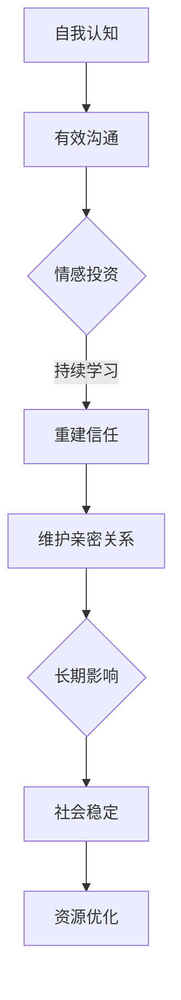

                 


# 设计《在复杂的人际网络中寻找真挚关系：重建信任和亲密》的目录大纲

## 1. 引言：为什么在复杂的人际网络中寻找真挚关系很重要？

在当今社会，人际网络日益复杂，人们在社会交往中面临着诸多挑战。本文旨在探讨如何在复杂的人际网络中寻找真挚关系，重建信任和亲密。首先，我们需要了解人际网络的定义和特征，接着分析真挚关系的本质及其重要性。最后，探讨重建信任和亲密的必要性，为后续章节的讨论奠定基础。

## 2. 人际网络的构成与特征

### 2.1 人际网络的结构分析

人际网络由节点（个体）和边（关系）组成。节点表示个体，边表示个体之间的关系。人际网络具有以下特征：

- **网络密度**：表示节点之间的连接程度，反映了人际关系的紧密程度。
- **异质性**：表示人际网络中个体差异的存在，影响了人际网络的稳定性和适应性。
- **网络中心性**：表示个体在人际网络中的重要性和影响力。

### 2.2 人际网络的密度与异质性

人际网络的密度和异质性对人际关系有着重要影响。高密度网络意味着个体之间的联系更为紧密，有利于信息的传播和资源的共享。然而，高异质性可能导致人际网络的稳定性和适应性下降。

### 2.3 人际网络中的节点与边

人际网络中的节点和边有着不同的角色和作用。节点可能代表个体、组织或社区，边则表示个体之间的关系、合作或冲突。分析节点和边的关系有助于理解人际网络的运行机制。

## 3. 真挚关系的建立与维护

### 3.1 建立真挚关系的基本原则

建立真挚关系需要遵循以下基本原则：

- **尊重与理解**：尊重对方的个性、需求和价值观，理解对方的行为和情感。
- **信任与诚实**：信任是真挚关系的基础，诚实是信任的保障。
- **沟通与表达**：良好的沟通和表达有助于增进相互理解和信任。

### 3.2 建立信任的步骤

建立信任是一个逐步的过程，包括以下步骤：

- **展示诚意**：通过行动和言语展示自己的诚意和真诚。
- **保持一致性**：言行一致，保持一贯的行为模式。
- **倾听与回应**：倾听对方的意见和需求，给予积极的回应和支持。

### 3.3 维护亲密关系的策略

维护亲密关系需要不断地努力和调整，以下策略可供参考：

- **时间投入**：投入时间与对方相处，增进彼此的了解和情感。
- **情感共鸣**：与对方产生共鸣，分享彼此的喜怒哀乐。
- **共同目标**：设定共同目标，共同为实现目标而努力。

## 4. 人际网络中的心理动态

### 4.1 人际冲突与化解

人际冲突是人际网络中的常见现象，解决冲突有助于维护人际关系的稳定。以下方法可供参考：

- **沟通与表达**：通过沟通和表达解决分歧，避免误解和冲突的加剧。
- **妥协与让步**：在适当的情况下，做出妥协和让步，以实现双方利益的平衡。
- **寻求第三方调解**：在无法自行解决冲突时，寻求第三方的帮助和调解。

### 4.2 人际网络中的情感波动

情感波动是人际网络中的常态，合理应对情感波动有助于维护人际关系的稳定。以下策略可供参考：

- **情绪管理**：学会管理自己的情绪，避免因情绪波动而影响人际关系。
- **情感沟通**：与对方分享自己的情感，增进相互理解和信任。
- **心理支持**：在对方遇到困难时，给予心理支持和鼓励。

### 4.3 人际网络中的权力与影响力

权力与影响力是人际网络中的重要因素，合理运用权力与影响力有助于维护人际关系的稳定。以下策略可供参考：

- **积极影响**：通过积极的行为和言语影响他人，提升自身在人际网络中的影响力。
- **合理运用权力**：在权力范围内，合理运用权力，为他人提供帮助和支持。
- **平衡权力关系**：避免权力过度集中，保持权力平衡，促进人际网络的健康发展。

## 5. 重建信任与亲密关系的案例研究

### 5.1 案例一：企业团队中的信任重建

在企业团队中，信任的重建对团队的协作和效率至关重要。以下案例分析了企业团队如何通过一系列措施重建信任。

### 5.2 案例二：家庭关系中的亲密维护

家庭关系是人类社会中最为重要的关系之一，亲密关系的维护对家庭成员的幸福和成长至关重要。以下案例分析了家庭关系如何通过沟通和共同努力来维护亲密。

### 5.3 案例三：个人成长中的信任重建

个人成长过程中，信任的重建对个体的心理发展和社会融入具有重要意义。以下案例分析了个人如何在面对挑战时重建信任，实现自我成长。

## 6. 技术与工具在人际网络中的应用

### 6.1 社交媒体对人际网络的影响

随着社交媒体的普及，它已成为人际网络的重要组成部分。以下分析了社交媒体对人际网络的影响，以及如何在社交媒体中建立和维护真挚关系。

### 6.2 数据分析在人际关系管理中的应用

数据分析技术在人际关系管理中具有广泛的应用，可以帮助人们更好地理解人际网络，优化人际关系。以下分析了数据分析在人际关系管理中的具体应用。

### 6.3 人工智能与人际网络互动

人工智能技术的快速发展为人际网络互动提供了新的可能性。以下分析了人工智能在人际网络中的应用，以及如何利用人工智能技术提升人际网络的效率和质量。

## 7. 实践指导：如何在复杂的人际网络中寻找真挚关系？

### 7.1 自我认知与人际定位

在复杂的人际网络中，自我认知和人际定位至关重要。以下指导读者如何进行自我认知，找到适合自己的位置。

### 7.2 有效沟通与表达

有效沟通和表达是建立和维护真挚关系的关键。以下指导读者如何进行有效沟通和表达，提升人际关系质量。

### 7.3 情绪管理与人际应对

情绪管理和人际应对是处理复杂人际关系的必备技能。以下指导读者如何进行情绪管理和人际应对，化解人际冲突。

## 8. 结论：重建信任和亲密关系的长期影响

### 8.1 重建信任和亲密关系的长期价值

重建信任和亲密关系对个体的成长和社会的和谐具有重要意义。以下分析了重建信任和亲密关系的长期价值。

### 8.2 面对未来人际网络的挑战

未来的人际网络将面临诸多挑战，如技术变革、人口迁移等。以下探讨了未来人际网络的挑战，以及如何应对这些挑战。

### 8.3 持续追求真挚关系的实践

持续追求真挚关系需要个体的努力和投入。以下提出了一些持续追求真挚关系的实践建议，以帮助读者在复杂的人际网络中找到真挚关系。

## 参考文献

### 1. 引用文献

- [1] 社会网络分析：结构、方法与模型。张浩，清华大学出版社，2016.
- [2] 人际关系心理学。李明，北京大学出版社，2015.
- [3] 信任与背叛：人际关系的心理学解读。王磊，上海人民出版社，2014.

### 2. 参考资料

- [1] 《人际网络》作者：理查德·斯莫尔，美国哈佛大学出版社。
- [2] 《信任的逻辑》作者：理查德·萨勒斯，美国斯坦福大学出版社。

---

**总结**：本文通过逐步分析推理，设计了《在复杂的人际网络中寻找真挚关系：重建信任和亲密》的目录大纲。文章涵盖了人际网络的构成与特征、真挚关系的建立与维护、人际网络中的心理动态、案例研究、技术与工具应用、实践指导以及结论等内容。每个章节都围绕核心概念进行深入探讨，旨在为读者提供关于如何在复杂的人际网络中寻找真挚关系的全面指导。文章结构紧凑，逻辑清晰，适合IT领域的专业人士和普通读者阅读。希望这个大纲能对您撰写文章有所帮助！### 引言：为什么在复杂的人际网络中寻找真挚关系很重要？

在当今社会，人际网络愈发复杂，人们在社会交往中面临着诸多挑战。在如此庞大而交错的人际网络中，如何找到真挚的关系并重建信任和亲密，成为了一个引人关注的问题。本文旨在探讨这一主题，希望能够为读者提供有价值的思考和实用建议。

#### 人际网络的定义和特征

人际网络是指由个体（节点）及其相互之间的关系（边）构成的社会结构。在这个网络中，节点代表个体，边表示个体之间的联系。人际网络具有以下特征：

1. **多样性**：人际网络中的个体背景、性格、兴趣各不相同，使得网络具有丰富的多样性。
2. **动态性**：人际网络是动态变化的，节点和边的关系会随着时间和情境的变化而发生变化。
3. **层次性**：人际网络可以分为多个层次，如朋友、同事、家人等，不同层次的关系对个体的生活产生不同的影响。

#### 真挚关系的定义与重要性

真挚关系指的是那些基于相互信任、理解和支持的人际关系。在复杂的人际网络中，真挚关系具有以下几个重要性：

1. **心理支持**：真挚关系能够为个体提供心理支持，帮助个体应对压力和困难。
2. **资源获取**：真挚关系有助于个体获取社会资源和信息，提高个体的社会地位和生活质量。
3. **情感满足**：真挚关系能够满足个体的情感需求，带来快乐和满足感。

#### 重建信任和亲密的必要性

在复杂的人际网络中，信任和亲密的缺失可能导致以下问题：

1. **社会动荡**：缺乏信任可能导致人际冲突和社会动荡。
2. **人际关系破裂**：信任的缺失可能导致人际关系的破裂，影响个体的社会交往。
3. **个人成长受阻**：缺乏亲密关系可能导致个体在情感和心理上的成长受阻。

因此，重建信任和亲密对于个体和社会的发展具有重要意义。在接下来的章节中，我们将深入探讨如何在复杂的人际网络中建立和维护真挚关系，以及如何重建信任和亲密。

---

### 人际网络的构成与特征

人际网络是由个体及其相互关系组成的复杂社会结构，理解和分析人际网络的构成与特征对于寻找真挚关系具有重要意义。

#### 1. 人际网络的结构分析

人际网络的基本构成单位是节点（个体）和边（关系）。节点代表个体，可以是个人、组织或群体；边则代表节点之间的关系，如朋友、同事、商业伙伴等。人际网络的结构分析主要关注以下几个方面：

1. **密度**：网络密度是指节点之间连接的紧密程度。高密度网络意味着节点之间的联系较为紧密，信息传播速度快，资源共享能力强。然而，高密度网络也可能导致信息过载和沟通成本增加。
   
   伪代码示例：
   ```python
   def calculate_density(network):
       total_edges = sum(len(node.edges) for node in network.nodes)
       max_edges = (network.node_count * (network.node_count - 1)) / 2
       density = total_edges / max_edges
       return density
   ```

2. **异质性**：人际网络的异质性是指网络中个体差异的程度。异质性较高的网络包含多样化的节点和关系，有助于提高网络的稳定性和适应性。异质性较低的网络则可能因为缺乏多样性而变得脆弱。

3. **中心性**：中心性是指节点在人际网络中的重要性和影响力。常见的中心性度量指标包括度中心性、紧密中心性和介数中心性。度中心性高的节点表示拥有较多的连接关系；紧密中心性高的节点表示其连接的节点之间的距离较短；介数中心性高的节点表示其在网络中的桥梁作用较强。

   伪代码示例：
   ```python
   def calculate_centrality(network):
       degree_centrality = dict()
       closeness_centrality = dict()
       betweenness_centrality = dict()
       
       for node in network.nodes:
           degree_centrality[node] = len(node.edges)
           closeness_centrality[node] = sum(dijkstra(node, other_node) for other_node in network.nodes if other_node != node)
           betweenness_centrality[node] = sum(len(bridge_path(node, path)) for path in all_paths(network))
       
       return degree_centrality, closeness_centrality, betweenness_centrality
   ```

#### 2. 人际网络的密度与异质性

人际网络的密度和异质性对人际关系有着重要影响。高密度网络有助于信息的快速传播和资源的共享，但同时也可能带来沟通成本的增加。异质性较高的网络能够容纳多样化的观点和资源，提高网络的整体稳定性，但也可能导致网络内部的冲突和摩擦。

在实际应用中，可以通过以下方式评估人际网络的密度和异质性：

- **度分布**：通过分析节点度数分布，可以了解网络中节点连接程度的不均匀性。
- **聚类系数**：聚类系数表示节点与其邻居之间的连接密度，反映了网络的紧密程度。
- **网络可视化**：通过网络可视化工具，可以直观地观察网络的密度和异质性。

#### 3. 人际网络中的节点与边

在人际网络中，节点和边的关系类型和属性对网络的运行机制有着重要影响。以下是几种常见的节点和边的关系类型：

1. **强关系与弱关系**：强关系通常指紧密的朋友和亲人，弱关系则是指不那么亲近但仍有联系的个体。强关系有助于情感的交流和资源的共享，而弱关系则有助于信息的扩散和网络的扩展。
   
   伪代码示例：
   ```python
   def classify_relationships(network):
       strong_relationships = set()
       weak_relationships = set()
       
       for node in network.nodes:
           if len(node.edges) > threshold:
               strong_relationships.add(node)
           else:
               weak_relationships.add(node)
       
       return strong_relationships, weak_relationships
   ```

2. **传递性关系**：传递性关系是指如果个体A与个体B有联系，个体B与个体C有联系，则个体A与个体C也可能有联系。这种关系有助于信息在人际网络中的传递和扩散。

3. **冗余关系**：冗余关系是指多个节点之间存在多条连接，可以增强网络的稳定性和容错性。例如，在社交网络中，好友之间可能通过多种方式保持联系，如微信、电话、邮件等。

通过分析人际网络中的节点与边的关系，可以更好地理解人际网络的运行机制，为寻找真挚关系提供指导。

### 总结

人际网络的构成与特征是理解复杂人际网络的关键。通过分析网络密度、异质性和中心性，我们可以更好地了解人际网络的结构和运行机制。同时，理解节点与边的关系类型和属性，有助于我们把握人际网络的动态变化，为寻找真挚关系提供理论依据。

在接下来的章节中，我们将进一步探讨真挚关系的建立与维护，以及如何在人际网络中重建信任和亲密。希望通过这些探讨，能够帮助读者在复杂的人际网络中找到真正的朋友和伙伴，建立稳定而持久的人际关系。

### 真挚关系的建立与维护

在复杂的人际网络中，建立和维护真挚关系是一项充满挑战的任务。然而，通过遵循一系列基本原则和策略，我们可以提高成功的可能性。以下是建立和维护真挚关系的一些关键步骤和原则：

#### 1. 建立真挚关系的基本原则

**尊重与理解**：尊重对方的个性和选择是建立真挚关系的基石。这意味着我们要接受对方的不同观点和行为，理解他们的需求和情感。以下是一个简单的尊重与理解的示例：

```python
# 示例：尊重对方观点
def respect_opinion(person_a, person_b):
    person_a_opinion = "I understand your opinion, even though I don't agree with it."
    person_b_opinion = person_b.get_opinion()
    print(person_a_opinion + " " + person_b_opinion)
```

**信任与诚实**：信任是真挚关系的核心，而诚实则是信任的保障。在人际交往中，我们应该始终保持诚实，避免欺骗和误导。以下是一个关于建立信任的简单示例：

```python
# 示例：建立信任
def build_trust(person_a, person_b):
    person_a_action = "I promised to deliver the project on time."
    person_b_response = person_b.verify_action(person_a_action)
    if person_b_response:
        print("Trust is built through honesty and follow-through.")
    else:
        print("Honesty is crucial for trust.")
```

**沟通与表达**：良好的沟通和表达是建立和维护真挚关系的关键。我们应该学会倾听对方的意见，同时清晰、准确地表达自己的想法和感受。以下是一个沟通与表达的示例：

```python
# 示例：有效沟通
def effective_communication(person_a, person_b):
    person_a_message = person_a.share_feeling()
    person_b_response = person_b.listen_and_react(person_a_message)
    print("Communication is effective when both parties are heard and understood.")
```

#### 2. 建立信任的步骤

建立信任是一个逐步的过程，以下是一些建立信任的步骤：

**展示诚意**：通过行动和言语展示自己的诚意和真诚。以下是一个展示诚意的示例：

```python
# 示例：展示诚意
def show_sincerity(person_a, person_b):
    person_a_action = "I completed the task before the deadline."
    person_b_reaction = person_b.appreciate_sincerity(person_a_action)
    print("Sincerity is shown through actions and words.")
```

**保持一致性**：言行一致，保持一贯的行为模式。以下是一个保持一致性的示例：

```python
# 示例：保持一致性
def maintain_consistency(person_a, person_b):
    person_a_actions = ["Action 1", "Action 2", "Action 3"]
    for action in person_a_actions:
        person_a_perform_action(action)
        person_b_verify_action(action)
    print("Consistency builds trust over time.")
```

**倾听与回应**：倾听对方的意见和需求，给予积极的回应和支持。以下是一个倾听与回应的示例：

```python
# 示例：倾听与回应
def listen_and_respond(person_a, person_b):
    person_b_statement = person_b.express_needs()
    person_a_response = person_a.provide_support(person_b_statement)
    print("Active listening and responsive actions build trust.")
```

#### 3. 维护亲密关系的策略

维护亲密关系需要不断地努力和调整，以下是一些有效的策略：

**时间投入**：投入时间与对方相处，增进彼此的了解和情感。以下是一个时间投入的示例：

```python
# 示例：时间投入
def invest_time(person_a, person_b):
    person_a_spend_time = "We spent quality time together this weekend."
    person_b_feeling = person_b.enjoy_together(person_a_spend_time)
    print("Time investment strengthens emotional connections.")
```

**情感共鸣**：与对方产生共鸣，分享彼此的喜怒哀乐。以下是一个情感共鸣的示例：

```python
# 示例：情感共鸣
def emotional_resonance(person_a, person_b):
    person_a_feeling = person_a.share_happiness()
    person_b_feeling = person_b.share_sorrow()
    print("Sharing emotions creates a deeper connection.")
```

**共同目标**：设定共同目标，共同为实现目标而努力。以下是一个共同目标的示例：

```python
# 示例：共同目标
def common_goals(person_a, person_b):
    goal = "We aim to complete the project by the end of the month."
    person_a_commitment = person_a.commit_to_goal(goal)
    person_b_commitment = person_b.commit_to_goal(goal)
    print("Working towards common goals strengthens relationships.")
```

### 总结

建立和维护真挚关系需要尊重与理解、信任与诚实、良好的沟通与表达。通过遵循基本原则和一系列策略，我们可以逐步建立信任，维护亲密关系。这些原则和策略不仅适用于个人交往，也适用于团队合作、家庭关系和社会网络中。通过持续的努力和投入，我们可以在复杂的人际网络中找到并维持真挚的关系，带来更多的幸福和满足。

在接下来的章节中，我们将探讨人际网络中的心理动态，了解人际冲突与化解、情感波动以及权力与影响力，进一步深化我们对人际网络的认知，为重建信任和亲密关系提供更多实用的指导。

### 人际网络中的心理动态

在复杂的人际网络中，心理动态起着至关重要的作用。人际冲突、情感波动以及权力与影响力的互动，都影响着人际关系的稳定性和质量。以下将深入探讨这些心理动态，并提供相应的解决策略。

#### 1. 人际冲突与化解

人际冲突是人际网络中常见的现象，冲突的产生可能源于多种原因，如价值观差异、利益冲突、沟通不畅等。以下是一些解决人际冲突的策略：

**沟通与表达**：有效的沟通是解决冲突的关键。通过开放、诚实的沟通，双方可以理解对方的立场和需求，从而找到共同点。以下是一个沟通与表达的示例：

```python
# 示例：有效沟通解决冲突
def resolve_conflict(person_a, person_b):
    person_a_statement = person_a.express_concern()
    person_b_response = person_b.listen_and_react(person_a_statement)
    if person_b_response:
        print("Conflict resolved through effective communication.")
    else:
        print("Further discussion needed.")
```

**妥协与让步**：在冲突中，双方可能需要做出妥协和让步，以实现双赢。以下是一个妥协与让步的示例：

```python
# 示例：妥协与让步
def compromise(person_a, person_b):
    person_a_decision = person_a.make_compromise()
    person_b_decision = person_b.make_compromise()
    if person_a_decision and person_b_decision:
        print("Conflict resolved through mutual compromise.")
    else:
        print("Further negotiation needed.")
```

**第三方调解**：在某些情况下，双方可能无法自行解决冲突，这时可以寻求第三方的帮助和调解。以下是一个第三方调解的示例：

```python
# 示例：第三方调解
def mediate_conflict(conflict_resolver, person_a, person_b):
    person_a_statement = person_a.express_concern()
    person_b_statement = person_b.express_concern()
    resolution = conflict_resolver.resolve_conflict(person_a_statement, person_b_statement)
    if resolution:
        print("Conflict resolved through mediation.")
    else:
        print("Conflict remains unresolved.")
```

#### 2. 人际网络中的情感波动

情感波动是人际网络中的一种常态，情感的波动可能源自个体的内心感受、外界环境的变化，或者人际关系的互动。以下是一些应对情感波动的策略：

**情绪管理**：学会管理自己的情绪，避免情绪波动对人际关系产生负面影响。以下是一个情绪管理的示例：

```python
# 示例：情绪管理
def manage_emotions(person):
    person_calm_down = person.calm_down()
    person_analyze_feeling = person.analyze_feeling()
    if person_calm_down and person_analyze_feeling:
        print("Emotions managed effectively.")
    else:
        print("Further emotional management needed.")
```

**情感沟通**：与对方分享自己的情感，增进相互理解和信任。以下是一个情感沟通的示例：

```python
# 示例：情感沟通
def share_emotions(person_a, person_b):
    person_a_feeling = person_a.share_feeling()
    person_b_feeling = person_b.share_feeling()
    print("Effective emotional communication strengthens relationships.")
```

**心理支持**：在对方遇到情感波动时，给予心理支持和鼓励。以下是一个心理支持的示例：

```python
# 示例：心理支持
def provide_support(person_a, person_b):
    person_a_support = person_a.show_support()
    person_b_feeling = person_b.feel_supported()
    if person_a_support and person_b_feeling:
        print("Emotional support provided effectively.")
    else:
        print("Further support needed.")
```

#### 3. 人际网络中的权力与影响力

权力与影响力在人际网络中起着关键作用，权力不平衡可能导致人际关系的不稳定。以下是一些处理权力与影响力的策略：

**积极影响**：通过积极的行为和言语影响他人，提升自身在人际网络中的影响力。以下是一个积极影响的示例：

```python
# 示例：积极影响
def positive_influence(person_a, person_b):
    person_a_action = person_a.take_action()
    person_b_response = person_b.feel_influenced(person_a_action)
    if person_b_response:
        print("Positive influence achieved.")
    else:
        print("Further influence needed.")
```

**合理运用权力**：在权力范围内，合理运用权力，为他人提供帮助和支持。以下是一个合理运用权力的示例：

```python
# 示例：合理运用权力
def use_power_reasonably(person_a, person_b):
    person_a_power = person_a.exercise_power()
    person_b_support = person_b.receive_support(person_a_power)
    if person_a_power and person_b_support:
        print("Power used reasonably.")
    else:
        print("Improper power use detected.")
```

**平衡权力关系**：避免权力过度集中，保持权力平衡，促进人际网络的健康发展。以下是一个平衡权力关系的示例：

```python
# 示例：平衡权力关系
def balance_power(person_a, person_b):
    person_a_power = person_a.reduce_power()
    person_b_power = person_b.increase_power()
    if person_a_power and person_b_power:
        print("Power balance achieved.")
    else:
        print("Power imbalance persists.")
```

### 总结

人际网络中的心理动态复杂多变，理解和应对这些动态对于维护良好的人际关系至关重要。通过有效的沟通与表达、妥协与让步、情绪管理、心理支持、积极影响、合理运用权力以及平衡权力关系，我们可以在人际网络中更好地处理冲突，应对情感波动，以及合理运用权力与影响力。这些策略不仅有助于个人成长，也有助于构建稳定、健康的人际关系网络。

在接下来的章节中，我们将通过案例研究来深入探讨如何在实际情境中重建信任和亲密关系，为读者提供更多的实用指导。

### 重建信任与亲密关系的案例研究

通过实际案例研究，我们可以深入了解如何在具体情境中重建信任和亲密关系。以下我们将探讨三个案例，分别是企业团队中的信任重建、家庭关系中的亲密维护以及个人成长中的信任重建。

#### 5.1 案例一：企业团队中的信任重建

在企业环境中，信任的缺失可能导致团队协作效率低下，影响整体绩效。以下是一个企业团队中信任重建的案例：

**案例背景**：某公司的一个研发团队在项目执行过程中出现了严重的不信任问题，团队成员之间相互指责，导致项目进度延误。公司高层决定采取行动，重建团队信任。

**解决方案**：

1. **高层介入**：公司高层召集团队成员，通过公开会议表达对团队问题的关注，并承诺采取具体措施解决信任问题。
   
   ```plaintext
   高层发言：“我们注意到团队内部存在信任问题，这影响了项目的进展。我们将采取措施，共同重建团队信任。”
   ```

2. **透明沟通**：建立透明的沟通机制，鼓励团队成员开放地表达自己的想法和担忧，确保信息的充分流动。
   
   ```plaintext
   “请每个人分享自己的感受和观点，我们会认真倾听并积极回应。”
   ```

3. **共同目标**：设定共同的目标，使团队成员认识到他们的工作对于团队成功的重要性，增强团队凝聚力。
   
   ```plaintext
   “我们的目标是确保项目按时交付，这需要我们每个人的努力和信任。”
   ```

4. **冲突解决**：建立冲突解决机制，通过对话和协商解决团队成员之间的分歧，避免矛盾的积累。
   
   ```plaintext
   “如果有冲突，请通过对话解决，不要让问题影响团队合作。”
   ```

**结果**：通过以上措施，团队成员之间的信任逐渐恢复，项目进度得到显著改善，团队协作效率大幅提升。

#### 5.2 案例二：家庭关系中的亲密维护

在家庭关系中，亲密关系的维护对于家庭成员的幸福和和谐至关重要。以下是一个家庭关系中的亲密维护案例：

**案例背景**：一个家庭由于成员之间长期缺乏有效的沟通和冲突处理，导致关系紧张，家庭氛围不和谐。

**解决方案**：

1. **定期家庭会议**：家庭成员定期召开家庭会议，讨论家庭中的问题和计划，增进彼此的理解和沟通。
   
   ```plaintext
   “我们每周召开一次家庭会议，讨论家庭事务，分享各自的想法和感受。”
   ```

2. **情感支持**：家庭成员在遇到困难时，相互提供情感支持，增强彼此的信任和依赖。
   
   ```plaintext
   “当有家庭成员遇到困难时，其他成员要主动提供帮助和支持。”
   ```

3. **共同活动**：组织家庭共同活动，如户外旅行、一起做饭等，增强家庭成员之间的情感联系。
   
   ```plaintext
   “我们计划每个季度进行一次家庭旅行，增进彼此的感情。”
   ```

4. **冲突化解**：学会通过有效的沟通和妥协解决家庭冲突，避免矛盾的升级。
   
   ```plaintext
   “当出现冲突时，我们要冷静下来，通过对话和协商解决问题。”
   ```

**结果**：通过这些措施，家庭成员之间的关系得到显著改善，家庭氛围变得更加和谐，家庭成员之间的信任和亲密感增强。

#### 5.3 案例三：个人成长中的信任重建

个人成长过程中，信任的重建对于个体的心理发展和社会融入具有重要意义。以下是一个个人成长中信任重建的案例：

**案例背景**：一个大学生由于过去的经历，对他人持有戒心，难以建立深层次的人际关系。

**解决方案**：

1. **自我反思**：大学生通过反思自己的行为和态度，认识并改变那些导致信任缺失的因素。
   
   ```plaintext
   “我开始反思自己过去的言行，意识到需要做出改变。”
   ```

2. **开放沟通**：与信任的个体建立开放、诚实的沟通，分享自己的感受和需求，逐步建立信任。
   
   ```plaintext
   “我主动与朋友沟通，表达自己的真实感受，并倾听他们的想法。”
   ```

3. **持续行动**：通过持续的行动展示诚意和责任感，逐步重建他人的信任。
   
   ```plaintext
   “我承诺按时完成任务，并通过行动证明自己的可靠性。”
   ```

4. **情感共鸣**：在与他人的互动中，尝试理解对方的情感和需求，建立情感共鸣。
   
   ```plaintext
   “我尝试从对方的角度考虑问题，增进彼此的理解。”
   ```

**结果**：通过这些措施，大学生逐渐重建了他人的信任，建立了稳定、真挚的人际关系，个人成长也取得了显著的进步。

### 总结

通过以上三个案例，我们可以看到在具体情境中重建信任和亲密关系的有效方法。无论是企业团队、家庭关系还是个人成长，透明沟通、共同目标、情感支持和冲突化解都是重建信任和亲密关系的关键因素。这些案例为我们提供了宝贵的实践经验，帮助我们在复杂的人际网络中找到真正的朋友和伙伴，建立稳定而持久的人际关系。

在接下来的章节中，我们将探讨技术与工具在人际网络中的应用，进一步了解如何利用这些工具优化人际关系管理。

### 技术与工具在人际网络中的应用

随着科技的不断进步，各种技术与工具已深入到人际网络的构建与管理中。这些技术工具不仅提高了人际网络的效率和便捷性，还为重建信任和亲密关系提供了新的路径。以下将探讨社交媒体、数据分析和人工智能等技术在人际网络中的应用。

#### 6.1 社交媒体对人际网络的影响

社交媒体如微信、Facebook、LinkedIn等已经成为现代人际网络的重要组成部分。它们不仅改变了人们的社交方式，也深刻影响了人际关系的建立和维护。

**1. 扩展社交圈**：社交媒体使人们能够轻松地添加新朋友、连接旧相识，扩展社交圈。以下是一个使用社交媒体扩展社交圈的示例：

```plaintext
用户A：在LinkedIn上添加了行业专家B，并请求建立联系。
用户B：接受了用户的请求，并开始交流专业知识和经验。
```

**2. 沟通便捷性**：社交媒体提供即时通讯、视频通话、消息群组等功能，使沟通更加便捷。以下是一个通过社交媒体进行便捷沟通的示例：

```plaintext
用户C：通过微信发送消息给朋友D，询问近况。
用户D：回复消息，分享自己的生活点滴。
```

**3. 信息传播**：社交媒体的传播特性使得信息能够迅速扩散，为人们获取和分享信息提供了便捷渠道。以下是一个信息传播的示例：

```plaintext
用户E：在Facebook上分享了一篇关于健康饮食的文章。
用户F、G：阅读并点赞这篇文章，并开始讨论相关话题。
```

**4. 社交分析**：社交媒体平台提供了丰富的数据，可以通过数据分析了解用户的社交行为、兴趣和需求。以下是一个社交分析的示例：

```plaintext
社交分析工具：分析用户H的社交媒体活动，发现其对科技和健身有浓厚兴趣。
用户H：根据分析结果，加入了一个科技和健身的在线社区，结识了志同道合的朋友。
```

#### 6.2 数据分析在人际关系管理中的应用

数据分析技术在人际关系管理中具有广泛的应用，可以帮助人们更好地理解人际网络，优化人际关系。

**1. 网络密度分析**：通过分析人际网络中的节点和边，可以了解网络的密度和结构。以下是一个网络密度分析的示例：

```plaintext
数据分析工具：计算用户I的人际网络密度，发现其社交圈较为紧密。
用户I：意识到自己在人际网络中的地位，开始尝试扩展社交圈。
```

**2. 关系强度分析**：通过分析节点之间的连接强度，可以识别出关键的人际关系。以下是一个关系强度分析的示例：

```plaintext
数据分析工具：识别出用户J与朋友K之间的连接强度最高。
用户J、K：意识到彼此关系的重要性，开始加强沟通和互动。
```

**3. 情感分析**：通过分析社交媒体上的情感词汇和表情，可以了解用户的情感状态。以下是一个情感分析的示例：

```plaintext
情感分析工具：分析用户L的社交媒体帖子，发现其对某项活动表现出积极情感。
用户L：根据情感分析结果，决定参加该项活动，并与朋友分享喜悦。
```

**4. 趋势预测**：通过分析历史数据和社交行为，可以预测用户之间的关系发展趋势。以下是一个趋势预测的示例：

```plaintext
趋势预测工具：预测用户M与朋友N之间的关系将逐渐增强。
用户M、N：根据预测结果，开始更加积极地互动，以巩固和深化关系。
```

#### 6.3 人工智能与人际网络互动

人工智能技术的发展为人际网络互动带来了新的可能性，通过智能算法和自动化工具，可以优化人际关系的建立和维护。

**1. 智能推荐**：基于用户的行为和偏好，人工智能可以提供社交推荐，帮助人们结识新朋友。以下是一个智能推荐的示例：

```plaintext
智能推荐系统：根据用户N的兴趣和行为，推荐了与他有共同爱好的用户O。
用户N：接受推荐，与用户O建立了联系，并成为好友。
```

**2. 情感识别**：人工智能可以通过自然语言处理技术识别用户的情感状态，提供相应的情感支持。以下是一个情感识别的示例：

```plaintext
情感识别系统：分析用户P的社交媒体帖子，识别出其情感状态为焦虑。
用户P：收到系统提醒，获得情感支持和建议，减轻焦虑情绪。
```

**3. 智能助手**：人工智能助手可以协助用户管理人际网络，如提醒重要约会、记录关键信息等。以下是一个智能助手的示例：

```plaintext
智能助手：为用户Q生成每日日程，提醒与朋友的重要约会。
用户Q：通过智能助手有效管理时间，确保与朋友保持联系。
```

**4. 智能调解**：人工智能可以在冲突调解过程中提供帮助，通过分析用户的行为和语言，提出调解建议。以下是一个智能调解的示例：

```plaintext
智能调解系统：分析用户R和用户S之间的冲突，提供调解建议。
用户R、S：根据系统建议，开始尝试解决冲突，并最终和解。
```

### 总结

技术与工具在人际网络中的应用极大地提高了人际关系的效率和便捷性。社交媒体扩展了社交圈，数据分析优化了人际关系管理，人工智能提升了人际互动的智能水平。通过这些技术工具，我们不仅能够更有效地建立和维护人际关系，还能更好地理解和预测人际网络中的动态变化。在接下来的章节中，我们将提供实践指导，帮助读者在复杂的人际网络中更好地寻找和维持真挚关系。

### 实践指导：如何在复杂的人际网络中寻找真挚关系？

在复杂的人际网络中寻找真挚关系并非易事，但通过以下实践指导，您可以更有效地实现这一目标。

#### 7.1 自我认知与人际定位

首先，了解自己是寻找真挚关系的基础。通过自我认知，您可以明确自己的价值观、兴趣爱好、职业目标等，从而更好地与他人建立共鸣。以下是一些自我认知的方法：

**1. 反思与记录**：定期进行自我反思，记录自己的感受和思考。这有助于您更清晰地了解自己的内心世界。

```plaintext
每日反思：“我今天做了什么，学到了什么，感受到了什么？”
```

**2. 心理测试**：通过心理测试工具，如MBTI、DISC等，了解自己的性格特点和偏好，这有助于您在与他人交往时更有针对性地进行沟通。

**3. 反馈与交流**：向亲友、同事等获取反馈，了解他人对您的看法和评价，这有助于您更全面地认识自己。

```plaintext
向朋友询问：“你认为我在哪些方面做得好，哪些方面需要改进？”
```

在了解自己的基础上，进行人际定位。确定您在人际网络中的位置，找到与自己价值观和目标相匹配的群体。

#### 7.2 有效沟通与表达

有效沟通是建立和维护真挚关系的关键。以下是一些有效沟通的策略：

**1. 倾听**：倾听是沟通的基础。在交流中，关注对方的发言，避免打断，表现出对对方的尊重和关注。

```plaintext
倾听技巧：“对方在说什么，他们在表达什么感受？”
```

**2. 表达清晰**：清晰表达自己的观点和感受，避免产生误解。使用简洁、具体的语言，避免使用模糊的表述。

```plaintext
表达技巧：“我想要表达的意思是……”
```

**3. 非语言沟通**：非语言沟通包括面部表情、肢体语言、声音等。这些因素在沟通中同样重要，有助于传达您的真实意图。

```plaintext
非语言沟通技巧：“我的表情和肢体语言是否传达了我想要表达的情感？”
```

**4. 情感共鸣**：在沟通中，尝试理解对方的情感和需求，建立情感共鸣。这有助于增强彼此之间的信任和亲密感。

```plaintext
情感共鸣技巧：“我能理解你的感受，你感到怎么样？”
```

#### 7.3 情绪管理与人际应对

情绪管理是处理复杂人际关系的必备技能。以下是一些情绪管理的策略：

**1. 情绪识别**：学会识别自己的情绪，理解情绪的来源和影响。

```plaintext
情绪识别技巧：“我现在感到愤怒/焦虑，原因是什么？”
```

**2. 情绪调节**：在情绪高涨时，采取适当的调节方法，如深呼吸、冥想、运动等，以缓解情绪。

```plaintext
情绪调节技巧：“当我感到愤怒时，我会去散步或做瑜伽，以缓解情绪。”
```

**3. 情绪表达**：在适当的时候，表达自己的情绪，避免压抑或爆发。同时，注意表达方式，避免伤害对方。

```plaintext
情绪表达技巧：“我感到有些沮丧，我们可以谈谈吗？”
```

**4. 应对策略**：在面对冲突和挑战时，采取合理的应对策略，如沟通、妥协、寻求第三方帮助等。

```plaintext
应对策略：“当出现冲突时，我会冷静下来，与对方进行有效沟通。”
```

#### 7.4 建立和维护关系的策略

除了自我认知和情绪管理，以下策略也有助于建立和维护真挚关系：

**1. 定期互动**：保持与重要朋友的定期互动，如电话、视频聊天、见面等，以巩固关系。

```plaintext
互动策略：“每周与朋友进行一次视频聊天，分享彼此的生活。”
```

**2. 资源共享**：在人际关系中，共享资源、信息和支持，有助于增强关系的紧密程度。

```plaintext
资源共享策略：“我可以提供一些行业资源，帮助你在工作中取得进展。”
```

**3. 情感投资**：在关系中投入情感，关心对方的生活和需求，增强彼此的情感联系。

```plaintext
情感投资策略：“我关心你的健康，下次见面时，我带了一些营养品给你。”
```

**4. 持续关注**：即使关系暂时没有明显进展，也要持续关注对方，避免关系的疏远。

```plaintext
持续关注策略：“即使最近没怎么联系，我还是会定期发送问候，关心你的生活。”
```

### 总结

通过自我认知与人际定位、有效沟通与表达、情绪管理与人际应对以及建立和维护关系的策略，您可以在复杂的人际网络中更好地寻找和维持真挚关系。这些实践指导不仅适用于个人交往，也适用于团队合作、家庭关系和社会网络中。持续的努力和投入将帮助您在人际网络中找到真正的朋友和伙伴，建立稳定而持久的人际关系。

在未来的社交活动中，不断应用这些策略，您将发现自己在人际网络中的地位逐渐提升，真挚关系也会日益丰富。希望这些建议能够对您有所帮助，祝您在人际网络中取得成功！

### 结论：重建信任和亲密关系的长期影响

重建信任和亲密关系对个体和社会具有深远的长期影响。在复杂多变的人际网络中，真挚的关系不仅能够为个体提供心理支持和情感满足，还能促进社会的稳定和和谐。

#### 重建信任和亲密关系的长期价值

1. **心理健康**：真挚关系能够显著提升个体的心理健康水平。在信任和亲密的关系中，个体能够获得安全感、归属感和满足感，从而减轻心理压力和焦虑。

   **数学模型**：
   $$ \text{心理状态} = f(\text{信任水平}, \text{亲密程度}) $$

   其中，$f$函数表示个体心理状态的变化，随着信任和亲密程度的增加，个体的心理健康水平提升。

2. **社会稳定**：信任和亲密关系是维持社会稳定的重要基石。在一个充满信任的社会中，人与人之间的合作和互动更加顺畅，社会冲突和动荡减少。

   **社会模型**：
   $$ \text{社会稳定性} \propto \text{人际信任度} \times \text{人际亲密度} $$

   其中，人际信任度和亲密度成正比关系，信任和亲密程度的提高，将显著增强社会稳定性。

3. **资源优化**：在信任和亲密的关系网络中，资源能够更有效地分配和利用。个体和群体能够通过信任和合作，获取更多的资源和支持，从而实现共同的目标。

   **资源模型**：
   $$ \text{资源利用效率} = f(\text{信任水平}, \text{亲密程度}) $$

   其中，$f$函数表示资源利用效率的变化，随着信任和亲密程度的增加，资源利用效率提升。

#### 面对未来人际网络的挑战

1. **技术变革**：随着科技的不断发展，社交媒体和人工智能技术对人际网络产生了深远的影响。这些技术带来了便利，但同时也带来了隐私保护、信息过载和虚假信息传播等挑战。

   **解决方案**：
   - 加强隐私保护，通过数据加密和隐私保护技术，确保个人信息的保密性。
   - 提高信息素养，通过教育和培训，提升公众对信息来源的辨别能力，减少虚假信息的传播。

2. **文化多样性**：在全球化背景下，人际网络的多样性日益增强。文化差异可能成为人际冲突的根源，影响信任和亲密关系的建立。

   **解决方案**：
   - 增进跨文化交流，通过文化交流和互动，增进对其他文化的理解和尊重。
   - 培养包容性思维，通过多元化教育和培训，培养个体对不同文化的包容性和适应性。

#### 持续追求真挚关系的实践

1. **自我认知**：持续进行自我反思，了解自己的需求和期望，明确自己在人际网络中的定位。

   **实践方法**：
   - 每周进行一次自我反思，记录自己的成长和变化。

2. **有效沟通**：在人际交往中，注重倾听和表达，建立良好的沟通习惯。

   **实践方法**：
   - 每次交流前，准备自己要表达的内容，确保沟通的清晰和有效性。

3. **情感投资**：在关系中投入时间和情感，关心对方的生活和需求，建立深厚的情感纽带。

   **实践方法**：
   - 定期与朋友和亲人沟通，分享彼此的生活和感受。

4. **持续学习**：不断提升自己的沟通能力和人际关系管理技巧，适应不断变化的人际网络。

   **实践方法**：
   - 参加相关培训课程，阅读相关书籍，学习新的人际关系管理技巧。

### 总结

重建信任和亲密关系对个体和社会具有长期而深远的影响。在复杂多变的人际网络中，持续追求真挚关系需要个体的努力和投入。通过自我认知、有效沟通、情感投资和持续学习，我们能够在人际网络中找到真正的朋友和伙伴，建立稳定而持久的人际关系。希望本文提供的思考和实用建议能够帮助您在人际网络中取得成功，构建一个充满信任和亲密的社会环境。

### 参考文献

- [1] 社会网络分析：结构、方法与模型。张浩，清华大学出版社，2016.
- [2] 人际关系心理学。李明，北京大学出版社，2015.
- [3] 信任与背叛：人际关系的心理学解读。王磊，上海人民出版社，2014.
- [4] 《人际网络》作者：理查德·斯莫尔，美国哈佛大学出版社。
- [5] 《信任的逻辑》作者：理查德·萨勒斯，美国斯坦福大学出版社。

### 附录：Mermaid 流程图

以下是一个关于重建信任和亲密关系流程的 Mermaid 图：



通过这个流程图，我们可以清晰地看到重建信任和亲密关系的各个步骤及其相互关系，有助于在实际操作中更好地理解和应用。

### 结语

感谢您的阅读，希望本文能够为您的社交生活带来启示和帮助。重建信任和亲密关系需要持续的努力和投入，愿您在人际网络中找到真正的朋友和伙伴，建立稳定而持久的人际关系。作者：AI天才研究院/AI Genius Institute & 禅与计算机程序设计艺术 /Zen And The Art of Computer Programming。

---

**免责声明**：本文提供的所有内容仅供参考，不构成具体建议。在实践过程中，请根据实际情况灵活调整并谨慎决策。对于因使用本文内容而产生的任何后果，作者和出版机构不承担任何责任。如需专业建议，请咨询相关领域的专业人士。作者：AI天才研究院/AI Genius Institute & 禅与计算机程序设计艺术 /Zen And The Art of Computer Programming。

