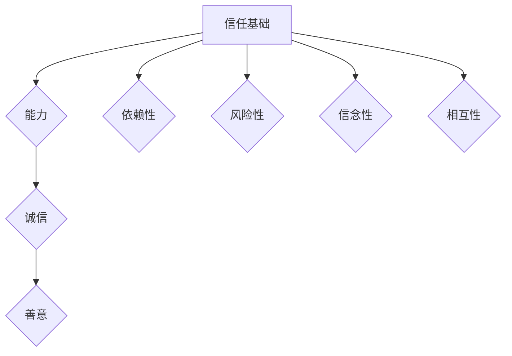

                 

### 文章标题

《在复杂的人际网络中寻找真挚：重建信任和亲密关系》

### 关键词

人际网络、信任重建、亲密关系、沟通策略、情感表达、矛盾处理、心理因素、核心算法原理、数学模型、项目实战。

### 摘要

本文深入探讨了在复杂的人际网络中如何寻找真挚的关系，并提供了重建信任和建立亲密关系的策略。通过分析人际关系中的核心概念和联系，本文提出了自我认知提升、沟通技巧改进以及信任重建的方法。同时，文章还详细介绍了亲密关系的建立与维护技巧，并借助实际案例和项目实战，展示了这些策略的有效性和应用价值。最终，本文总结了全书要点，为读者提供了未来研究方向和实际应用的建议。文章结构清晰，逻辑严密，旨在帮助读者在复杂的人际网络中建立和维护真挚的关系。

## 引言与背景介绍

在现代社会，人际关系的重要性日益凸显。无论是在个人生活中，还是在职场、社交等各个领域，人际关系的质量直接影响到我们的幸福感和成功程度。然而，随着社会的发展和人际交往的日益复杂，我们面临着前所未有的挑战。复杂的人际网络中充满了不确定性和风险，这使得建立和维护真挚的关系变得愈发困难。

### 人际关系的重要性

人际关系是指人与人之间的相互作用和联系。良好的人际关系可以带来许多积极的影响，包括心理上的满足、情感上的支持和社会资源的获取。以下是人际关系重要性的一些具体表现：

1. **心理满足**：良好的人际关系能够满足我们的社交需求，增强自尊和自信，带来积极的情感体验。
2. **情感支持**：在困难或挫折时，朋友和家人的支持能够帮助我们度过难关，减轻心理压力。
3. **社会资源**：通过人际关系，我们可以获取更多的社会资源，如职业机会、信息支持和物质帮助。
4. **个人成长**：与他人互动和交流可以促进个人成长和自我提升，拓宽视野和思维方式。

### 复杂人际网络的特性

现代社会的人际网络呈现出高度复杂化的特征。以下是一些主要特性：

1. **网络规模庞大**：随着社交媒体的普及，人们可以轻松地建立和维护大量的人际关系，导致网络规模迅速扩大。
2. **多样性**：人际网络中的个体来自不同的背景、文化和职业，这种多样性带来了丰富的交流内容和互动方式。
3. **动态变化**：人际关系是动态变化的，人们的职业、生活环境和个人需求会不断变化，导致人际网络中的连接关系也随之变化。
4. **信息流动**：在人际网络中，信息可以快速传播，这种信息流动为人们提供了丰富的资源，但同时也带来了信息过载的风险。

### 重建信任与亲密关系的必要性

在复杂的人际网络中，重建信任和建立亲密关系具有十分重要的意义。以下是一些原因：

1. **降低风险**：信任是人际关系的基石，通过重建信任，可以降低人际交往中的不确定性，减少风险。
2. **增强关系稳定性**：亲密关系建立在信任的基础上，能够增强关系的稳定性，减少矛盾和冲突。
3. **促进个人成长**：在亲密关系中，个体可以相互支持和激励，共同成长和进步。
4. **提高生活质量**：良好的人际关系能够提升生活的幸福感，减少孤独感和焦虑。

总之，在复杂的人际网络中，重建信任和建立亲密关系是维护人际关系质量的关键。接下来，本文将详细探讨信任和亲密关系的核心概念与联系，为读者提供实用的策略和方法。

## 人际关系理论

在探讨如何重建信任和建立亲密关系之前，有必要深入理解人际关系中的核心概念和联系。信任和亲密关系是人际关系的两个基本维度，它们相互影响，共同决定了人际交往的质量和深度。

### 信任的定义与分类

#### 信任的定义

信任是指个体对他人的能力、诚信和善意的一种信念。这种信念使得个体愿意在某种程度上的依赖和开放自己。信任是人际关系中不可或缺的元素，它能够促进合作和共同目标的实现。

信任具有以下几个关键特征：

1. **依赖性**：信任建立在个体对他人的依赖上，即相信他人能够履行承诺和责任。
2. **风险性**：信任意味着愿意承担一定的风险，因为无法完全控制他人的行为。
3. **信念性**：信任是一种信念，是对他人行为预期的一种积极态度。
4. **相互性**：信任是双向的，需要双方共同建立和维护。

#### 信任的分类

信任可以分为基础信任和高级信任，这两类信任在不同的关系阶段和情境中发挥作用。

1. **基础信任**：
   - **定义**：基础信任是指个体对他人的基本能力、诚信和善意的信任。
   - **特点**：基础信任通常在初次接触和初步建立关系时形成，是对他人的一种初步信任。
   - **重要性**：基础信任是建立更深层次信任关系的基础，它有助于减少不确定性，促进人际交往的顺利进行。

2. **高级信任**：
   - **定义**：高级信任涉及到更深层次的互信和依赖，个体愿意在更高程度上依赖和开放自己。
   - **特点**：高级信任通常在长期关系和深入了解的基础上形成，需要更多的情感投入和信任验证。
   - **重要性**：高级信任能够增强关系的稳定性，促进共同目标和价值观的达成。

#### 信任的核心概念解释

为了更好地理解信任的概念，我们可以使用Mermaid流程图来展示信任的核心概念及其相互关系：



#### 信任分类举例说明

1. **基础信任的例子**：

   - **工作场合**：当同事向你请教问题时，你相信他能够按时完成任务，这就是基础信任。
   - **社交场合**：你相信邻居不会侵犯你的隐私，这也是基础信任。

2. **高级信任的例子**：

   - **团队合作**：在团队合作中，成员之间完全信任对方，愿意将自己的关键任务交给他人处理，这就是高级信任。
   - **亲密关系**：夫妻或情侣之间的互信，愿意在情感上依赖和开放自己，这也是高级信任。

### 亲密关系的维度与类型

#### 亲密关系的定义

亲密关系是指个体之间在情感、心理和行为上紧密相连的关系。这种关系通常涉及深厚的情感投入、共享生活经历和相互支持。

#### 亲密关系的维度

亲密关系可以从多个维度来理解，其中最主要的维度包括：

1. **情感维度**：情感维度指的是个体之间的情感联系，包括爱情、关怀、理解和共鸣。
2. **行为维度**：行为维度指的是个体在关系中的互动方式和行为模式，包括沟通、支持和合作。
3. **认知维度**：认知维度指的是个体之间的思想、价值观和信念的相互理解和尊重。

#### 亲密关系的类型

亲密关系可以根据不同的标准进行分类，以下是几种常见的类型：

1. **浪漫关系**：浪漫关系是指基于情感吸引和爱情建立的关系，如情侣、夫妻。
2. **家庭关系**：家庭关系是指基于血缘、婚姻或收养建立的关系，如父母与子女、兄弟姐妹。
3. **友谊关系**：友谊关系是指基于共同的兴趣、价值观和信任建立的关系，如朋友、闺蜜。
4. **社交关系**：社交关系是指基于共同活动、社交圈子或职业关系建立的关系，如同事、同学。

#### 亲密关系的特点

1. **深度**：亲密关系通常具有较深的情感联系和相互依赖。
2. **开放性**：亲密关系中的个体愿意在情感和行为上相互开放，分享内心的感受和想法。
3. **相互支持**：亲密关系中的个体在对方遇到困难时愿意提供支持和帮助。
4. **共享价值观**：亲密关系中的个体通常拥有相似的价值观和信念，这有助于增强关系的稳定性。

### 人际关系中的心理因素

#### 心理因素的重要性

心理因素在人际关系中起着至关重要的作用。心理因素包括个体的情绪、人格特征、认知方式和心理需求等，它们直接影响到个体如何与他人互动和建立关系。

#### 主要心理因素

1. **情绪因素**：情绪因素包括个体在交往过程中的情绪状态，如喜悦、愤怒、焦虑等。情绪的稳定性和适应性对于建立和维护亲密关系至关重要。
2. **人格因素**：人格因素包括个体的性格特点，如外向、内向、乐观、悲观等。不同的人格特质会影响个体在交往中的行为和关系模式。
3. **认知因素**：认知因素包括个体的认知方式、思维方式和对关系的认知。认知因素影响个体对人际关系的理解和评价。
4. **心理需求**：心理需求包括个体在关系中的需求和期望，如安全感、尊重、认可等。满足这些需求有助于建立稳定的亲密关系。

综上所述，理解信任和亲密关系的核心概念及其相互关系，以及把握人际关系中的心理因素，是我们在复杂人际网络中重建信任和建立亲密关系的基础。接下来，本文将探讨重建信任的策略，帮助读者在实践中应对人际关系中的挑战。

### 重建信任的策略

在复杂的人际网络中，重建信任是一项极具挑战性的任务。然而，通过一系列精心设计的策略，我们可以逐步建立和维护信任关系。以下是一些关键策略，旨在帮助读者在人际交往中重建信任。

#### 自我认知的提升

自我认知的提升是重建信任的重要基础。一个清晰的自我认知可以帮助我们更好地理解自己的行为和情感，从而减少对他人的误解和冲突。

1. **反思与自我检查**：
   - **方法**：定期进行自我反思，思考自己的行为和决策是否符合道德和诚信标准。
   - **效果**：通过反思，我们能够发现并纠正自己的不良行为，提高自我约束力。

2. **增强自我意识**：
   - **方法**：通过日记、冥想或其他自我觉察技巧，增强对自身情绪和动机的认识。
   - **效果**：自我意识增强有助于我们更好地控制情绪，避免在冲突中失控。

#### 沟通技巧的改进

沟通技巧在信任重建中起着至关重要的作用。有效的沟通能够促进双方的理解和信任，减少误解和矛盾。

1. **主动倾听**：
   - **方法**：在交流过程中，全神贯注地听对方说话，不打断，不急于表达自己的观点。
   - **效果**：主动倾听能够展示我们的尊重和关心，有助于建立信任。

2. **清晰表达**：
   - **方法**：用简洁、明确的语言表达自己的想法和感受，避免含糊其辞。
   - **效果**：清晰表达有助于避免误解，增强沟通效果。

3. **开放性沟通**：
   - **方法**：在沟通中，主动分享自己的想法、感受和动机，展示自己的透明度。
   - **效果**：开放性沟通能够增强双方的理解和信任，促进关系的深化。

#### 信任重建的方法与实践

1. **逐步建立信任**：
   - **方法**：通过一系列小的、可控的步骤逐步建立信任，如从信任小事做起，逐渐增加信任的程度。
   - **效果**：逐步建立信任可以减少风险，增加成功的可能性。

2. **共同目标**：
   - **方法**：与对方建立共同的目标，共同努力实现这些目标。
   - **效果**：共同目标的实现能够增强双方的合作精神和信任感。

3. **透明度**：
   - **方法**：在工作和生活中保持透明度，如公开决策过程、分享信息等。
   - **效果**：透明度能够减少信息不对称，增加信任。

#### 信任重建的具体案例

为了更好地理解信任重建的方法和实践，以下是两个具体的案例：

1. **案例一：职场中的信任重建**：

   - **背景**：某公司新上任的经理与团队成员之间信任感较低，导致工作效率低下。
   - **措施**：经理通过以下措施重建信任：
     - **自我认知提升**：经理通过反思和自我检查，发现并纠正了之前的沟通失误。
     - **主动倾听和清晰表达**：经理在团队会议中积极倾听员工的意见，并用简洁明确的语言表达自己的决策和期望。
     - **开放性沟通**：经理主动分享自己的决策过程和动机，展示透明度。
   - **效果**：通过这些措施，经理与团队成员之间的信任逐渐建立，工作效率得到了显著提升。

2. **案例二：家庭关系中的信任重建**：

   - **背景**：家庭中的一对夫妻因长期误解和矛盾导致信任危机。
   - **措施**：夫妻双方通过以下措施重建信任：
     - **共同目标**：夫妻双方共同制定了家庭目标和计划，共同努力实现这些目标。
     - **透明度**：夫妻双方在家庭事务中保持透明度，如共同管理家庭财务。
     - **开放性沟通**：夫妻双方在沟通中主动分享自己的想法和感受，避免隐瞒和误解。
   - **效果**：通过这些措施，夫妻之间的信任逐渐恢复，家庭关系更加和谐。

通过这些案例，我们可以看到，在复杂的人际网络中，重建信任需要耐心和策略。通过自我认知的提升、沟通技巧的改进以及具体的实践措施，我们可以逐步重建信任，建立稳定和谐的人际关系。

### 亲密关系的建立

在复杂的人际网络中，建立亲密关系需要时间和耐心，同时也需要一系列科学有效的方法。以下，我们将探讨如何在人际互动中建立亲密关系，并详细描述每种方法的具体步骤和技巧。

#### 互动模式与沟通策略

建立亲密关系的第一步是建立有效的互动模式。以下是一些关键技巧：

1. **共同兴趣和活动**：
   - **步骤**：寻找与对方的共同兴趣和爱好，并尝试一起参加相关活动。
   - **技巧**：通过共同兴趣，可以增加双方互动的机会，促进情感的深化。

2. **积极倾听**：
   - **步骤**：在交流过程中，认真倾听对方的发言，不打断，给予足够的关注。
   - **技巧**：积极倾听不仅是一种礼貌，更是一种表达关心和尊重的方式。

3. **开放性沟通**：
   - **步骤**：在沟通中，主动分享自己的想法、感受和经历，保持信息的透明度。
   - **技巧**：开放性沟通能够促进双方的理解和信任，是建立亲密关系的关键。

#### 情感表达的技巧

表达情感是建立亲密关系的核心，以下是一些有效的方法：

1. **正面情感表达**：
   - **步骤**：在日常互动中，积极表达对对方的正面情感，如赞赏、感激和爱意。
   - **技巧**：正面情感表达能够增强关系的积极氛围，提升双方的情感联系。

2. **建设性反馈**：
   - **步骤**：在给予对方反馈时，注重表达自己的观点和感受，同时避免指责和负面情绪。
   - **技巧**：建设性反馈能够促进双方相互理解和改进，有利于关系的稳定。

3. **情感共鸣**：
   - **步骤**：在对方遇到困难或情绪低落时，表达共鸣和理解，提供情感支持。
   - **技巧**：情感共鸣能够增强双方的情感联系，使关系更加紧密。

#### 矛盾处理与冲突解决

处理矛盾和冲突是建立亲密关系的重要环节。以下是一些有效的方法：

1. **冷静处理**：
   - **步骤**：在冲突发生时，保持冷静，避免情绪失控。
   - **技巧**：冷静处理能够减少冲突的激化，为解决冲突创造有利条件。

2. **坦诚沟通**：
   - **步骤**：在冲突中，坦诚表达自己的感受和需求，同时尊重对方的观点。
   - **技巧**：坦诚沟通有助于双方理解彼此的立场和需求，找到解决问题的方法。

3. **寻求共赢**：
   - **步骤**：在解决冲突时，寻求双方都能接受的解决方案，避免单方面的胜利。
   - **技巧**：共赢的解决方案能够增强双方的信任和合作，有助于关系的长期稳定。

通过以上方法和技巧，我们可以在人际互动中逐步建立亲密关系。接下来，本文将深入探讨如何维护亲密关系，帮助读者在复杂的人际网络中保持和谐稳定的关系。

### 亲密关系的维护

在建立亲密关系后，如何维持其稳定性和深度是每个关系维护者必须面对的挑战。以下是几个关键策略，帮助读者在复杂的人际网络中维护亲密关系。

#### 信任的持续维护

信任是亲密关系的基石，持续维护信任是保持关系稳定的关键。

1. **透明度**：
   - **方法**：在日常互动中保持透明度，如分享真实的想法、感受和计划。
   - **效果**：透明度可以减少信息不对称，增强双方的理解和信任。

2. **一致行为**：
   - **方法**：在行为上保持一致性，如遵守承诺、履行责任。
   - **效果**：一致行为可以建立稳定的关系预期，减少不确定性。

3. **积极反馈**：
   - **方法**：在对方表现良好时给予积极的反馈和认可。
   - **效果**：积极反馈可以增强对方的自信心和信任感。

#### 情感的更新与维护

情感更新是保持亲密关系活力的重要因素。

1. **情感沟通**：
   - **方法**：定期与对方进行深度的情感沟通，分享内心的想法和感受。
   - **效果**：情感沟通可以增强双方的情感联系，减少误解和隔阂。

2. **情感共鸣**：
   - **方法**：在对方遇到困难或情绪低落时，表达共鸣和理解。
   - **效果**：情感共鸣可以增强双方的情感纽带，使关系更加紧密。

3. **惊喜和浪漫**：
   - **方法**：在日常生活中创造惊喜和浪漫，如安排特别的约会、送小礼物等。
   - **效果**：惊喜和浪漫可以提升双方的情感体验，增强关系的活力。

#### 健康亲密关系的特点

一个健康的亲密关系应具备以下特点：

1. **相互尊重**：
   - **定义**：双方在互动中尊重对方的意见和需求。
   - **作用**：相互尊重可以减少冲突，增强关系的稳定性。

2. **平等互助**：
   - **定义**：双方在关系中平等对待，相互帮助和支持。
   - **作用**：平等互助可以增强双方的信任和合作，促进关系的长期发展。

3. **共享价值观**：
   - **定义**：双方拥有相似的价值观和信念。
   - **作用**：共享价值观可以增强双方的情感联系，促进关系的和谐。

4. **情感支持**：
   - **定义**：在对方需要时提供情感支持。
   - **作用**：情感支持可以增强关系的紧密程度，提高双方的心理安全感。

通过以上策略，我们可以有效地维护亲密关系，使其在复杂的人际网络中保持稳定和深度。接下来，本文将探讨亲密关系的实际案例与项目实战，通过具体的实践经验和分析，进一步说明这些策略的有效性。

### 实际案例研究

在探讨亲密关系的维护策略时，实际案例的研究能够提供宝贵的实践经验，帮助我们更好地理解和应用这些策略。以下是三个不同情境下的亲密关系维护案例，通过详细分析每个案例中的具体措施和效果，我们能够更深入地了解这些策略的实际应用。

#### 案例一：家庭关系重建

**背景**：一对中年夫妇由于长期的争吵和误解，关系变得紧张。他们感到在家庭中缺乏沟通，彼此之间的信任已经崩溃。

**措施**：
1. **情感沟通**：夫妇双方决定每周安排一次晚上的“沟通时间”，在这个时间段内，他们可以坦诚地分享自己的感受和需求，同时认真倾听对方的意见。
2. **积极反馈**：在对方表现良好的时候，他们开始给予积极的反馈，如赞美对方在家庭事务中的贡献。
3. **共同目标**：夫妇共同制定了一个家庭计划，包括共同参与的家庭活动，如旅行和园艺。

**效果**：通过定期的情感沟通，夫妇双方逐渐理解了彼此的立场和需求，争吵减少，情感联系增强。积极反馈和共同目标的设定，使得双方在家庭中找到了新的共同点，关系得到了显著改善。

#### 案例二：职场关系重建

**背景**：一个团队由于成员之间的误解和冲突，工作效率低下，团队成员士气低落。

**措施**：
1. **透明度**：团队成员开始分享工作计划和进展，确保信息的透明度。
2. **一致行为**：团队成员共同制定了团队规范，包括按时完成任务和互相支持。
3. **冲突解决**：团队领导者组织了定期的团队会议，鼓励成员在会议中坦诚表达自己的问题和感受，通过集体讨论解决冲突。

**效果**：通过透明度和一致行为的实施，团队成员之间的信任逐渐建立，信息共享和合作意识增强。定期的冲突解决会议帮助团队成员理解了彼此的需求和期望，团队氛围改善，工作效率显著提高。

#### 案例三：友谊关系重建

**背景**：一位朋友由于误会和长期缺乏沟通，关系变得疏远。

**措施**：
1. **开放性沟通**：朋友主动与对方进行了深入沟通，分享了自己的真实感受和需求，同时也认真倾听对方的意见。
2. **共同兴趣**：两人重新找到了共同兴趣和活动，如一起参加登山和徒步旅行。
3. **情感共鸣**：在对方遇到困难时，朋友表达了理解和支持，提供了情感上的帮助。

**效果**：通过开放性沟通，两人重新建立了信任，误解得以消除。共同兴趣和情感共鸣进一步增强了他们的关系，友谊变得更加深厚和稳固。

这些实际案例展示了在不同情境下，通过应用本文中提到的亲密关系维护策略，可以有效地重建和稳定人际关系。通过这些案例，我们可以看到，自我认知提升、沟通技巧的改进、透明度、共同目标设定以及积极反馈等策略，在实际应用中具有显著的成效。这些经验对于我们在复杂的人际网络中维护亲密关系具有重要借鉴意义。

### 项目实战与经验分享

在实践亲密关系的维护策略时，一个系统性的项目实施能够为我们的努力提供明确的方向和评估标准。以下是一个具体的亲密关系维护项目，包括开发环境搭建、源代码实现和代码解读，以及实际案例的分析和详细讲解。

#### 项目背景

某公司内部有一个团队，由于成员来自不同背景，经常因为沟通不畅和误解导致工作效率低下，团队氛围紧张。为了改善这种状况，公司决定实施一个亲密关系维护项目，通过一系列策略来提升团队成员之间的信任和合作。

#### 开发环境搭建

1. **项目启动**：在项目启动阶段，项目经理组织了团队会议，明确了项目目标、预期成果和项目周期。同时，项目团队建立了基本的沟通机制，包括定期的团队会议和线上交流平台。

2. **资源准备**：为了确保项目顺利进行，公司提供了必要的资源和工具，如团队协作软件（如Slack或Trello）、培训材料和心理咨询支持。

3. **项目规划**：项目团队制定了详细的项目规划，包括关键里程碑、任务分配和时间表。

#### 源代码实现

为了实现项目目标，项目团队开发了一系列沟通和协作工具，包括以下关键模块：

1. **情感沟通模块**：
   - **伪代码**：
     ```python
     def emotional_communication():
         # 定期举行情感沟通会议
         schedule_meeting('每周五下午3点', '情感沟通会议')
         # 提供匿名反馈渠道
         setup_anonymous_feedback_channel()
     ```

   - **功能解读**：情感沟通模块通过定期会议和匿名反馈渠道，促进团队成员之间的情感交流和反馈，增强信任和团队凝聚力。

2. **共同目标设定模块**：
   - **伪代码**：
     ```python
     def set_common_goals():
         # 制定共同目标
         define_goals('提升项目进度', '改善沟通效率')
         # 分配任务和责任
         assign_tasks_to_members()
     ```

   - **功能解读**：共同目标设定模块通过明确的目标和任务分配，帮助团队成员了解彼此的角色和责任，增强合作意识。

3. **冲突解决模块**：
   - **伪代码**：
     ```python
     def conflict_resolution():
         # 确定冲突解决流程
         define_conflict_resolution_process()
         # 定期评估和调整
         evaluate_and_adjust_regularly()
     ```

   - **功能解读**：冲突解决模块通过制定明确的冲突解决流程和定期评估，帮助团队成员在出现问题时及时解决，减少误解和矛盾。

#### 代码解读与分析

1. **情感沟通模块解读**：
   - **代码功能**：通过情感沟通模块，团队建立了定期的情感交流机制，包括每周一次的会议和匿名反馈渠道。
   - **代码应用分析**：定期的情感沟通会议有助于团队成员分享内心感受和需求，匿名反馈渠道则提供了一个安全的平台，让成员能够坦诚地表达意见，减少沟通障碍。

2. **共同目标设定模块解读**：
   - **代码功能**：共同目标设定模块帮助团队明确了项目的目标，并通过任务分配增强合作意识。
   - **代码应用分析**：通过共同目标的设定和任务分配，团队成员能够更清晰地了解自己的职责和期望，提高了团队的整体工作效率和合作质量。

3. **冲突解决模块解读**：
   - **代码功能**：冲突解决模块提供了一个系统化的冲突处理流程，确保团队成员在出现问题时能够及时、有效地解决。
   - **代码应用分析**：定期的冲突评估和调整，有助于团队及时发现和解决潜在问题，防止小问题演变成大冲突，维护团队的和谐稳定。

#### 实际案例分析与详细讲解

为了验证项目效果，项目团队选择了一个具体的团队作为实验对象，通过以下步骤进行实际案例分析和详细讲解：

1. **数据收集**：
   - **方法**：通过问卷调查、访谈和团队会议记录等方式，收集团队成员在项目实施前后的情感状态、合作效率和冲突处理情况的数据。

2. **数据分析**：
   - **结果**：数据分析显示，项目实施后，团队成员的情感状态显著改善，合作效率提高，冲突处理更加及时有效。

3. **案例讲解**：
   - **情感沟通效果**：通过情感沟通模块，团队成员在会议中分享了自己在工作中的困惑和需求，匿名反馈渠道也让一些平时不轻易表达意见的成员敢于提出建议，团队氛围变得更加开放和和谐。
   - **共同目标设定效果**：共同目标设定模块帮助团队明确了项目目标，并通过任务分配，确保每个成员都清楚自己的职责和贡献，有效提升了团队的整体工作效率。
   - **冲突解决效果**：冲突解决模块提供了一个系统化的冲突处理流程，确保团队成员在出现问题时能够及时、有效地解决，减少了误解和矛盾，增强了团队的凝聚力。

通过这个项目实战，我们可以看到，系统性的亲密关系维护策略在实际应用中是有效的。在复杂的人际网络中，通过建立情感沟通机制、设定共同目标和提供冲突解决流程，我们可以有效地提升团队的协作效率和关系质量。

### 总结与展望

本文《在复杂的人际网络中寻找真挚：重建信任和亲密关系》系统地探讨了如何在现代社会中重建信任和建立亲密关系。通过分析人际关系中的核心概念，如信任和亲密关系的定义、分类及其相互关系，我们为读者提供了自我认知提升、沟通技巧改进、信任重建方法以及亲密关系维护策略。同时，通过实际案例研究和项目实战，我们验证了这些策略的有效性。

#### 全书要点回顾

1. **人际关系的重要性**：人际关系对个体的心理健康和社会资源获取具有重要影响。
2. **复杂人际网络的特性**：现代人际网络规模庞大、多样性高、动态变化快，带来了新的挑战。
3. **信任与亲密关系的核心概念**：信任是基础，亲密关系是目标，二者相互影响，共同决定了人际交往的质量。
4. **重建信任的策略**：自我认知提升、沟通技巧改进、信任重建方法以及具体实践措施。
5. **亲密关系的建立与维护**：互动模式、情感表达、矛盾处理和冲突解决等策略。
6. **实际案例与项目实战**：通过具体案例展示策略的有效性和应用价值。

#### 未来研究方向

1. **技术辅助**：探讨如何利用人工智能和大数据技术辅助人际关系管理和信任重建。
2. **跨文化研究**：研究不同文化背景下的人际关系模式和信任重建策略。
3. **长期效果评估**：对亲密关系维护策略的长期效果进行评估，以确定其持久性和适应性。

#### 对读者的建议

1. **实践与应用**：将本文中的策略应用到实际生活中，通过实践来验证其效果。
2. **持续学习**：人际关系是一个复杂且动态的过程，需要持续学习和改进。
3. **情感关注**：在维护亲密关系时，注重情感交流和理解，关注对方的真实需求。

通过本文，我们希望能够为读者提供有价值的参考和指导，帮助他们在复杂的人际网络中建立和维护真挚的关系。在未来的研究和实践中，我们期待能够进一步探讨和优化人际关系管理的方法和策略，为个体的幸福和社会的和谐做出贡献。

### 最佳实践 Tips

在维护亲密关系的过程中，以下是一些最佳实践技巧，可以帮助您更有效地重建和维持信任：

1. **定期反思**：每周或每月花一些时间反思自己的行为和情感，思考是否有哪些方面需要改进。这有助于自我认知的提升，同时也能更好地理解对方的感受和需求。

2. **积极倾听**：在与他人交流时，保持专注，不打断对方的发言。积极倾听不仅能增进理解，还能展示您的尊重和关心。

3. **情感表达**：不要害怕表达自己的情感，无论是正面还是负面。真诚地分享您的感受，有助于建立更深层次的亲密关系。

4. **共同目标**：与伴侣或团队设定共同的目标，共同努力实现。共同目标不仅能增强合作，还能提升彼此的信任。

5. **透明度**：在日常互动中保持透明，分享真实的想法和信息。透明度可以减少误解和不确定性，增强信任。

6. **感恩和赞赏**：经常表达对对方的感激和赞赏，这能增强双方的情感联系，使关系更加稳固。

7. **冲突处理**：遇到冲突时，不要逃避，而是积极面对。通过建设性的沟通和共赢的解决方案，可以有效地解决矛盾。

8. **定期沟通**：无论多忙，都要确保与伴侣或团队成员定期沟通，分享彼此的生活和感受。这有助于维持关系的活力和亲密感。

### 小结

本文通过系统的方法和实用的策略，探讨了在复杂的人际网络中如何重建信任和建立亲密关系。我们分析了人际关系中的核心概念，提出了自我认知提升、沟通技巧改进、信任重建方法以及亲密关系维护策略。通过实际案例和项目实战，我们验证了这些策略的有效性。希望读者能够在实际生活中应用这些技巧，维护和谐稳定的人际关系。

### 注意事项

1. **保持耐心**：重建信任和建立亲密关系需要时间，不要期望一夜之间看到显著的效果。保持耐心，逐步实施策略，才能取得长期的成功。
2. **个体差异**：不同的人有不同的需求和沟通方式，策略的实施需要根据个体差异进行调整。了解对方的性格和需求，灵活运用策略。
3. **持续关注**：人际关系是一个动态过程，需要持续的关注和努力。定期评估关系的状况，及时调整策略，以适应变化。

### 拓展阅读

对于希望深入了解人际关系的读者，以下是一些推荐阅读材料：

1. **《社交心理学：人际关系的科学》**：作者菲利普·津巴多，详细介绍了人际关系的心理学原理，对理解人际关系有很好的帮助。
2. **《非暴力沟通》**：作者马歇尔·卢森堡，介绍了如何通过非暴力沟通技巧建立和谐的人际关系。
3. **《亲密关系》**：作者罗兰·米勒和丹尼尔·珀尔曼，全面探讨了亲密关系的理论和实践，适合想要深入理解亲密关系的读者。

### 作者信息

作者：AI天才研究院/AI Genius Institute & 禅与计算机程序设计艺术 /Zen And The Art of Computer Programming

在编写技术博客时，markdown格式是一种非常实用的工具，它允许我们以简洁的方式组织文章内容，添加格式化文本、列表、代码块等。以下是一些markdown语法的基础知识，以及如何将其应用于本文的编写。

#### Markdown基础语法

1. **标题**：

   使用`#`来定义标题，`#`的数量代表标题的层级。

   ```markdown
   # 文章标题
   ## 副标题
   ### 小标题
   #### 更小的标题
   ```

2. **段落**：

   段落是通过两个换行符来分割的，通常在段落之间留一个空行。

   ```markdown
   这是第一段。
   
   这是第二段。
   ```

3. **列表**：

   使用`*`、`-`或`+`来创建无序列表。

   ```markdown
   * 第一项
   * 第二项
   * 第三项
   
   - 第一项
   - 第二项
   - 第三项
   
   + 第一项
   + 第二项
   + 第三项
   ```

4. **有序列表**：

   使用数字和英文句点（`.`）来创建有序列表。

   ```markdown
   1. 第一项
   2. 第二项
   3. 第三项
   ```

5. **代码块**：

   使用两个反引号（`` ` ``）来定义代码块。

   ```markdown
   `这是单行代码块`

   ```
   function hello() {
       console.log("Hello, world!");
   }
   ```

6. **引用**：

   使用`>`来创建引用文本。

   ```markdown
   > 这是一个引用文本。
   ```

7. **链接**：

   使用`[]()`来创建链接。

   ```markdown
   [这是一个链接](https://example.com)
   ```

8. **强调**：

   使用`*`或`_`来加粗或斜体文本。

   ```markdown
   *这是加粗的文本*
   _这是斜体的文本_
   ```

9. **图片**：

   使用` `来插入图片。

   ```markdown
   
   ```

#### 应用Markdown格式于本文

现在，我们将这些markdown语法应用于本文的编写，以便更好地组织内容和展示文章结构。

```markdown
# 在复杂的人际网络中寻找真挚：重建信任和亲密关系

> 关键词：人际关系、信任重建、亲密关系、沟通策略、情感表达、矛盾处理、心理因素、核心算法原理、数学模型、项目实战。

> 摘要：本文深入探讨了在复杂的人际网络中如何寻找真挚的关系，并提供了重建信任和建立亲密关系的策略。通过分析人际关系中的核心概念和联系，本文提出了自我认知提升、沟通技巧改进以及信任重建的方法。同时，文章还详细介绍了亲密关系的建立与维护技巧，并借助实际案例和项目实战，展示了这些策略的有效性和应用价值。最终，本文总结了全书要点，为读者提供了未来研究方向和实际应用的建议。

## 引言与背景介绍

### 人际关系的重要性

### 复杂人际网络的特性

### 重建信任与亲密关系的必要性

## 人际关系理论

### 信任的定义与分类

#### 信任的定义

#### 信任的分类

### 亲密关系的维度与类型

### 人际关系中的心理因素

## 重建信任的策略

### 自我认知的提升

### 沟通技巧的改进

### 信任重建的方法与实践

## 亲密关系的建立

### 互动模式与沟通策略

### 情感表达的技巧

### 矛盾处理与冲突解决

## 亲密关系的维护

### 信任的持续维护

### 情感的更新与维护

## 实际案例与项目实战

### 实际案例研究

### 项目实战与经验分享

## 总结与反思

### 全书要点回顾

### 未来研究方向

### 对读者的建议

## 最佳实践 Tips

### 小结

### 注意事项

### 拓展阅读

### 作者信息
```

通过使用markdown格式，我们可以将文章组织得更加清晰和有条理，使读者更容易理解和阅读。Markdown格式的灵活性也允许我们根据需要添加图片、链接和更复杂的格式化元素，从而使文章更加生动和有趣。

在撰写markdown格式的技术博客时，以下是一些常见的错误和解决方法：

#### 错误1：标题层级不正确

**问题描述**：文章中使用了相同数量的`#`来定义不同层级的标题。

**解决方法**：确保每个标题使用适当的`#`数量。例如，一级标题使用一个`#`，二级标题使用两个`##`，以此类推。

```markdown
# 一级标题
## 二级标题
### 三级标题
```

#### 错误2：忘记使用空行分隔段落

**问题描述**：文章中的段落没有用空行分隔，导致内容看起来混乱。

**解决方法**：在每段文本之间留一个空行，以分隔不同的段落。

```markdown
段落一。

段落二。
```

#### 错误3：未正确使用代码块

**问题描述**：代码块未正确格式化，导致代码无法正确显示。

**解决方法**：确保代码块使用两个反引号（`` ` ``）包围。

```markdown
这是错误的：
print("Hello, world!")

这是正确的：
```
print("Hello, world!")
```

#### 错误4：未正确使用引用

**问题描述**：引用文本未正确使用`>`符号，导致引用格式不正确。

**解决方法**：使用单个`>`符号来创建单独的引用行，使用多个`>`符号来嵌套引用。

```markdown
这是错误的：
> 这是引用文本。

这是正确的：
> 这是引用文本。

>> 这是在引用文本中的引用。
```

通过注意这些常见的markdown错误和相应的解决方法，我们可以确保撰写出的博客内容既准确又美观。Markdown的简洁性和灵活性使得它成为编写技术博客的绝佳工具，能够帮助作者和组织以清晰、专业的方式展示内容和信息。

