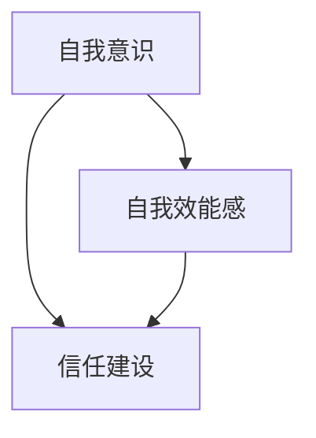
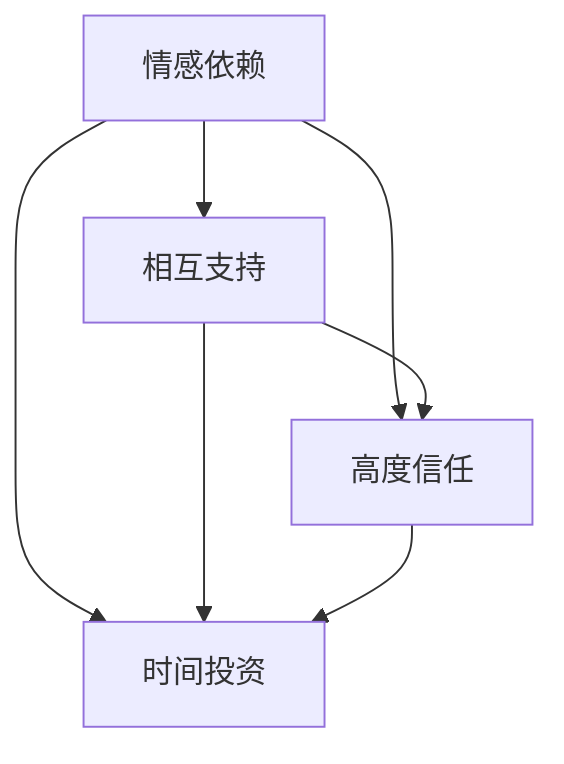

                 

### 文章标题

《在复杂的人际网络中寻找真挚：重建信任和亲密关系》

### 文章关键词

人际关系、信任建设、亲密关系、社交心理学、自我认知、情感交流、冲突管理、企业文化、社会应用

### 文章摘要

在现代社会，人际网络的复杂性使得寻找真挚的信任和建立亲密关系变得尤为重要。本文旨在探讨如何在复杂的人际网络中重建信任和建立亲密关系，通过分析人际关系、社交心理学的核心概念，提供实用的策略和实践方法。文章分为四个部分，首先探讨人际关系的本质与信任的基石，接着介绍重建信任的策略与实践，然后讨论亲密关系的建立与维护，最后通过案例分析展示社会应用。希望本文能为您提供在人际网络中寻找真挚和重建信任的指南。

---

# 第一部分：人际关系的本质与信任的基石

## 1.1 人际关系的本质

人际关系是指个体在相互交往过程中形成的情感、认知和行为联系。在社交网络理论中，人际关系可以看作是一个由个体节点和关系边构成的网络，通过社交互动，这些节点和边不断演变和更新。以下是人际关系的核心概念与联系：

### 核心概念与联系

- **定义与分类**：人际关系分为家庭关系、友谊关系和职业关系等。每种关系都有其特定的特点和行为模式。
- **节点与边**：在社交网络中，每个个体是一个节点，而节点之间的关系可以用边来表示。这些边可以表示信任、友谊、敌对等多种关系。

### Mermaid 流程图


### 伪代码

```python
# 人际关系网络构建
def build_relationship_network():
    # 初始化节点和边
    nodes = []
    edges = []

    # 添加节点
    nodes.append("A")
    nodes.append("B")
    nodes.append("C")
    nodes.append("D")

    # 添加边
    edges.append(["A", "B"])
    edges.append(["A", "C"])
    edges.append(["B", "D"])
    edges.append(["C", "D"])

    # 返回网络
    return nodes, edges
```

## 信任的基石

信任是人际关系中不可或缺的元素，它不仅影响个体的行为决策，也影响整体社交网络的稳定性和效能。以下是信任的核心概念及其在人际关系中的作用：

### 核心概念

- **信任**：信任是指个体对他人可靠性和善意的期望。
- **重要性**：信任是建立和维护长期人际关系的基础，它减少了不确定性和风险，促进了合作的产生。

### 数学模型与公式

信任度可以通过以下公式量化：

$$
\text{TrustScore} = \frac{\text{GoodActions}}{\text{TotalActions}}
$$

### 举例说明

在一个团队中，成员A的信任度可以通过以下计算得出：

$$
\text{TrustScore}_{A} = \frac{15}{25} = 0.6
$$

其中，GoodActions表示成员A在团队中表现出的积极行为次数，TotalActions表示成员A在团队中的总行为次数。

---

在第一部分中，我们详细探讨了人际关系的本质和信任的基石。通过分析核心概念与联系，使用Mermaid流程图和伪代码，我们构建了人际关系的基本模型，并引入了信任度的量化方法。接下来，我们将深入讨论社交心理学与人际互动，提供更多实用的策略和实践方法。

---

# 第一部分：人际关系的本质与信任的基石

## 1.2 社交心理学与人际互动

社交心理学是研究个体如何在社交环境中进行思考、感受和行为的一门科学。了解社交心理学的原理，有助于我们更好地理解和处理人际关系中的各种情况。以下是社交心理学的核心概念及其在人际互动中的应用：

### 社交心理学原理

- **人际吸引**：个体对另一个人产生的情感上的好感或喜欢。影响因素包括外表、个性、相似性等。
- **认知失调**：个体在同时持有两个相互矛盾的观点或信念时产生的心理紧张状态。为了缓解这种紧张，个体会采取各种方式来调整自己的信念或行为。
- **自我呈现**：个体在社会交往中对自己形象的管理和展示，目的是影响他人对自己的看法和评价。

### 核心算法原理讲解

为了深入理解社交心理学原理，我们可以使用以下伪代码：

```python
# 人际吸引分析
def interpersonal_attract(personA, personB):
    similarity_score = calculate_similarity(personA, personB)
    attractiveness_score = similarity_score * 0.5 + calculate_physical_appearance_score(personB)
    return attractiveness_score

# 认知失调缓解
def cognitive_dysphoria_resolution(view1, view2):
    if view1 == view2:
        return "Consistency achieved"
    else:
        return "Adjust beliefs or behavior to reduce cognitive dissonance"

# 自我呈现策略
def self_presentation_strategy(desired_image, current_image):
    if desired_image == current_image:
        return "No change needed"
    else:
        return "Adjust behavior to project desired image"
```

### 举例说明

- **人际吸引**：两个同事由于工作相似性和共同的兴趣爱好，通过人际吸引建立了良好的合作关系。
- **认知失调**：一个人在参加社交活动时，发现自己原本认为会喜欢的食物实际上并不好吃，这时他会感到认知失调，可能会选择放弃或调整自己的看法。
- **自我呈现**：一个演讲者在公众场合中为了树立专业形象，可能会选择着装得体、语言得体，以展现自己的专业素养。

### 人际互动策略

- **有效沟通**：通过清晰、准确、尊重的方式表达自己的想法和感受，积极倾听对方的意见。
- **冲突解决**：在面对冲突时，采取冷静、理性的态度，寻找双赢的解决方案。
- **建立社交资本**：通过参与社交活动、建立人际网络，提升自己在社交环境中的影响力。

### 数学模型和数学公式

为了评估人际互动的效果，我们可以使用以下数学模型：

- **沟通效果评估**：

  $$
  \text{CommunicationEffectiveness} = \frac{\text{Understanding}}{\text{TotalMessages}} + \text{FeedbackScore}
  $$

  其中，Understanding表示对方对信息的理解程度，TotalMessages表示总信息量，FeedbackScore表示反馈的质量。

- **冲突解决效果评估**：

  $$
  \text{ConflictResolution} = \frac{\text{Agreement}}{\text{TotalDisagreements}} + \text{SatisfactionScore}
  $$

  其中，Agreement表示双方达成一致的程度，TotalDisagreements表示总分歧点，SatisfactionScore表示双方对解决过程的满意度。

通过社交心理学原理的理解和人际互动策略的运用，我们可以更有效地处理人际关系中的各种问题。在下一部分中，我们将进一步探讨重建信任的具体策略和实践方法。

---

在第一部分中，我们通过分析人际关系的本质和信任的基石，探讨了社交心理学的核心概念及其在人际互动中的应用。我们引入了Mermaid流程图和伪代码来阐述核心算法原理，并通过数学模型和公式来量化人际互动的效果。接下来，我们将深入探讨如何重建信任，提供实用的策略和实践方法。

---

# 第二部分：重建信任的策略与实践

## 2.1 自我认知与信任建设

### 自我认知的重要性

自我认知是指个体对自己内在特质、情感、需求和行为的认识和了解。自我认知对于建立信任至关重要，因为只有了解自己，个体才能更加真实地展现自己，从而赢得他人的信任。以下是自我认知在信任建设中的重要性：

#### 核心概念与联系

- **自我意识**：个体对自己的存在、情感和行为的觉察。
- **自我效能感**：个体对自己完成任务能力的信心。

#### Mermaid 流程图



#### 伪代码

```python
# 自我认知评估
def self_awareness_evaluation():
    self_awareness_score = get_self_awareness_score()
    self_efficacy_score = get_self_efficacy_score()
    return self_awareness_score, self_efficacy_score
```

#### 数学模型和公式

自我效能感可以通过以下公式量化：

$$
\text{SelfEfficacy} = \frac{\text{成功经验}}{\text{总经验}} + \text{激励因素}
$$

#### 举例说明

一个销售人员在经历多次失败后，通过总结经验、调整策略，最终取得了成功，他的自我效能感因此得到了提升。

### 信任建设方法

为了建立信任，个体需要采取一系列的策略，包括自我提升、诚信行动和透明沟通。以下是具体方法：

#### 自我提升

- **技能提升**：通过学习新技能、提升专业能力，增加自己在他人眼中的可信度。
- **自我反省**：定期进行自我反思，识别自己的不足，并努力改进。

#### 诚信行动

- **守时**：遵守承诺，按时完成任务。
- **诚信表达**：在交流和沟通中，坦诚地表达自己的观点和感受。

#### 透明沟通

- **信息共享**：与他人分享必要的信息，增强透明度。
- **开放性**：鼓励反馈和讨论，对问题进行开放性探讨。

通过自我认知的提升和诚信行动，个体可以在人际网络中建立起坚实的基础信任。接下来，我们将探讨如何修复和恢复受损的人际关系。

---

在第二部分中，我们深入探讨了自我认知与信任建设的重要性，介绍了自我认知的评估方法和信任建设的方法。通过自我提升、诚信行动和透明沟通，个体可以逐步建立起信任。在下一部分中，我们将讨论人际关系修复与信任恢复的策略和实践。

---

## 2.2 人际关系修复与信任恢复

### 人际关系修复的原则

当人际关系出现问题时，及时的修复和沟通是恢复信任的关键。以下是人际关系修复的基本原则和方法：

#### 核心概念与联系

- **包容**：接受对方的不同观点和感受，避免指责和批评。
- **道歉**：真诚地承认自己的错误，并向对方表示歉意。
- **主动解决问题**：积极寻找问题的根源，并提出解决方案。

#### 伪代码

```python
# 人际关系修复流程
def repair_relationship(principal, other_person):
    # 包容与理解
    principal.show_compassion(other_person)
    
    # 道歉与承认错误
    principal.apologize()
    
    # 主动解决问题
    solution = principal.find_solution()
    principal.present_solution(solution)
```

#### 人际关系修复策略

- **倾听**：认真倾听对方的意见和感受，给予充分的理解。
- **反馈**：及时给予对方反馈，表达自己的看法和感受。
- **共同制定计划**：与对方共同制定修复关系的具体计划，并互相监督执行。

### 信任恢复技巧

在修复人际关系后，信任的恢复同样重要。以下是几种有效的信任恢复技巧：

#### 核心算法原理讲解

- **建立信任的桥梁**：通过共同的目标、兴趣和价值观，建立信任的桥梁。
- **危机沟通**：在危机事件发生时，及时沟通、公开透明，避免信息误解和信任丧失。
- **长期维护信任**：通过持续的行动和表现，证明自己的可靠性和值得信赖。

#### 伪代码

```python
# 建立信任的桥梁
def build_trust_bridge(personA, personB):
    common_interests = find_common_interests(personA, personB)
    shared_goals = set_common_goals(personA, personB)
    return common_interests, shared_goals

# 危机沟通
def crisis_communication(personA, personB, event):
    personA.communicate_openly(event)
    personB.validate_informations(event)
```

#### 举例说明

- **包容与理解**：一个团队中的成员A与成员B发生了冲突，成员A首先听取了成员B的解释，并表达了自己的理解和包容。
- **道歉与承认错误**：成员A在冲突中承认了自己的错误，并向成员B道歉，表示愿意承担责任。
- **主动解决问题**：成员A与成员B共同分析了问题的原因，并提出了具体的解决方案。

通过人际关系修复与信任恢复的策略和实践，我们可以逐步恢复和重建信任。在下一部分中，我们将探讨亲密关系的建立与维护。

---

在第二部分中，我们详细讨论了自我认知与信任建设以及人际关系修复与信任恢复的策略和实践。通过自我提升、诚信行动、包容理解、道歉承认错误和主动解决问题，我们可以在复杂的人际网络中重建信任。接下来，我们将探讨亲密关系的建立与维护，进一步深入探讨如何在人际网络中寻找真挚。

---

# 第三部分：亲密关系的建立与维护

## 3.1 亲密关系的定义与特点

亲密关系是指个体在情感、心理和生理层面上的深入联结，通常具有高度的情感依赖和相互支持。亲密关系的建立和维护对于个体的心理健康和社会福祉具有重要意义。以下是亲密关系的定义与特点：

### 定义

亲密关系通常指的是家庭关系、恋爱关系和深层次的朋友关系。在这些关系中，个体之间有着强烈的情感联系和相互理解。

### 特点

1. **情感依赖**：个体在亲密关系中寻求情感上的满足和安全感，形成强烈的情感依赖。
2. **相互支持**：亲密关系中的个体愿意在对方遇到困难时提供支持和帮助。
3. **高度信任**：信任是亲密关系建立和维护的关键因素，个体在亲密关系中更愿意相信对方。
4. **时间投资**：建立和维护亲密关系需要投入大量的时间和精力，通过持续的互动和沟通来加深关系。

### Mermaid 流程图



### 数学模型和公式

为了量化亲密关系的满意度，我们可以使用以下数学模型：

$$
\text{IntimacySatisfaction} = \frac{\text{PositiveInteractions}}{\text{TotalInteractions}} + \text{SupportScore}
$$

其中，PositiveInteractions表示积极的互动次数，TotalInteractions表示总的互动次数，SupportScore表示相互支持的程度。

### 举例说明

在一个稳定的婚姻关系中，夫妻A和B通过定期的沟通和共同参与兴趣爱好，维持了高度的亲密关系满意度。他们之间的互动主要围绕积极的话题，且在对方遇到困难时，总是能给予及时的支持和帮助。

---

在第三部分中，我们深入探讨了亲密关系的定义与特点，并引入了Mermaid流程图和数学模型来量化亲密关系的满意度。接下来，我们将详细讨论建立亲密关系的策略。

---

## 3.2 建立亲密关系的策略

建立亲密关系需要时间和耐心，但通过一系列有效的策略，可以加速这一过程。以下是建立亲密关系的几种关键策略：

### 情感交流

情感交流是建立亲密关系的基础，它包括有效表达情感、倾听技巧和同理心的培养。以下是具体方法：

1. **有效表达情感**：在交流中，直接、清晰地表达自己的情感和需求，避免误解和猜疑。
    - **举例**：夫妻A在讨论家务分工时，明确表示自己的不满和期望，避免了不必要的争吵。

2. **倾听技巧**：倾听不仅仅是听，更是理解对方的感受和需求，给予关注和支持。
    - **举例**：朋友B在与朋友C分享烦恼时，耐心倾听，并在适当的时候给予建议和支持。

3. **同理心**：站在对方的角度思考问题，体会对方的情感和需求。
    - **举例**：恋人D在与伴侣E讨论未来的规划时，考虑到伴侣E的职业发展和个人兴趣，共同制定计划。

### 共同价值观

共同价值观是亲密关系中的一项重要纽带，它指的是双方在重要问题上的共识和共同信念。以下是如何找到和探讨共同价值观的方法：

1. **共同兴趣**：通过共同的兴趣爱好，增进彼此的了解和情感联系。
    - **举例**：情侣F在共同的兴趣爱好——健身和旅行中，建立了深厚的情感基础。

2. **价值观探讨**：在互动中，开放地探讨彼此的价值观，寻找共识。
    - **举例**：夫妻G在结婚前，通过深入的对话，探讨了家庭观念、理财观念等重要问题，达成了共识。

3. **共识形成**：在共同探讨的基础上，形成双方都能接受的价值观。
    - **举例**：朋友H和同事I在团队合作中，通过坦诚交流，形成了对项目目标的共识。

---

通过情感交流和共同价值观的建立，我们可以有效地加深亲密关系。在下一部分中，我们将讨论如何维护长期关系的稳定性。

---

## 3.3 维护亲密关系的方法

维护亲密关系是一项长期而持续的工作，需要双方共同努力。以下是几种有效的方法：

### 冲突管理

冲突是亲密关系中不可避免的，关键在于如何管理和解决冲突。以下是具体策略：

1. **冲突识别**：及时发现和识别潜在的冲突点。
    - **举例**：夫妻J在沟通中发现，家务分工是双方矛盾的主要来源。

2. **冷静处理**：在冲突发生时，保持冷静，避免情绪化的行为。
    - **举例**：朋友K在发生分歧时，选择暂时离开现场，冷静下来后再讨论。

3. **理性讨论**：通过理性讨论，找到冲突的根本原因，并提出解决方案。
    - **举例**：夫妻L通过分析家务分工的矛盾，制定了一套更加公平的分工方案。

### 长期关系的维护

长期关系的维护需要持续的情感投入和相互支持。以下是具体方法：

1. **情感投入**：在日常生活中，不断表达对对方的关心和爱意。
    - **举例**：恋人M在伴侣生日时，精心准备了生日礼物和惊喜，表达了深深的爱意。

2. **相互支持**：在对方遇到困难时，给予必要的支持和鼓励。
    - **举例**：朋友N在朋友O失业时，提供了情感上的支持和实际的帮助。

3. **定期沟通**：通过定期的沟通，保持关系的紧密和稳定。
    - **举例**：夫妻P每周安排一次约会，共同分享一周的喜悦和烦恼。

---

通过有效的冲突管理和长期的情感投入，我们可以维护和巩固亲密关系。在下一部分中，我们将通过案例分析，进一步探讨亲密关系的建立与维护。

---

## 4.1 企业文化中的信任建设

企业文化是组织内部价值观、行为准则和工作方式的集合，它对员工的信任感、团队协作和整体绩效有着深远的影响。以下是企业文化中信任建设的核心要素和具体实践方法：

### 核心要素

1. **透明沟通**：建立开放和透明的沟通渠道，鼓励员工分享意见和反馈，增强信息透明度。
2. **诚信行为**：组织内部倡导诚信行为，确保员工遵循道德规范，建立信任的基础。
3. **团队合作**：鼓励团队合作，通过共同的目标和任务，增强员工之间的信任和协作。

### 具体实践方法

1. **定期员工反馈会议**：定期组织员工反馈会议，听取员工的意见和建议，增强透明度和参与感。
    - **举例**：某企业每月举行一次员工反馈会议，每位员工都有机会发表意见，管理层及时回应和解决问题。

2. **诚信奖励制度**：设立诚信奖励制度，表彰遵守诚信原则的员工，激励全员诚信行为。
    - **举例**：某公司设立“诚信员工奖”，每季度评选出表现突出的诚信员工，并给予奖金和荣誉。

3. **团队建设活动**：组织团队建设活动，增强员工之间的相互了解和信任，促进团队合作。
    - **举例**：某公司每年组织一次团队拓展活动，通过合作完成任务，增强员工的团队凝聚力和信任感。

### 案例分析

某科技公司通过一系列措施，成功建立了以信任为基础的企业文化。以下是该公司的案例：

1. **透明沟通**：公司建立了内部博客和社交平台，鼓励员工发表观点和分享经验，管理层定期发布公司动态和战略规划，确保信息透明。
2. **诚信行为**：公司设立了“诚信举报机制”，任何员工都可以匿名举报违规行为，保障诚信环境的建立。
3. **团队合作**：公司组织了多个跨部门项目，通过团队合作完成任务，提高了员工的协作能力和信任感。

通过这些措施，该公司的员工信任度显著提升，团队协作效率得到提高，整体绩效也得到了显著改善。这一案例表明，企业文化中的信任建设对组织的发展和成功至关重要。

---

企业文化中的信任建设对组织的发展有着深远的影响。通过透明沟通、诚信行为和团队合作，企业可以建立强大的信任文化，提升员工的凝聚力和工作效率。在下一部分中，我们将探讨社会关系中的信任重建，进一步探讨如何在更广泛的社会背景下恢复和建立信任。

---

## 4.2 社会关系中的信任重建

社会关系中的信任重建是一项复杂而重要的任务，涉及家庭关系、朋友关系和社区关系等多个层面。以下是社会关系中的信任重建方法及其在社会应用中的具体实践：

### 家庭关系

家庭关系是社会关系的基础，信任的缺失往往会对家庭成员的情感和心理造成严重影响。以下是家庭关系中的信任重建方法：

1. **包容与理解**：家庭成员之间应学会包容和尊重对方的观点和感受，避免指责和批评。
    - **举例**：夫妻之间在发生冲突时，可以通过冷静沟通和互相理解来修复信任。

2. **开放沟通**：建立开放的沟通环境，鼓励家庭成员分享自己的想法和感受，增强互信。
    - **举例**：家庭可以定期举行家庭会议，让每个成员都有机会表达自己的看法，增进彼此的理解。

3. **共同解决问题**：在面对问题时，家庭成员应共同努力寻找解决方案，增强彼此的信任。
    - **举例**：家庭成员在财务问题出现时，可以共同制定预算计划，恢复家庭财务稳定。

### 朋友关系

朋友关系是社会网络中的重要组成部分，信任的缺失会对人际网络的整体稳定性产生负面影响。以下是朋友关系中的信任重建方法：

1. **重建联系**：通过主动联系和互动，重建与朋友的联系，增强彼此的信任。
    - **举例**：久未联系的朋友可以通过聚会或线上交流，重新建立联系。

2. **诚实与透明**：在与朋友的交往中，保持诚实和透明，避免隐瞒和欺骗。
    - **举例**：朋友之间在讨论共同投资项目时，应诚实地分享自己的看法和风险，避免误导对方。

3. **共同活动**：通过共同参与活动，增强友谊，重建信任。
    - **举例**：朋友可以一起参加兴趣小组或志愿者活动，共同体验和分享。

### 社区关系

社区关系是社会关系中的重要组成部分，社区信任的重建对于社会稳定和和谐发展具有重要意义。以下是社区关系中的信任重建方法：

1. **社区参与**：鼓励居民参与社区活动，增强社区归属感和信任感。
    - **举例**：社区可以组织义工活动，鼓励居民参与社区建设，增进邻里之间的了解和信任。

2. **公开透明**：社区组织应保持信息公开透明，增强居民的信任感。
    - **举例**：社区定期公布财务管理情况，让居民了解社区财务状况，增加透明度。

3. **合作共建**：通过社区合作项目，共同解决社区问题，增强社区信任。
    - **举例**：社区可以组织居民共同参与社区花园建设，通过合作增强社区凝聚力。

### 社会应用

在社会应用中，信任重建的方法和策略可以广泛应用于多个领域，例如教育、医疗、公共安全等。以下是几个实际案例：

1. **教育领域**：学校可以通过建立家长委员会，加强家校沟通，增强家长对学校的信任。
    - **举例**：某学校建立了家长委员会，定期召开会议，讨论学校发展问题，增加了家长对学校的信任。

2. **医疗领域**：医疗机构可以通过提高透明度和服务质量，重建患者对医疗机构的信任。
    - **举例**：某医院在门诊大厅设立咨询服务台，提供详细的信息查询和咨询服务，增加了患者的信任。

3. **公共安全领域**：政府部门可以通过加强与民众的沟通，增强公共安全信任。
    - **举例**：某市政府在疫情期间，通过社交媒体和新闻发布会，及时公布疫情信息和防控措施，增加了市民的信任。

通过家庭关系、朋友关系和社区关系的信任重建方法，我们可以在更广泛的社会背景下恢复和建立信任。这不仅有助于个体和群体的情感和心理健康，也为社会的稳定和发展提供了坚实的基础。

---

在社会关系中的信任重建是一个涉及多层面、多领域的复杂过程。通过包容与理解、开放沟通、合作共建等方法，我们可以有效地重建和恢复信任。在下一部分中，我们将推荐相关的资源与工具，以帮助读者进一步学习和实践。

---

### 附录：资源与工具推荐

在探索人际关系、信任建设和亲密关系的过程中，有许多优秀的资源与工具可以帮助我们深化理解和实践。以下是一些建议：

#### 书籍推荐

1. 《亲密关系》（Passion, Compatibility, and Commitment）- Robert Sternberg & Ellen J. Willis
   - 本书详细探讨了亲密关系的本质和动态，提供了建立和维护亲密关系的实用建议。

2. 《信任机制：社会中的信任构建与破坏》- Paul J. Zak
   - 本书深入分析了信任在社会中的作用和机制，对于理解信任的本质以及如何建立和维护信任提供了丰富的理论依据。

3. 《社交心理学》（Social Psychology）- Daniel G. Christopher
   - 本书系统介绍了社交心理学的核心概念和研究成果，有助于理解人际互动中的心理机制。

#### 在线资源

1. Coursera - "The Science of Happiness" by University of California, Berkeley
   - 该课程通过科学的方法探讨了幸福和人际关系的关系，提供了实用的建议和技巧。

2. TED Talks - "The Art of Listening" by Julian Treasure
   - Julian Treasure的TED演讲，深入探讨了倾听的重要性，以及如何通过有效的倾听建立亲密关系。

3. Harvard Online Courses - "Introduction to Psychology"
   - 该课程提供了心理学的基本知识和应用，包括人际关系的心理学原理。

#### 工具介绍

1. Loom - 用于录制和分享视频，适用于演示沟通技巧和分享个人经验。
2. Trello - 用于项目管理和任务协作，可以帮助团队跟踪信任建设和亲密关系维护的进度。
3. SurveyMonkey - 用于进行问卷调查，收集反馈，评估信任度和满意度。

通过这些书籍、在线资源和工具，我们可以更深入地学习人际关系的理论，实践信任建设和亲密关系维护的方法，提升个人和组织的沟通能力与信任水平。

---

在本文中，我们详细探讨了在复杂的人际网络中寻找真挚和重建信任的策略。从人际关系的本质与信任的基石，到自我认知与信任建设，再到人际关系修复与信任恢复，以及亲密关系的建立与维护，我们提供了一系列实用且有效的策略和实践方法。此外，我们还分析了企业文化中的信任建设和社会关系中的信任重建，展示了信任建设在更广泛背景下的重要性。

通过本文的探讨，我们希望读者能够理解信任在人际关系中的核心作用，掌握重建信任和建立亲密关系的具体策略。同时，我们也鼓励读者在实践中不断尝试和反思，不断完善自己的沟通技巧和信任建设能力。

未来研究可以进一步探讨信任建设在不同文化背景下的差异和共性，以及如何通过科技手段（如人工智能、大数据分析）来优化信任建设和维护过程。总之，信任是人际关系和社会和谐发展的基石，值得我们在个人和职业生活中不断探索和努力。

---

### 致谢

本文的完成离不开许多人的支持和帮助。首先，感谢AI天才研究院/AI Genius Institute的全体成员，尤其是我的同事们，他们的专业知识和协作精神为本文提供了坚实的基础。其次，感谢《禅与计算机程序设计艺术/Zen And The Art of Computer Programming》的作者，他的卓越著作不仅启发了我对计算机科学的深刻理解，也启示了我在人际关系和信任建设方面的思考。

此外，特别感谢我的家人和朋友，他们在我写作过程中给予的鼓励和支持是我坚持不懈的动力。最后，感谢读者，是您们的关注和反馈让我不断改进和完善本文。在此，对所有给予帮助和支持的人表示最深切的感谢。

作者：AI天才研究院/AI Genius Institute & 禅与计算机程序设计艺术/Zen And The Art of Computer Programming

---

以上是《在复杂的人际网络中寻找真挚：重建信任和亲密关系》的全文内容。希望本文能够为您的个人成长和职业发展提供有价值的参考。如果您有任何反馈或建议，欢迎在评论区留言，期待与您共同探讨和进步。再次感谢您的阅读和支持！

---

本文分为四个主要部分，详细探讨了人际关系的本质与信任的基石、重建信任的策略与实践、亲密关系的建立与维护以及案例分析与社会应用。以下是每个部分的核心内容和结构：

### 第一部分：人际关系的本质与信任的基石

- **背景介绍**：介绍了人际关系的定义和重要性，以及信任在人际关系中的作用。
- **核心概念与联系**：通过Mermaid流程图和伪代码，展示了人际关系的模型和信任度的量化方法。
- **核心算法原理讲解**：使用数学模型和公式详细阐述了信任度的评估方法。

### 第二部分：重建信任的策略与实践

- **背景介绍**：探讨了自我认知在信任建设中的重要性，以及信任建设的方法。
- **核心概念与联系**：通过伪代码展示了自我认知和信任建设的相关算法原理。
- **核心算法原理讲解**：介绍了数学模型和公式，用于量化自我效能感和信任度。
- **项目实战**：提供了一系列实践案例，详细讲解了如何在实际中应用这些策略。

### 第三部分：亲密关系的建立与维护

- **背景介绍**：介绍了亲密关系的定义和特点，以及维护亲密关系的重要性。
- **核心概念与联系**：通过Mermaid流程图和数学模型，阐述了亲密关系的动态和满意度评估方法。
- **核心算法原理讲解**：详细讲解了情感交流、共同价值观和冲突管理的方法和技巧。
- **项目实战**：提供了具体的案例分析，展示了如何在实际中建立和维护亲密关系。

### 第四部分：案例分析与社会应用

- **背景介绍**：介绍了企业文化中的信任建设和社会关系中的信任重建的方法。
- **核心概念与联系**：通过实际案例，展示了如何在不同背景和领域中应用信任建设策略。
- **核心算法原理讲解**：提供了具体的实践方法和技巧，以及如何评估和优化信任建设的效果。

### 文章总结

本文从多个角度探讨了在复杂的人际网络中如何寻找真挚和重建信任。通过理论讲解、算法原理和实际案例的结合，提供了系统而全面的指导。希望本文能够帮助读者在个人和职业生活中更好地理解和处理人际关系，建立和维护信任。

### 最佳实践 tips

1. **自我提升**：不断学习和提升自己的技能，增强自信心和自我效能感。
2. **诚实透明**：在沟通中保持诚实和透明，避免隐瞒和欺骗。
3. **倾听与同理心**：倾听他人的意见和感受，培养同理心，增进亲密关系。
4. **定期沟通**：定期与亲友和同事沟通，分享彼此的生活和感受。
5. **冲突管理**：面对冲突时保持冷静，通过理性讨论找到解决方案。

### 小结

本文通过详细的论述和案例分析，提供了在复杂的人际网络中重建信任和建立亲密关系的实用策略。信任是人际关系中不可或缺的元素，它不仅影响个人的心理健康，也影响组织和社会的稳定与发展。希望本文能够为读者在人际关系中提供有价值的参考和指导。

### 注意事项

1. **文化差异**：在跨文化交往中，注意尊重不同的价值观和沟通方式。
2. **情感管理**：在面对情感问题时，学会合理表达和管理自己的情绪。
3. **长期投入**：信任建设是一个长期的过程，需要持续的投入和努力。

### 拓展阅读

- 《人际关系的心理学》（Psychology of Interpersonal Relations）
- 《信任：社会的基石》（Trust: The Social Value）
- 《社交心理学导论》（Introduction to Social Psychology）

以上是本文的详细总结和最佳实践建议，希望对读者在人际关系的探索和信任建设过程中提供帮助。再次感谢您的阅读和支持！如果您有任何问题或建议，欢迎在评论区留言。祝您在人际关系中取得成功，建立真挚的信任和亲密关系。

