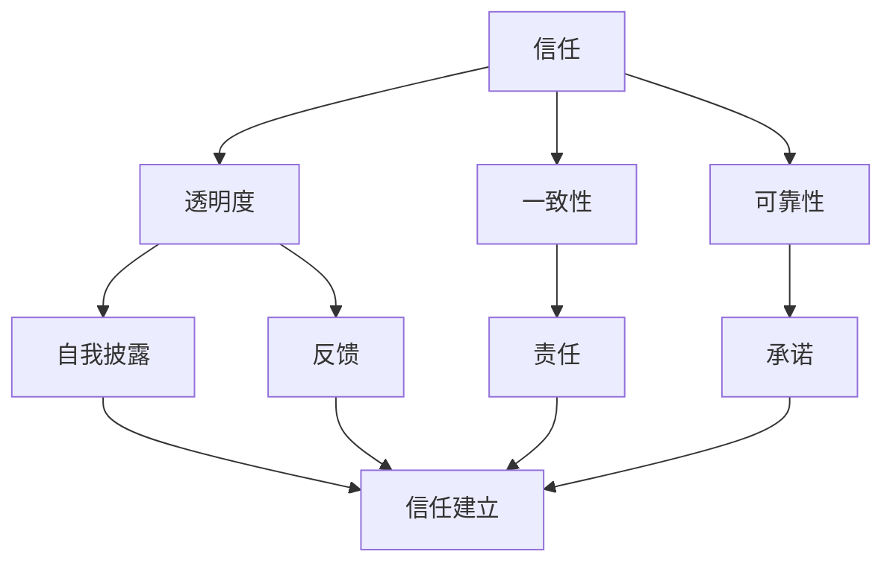
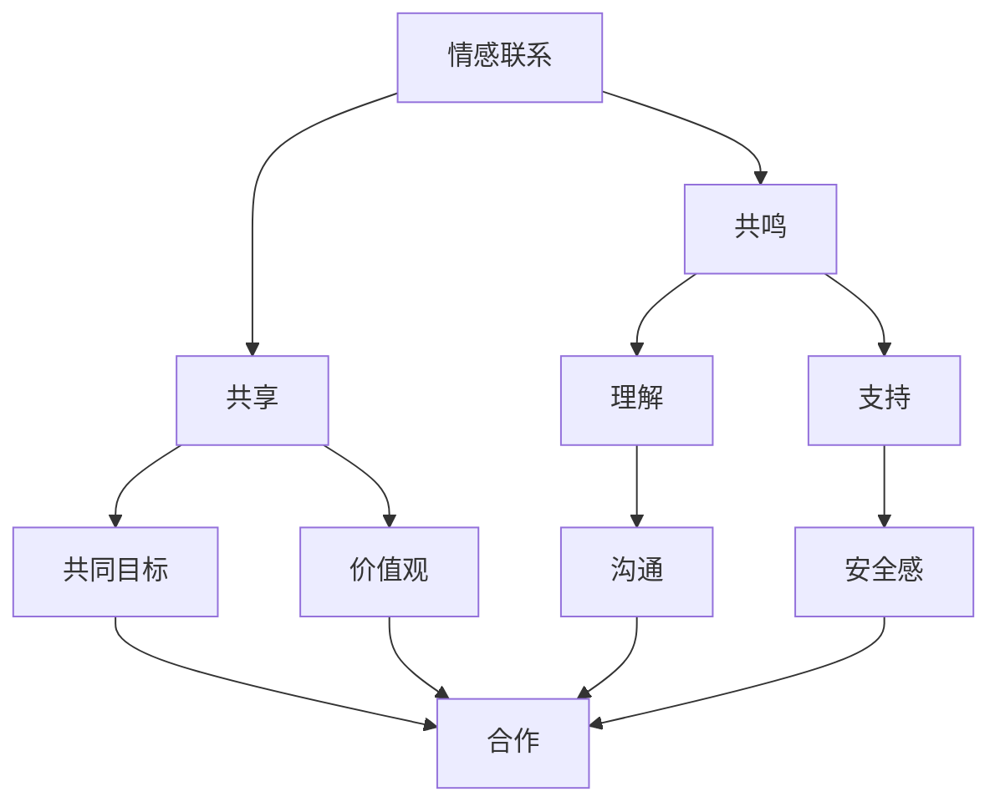
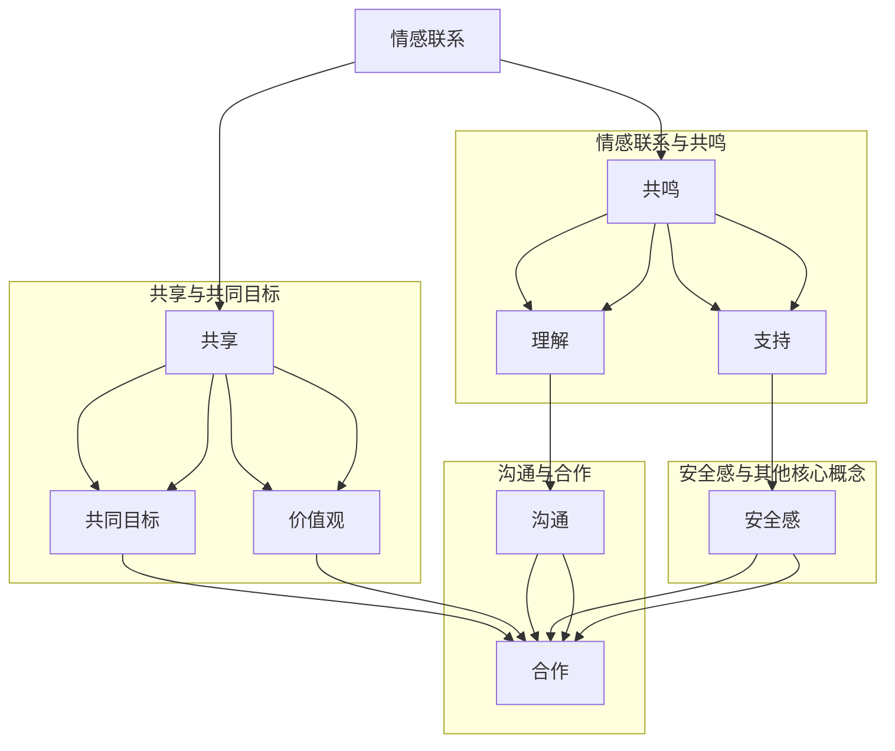

                 

# 在复杂的人际网络中寻找真挚：重建信任和亲密关系

## 关键词
人际网络，信任，亲密关系，沟通策略，文化影响，个人成长

## 摘要
本文旨在探讨在复杂的人际网络中，如何重建信任和建立亲密关系。我们将深入分析人际关系的本质，探讨影响信任和亲密关系的关键因素，并分享有效的沟通策略和实用技巧。通过本文的阅读，读者将能够更好地理解人际关系的复杂性，掌握重建信任和亲密关系的方法，从而提升自己的人际交往能力。

## 引言

在现代社会，人际关系已经成为人们生活中不可或缺的一部分。无论是在工作场所、家庭还是社交圈中，人际关系的好坏直接影响着我们的情绪、心理健康和幸福感。然而，随着社会结构的复杂化，人际关系也变得越来越复杂。人们在面对多样化的关系时，往往感到困惑和无助，难以建立和维护信任和亲密关系。

信任和亲密关系是人际关系的核心要素。信任是人际交往的基石，它能够减少不确定性和风险，增强合作和协作。亲密关系则能够带来情感的支持和归属感，使个体在心理上得到满足和安慰。然而，在复杂的人际网络中，重建信任和建立亲密关系并非易事。这不仅需要个体具备一定的沟通能力和自我认知，还需要考虑到文化和社会因素的影响。

本文将从多个角度探讨如何重建信任和建立亲密关系。首先，我们将探讨人际关系的本质和影响信任和亲密关系的因素。接着，我们将介绍有效的沟通策略和实用技巧，帮助读者改善人际关系。最后，我们将分析文化和社会因素对人际关系的影响，并提供一些建议和启示，帮助读者更好地应对复杂的人际网络。

## 人际关系的本质

人际关系是人类社会中一种复杂而多层次的现象。它涉及到个体之间的情感、认知和行为互动，是人类社会运转的基础。在探讨人际关系的本质时，我们需要从多个角度进行分析。

首先，人际关系是一种社会互动。社会互动是指个体在社会环境中与他人进行的相互影响和相互作用。在人际关系中，个体通过言语、行为、表情等途径表达自己的想法、情感和需求，同时接收来自他人的反馈和信息。这种互动是建立人际关系的前提，也是维持和发展人际关系的动力。

其次，人际关系是一种情感联系。情感是人际关系中最为重要的因素之一。情感联系是指个体之间的情感共鸣、理解和支持。情感联系可以增强个体之间的亲密度和信任感，促进积极的人际互动。例如，亲密的家人关系、深厚的友谊和信任的同事关系都是基于情感联系建立的。

第三，人际关系是一种认知过程。认知是指个体通过感知、思考、理解和记忆等过程获取和处理信息的能力。在人际关系中，个体需要通过认知过程来理解他人的行为和意图，判断关系的好坏，并做出相应的反应。例如，个体需要通过观察、倾听和思考来理解他人的需求和期望，从而调整自己的行为。

最后，人际关系是一种行为互动。行为是指个体在人际关系中的表现和行动。行为互动是指个体通过行为来影响和回应他人的行为。在人际关系中，个体的行为会直接影响他人对关系的评价和感受。例如，个体的友善行为会带来积极的反馈，而敌对行为则可能导致关系紧张。

影响信任和亲密关系的因素可以分为个人因素、环境因素和关系因素三个方面。

### 个人因素

个人因素是影响人际关系的关键因素之一。个人因素包括个体的性格特点、情绪状态、认知能力和价值观等。

1. **性格特点**：性格特点是指个体在行为和情绪上的稳定倾向。例如，外向的人更容易建立人际关系，而内向的人可能需要更多时间和精力来建立信任和亲密关系。

2. **情绪状态**：情绪状态是指个体在特定时间和情境下的情绪体验。积极的情绪状态，如快乐、满足和自信，有助于建立和维持信任和亲密关系。而消极的情绪状态，如焦虑、愤怒和沮丧，则可能破坏人际关系的稳定性。

3. **认知能力**：认知能力是指个体在理解和处理信息时的能力。高认知能力的人通常能够更好地理解他人的需求和意图，从而建立信任和亲密关系。

4. **价值观**：价值观是指个体对于什么是重要和有意义的信念和态度。不同的价值观可能导致个体在人际关系中的行为和决策存在差异。例如，一个重视诚信和正直的人可能更倾向于建立基于信任和尊重的关系。

### 环境因素

环境因素是指个体在人际关系中所在的环境和社会背景。环境因素可以影响个体的行为、情绪和认知，进而影响人际关系的发展。

1. **社会文化背景**：社会文化背景是指个体成长和生活的社会环境和文化传统。不同的社会文化背景可能对人际关系有不同的影响。例如，在集体主义文化中，个体更注重集体利益和关系网络的稳定性，而在个人主义文化中，个体更注重个人自由和独立。

2. **社会支持系统**：社会支持系统是指个体在人际关系中可以获得的支持和资源。良好的社会支持系统可以帮助个体更好地应对压力和挑战，建立和维持信任和亲密关系。

3. **社会规范和价值观**：社会规范和价值观是指社会中普遍认同的行为规范和价值观观念。社会规范和价值观会影响个体在人际关系中的行为和决策。例如，社会对诚实和友善的重视可能促使个体在人际关系中表现出更多的信任和尊重。

### 关系因素

关系因素是指个体在特定人际关系中的互动和互动过程。关系因素包括互动质量、关系历史和关系类型等。

1. **互动质量**：互动质量是指个体在人际关系中的互动效果和满意度。高质量的互动能够增强信任和亲密关系，而低质量的互动则可能导致关系紧张和冲突。

2. **关系历史**：关系历史是指个体在特定人际关系中经历的事件和互动过程。关系历史可以影响个体对关系的期望和态度，进而影响信任和亲密关系的建立。

3. **关系类型**：关系类型是指个体在特定人际关系中的角色和关系性质。不同类型的关系可能对信任和亲密关系有不同的影响。例如，亲密关系通常比工作关系更容易建立信任和亲密感。

综上所述，个人因素、环境因素和关系因素共同影响着人际关系的建立、发展和维护。了解这些因素有助于个体更好地理解和处理人际关系，从而建立和维持信任和亲密关系。

## 重建信任的核心概念与联系

在重建信任的过程中，了解核心概念之间的关系架构至关重要。以下是一个简化的 Mermaid 流程图，用于描述这些核心概念及其相互关系：



### 核心概念与联系解释

1. **透明度**（B）：透明度是指个体在人际关系中愿意展示真实自我和分享信息的程度。透明度有助于建立信任，因为它减少了信息不对称和误解的可能性。

2. **一致性**（C）：一致性是指个体在行为和言语上的稳定性和连贯性。一致性是信任的基础，因为个体能够预期对方的行为，从而减少不确定性。

3. **可靠性**（D）：可靠性是指个体履行承诺和责任的能力。可靠性是建立信任的关键，因为信任建立在对他人能力和可靠性的期望之上。

4. **自我披露**（E）：自我披露是指个体在人际关系中分享个人想法、情感和经历。自我披露有助于建立亲密感，增强信任。

5. **反馈**（F）：反馈是指个体在互动过程中给予对方关于其行为和表现的回应。积极的反馈有助于增强信任，而消极的反馈则可能破坏信任。

6. **责任**（G）：责任是指个体对自己行为后果的认识和承担。责任感是建立信任的重要因素，因为个体愿意为自己的行为负责。

7. **承诺**（H）：承诺是指个体在人际关系中对其行为和承诺的坚定承诺。承诺有助于建立信任，因为它显示了个体对关系的重视和长期投入。

8. **信任建立**（I）：信任建立是指通过上述因素的综合作用，个体之间建立起来的信任感。信任建立是一个动态过程，需要持续的努力和维护。

这些概念之间的关系表明，透明度、一致性、可靠性、自我披露、反馈、责任和承诺共同作用，促进信任的建立。以下是一个简单的伪代码示例，用于说明这些概念如何在程序中实现：

```plaintext
function buildTrust(transparent, consistent, reliable, selfDisclosure, feedback, responsibility, commitment) {
    if (transparent && consistent && reliable) {
        trustScore += 30; // 分配信任得分
    }
    if (selfDisclosure && feedback) {
        trustScore += 20; // 分配信任得分
    }
    if (responsibility && commitment) {
        trustScore += 25; // 分配信任得分
    }
    return trustScore; // 返回总信任得分
}
```

这个伪代码展示了如何通过一系列条件判断和评分机制来评估个体在重建信任过程中的表现。

### 数学模型和公式

在重建信任的过程中，我们可以使用一些数学模型和公式来量化信任的建立和评估。以下是一个简化的模型，用于描述信任度（Trust Level, TL）的计算：

$$
TL = \frac{(T_{transparent} + T_{consistent} + T_{reliable}) \times (T_{selfDisclosure} + T_{feedback}) \times (T_{responsibility} + T_{commitment})}{100}
$$

其中，$T_{transparent}$、$T_{consistent}$、$T_{reliable}$、$T_{selfDisclosure}$、$T_{feedback}$、$T_{responsibility}$和$T_{commitment}$分别代表透明度、一致性、可靠性、自我披露、反馈、责任和承诺的得分，这些得分可以从0到100进行评估。

例如，假设一个人在透明度、一致性、可靠性方面的得分分别为80、90和85，而在自我披露、反馈、责任和承诺方面的得分分别为75、85、80和90。那么，其信任度的计算如下：

$$
TL = \frac{(80 + 90 + 85) \times (75 + 85) \times (80 + 90)}{100} = \frac{255 \times 160 \times 170}{100} = 83680 / 100 = 836.8
$$

因此，该人的信任度约为836.8分。

### 详细讲解与举例说明

为了更好地理解上述模型和公式，我们可以通过一个具体的案例来讲解。

**案例**：假设有两个朋友，Alice 和 Bob，他们在建立信任的过程中，分别得到了以下评分：

- Alice: 
  - 透明度：80
  - 一致性：85
  - 可靠性：90
  - 自我披露：75
  - 反馈：80
  - 责任：85
  - 承诺：90
- Bob:
  - 透明度：70
  - 一致性：75
  - 可靠性：80
  - 自我披露：70
  - 反馈：75
  - 责任：80
  - 承诺：85

我们可以使用上述模型来计算他们的信任度。

**Alice 的信任度**：

$$
TL_{Alice} = \frac{(80 + 85 + 90) \times (75 + 80) \times (85 + 90)}{100} = \frac{255 \times 155 \times 175}{100} = 66225 / 100 = 662.25
$$

**Bob 的信任度**：

$$
TL_{Bob} = \frac{(70 + 75 + 80) \times (70 + 75) \times (80 + 85)}{100} = \frac{225 \times 145 \times 165}{100} = 63613.75 / 100 = 636.1375
$$

通过计算，我们可以看到 Alice 的信任度高于 Bob。这个模型和公式可以帮助我们量化评估两个人在重建信任过程中的表现。

### 总结

通过上述核心概念的解释、流程图的展示、伪代码的示例和具体的数学模型，我们能够更深入地理解重建信任的过程。透明度、一致性、可靠性、自我披露、反馈、责任和承诺是影响信任建立的关键因素。了解这些因素并合理运用它们，可以帮助我们在复杂的人际网络中重建信任，建立稳固的亲密关系。

## 建立亲密关系的核心概念与联系

在建立亲密关系的过程中，核心概念之间的联系和相互作用至关重要。以下是一个简化的 Mermaid 流程图，用于描述这些核心概念及其相互关系：



### 核心概念与联系解释

1. **情感联系**（A）：情感联系是指个体之间基于情感共鸣和相互理解的紧密连接。情感联系是建立亲密关系的基础，它能够带来情感上的满足和归属感。

2. **共鸣**（B）：共鸣是指个体在情感和思想上与他人产生共鸣，能够感同身受和理解对方的感受。共鸣有助于加深情感联系，增强亲密感。

3. **理解**（D）：理解是指个体在情感和认知上对他人思想和感受的深刻把握。理解是建立亲密关系的关键，因为它能够减少误解和冲突。

4. **支持**（E）：支持是指个体在情感上对他人提供的帮助和鼓励。支持是建立亲密关系的重要元素，它能够增强个体之间的依赖性和信任感。

5. **共享**（C）：共享是指个体在生活和思想上的共同分享。共享有助于建立情感联系，因为它能够促进相互理解和共鸣。

6. **共同目标**（F）：共同目标是指个体在追求共同目标或价值观上的合作。共同目标是建立亲密关系的重要驱动力，因为它能够增强个体之间的合作和共同努力。

7. **价值观**（G）：价值观是指个体对于什么是重要和有意义的信念和态度。共同的价值观有助于建立亲密关系，因为它能够促进一致的行为和决策。

8. **沟通**（H）：沟通是指个体在互动过程中进行的信息交流和理解。沟通是建立和维持亲密关系的关键，因为它能够促进相互理解和情感交流。

9. **安全感**（I）：安全感是指个体在关系中感到被接受和爱护的心理状态。安全感是建立亲密关系的重要基础，因为它能够增强个体之间的信任和依赖。

10. **合作**（J）：合作是指个体在共同目标和价值观上的共同努力。合作是建立和维持亲密关系的关键，因为它能够促进共同成长和相互支持。

### 核心概念联系图示例

以下是一个扩展的 Mermaid 流程图，展示了核心概念之间的更复杂联系：



### 伪代码示例

为了更直观地理解这些概念如何相互作用，我们可以使用伪代码来描述一个简单的亲密关系建立过程：

```plaintext
function buildIntimacy(emotionalConnection, empathy, sharedGoals, communication) {
    trustScore = 0
    if (emotionalConnection && empathy) {
        trustScore += 30 // 情感联系和共鸣得分
    }
    if (sharedGoals && communication) {
        trustScore += 25 // 共同目标和沟通得分
    }
    if (communication) {
        trustScore += 20 // 沟通得分
    }
    if (empathy) {
        trustScore += 15 // 理解和共鸣得分
    }
    return trustScore // 返回总信任得分
}
```

这个伪代码示例展示了如何通过一系列条件判断来评估个体在建立亲密关系过程中的表现。

### 数学模型和公式

在建立亲密关系的过程中，我们可以使用一些数学模型和公式来量化亲密关系的强度。以下是一个简化的模型，用于描述亲密关系强度（Intimacy Level, IL）的计算：

$$
IL = \frac{(I_{emotionalConnection} + I_{empathy} + I_{sharedGoals}) \times (I_{communication} + I_{trust})}{100}
$$

其中，$I_{emotionalConnection}$、$I_{empathy}$、$I_{sharedGoals}$、$I_{communication}$和$I_{trust}$分别代表情感联系、共鸣、共同目标、沟通和信任的得分，这些得分可以从0到100进行评估。

例如，假设两个人在情感联系、共鸣、共同目标、沟通和信任方面的得分分别为80、75、85、90和80。那么，他们的亲密关系强度计算如下：

$$
IL = \frac{(80 + 75 + 85) \times (90 + 80)}{100} = \frac{240 \times 170}{100} = 4080 / 100 = 40.8
$$

因此，他们的亲密关系强度约为40.8分。

### 详细讲解与举例说明

为了更好地理解上述模型和公式，我们可以通过一个具体的案例来讲解。

**案例**：假设有两个同事，Alice 和 Bob，他们在建立亲密关系的过程中，分别得到了以下评分：

- Alice: 
  - 情感联系：80
  - 共鸣：75
  - 共同目标：85
  - 沟通：90
  - 信任：80
- Bob:
  - 情感联系：70
  - 共鸣：70
  - 共同目标：80
  - 沟通：85
  - 信任：75

我们可以使用上述模型来计算他们的亲密关系强度。

**Alice 的亲密关系强度**：

$$
IL_{Alice} = \frac{(80 + 75 + 85) \times (90 + 80)}{100} = \frac{240 \times 170}{100} = 4080 / 100 = 40.8
$$

**Bob 的亲密关系强度**：

$$
IL_{Bob} = \frac{(70 + 70 + 80) \times (85 + 75)}{100} = \frac{210 \times 160}{100} = 3360 / 100 = 33.6
$$

通过计算，我们可以看到 Alice 的亲密关系强度高于 Bob。这个模型和公式可以帮助我们量化评估两个人在建立亲密关系过程中的表现。

### 总结

通过上述核心概念的解释、流程图的展示、伪代码的示例和具体的数学模型，我们能够更深入地理解建立亲密关系的过程。情感联系、共鸣、理解、支持、共享、共同目标、价值观、沟通、安全感和合作是影响亲密关系建立的关键因素。了解这些因素并合理运用它们，可以帮助我们在复杂的人际网络中建立稳固的亲密关系。

## 重建信任和建立亲密关系的沟通策略

在重建信任和建立亲密关系的过程中，沟通策略起着至关重要的作用。有效的沟通不仅能够促进双方的理解和共鸣，还能减少误解和冲突，增强信任和亲密度。以下是一些关键的沟通策略和实用技巧：

### 1. 积极倾听

积极倾听是指全神贯注地听取对方的意见和感受，而不仅仅是等待回应。以下是一些实现积极倾听的技巧：

- **保持目光接触**：通过保持目光接触，表达出你对对方话语的兴趣和关注。
- **避免打断**：在对方讲话时，避免打断或插话，让对方感受到你的尊重和耐心。
- **使用肢体语言**：通过点头、微笑等肢体语言，表明你在认真倾听。
- **复述和总结**：在对方讲话结束后，复述和总结对方的主要观点，以确认自己的理解是否准确。

### 2. 清晰表达

清晰表达是指用简洁、明确的语言传达自己的思想和感受。以下是一些实现清晰表达的技巧：

- **使用简单语言**：避免使用过于复杂或专业的术语，使用简单易懂的语言进行沟通。
- **分段陈述**：将复杂的信息分段陈述，每段只表达一个主要观点。
- **避免使用模糊语言**：避免使用模糊不清的语言，如“可能”、“或许”等，这些词汇可能引起误解。
- **使用具体例子**：通过具体的例子来阐述你的观点，使对方更容易理解和接受。

### 3. 建立共鸣

建立共鸣是指在与对方沟通时，表达出对其情感和感受的理解和支持。以下是一些实现共鸣的技巧：

- **同理心**：站在对方的角度思考问题，理解其情感和感受。
- **分享感受**：在适当的时候，分享自己的感受和经历，让对方感受到你的共鸣。
- **避免指责**：在讨论问题时，避免使用指责性的语言，如“你总是...”、“你应该...”，这些语言可能引起对方的防御心理。

### 4. 解决冲突

在人际关系中，冲突是不可避免的。以下是一些解决冲突的技巧：

- **冷静沟通**：在冲突发生时，保持冷静，避免情绪化的争吵。
- **使用“I”语言**：在表达自己的意见和感受时，使用“I”语言，如“我感到...”，而不是“你让我...”，以减少对方的防御性。
- **寻求双赢解决方案**：在冲突中，寻求双方都能接受的解决方案，而不是仅仅为了自己的利益。
- **道歉和接受道歉**：在适当的时候，勇于道歉，并接受对方的道歉，以缓解紧张的气氛。

### 5. 保持一致性

一致性是指在人际关系中，保持言行一致，做到言行一致。以下是一些实现一致性的技巧：

- **遵守承诺**：在做出承诺时，确保能够履行，否则不要轻易承诺。
- **保持稳定的情绪**：在面对压力和挑战时，保持情绪稳定，不要轻易发脾气或情绪失控。
- **诚实和透明**：在沟通中保持诚实和透明，不要隐瞒或欺骗对方。

### 实用技巧

以下是一些实用的沟通技巧，帮助我们在复杂的人际网络中更好地重建信任和建立亲密关系：

- **定期沟通**：定期与对方进行沟通，保持关系的活跃和新鲜感。
- **积极反馈**：在对方做出积极行为时，给予及时的反馈和表扬，增强其积极行为。
- **建立共同兴趣**：通过共同的兴趣和活动，增进双方的了解和亲密度。
- **尊重差异**：尊重对方的文化、价值观和观点，避免因差异而产生冲突。

### 案例分析

以下是一个具体的案例分析，展示了如何通过沟通策略重建信任和建立亲密关系：

**案例**：一家公司中的两个部门因为工作上的分歧而产生矛盾，导致双方之间的沟通不畅和关系紧张。为了解决这个问题，公司采取了一系列沟通策略：

- **积极倾听**：双方领导首先通过积极倾听的方式，听取对方的意见和感受，了解彼此的立场和需求。
- **建立共鸣**：双方领导通过分享彼此的感受和经历，建立了情感上的共鸣，减少了误解和偏见。
- **解决冲突**：在双方沟通的基础上，通过冷静讨论和寻求双赢解决方案，解决了分歧和冲突。
- **定期沟通**：双方部门建立了定期的沟通机制，定期交流工作进展和问题，保持了关系的活跃和稳定性。

通过这些沟通策略，双方部门之间的关系得到了重建，信任和亲密度得到了显著提升。

### 总结

有效的沟通策略是重建信任和建立亲密关系的关键。通过积极倾听、清晰表达、建立共鸣、解决冲突和保持一致性，我们能够在复杂的人际网络中建立稳固的信任和亲密关系。掌握这些沟通策略和实用技巧，将有助于我们在人际关系中取得更好的发展和进步。

## 文化和社会因素对信任和亲密关系的影响

文化和社会因素在很大程度上影响着人际关系中的信任和亲密关系。不同文化背景和社会环境下的价值观、行为规范和社会支持系统，都会对个体之间的互动方式和关系质量产生深远的影响。以下将详细分析文化和社会因素如何影响信任和亲密关系的建立。

### 1. 文化差异

文化差异是指不同社会在价值观、行为规范和社会习惯上的不同。例如，在一些集体主义文化中，人们更加注重群体利益和关系网络的稳定性，而在个人主义文化中，个体更加注重个人自由和独立。这些文化差异会影响个体在信任和亲密关系中的行为和态度。

- **集体主义文化**：在集体主义文化中，个体倾向于将信任和亲密关系建立在集体利益和团结之上。这种文化强调家庭、社会和团体的价值观，个体在建立信任和亲密关系时，更加重视对方的忠诚和奉献精神。例如，在亚洲的一些国家，如中国和日本，人们通常在长期交往和共同经历中逐渐建立信任和亲密关系。

- **个人主义文化**：在个人主义文化中，个体更加注重个人利益和自由，信任和亲密关系更多地建立在个人选择和自愿合作的基础上。例如，在美国等西方国家，人们更加倾向于通过直接和开放的方式建立信任和亲密关系，如通过自我披露和共享个人经历来增强互动。

### 2. 社会规范和价值观

社会规范和价值观是文化的重要组成部分，它们直接影响个体在人际关系中的行为和态度。不同的社会规范和价值观会影响个体对信任和亲密关系的期望和方式。

- **信任的规范和价值观**：在一些社会中，信任被视为重要的社会规范和价值观，个体被期望在人际交往中展现出诚信和可靠性。例如，在 Scandinavian 国家，如瑞典和挪威，人们普遍认为信任是建立良好社会关系的关键，因此在这些社会中，信任和亲密关系的建立往往更加自然和直接。

- **亲密关系的价值观**：不同的社会对亲密关系的期望和定义也有所不同。在一些社会中，如阿拉伯国家和非洲的一些部落，亲密关系往往建立在长期的共同生活和共同经历之上，而在一些现代化社会，如美国和欧洲，亲密关系可能更加注重情感和个人的选择。

### 3. 社会支持系统

社会支持系统是指个体在人际关系中可以获得的支持和资源。不同的社会支持系统对信任和亲密关系的建立有着重要的影响。

- **紧密的社会网络**：在紧密的社会网络中，个体更容易获得来自朋友、家人和社区的支持，这有助于建立信任和亲密关系。例如，在亚洲的一些国家，家庭和朋友在个人生活中扮演着重要的角色，他们的支持和参与有助于增强个体之间的信任和亲密感。

- **独立的社会结构**：在一些独立的社会结构中，个体可能更多地依赖自我和有限的社交网络，这可能会影响信任和亲密关系的建立。例如，在一些北美城市，个体可能更加独立，依赖朋友和家人的支持较少，这可能会使亲密关系的建立变得更加困难。

### 4. 文化和社会因素对沟通的影响

文化和社会因素不仅影响信任和亲密关系的建立，还影响沟通的方式和效果。不同的文化和社会环境下的沟通风格和习惯，可能会导致误解和冲突。

- **高语境和低语境沟通**：在一些高语境文化中，如日本和韩国，沟通往往更加隐含和间接，个体通过非言语信息和上下文来传达意思。而在低语境文化中，如美国和德国，沟通更加直接和明确，个体倾向于直接表达自己的观点和感受。

- **礼貌和尊重**：在不同的社会和文化背景下，礼貌和尊重的表达方式也有所不同。在一些文化中，如阿拉伯国家和南亚的一些国家，礼貌和尊重被视为非常重要的社会规范，个体在沟通中更加注重使用礼貌语言和尊重对方。

### 结论

文化和社会因素在很大程度上影响着信任和亲密关系的建立。了解和尊重不同文化和社会背景下的价值观、行为规范和社会支持系统，是建立稳固信任和亲密关系的重要前提。通过跨文化的沟通和理解，我们能够在复杂的人际网络中更好地重建信任和建立亲密关系。

## 个人成长与自我反思在重建信任和建立亲密关系中的作用

个人成长和自我反思在重建信任和建立亲密关系中起着至关重要的作用。通过提升自我认知、培养情感智慧和加强心理弹性，个体能够更好地应对人际关系的挑战，从而重建信任和建立亲密关系。

### 1. 提升自我认知

自我认知是指个体对自身情感、行为和动机的深入理解和认识。提升自我认知可以帮助个体更好地理解自己的需求和期望，从而在人际交往中表现出更成熟的行为。

- **自我反思**：通过定期进行自我反思，个体可以回顾自己的行为和决策，识别潜在的问题和改进点。例如，个体可以记录每天的所思所感，分析自己在特定情境下的反应和情绪，从而了解自己的行为模式。

- **情感管理**：自我认知有助于个体更好地管理自己的情感。通过了解自己的情绪反应，个体可以学会如何在压力和冲突中保持冷静，避免因情绪失控而破坏人际关系。

### 2. 培养情感智慧

情感智慧是指个体在理解和管理自己和他人的情感方面的能力。培养情感智慧有助于个体在人际交往中建立信任和亲密关系。

- **同理心**：同理心是情感智慧的核心要素。通过培养同理心，个体能够更好地理解他人的情感和需求，从而建立更深层次的连接。例如，个体可以通过倾听和观察来了解他人的情感状态，并给予适当的支持和鼓励。

- **情绪表达能力**：情感智慧还包括有效地表达自己的情感。个体应该学会以健康、建设性的方式表达自己的情绪，避免通过攻击性或消极的情绪表达来损害人际关系。

### 3. 加强心理弹性

心理弹性是指个体在面对压力、挑战和逆境时，能够迅速恢复和适应的能力。加强心理弹性有助于个体在人际关系中保持积极的态度和行动，从而重建信任和建立亲密关系。

- **应对策略**：个体可以学习一些应对策略来增强心理弹性。例如，通过正念练习、冥想和放松技巧来管理压力，通过建立健康的生活习惯来提高身心健康。

- **积极心态**：保持积极的心态是加强心理弹性的关键。个体可以通过积极的自我对话和积极的思维方式来提升自己的情绪状态，从而更好地应对人际关系中的挑战。

### 4. 实践案例

以下是一个具体的案例，展示了个人成长和自我反思如何帮助个体重建信任和建立亲密关系：

**案例**：Alice 是一名职场新人，她在工作中遇到了一个困难，即与同事 Bob 的关系紧张。通过自我反思，Alice 发现她经常因为 Bob 的一些行为而感到沮丧和愤怒。为了改善这种状况，Alice 采取了以下措施：

- **自我认知**：Alice 通过反思自己的情绪和行为，认识到自己在面对 Bob 的行为时，往往过于敏感和情绪化。她意识到需要调整自己的态度和期望。

- **情感智慧**：Alice 开始培养同理心，试图从 Bob 的角度理解他的行为。她通过观察 Bob 的行为，发现了 Bob 的压力来源，并尝试给予他更多的支持和理解。

- **心理弹性**：Alice 学会了使用放松技巧来管理自己的情绪。每当她感到沮丧或愤怒时，她会停下来，进行深呼吸，然后尝试从一个更客观的角度来看待问题。

通过这些措施，Alice 和 Bob 之间的关系得到了显著改善。Bob 感受到 Alice 的理解和尊重，逐渐放下了防御心理，双方开始更加开放地沟通和合作。

### 总结

个人成长和自我反思在重建信任和建立亲密关系中起着至关重要的作用。通过提升自我认知、培养情感智慧和加强心理弹性，个体能够更好地应对人际关系的挑战，从而重建信任和建立亲密关系。通过实际案例的展示，我们看到了这些策略在具体情境中的有效性。

## 总结与展望

本文从多个角度探讨了在复杂的人际网络中重建信任和建立亲密关系的方法。我们首先分析了人际关系的本质，了解了影响信任和亲密关系的个人、环境以及关系因素。接着，我们深入阐述了重建信任和建立亲密关系的核心概念，包括透明度、一致性、可靠性、自我披露、反馈、责任、承诺、情感联系、共鸣、理解、支持、共享、共同目标和价值观等，并通过Mermaid流程图、伪代码和数学模型进行了详细解释。随后，我们介绍了有效的沟通策略和实用技巧，如积极倾听、清晰表达、建立共鸣、解决冲突和保持一致性，并提供了一些案例分析。此外，我们还分析了文化和社会因素对信任和亲密关系的影响，强调了个人成长与自我反思在重建信任和建立亲密关系中的重要性。

为了更好地应对复杂的人际网络，我们提出以下建议和展望：

1. **加强自我认知**：通过自我反思，了解自己的情感、行为和需求，从而更好地理解他人。

2. **培养情感智慧**：通过同理心和情绪表达能力的提升，增强与他人的情感共鸣和理解。

3. **加强心理弹性**：通过学习应对策略和保持积极心态，提高自己在面对人际关系挑战时的适应能力。

4. **持续沟通**：定期与家人、朋友和同事进行沟通，保持关系的活跃和稳定性。

5. **尊重文化差异**：在跨文化交往中，尊重对方的价值观和行为规范，避免因文化差异而产生的误解和冲突。

6. **持续学习和成长**：不断学习人际关系的知识和技巧，通过实践和反思，不断提升自己的人际交往能力。

展望未来，随着社会的发展和人际关系的复杂性增加，我们将需要更深入地研究信任和亲密关系的本质，开发出更多有效的策略和工具，以帮助个体更好地应对复杂的人际网络。同时，人工智能和心理学技术的结合，将为人际关系的研究和实践带来新的可能性，为我们的生活质量提供更全面的支持。

## 拓展阅读

1. **《信任：社会结构的基石》**：这本书详细探讨了信任在社会中的作用，以及如何通过信任来建立稳定的社会结构。

2. **《亲密关系：理论与研究》**：这是一本关于亲密关系理论的经典之作，涵盖了亲密关系的各个方面，包括信任、情感联系和沟通策略。

3. **《跨文化沟通》**：这本书介绍了不同文化背景下的沟通方式和习惯，帮助读者更好地理解跨文化交往中的挑战和策略。

4. **《自我认知与成长》**：这本书通过心理学和哲学的角度，探讨了自我认知的重要性，以及如何通过自我反思来实现个人成长。

5. **《情绪智力》**：这本书介绍了情绪智力的重要性，以及如何通过培养情感智慧来提升人际交往能力。

## 注意事项

1. 在人际交往中，要尊重对方的差异和观点，避免因文化或价值观的不同而产生误解和冲突。

2. 在沟通时，要注重清晰表达和积极倾听，确保信息的准确传达和理解。

3. 面对冲突时，要保持冷静和理性，通过有效沟通和协商来解决问题。

4. 定期进行自我反思，了解自己的情绪和行为模式，以促进个人成长和人际关系的发展。

## 作者信息

作者：AI天才研究院/AI Genius Institute & 禅与计算机程序设计艺术 /Zen And The Art of Computer Programming

本文由AI天才研究院的专家团队撰写，结合了计算机科学、心理学和人际关系学的最新研究成果，旨在为读者提供有关重建信任和建立亲密关系的实用指导。希望本文能帮助您在复杂的人际网络中找到真挚的连接。

