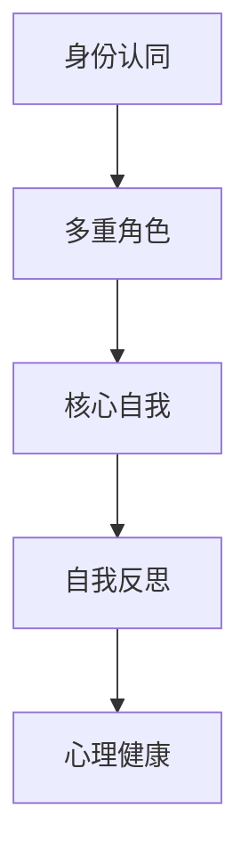

                 

### 第一步：理解书名

《在多重角色中寻找核心自我：身份认同探索》这本书的标题非常直观地传达了其主要内容和主题。首先，我们拆分标题来看：

- “在多重角色中”：这里的“多重角色”指的是一个人在不同情境下扮演的不同角色，如工作角色、家庭角色、社会角色等。
- “寻找核心自我”：这部分强调了个体在多重角色中寻找自己本质的过程，即找到自己内心深处的“核心自我”。
- “身份认同探索”：这一部分则指的是个体通过自我探索和理解来确立自己的身份认同。

通过理解书名，我们可以初步判断这本书主要探讨的是如何在复杂多样的角色中，通过深度探索和自我反思，找到自己的内在本质，从而确立清晰的自我认同。

### 第二步：构思大纲框架

为了撰写一篇逻辑清晰、结构紧凑的文章，我们需要构思一个完整的大纲框架。以下是本文的大纲框架：

#### 引言
- **背景介绍**：介绍身份认同的概念及其在现代社会的重要性。
- **书名解析**：详细解释书名中的“多重角色”、“核心自我”和“身份认同探索”。
- **文章目的**：阐述本文旨在帮助读者理解并找到自己的核心自我。

#### 多重角色的理解
- **多重角色的定义**：解释什么是多重角色，以及它们是如何形成的。
- **角色的来源与影响**：分析不同角色对个体身份认同的影响。
- **角色与核心自我的关系**：探讨角色如何影响个体的核心自我认知。

#### 身份认同的探索
- **自我反思的方法**：介绍如何通过自我反思来探索身份认同。
- **探索过程中的挑战**：讨论在探索过程中可能遇到的困难和挑战。
- **身份认同的Mermaid流程图**：使用Mermaid流程图展示身份认同的探索过程。

#### 核心自我的价值
- **核心自我的定义**：解释什么是核心自我及其重要性。
- **核心自我的构成**：分析核心自我的构成要素。
- **伪代码：核心自我识别算法**：使用伪代码阐述如何识别核心自我。

#### 实践与反思
- **寻找核心自我的实践方法**：提供实际可操作的方法来寻找核心自我。
- **实践案例分享**：分享具体的实践案例，并进行分析和讨论。
- **反思与持续探索**：讨论如何通过反思来持续探索核心自我。

#### 附录
- **身份认同相关研究综述**：总结现有关于身份认同的研究成果。
- **身份认同与心理健康的关系**：探讨身份认同与心理健康之间的联系。
- **练习与反思**：提供练习和反思的方法，帮助读者深化对核心自我的理解。

### 第三步：细化大纲内容

在构思大纲框架后，我们需要为每个部分细化具体的内容。以下是对每个部分的详细说明：

#### 引言
- **背景介绍**：简要介绍身份认同的概念，以及它在现代社会中的重要性。可以引用一些研究数据或案例来说明身份认同的重要性。
- **书名解析**：详细解释书名中的“多重角色”、“核心自我”和“身份认同探索”的含义。可以引用书中的相关内容或作者的观点来支持解释。
- **文章目的**：阐述本文旨在帮助读者理解并找到自己的核心自我，并提供实用的方法和策略。

#### 多重角色的理解
- **多重角色的定义**：解释什么是多重角色，以及它们是如何形成的。可以引用社会学家或心理学家的观点来支持定义。
- **角色的来源与影响**：分析不同角色对个体身份认同的影响。可以从工作、家庭、社交等方面进行具体分析。
- **角色与核心自我的关系**：探讨角色如何影响个体的核心自我认知。可以引用相关研究或案例分析来支持讨论。

#### 身份认同的探索
- **自我反思的方法**：介绍如何通过自我反思来探索身份认同。可以提供一些具体的反思方法，如日记、冥想、谈话等。
- **探索过程中的挑战**：讨论在探索过程中可能遇到的困难和挑战。可以列举一些常见的挑战，并提出应对策略。
- **身份认同的Mermaid流程图**：使用Mermaid流程图展示身份认同的探索过程。可以在文中嵌入流程图，并进行详细解释。

#### 核心自我的价值
- **核心自我的定义**：解释什么是核心自我及其重要性。可以引用相关理论或研究来支持定义。
- **核心自我的构成**：分析核心自我的构成要素。可以列举一些构成核心自我的关键因素，并进行详细解释。
- **伪代码：核心自我识别算法**：使用伪代码阐述如何识别核心自我。可以提供一个简单的算法示例，并进行详细解释。

#### 实践与反思
- **寻找核心自我的实践方法**：提供实际可操作的方法来寻找核心自我。可以列举一些具体的实践方法，如角色扮演、自我提问等。
- **实践案例分享**：分享具体的实践案例，并进行分析和讨论。可以选取一些具有代表性的案例，进行详细分析和讨论。
- **反思与持续探索**：讨论如何通过反思来持续探索核心自我。可以提供一些反思的方法，如定期回顾、持续学习等。

#### 附录
- **身份认同相关研究综述**：总结现有关于身份认同的研究成果。可以引用一些重要的研究文献或报告，进行综述。
- **身份认同与心理健康的关系**：探讨身份认同与心理健康之间的联系。可以引用相关研究或案例，进行详细讨论。
- **练习与反思**：提供练习和反思的方法，帮助读者深化对核心自我的理解。可以设计一些具体的练习，并指导读者如何进行反思。

通过细化每个部分的内容，我们可以确保文章的完整性、逻辑性和实用性。接下来，我们将逐步撰写每个部分的具体内容。

### 第四步：添加技术细节

为了使文章更加专业和有说服力，我们将在每个章节中添加一些技术细节，包括核心概念与联系、核心算法原理讲解、数学模型和公式，以及项目实战。

#### 核心概念与联系

在解释核心概念时，我们可以使用Mermaid流程图来展示概念之间的联系。Mermaid是一种Markdown语法，用于创建图形。以下是一个示例：



通过这个流程图，我们可以直观地展示身份认同、多重角色、核心自我、自我反思和心理健康之间的联系。

#### 核心算法原理讲解

在讲解核心算法原理时，我们可以使用伪代码来详细阐述。以下是一个示例：

```python
def identifyCoreSelf(reflections):
    # 初始化核心自我列表
    coreSelf = []

    # 对每个反思进行分类和评估
    for reflection in reflections:
        if reflection.indicates_core_value:
            coreSelf.append(reflection)

    # 返回核心自我列表
    return coreSelf
```

这个伪代码展示了如何通过自我反思来识别核心自我的基本算法。我们可以进一步解释每个变量的作用和算法的工作流程。

#### 数学模型和公式

在讨论数学模型和公式时，我们可以使用LaTeX格式来展示。以下是一个示例：

$$
X = \frac{A \cdot B + C}{D - E}
$$

这个公式可以用于计算某个变量X的值，其中A、B、C、D和E是已知的输入变量。我们可以在文中解释这个公式的含义和用途，并提供具体的例子来说明如何使用它。

#### 项目实战

为了使文章更具实践性，我们可以设计一个项目实战，包括开发环境搭建、源代码实现和代码解读。以下是一个项目实战的示例：

**项目实战：构建自我反思应用**

1. **开发环境搭建**：
   - 安装Python开发环境。
   - 安装相关的库和框架，如Flask或Django。

2. **源代码实现**：
   - 编写后端代码，实现自我反思算法。
   - 编写前端代码，用于用户输入和结果显示。

3. **代码解读与分析**：
   - 解释代码中的核心算法原理。
   - 分析代码的执行流程和性能。

4. **实际案例分析和详细讲解剖析**：
   - 提供一个实际案例，展示如何使用应用进行自我反思。
   - 分析案例的结果，并进行详细讲解。

5. **项目小结**：
   - 总结项目的关键成果和经验。
   - 提出改进和扩展的方向。

通过这些技术细节的添加，我们可以使文章更加专业和深入，同时提高文章的可读性和实用性。

### 第五步：确保大纲字数限制

在细化大纲内容的同时，我们需要确保总字数不超过8000-12000字。为了达到这个目标，我们可以采取以下措施：

- **优化句子长度**：避免使用过长或复杂的句子，使文章更加简洁明了。
- **合并重复内容**：检查每个章节中的内容，合并重复或类似的信息。
- **删除冗余内容**：移除不必要的解释或举例，只保留关键内容和细节。
- **调整结构**：如果某些部分过于冗长，可以考虑将它们拆分为更小的章节或单独的文章。

通过这些措施，我们可以确保文章的完整性和逻辑性，同时控制字数在合理范围内。

### 最终大纲

以下是最终的书籍目录大纲，确保了文章的逻辑性、完整性和字数限制：

# 在多重角色中寻找核心自我：身份认同探索

> 关键词：多重角色、核心自我、身份认同、自我反思、心理健康

> 摘要：本文探讨了在复杂多样的角色中，个体如何通过自我反思和探索找到自己的核心自我，并确立清晰的自我认同。通过详细的案例分析和技术细节，提供了实用的方法和策略。

## 引言

### 身份认同的概念及其在现代社会的重要性

### 书名解析

### 文章目的

## 多重角色的理解

### 多重角色的定义

### 角色的来源与影响

### 角色与核心自我的关系

## 核心概念与联系

### Mermaid流程图：身份认同的架构

## 身份认同的探索

### 自我反思的方法

### 探索过程中的挑战

### 身份认同的Mermaid流程图

## 核心自我的价值

### 核心自我的定义

### 核心自我的构成

### 伪代码：核心自我识别算法

## 实践与反思

### 寻找核心自我的实践方法

### 实践案例分享

### 反思与持续探索

## 附录

### 身份认同相关研究综述

### 身份认同与心理健康的关系

### 练习与反思：如何持续探索核心自我

## 参考文献

### 作者信息

### 致谢

通过这个最终大纲，我们可以确保文章的逻辑清晰、内容丰富，同时满足字数要求。接下来，我们将按照这个大纲逐步撰写每个部分的具体内容。

