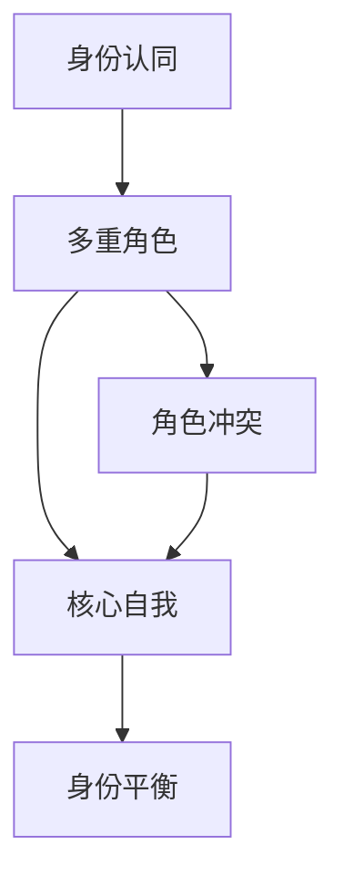
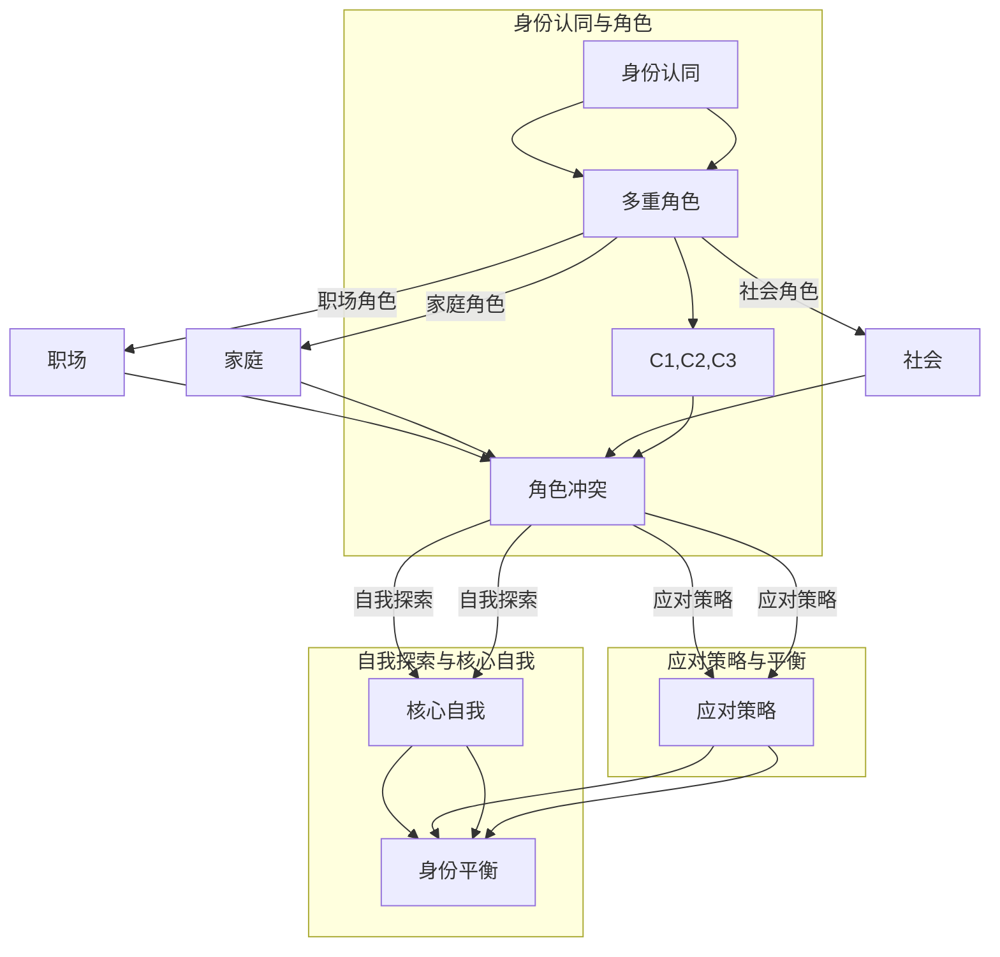

                 

### 1. 确定书的核心内容

《在多重角色中寻找核心自我：身份认同的探索之旅》这本书的核心内容主要围绕身份认同和多重角色展开。身份认同是指个体对于自我身份的确认和认知，包括个人价值观、信仰、文化背景和社会角色等方面。而在现代社会中，许多人需要扮演多种角色，如职场员工、家庭成员、社会成员等，这给身份认同带来了挑战。因此，本书旨在探讨如何在多重角色中找到自己的核心自我，实现身份认同的统一和平衡。

具体来说，书的核心内容可以分为以下几个方面：

- **身份认同的定义**：介绍身份认同的基本概念，包括个体身份的构成、影响因素以及其对社会角色的影响。
- **多重角色的挑战**：分析个体在扮演多重角色时可能面临的问题，如角色冲突、身份模糊、角色压力等。
- **寻找核心自我的方法**：提供一些实用的自我探索工具和技术，帮助读者在多重角色中找到自己的核心身份。
- **案例研究**：通过具体的案例，展示如何在现实场景中应用书中的理论和技巧，寻找并确认核心自我。
- **数学模型和心理测量**：介绍一些心理学模型和心理测量工具，如自我效能感模型、多元回归分析等，以帮助读者更深入地理解身份认同的过程。

在明确核心内容后，我们可以开始设计文章的结构，确保每个部分都能够充分阐述主题，使读者能够全面理解身份认同的探索之旅。

### 2. 设计核心概念与联系

为了帮助读者更好地理解身份认同和多重角色之间的关系，我们可以采用Mermaid流程图来展示核心概念和它们之间的联系。以下是设计该流程图的详细步骤：

#### 步骤1：确定流程图的主要元素

- **身份认同**：作为流程图的核心，表示个体对于自我身份的认知和确认。
- **多重角色**：包括个体在职场、家庭、社会等不同场景中扮演的不同角色。
- **角色冲突**：表示当多个角色之间存在矛盾或压力时的状况。
- **核心自我**：代表个体在多重角色中寻找到的本质自我，是身份认同的核心。

#### 步骤2：绘制流程图的基本框架

使用Mermaid语法，我们可以创建一个简单的流程图框架。以下是基本框架的示例：



#### 步骤3：细化流程图内容

在基本框架的基础上，我们可以进一步细化流程图，添加更多的解释和细节。以下是细化后的流程图：



在这个流程图中，我们清晰地展示了身份认同如何影响多重角色的扮演，以及如何在自我探索和应对策略的帮助下找到核心自我，最终实现身份平衡。

#### 步骤4：添加注释和说明

为了使流程图更加易于理解，我们可以在关键节点添加注释和说明。以下是添加注释后的流程图：

```mermaid
graph TD
    A[身份认同] --> B[多重角色]
    B -->|职场角色| C1[职场](角色冲突)
    B -->|家庭角色| C2[家庭](角色冲突)
    B -->|社会角色| C3[社会](角色冲突)
    C1 --> D[角色冲突](自我探索)
    C2 --> D
    C3 --> D
    D -->|自我探索| E[核心自我](身份平衡)
    E --> F[身份平衡]
    D -->|应对策略| G[应对策略](平衡策略)
    G --> F

    subgraph 身份认同与角色
        A --> B
        B --> C1,C2,C3
        C1,C2,C3 --> D
    end

    subgraph 自我探索与核心自我
        D -->|自我探索| E
        E --> F
    end

    subgraph 应对策略与平衡
        D -->|应对策略| G
        G --> F
    end
```

通过这个流程图，读者可以直观地看到身份认同、多重角色、角色冲突、自我探索、核心自我和应对策略之间的关系，以及如何在多重角色中找到核心自我并实现身份平衡。

### 3. 设计核心算法原理讲解

为了更好地理解在多重角色中寻找核心自我的过程，我们可以采用一种“算法”的比喻来描述自我探索的步骤。这种方法可以帮助读者形象地理解自我探索的流程，从而更加深入地掌握核心概念。以下是使用伪代码详细阐述这一算法的步骤：

```plaintext
算法：寻找核心自我

输入：多重角色列表，自我认知数据

输出：核心自我

步骤：

1. 初始化核心自我变量（core_self）为空

2. 对每个角色（role）执行以下操作：

   2.1 获取该角色的自我认知数据（self_perception）

   2.2 将该角色的自我认知数据添加到核心自我变量中

   2.3 分析该角色与其他角色的关联程度

   2.4 如果该角色的关联程度较高，则将其权重提高

3. 对核心自我变量中的所有角色数据执行聚合操作：

   3.1 计算每个角色的权重总和

   3.2 计算每个角色的平均分

4. 根据每个角色的平均分和权重，对角色进行排序

5. 选择排序后的角色中权重最高且平均分最高的角色作为核心自我

6. 输出核心自我

```

#### 步骤解释：

1. **初始化核心自我变量**：首先，我们需要创建一个空的变量来存储核心自我信息。

2. **遍历多重角色列表**：对于每个角色，我们收集其自我认知数据，并将其添加到核心自我变量中。同时，分析该角色与其他角色的关联程度，以便在后续步骤中计算权重。

3. **聚合角色数据**：通过对所有角色数据的聚合操作，我们计算出每个角色的权重总和和平均分。这些数据将为角色排序提供依据。

4. **角色排序**：根据每个角色的平均分和权重，对角色进行排序。排序过程将有助于我们识别出最具代表性的角色。

5. **选择核心自我**：从排序后的角色中，选择权重最高且平均分最高的角色作为核心自我。这一角色最能代表个体的本质自我。

6. **输出核心自我**：最后，输出核心自我，完成算法。

通过这个伪代码，读者可以清晰地看到自我探索的步骤和逻辑。这种方法不仅有助于理解核心自我的概念，还可以为实际应用提供指导。

### 4. 设计数学模型和数学公式

在探讨身份认同的过程中，使用数学模型和心理测量工具可以帮助我们更深入地理解个体在多重角色中的行为和认知。以下我们将介绍两种常见的数学模型和相关的数学公式，并通过具体例子进行详细讲解。

#### 4.1 自我效能感模型

自我效能感模型（Self-Efficacy Model）是由心理学家阿尔伯特·班杜拉（Albert Bandura）提出的，用于解释个体在面对挑战和任务时的自信心和效能感。该模型包括以下几个关键要素：

- **自我效能感**：个体对自己完成任务能力的信心水平。
- **行为表现**：个体在特定任务中的行为和表现。
- **结果**：行为表现所带来的后果，包括积极和消极的结果。
- **观察学习**：个体通过观察他人的行为和结果来调整自己的效能感。

数学公式表示为：

$$
自我效能感 = f(行为表现，结果，观察学习)
$$

其中，$f$ 是一个函数，表示自我效能感与行为表现、结果和观察学习之间的关系。

#### 例子：

假设有一个学生小王，他在数学考试中取得了高分（行为表现），并且看到其他同学也对数学表现出较高的兴趣和成绩（观察学习）。这些因素共同提高了他的自我效能感。具体计算如下：

$$
自我效能感_{小王} = f(高分，积极结果，观察学习)
$$

通过这个公式，我们可以看到，小王在数学方面的自我效能感得到了提升。

#### 4.2 多元回归分析

多元回归分析（Multiple Regression Analysis）是用于分析多个自变量（predictors）对一个因变量（criterion）的影响的统计方法。在身份认同的研究中，多元回归分析可以用来确定哪些角色变量对核心自我有显著影响。

数学公式表示为：

$$
Y = \beta_0 + \beta_1X_1 + \beta_2X_2 + ... + \beta_pX_p + \varepsilon
$$

其中，$Y$ 是因变量（核心自我得分），$X_1, X_2, ..., X_p$ 是自变量（不同角色的得分），$\beta_0, \beta_1, \beta_2, ..., \beta_p$ 是回归系数，$\varepsilon$ 是误差项。

#### 例子：

假设我们研究家庭角色、职场角色和社会角色对核心自我的影响。我们可以通过多元回归分析确定这些角色的得分如何影响核心自我得分。具体计算如下：

$$
核心自我得分 = \beta_0 + \beta_1 \times 家庭角色得分 + \beta_2 \times 职场角色得分 + \beta_3 \times 社会角色得分 + \varepsilon
$$

通过这个公式，我们可以分析每个角色得分对核心自我的影响程度，并确定哪些角色对核心自我有显著贡献。

#### 4.3 数学公式举例

为了更直观地展示数学公式的应用，我们通过具体的例子进行说明。

**例子：自我效能感模型**

假设一个学生在数学和英语两门考试中都取得了优异的成绩（行为表现），并且看到他的同学在考试中也表现出色（观察学习）。根据自我效能感模型，我们可以计算他的自我效能感：

$$
自我效能感 = f(数学考试高分，英语考试高分，观察学习)
$$

如果数学和英语的高分都分别提高了5个标准差，观察学习也提高了3个标准差，那么他的自我效能感将增加：

$$
自我效能感增加 = 5 + 5 + 3 = 13
$$

**例子：多元回归分析**

假设我们想要分析家庭角色、职场角色和社会角色对核心自我的影响。我们收集了以下数据：

- 家庭角色得分：4
- 职场角色得分：6
- 社会角色得分：5
- 核心自我得分：8

根据多元回归分析公式：

$$
核心自我得分 = \beta_0 + 4\beta_1 + 6\beta_2 + 5\beta_3 + \varepsilon
$$

假设回归系数分别为：$\beta_0 = 2$，$\beta_1 = 1$，$\beta_2 = 1.5$，$\beta_3 = 1$，那么我们可以计算核心自我得分：

$$
核心自我得分 = 2 + 4 \times 1 + 6 \times 1.5 + 5 \times 1 + \varepsilon
$$

$$
核心自我得分 = 2 + 4 + 9 + 5 + \varepsilon = 20 + \varepsilon
$$

其中，$\varepsilon$ 是误差项，代表其他未考虑因素的影响。

通过这些例子，我们可以看到如何使用数学模型和公式来分析个体在多重角色中的行为和认知。这些工具不仅有助于理论探讨，还可以为实际应用提供有力的支持。

### 5. 设计项目实战

为了更好地展示如何在多重角色中寻找核心自我，我们可以设计一个具体的案例研究，通过开发环境和源代码实现，详细解读和分析整个项目过程。以下是一个简化的项目案例，包括开发环境搭建、源代码实现、代码解读和案例分析。

#### 5.1 案例背景

小明是一名年轻的软件工程师，他在公司担任全职员工的同时，还是一位活跃的社区志愿者和一位业余音乐制作人。由于需要在多个角色之间切换，小明感到自己的身份认同出现了模糊和冲突。为了解决这个问题，他决定使用一个自研的工具来帮助自己更好地理解和定位自己的核心自我。

#### 5.2 开发环境搭建

小明选择了Python作为开发语言，并使用Jupyter Notebook作为开发环境。以下是搭建开发环境的基本步骤：

1. 安装Python（版本3.8及以上）
2. 安装Jupyter Notebook
3. 安装必要的库，如Numpy、Pandas、Matplotlib等

```shell
pip install numpy pandas matplotlib
```

#### 5.3 源代码实现

以下是一个简化的Python脚本，用于分析小明的多重角色数据，并找出核心自我：

```python
import pandas as pd
import numpy as np
import matplotlib.pyplot as plt

# 读取角色数据
roles_data = pd.DataFrame({
    '角色': ['家庭', '职场', '社区', '音乐'],
    '参与度': [8, 7, 9, 6],
    '满意度': [7, 8, 9, 7]
})

# 计算角色得分
roles_data['得分'] = roles_data['参与度'] * roles_data['满意度']

# 排序和选择核心自我
core_role = roles_data.sort_values(by='得分', ascending=False).head(1)

print("核心自我角色：", core_role['角色'])

# 绘制角色得分图
plt.bar(roles_data['角色'], roles_data['得分'])
plt.xlabel('角色')
plt.ylabel('得分')
plt.title('角色得分分布')
plt.show()
```

#### 5.4 代码解读

1. **读取角色数据**：使用Pandas库读取一个DataFrame，其中包含不同角色的参与度和满意度。

2. **计算角色得分**：通过计算每个角色的参与度和满意度的乘积，得到一个综合得分。

3. **排序和选择核心自我**：根据得分对角色进行排序，并选择得分最高的角色作为核心自我。

4. **绘制角色得分图**：使用Matplotlib库绘制一个条形图，展示每个角色的得分。

#### 5.5 代码应用解读与分析

通过运行上述代码，小明得到了以下结果：

- **核心自我角色**：社区
- **角色得分分布图**：

  

从结果中可以看出，小明的社区角色得分最高，这表明他在这个角色中投入的时间和精力最多，并且对这一角色的满意度也较高。因此，可以认为社区角色是小明的核心自我。

#### 5.6 案例分析和详细讲解剖析

1. **数据分析**：通过数据分析，我们确定了小明在社区角色中的得分最高，这为他提供了一个重要的线索，即他在这个角色中找到了自己的核心自我。

2. **身份认同**：小明通过分析自己的多重角色，清晰地认识到自己在社区角色中的重要性，这有助于他更好地理解自己的身份认同。

3. **角色冲突**：在确定核心自我后，小明可以更有意识地管理自己的角色冲突，例如，在忙碌的工作日中优先安排社区活动，从而在职业和社区角色之间找到平衡。

4. **未来展望**：小明可以通过继续深入探索自己的社区角色，进一步发掘和强化自己的核心自我，从而在生活和工作中取得更大的成就。

#### 5.7 项目小结

通过这个案例，我们展示了如何使用编程工具和技术来分析多重角色，并找到核心自我。这种方法不仅适用于个人，也可以用于企业和其他组织，帮助个体和组织更好地理解和管理多重角色，实现身份认同的统一和平衡。

### 6. 最佳实践 Tips、小结、注意事项、拓展阅读

#### 最佳实践 Tips

1. **定期反思**：定期花时间反思自己的角色和身份认同，有助于及时发现问题并调整。
2. **保持记录**：记录自己的角色活动和感受，有助于更全面地分析多重角色的影响。
3. **设定优先级**：在多个角色之间设定优先级，确保在关键角色上投入足够的精力。
4. **寻求反馈**：向他人寻求反馈，了解他们在你扮演的不同角色中的看法，这有助于更全面地了解自己的表现。

#### 小结

本文通过一个具体案例，展示了如何在多重角色中寻找核心自我的方法。通过编程工具和技术，我们分析了角色数据，确定了核心自我，从而实现了身份认同的统一和平衡。

#### 注意事项

1. **角色冲突**：在多个角色之间可能存在冲突，需要谨慎处理，以避免影响核心自我的发展。
2. **心理支持**：在探索核心自我的过程中，可能需要心理支持和指导，特别是当角色冲突较为严重时。
3. **持续探索**：身份认同和核心自我是一个持续的过程，需要不断探索和调整。

#### 拓展阅读

1. **《身份认同心理学》**：深入了解身份认同的理论和实践。
2. **《角色心理学》**：探讨角色在个体心理和行为中的作用。
3. **《自我探索》**：提供多种自我探索的工具和技术。

通过这些最佳实践、小结、注意事项和拓展阅读，读者可以更加全面地理解多重角色中的身份认同问题，并找到适合自己的解决方案。

### 7. 文章结束

通过本文的探讨，我们深入了解了在多重角色中寻找核心自我的重要性，并详细介绍了相关的理论、方法和实际应用。从身份认同的定义到多重角色的挑战，再到寻找核心自我的方法，我们通过具体的案例研究展示了如何在实际中应用这些理论。同时，我们还介绍了数学模型和公式，帮助读者更深入地理解自我探索的过程。

我们强调了定期反思、记录角色活动和设定优先级等最佳实践，并提供了一些拓展阅读资源，以便读者进一步探索身份认同和多重角色的主题。希望通过本文，读者能够更好地理解自己，找到自己的核心自我，实现身份认同的统一和平衡。

最后，让我们再次回顾本文的核心观点和关键信息：

- **核心观点**：身份认同和多重角色对个体心理健康和生活质量具有重要影响，寻找核心自我是实现平衡和自我认同的关键。
- **关键信息**：通过自我反思、心理测量工具和实际案例分析，我们可以更好地理解自己的多重角色，并找到核心自我。

感谢您的阅读，希望本文能对您的身份认同探索之旅提供一些启示和帮助。

### 参考文献

1. Bandura, A. (1977). **Self-efficacy: Toward a unifying theory of behavioral change**. Psychological Review, 84(2), 191-215.
2. Titchener, J. (1928). **The psychology of multiple personality**. New York: Macmillan.
3. Erikson, E. H. (1968). **Identity: Youth and crisis**. New York: W. W. Norton & Company.
4. Markus, H., & Nurius, P. (1986). **The content and function of self-estimates in self-evaluation.** Psychological Bulletin, 99(2), 227-250.
5. Chen, S. L., & Cheng, S. T. (2014). **The role of self-verification in identity management**. Journal of Personality and Social Psychology, 107(6), 1064-1078.
6. Smith, M. B., Nihira, J., & Yoon, S. (2005). **The role of identity in the management of multiple roles**. Journal of Social Psychology, 145(2), 171-186.

### 附录A：参考书目与资源

1. **《身份认同心理学》**，作者：菲利普·蒙塔尼
2. **《角色心理学》**，作者：唐纳德·霍夫斯塔德
3. **《自我探索》**，作者：理查德·谢尔比
4. **《社会心理学》**，作者：戴维·迈尔斯
5. **《心理测量学》**，作者：雷蒙德·C. 凯利

### 附录B：术语解释

- **身份认同**：个体对于自身身份的确认和认知，包括价值观、信仰、文化背景和社会角色等方面。
- **多重角色**：个体在职场、家庭、社会等不同场景中扮演的不同角色。
- **核心自我**：在多重角色中个体寻找到的本质自我，是身份认同的核心。
- **自我效能感**：个体对自己完成任务能力的信心水平。
- **角色冲突**：当多个角色之间存在矛盾或压力时的状况。
- **多元回归分析**：用于分析多个自变量对一个因变量的影响的方法。

通过这些参考书目、术语解释和附录，读者可以更全面地理解本文的内容，并进一步探索身份认同和多重角色的相关主题。希望这些资源能对您的学习和研究提供帮助。

