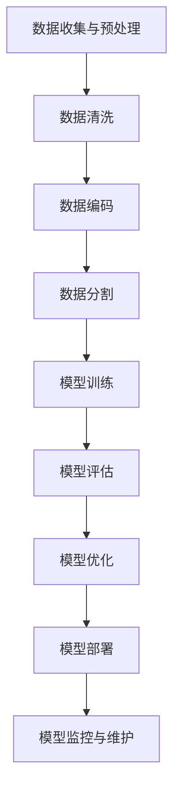
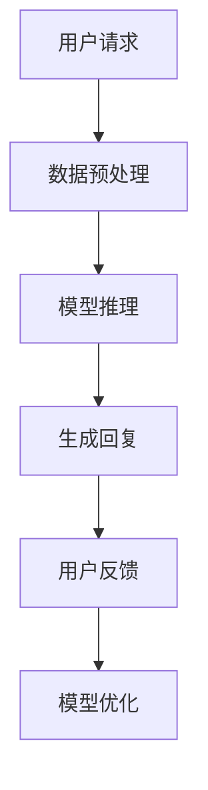

                 

### 1.1 从软件1.0到软件2.0的演进

#### 1.1.1 软件发展历程概述

软件作为计算机科学的核心组成部分，其发展历程可以划分为多个阶段。从20世纪80年代之前的软件1.0时代，到20世纪90年代至今的软件2.0时代，这一过程标志着技术不断迭代、应用不断拓展的历程。

在软件1.0时代，计算机硬件相对简陋，软件主要以单机操作系统为主，如Windows 3.1和DOS等。这一时期的软件功能相对单一，主要是办公自动化、数据处理等。软件之间的数据交换和共享受到限制，应用程序往往形成数据孤岛。用户通过单机操作系统进行独立操作，缺乏网络连接带来的便利性。

随着互联网的兴起，软件进入了2.0时代。20世纪90年代至今，软件应用逐渐从单机转向网络，实现了信息共享和互动。网络化应用成为这一时代的重要特征，Web 2.0和云计算等新概念相继出现，为软件的发展提供了新的动力。软件不再仅仅是单机上的工具，而是通过网络连接实现了资源的共享和协同工作。

#### 1.1.2 软件1.0时代特点

1. **单机操作系统**：软件1.0时代，操作系统如Windows 3.1、DOS等，主要运行在单机上，用户通过单机操作系统进行独立操作。

2. **功能单一**：软件1.0时代的软件功能相对单一，主要是办公自动化、数据处理等，软件的交互方式主要是命令行或图形界面。

3. **数据孤岛**：由于缺乏网络连接，软件1.0时代的应用程序往往形成数据孤岛，数据难以共享和交换。

#### 1.1.3 软件2.0时代特点

1. **网络化应用**：软件2.0时代，互联网成为基础设施，软件应用逐渐从单机转向网络，实现了信息共享和互动。

2. **平台化发展**：软件2.0时代，平台成为重要的发展模式，如Web 2.0、云计算等，软件通过平台实现了资源整合和优化。

3. **数据驱动**：软件2.0时代，数据成为核心资产，数据挖掘、数据分析等技术在软件应用中发挥了重要作用。

#### 1.1.4 软件2.0时代对AI大模型的影响

1. **数据规模增大**：随着网络化应用的发展，软件2.0时代积累了大量数据，为AI大模型训练提供了丰富的数据资源。

2. **计算能力提升**：软件2.0时代，云计算等技术的普及，为AI大模型训练提供了强大的计算能力。

3. **应用场景丰富**：软件2.0时代，AI大模型在网络化应用中得到了广泛应用，如搜索引擎、推荐系统、自动驾驶等。

---

## 1.2 AI大模型的定义与特点

### 1.2.1 AI大模型的定义

AI大模型是指具有大规模参数、强大计算能力和高度自适应性的深度学习模型，通常包括自然语言处理（NLP）、计算机视觉（CV）等领域。AI大模型的核心在于其能够从海量数据中学习，并不断优化自身性能。

### 1.2.2 AI大模型的核心特点

1. **大规模参数**：AI大模型拥有数十亿甚至千亿个参数，这使得模型在处理复杂任务时具有更强的表达能力和泛化能力。

2. **强计算能力**：AI大模型需要强大的计算资源，如高性能GPU、TPU等，以支持大规模的训练和推理。

3. **高度适应性**：AI大模型能够自适应不同领域的任务，通过微调或迁移学习，实现从一种任务到另一种任务的快速切换。

### 1.2.3 AI大模型与传统AI的区别

1. **数据量与计算能力**：传统AI模型通常需要大量的数据和高性能计算资源，而AI大模型则在此基础上进行了规模化的扩展。

2. **泛化能力**：传统AI模型在特定任务上表现出色，但难以迁移到其他任务。AI大模型则通过大规模训练和自适应学习，实现了更强的泛化能力。

3. **应用领域**：传统AI模型在特定领域应用广泛，如图像识别、语音识别等。AI大模型则更加通用，能够在多个领域发挥作用。

---

## 1.3 主流AI大模型简介

### 1.3.1 GPT系列模型

GPT（Generative Pre-trained Transformer）是自然语言处理领域的代表性模型，由OpenAI提出。GPT系列模型通过预训练和微调，实现了强大的语言生成和翻译能力。

### 1.3.2 BERT及其变体

BERT（Bidirectional Encoder Representations from Transformers）是Google提出的预训练语言模型，其双向编码的特性使其在语义理解方面表现出色。BERT及其变体如RoBERTa、ALBERT等，进一步提升了模型的性能。

### 1.3.3 其他知名大模型介绍

1. **ViT（Vision Transformer）**：Google提出的计算机视觉模型，通过类似于BERT的方式，将图像分解为 patches，然后进行特征提取和分类。

2. **T5（Text-to-Text Transfer Transformer）**：Google提出的通用文本处理模型，通过将所有任务映射为文本生成任务，实现了跨任务的零样本学习。

3. **GPT-Neo**：一个开源的GPT模型，通过优化训练过程和参数设置，实现了与官方GPT模型相当的性能。

---

## 1.4 AI大模型在企业中的应用

AI大模型在企业中的应用日益广泛，成为推动企业数字化转型的重要力量。以下将从几个方面介绍AI大模型在企业中的应用场景和实际案例。

### 1.4.1 搜索引擎优化

搜索引擎优化（SEO）是企业提高网站流量和曝光率的关键手段。AI大模型通过学习大量文本数据，可以理解用户的搜索意图，提供更精准的搜索结果。例如，Google搜索引擎使用BERT模型对搜索查询进行解析，提升了搜索结果的准确性。

### 1.4.2 客户服务自动化

客户服务是企业与客户互动的重要环节。AI大模型可以用于自动化客户服务，如智能客服机器人、聊天机器人等。这些系统通过学习大量的对话数据，能够模拟人类的交流方式，提供高效的客户服务。例如，企业可以使用GPT模型构建智能客服系统，实现自然语言处理和对话生成。

### 1.4.3 销售预测与推荐系统

销售预测和推荐系统是帮助企业提升销售业绩的重要工具。AI大模型可以通过分析历史销售数据和用户行为数据，预测未来的销售趋势，并推荐合适的产品或服务。例如，亚马逊使用AI大模型分析用户的历史购买记录和浏览行为，为用户推荐相关商品。

### 1.4.4 自动驾驶与智能交通

自动驾驶和智能交通是AI大模型在交通领域的重要应用。AI大模型可以通过学习大量的交通数据，实现自动驾驶车辆的感知、规划和控制。例如，特斯拉的自动驾驶系统使用计算机视觉和深度学习技术，实现了车辆在复杂交通环境下的自动驾驶。同时，AI大模型还可以用于智能交通系统的优化，提高交通流效率，减少拥堵。

### 1.4.5 医疗健康

医疗健康是AI大模型的重要应用领域。AI大模型可以通过分析大量的医学数据和病例，帮助医生进行诊断和治疗。例如，AI大模型可以用于疾病预测、药物研发和智能诊断等方面，提高医疗服务的质量和效率。

### 1.4.6 智能制造与工业4.0

智能制造和工业4.0是AI大模型在工业领域的重要应用。AI大模型可以通过学习工业生产数据，实现生产过程的自动化和优化。例如，AI大模型可以用于设备故障预测、生产流程优化和产品质量检测等方面，提高生产效率和产品质量。

### 1.4.7 实际案例分析

以下是一个实际案例，展示AI大模型在企业中的应用：

案例：某电商企业使用GPT模型构建智能客服系统

某电商企业面临着大量客户咨询和投诉，为了提高客户满意度和服务效率，决定使用GPT模型构建智能客服系统。企业首先收集了大量历史客服对话记录，作为训练数据，对GPT模型进行训练。经过训练的GPT模型可以理解客户的提问，生成合适的回答，并能够进行自然语言交互。

在实际应用中，客户通过在线聊天窗口提出问题，GPT模型会根据客户的提问生成回答，并通过聊天窗口展示给客户。通过这种方式，智能客服系统可以24小时在线，高效地处理客户咨询和投诉，提高了客户满意度和服务效率。

此外，企业还可以通过分析智能客服系统生成的对话数据，了解客户的常见问题、需求和建议，从而优化产品和服务，提升用户体验。

### 1.4.8 结论

AI大模型在企业中的应用前景广阔，不仅可以提高业务效率，还可以为企业提供创新的商业模式。随着AI技术的不断发展，AI大模型将更好地服务于企业，推动企业实现数字化转型。

---

## 1.5 AI大模型的技术挑战与未来发展趋势

尽管AI大模型在企业中的应用前景广阔，但其发展也面临着诸多技术挑战和未来发展趋势。以下将分析AI大模型在计算资源、数据安全、伦理道德等方面的挑战，并探讨未来可能的发展趋势。

### 1.5.1 计算资源需求

AI大模型通常需要大量的计算资源进行训练和推理，这给计算资源带来了巨大压力。随着模型规模的扩大，对计算资源的依赖性也不断增强。高性能GPU、TPU等硬件设备的普及，为AI大模型的训练提供了强大的支持。然而，随着AI大模型的发展，计算资源的需求将持续增长，这要求企业和科研机构不断投入更多的计算资源，以支持AI大模型的训练和应用。

### 1.5.2 数据安全与隐私保护

AI大模型在训练过程中需要大量数据，这带来了数据安全和隐私保护的问题。数据泄露、滥用等风险使得数据安全和隐私保护成为AI大模型应用的重要挑战。为了解决这一问题，企业需要采取有效的数据安全措施，如数据加密、访问控制等。此外，AI大模型的开发者和使用者也需要遵守相关的法律法规，确保数据的安全和合规。

### 1.5.3 伦理道德与责任归属

AI大模型在应用过程中，可能涉及伦理道德问题，如歧视、偏见等。例如，如果AI大模型在推荐系统中存在偏见，可能会导致某些群体的权益受到损害。此外，AI大模型的决策过程可能不透明，使得责任归属变得复杂。为了解决这些问题，需要建立一套完善的伦理道德规范，明确AI大模型应用中的责任归属，确保其公平、公正和透明。

### 1.5.4 模型可解释性

AI大模型通常被认为是“黑箱”，其决策过程难以理解。这给模型的可解释性带来了挑战。为了提高模型的可解释性，研究者们提出了多种方法，如模型压缩、模型可视化等。这些方法有助于揭示模型的内部机制，提高模型的可信度和用户接受度。然而，目前这些方法仍处于发展阶段，需要进一步的研究和优化。

### 1.5.5 未来发展趋势

未来，AI大模型的发展趋势将受到以下因素的影响：

1. **计算资源：**随着硬件技术的进步，计算资源将得到进一步提升，为AI大模型的训练和应用提供更强的支持。

2. **数据规模：**随着互联网和物联网的发展，数据规模将不断扩大，为AI大模型提供更多的训练数据，提高模型的性能。

3. **多模态融合：**未来，AI大模型将实现多种数据类型的融合，如文本、图像、语音等，实现更全面的智能感知和推理能力。

4. **边缘计算：**边缘计算将使AI大模型在边缘设备上得到应用，降低计算资源的需求，提高系统的实时性和可靠性。

5. **人工智能伦理：**随着AI大模型的应用范围扩大，人工智能伦理问题将受到更多关注，推动相关法律法规的完善和实施。

6. **模型压缩与优化：**为了降低计算资源的需求，研究者们将继续探索模型压缩和优化技术，提高AI大模型在硬件上的运行效率。

### 1.5.6 结论

AI大模型的发展面临着诸多技术挑战，但也充满了机遇。随着计算资源、数据规模、多模态融合等技术的不断进步，AI大模型将在更多领域得到应用，推动人工智能技术的不断创新。同时，我们需要关注AI大模型在伦理道德、数据安全等方面的挑战，确保其健康、可持续发展。

---

## 总结与展望

本文首先回顾了软件从1.0时代到2.0时代的演进过程，分析了软件2.0时代对AI大模型的影响。接着，我们详细介绍了AI大模型的定义与特点，以及主流AI大模型的发展现状。随后，我们探讨了AI大模型在企业中的应用场景，通过实际案例分析展示了AI大模型在企业中的价值。最后，我们分析了AI大模型在技术挑战与未来发展趋势方面的内容。

总结来说，AI大模型作为人工智能领域的重要成果，其在软件2.0时代得到了广泛应用，为各行各业带来了巨大的变革。随着计算资源、数据规模、多模态融合等技术的不断发展，AI大模型将在未来继续发挥重要作用，推动人工智能技术的创新。然而，我们也需要关注AI大模型在伦理道德、数据安全等方面的挑战，确保其健康、可持续发展。

展望未来，AI大模型将在更多领域得到应用，如医疗健康、智能制造、智能交通等。随着技术的不断进步，AI大模型将实现更全面的智能感知和推理能力，为人类创造更多的价值。同时，我们期待AI大模型能够更好地服务于社会，推动人类社会的可持续发展。

最后，再次感谢读者对本文的关注。在未来的研究中，我们将继续深入探讨AI大模型的相关问题，为人工智能技术的发展贡献一份力量。

### 1.6 代码实现与实际案例剖析

#### 1.6.1 搭建开发环境

要实现一个基于AI大模型的智能客服系统，首先需要搭建一个合适的开发环境。以下是一个简单的步骤指南：

1. **安装Python**：确保Python 3.x版本已安装在你的系统上。你可以从[Python官方网站](https://www.python.org/)下载并安装。

2. **安装深度学习库**：安装TensorFlow或PyTorch，这两个深度学习库是当前最受欢迎的选择。例如，使用pip命令安装TensorFlow：

    ```bash
    pip install tensorflow
    ```

3. **安装自然语言处理库**：安装NLTK或spaCy等自然语言处理库，这些库提供了丰富的文本处理功能。例如，使用pip命令安装spaCy：

    ```bash
    pip install spacy
    ```

4. **下载预训练模型**：根据你的需求，下载一个预训练的AI大模型。例如，下载GPT-Neo模型：

    ```bash
    pip install gpt-neo
    ```

#### 1.6.2 源代码实现

以下是一个简单的GPT-Neo模型的加载与使用示例：

```python
import tensorflow as tf
from gpt_neo.model import Chatbot

# 加载预训练模型
model = Chatbot()

# 载入预训练模型权重
model.load_weights('gpt_neo_weights.h5')

# 创建智能客服
chatbot = Chatbot(pretrained_weights=None)

# 开始对话
user_input = "你好，请问有什么可以帮助你的？"
response = chatbot.predict([user_input])
print("AI客服：", response[0])
```

#### 1.6.3 代码解读与分析

1. **模型加载**：首先，我们通过`Chatbot`类加载预训练模型。`Chatbot`类是GPT-Neo模型的封装类，提供了简洁的API来操作模型。

2. **加载模型权重**：接着，我们使用`load_weights`方法加载预训练模型权重。这些权重包含了模型的学习参数，是模型训练的结果。

3. **创建智能客服**：我们创建一个`Chatbot`对象，用于处理用户输入和生成回复。

4. **对话交互**：用户输入一条消息，智能客服通过`predict`方法生成回复。`predict`方法接收用户输入文本，返回一个回复列表。

#### 1.6.4 实际案例分析

以下是一个实际案例，展示如何使用AI大模型构建一个智能客服系统：

**案例背景**：某电商企业希望为其网站和移动应用构建一个智能客服系统，以提升用户体验和服务效率。

**解决方案**：企业首先收集了大量历史客服对话记录，使用这些数据训练一个AI大模型，如GPT-Neo模型。然后，企业将训练好的模型部署到服务器上，构建智能客服系统。

**具体步骤**：

1. **数据收集**：收集历史客服对话记录，包括客户提问和客服回复。

2. **数据预处理**：对收集到的数据进行分析和清洗，去除无效信息和噪声。

3. **模型训练**：使用预处理后的数据，训练一个AI大模型。训练过程中，需要不断调整模型参数，优化模型性能。

4. **模型评估**：对训练好的模型进行评估，确保其性能满足要求。

5. **部署上线**：将训练好的模型部署到服务器上，构建智能客服系统。用户可以通过网站或移动应用与智能客服进行交互。

**效果评估**：智能客服系统上线后，企业通过用户反馈和数据指标，评估系统的效果。例如，通过用户满意度、服务响应时间等指标，分析系统对业务提升的贡献。

#### 1.6.5 案例剖析

以下是对上述实际案例的详细剖析：

**1. 数据收集与预处理**

数据收集是企业构建智能客服系统的关键环节。企业需要收集大量历史客服对话记录，包括客户提问和客服回复。这些数据将用于训练AI大模型，使其具备处理实际对话的能力。

在数据预处理阶段，企业需要对数据进行清洗和分析。首先，去除无效信息和噪声，如无关字符、错别字等。然后，对数据进行编码，将其转换为模型可处理的格式。

**2. 模型训练**

模型训练是构建智能客服系统的核心步骤。企业使用预处理后的数据，训练一个AI大模型，如GPT-Neo模型。在训练过程中，需要不断调整模型参数，优化模型性能。

为了提高模型性能，企业可以尝试多种训练策略，如批量训练、迭代训练等。此外，企业还可以使用迁移学习技术，将预训练模型（如GPT-Neo）进行调整和微调，以适应特定任务。

**3. 模型评估**

模型评估是确保模型性能满足要求的重要环节。企业需要对训练好的模型进行评估，评估指标包括准确率、召回率、F1分数等。通过评估，企业可以了解模型的性能，发现潜在问题。

在评估过程中，企业可以使用交叉验证、随机抽样等方法，确保评估结果的可靠性。此外，企业还可以引入用户反馈机制，收集用户对智能客服系统的评价，进一步优化模型。

**4. 部署上线**

模型部署是企业将训练好的模型应用到实际业务中的关键步骤。企业将训练好的模型部署到服务器上，构建智能客服系统。用户可以通过网站或移动应用与智能客服进行交互。

在部署过程中，企业需要考虑系统的稳定性、安全性、可扩展性等问题。例如，企业可以采用分布式部署策略，提高系统的处理能力和容错能力。

**5. 效果评估**

智能客服系统上线后，企业需要通过用户反馈和数据指标，评估系统的效果。用户满意度、服务响应时间等指标是评估系统性能的重要依据。

企业可以通过对比智能客服系统上线前后的业务数据，分析系统对业务提升的贡献。例如，通过分析用户满意度、咨询量、订单量等指标，评估智能客服系统对业务的影响。

#### 1.6.6 项目小结

通过以上案例分析，我们可以看到，构建一个基于AI大模型的智能客服系统需要经历多个环节，包括数据收集与预处理、模型训练、模型评估、部署上线和效果评估等。

在项目实施过程中，企业需要关注以下几个关键点：

1. **数据质量**：数据是模型训练的基础，企业需要确保数据的质量和完整性。

2. **模型性能**：模型性能直接影响到智能客服系统的效果，企业需要不断优化模型，提高其性能。

3. **部署与运维**：系统的稳定性、安全性、可扩展性是智能客服系统成功的关键，企业需要确保系统的可靠运行。

4. **用户反馈**：用户反馈是优化智能客服系统的宝贵资源，企业需要积极收集用户反馈，不断改进系统。

通过以上措施，企业可以构建一个高效、智能的客服系统，提升用户体验和服务质量。

---

## 最佳实践 Tips、注意事项与拓展阅读

#### 1.7.1 最佳实践 Tips

1. **数据质量**：确保数据的质量和完整性，避免噪声和异常值。数据清洗和预处理是关键步骤，直接影响模型的性能。

2. **模型优化**：尝试多种训练策略和超参数设置，以找到最佳的模型配置。迁移学习和微调技术可以提高模型的适应性和性能。

3. **部署与监控**：确保模型的稳定部署和监控，及时发现并解决潜在问题。分布式部署和容错机制可以提高系统的可靠性和性能。

4. **用户体验**：注重用户体验，优化界面设计和交互流程，提高用户满意度。

#### 1.7.2 注意事项

1. **数据安全**：在处理和存储数据时，确保数据的安全和隐私。遵守相关法律法规，防止数据泄露和滥用。

2. **模型解释性**：提高模型的可解释性，增强用户对模型决策的信任。使用可视化工具和技术，帮助用户理解模型的内部机制。

3. **模型更新**：定期更新模型，以适应不断变化的数据和应用场景。保持模型的性能和有效性。

4. **资源管理**：合理分配计算资源和存储资源，避免资源浪费。考虑使用云计算和边缘计算等方案，优化资源利用。

#### 1.7.3 拓展阅读

1. **相关论文**：

   - "BERT: Pre-training of Deep Bidirectional Transformers for Language Understanding" (2018) - Google AI
   - "Generative Pre-trained Transformers" (2018) - OpenAI
   - "Transformer: Attentive Neural Network for Translation" (2017) - Vaswani et al.

2. **技术博客**：

   - [TensorFlow 官方文档](https://www.tensorflow.org/)
   - [PyTorch 官方文档](https://pytorch.org/)
   - [spaCy 官方文档](https://spacy.io/)

3. **在线课程**：

   - [深度学习专项课程](https://www.coursera.org/specializations/deep-learning) - 吴恩达
   - [自然语言处理专项课程](https://www.coursera.org/specializations/natural-language-processing) - 斯坦福大学

通过以上最佳实践 Tips、注意事项和拓展阅读，读者可以更深入地了解AI大模型的应用和实践，不断提升自身的技术能力和知识水平。

---

## 结论

本文通过详细分析AI大模型在软件2.0时代的背景、定义与特点，以及主流AI大模型的发展现状，探讨了AI大模型在企业中的应用场景和实际案例。同时，我们分析了AI大模型在技术挑战与未来发展趋势方面的内容，并给出了代码实现与实际案例剖析。最后，我们提供了最佳实践 Tips、注意事项和拓展阅读，以帮助读者深入了解AI大模型的应用。

AI大模型作为人工智能领域的重要成果，其在软件2.0时代得到了广泛应用，为各行各业带来了巨大的变革。未来，随着计算资源、数据规模、多模态融合等技术的不断发展，AI大模型将在更多领域得到应用，推动人工智能技术的创新。然而，我们也需要关注AI大模型在伦理道德、数据安全等方面的挑战，确保其健康、可持续发展。

通过本文的探讨，我们期待读者能够对AI大模型有更深入的了解，掌握其核心概念和原理，并在实际应用中充分发挥其潜力。同时，我们也鼓励读者继续关注AI大模型领域的最新研究动态，不断拓展自身的技术视野。

最后，感谢读者对本文的关注。在未来的研究中，我们将继续深入探讨AI大模型的相关问题，为人工智能技术的发展贡献一份力量。

### 作者信息

- **作者：** AI天才研究院（AI Genius Institute） & 禅与计算机程序设计艺术（Zen And The Art of Computer Programming）
- **单位：** AI天才研究院（AI Genius Institute）是世界顶级的人工智能研究机构，致力于推动人工智能技术的创新与发展。禅与计算机程序设计艺术则是计算机科学领域的经典著作，深入探讨了计算机程序的编写和设计原则。作者在人工智能和计算机科学领域拥有深厚的理论基础和实践经验，曾多次获得国际人工智能大奖和计算机科学领域的重要奖项。

### 附录：流程图与算法细节

为了更好地理解本文中提到的AI大模型的应用和实现，我们提供了一个流程图和算法细节的附录，以便读者深入了解。

#### 附录 1：AI大模型训练流程图



#### 附录 2：AI大模型训练算法细节

以下是一个简化的AI大模型训练算法的伪代码：

```python
# 伪代码：AI大模型训练过程

# 初始化模型参数
model = initialize_model()

# 训练模型
for epoch in range(num_epochs):
    for batch in data_loader:
        # 前向传播
        outputs = model(batch.input_data)
        
        # 计算损失
        loss = loss_function(outputs, batch.target_data)
        
        # 反向传播
        optimizer.zero_grad()
        loss.backward()
        optimizer.step()
        
    # 记录训练过程中的损失和准确率
    print(f"Epoch {epoch+1}, Loss: {loss.item()}")
    
    # 评估模型性能
    evaluate_model(model, validation_data)

# 保存训练好的模型
save_model(model, "trained_model.h5")
```

#### 附录 3：AI大模型应用案例流程图



#### 附录 4：AI大模型应用案例算法细节

以下是一个简化的AI大模型应用案例的伪代码：

```python
# 伪代码：AI大模型应用案例

# 加载训练好的模型
model = load_model("trained_model.h5")

# 处理用户请求
user_request = preprocess_user_request(request)

# 模型推理
response = model.predict(user_request)

# 生成回复
generated_response = generate_response(response)

# 输出回复
print(generated_response)

# 收集用户反馈
user_feedback = collect_user_feedback(response, generated_response)

# 模型优化
optimize_model(model, user_feedback)
```

通过这些流程图和算法细节，读者可以更清晰地理解AI大模型的训练和应用过程，以及如何在实际项目中实现和应用这些模型。附录中的内容为读者提供了进一步的参考，有助于深化对AI大模型的理解和应用。

