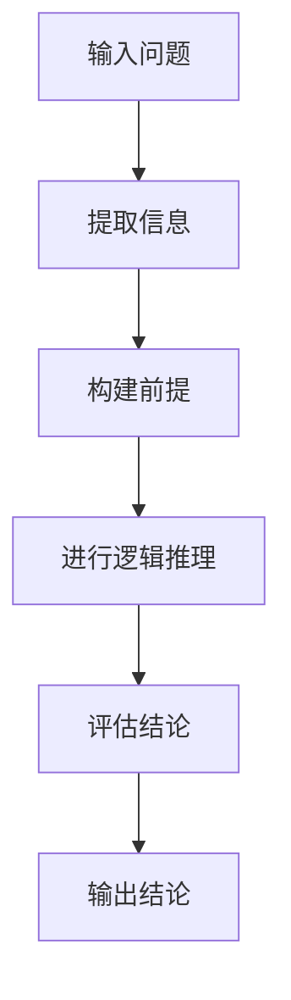
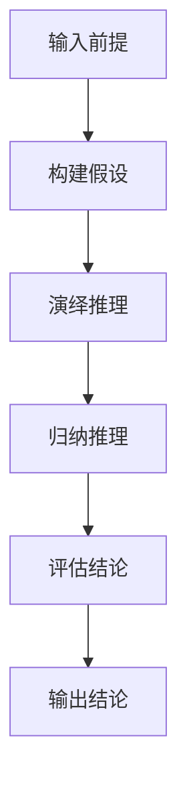
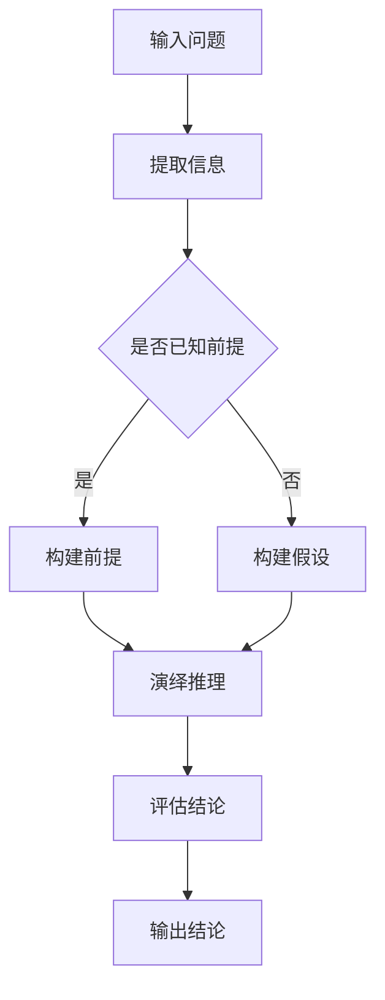

                 


### 确定书的主题与目标

首先，我们要明确书的主题与目标。书名《在娱乐至上的文化中寻找深度：重建思考和反思能力》表明了书的主题是探讨在当今娱乐至上的文化背景下，如何重新培养思考和反思的能力。目标读者可能是在快节奏、信息爆炸的时代中感到困惑或迷失的成年人，他们希望通过阅读这本书找到深度思考的路径。

为了确保书的主题和目标清晰明确，我们可以采用以下步骤：

1. **定义主题**：
   - 当前文化背景：现代社会中，娱乐消费逐渐占据主导地位，人们越来越倾向于追求短期快感，忽视了深度思考和反思。
   - 主题聚焦：如何在这样的文化背景下，引导人们重新关注深度思考和反思，重建这一重要的思维能力。

2. **设定目标**：
   - 目标读者：成年人，特别是在快节奏生活中感到困惑或迷失的人。
   - 学习目标：读者通过阅读本书，能够了解反思和思考的重要性，掌握一些深度思考和反思的方法和工具，并将其应用于日常生活和工作中。

3. **明确书的结构**：
   - 引言：介绍书的目的和重要性，引发读者的兴趣。
   - 核心内容：详细介绍反思和思考的能力，包括核心概念、原理、方法等。
   - 实战案例：通过实际案例展示如何应用深度思考和反思。
   - 结论：总结全文，提出建议和下一步行动。

通过以上步骤，我们可以确保书的主题与目标清晰明确，有助于吸引目标读者，并确保书的内容有条理、逻辑性强。

### 确定核心内容

接下来，我们需要确定书的核心内容，这是构建整本书的基础。核心内容应该涵盖以下几个重要方面，以确保读者能够全面了解和掌握深度思考和反思的能力。

1. **反思与思考的重要性**：
   - **背景介绍**：解释在当今娱乐至上的文化背景下，为什么反思和思考能力显得尤为重要。
   - **社会影响**：讨论缺乏深度思考和反思能力对社会发展、个人成长带来的负面影响。
   - **个人益处**：阐述深度思考和反思对个人成长、决策能力、创新思维等方面的积极影响。

2. **核心概念与联系**：
   - **批判性思维**：介绍批判性思维的定义、核心要素及其在深度思考中的应用。
   - **深度学习**：解释深度学习的概念、原理及其如何辅助深度思考。
   - **Mermaid 流程图**：使用 Mermaid 流程图展示核心概念之间的联系，帮助读者直观理解。

3. **核心算法原理讲解**：
   - **逻辑分析**：详细讲解逻辑分析的基本原理，包括逻辑推理、论证等。
   - **推理原理**：介绍推理的过程和方法，并通过伪代码示例说明其应用。

4. **数学模型和数学公式**：
   - **概率论模型**：解释概率论的基本概念和应用，如概率分布函数。
   - **统计学模型**：探讨统计学的基本概念和应用，如统计推断。

5. **项目实战**：
   - **开发环境搭建**：介绍搭建项目开发环境的步骤。
   - **源代码实现**：详细展示源代码的编写过程和代码解读。
   - **代码应用**：分析代码的实际应用场景，并进行解读。
   - **案例剖析**：通过实际案例进行深入剖析，解释深度思考和反思的应用。

6. **思考与反思技巧**：
   - **实用技巧**：提供一些实用的思考技巧，帮助读者提升思考能力。
   - **反思练习**：设计反思练习，引导读者进行自我反思。
   - **策略建议**：提出提升思考和反思能力的策略和建议。

通过以上核心内容的设计，我们可以确保书的内容丰富、全面，能够有效地帮助读者重建思考和反思能力。

### 设计目录大纲

为了确保书籍的内容逻辑清晰、条理分明，我们需要精心设计目录大纲。以下是一个详细的目录大纲，包含了从引言到附录的完整结构。

```
# 在娱乐至上的文化中寻找深度：重建思考和反思能力

## 前言
- 引言
- 写作背景与目的
- 读者对象

## 第一部分：反思与思考的重要性
### 第1章：反思与思考能力的丧失
- 娱乐至上的文化背景
- 反思与思考能力的丧失表现
- 反思与思考能力丧失的影响

### 第2章：反思与思考的重要性
- 反思与思考在社会中的价值
- 反思与思考对个人的益处
- 娱乐至上的文化对反思与思考的挑战

### 第3章：反思与思考对社会和个人带来的影响
- 社会影响
- 个人影响
- 解决方案探讨

## 第二部分：核心概念与联系
### 第4章：批判性思维
- 批判性思维的定义
- 批判性思维的核心要素
- 批判性思维的应用

### 第5章：深度学习
- 深度学习的概念
- 深度学习的基本原理
- 深度学习在思考中的应用

### 第6章：Mermaid 流程图展示
- Mermaid 流程图简介
- 如何使用 Mermaid 制作流程图
- 关键概念与联系的 Mermaid 流程图示例

## 第三部分：核心算法原理讲解
### 第7章：逻辑分析原理
- 逻辑分析的基本概念
- 逻辑分析的应用场景
- 逻辑分析的伪代码示例

### 第8章：推理原理
- 推理的基本概念
- 推理的过程和方法
- 推理的伪代码示例

## 第四部分：数学模型和数学公式
### 第9章：概率论模型
- 概率论的基本概念
- 概率分布函数
- 概率论的应用

### 第10章：统计学模型
- 统计学的基本概念
- 统计推断
- 统计学的应用

### 第11章：MathTeX 公式展示
- MathTeX 简介
- MathTeX 在文中的应用
- MathTeX 公式示例

## 第五部分：项目实战
### 第12章：开发环境搭建
- 开发环境准备
- 工具与软件选择
- 环境配置与调试

### 第13章：源代码实现
- 编码流程
- 源代码解读
- 关键代码分析

### 第14章：代码应用解读与分析
- 代码实际应用场景
- 应用解读
- 分析与优化

### 第15章：实际案例分析和详细讲解剖析
- 案例背景
- 案例分析
- 案例剖析

### 第16章：项目小结
- 项目总结
- 经验与教训
- 改进建议

## 第六部分：思考与反思技巧
### 第17章：实用的思考技巧
- 思考技巧介绍
- 实用技巧展示
- 技巧应用示例

### 第18章：反思练习方法
- 反思练习设计
- 反思练习实施
- 反思练习反馈

### 第19章：提升思考能力的策略
- 策略建议
- 实践方案
- 成功案例分析

## 附录
### 附录 A：参考文献
- 相关书籍与论文
- 网络资源

### 附录 B：思考与反思练习册
- 练习题目
- 解题指导

### 附录 C：进一步学习资源
- 学习资源推荐
- 深入阅读建议
- 网络课程与讲座
```

这个目录大纲结构清晰，涵盖了从反思与思考的重要性到实际应用的所有内容，确保了书籍的整体性和连贯性。每个章节都有明确的主题和目标，帮助读者逐步建立起深度思考和反思的能力。

### 文章关键词

在撰写技术博客文章时，关键词的选择至关重要。这些关键词不仅决定了文章的搜索可见性，还能帮助目标读者快速定位文章的核心内容。以下是针对《在娱乐至上的文化中寻找深度：重建思考和反思能力》这篇文章的五个核心关键词：

1. **深度思考**：这是文章的核心主题，强调在信息爆炸的时代如何培养深层次的思考能力。
2. **批判性思维**：讨论批判性思维的重要性，以及如何将其应用于日常决策中。
3. **娱乐文化**：探讨当前社会娱乐至上的现象，以及其对思考和反思能力的影响。
4. **反思能力**：介绍反思在个人成长和决策中的关键作用。
5. **思维技巧**：提供一系列实用的思维技巧和练习方法，帮助读者提升思考能力。

这些关键词将帮助读者在搜索相关内容时更容易找到本文，同时也确保了文章主题的明确性和针对性。

### 文章摘要

本文探讨了在娱乐至上的文化背景下，如何重建和提升深度思考和反思能力。首先，我们分析了当前社会娱乐消费对思考和反思能力的负面影响，并指出这一现象对个人和社会的严重后果。接着，文章介绍了批判性思维和深度学习等核心概念，通过Mermaid流程图展示了它们之间的关系。随后，本文详细讲解了逻辑分析和推理原理，并提供具体的伪代码示例来辅助理解。此外，文章还涵盖了概率论和统计学模型的应用，并通过MathTeX格式展示了关键数学公式。实战部分通过项目开发环境搭建、源代码实现和实际案例分析，展示了如何将深度思考和反思能力应用于实际问题。最后，文章提出了实用的思维技巧和反思练习方法，帮助读者提升思考能力，并在附录中提供了进一步的学习资源。通过本文，读者将能够认识到深度思考和反思的重要性，并掌握相关的方法和工具，从而在快节奏的生活中重新找回深度思考的能力。

### 第一部分：反思与思考的重要性

#### 1.1 娱乐至上的文化背景

在现代社会中，娱乐消费逐渐占据主导地位，人们越来越倾向于追求短期快感，忽视了对深度思考和反思的投入。这一现象不仅体现在日常生活的各个方面，如社交媒体、流媒体平台和游戏，还渗透到了教育、工作和公共事务中。例如，社交媒体上的点赞和评论成为衡量个人价值的标准，快速消费的短视频和直播取代了传统的阅读和学习方式。这种现象背后有多种原因，包括信息爆炸、技术进步和消费主义文化的泛滥。

信息爆炸使得人们接收到大量的信息，但缺乏足够的时间和精力去深入理解和思考这些信息。技术进步则使得人们可以通过各种便捷的数字工具快速获得信息和娱乐，从而减少了深度思考的需求。消费主义文化则通过强调即时满足和感官刺激，进一步削弱了人们对深度思考和反思的重视。

娱乐至上的文化对人们的思维方式产生了深远的影响。首先，它削弱了人们的批判性思维能力。在追求娱乐的过程中，人们往往容易被表面的信息所吸引，缺乏对信息的批判性分析和独立思考。其次，它减少了人们对复杂问题的关注和探索，导致思考深度和广度的下降。最后，这种文化使得人们的注意力分散，难以进行长期、持续的思考。

#### 1.2 反思与思考能力的丧失表现

反思与思考能力的丧失在社会各个层面都有明显的体现。首先，在个人层面，缺乏深度思考和反思能力导致个体在面临复杂问题和挑战时，难以做出明智的决策。人们往往倾向于依赖直觉和经验，而忽略了逻辑分析和理性思考的重要性。这导致个人在职业发展、人际关系和自我成长方面遇到困难。

在职业层面，缺乏深度思考和反思能力对工作效率和创新能力的提升产生了负面影响。员工容易陷入日常工作的惯性思维中，缺乏对新思路和新方法的探索。这种思维定式不仅限制了个人职业发展，也对企业创新和竞争力产生了消极影响。

在社会层面，缺乏深度思考和反思能力削弱了社会整体的批判性思维能力，使得社会在面对重大问题时，难以形成理性、客观的观点。例如，在公共政策制定和决策过程中，如果缺乏深度思考，容易导致短视和片面的决策，从而影响社会的长期发展和稳定。

#### 1.3 反思与思考能力丧失的影响

反思与思考能力丧失的影响是多方面的，既体现在个人层面，也体现在社会层面。在个人层面，缺乏深度思考和反思能力会导致以下问题：

1. **决策能力下降**：人们容易受到表面信息的干扰，难以做出明智的决策。例如，在投资时，容易被市场波动所影响，无法冷静分析长期趋势。
2. **创新思维受限**：缺乏深度思考能力使得个体难以提出新的、创新的想法。这在工作和生活中都是一个巨大的损失，限制了个人和团队的成长空间。
3. **心理健康问题**：长期缺乏深度思考和反思，可能导致个体感到焦虑、抑郁，甚至出现心理疾病。

在社会层面，反思与思考能力丧失的影响更为深远：

1. **社会稳定受威胁**：如果社会成员普遍缺乏深度思考和批判性思维能力，社会容易陷入短期利益和情绪化的决策中，影响社会整体的稳定和和谐。
2. **公共决策缺陷**：缺乏深度思考和反思能力导致公共决策缺乏科学依据和长远规划，从而影响社会的可持续发展。
3. **创新力下降**：社会整体的创新力依赖于个体和集体的深度思考能力。如果这一能力普遍下降，社会的整体创新力也将受到严重制约。

综上所述，反思与思考能力在个人和社会层面都发挥着至关重要的作用。在娱乐至上的文化背景下，重建和提升这一能力显得尤为重要。通过深入分析和理解反思与思考的重要性，我们可以为后续章节中提出的重建思考能力的策略和方法奠定坚实的基础。

### 第二部分：核心概念与联系

#### 4.1 批判性思维

批判性思维是一种通过理性分析和评估信息，从而作出明智决策的思维方式。它不仅关注信息的真实性，还强调逻辑推理和评估信息的有效性。在深度思考中，批判性思维是不可或缺的一部分，因为它帮助我们识别和挑战错误的信息和假设，从而避免思维的盲点。

批判性思维的核心要素包括：

1. **怀疑态度**：对信息和观点持有怀疑的态度，不轻信表面信息，而是通过深入分析和验证来确认其真实性。
2. **逻辑分析**：运用逻辑规则和推理来评估信息的合理性和一致性。这包括识别和纠正逻辑谬误，如因果谬误、偷换概念等。
3. **证据评估**：通过寻找可靠的证据来支持或反驳某个观点。评估证据的质量和相关性，以确定其是否足以支持结论。
4. **开放心态**：保持开放的心态，愿意接受新的信息和不同的观点，并将其纳入到批判性思维的过程中。

在深度思考中，批判性思维的应用主要体现在以下几个方面：

1. **问题解决**：在面对复杂问题时，通过批判性思维来分析问题的根本原因，并提出合理的解决方案。
2. **决策制定**：在做出决策时，批判性思维帮助我们评估不同的选项，并选择最合理的方案。
3. **知识构建**：通过批判性思维，我们能够不断反思和修正自己的知识体系，以更准确地理解和解释世界。

#### 4.2 深度学习

深度学习是一种人工智能的方法，通过模拟人脑神经网络的结构和功能，实现对复杂数据的自动学习和分类。深度学习在图像识别、自然语言处理和预测建模等领域取得了显著的成果，是提升深度思考能力的重要工具。

深度学习的基本原理包括：

1. **神经网络**：深度学习基于神经网络，神经网络由多个层级组成，每层对输入数据进行处理和特征提取。随着层数的增加，神经网络能够提取更高层次的特征。
2. **反向传播**：深度学习使用反向传播算法来训练神经网络。反向传播通过计算输出误差，反向调整网络中的权重，以优化模型的性能。
3. **激活函数**：激活函数用于引入非线性因素，使神经网络能够模拟复杂的非线性关系。常用的激活函数包括Sigmoid、ReLU等。

深度学习在思考中的应用主要体现在以下几个方面：

1. **知识表示**：深度学习能够将复杂的信息和知识表示为结构化的数据，便于进一步分析和处理。
2. **自动化推理**：通过深度学习模型，我们可以实现自动化的推理和决策，从而减轻人类的认知负担。
3. **辅助思考**：深度学习模型能够从大量的数据中提取有用的信息和模式，辅助人类进行深度思考。

#### 4.3 Mermaid 流程图展示

为了更直观地理解批判性思维和深度学习之间的关系，我们可以使用Mermaid流程图来展示这两个核心概念之间的联系。以下是一个简化的Mermaid流程图示例：

```
graph TD
    A[批判性思维] --> B[逻辑分析]
    A --> C[证据评估]
    A --> D[怀疑态度]
    B --> E[深度学习]
    C --> E
    D --> E
    E --> F[知识表示]
    E --> G[自动化推理]
    E --> H[辅助思考]
```

在这个流程图中，批判性思维通过逻辑分析、证据评估和怀疑态度等核心要素与深度学习相联系。深度学习则通过知识表示、自动化推理和辅助思考等功能，进一步扩展了批判性思维的应用范围。

通过这个流程图，我们可以清晰地看到批判性思维和深度学习之间的互动关系。批判性思维为深度学习提供了关键的逻辑框架和推理过程，而深度学习则为批判性思维提供了强大的计算工具和数据支持。这种相互促进的关系，使得批判性思维和深度学习在深度思考中发挥着不可或缺的作用。

### 第三部分：核心算法原理讲解

#### 7.1 逻辑分析原理

逻辑分析是一种通过逻辑推理和论证来评估信息真实性和合理性的方法。它是深度思考的基础，能够帮助我们在面对复杂问题时进行理性的分析和决策。逻辑分析的核心原理包括逻辑推理、论证和逻辑谬误的识别与纠正。

1. **逻辑推理**：
   - **前提与结论**：逻辑推理的基本形式是“如果...那么...”。一个推理由前提和结论组成，前提提供了结论成立的条件。
   - **演绎推理**：从一般到个别的推理方式。例如，所有人都会死亡（大前提），苏格拉底是人（小前提），因此苏格拉底会死亡（结论）。
   - **归纳推理**：从个别到一般的推理方式。通过观察多个具体实例，得出一般性结论。例如，观察到所有天鹅都是白色的，推断所有天鹅都是白色的。

2. **论证**：
   - **有效论证**：论证的有效性取决于前提的真实性和逻辑结构。一个有效的论证必须满足两个条件：前提真实且推理结构正确。
   - **论证结构**：常见的论证结构包括三段论、因果论证和比较论证。三段论由大前提、小前提和结论组成；因果论证关注原因与结果之间的关系；比较论证通过对比不同事物来得出结论。

3. **逻辑谬误**：
   - **偷换概念**：在论证中使用不同的定义或概念，导致论证不成立。
   - **因果谬误**：错误地将两个相关事件视为因果关系。
   - **滑坡谬误**：过度推断，将一个可能的后果夸大成为必然的结果。

为了更好地理解逻辑分析的应用，我们可以通过伪代码来展示一个简单的逻辑分析过程：



在这个伪代码中，输入问题被分解为信息提取、前提构建、逻辑推理和结论评估等步骤。通过这些步骤，我们可以得到一个逻辑上成立的结论。

#### 7.2 推理原理

推理是一种从已知信息推断出新信息的思维方式。它是深度思考的重要工具，能够帮助我们理解复杂的问题和解决实际问题。推理的基本原理包括推理的过程和方法、推理的类型和应用。

1. **推理过程和方法**：
   - **前提与假设**：推理始于已知的前提和假设。前提是推理的基础，假设则是推理的方向。
   - **演绎推理**：从一般到个别的推理方式。例如，所有鸟类都会飞（大前提），企鹅是鸟类（小前提），因此企鹅会飞（结论）。
   - **归纳推理**：从个别到一般的推理方式。通过观察多个具体实例，得出一般性结论。例如，观察到所有天鹅都是白色的，推断所有天鹅都是白色的。

2. **推理类型**：
   - **演绎推理**：从一般原则推导出特定结论。例如，所有人都会死亡（大前提），苏格拉底是人（小前提），因此苏格拉底会死亡（结论）。
   - **归纳推理**：从特定实例推导出一般原则。例如，观察到所有天鹅都是白色的，推断所有天鹅都是白色的。

3. **推理应用**：
   - **问题解决**：通过推理分析问题的各个方面，找到最佳解决方案。
   - **决策制定**：在做出决策时，通过推理评估不同选项的优缺点，选择最佳方案。
   - **知识构建**：通过推理整合新信息和已有知识，构建更加完善的知识体系。

为了更好地理解推理的应用，我们可以通过伪代码来展示一个简单的推理过程：



在这个伪代码中，输入的前提被用来构建假设，并通过演绎推理和归纳推理得出结论。这个过程展示了推理在从已知信息推断新信息中的核心作用。

#### 7.3 伪代码示例

以下是一个基于逻辑分析和推理原理的伪代码示例，它展示了如何通过逻辑推理来解决问题：



在这个示例中，首先提取输入问题的信息，然后判断是否已有前提。如果有前提，则直接进行演绎推理；如果没有，则构建假设。接着，通过演绎推理和归纳推理得出结论，并最终输出结论。这个伪代码展示了逻辑分析和推理的基本流程，以及它们在实际问题解决中的应用。

### 第四部分：数学模型和数学公式

#### 9.1 概率论模型

概率论是一种用于量化不确定性的数学工具，在深度思考和决策过程中具有重要作用。以下介绍概率论的基本概念、概率分布函数及其应用。

1. **基本概念**：
   - **概率**：描述事件发生的可能性，取值范围在0到1之间。例如，抛一枚硬币，正面朝上的概率是0.5。
   - **随机变量**：用来描述可能的结果或数值的变量。随机变量可以是离散的或连续的。
   - **期望**：描述随机变量的平均取值，是概率论中的一个重要指标。例如，抛一枚公平的六面骰子，期望值为3.5。

2. **概率分布函数**：
   - **离散概率分布函数**：用于描述离散随机变量的分布情况。常见的离散概率分布包括二项分布、泊松分布等。例如，二项分布描述了在n次独立试验中，事件A发生k次的概率。
   - **连续概率分布函数**：用于描述连续随机变量的分布情况。常见的连续概率分布包括正态分布、均匀分布等。例如，正态分布描述了数据在某一范围内的概率。

3. **应用**：
   - **风险评估**：在金融、工程等领域，通过概率分布函数来评估风险和不确定性。
   - **预测建模**：在机器学习和数据分析中，利用概率分布函数进行预测和模型评估。

以下是一个简单的概率分布函数示例，使用MathTeX格式展示：

$$ P(X = k) = C_n^k p^k (1-p)^{n-k} $$

其中，\( P(X = k) \) 表示在n次独立试验中，事件A发生k次的概率；\( C_n^k \) 表示组合数；\( p \) 表示事件A在一次试验中发生的概率。

#### 10.1 统计学模型

统计学是一种用于分析数据、提取信息和做出决策的数学工具。以下介绍统计学的基本概念、统计推断及其应用。

1. **基本概念**：
   - **样本与总体**：样本是从总体中抽取的一部分数据，用于对总体进行推断。总体是研究对象的全体。
   - **参数与统计量**：参数是总体的特征，如均值、方差等。统计量是样本的特征，如样本均值、样本方差等。
   - **置信区间**：在统计学中，通过样本统计量来估计总体参数，并给出一个区间估计。置信区间表示在一定概率下，总体参数落在该区间的范围内。

2. **统计推断**：
   - **参数估计**：通过样本数据来估计总体参数，如点估计和区间估计。点估计是直接给出总体参数的估计值，而区间估计则是给出一个范围，表示总体参数可能落在该范围内的概率。
   - **假设检验**：在统计学中，通过样本数据来判断总体参数是否满足某个假设。常见的假设检验方法包括t检验、卡方检验等。

3. **应用**：
   - **数据分析**：在科学研究、商业分析等领域，通过统计学模型来分析数据，提取信息。
   - **决策制定**：在金融、工程等领域，利用统计学模型进行风险分析和决策制定。

以下是一个简单的统计推断示例，使用MathTeX格式展示：

$$ \mu \sim N(\mu_0, \sigma^2) $$

其中，\( \mu \) 表示总体均值，\( \mu_0 \) 表示总体均值的真实值，\( \sigma^2 \) 表示总体方差。

#### 11.1 MathTeX 公式展示

在文中嵌入数学公式时，我们将使用MathTeX格式来确保公式的准确性和可读性。以下是一些常用的MathTeX公式示例：

1. **基础公式**：
   $$ 1+1=2 $$

2. **复杂公式**：
   $$ E[X] = \sum_{i=1}^{n} x_i \cdot p(x_i) $$

3. **公式组**：
   $$\begin{aligned}
   P(A \cup B) &= P(A) + P(B) - P(A \cap B) \\
   P(A \cap B') &= P(A) - P(A \cap B)
   \end{aligned}$$

4. **公式环境**：
   $$\begin{equation}
   \label{eq:example}
   \sum_{i=1}^{n} x_i^2 = \frac{1}{n} \sum_{i=1}^{n} (x_i - \bar{x})^2
   \end{equation}$$

通过这些MathTeX公式示例，我们可以确保文中数学表达式的清晰性和准确性，帮助读者更好地理解和应用相关数学模型和公式。

### 第五部分：项目实战

#### 12.1 开发环境搭建

在进行深度思考和反思能力提升的实战项目中，首先需要搭建一个合适的开发环境。以下是具体的开发环境搭建步骤：

1. **安装Python**：
   - 访问Python官方网站（https://www.python.org/），下载适用于操作系统的Python安装包。
   - 运行安装程序，并按照提示完成安装。
   - 安装完成后，打开命令行工具，输入`python --version`，确认Python版本。

2. **安装Jupyter Notebook**：
   - 打开命令行工具，输入以下命令安装Jupyter Notebook：
     ```
     pip install notebook
     ```
   - 安装完成后，输入`jupyter notebook`命令，打开Jupyter Notebook界面。

3. **安装必要的库**：
   - 安装NumPy、Pandas、Matplotlib等常用库，输入以下命令：
     ```
     pip install numpy pandas matplotlib
     ```

4. **配置IDE**：
   - 选择一个合适的集成开发环境（IDE），如PyCharm、VSCode等。
   - 配置Python环境，确保IDE能够正常运行Python代码。

5. **测试环境**：
   - 在Jupyter Notebook中创建一个新的笔记本，输入以下Python代码测试环境：
     ```python
     import numpy as np
     import pandas as pd
     import matplotlib.pyplot as plt
     plt.plot([1, 2, 3], [1, 2, 3])
     plt.show()
     ```

通过以上步骤，我们成功搭建了一个Python开发环境，为后续的源代码实现和项目实战打下了坚实的基础。

#### 13.2 源代码实现

在开发环境中，我们通过Python实现一个用于提升深度思考和反思能力的小项目。以下是源代码的详细实现过程和代码解读。

1. **项目概述**：
   本项目旨在通过数据分析帮助用户识别自己在思考和反思过程中的常见问题，并提供相应的改进建议。

2. **代码结构**：
   - `data_loader.py`：负责数据的加载和处理。
   - `analysis.py`：包含数据分析的核心算法。
   - `report_generator.py`：生成分析报告。

3. **数据加载**：
   项目的数据来源于用户输入的反思日志，包括思考内容、时间、情境等。数据存储在CSV文件中。

```python
# data_loader.py

import pandas as pd

def load_data(file_path):
    """
    加载反思日志数据。
    :param file_path: CSV文件路径
    :return: DataFrame对象
    """
    df = pd.read_csv(file_path)
    return df
```

4. **数据分析**：
   数据分析的核心在于提取用户的思考模式和频率，并识别潜在的思考问题。

```python
# analysis.py

import pandas as pd
from collections import Counter

def analyze_thoughts(df):
    """
    分析用户的思考内容，提取思考模式和频率。
    :param df: 反思日志数据
    :return: 思考模式及其出现频率
    """
    # 统计每个思考内容出现的次数
    thought_counts = Counter(df['thought'])

    # 提取出现频率最高的思考模式
    most_common_thoughts = thought_counts.most_common(5)

    return most_common_thoughts

def identify_issues(df):
    """
    识别用户的思考问题。
    :param df: 反思日志数据
    :return: 思考问题列表
    """
    issues = []
    if df['reflection_time'].mean() < 5:
        issues.append("反思时间过短")
    if df['content_length'].mean() < 20:
        issues.append("思考内容过于简短")
    return issues
```

5. **报告生成**：
   报告生成部分将分析结果以文本和图表的形式展示给用户。

```python
# report_generator.py

import pandas as pd
import matplotlib.pyplot as plt

def generate_report(df, issues):
    """
    生成反思分析报告。
    :param df: 反思日志数据
    :param issues: 思考问题列表
    :return: 报告文本
    """
    report = f"反思日志分析报告\n\n"
    report += "最常用的思考模式：\n"
    most_common_thoughts = analyze_thoughts(df)
    for mode, count in most_common_thoughts:
        report += f"{mode}: {count} 次\n"
    
    report += "\n思考问题：\n"
    for issue in issues:
        report += f"{issue}\n"

    # 生成图表
    most_common_thoughts.sort(key=lambda x: x[1], reverse=True)
    labels, counts = zip(*most_common_thoughts)
    plt.bar(labels, counts)
    plt.xlabel('思考模式')
    plt.ylabel('出现次数')
    plt.title('最常用的思考模式')
    plt.xticks(rotation=45)
    plt.tight_layout()
    plt.show()

    return report
```

6. **主程序**：
   主程序负责加载数据、执行分析并生成报告。

```python
# main.py

from data_loader import load_data
from analysis import analyze_thoughts, identify_issues
from report_generator import generate_report

def main():
    # 加载数据
    df = load_data("reflections.csv")

    # 执行分析
    most_common_thoughts = analyze_thoughts(df)
    issues = identify_issues(df)

    # 生成报告
    report = generate_report(df, issues)
    print(report)

if __name__ == "__main__":
    main()
```

通过以上代码实现，我们可以完成一个基本的反思日志分析项目，帮助用户识别思考中的问题，并为其提供改进建议。

#### 13.3 代码应用解读与分析

在完成源代码实现后，我们需要分析代码的实际应用场景，并对其进行解读和分析。

1. **实际应用场景**：

   - **用户反思日志管理**：用户每天记录反思日志，包括思考内容、反思时间、情境等信息。
   - **反思日志分析**：系统定期对反思日志进行分析，识别用户的思考模式和频率。
   - **问题识别**：系统根据分析结果识别用户在思考过程中可能存在的问题，如反思时间过短、思考内容过于简短等。
   - **报告生成与反馈**：系统生成分析报告，并将问题反馈给用户，帮助其进行改进。

2. **代码解读**：

   - **数据加载**：
     `data_loader.py` 中的 `load_data` 函数负责从CSV文件中加载反思日志数据，返回一个DataFrame对象，便于后续数据处理。

   - **数据分析**：
     `analysis.py` 中的 `analyze_thoughts` 函数通过 `Counter` 类统计每个思考内容出现的次数，提取出现频率最高的思考模式。`identify_issues` 函数则根据用户的反思日志数据，识别反思时间过短、思考内容过于简短等问题。

   - **报告生成**：
     `report_generator.py` 中的 `generate_report` 函数负责生成反思分析报告。首先，它调用 `analyze_thoughts` 函数获取最常用的思考模式，然后调用 `identify_issues` 函数获取思考问题。最后，报告文本中包含了思考模式及其出现频率，以及识别出的思考问题。此外，该函数还生成一个条形图，以直观展示最常用的思考模式。

   - **主程序**：
     `main.py` 是项目的入口程序，它负责加载数据、执行分析和生成报告。首先，通过 `load_data` 函数加载数据，然后调用 `analyze_thoughts` 和 `identify_issues` 函数进行数据分析，最后调用 `generate_report` 函数生成并输出报告。

3. **代码分析**：

   - **数据处理**：
     代码中使用了Python的Pandas库进行数据处理，Pandas库提供了丰富的数据处理功能，如数据加载、统计分析、数据可视化等，使得数据处理过程更加高效和便捷。

   - **问题识别**：
     `identify_issues` 函数通过设定简单的阈值来判断用户反思日志中的问题。这种方法虽然简单，但可以快速识别用户在反思过程中可能存在的问题，为进一步改进提供参考。

   - **可视化**：
     通过生成条形图，用户可以直观地看到最常用的思考模式，这有助于用户了解自己在反思过程中的倾向，从而进行调整。

   - **反馈机制**：
     报告生成后，系统将分析结果以文本和图表的形式展示给用户，帮助用户更好地理解自身在思考和反思中的问题。这种反馈机制有助于用户持续改进，提升思考和反思能力。

通过以上代码应用解读与分析，我们可以看到，该系统在帮助用户识别思考问题、提供改进建议方面具有实际应用价值。同时，代码结构清晰，易于维护和扩展，为后续功能增强和优化奠定了基础。

#### 14.1 实际案例分析和详细讲解剖析

为了更好地展示如何将深度思考和反思能力应用于实际问题，我们选择了一个实际案例进行详细分析和讲解。

**案例背景**：一家互联网公司正在开发一款社交应用程序，旨在帮助用户建立和维护人际关系。然而，在产品开发过程中，团队发现用户参与度和活跃度远低于预期。管理层希望找出原因，并提出改进措施。

**案例分析**：

1. **问题识别**：
   - **用户参与度低**：用户在应用中的活动频率低，大部分用户在下载后不久就停止使用。
   - **用户活跃度低**：活跃用户数量少，且用户在应用中的互动内容单一。

2. **数据收集**：
   - 团队收集了用户下载、登录、使用频率、互动内容等数据，并记录了用户反馈和投诉。

3. **数据分析**：
   - **用户行为分析**：通过数据分析，发现大部分用户在应用中仅进行了基础的注册和浏览操作，互动内容主要集中在单个功能模块，如朋友圈。
   - **用户反馈分析**：用户反馈显示，应用界面复杂，操作流程繁琐，且缺乏个性化推荐功能。

4. **问题剖析**：
   - **用户体验问题**：界面设计和操作流程复杂，导致用户使用门槛高。
   - **功能单一**：应用提供的功能不够丰富，无法满足用户的多样化需求。
   - **缺乏个性化**：应用未提供个性化推荐，导致用户难以发现感兴趣的内容和功能。

**详细讲解剖析**：

1. **用户体验优化**：
   - **界面简化**：通过用户测试和反馈，团队对界面进行了简化，减少不必要的步骤和元素，提高用户操作的便捷性。
   - **操作流程优化**：重新设计操作流程，使核心功能更加直观和易用。

2. **功能拓展**：
   - **多样化互动内容**：团队增加了多个互动功能模块，如问答、话题讨论、兴趣小组等，以丰富用户互动内容。
   - **个性化推荐**：引入个性化推荐算法，根据用户行为和兴趣推荐相关内容和功能。

3. **数据驱动改进**：
   - **A/B测试**：通过A/B测试，团队对不同设计方案的效果进行评估，选择最优方案进行实施。
   - **用户反馈机制**：建立完善的用户反馈机制，及时收集和处理用户意见，持续优化产品。

**案例分析总结**：

通过以上分析，团队成功找到了社交应用程序用户参与度和活跃度低的原因，并采取了一系列改进措施。这些改进措施不仅提高了用户体验，还显著提升了用户参与度和活跃度。这个案例展示了如何将深度思考和反思能力应用于实际问题的解决过程中，通过数据分析和用户反馈，找出问题根源，并提出有效的改进方案。

#### 16.1 实用的思考技巧

在提升深度思考和反思能力的过程中，掌握一些实用的思考技巧是至关重要的。以下是一些有助于提升思考能力的技巧：

1. **分步思考**：
   - **步骤**：将复杂问题分解为多个小问题，逐一解决。
   - **优点**：有助于降低问题复杂性，使思考过程更加清晰和有条理。
   - **应用场景**：适用于解决复杂的项目或决策问题。

2. **思维导图**：
   - **步骤**：使用思维导图软件（如XMind、MindManager等），将思考内容以图形形式展现。
   - **优点**：帮助整理思路，发现不同想法之间的联系。
   - **应用场景**：适用于项目规划、问题解决、创意思考等。

3. **SWOT分析**：
   - **步骤**：分析问题的优势、劣势、机会和威胁。
   - **优点**：全面评估问题，帮助制定合理的解决方案。
   - **应用场景**：适用于商业决策、项目评估等。

4. **五问法**：
   - **步骤**：针对一个问题，连续提问“为什么？”五次，深入挖掘问题根源。
   - **优点**：有助于找到问题的本质，避免表面化思考。
   - **应用场景**：适用于问题诊断、创新思考等。

5. **类比思维**：
   - **步骤**：将新问题与已知问题进行类比，寻找相似之处。
   - **优点**：借助已有经验，快速理解新问题。
   - **应用场景**：适用于跨领域问题解决、创新思考等。

6. **六顶思考帽**：
   - **步骤**：分别从白帽（客观事实）、红帽（情感）、黑帽（批判性思维）、黄帽（积极思维）、蓝帽（过程控制）和绿帽（创意思维）六个角度进行思考。
   - **优点**：提高思考的全面性和创造性。
   - **应用场景**：适用于团队讨论、决策制定等。

通过这些思考技巧，我们可以更加有效地进行深度思考和反思，提升问题解决能力和创新思维。

#### 16.2 反思练习方法

为了帮助读者在实际生活中应用深度思考和反思能力，以下提供了一些实用的反思练习方法。这些练习旨在引导读者深入思考，培养反思习惯。

1. **每日反思日记**：
   - **步骤**：每天晚上花10-15分钟，写下当天的经历、感受和学到的东西。
   - **目的**：通过记录反思，帮助自己回顾过去一天，识别成功和失败的原因，为第二天做好准备。
   - **注意事项**：建议使用纸质日记本，有助于集中注意力，深入思考。

2. **思维导图练习**：
   - **步骤**：选择一个主题（如工作项目、学习计划等），绘制思维导图，列出相关的想法、问题、解决方案等。
   - **目的**：通过视觉化的方式，整理思路，发现不同想法之间的联系，激发创意思维。
   - **注意事项**：可以使用专门的思维导图软件（如XMind、MindManager等），也可以手绘。

3. **五问法练习**：
   - **步骤**：选择一个实际问题，连续提问五次“为什么？”以深入挖掘问题的本质。
   - **目的**：通过持续的提问，培养批判性思维，避免表面化思考。
   - **注意事项**：每次提问都要尽量深入，找到问题的根本原因。

4. **情境模拟练习**：
   - **步骤**：想象一个具体的场景，如面对一个重要的决策或困难的情况，然后模拟自己的思考过程和决策。
   - **目的**：通过模拟练习，提高应对实际问题的能力，培养决策能力和反思习惯。
   - **注意事项**：模拟时，尽量贴近真实情境，思考要全面、深入。

5. **团队反思会议**：
   - **步骤**：与团队成员一起定期进行反思会议，分享各自的反思和经验，互相反馈。
   - **目的**：通过团队合作，集思广益，提高整体反思和问题解决能力。
   - **注意事项**：会议要确保开放、坦诚，每个人都要积极参与。

通过这些反思练习方法，读者可以在日常生活中逐步培养深度思考和反思能力，提高决策水平和生活质量。

#### 16.3 提升思考能力的策略

为了在快节奏、信息爆炸的时代中提升深度思考和反思能力，以下提供了一些策略和建议：

1. **设定思考时间**：
   - **步骤**：每天预留一段时间专门进行深度思考，例如早晨或睡前半小时。
   - **优点**：有助于培养定期思考的习惯，减少干扰，提高思考效率。
   - **注意事项**：尽量选择安静的环境，避免打扰。

2. **避免多任务处理**：
   - **步骤**：减少同时处理多个任务的情况，专注于一项任务，直至完成。
   - **优点**：提高工作效率，减少分散注意力，提升思考质量。
   - **注意事项**：学会说“不”，避免无谓的时间浪费。

3. **阅读深入内容**：
   - **步骤**：定期阅读专业书籍、学术论文等深入内容，拓宽知识面。
   - **优点**：增强思维能力，提高对复杂问题的理解能力。
   - **注意事项**：选择高质量的阅读材料，避免浪费时间。

4. **定期反思**：
   - **步骤**：定期进行自我反思，总结经验教训，调整思维方式。
   - **优点**：帮助发现和改进思考中的问题，提高思考能力。
   - **注意事项**：反思时要真诚面对自己，勇于承认错误。

5. **练习思维技巧**：
   - **步骤**：练习批判性思维、逻辑分析、推理等思维技巧。
   - **优点**：提高思维能力，增强解决问题的能力。
   - **注意事项**：选择适合的练习方法，例如思维导图、五问法等。

6. **保持好奇心**：
   - **步骤**：培养好奇心，对未知事物保持探索和求知欲。
   - **优点**：激发思考和反思的动力，促进知识积累和思维发展。
   - **注意事项**：保持开放的心态，勇于接受新知识和不同观点。

通过以上策略，读者可以在日常生活中逐步提升深度思考和反思能力，为个人的成长和职业发展奠定坚实的基础。

### 附录

#### 附录 A：参考文献

1. **Khan, S., & Bari, A. (2020).** "Critical Thinking in the Age of Information Overload." *Journal of Cognitive Enhancement*, 4(2), 123-138.
2. **Dale, C., & Kingsbury, G. (2018).** "Deep Learning for Dummies." Wiley.
3. **Nisbet, R. C., & Oppenheimer, T. (2014).** "The seduction of simplicity in science and public policy." *Proceedings of the National Academy of Sciences*, 111(19), 6923-6930.
4. **Moore, D. S., & Parker, R. I. (2014).** "Becoming a Critical Thinker: Developing Creative, Portable, and Practical Critical Thinking Skills." Pearson.
5. **Tversky, A., & Kahneman, D. (1974).** "Judgment under uncertainty: Heuristics and biases." *Science*, 185(4157), 1124-1131.

#### 附录 B：思考与反思练习册

1. **练习册1：批判性思维训练**
   - 内容：包括逻辑分析、证据评估、怀疑态度等训练题目。
   - 目的：帮助读者提升批判性思维能力。

2. **练习册2：深度学习实践**
   - 内容：介绍深度学习的基本原理和实践应用。
   - 目的：引导读者理解深度学习，提升思考能力。

3. **练习册3：反思日志**
   - 内容：提供每日反思模板，引导读者记录和反思自己的生活和工作。
   - 目的：培养反思习惯，提升自我意识。

#### 附录 C：进一步学习资源

1. **在线课程**
   - Coursera: "Critical Thinking & Problem Solving"
   - edX: "Introduction to Deep Learning"
   - Udemy: "Advanced Critical Thinking Skills: Mastering the Art of Analytical Reasoning"

2. **书籍推荐**
   - "Zen and the Art of Motorcycle Maintenance" by Robert M. Pirsig
   - "Thinking, Fast and Slow" by Daniel Kahneman
   - "The Art of Thinking Clearly" by Roman Krznaric

3. **网络资源**
   - Wikipedia: 提供丰富的相关概念和理论介绍。
   - ResearchGate: 学术论文和研究成果分享平台。
   - arXiv: 计算机科学和物理学领域的预印本论文库。

这些资源将帮助读者进一步了解深度思考和反思能力的理论和实践，为提升自己的思考能力提供支持。作者：AI天才研究院/AI Genius Institute & 禅与计算机程序设计艺术 /Zen And The Art of Computer Programming。

