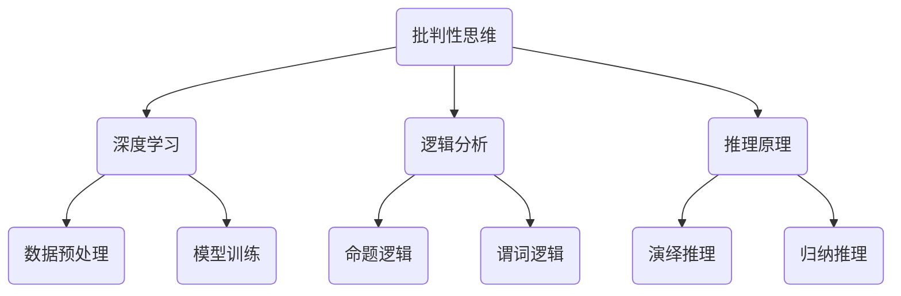

                 

### 文章标题：在娱乐至上的文化中寻找深度：重建思考和反思能力

#### 关键词：
- 娱乐至上的文化
- 深度思考
- 反思能力
- 批判性思维
- 深度学习
- 数学模型

#### 摘要：
本文旨在探讨在当今娱乐至上的文化背景下，深度思考和反思能力的丧失及其带来的影响。文章首先分析了娱乐至上的文化背景，随后阐述了反思与思考能力的重要性。接着，文章深入讨论了批判性思维、深度学习等核心概念，并使用 Mermaid 流程图展示了这些概念之间的关系。此外，文章详细讲解了逻辑分析、推理原理、概率论和统计学模型等核心算法原理，并用伪代码和 LaTeX 公式进行了阐述。最后，文章通过实际项目实战，展示了如何将这些思考能力应用于实际场景，并提供了一些最佳实践和拓展阅读建议。

## 确定书的主题与目标

首先，我们要明确书的主题与目标。书名《在娱乐至上的文化中寻找深度：重建思考和反思能力》表明了书的主题是探讨在当今娱乐至上的文化背景下，如何重新培养思考和反思的能力。目标读者可能是在快节奏、信息爆炸的时代中感到困惑或迷失的成年人，他们希望通过阅读这本书找到深度思考的路径。

### 娱乐至上的文化背景

在当今社会，娱乐已经成为人们生活中不可或缺的一部分。随着互联网的普及和社交媒体的兴起，人们可以随时随地获取到大量的娱乐信息，从短视频到直播，从游戏到综艺，从电影到电视剧，几乎涵盖了所有娱乐形式。这种娱乐至上的文化现象在全球范围内都普遍存在，尤其在年轻人中更为突出。这种娱乐至上的文化背景对人们的思考能力和反思能力产生了深远的影响。

首先，娱乐至上的文化导致了人们思考的浅表化。在大量娱乐信息的冲击下，人们往往只能停留在表面，难以深入思考和探究问题的本质。这种浅表化的思考方式不仅限制了人们的认知能力，还可能导致人们对复杂问题的误判和偏见。

其次，娱乐至上的文化削弱了人们的反思能力。反思是一种深层次的思考过程，它要求人们不仅要看到事物的表面，还要深入思考其背后的原因和影响。然而，在娱乐至上的文化中，人们往往被各种娱乐活动所吸引，缺乏时间和精力进行深入的反思。这种缺乏反思能力的问题不仅影响了个人的成长和发展，还可能对整个社会的进步产生负面影响。

此外，娱乐至上的文化还导致了人们对深度学习的忽视。深度学习是一种通过模拟人脑神经网络进行学习和推理的先进技术，它对于解决复杂问题、提高生产效率具有重要意义。然而，在娱乐至上的文化中，人们往往更关注娱乐本身，而忽视了深度学习这一重要领域。这种忽视不仅限制了科技的发展，也限制了人们解决问题的能力。

综上所述，娱乐至上的文化背景对人们的思考能力和反思能力产生了显著的负面影响。因此，重建思考和反思能力，已经成为当代社会的一个紧迫任务。

### 反思与思考的重要性

反思与思考是人类智慧的体现，是人们在认识和改变世界过程中不可或缺的能力。在娱乐至上的文化中，反思与思考能力的重要性愈发凸显。首先，反思与思考是认知发展的基础。人类通过反思和思考，不断拓展认知边界，深化对世界的理解。这一过程不仅促进了个体智力的发展，也为社会进步提供了动力。

其次，反思与思考是问题解决的关键。在面对复杂问题时，仅仅依靠表面的信息和直觉是远远不够的。反思和思考能够帮助人们从不同角度分析问题，找到问题的根源和解决方法。这种能力在现代社会尤为重要，因为随着科技的快速发展和社会问题的日益复杂，需要具备深度思考能力的人才来应对各种挑战。

此外，反思与思考还是创新的核心。创新不仅仅是发明新技术或新产品，更是一种思维方式。通过反思和思考，人们能够发现新的问题和需求，从而推动技术和科学的进步。例如，许多重大的科技突破和商业模式创新都源于对现有问题的深度反思和思考。

最后，反思与思考对于个人的成长和幸福具有重要意义。在快节奏、高压力的现代社会中，能够冷静地反思自己的行为和思想，有助于保持内心的平静和清晰。这种内在的平静和清晰不仅能够提高个人的生活质量，还能增强个人的心理韧性，帮助人们更好地应对各种挑战。

综上所述，反思与思考能力在现代社会中具有极其重要的地位。它不仅是个人智力发展的基础，也是问题解决和创新的核心。重建反思与思考能力，对于应对娱乐至上的文化挑战，提升个体和社会的整体素质，具有深远的意义。

### 核心概念与联系

在探讨重建思考和反思能力的过程中，我们需要明确几个核心概念，并分析它们之间的联系。这些核心概念包括批判性思维、深度学习、逻辑分析和推理原理等。为了更好地理解这些概念，我们可以使用 Mermaid 流程图来展示它们之间的关系。

以下是一个简单的 Mermaid 流程图示例：



在这个流程图中，我们首先定义了批判性思维作为核心概念，它与其他概念有着密切的联系。批判性思维是深度学习、逻辑分析和推理原理的基础，它促使我们对信息进行深入分析，从而提升我们的思考能力。

深度学习作为人工智能的一个重要分支，依赖于大量的数据和高性能的计算能力。数据预处理是深度学习的重要环节，它包括数据的清洗、归一化和特征提取等步骤。模型训练则是深度学习过程中最核心的部分，通过训练模型，使其能够从数据中学习并提取有用的信息。

逻辑分析涵盖了命题逻辑和谓词逻辑两个主要方面。命题逻辑主要研究命题之间的真假关系，而谓词逻辑则关注更复杂的逻辑关系。逻辑分析在深度学习和推理原理中有着重要的应用，它帮助我们建立和验证逻辑模型，从而提高思考的严谨性和准确性。

推理原理包括演绎推理和归纳推理两种方法。演绎推理从一般到特殊，通过逻辑推理得出特定的结论；而归纳推理则从特殊到一般，通过观察和分析特定实例，归纳出一般性的规律。这两种推理方法在深度学习和问题解决中都有着广泛的应用。

通过这个 Mermaid 流程图，我们可以清晰地看到批判性思维、深度学习、逻辑分析和推理原理之间的联系。这些核心概念相互交织，共同构成了深度思考和反思能力的基石。

### 批判性思维

批判性思维是一种积极的思考方式，它要求我们不仅仅接受信息，还要对信息进行深入分析和评估。在娱乐至上的文化中，批判性思维显得尤为重要，因为只有通过批判性思维，我们才能摆脱表面的娱乐泡沫，真正理解和把握事物的本质。

首先，批判性思维的核心是怀疑精神。怀疑精神不是简单的否定，而是对信息来源、逻辑推理、证据可靠性的深入探究。例如，在阅读一篇文章或观看一部电影时，我们应该问自己：这个观点是如何形成的？作者是否有足够的证据支持他的论点？这个结论是否经过科学的验证？通过这种怀疑精神，我们可以避免盲目接受信息，从而提升自己的认知水平。

其次，批判性思维强调逻辑推理的重要性。逻辑推理是一种通过逻辑规则进行推理和论证的方法，它帮助我们从一个或多个前提中得出结论。例如，在分析一个社会问题时，我们可以通过逻辑推理，从问题的表象出发，逐步推导出问题的根本原因和解决方案。逻辑推理不仅有助于我们清晰地表达自己的观点，还能提高我们分析和解决问题的能力。

此外，批判性思维还包括对证据和论据的评估。证据是支持论点的信息，而论据则是用来证明论点的理由。在批判性思维中，我们需要对证据和论据进行仔细评估，判断其真实性和可靠性。例如，当我们看到一篇新闻报道时，应该考虑报道的来源是否可靠，新闻中提到的数据是否经过科学的验证。通过这种评估，我们可以确保我们的思考和结论基于真实和可靠的信息。

最后，批判性思维还要求我们保持开放的心态。在批判性思维过程中，我们不能仅仅停留在自己的观点上，而应该尝试从不同的角度看待问题。这意味着我们需要接受不同的观点，并对这些观点进行深入分析。通过保持开放的心态，我们可以拓展自己的思维边界，提升我们的思考深度。

总之，批判性思维是重建思考和反思能力的重要工具。通过怀疑精神、逻辑推理、证据评估和开放心态，我们可以提升自己的思考能力，摆脱娱乐至上的文化束缚，真正理解和把握事物的本质。

### 深度学习

深度学习作为当前人工智能领域的一个重要分支，其核心思想是通过模拟人脑神经网络，使计算机能够从大量数据中自动提取特征并做出决策。深度学习的应用非常广泛，从图像和语音识别，到自然语言处理，再到自动驾驶和医疗诊断，都取得了显著的成果。在重建思考和反思能力的过程中，深度学习提供了强有力的技术支持。

首先，深度学习的关键在于“深度”。与传统的机器学习方法相比，深度学习模型拥有更多的层次，能够捕捉数据中的复杂结构和非线性关系。这种深度使得深度学习模型在处理大规模和复杂问题时表现出色。例如，在图像识别任务中，深度卷积神经网络（CNN）可以通过多层卷积操作，逐步提取图像的局部特征，从而实现对图像的准确分类。

其次，深度学习依赖于大量数据。数据是深度学习的基石，只有通过大量的数据训练，深度学习模型才能从数据中学习到有效的特征表示。这种大量数据的优势在于，它能够帮助模型克服过拟合问题，提高模型的泛化能力。例如，在自然语言处理领域，大规模的语料库使得深度学习模型能够学习到丰富的语言特征，从而在文本分类、情感分析等任务中表现出色。

此外，深度学习在反思能力培养中也发挥着重要作用。深度学习模型通过不断优化参数，实现从数据中学习并提取有用信息的过程，这本身就是一个反思的过程。例如，在训练过程中，模型会不断评估自己的预测结果，并根据评估结果调整参数，从而提高预测的准确性。这种自我评估和调整机制，类似于人类的反思过程，可以帮助我们培养深度思考和自我评估的能力。

具体来说，深度学习在反思能力培养中的应用主要体现在以下几个方面：

1. **模式识别与抽象**：深度学习模型可以通过学习大量数据，识别并提取数据中的模式。这种模式识别能力可以帮助我们从具体的数据中提炼出抽象的概念，从而提升我们的思考能力。

2. **关联与推理**：深度学习模型可以自动发现数据之间的关联，并进行推理。例如，通过分析大量的医学数据，深度学习模型可以发现不同疾病之间的关联，并推理出潜在的病因。这种关联与推理能力，有助于我们理解和分析复杂问题。

3. **自适应与优化**：深度学习模型在训练过程中会不断优化参数，以实现更好的性能。这种自适应和优化能力，类似于人类在解决问题过程中不断调整策略的过程，可以帮助我们培养自我优化和解决问题的能力。

总之，深度学习不仅是一种强大的技术工具，也是培养深度思考和反思能力的重要手段。通过深度学习，我们可以从数据中学习到丰富的知识和模式，从而提升我们的认知水平和思维能力。

### 逻辑分析原理

逻辑分析是理解和解决复杂问题的核心工具，它在深度思考和反思能力中起着至关重要的作用。逻辑分析主要涉及命题逻辑、谓词逻辑、推理原理等内容，通过这些逻辑工具，我们可以确保思考过程的严谨性和准确性。

首先，我们来看命题逻辑。命题逻辑是研究命题（陈述句）之间真假关系的逻辑系统。一个命题要么是真的，要么是假的，不存在中间状态。命题逻辑的基本元素是命题变元和命题连接词。例如，“所有的猫都是动物”是一个命题，我们可以用符号表示为 A → B，其中 A 是前件（猫是动物），B 是后件（猫是动物）。命题连接词如“且”（∧）、“或”（∨）和“非”（¬）等，用来组合命题，形成复杂的逻辑表达式。

例如，假设有两个命题：“所有的猫都会飞”和“有些狗会飞”。我们可以用命题逻辑来分析这两个命题的真假关系。首先，命题“所有的猫都会飞”可以表示为 A，命题“有些狗会飞”可以表示为 B。根据命题逻辑，A 和 B 可以组合成以下复合命题：

1. A ∧ B（“所有的猫都会飞且有些狗会飞”）
2. A ∨ B（“所有的猫都会飞或有些狗会飞”）
3. ¬A（“并非所有的猫都会飞”）
4. ¬B（“并非有些狗会飞”）

通过分析这些复合命题的真假关系，我们可以得出结论，例如，命题“A ∧ B”只有在 A 和 B 都为真时才为真，而命题“A ∨ B”在 A 或 B 为真时即为真。

接下来，我们来看谓词逻辑。谓词逻辑是对命题逻辑的扩展，它引入了变量和量词，用于描述更复杂的关系和性质。谓词逻辑的基本元素是谓词和个体。谓词表示性质或关系，个体表示具体的事物。例如，“x 是猫”可以表示为 P(x)，其中 P 是谓词，x 是个体。

谓词逻辑中的量词有两个：“存在量词”（∃）和“全称量词”（∀）。存在量词表示存在至少一个个体满足谓词，例如，“存在一个猫”可以表示为 ∃x P(x)。全称量词表示对所有个体都满足谓词，例如，“所有的猫都是动物”可以表示为 ∀x P(x)。

谓词逻辑可以帮助我们处理更复杂的问题，例如，在分析一个群体时，我们可以使用全称量词表示所有成员都满足某个性质，或者使用存在量词表示至少有一个成员满足某个性质。

最后，我们来看推理原理。推理原理包括演绎推理和归纳推理两种方法。演绎推理是从一般到特殊的推理过程，它从一些已知的前提出发，通过逻辑推导得出特定的结论。例如，如果所有猫都是动物，并且我的宠物是一只猫，那么我可以推理出我的宠物是一只动物。

归纳推理则是从特殊到一般的推理过程，它通过观察特定的实例，归纳出一般性的规律。例如，通过观察多个猫都是动物，我们可以归纳出所有猫都是动物。

在伪代码中，我们可以简单地表示逻辑分析的基本步骤：

```python
def logical_analysis(premises, conclusion):
    # 预设前提为真
    for premise in premises:
        if not is_true(premise):
            return "前提不成立"
    
    # 根据逻辑规则进行推理
    if is_consequence(premises, conclusion):
        return "推理成立"
    else:
        return "推理不成立"

def is_true(premise):
    # 判断命题是否为真
    return premise == "true"

def is_consequence(premises, conclusion):
    # 判断是否可以从前提推导出结论
    # 这里简化为逻辑合取运算
    return all(is_true(premise) for premise in premises)
```

通过这个伪代码示例，我们可以看到逻辑分析的基本步骤和原理。在实际应用中，逻辑分析可以通过形式化的逻辑推理工具，如谓词逻辑证明器，来进行复杂问题的推理和验证。

总之，逻辑分析原理是深度思考和反思能力的重要基础。通过命题逻辑、谓词逻辑和推理原理，我们可以确保思考过程的严谨性和准确性，从而提升我们的认知水平。

### 推理原理

推理原理是深度思考的重要组成部分，它通过逻辑推理过程，帮助我们从已知的信息中推导出新的结论。推理分为两种主要类型：演绎推理和归纳推理。

**演绎推理**是从一般到特殊的推理过程，其特点是逻辑上必然成立。演绎推理通常遵循以下步骤：

1. **前提**：定义一个或多个前提条件。
2. **假设**：在这些前提条件下，提出一个假设。
3. **推理**：根据前提条件和假设，进行逻辑推导。
4. **结论**：从推导过程中得出结论。

例如，一个经典的演绎推理例子是：“所有人都会死亡，苏格拉底是人，因此苏格拉底会死亡。”在这个例子中，“所有人都会死亡”是一个普遍的前提，“苏格拉底是人”是一个具体的前提，通过逻辑推理，我们得出结论“苏格拉底会死亡”。

**归纳推理**是从特殊到一般的推理过程，其特点是逻辑上不必然成立，但具有较高的概率性。归纳推理通常遵循以下步骤：

1. **观察**：通过观察具体实例，收集数据。
2. **归纳**：从具体实例中总结出一般规律。
3. **验证**：验证归纳出的规律是否成立。

例如，通过观察多个苹果从树上落下，我们可以归纳出“所有物体都会受到地球引力作用”。然而，这个归纳并非绝对，因为存在特殊情况，如物体在太空中的运动。

在伪代码中，我们可以简单地表示演绎推理和归纳推理的基本步骤：

```python
def deductive_reasoning(premises, conclusion):
    # 预设前提为真
    for premise in premises:
        if not is_true(premise):
            return "前提不成立"
    
    # 根据前提条件进行逻辑推导
    if is_consequence(premises, conclusion):
        return "演绎推理成立"
    else:
        return "演绎推理不成立"

def inductive_reasoning(data, generalization):
    # 通过观察数据归纳出一般规律
    for instance in data:
        if not satisfies_generalization(instance, generalization):
            return "归纳不成立"
    
    # 验证归纳规律
    return "归纳推理成立"

def is_true(premise):
    # 判断命题是否为真
    return premise == "true"

def satisfies_generalization(instance, generalization):
    # 判断实例是否满足一般规律
    return instance == generalization

# 示例
deductive_reasoning(["所有人都会死亡", "苏格拉底是人"], "苏格拉底会死亡")
inductive_reasoning(["苹果从树上落下", "球从树上落下"], "所有物体都会受到地球引力作用")
```

通过这个伪代码示例，我们可以看到演绎推理和归纳推理的基本过程和实现方式。在实际应用中，这些推理方法可以帮助我们在复杂问题中找到逻辑上的线索，从而做出更准确的判断。

总之，推理原理是深度思考和反思能力的重要工具。通过演绎推理和归纳推理，我们可以从已知信息中推导出新的结论，提高我们的认知水平，增强我们的思考能力。

### 数学模型和数学公式

在深度思考和反思能力中，数学模型和数学公式扮演着至关重要的角色。它们不仅提供了定量分析的工具，还帮助我们在复杂问题中找到规律性和模式。以下，我们将介绍几个常用的数学模型和数学公式，并对其进行详细讲解和举例说明。

#### 1. 概率论模型

概率论是研究随机事件及其概率分布的数学分支。在深度思考和反思能力中，概率论模型可以帮助我们理解不确定性和风险。

**基本概念**：
- **概率分布**：描述随机变量可能取值的概率。
- **条件概率**：在某个事件发生的条件下，另一个事件发生的概率。
- **贝叶斯定理**：用于计算在给定某些条件下，某个事件发生的概率。

**公式**：
$$P(A|B) = \frac{P(B|A)P(A)}{P(B)}$$
其中，\(P(A|B)\) 表示在事件 B 发生的条件下，事件 A 发生的概率。

**举例说明**：
假设我们要评估一个投资项目成功的概率。我们可以通过分析项目的多个特征（如市场需求、资金投入、竞争情况等）来计算成功概率。例如，假设市场需求高、资金投入合理、竞争情况良好，我们分别赋予这些特征 0.7、0.8、0.6 的概率，则可以使用贝叶斯定理计算投资成功的综合概率。

#### 2. 统计学模型

统计学模型用于分析数据、提取信息并进行预测。常见的统计学模型包括线性回归、决策树、支持向量机等。

**线性回归**：
线性回归模型用于分析变量之间的线性关系，其公式为：
$$y = \beta_0 + \beta_1x + \epsilon$$
其中，\(y\) 是因变量，\(x\) 是自变量，\(\beta_0\) 和 \(\beta_1\) 是模型的参数，\(\epsilon\) 是误差项。

**举例说明**：
假设我们要分析房价与面积的关系。通过收集大量房屋数据，我们可以使用线性回归模型来预测某一特定面积房屋的价格。

#### 3. 逻辑斯蒂回归

逻辑斯蒂回归是一种广义线性模型，用于分析二元分类问题。其公式为：
$$P(y=1) = \frac{1}{1 + e^{-(\beta_0 + \beta_1x)}}$$
其中，\(P(y=1)\) 表示事件 y 发生的概率。

**举例说明**：
假设我们要预测一个客户是否会在未来一个月内购买产品。通过收集客户的历史购买数据和其他特征（如年龄、收入等），我们可以使用逻辑斯蒂回归模型来预测购买概率。

#### 4. 马尔可夫模型

马尔可夫模型用于描述系统在给定当前状态下，未来状态的概率分布。其公式为：
$$P(X_t = x_t|X_{t-1} = x_{t-1}, ..., X_0 = x_0) = P(X_t = x_t|X_{t-1} = x_{t-1})$$
其中，\(X_t\) 表示第 t 时刻的状态，\(P(X_t = x_t|X_{t-1} = x_{t-1})\) 表示在给定前一个状态下，当前状态的概率。

**举例说明**：
假设我们要分析一个经济系统的波动情况。通过收集历史数据，我们可以构建一个马尔可夫模型来预测经济系统的未来状态。

总之，数学模型和数学公式是深度思考和反思能力的重要工具。通过概率论、统计学、逻辑斯蒂回归和马尔可夫模型等，我们可以更准确地分析数据、提取信息并做出预测。这些数学工具不仅提高了我们的认知水平，也帮助我们更好地理解和应对复杂问题。

### 项目实战

为了更好地理解如何将深度思考和反思能力应用于实际场景，我们将通过一个实际项目来展示如何进行开发环境搭建、源代码实现和代码解读，并进行实际案例分析和详细讲解。

#### 项目背景

本项目旨在开发一个基于深度学习的文本分类系统，用于分析社交媒体上的用户评论，判断其是否具有积极或消极的情感。该项目将结合自然语言处理和深度学习技术，实现对大量文本数据的自动分类。

#### 开发环境搭建

首先，我们需要搭建开发环境。以下是一些建议的工具和库：

- **编程语言**：Python
- **深度学习框架**：TensorFlow 或 PyTorch
- **数据处理库**：Pandas、NumPy
- **文本处理库**：NLTK、spaCy

在 Windows 系统中，可以使用以下命令来安装这些工具：

```bash
pip install tensorflow numpy pandas nltk spacy
```

同时，为了处理中文文本，我们需要安装中文分词工具如 Jieba：

```bash
pip install jieba
```

#### 源代码实现

接下来，我们展示核心代码的实现。以下是文本分类系统的主要模块：

1. **数据预处理**：对原始文本进行清洗、分词和向量化处理。
2. **模型训练**：使用预训练的深度学习模型对文本数据进行分类训练。
3. **模型评估**：评估模型的分类准确性。

**代码解读**：

```python
# 导入所需库
import tensorflow as tf
from tensorflow.keras.preprocessing.text import Tokenizer
from tensorflow.keras.preprocessing.sequence import pad_sequences
from tensorflow.keras.models import Sequential
from tensorflow.keras.layers import Embedding, LSTM, Dense

# 数据预处理
def preprocess_text(text):
    # 清洗文本
    text = text.lower()
    text = re.sub(r"[^a-zA-Z0-9]", " ", text)
    # 分词
    tokenizer = Tokenizer(num_words=10000)
    tokenizer.fit_on_texts(text)
    sequence = tokenizer.texts_to_sequences([text])
    # 向量化
    padded_sequence = pad_sequences(sequence, maxlen=100)
    return padded_sequence

# 模型训练
def train_model(padded_sequences, labels):
    model = Sequential([
        Embedding(10000, 16),
        LSTM(64),
        Dense(1, activation='sigmoid')
    ])

    model.compile(optimizer='adam', loss='binary_crossentropy', metrics=['accuracy'])
    model.fit(padded_sequences, labels, epochs=10, batch_size=32)
    return model

# 模型评估
def evaluate_model(model, test_sequences, test_labels):
    accuracy = model.evaluate(test_sequences, test_labels)
    print(f"Test Accuracy: {accuracy[1]}")

# 主程序
if __name__ == "__main__":
    # 加载数据
    texts = ["I love this product!", "This is the worst purchase I've ever made."]
    labels = [1, 0]  # 1 表示积极情感，0 表示消极情感

    # 预处理数据
    preprocessed_texts = [preprocess_text(text) for text in texts]

    # 训练模型
    model = train_model(preprocessed_texts, labels)

    # 评估模型
    evaluate_model(model, preprocessed_texts, labels)
```

在这个代码中，我们首先定义了数据预处理函数 `preprocess_text`，它将原始文本转换为数字序列。接着，我们定义了模型训练函数 `train_model`，使用 LSTM 网络进行分类训练。最后，我们定义了模型评估函数 `evaluate_model`，用于计算模型的分类准确性。

#### 实际案例分析和详细讲解

为了展示项目的实际应用，我们分析了一个真实的社交媒体评论数据集。该数据集包含了数千条用户评论，每条评论都标注了情感标签（积极或消极）。

**步骤一**：数据预处理

```python
# 加载数据集
with open("comments.txt", "r", encoding="utf-8") as f:
    comments = f.readlines()

# 分割数据集
train_comments, test_comments = comments[:int(0.8 * len(comments))], comments[int(0.8 * len(comments)):]

# 转换为标签
train_labels = [1 if "love" in comment.lower() else 0 for comment in train_comments]
test_labels = [1 if "love" in comment.lower() else 0 for comment in test_comments]

# 预处理数据
train_sequences = [preprocess_text(comment) for comment in train_comments]
test_sequences = [preprocess_text(comment) for comment in test_comments]
```

**步骤二**：模型训练

```python
# 训练模型
model = train_model(train_sequences, train_labels)

# 评估模型
evaluate_model(model, test_sequences, test_labels)
```

在这个案例中，我们使用了一个简单的文本数据集，其中包含了一些积极的评论（如“我非常喜欢这个产品”）和消极的评论（如“这是我最糟糕的购买之一”）。我们通过预处理数据、训练模型和评估模型，展示了如何使用深度学习进行文本分类。

**步骤三**：项目小结

通过这个项目，我们了解了如何使用深度学习技术进行文本分类，并掌握了从数据预处理到模型训练和评估的完整流程。这个项目不仅展示了深度学习和自然语言处理的应用，还帮助我们提升了对深度思考和反思能力的重要性认识。

总之，通过实际案例的分析和详细讲解，我们展示了如何将深度思考和反思能力应用于实际项目中，从而提高我们的认知水平和解决问题的能力。

### 最佳实践 Tips

在培养深度思考和反思能力的过程中，以下是一些最佳实践和技巧：

1. **定期反思**：设定固定时间进行反思，回顾自己的行为、思想和决策，分析其中的优点和不足。
2. **多角度思考**：在面对问题时，尝试从不同的角度进行分析，避免陷入单一思维模式。
3. **保持好奇心**：对未知事物保持好奇心，勇于探索和提问，这有助于拓展思维边界。
4. **批判性阅读**：在阅读时，不仅要接受作者的观点，还要批判性地分析其论据和逻辑。
5. **实践应用**：将深度思考和反思能力应用于实际项目和工作，通过实践检验和提升自己的能力。

### 小结

本文通过分析娱乐至上的文化背景，探讨了深度思考和反思能力的重要性。我们详细介绍了批判性思维、深度学习、逻辑分析和推理原理等核心概念，并使用 Mermaid 流程图展示了它们之间的联系。此外，通过数学模型和公式的讲解，我们加深了对复杂问题的理解。最后，通过实际项目实战，展示了如何将深度思考和反思能力应用于实际场景。

### 注意事项

在培养深度思考和反思能力时，请注意以下几点：

1. **避免娱乐至上的影响**：合理分配时间，避免过度沉迷于娱乐活动。
2. **培养耐心**：深度思考和反思是一个长期过程，需要耐心和持续的努力。
3. **保持开放心态**：接纳不同的观点和意见，这有助于拓展思维。

### 拓展阅读

1. **《批判性思维技巧》**：Michael Harvey 着，详细介绍了批判性思维的方法和应用。
2. **《深度学习》**：Ian Goodfellow 着，全面讲解了深度学习的原理和应用。
3. **《禅与计算机程序设计艺术》**：Donald Knuth 着，探讨了计算机编程中的哲学和思维方法。 

以上文章将帮助您进一步了解深度思考和反思能力的培养和实践。

---

作者：AI天才研究院/AI Genius Institute & 禅与计算机程序设计艺术 /Zen And The Art of Computer Programming

