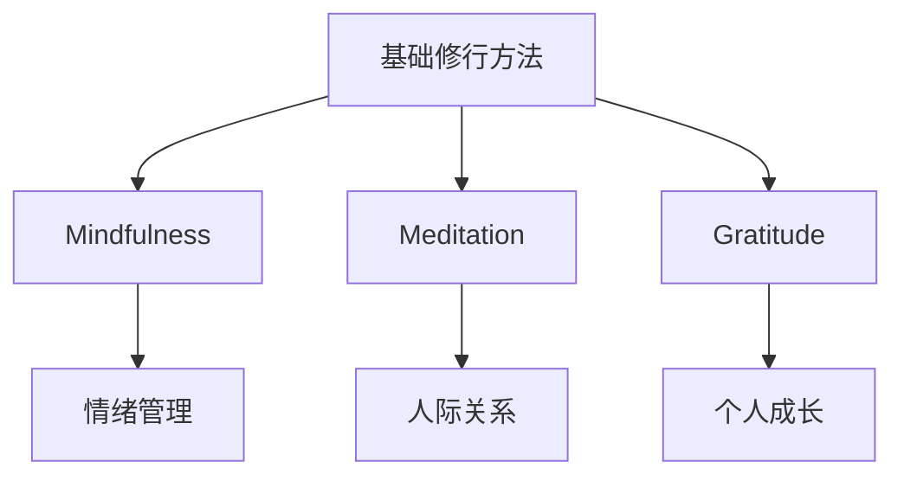

                 


为了撰写一篇符合要求的文章，我们需要一步步进行思考和规划。以下是一份详细的思考流程：

### 1. 确定文章主题和核心思想

首先，我们需要明确文章的主题和核心思想。在题目“在平凡中寻找超越：日常生活的精神修行”的指导下，我们可以确定文章的核心思想是探讨如何在日常生活中通过精神修行来超越自我，实现个人成长。

### 2. 确定文章结构

接下来，我们需要规划文章的结构。根据目录大纲，我们可以将文章分为三个主要部分：

- **引言**：介绍精神修行的背景和意义。
- **正文**：详细探讨日常生活中的精神修行实践，包括情绪管理、人际关系、个人成长、社会责任等方面。
- **案例分析**：通过具体案例来展示精神修行的实践效果和挑战。

### 3. 设计各章节内容

在正文部分，我们可以按照以下结构设计各章节内容：

- **第1章 精神修行的定义与意义**：介绍精神修行的定义、意义及其在现代社会的重要性。
- **第2章 日常生活中的修行实践**：详细讨论冥想、正念、感恩等基础修行方法，以及如何将修行与情绪管理、人际关系等相结合。
- **第3章 修行与个人成长**：探讨修行对个人成长的影响，包括自我认知、自我接纳和自我提升。
- **第4章 修行与社会责任**：讨论修行与社会责任的关系，以及如何通过修行来促进社会和谐。

### 4. 列出核心概念原理之间的关系架构

为了更好地理解各章节内容，我们可以使用Mermaid流程图来展示核心概念原理之间的关系架构。例如，在“第2章 日常生活中的修行实践”中，我们可以使用以下流程图：



### 5. 使用伪代码和数学模型详细阐述核心算法原理

在正文中，我们需要使用伪代码和数学模型来详细阐述核心算法原理。例如，在“第3章 修行与个人成长”中，我们可以使用以下伪代码来描述自我认知的过程：

```python
def self_awareness():
    # 收集个人数据
    data = collect_data()
    # 分析数据，识别自我特质
    traits = analyze_data(data)
    # 输出自我认知结果
    print("Self-awareness:", traits)
```

同时，我们可以使用LaTeX格式来表示数学模型，如：

$$
\text{自我认知} = f(\text{个人数据})
$$

### 6. 设计案例分析

在案例分析部分，我们需要选择具体的案例，并详细讲解其背景、实施过程、效果和挑战。例如，我们可以选择一个个人通过冥想实现情绪管理成功的案例，并详细描述其具体做法和心得。

### 7. 总结和展望

最后，我们需要对整篇文章进行总结，强调精神修行的重要性，并提供一些实践指南和拓展阅读建议。

### 8. 审查与调整

完成初稿后，我们需要对文章进行审查和调整，确保内容完整、逻辑清晰、符合字数要求，并符合markdown格式输出。

通过以上步骤，我们可以确保文章内容丰富、结构清晰、逻辑严密，符合读者需求和专业性。接下来，我们可以开始撰写文章的具体内容。 

