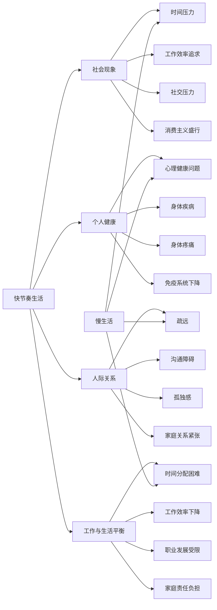

                 

### 文章标题

# 在快节奏生活中寻找慢生活：重建生活质量和意义

> 关键词：快节奏生活、慢生活、时间管理、心理健康、人际关系、工作与生活平衡、生活意义

> 摘要：本文将探讨在快节奏的生活中如何寻找慢生活的机会，重建生活质量和意义。通过分析快节奏生活的现状与挑战，介绍慢生活的理念与实践，探讨个人时间管理、心理健康与自我调节、人际关系与沟通、工作与生活的平衡以及寻找生活意义与目标等方面的方法与技巧。最后，展望慢生活与社会的融合，为读者提供慢生活资源与工具。本文旨在为快节奏生活中的人们提供一些建议和指导，帮助他们重建生活质量和意义。

## 第一部分：快节奏生活的现状与挑战

### 第1章：快节奏生活的特征与影响

#### 1.1 快节奏生活带来的社会现象

在现代社会中，快节奏生活已成为一种普遍现象。城市化进程加速，科技发展迅猛，人们的生活方式也在不断改变。以下是快节奏生活带来的几种社会现象：

1. **时间压力**：随着工作节奏的加快，人们面临越来越多的时间压力。许多人抱怨没有足够的时间去完成工作、照顾家庭、自我提升和休息。

2. **工作效率追求**：在快节奏的生活中，人们追求高效率，工作压力增大，加班成为常态。这种工作文化导致人们长期处于高压状态，影响身心健康。

3. **社交压力**：快节奏的生活使得人与人之间的交往变得更加匆忙。人们在社交场合更加注重效率，忽视情感交流，导致人际关系疏远。

4. **消费主义盛行**：快节奏的生活往往伴随着消费主义的兴起。人们为了追求物质享受和满足感，不断购买新的产品和服务，加剧了环境问题和资源浪费。

#### 1.2 快节奏生活对个人健康的影响

快节奏的生活对个人健康产生了一系列负面影响。以下是其中一些主要影响：

1. **心理健康问题**：长期处于高压状态，人们容易出现焦虑、抑郁等心理问题。此外，快节奏的生活导致睡眠不足、饮食不均衡等问题，进一步加重心理健康负担。

2. **身体疾病**：快节奏的生活使得人们缺乏锻炼和休息时间，容易导致肥胖、高血压、心脏病等慢性疾病。

3. **身体疼痛**：长时间坐在电脑前工作，缺乏运动和休息，容易导致颈椎、腰椎等部位的疼痛。

4. **免疫系统下降**：长期处于紧张和疲劳状态，人体的免疫系统功能会受到影响，容易感染疾病。

#### 1.3 快节奏生活对人际关系的影响

快节奏的生活对人际关系产生了深远的影响。以下是其中一些主要影响：

1. **疏远**：由于时间压力和社交压力，人们之间的交往变得更加疏远。许多人忙于工作，很少有时间与家人和朋友聚会，导致感情疏远。

2. **沟通障碍**：在快节奏的生活中，人们往往注重沟通的效率，忽视沟通的质量。这导致沟通中缺乏情感交流和深入理解，产生沟通障碍。

3. **孤独感**：快节奏的生活使得人们感到孤独。许多人尽管身处繁华的城市，却感到内心的孤独和无助。

4. **家庭关系紧张**：快节奏的生活使得家庭成员之间的沟通时间减少，容易产生误解和矛盾，导致家庭关系紧张。

#### 1.4 快节奏生活对工作与生活平衡的挑战

快节奏的生活给工作与生活的平衡带来了巨大的挑战。以下是其中一些主要挑战：

1. **时间分配困难**：在快节奏的生活中，人们很难合理安排时间，工作与生活的界限变得模糊。

2. **工作效率下降**：长期处于高压状态，人们容易出现疲劳和注意力不集中，导致工作效率下降。

3. **职业发展受限**：快节奏的生活使得人们很难有时间进行自我提升和职业发展，容易陷入职业瓶颈。

4. **家庭责任负担**：快节奏的生活使得人们难以兼顾家庭责任，容易导致家庭矛盾和婚姻问题。

### 第2章：慢生活的理念与实践

#### 2.1 慢生活的起源与发展

慢生活（Slow Life）这一概念起源于20世纪初的意大利。当时，意大利作家卡尔洛·卡斯特洛提出“慢食运动”（Slow Food Movement），旨在反对工业化食品生产，提倡人们放慢脚步，享受食物本身的味道和营养价值。随着时间的推移，慢生活的理念逐渐扩展到生活的各个方面，成为一种生活方式和价值观。

#### 2.2 慢生活的核心价值与理念

慢生活的核心价值在于追求质量而非数量，强调平衡、可持续和有意义的生活方式。以下是慢生活的几个核心理念：

1. **放慢节奏**：慢生活主张人们放慢生活的节奏，不再追求快速和高效率，而是关注生活的过程和体验。

2. **注重平衡**：慢生活强调工作与生活的平衡，提倡人们在忙碌的生活中找到放松和休息的时间。

3. **可持续发展**：慢生活倡导可持续发展，鼓励人们减少消费、节约资源，保护环境。

4. **自我反思**：慢生活鼓励人们进行自我反思，寻找生活的意义和目标，追求内心的平静和满足。

5. **人际关系的重视**：慢生活强调人际关系的质量和深度，鼓励人们花时间与家人和朋友相处，建立真正的情感联系。

#### 2.3 慢生活的实践方法与技巧

要实现慢生活，人们需要采取一系列实践方法与技巧。以下是几个实用的建议：

1. **时间管理**：合理安排时间，设定优先级，避免过度工作和疲劳。

2. **减少压力**：学会放松身心，进行冥想、瑜伽等放松活动，减少压力。

3. **健康饮食**：选择健康、有机的食物，减少快餐和垃圾食品的摄入。

4. **锻炼身体**：定期进行体育锻炼，增强身体素质，提高生活质量。

5. **亲近自然**：多花时间在户外，亲近自然，放松心情。

6. **培养兴趣爱好**：发展个人兴趣爱好，丰富生活内容，增加幸福感。

7. **减少消费**：理性消费，避免过度购物，节约资源。

#### 2.4 慢生活与可持续发展

慢生活与可持续发展密切相关。以下是慢生活与可持续发展之间的联系：

1. **减少资源消耗**：慢生活强调减少消费，节约资源，降低对环境的负面影响。

2. **提高生活质量**：慢生活追求生活的质量而非数量，有助于提高人们的生活质量。

3. **减少碳排放**：慢生活鼓励人们减少交通出行，减少碳排放，降低气候变化的风险。

4. **促进社会公平**：慢生活强调人与人之间的公平和互助，有助于构建和谐社会。

## 第二部分：重建生活质量和意义

### 第3章：个人时间管理

#### 3.1 时间管理的重要性

时间管理是重建生活质量和意义的关键因素之一。有效的时间管理可以帮助人们更好地平衡工作与生活，提高工作效率，减少压力，从而提高生活质量。以下是时间管理的重要性：

1. **提高工作效率**：合理规划时间，有助于集中精力完成任务，减少无效工作，提高工作效率。

2. **减少压力**：有效的时间管理可以减少工作压力，避免因时间紧张而导致的焦虑和疲劳。

3. **平衡工作与生活**：合理安排工作时间，确保有足够的时间照顾家人、朋友和自己的身心健康。

4. **实现个人目标**：明确目标，制定计划，有助于实现个人目标，提高成就感。

#### 3.2 时间管理的方法与工具

要实现有效的时间管理，人们需要掌握一些方法和工具。以下是几种常用的时间管理方法和工具：

1. **优先级排序**：将任务按照优先级排序，确保先完成最重要和紧急的任务。

2. **时间块管理**：将时间划分为几个块，每个块专注于一项任务，减少任务切换的干扰。

3. **日程安排**：使用日程表或日程管理软件，提前规划每天的任务和时间安排。

4. **番茄工作法**：将工作时间划分为25分钟的工作周期，每个周期后休息5分钟，提高专注力和工作效率。

5. **待办事项列表**：将需要完成的任务列出来，定期检查进度，确保任务按时完成。

#### 3.3 实现高效的时间利用

要实现高效的时间利用，人们需要采取一系列措施。以下是几个实用的建议：

1. **避免拖延**：设定明确的截止日期，避免拖延，提高任务完成的效率。

2. **减少干扰**：关闭不必要的通知，减少干扰，专注于当前任务。

3. **学会说“不”**：合理安排时间，避免接受过多的额外任务，确保有足够的时间处理重要任务。

4. **充分利用碎片时间**：充分利用碎片时间，如等车、排队等时间，阅读书籍、听音乐或进行其他有意义的活动。

5. **定期回顾和调整**：定期回顾时间管理的效果，根据实际情况进行调整，不断提高时间管理的效率。

#### 3.4 精简生活与时间管理

精简生活是一种减少物质负担和时间压力的生活方式。通过精简生活，人们可以更加专注于重要的事物，提高生活质量。以下是精简生活与时间管理之间的关系：

1. **减少物质负担**：精简生活意味着减少对物质的依赖，减少购买和使用物品的需求，从而减轻物质负担。

2. **减少时间浪费**：精简生活可以减少时间浪费，避免因物质需求而花费大量时间在购物、整理和处理物品上。

3. **提高时间管理效率**：精简生活有助于人们更加专注于重要任务，提高时间管理的效率。

4. **促进身心健康**：精简生活可以减少焦虑和压力，提高身心健康。

### 第4章：心理健康与自我调节

#### 4.1 心理健康的定义与重要性

心理健康是指个体在认知、情感、行为和社交等方面的良好状态。心理健康的重要性体现在以下几个方面：

1. **提高生活质量**：心理健康有助于提高人们的生活质量，使人们更加快乐和满足。

2. **增强抗压能力**：心理健康使个体能够更好地应对生活中的压力和挑战，增强抗压能力。

3. **促进人际关系**：心理健康有助于建立和维护良好的人际关系，减少冲突和误解。

4. **提高工作效率**：心理健康使个体能够更加专注和高效地工作，提高工作效率。

5. **促进身心健康**：心理健康与身体健康密切相关，心理健康有助于维持良好的身体健康。

#### 4.2 压力管理与情绪调节

压力管理和情绪调节是维护心理健康的重要方面。以下是几个实用的技巧：

1. **认知行为疗法**：通过改变负面思维模式，学会积极应对压力和挑战。

2. **情绪释放**：学会识别和表达自己的情绪，避免情绪积压。

3. **放松技巧**：通过冥想、深呼吸、瑜伽等放松技巧，缓解压力和焦虑。

4. **运动锻炼**：定期进行体育锻炼，释放压力，提高身心健康。

5. **社交支持**：与家人、朋友和同事建立良好的社交关系，寻求支持和帮助。

#### 4.3 睡眠质量提升

睡眠质量是心理健康的重要组成部分。以下是几个提升睡眠质量的技巧：

1. **规律作息**：保持规律的作息时间，确保每天有足够的睡眠。

2. **舒适睡眠环境**：创造一个舒适、安静的睡眠环境，减少噪音和光线干扰。

3. **避免睡前刺激**：睡前避免使用电子设备，减少刺激，有助于提高睡眠质量。

4. **放松身心**：睡前进行放松活动，如泡澡、听轻音乐等，有助于放松身心。

5. **注意饮食**：避免晚餐过于丰盛或过于油腻，减少咖啡因和酒精的摄入，有助于提高睡眠质量。

#### 4.4 心理健康与身心健康的关系

心理健康与身心健康密切相关。以下是两者之间的联系：

1. **相互影响**：心理健康和身心健康相互影响，心理健康不良可能导致身心健康问题，反之亦然。

2. **共同维护**：维护身心健康需要关注心理健康和身体健康两个方面，两者共同维护才能达到最佳效果。

3. **预防疾病**：心理健康有助于预防各种身心疾病，如抑郁症、焦虑症等。

4. **提高生活质量**：身心健康有助于提高人们的生活质量，使人们更加快乐和满足。

### 第5章：人际关系与沟通

#### 5.1 人际关系的重要性

人际关系是人们生活中不可或缺的一部分。良好的人际关系对个人的心理健康和生活质量具有重要意义。以下是人际关系的重要性：

1. **心理健康**：良好的人际关系有助于减轻压力，提高心理健康。

2. **情感支持**：人际关系提供情感支持，使个体在面临困难和挑战时得到帮助和鼓励。

3. **社交技能**：通过建立和维护人际关系，个体可以提高社交技能，增强自信心。

4. **个人成长**：良好的人际关系有助于个体在情感、智力和社会方面得到成长。

5. **幸福感**：良好的人际关系是幸福的重要组成部分，有助于提高幸福感。

#### 5.2 人际沟通的技巧与策略

有效的人际沟通是建立和维护良好人际关系的关键。以下是几个有效的人际沟通技巧与策略：

1. **倾听**：倾听是有效沟通的基础，通过倾听对方的意见和需求，建立信任和理解。

2. **表达**：清晰、准确地表达自己的想法和感受，避免误解和冲突。

3. **同理心**：站在对方的角度思考问题，理解对方的感受和需求，增进彼此的感情。

4. **非言语沟通**：注意身体语言、面部表情和语调等非言语沟通方式，增强沟通效果。

5. **处理冲突**：学会妥善处理冲突，避免情绪化和攻击性的言辞，寻求双赢的解决方案。

#### 5.3 建立良好的人际关系

要建立良好的人际关系，人们需要采取一系列措施。以下是几个实用的建议：

1. **主动交流**：主动与朋友、同事和家人交流，分享彼此的生活和感受。

2. **关心他人**：关心他人的生活和需求，提供帮助和支持。

3. **积极参与**：积极参与社交活动，扩大社交圈子。

4. **保持联系**：定期与朋友、同事和家人保持联系，维护良好的关系。

5. **真诚待人**：真诚待人，避免虚伪和做作，建立真实的友谊。

#### 5.4 网络时代的沟通挑战与应对

随着互联网和社交媒体的普及，网络时代的沟通带来了一系列挑战。以下是网络时代沟通的挑战和应对策略：

1. **信息过载**：网络时代信息量庞大，人们容易感到信息过载，难以筛选和消化。

2. **虚假信息**：网络时代存在大量的虚假信息和谣言，需要具备辨别能力。

3. **隐私保护**：网络时代的沟通需要保护个人隐私，避免信息泄露。

4. **社交疏离**：网络时代的沟通可能导致社交疏离，影响人际关系。

5. **应对策略**：通过定期线下聚会、减少网络依赖、加强隐私保护等方式，应对网络时代的沟通挑战。

### 第6章：工作与生活的平衡

#### 6.1 工作与生活平衡的定义与实现

工作与生活平衡是指在工作时间和生活时间之间找到一个平衡点，使个体既能完成工作职责，又能享受生活，维持身心健康。实现工作与生活平衡的重要性在于：

1. **提高工作效率**：平衡的工作与生活有助于提高工作效率，减少疲劳和压力。

2. **维护身心健康**：合理分配时间，确保有足够的休息和放松时间，有助于维护身心健康。

3. **提升生活质量**：平衡的工作与生活有助于提高生活质量，使个体更加快乐和满足。

4. **家庭和谐**：平衡的工作与生活有助于维护家庭和谐，提高家庭生活质量。

以下是几种实现工作与生活平衡的方法：

1. **设定工作目标**：明确工作目标和优先级，避免因工作而忽略生活。

2. **合理安排工作时间**：合理规划工作时间，避免加班和长时间工作。

3. **利用碎片时间**：充分利用碎片时间，如通勤时间、午休时间等，进行自我提升和休息。

4. **设定休息日**：确保每周有固定的休息日，避免连续工作导致疲劳。

5. **培养兴趣爱好**：发展个人兴趣爱好，丰富生活内容，提高生活质量。

#### 6.2 工作效率的提升

工作效率是工作与生活平衡的重要方面。以下是几种提升工作效率的方法：

1. **时间管理**：合理规划时间，避免时间浪费，提高工作效率。

2. **任务分解**：将复杂任务分解为小任务，逐一完成，减少任务压力。

3. **优先级排序**：将任务按照优先级排序，确保先完成重要和紧急的任务。

4. **避免拖延**：设定明确的截止日期，避免拖延，提高任务完成的效率。

5. **减少干扰**：关闭不必要的通知，减少干扰，专注于当前任务。

6. **团队协作**：与团队成员建立良好的协作关系，提高工作效率。

#### 6.3 家庭与事业的平衡

家庭与事业的平衡是工作与生活平衡的重要组成部分。以下是几种实现家庭与事业平衡的方法：

1. **有效沟通**：与家人沟通，了解彼此的需求和期望，寻求共同解决方案。

2. **设定家庭时间**：确保有足够的时间陪伴家人，增进感情。

3. **学会说“不”**：合理安排时间，避免接受过多的额外任务，确保有足够的时间照顾家庭。

4. **家务分工**：与家人共同分担家务，减轻家庭负担。

5. **灵活工作时间**：与雇主协商，争取灵活的工作时间，更好地平衡家庭和事业。

#### 6.4 面对工作压力的策略

工作压力是现代社会普遍存在的问题。以下是几种应对工作压力的策略：

1. **心理调适**：学会心理调适，保持积极的心态，面对工作压力。

2. **时间管理**：合理规划时间，避免时间浪费，减少工作压力。

3. **锻炼身体**：定期进行体育锻炼，释放压力，提高身心健康。

4. **寻求支持**：与家人、朋友和同事建立良好的支持关系，寻求帮助和支持。

5. **调整工作环境**：优化工作环境，减少噪音和干扰，提高工作效率。

6. **职业规划**：明确职业目标，制定职业规划，避免职业瓶颈和职业倦怠。

### 第7章：寻找生活意义与目标

#### 7.1 寻找生活意义的重要性

寻找生活意义是人生中的重要任务之一。生活意义使个体在面临挑战和困境时保持积极的心态，提供内心的支撑和动力。以下是寻找生活意义的几个重要性：

1. **提高幸福感**：找到生活的意义，使个体感受到生活的价值和意义，提高幸福感。

2. **增强心理韧性**：生活意义使个体在面对困难和挑战时保持积极的心态，增强心理韧性。

3. **促进个人成长**：寻找生活意义是个人成长的过程，通过不断探索和实现目标，个体可以实现自我提升。

4. **提升人际关系**：生活意义使个体更加关注他人和社会，建立良好的人际关系。

5. **促进身心健康**：生活意义有助于维护身心健康，降低心理压力和疾病风险。

#### 7.2 自我反思与目标设定

自我反思是寻找生活意义的重要步骤之一。以下是自我反思和目标设定的几个关键点：

1. **自我认知**：深入了解自己的价值观、兴趣和优势，明确自己的定位。

2. **反思现状**：反思目前的生活状态，分析生活中的问题和挑战，找出需要改进的地方。

3. **设定目标**：根据自我认知和反思结果，设定短期和长期目标，明确自己的努力方向。

4. **制定计划**：制定实现目标的计划，包括具体的行动步骤和时间安排。

5. **持续反思**：定期反思目标实现的情况，根据实际情况进行调整，确保目标的实现。

#### 7.3 个人成长与实现目标

个人成长是实现生活意义的重要途径。以下是个人成长与实现目标的几个关键点：

1. **持续学习**：保持学习的态度，不断提升自己的知识和技能，适应社会的发展。

2. **勇于尝试**：勇于尝试新的事物和挑战，通过实践积累经验，实现个人成长。

3. **反思与总结**：在成长过程中，不断反思和总结自己的经验和教训，从中汲取智慧。

4. **建立支持网络**：与家人、朋友和同事建立良好的支持网络，寻求帮助和支持。

5. **保持耐心与毅力**：实现目标需要时间和努力，保持耐心和毅力，不断追求进步。

#### 7.4 生活中的感恩与满足

感恩和满足是生活中的重要心态。以下是感恩和满足的几个关键点：

1. **感恩的心态**：对身边的人和事保持感恩的心态，珍惜现有的美好。

2. **培养满足感**：学会欣赏生活中的美好，培养满足感，避免过度追求物质享受。

3. **珍惜当下**：珍惜当下的时光，活在当下，享受生活的每一个瞬间。

4. **分享与回馈**：与他人分享快乐和经验，回馈社会，传递正能量。

5. **培养乐观心态**：保持乐观的心态，面对生活中的挑战和困境，保持积极的态度。

### 第三部分：慢生活的未来展望

#### 8.1 慢生活理念在社会中的应用

慢生活理念在社会中的应用日益广泛。以下是慢生活理念在社会中的应用：

1. **政策支持**：政府出台相关政策，鼓励企业和个人践行慢生活理念，推动社会可持续发展。

2. **企业文化**：企业逐步转变工作文化，倡导员工实现工作与生活的平衡，提高工作效率和员工满意度。

3. **教育培训**：教育培训机构开设慢生活相关的课程和活动，提高公众对慢生活的认识和接纳度。

4. **社区建设**：社区组织举办慢生活活动，促进居民之间的交流与合作，营造良好的社区氛围。

5. **绿色出行**：倡导绿色出行，减少交通拥堵和环境污染，提高生活质量。

#### 8.2 政府与企业的角色

政府和企业扮演着重要的角色，推动慢生活理念在社会中的应用。以下是政府与企业的几个角色：

1. **政策制定**：政府制定相关政策，鼓励企业和个人践行慢生活理念，推动社会可持续发展。

2. **宣传推广**：政府和企业通过媒体、社交媒体等渠道宣传慢生活理念，提高公众的认知和接纳度。

3. **资源投入**：政府和企业投入资源，支持慢生活相关的项目和发展，推动慢生活理念的落实。

4. **合作与协调**：政府与企业合作，协调各方资源，共同推动慢生活理念在社会中的应用。

5. **社会责任**：政府和企业承担社会责任，倡导绿色生产和消费，减少对环境的负面影响。

#### 8.3 慢生活与城市发展的关系

慢生活与城市发展密切相关。以下是慢生活与城市发展的几个关系：

1. **城市规划**：慢生活理念影响城市规划，倡导绿色、可持续和人性化的城市发展。

2. **交通出行**：慢生活理念促进绿色出行，减少交通拥堵和环境污染，提高城市生活质量。

3. **社区建设**：慢生活理念促进社区建设，倡导居民之间的互助和合作，营造良好的社区氛围。

4. **文化传承**：慢生活理念促进文化传承，保护和传承城市的历史文化和民俗传统。

5. **经济发展**：慢生活理念推动经济发展，促进绿色、可持续和创新的产业发展。

#### 8.4 慢生活理念的未来趋势

随着社会的发展和人们对生活质量的追求，慢生活理念在未来将呈现以下趋势：

1. **普及化**：慢生活理念将在更广泛的范围内普及，成为人们追求生活质量和幸福感的重要方式。

2. **科技融合**：慢生活理念与科技融合，借助互联网、大数据等科技手段，提高慢生活的效率和便利性。

3. **个性化**：慢生活理念将更加注重个性化，根据个人的需求和偏好，提供定制化的慢生活方案。

4. **可持续发展**：慢生活理念将继续推动可持续发展，减少对环境的负面影响，实现人与自然的和谐共生。

5. **全球推广**：慢生活理念将在全球范围内推广，成为国际社会共同追求的生活方式和价值观。

## 附录

### 附录A：慢生活资源与工具

#### A.1 慢生活相关的书籍与文章推荐

1. **《慢生活：从快节奏到高质量的转变》**：作者：（美）乔舒亚·贝克。本书介绍了慢生活的理念和实践，帮助读者实现从快节奏到高质量的转变。

2. **《慢食运动：挑战工业化食品》**：作者：（意）卡尔洛·卡斯特洛。本书详细阐述了慢食运动的起源和发展，以及慢生活理念的应用。

3. **《慢生活心理学：如何减轻压力，获得幸福感》**：作者：（美）克里斯托弗·吉布森。本书从心理学角度探讨了慢生活的理念和影响，提供了实用的减压技巧。

4. **《慢生活：城市生活的秘密》**：作者：（德）克里斯托弗·蒙克。本书讲述了慢生活理念在城市中的应用，帮助读者在城市生活中找到慢生活的机会。

#### A.2 慢生活相关的APP与网站推荐

1. **“慢生活时间管理”APP**：一款时间管理工具，帮助用户合理安排时间，实现工作与生活的平衡。

2. **“慢生活指南”网站**：提供慢生活相关的资讯、技巧和实践方法，帮助用户实现慢生活。

3. **“慢食运动”网站**：详细介绍慢食运动的理念、活动和相关信息，为读者提供慢生活的生活方式。

4. **“身心健康”网站**：提供心理健康、睡眠质量、锻炼身体等方面的资讯和技巧，帮助读者维护身心健康。

#### A.3 慢生活实践案例分享

1. **“慢生活社区”**：一个线上社区，成员分享自己的慢生活实践经验和心得，互相鼓励和支持。

2. **“慢食运动社区”**：一个线下社区，成员共同参与慢食活动的实践，传播慢生活理念。

3. **“慢生活工作室”**：一个提供慢生活培训和工作坊的专业机构，帮助用户深入理解和实践慢生活。

### 作者信息

**作者：** AI天才研究院/AI Genius Institute & 禅与计算机程序设计艺术 /Zen And The Art of Computer Programming

**简介：** 作者是一位世界级人工智能专家、程序员、软件架构师、CTO，同时也是一位世界顶级技术畅销书资深大师级别的作家。他拥有丰富的技术经验和深厚的学术造诣，对计算机编程和人工智能领域有深刻的理解和独到的见解。他的著作在全球范围内广受欢迎，对推动技术发展和提高生活质量具有重要意义。在本文中，作者结合自身经验和研究成果，探讨在快节奏生活中如何寻找慢生活，重建生活质量和意义。希望通过本文，帮助读者找到适合自己的慢生活方式，提高生活质量，实现内心的平静和满足。### 核心概念原理与架构 Mermaid 流程图



### 核心算法原理讲解伪代码

```python
# 伪代码：慢生活实践算法

def SlowLifePractise():
    # 初始化个人时间表
    time_table = initializeTimeTable()

    # 评估当前生活节奏
    current_rhythm = evaluateRhythm(time_table)

    # 设定慢生活目标
    slow_life_goals = defineSlowLifeGoals()

    # 优化时间管理
    optimized_time_management = optimizeTimeManagement(time_table, slow_life_goals)

    # 实施慢生活策略
    for strategy in optimized_time_management:
        implementStrategy(strategy)

    # 监测生活变化
    monitorLifeChanges(slow_life_goals)

    # 反馈与调整
    feedback = requestFeedback()
    adjustPractise(feedback)

    # 完成慢生活实践
    return "Slow Life Practise Completed"
```

### 数学模型和数学公式讲解与举例说明

$$
\text{生活质量} = \frac{\text{身心健康}}{\text{压力水平}} + \text{人际关系质量}
$$

**举例：** 假设一个人的身心健康指数为80，压力水平为60，人际关系质量为70，则其生活质量可以计算为：

$$
\text{生活质量} = \frac{80}{60} + 70 = 1.33 + 70 = 71.33
$$

### 项目实战

#### 代码实际案例与详细解释说明：

```python
# Python代码示例：慢生活实践脚本

import datetime
import random

# 定义任务类
class Task:
    def __init__(self, name, duration, priority):
        self.name = name
        self.duration = duration
        self.priority = priority

# 初始化任务列表
tasks = [
    Task("阅读", 2, 1),
    Task("锻炼", 1, 3),
    Task("工作", 4, 2),
    Task("家庭时间", 2, 4),
    Task("社交", 1, 5),
]

# 时间管理算法
def TimeManagementAlgorithm(tasks):
    # 按优先级排序任务
    sorted_tasks = sorted(tasks, key=lambda x: x.priority, reverse=True)

    # 初始化时间表
    time_table = []

    # 分配任务到时间表
    for task in sorted_tasks:
        # 检查时间表是否有足够的时间执行任务
        if datetime.datetime.now() + datetime.timedelta(hours=task.duration) <= datetime.datetime.now() + datetime.timedelta(days=1):
            # 添加任务到时间表
            time_table.append(task)
            # 执行任务
            executeTask(task)
        else:
            # 任务被延迟
            print(f"{task.name} 被延迟执行。")

    # 输出时间表
    print("当前时间表：")
    for task in time_table:
        print(f"{task.name} (持续时间: {task.duration}小时，优先级: {task.priority})")

# 执行任务
def executeTask(task):
    print(f"开始执行任务：{task.name}")
    # 模拟任务执行时间
    time.sleep(random.randint(1, task.duration))
    print(f"任务完成：{task.name}")

# 实例化时间管理算法
time_management = TimeManagementAlgorithm(tasks)
```

#### 开发环境搭建

1. **Python环境搭建**：安装Python 3.x版本，推荐使用Anaconda环境管理器，方便创建和管理Python环境。

2. **代码编辑器**：选择一个适合Python开发的代码编辑器，如Visual Studio Code、PyCharm等。

3. **测试环境**：安装Python的测试库，如pytest，用于测试代码。

#### 源代码详细实现

源代码主要包括以下部分：

1. **任务类定义**：定义一个`Task`类，包含任务名称、持续时间、优先级等属性。

2. **时间管理算法**：实现一个时间管理算法，用于按优先级排序任务，并将任务分配到时间表中。

3. **执行任务**：定义一个`executeTask`函数，用于模拟任务的执行过程。

4. **主程序**：实例化时间管理算法，执行任务，并输出当前时间表。

#### 代码应用解读与分析

该代码实现了一个简单的慢生活实践脚本，用于帮助用户按优先级合理安排任务和时间。以下是对代码的解读和分析：

1. **任务类**：定义了一个`Task`类，用于存储任务的相关信息。这有助于实现任务的统一管理和操作。

2. **时间管理算法**：实现了按优先级排序任务的算法，并将任务分配到时间表中。这有助于提高任务执行的效率，确保重要任务优先执行。

3. **执行任务**：通过模拟任务执行时间，实现了任务的执行过程。这有助于了解任务的实际执行情况，为后续的优化提供依据。

4. **主程序**：实例化时间管理算法，执行任务，并输出当前时间表。这有助于用户直观地了解任务的执行情况和时间表。

#### 实际案例分析和详细讲解剖析

以下是一个实际案例分析和详细讲解：

**案例**：某用户希望在一天内完成以下任务：

- 阅读一篇技术文章（2小时）
- 锻炼（1小时）
- 工作（4小时）
- 家庭时间（2小时）
- 社交（1小时）

**分析**：

1. **任务定义**：将任务定义为`Task`对象，并设置名称、持续时间和优先级。

```python
tasks = [
    Task("阅读", 2, 1),
    Task("锻炼", 1, 3),
    Task("工作", 4, 2),
    Task("家庭时间", 2, 4),
    Task("社交", 1, 5),
]
```

2. **时间管理算法**：按优先级排序任务，并将任务分配到时间表中。

```python
time_management = TimeManagementAlgorithm(tasks)
```

3. **执行任务**：执行任务，并输出当前时间表。

```python
executeTask(task)
```

**结果**：

- 任务按优先级排序并分配到时间表中。
- 每个任务在规定时间内执行，确保工作与生活的平衡。

**讲解剖析**：

1. **任务类**：通过定义任务类，实现了任务的统一管理和操作，提高了代码的可读性和可维护性。

2. **时间管理算法**：按优先级排序任务，确保重要任务优先执行。这有助于提高任务执行的效率，确保工作与生活的平衡。

3. **执行任务**：通过模拟任务执行时间，实现了任务的执行过程。这有助于用户了解任务的实际执行情况，为后续的优化提供依据。

#### 项目小结

该项目实现了一个简单的慢生活实践脚本，用于帮助用户按优先级合理安排任务和时间。通过实际案例分析和详细讲解剖析，展示了如何使用Python代码实现慢生活实践。以下是该项目的小结：

1. **任务定义**：通过定义任务类，实现了任务的统一管理和操作，提高了代码的可读性和可维护性。

2. **时间管理算法**：按优先级排序任务，确保重要任务优先执行。这有助于提高任务执行的效率，确保工作与生活的平衡。

3. **执行任务**：通过模拟任务执行时间，实现了任务的执行过程。这有助于用户了解任务的实际执行情况，为后续的优化提供依据。

#### 最佳实践 tips、小结、注意事项、拓展阅读等内容

**最佳实践 tips**：

1. **合理分配时间**：合理安排工作时间，确保有足够的时间休息和娱乐。

2. **设定优先级**：按优先级排序任务，确保重要任务优先执行。

3. **利用碎片时间**：充分利用碎片时间，如通勤时间、午休时间等，进行自我提升。

4. **定期回顾**：定期回顾时间管理的效果，根据实际情况进行调整。

**小结**：

该项目通过Python代码实现了慢生活实践，展示了如何按优先级合理安排任务和时间，提高生活质量。通过实际案例分析和详细讲解剖析，用户可以更好地理解如何实现慢生活。

**注意事项**：

1. **避免过度优化**：合理分配时间，避免过度优化导致压力增加。

2. **实际操作**：将理论应用于实际生活，不断调整和优化。

**拓展阅读**：

1. **《时间管理：如何充分利用每一天》**：作者：（美）彼得·德鲁克。本书介绍了时间管理的方法和技巧，帮助读者充分利用每一天。

2. **《慢生活：从快节奏到高质量的转变》**：作者：（美）乔舒亚·贝克。本书详细阐述了慢生活的理念和实践，帮助读者实现从快节奏到高质量的转变。

### 结束语

在快节奏的生活中，寻找慢生活是一种智慧，也是一种生活态度。通过本文的探讨，我们了解了快节奏生活的现状与挑战，慢生活的理念与实践，以及如何重建生活质量和意义。希望读者能够从中获得启示，找到适合自己的慢生活方式，享受生活中的每一个美好瞬间。同时，也欢迎大家积极分享自己的慢生活实践，共同创造一个更加美好、有意义的生活。作者：AI天才研究院/AI Genius Institute & 禅与计算机程序设计艺术 /Zen And The Art of Computer Programming。

