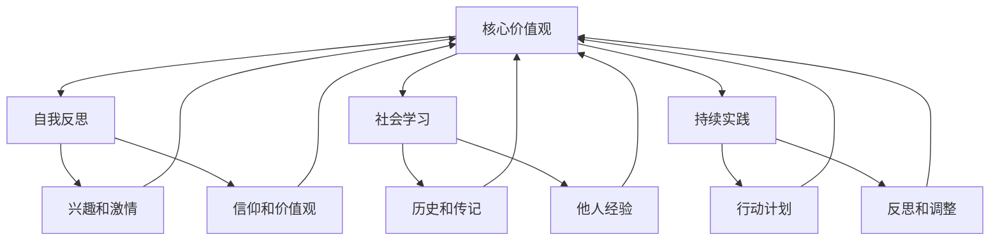

                 

### 引言

#### 核心价值观的重要性

在快速变化的世界中，找到恒常和确定性似乎成了一种奢望。技术、经济和社会的变革正在以前所未有的速度推进，使得每个人都感到无所适从。然而，在这个动荡的环境中，核心价值观的重要性愈发凸显。核心价值观不仅为个人提供了内在的指引，也为组织和社会注入了稳定的力量。

核心价值观是指那些深植于个体和组织内心的基本信念和价值观，它们指导人们的行为和决策，构成了人格和文化的核心。无论外界环境如何变化，这些价值观始终如一，成为人们在不确定性中寻找方向的灯塔。

本书《在快速变化的世界中寻找恒常：建立核心价值观》旨在探讨如何在这个充满变数的世界中，通过建立和坚持核心价值观，找到内心的平静和外在的成功。我们不仅需要理解核心价值观的内涵，更需要掌握实践的方法，从而在个人成长、职业发展和组织管理中发挥其应有的作用。

#### 书籍目的

本书的目标是帮助读者认识到核心价值观的重要性，并提供一套系统的建立和践行核心价值观的方法。通过这本书，读者将：

1. **理解核心价值观的概念和作用**：明确核心价值观在个人和组织中的意义，以及它们如何在快速变化的世界中提供指导。
2. **自我反思和识别个人价值观**：通过自我反思，识别和明确自己的核心价值观，从而在决策和行为中保持一致性。
3. **学习从历史和他人经验中汲取智慧**：通过学习历史和他人的经验，丰富自己的价值观体系，并从过去的成功和失败中汲取教训。
4. **掌握践行核心价值观的方法**：了解如何在日常生活中实践核心价值观，并面对变化和挑战时，坚定地坚持这些价值观。

#### 快速变化的世界

在当今社会，技术进步、经济全球化和社会变革的速度前所未有。数字化转型正使得传统行业和商业模式受到前所未有的冲击，自动化和人工智能的发展正在改变就业结构和工作方式。全球化使得我们能够更便捷地跨越国界，但同时也带来了经济不稳定和文化冲突。

个人层面，快速变化的世界对人们提出了更高的要求。我们需要不断地学习新技能、适应新环境，并在压力和不确定性中保持心理健康。时间管理和精神健康成为现代生活的重要课题。

#### 核心价值观的重要性

在这个快速变化的世界中，核心价值观不仅为个人提供了稳定和方向，还为组织和社会注入了持续发展的动力。核心价值观能够：

1. **提供决策指导**：在面对复杂的决策时，核心价值观可以帮助我们迅速判断哪个选项更符合我们的信念和目标。
2. **增强心理韧性**：当外界环境变化时，坚持核心价值观可以提供内心的力量，帮助我们保持平静和自信。
3. **建立信任和合作**：在组织中，共同的价值观能够增强团队成员之间的信任，促进合作和共同成长。
4. **推动社会进步**：核心价值观可以激发人们追求更高的道德标准和社会责任感，推动社会的可持续发展。

总之，核心价值观是我们在快速变化的世界中寻找恒常的重要工具。通过建立和坚持核心价值观，我们不仅能够在个人层面实现内心的平静和外在的成功，还能为组织和社会的发展贡献力量。接下来，我们将深入探讨在快速变化的世界中，面临的挑战以及如何建立和坚持核心价值观的具体方法。

### 快速变化世界中的挑战

在快速变化的世界中，技术变革、社会变革和个人成长挑战是不可避免的现象，这些变化深刻影响着我们的生活和职业发展。

#### 技术变革

技术变革是当今世界最为显著的特征之一。数字技术的迅猛发展使得信息的获取、处理和传播变得更加快捷和高效。数字化转型已经成为各大企业提升竞争力的关键手段。例如，传统制造业通过引入物联网技术，实现了生产过程的智能化和自动化，大大提高了生产效率和产品质量。

此外，人工智能（AI）和机器学习的崛起正在改变各行各业的运作模式。从自动驾驶汽车到智能客服系统，AI技术的应用正在不断扩大。这不仅改变了人们的工作方式，也引发了关于就业、隐私和数据安全的广泛讨论。

#### 自动化与人工智能

自动化技术的普及和人工智能的发展，正在将许多传统的工作自动化。自动化系统可以在没有人工干预的情况下完成复杂的生产任务，从而减少人力成本和提高生产效率。然而，这也引发了对就业市场的担忧。许多低技能工作可能会被机器取代，导致失业率上升。

人工智能的应用不仅限于制造业，还在医疗、金融、教育等多个领域展现出巨大的潜力。例如，AI可以用于疾病诊断、风险分析和个性化教育，为人类生活带来诸多便利。然而，AI技术的快速发展也带来了数据安全、隐私保护和算法偏见等问题，需要我们认真思考和解决。

#### 社会变革

社会变革同样在快速变化的世界中占据重要地位。全球化使得不同国家和地区的文化、经济和政治联系日益紧密。人们可以更轻松地跨越国界，全球范围内的文化交流和融合变得更加频繁。然而，全球化也带来了经济不稳定和文化冲突的问题。

经济不稳定是全球化进程中的一个重要挑战。国际市场的波动和贸易争端可能导致经济衰退和失业率上升。此外，全球化还加剧了贫富差距，使得一部分人受益，而另一部分人则可能被边缘化。

文化冲突也是全球化带来的挑战之一。不同文化之间的价值观、信仰和行为习惯的差异，可能导致误解和冲突。如何在尊重多样性的同时，维护社会和谐，是一个亟待解决的问题。

#### 个人成长挑战

在快速变化的世界中，个人成长面临着诸多挑战。首先，时间是有限的资源，如何有效地管理时间成为每个人必须面对的问题。高效的时间管理不仅可以提高工作效率，还可以为个人提供更多的自由时间，用于自我提升和兴趣爱好。

其次，精神健康在快速变化的世界中尤为重要。面对工作压力、人际关系挑战和社会变革，人们容易感到焦虑、抑郁和压力。因此，维护良好的精神健康成为个人成长的必修课。

此外，快速变化的世界要求个人具备持续学习的能力。新技术和新知识层出不穷，只有不断学习和更新自己的知识体系，才能保持竞争力。终身学习已经成为现代社会的一个基本要求。

#### 挑战的影响

技术变革、自动化与人工智能、社会变革和个人成长挑战相互交织，对个人和组织产生了深远的影响。个人需要在技术进步中找到自己的定位，在社会变革中保持竞争力，并在个人成长过程中实现内心的平和。

组织则需要在技术变革中找到适合自己的数字化转型路径，在社会变革中应对经济不稳定和文化冲突，并在个人成长挑战中培养具有适应力和创新精神的人才。

总的来说，快速变化的世界为个人和组织带来了前所未有的机遇和挑战。只有通过深刻理解这些变化，并积极应对，才能在变化中找到恒常，实现持续发展和成功。

### 建立核心价值观的方法

在面对快速变化的世界时，建立核心价值观成为个人和组织保持稳定和方向的关键。以下是一些具体的方法，帮助我们在复杂多变的环境中，找到内心的恒常和方向。

#### 自我反思

自我反思是建立核心价值观的第一步。通过深入了解自己的兴趣、信仰和价值观，我们可以明确自己的核心信念，从而在决策和行为中保持一致性。以下是一些自我反思的步骤：

1. **了解自己的兴趣和激情**：思考哪些事情让你充满热情，哪些领域你最感兴趣。这些兴趣和激情往往反映了你的核心价值观。
2. **探索自己的信仰和价值观**：回忆过去的经历，分析哪些经历对你产生了深远的影响。这些经历背后的信仰和价值观可能就是你的核心价值观。
3. **识别自己的优点和缺点**：了解自己的优点可以帮助我们更自信地面对挑战，而了解缺点则可以帮助我们不断提升自我。

#### 确定核心价值观

在自我反思的基础上，我们需要明确自己的核心价值观。核心价值观是一组基本的信念和原则，它们指导我们的行为和决策，构成了我们的身份。以下是一些确定核心价值观的方法：

1. **制作价值观清单**：列出你认为最重要的价值观，例如诚实、责任、尊重、创新等。通过这个过程，你可以更清楚地看到哪些价值观对你最为重要。
2. **价值观排序**：将列出的价值观按照重要性进行排序。这样可以帮助你确定哪些价值观是核心中的核心。
3. **反思和调整**：在完成排序后，回顾和反思每个价值观。看看它们是否真的符合你的内心信念，并进行必要的调整。

#### 社会学习

除了自我反思，社会学习也是建立核心价值观的重要途径。通过学习历史和他人的经验，我们可以丰富自己的价值观体系，并从过去的成功和失败中汲取教训。以下是一些社会学习的方法：

1. **阅读历史和传记**：了解历史上伟大人物的经历和价值观，可以从他们的故事中汲取智慧和灵感。
2. **学习他人的经验**：与身边的人交流，了解他们的价值观和信念，并探讨他们在不同情境下的决策过程。
3. **参与社区活动**：通过参与社区服务、公益活动等，可以更好地理解社会价值观，并从中学习如何在实际生活中践行这些价值观。

#### 持续实践

建立核心价值观是一个持续的过程，需要我们在日常生活中不断实践和强化。以下是一些持续实践的方法：

1. **制定行动计划**：将核心价值观具体化，制定实际可行的行动计划。例如，如果你认为“尊重”是核心价值观之一，你可以制定一些具体的行动，如尊重他人的意见、关注他人的需求等。
2. **定期反思和调整**：定期反思自己的行为和决策，看看是否符合核心价值观。如果发现不一致的地方，及时进行调整。
3. **面对挑战时的坚持**：在面对挑战和困难时，核心价值观可以提供内心的力量，帮助我们保持坚定和自信。例如，当面临职业选择时，坚持自己的核心价值观可以帮助我们做出更明智的决策。

#### 面对变化时的坚持

在快速变化的世界中，坚持核心价值观可能会面临诸多挑战。然而，只有坚持核心价值观，我们才能在变化中保持方向和稳定性。以下是一些建议：

1. **明确核心价值观的重要性**：理解核心价值观对于个人和组织的重要性，可以帮助我们在面对变化时，更加坚定地坚持。
2. **与他人分享**：将核心价值观与他人分享，可以获取支持和反馈，增强坚持的信心。
3. **保持开放心态**：在坚持核心价值观的同时，保持开放心态，接受新的观点和想法，不断丰富和调整自己的价值观体系。

总之，建立核心价值观是一个系统而持续的过程。通过自我反思、社会学习和持续实践，我们可以在快速变化的世界中找到恒常和方向。核心价值观不仅为个人提供了内在的指引，也为组织和社会注入了稳定的力量。

### 值得追求的恒常品质

在快速变化的世界中，坚持某些恒常的品质尤为重要。这些品质不仅有助于我们在个人和职业生活中取得成功，还能帮助我们更好地应对各种挑战。以下是一些值得追求的恒常品质，包括真诚、谦逊和适应力。

#### 真诚

真诚是建立信任和良好关系的基础。它要求我们在与他人交往中保持真实和坦率，不掩饰自己的情感和意见。真诚不仅体现在言语上，更体现在行动中。以下是如何培养真诚的几个建议：

1. **真实表达自己的感受**：不要因为害怕拒绝或冲突而掩饰自己的真实感受。真诚地表达自己，可以建立更深的信任和理解。
2. **尊重他人的感受**：真诚不仅仅是表达自己的观点，还要尊重他人的感受和意见。通过倾听和尊重，我们可以建立更加和谐的人际关系。
3. **行动一致**：真诚意味着言行一致。确保你的行为符合你的言论和价值观，这样可以赢得他人的信任。

#### 谦逊

谦逊是一种重要的品质，它体现为对自己的能力和成就持谦虚态度。谦逊不仅能够帮助我们更好地学习和成长，还能增强团队合作的氛围。以下是如何培养谦逊的几个建议：

1. **承认自己的不足**：谦逊的人不会因为自己的成就而自满。他们愿意承认自己的不足，并从失败和错误中学习。
2. **倾听他人的意见**：谦逊的人愿意倾听他人的意见和批评，并从中汲取智慧。这有助于我们不断提高自己的能力。
3. **分享荣誉**：谦逊的人不会独自占据荣誉，而是愿意与他人分享。通过这种分享，可以增强团队凝聚力。

#### 适应力

适应力是指在面对变化和挑战时，能够灵活调整自己并迅速适应新环境的能力。在快速变化的世界中，适应力尤为重要。以下是如何培养适应力的几个建议：

1. **保持开放心态**：适应力源于开放的心态。愿意接受新观点和变化，有助于我们更快地适应环境。
2. **持续学习**：适应力需要不断学习和更新知识。通过不断学习，我们可以掌握新技能，应对新挑战。
3. **灵活应对**：在面对变化时，不要固守原有的方法和思路。灵活应对，尝试不同的解决方案，有助于我们找到最佳路径。

总之，真诚、谦逊和适应力是我们在快速变化的世界中追求恒常品质的关键。通过培养这些品质，我们不仅可以提高个人素质，还能在职业发展和人际关系中取得更好的成果。这些品质不仅能够帮助我们应对变化，还能为我们带来内心的平静和幸福感。

### 案例分析

在快速变化的世界中，成功的企业和个人往往能够凭借坚定的核心价值观实现卓越成就。以下通过两个典型案例，分析他们在面对变革时如何坚守核心价值观，从而取得成功。

#### 成功的企业

**苹果公司**：苹果公司（Apple Inc.）以其创新和设计美感闻名于世。其核心价值观包括创新、简洁和用户体验。尽管市场竞争激烈，苹果公司始终坚守这些核心价值观，从而在多个领域取得了巨大成功。

1. **创新**：苹果公司自成立以来，一直致力于创新。从iPod到iPhone，再到Apple Watch，苹果不断推出颠覆性的产品，引领科技潮流。这种创新精神不仅推动了公司的发展，也改变了人们的消费习惯。

2. **用户体验**：苹果公司的产品设计注重用户体验，简洁而优雅。无论是操作系统的界面设计，还是硬件产品的功能，苹果都力求为用户带来最佳的使用体验。这种用户至上的理念，使苹果赢得了广泛的用户忠诚度。

3. **简洁**：苹果公司的产品设计强调简洁和高效。例如，Mac电脑的操作系统简洁易用，iPod的界面直观简洁。这种简洁不仅提高了用户的生产力，也增强了产品的竞争力。

**阿里巴巴**：阿里巴巴集团（Alibaba Group）是另一家在快速变化的世界中坚守核心价值观的企业。其核心价值观包括客户至上、团队合作、诚信和创新。

1. **客户至上**：阿里巴巴一直将客户需求放在首位。通过不断优化平台服务，提升用户体验，阿里巴巴赢得了客户的信任和忠诚。例如，淘宝网通过简化购物流程，提高了交易效率，为消费者提供了更好的购物体验。

2. **团队合作**：阿里巴巴强调团队合作精神。通过建立开放、透明的沟通机制，鼓励员工之间的合作和协作，阿里巴巴培养了一支高效、团结的团队。这种团队合作精神不仅提高了工作效率，也增强了企业的创新能力。

3. **诚信和创新**：阿里巴巴一直强调诚信和创新。在电子商务领域，诚信是企业的生命线。阿里巴巴通过建立信用体系，保障交易安全，赢得了市场的信任。同时，阿里巴巴不断创新，推出新的产品和服务，满足不断变化的市场需求。

#### 个人成长故事

**马云**：阿里巴巴集团的创始人马云是一位典型的成功企业家，他的故事充满了坚持核心价值观的元素。

1. **坚持使命**：马云在创建阿里巴巴之初，就明确了公司的使命：“让天下没有难做的生意”。这个使命不仅激励了阿里巴巴的团队，也成为公司在面对各种挑战时坚持的方向。

2. **诚信经营**：尽管在创业初期，马云面临了重重困难，但他始终坚守诚信经营的原则。他坚信，只有诚信才能赢得客户的信任，从而推动企业的发展。

3. **持续创新**：面对激烈的市场竞争，马云不断推动创新。他不仅推动了电子商务的普及，还带领阿里巴巴涉足了云计算、金融科技等多个领域，推动了企业的持续发展。

通过这些案例，我们可以看到，无论是企业还是个人，在面对快速变化的世界时，坚守核心价值观都是至关重要的。这些核心价值观不仅为企业和个人提供了方向和动力，也帮助他们克服了各种挑战，实现了长期的成功。

### 个人实践

#### 制定个人核心价值观

在个人实践中，制定核心价值观是找到内心方向和目标的重要一步。以下是一个详细的步骤，帮助您确定自己的核心价值观：

1. **自我反思**：首先，花时间思考您的生活经历，包括重要的成长阶段、重大决策和影响深远的经历。这些经历可以帮助您识别出那些对您产生深远影响的价值观。

2. **列出价值观清单**：根据自我反思的结果，列出您认为最重要的价值观。这些价值观可以是抽象的，如诚信、尊重、创新等，也可以是具体的，如责任感、学习、健康等。

3. **价值观排序**：对列出的价值观进行排序，确定哪些价值观在您的生命中占据最高优先级。排序有助于您在决策时明确哪些价值观是核心中的核心。

4. **反思和调整**：在完成排序后，回顾每个价值观，确保它们真正符合您的内心信念。如果发现某些价值观不够重要或不再适用，可以进行调整或删除。

5. **制定行动计划**：将核心价值观具体化，制定实际可行的行动计划。例如，如果“学习”是核心价值观之一，您可以制定每天阅读一小时、每月学习一门新技能等具体目标。

#### 将价值观融入日常生活

将核心价值观融入日常生活需要持续的努力和实践。以下是一些方法：

1. **日常行为实践**：在日常生活中，根据核心价值观指导您的行为。例如，如果“尊重”是核心价值观之一，您可以在与他人的互动中表现出尊重，如倾听他人的意见、尊重他人的隐私等。

2. **制定日常习惯**：将核心价值观融入日常习惯，有助于在无形中坚持这些价值观。例如，每天早上花几分钟反思自己的行为，看看是否符合核心价值观。

3. **记录和反思**：定期记录自己的行为和决策，反思是否与核心价值观保持一致。这有助于您发现并改正不符合核心价值观的行为。

4. **与他人分享**：将核心价值观与他人分享，可以获取支持和反馈，增强坚持的信心。例如，与家人、朋友或同事讨论您的价值观，并探讨如何在日常生活中实践。

#### 面对变化时的实践

在快速变化的世界中，坚持核心价值观可能会面临各种挑战。以下是一些建议，帮助您在变化中保持核心价值观：

1. **明确核心价值观的重要性**：在变化中，核心价值观是您内心的指南针。理解核心价值观对于个人成长和职业发展的价值，可以帮助您坚定地坚持。

2. **与他人交流**：在面对变化时，与他人交流可以获取不同的观点和建议，有助于您更好地应对挑战。通过与家人、朋友或同事讨论，可以增强坚持核心价值观的信心。

3. **保持开放心态**：在坚持核心价值观的同时，保持开放心态，接受新的观点和想法。这有助于您不断丰富和调整自己的价值观体系，以适应新的环境和挑战。

4. **灵活应对**：在变化中，灵活应对是必要的。根据核心价值观，灵活调整自己的行动策略，以适应新的情况。例如，如果核心价值观是“学习”，您可以在面对新知识时，灵活调整学习方法和时间安排。

总之，制定和坚持个人核心价值观不仅可以帮助您在个人和职业生活中找到方向和目标，还能在快速变化的世界中提供稳定的力量。通过自我反思、将价值观融入日常生活和面对变化时的坚持，您可以在任何环境中保持内心的平和和外在的成功。

### 结语

核心价值观的力量在于它们为我们提供了在快速变化的世界中寻找恒常的指南针。通过建立和坚持核心价值观，我们不仅能够在个人生活中找到内心的方向，还能在职业发展和组织管理中实现稳定和成功。在未来的发展中，核心价值观将继续发挥重要作用，帮助我们应对不断变化的环境和挑战。

首先，随着技术的不断进步，社会将继续面临深刻的变革。人工智能、自动化和区块链等新兴技术将深刻改变我们的工作方式和生活方式。在这个背景下，坚守核心价值观将帮助我们在技术变革中找到自己的定位，并保持竞争力。

其次，社会变革将继续推动全球化进程，带来新的经济机会和挑战。面对经济不稳定和文化冲突，核心价值观将成为我们应对不确定性的力量。通过坚持诚信、合作和创新等核心价值观，我们可以更好地适应全球经济环境，推动个人和组织的发展。

最后，在个人成长方面，持续学习和自我提升将成为关键。面对不断变化的知识体系和技能需求，坚守核心价值观可以帮助我们在学习过程中保持方向和动力，实现终身成长。

总之，核心价值观是我们寻找恒常的关键。在未来的发展中，无论面对何种变化，坚守核心价值观将帮助我们保持内心的平和和外在的成功。让我们在快速变化的世界中，继续坚持和践行核心价值观，共同迎接更加美好的未来。

### 附录

在本篇博客中，我们深入探讨了在快速变化的世界中，如何建立和坚持核心价值观。以下是文章中提到的核心概念、算法原理、数学模型以及项目实战案例的详细解析。

#### 核心概念与联系

在文章中，我们提到了以下核心概念：核心价值观、自我反思、社会学习、持续实践、真诚、谦逊、适应力。以下是它们之间的联系架构图：



#### 核心算法原理讲解

为了帮助读者更好地理解核心价值观的建立和坚持过程，我们使用以下伪代码来详细阐述：

```python
# 伪代码：建立核心价值观
def establishCoreValues():
    # 步骤1：自我反思
    self_reflection()
    # 步骤2：确定核心价值观
    core_values = determineCoreValues()
    # 步骤3：制定行动计划
    action_plan = createActionPlan(core_values)
    # 步骤4：持续实践
    while True:
        practice核心价值观(action_plan)
        reflect_and_adjust()
```

#### 数学模型和公式

在核心价值观的建立和坚持过程中，我们使用了以下数学公式来解释：

1. **决策模型**：用于判断行为是否符合核心价值观。

   $$决策模型 = 核心价值观 \times 当前情境 \times 个人信念$$

   公式解释：决策模型通过结合核心价值观、当前情境和个人信念，帮助我们做出符合核心价值观的决策。

2. **适应力公式**：用于评估个体在面对变化时的适应能力。

   $$适应力 = 适应能力 \times 学习能力 \times 反应速度$$

   公式解释：适应力通过评估个体的适应能力、学习能力和反应速度，衡量个体在面对变化时的适应程度。

#### 项目实战案例分析

在本文中，我们通过分析苹果公司和阿里巴巴等成功案例，展示了如何坚守核心价值观。以下是具体案例的实战解析：

1. **苹果公司**：通过创新、用户体验和简洁等核心价值观，苹果公司在激烈的市场竞争中保持了领先地位。其成功的关键在于始终将用户需求放在首位，并通过持续创新不断满足市场需求。

2. **阿里巴巴**：阿里巴巴通过客户至上、团队合作和诚信等核心价值观，建立了强大的品牌和市场份额。其成功在于始终坚持以客户为中心，同时通过团队合作和创新，不断提升服务质量和用户体验。

#### 最佳实践 tips

1. **自我反思**：定期进行自我反思，识别和调整核心价值观，确保它们符合您的个人和职业目标。

2. **持续学习**：保持开放心态，不断学习新知识和技能，以适应快速变化的世界。

3. **实践核心价值观**：将核心价值观融入日常生活，通过实际行动践行这些价值观。

4. **与他人分享**：与他人分享您的核心价值观，获取反馈和支持，增强坚持的信心。

通过以上解析，我们希望读者能够更好地理解核心价值观的建立和坚持过程，并在实际应用中取得成功。

### 拓展阅读

1. **《原则》（Principles）** - 雷·达里奥（Ray Dalio）：这本书详细阐述了如何通过建立和坚持原则，实现个人和职业的成功。

2. **《深度工作》（Deep Work）** - 卡尔·纽波特（Cal Newport）：作者介绍了如何在信息爆炸的时代，通过深度工作保持专注和高效。

3. **《异类》（Outliers）** - 马尔科姆·格拉德威尔（Malcolm Gladwell）：本书探讨了成功背后的因素，包括文化、环境和机遇等。

4. **《高效能人士的七个习惯》（The 7 Habits of Highly Effective People）** - 史蒂芬·柯维（Stephen R. Covey）：这本书介绍了如何通过培养良好习惯，实现个人和职业的成功。

这些书籍提供了丰富的理论和实践经验，可以帮助读者在建立和坚持核心价值观的过程中，找到更多的灵感和方法。希望读者通过拓展阅读，进一步深化对核心价值观的理解和应用。

