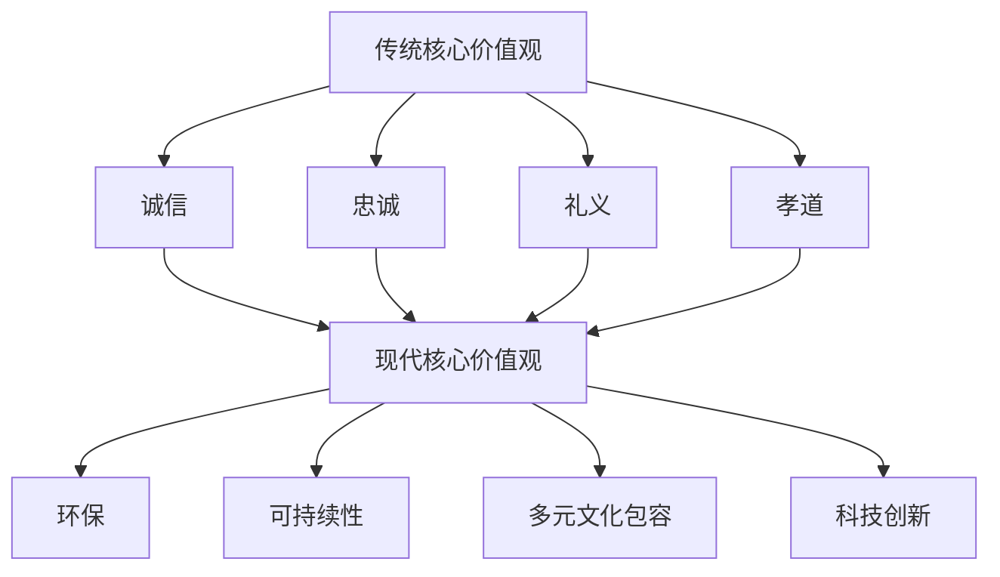

                 

## 引言

在快速变化的世界中寻找恒常：建立核心价值观

当今世界，科技的发展日新月异，社会变革此起彼伏。人工智能、大数据、区块链等新兴技术的涌现，使得我们的生活、工作和思维方式都在发生翻天覆地的变化。这种快速变化的环境给人们带来了无尽的机遇，同时也带来了诸多挑战。在这样的背景下，如何在这个瞬息万变的世界中找到恒常，成为了一个值得深入探讨的问题。

核心价值观，作为人们行为和决策的内在指导原则，是我们在复杂多变的环境中寻找恒常的重要依据。核心价值观不仅影响着个人的生活和发展，也影响着企业、社会乃至整个世界的运行。建立并坚持核心价值观，可以帮助我们在快速变化的世界中保持清晰的方向和稳定的信念。

本文旨在探讨在快速变化的世界中如何寻找并建立核心价值观。我们将从背景介绍、核心概念与联系、核心算法原理讲解、数学模型和公式、项目实战、最佳实践 tips、小结和拓展阅读等方面进行详细阐述。

### 背景介绍

随着全球化和信息化的加速推进，人类社会的方方面面都在经历深刻的变革。科技的发展，尤其是人工智能、大数据、物联网等技术的普及，不仅改变了我们的生活方式，也改变了我们的工作方式。这些技术的进步，使得我们能够以前所未有的速度获取和处理信息，从而提高了生产效率，推动了经济增长。然而，与此同时，我们也面临着诸多挑战。

首先，技术的快速变革使得知识更新速度加快，人们需要不断地学习新知识、新技能，以适应不断变化的工作环境。其次，社会结构的变迁，尤其是全球化带来的文化碰撞和融合，使得人们的价值观观念发生了变化。在这样一个多元化和复杂化的社会环境中，如何找到自己的定位，成为一个令人困惑的问题。此外，科技的进步也带来了一些负面影响，如隐私侵犯、数据安全等问题，这些问题需要我们重新审视我们的核心价值观，以寻找解决问题的途径。

### 核心价值观的恒常性

在快速变化的世界中，核心价值观的恒常性显得尤为重要。核心价值观不仅仅是一套原则或规范，它更是人们内心深处对生活、工作和世界的基本认知和信仰。无论外部环境如何变化，核心价值观都应该是我们行为的指南针，引导我们做出正确的决策。

首先，核心价值观具有内在的一致性和稳定性。它不是随着外界环境的变化而随意改变的，而是在长期的实践中逐渐形成的，反映了个人或组织的内在特质和基本信念。例如，诚信、公正、创新等核心价值观，无论在哪个时代、哪个国家，都是人们普遍认同和追求的。

其次，核心价值观在快速变化的世界中具有指导意义。它帮助我们保持清晰的思维和稳定的心态，面对各种挑战和变化。例如，在面对职业选择时，如果我们的核心价值观是追求个人成长和贡献社会，那么我们就能够理性地分析各种机会，做出最适合自己的决策。同样，在企业运营中，核心价值观可以帮助企业确定发展方向和战略目标，保持持续的竞争力。

总之，核心价值观的恒常性为我们提供了一个稳定的参考框架，使我们在快速变化的世界中能够找到自己的定位，保持内心的平静和自信。这种恒常性不仅对个人发展至关重要，也对企业的长期成功和社会的稳定发展具有深远的影响。

### 核心价值观的重要性

核心价值观的重要性不容忽视。首先，它为我们提供了行为的准则和方向。在复杂多变的环境中，如果没有明确的核心价值观，人们容易迷失方向，无法做出明智的决策。例如，在企业中，如果缺乏明确的核心价值观，可能会导致内部管理混乱，战略决策失误，影响企业的长远发展。其次，核心价值观有助于建立和维护人际关系。无论是家庭、朋友还是同事，共同的价值观是建立信任和合作的基础。最后，核心价值观还影响着社会的稳定和发展。一个社会如果缺乏共同的价值观，容易产生冲突和动荡，阻碍社会的进步。因此，核心价值观不仅对个人和企业具有重要作用，也对整个社会具有重要意义。

### 结论

在快速变化的世界中，建立并坚持核心价值观具有重要意义。核心价值观不仅为个人提供了行为的准则和方向，帮助我们在复杂多变的环境中保持清晰和稳定，还为企业的成功和社会的稳定发展提供了坚实的基础。在接下来的章节中，我们将深入探讨核心价值观的定义与分类、快速变化世界中的价值观演变、核心价值观的建立与维护，以及核心价值观在不同层面的应用。通过这些探讨，希望能够帮助读者更好地理解和应用核心价值观，实现个人和组织的持续发展。

## 核心价值观的定义与分类

### 1. 核心价值观的定义

核心价值观是指个人、组织或社会普遍认同的基本信念、行为准则和价值取向。它们是行为和决策的内在依据，反映了人们对于什么是正确、什么是重要的共同认知。核心价值观不仅是一套原则或规范，更是人们内心深处对于生活、工作和社会的基本信仰。

在个人层面，核心价值观是个人行为的指南针，影响着个人的生活方式、职业选择和人际关系。例如，诚信、公正、尊重和合作等核心价值观，帮助个人在面对各种情境时做出明智的决策，建立良好的人际关系，实现个人成长和自我价值。在企业层面，核心价值观是企业文化的核心，指导企业的运营策略、员工行为和客户服务。例如，创新、责任、卓越和服务等核心价值观，帮助企业在竞争激烈的市场中保持持续的创新动力和竞争优势。在社会层面，核心价值观是社会共同遵守的基本准则，反映了社会的价值观念和文化特征。例如，自由、平等、公正和和谐等核心价值观，为社会成员提供了共同的行为规范，促进社会的稳定和进步。

### 2. 核心价值观的分类

核心价值观可以根据不同的标准进行分类。以下是一些常见的分类方式：

- **传统核心价值观**：这些价值观通常源自历史和文化传统，是长期实践和共识的产物。例如，在中国传统文化中，孝道、忠诚、礼义、诚信等是重要的核心价值观。在西方文化中，自由、民主、平等、法治等也被视为重要的传统核心价值观。

- **现代核心价值观**：随着社会的发展，一些新的核心价值观逐渐出现，反映了现代社会的新特征和价值取向。例如，环保、可持续性、多元文化包容、科技创新等是现代核心价值观的典型代表。

- **个体核心价值观**：这些价值观是个人根据自身的经历、教育和信仰形成的，反映了个人独特的价值观体系。例如，有些人可能将“家庭幸福”视为最重要的核心价值观，而有些人可能更看重“个人成就”。

- **组织核心价值观**：这些价值观是组织共同遵守的基本信念和行为准则，反映了组织的文化特征和发展目标。例如，企业可能将“客户至上”、“创新驱动”或“社会责任”作为核心价值观。

- **社会核心价值观**：这些价值观是全社会普遍认同的基本价值观念，为社会成员提供共同的行为规范和道德准则。例如，不同国家和地区可能将“自由”、“平等”、“公正”或“和谐”作为核心价值观。

### 3. 传统核心价值观

传统核心价值观是历史和文化的积淀，具有深厚的社会基础和广泛的认同。以下是一些典型的传统核心价值观：

- **诚信**：诚信是传统核心价值观的重要方面，强调诚实守信、言行一致。在商业活动中，诚信是建立信任关系的基础，有助于促进交易的顺利进行。

- **忠诚**：忠诚是指对家庭、组织、国家等的忠诚。忠诚是家庭和谐、组织稳定和国家繁荣的重要保障。

- **礼义**：礼义强调礼仪和道德规范，是维护社会秩序和人际关系和谐的重要手段。在传统文化中，礼义被视为人际交往的基本准则。

- **孝道**：孝道是指对父母的尊敬和孝顺，是家庭伦理的核心。孝道不仅影响个人的行为和态度，也对社会道德风气有积极的示范作用。

这些传统核心价值观不仅在历史上具有重要地位，在现代社会中也依然具有现实意义。它们为我们提供了行为的准则，帮助我们应对复杂多变的社会环境。

### 4. 现代核心价值观

随着社会的进步和科技的发展，现代核心价值观逐渐形成，反映了现代社会的新特征和价值取向。以下是一些重要的现代核心价值观：

- **环保**：环保是指对自然环境的保护和可持续发展。随着环境污染和资源短缺问题的日益严重，环保成为全球共同关注的重要议题。环保价值观强调人类与自然的和谐共处，倡导绿色生活、节能减排和生态修复。

- **可持续性**：可持续性是指在满足当前需求的同时，不损害后代满足其需求的能力。可持续性价值观强调经济、社会和环境的协调发展，是应对全球化挑战的重要策略。

- **多元文化包容**：多元文化包容是指尊重和接纳不同的文化背景和价值观。在全球化背景下，多元文化包容成为促进文化交流、增进理解和合作的重要途径。

- **科技创新**：科技创新是指通过科学研究和技术创新推动社会进步。科技创新价值观强调创新思维、研发投入和技术应用，是推动经济增长和社会发展的重要动力。

这些现代核心价值观不仅反映了现代社会的特征，也为我们的行为提供了新的指导原则。它们帮助我们应对快速变化的环境，推动社会的持续进步。

### 5. 核心价值观之间的关系架构

为了更清晰地理解核心价值观之间的关系，我们可以使用 Mermaid 流程图来展示它们之间的联系。以下是一个简化的 Mermaid 流程图：

这个流程图展示了传统核心价值观与现代核心价值观之间的联系，以及它们之间的相互影响。传统核心价值观为现代社会提供了基础和底蕴，而现代核心价值观则反映了时代的特点和需求，共同构成了一个完整的价值观体系。

通过上述讨论，我们可以看出核心价值观在不同层面和时代中的重要性。理解并分类核心价值观，不仅有助于我们更好地应对快速变化的世界，也有助于我们实现个人成长和社会进步。

### 核心价值观的演变

在快速变化的世界中，价值观的演变是不可避免的。社会变革和技术进步对价值观的影响深远，使得核心价值观不断适应新的环境和需求。理解这些演变过程，有助于我们更好地把握核心价值观的发展趋势，从而在变化中寻找恒常。

#### 1. 社会变革对价值观的影响

社会变革是价值观演变的重要推动力。随着社会结构、经济模式和文化观念的变迁，人们的价值观也在不断调整。以下是一些具体的影响：

- **全球化**：全球化带来了文化碰撞和融合，使得不同文化之间的价值观相互影响。全球化促进了跨国公司和跨国交流，使得人们对多样性、包容性和国际视野有了更高的重视。同时，全球化也带来了利益冲突和文化冲突，需要人们更加理性和客观地看待不同文化之间的差异。

- **信息技术革命**：信息技术的飞速发展，尤其是互联网的普及，改变了人们的沟通方式、工作方式和生活习惯。信息技术革命对价值观的影响主要体现在以下方面：首先，信息技术使得信息获取更加便捷，促进了知识传播和共享，提高了人们的认知水平。其次，信息技术推动了民主化进程，使得信息更加透明，公众参与度提高。最后，信息技术也带来了一些负面影响，如隐私侵犯、网络安全问题等，需要人们重新审视和调整价值观。

- **经济改革**：经济改革，特别是市场经济体制的建立和完善，对人们的价值观产生了深远影响。市场经济强调竞争、效率和利益最大化，使得人们更加注重个人利益和物质财富的追求。然而，市场经济也带来了一些负面影响，如贫富差距、资源浪费等，需要人们更加关注社会责任和公平正义。

#### 2. 技术进步对价值观的影响

技术进步是推动社会变革的重要力量，同时也对人们的价值观产生直接影响。以下是一些具体的影响：

- **人工智能**：人工智能的发展使得人类的工作和生活方式发生了巨大变化。人工智能不仅在工业生产中发挥重要作用，还渗透到我们的日常生活中。人工智能带来的价值观变革主要体现在以下几个方面：首先，人工智能提高了生产效率，使得人们有更多的时间和精力追求个人发展和兴趣。其次，人工智能带来了新的职业和岗位，需要人们不断学习和适应新技术。最后，人工智能也可能带来一些道德和伦理问题，如隐私保护、人工智能伦理等，需要人们重新审视和调整价值观。

- **大数据**：大数据技术的发展，使得人们能够更加全面和深入地了解社会和个体。大数据不仅改变了信息处理和决策方式，也对人们的价值观产生深远影响。大数据带来的价值观变革主要体现在以下几个方面：首先，大数据使得信息更加透明和公开，提高了社会的信任度和透明度。其次，大数据也带来了一些隐私和信息安全问题，需要人们更加关注个人隐私和信息安全。最后，大数据使得个性化服务和定制化成为可能，需要人们更加关注个人价值和自我实现。

- **区块链**：区块链技术的发展，为金融、供应链管理、身份验证等领域带来了新的机遇。区块链的去中心化、不可篡改和透明性等特点，对人们的价值观产生了重要影响。区块链带来的价值观变革主要体现在以下几个方面：首先，区块链强调了去中心化和集体协作，挑战了传统权威和中心化的观念。其次，区块链也带来了一些新的安全和隐私问题，需要人们更加关注数据安全和隐私保护。最后，区块链为去中心化和分布式计算提供了新的技术路径，需要人们重新思考组织和管理方式。

#### 3. 快速变化世界中的价值观挑战

在快速变化的世界中，核心价值观面临着诸多挑战。以下是一些主要挑战：

- **多元文化冲突**：全球化带来了多元文化的交流与融合，但同时也带来了文化冲突。如何在尊重多元文化的同时，维护核心价值观的稳定性和一致性，是一个重要的挑战。

- **技术伦理问题**：人工智能、大数据和区块链等新兴技术，带来了诸多技术伦理问题。如何平衡技术发展和道德规范，维护社会的公平正义，是一个重要的挑战。

- **信息过载**：信息技术的快速发展，使得信息获取变得极为便捷，但也带来了信息过载的问题。如何在海量信息中找到有价值的信息，保持清晰的思维和判断力，是一个重要的挑战。

- **个人隐私**：随着大数据和人工智能的发展，个人隐私保护成为一个突出问题。如何在享受技术便利的同时，保护个人隐私，是一个重要的挑战。

#### 4. 核心价值观的演变趋势

在快速变化的世界中，核心价值观的演变趋势主要表现在以下几个方面：

- **多元化和包容性**：随着全球化和文化交流的加深，核心价值观将越来越多元化和包容性。人们将更加尊重和接纳不同的文化和价值观，推动社会的和谐与进步。

- **技术伦理化**：随着技术发展的深入，技术伦理问题将越来越受到重视。核心价值观将更加注重技术伦理，推动技术发展与道德规范的平衡。

- **个性化与自我实现**：信息技术的发展，使得个性化服务和定制化成为可能。核心价值观将更加注重个性化与自我实现，帮助人们实现个人价值和成长。

- **可持续发展**：随着环境问题的日益严重，可持续发展成为全球共识。核心价值观将更加注重环保和可持续发展，推动人类与自然的和谐共处。

总之，在快速变化的世界中，核心价值观的演变是不可避免的。社会变革和技术进步，既带来了挑战，也带来了机遇。通过理解核心价值观的演变趋势，我们可以更好地应对快速变化的世界，实现个人和组织的持续发展。

### 核心价值观的建立与维护

在快速变化的世界中，建立和维护核心价值观是一个复杂而重要的过程。这一过程不仅涉及个体的内心塑造，也涉及组织和社会的外在影响。以下我们将详细探讨如何在个人层面、企业层面和社会层面建立和维护核心价值观。

#### 1. 个人层面核心价值观的建立与维护

在个人层面，核心价值观的建立和维护主要依赖于自我认知和内外部环境的影响。

- **自我认知**：个人需要通过自我反思和不断学习，明确自己的价值观。这可以通过以下方法实现：
  - **日记法**：通过写日记记录自己的所思所感，可以帮助个人更好地了解自己的内心世界和价值观。
  - **读书法**：阅读经典文学作品、哲学书籍和成功人士的自传，可以拓宽个人的视野，帮助个人建立和丰富自己的价值观。
  - **交流法**：与朋友、家人和导师交流，听取不同的意见和建议，可以帮助个人更好地认识自己，找到适合自己的核心价值观。

- **内外部环境的影响**：个人核心价值观的建立和维护还受到内外部环境的影响。以下是一些具体措施：
  - **家庭环境**：家庭是个人成长的第一个环境，家庭的文化氛围和价值观念对个人的核心价值观有着深远影响。一个和谐、尊重和学习的家庭环境，有助于个人形成积极的核心价值观。
  - **社会文化**：社会文化是个人价值观形成的重要外部因素。一个积极向上、公正包容的社会环境，有助于个人建立和维护积极的核心价值观。

- **实践与调整**：核心价值观的建立和维护需要通过实践来验证和调整。个人可以通过以下方式实践和调整自己的核心价值观：
  - **日常行为**：通过日常行为来实践核心价值观，如诚信待人、公平竞争、尊重他人等，可以使核心价值观内化为个人的行为习惯。
  - **反思与修正**：定期反思自己的行为和决策，评估是否符合自己的核心价值观，如果发现不一致的地方，需要及时进行调整。

#### 2. 企业层面核心价值观的建立与维护

在企业层面，核心价值观的建立与维护是企业文化建设和战略发展的重要一环。

- **企业使命与愿景**：企业使命和愿景是企业核心价值观的集中体现。企业需要明确自己的使命和愿景，并将其融入企业的日常运营和员工行为中。

- **企业文化建设**：企业文化是核心价值观在企业内部的具体体现。企业可以通过以下方式建立和强化企业文化：
  - **制度保障**：建立完善的制度体系，确保核心价值观在企业内部得到贯彻执行。
  - **员工培训**：通过培训和教育，帮助员工理解和认同企业的核心价值观，并将其转化为具体的行为。
  - **激励机制**：建立激励机制，鼓励员工在实践中践行企业的核心价值观。

- **领导层示范**：企业领导层在核心价值观的建立与维护中起着关键作用。领导层需要以身作则，带头践行企业的核心价值观，为员工树立榜样。

- **外部沟通**：企业还需要通过对外宣传和沟通，展示企业的核心价值观，增强社会对企业的认同和支持。

#### 3. 社会层面核心价值观的建立与维护

在社会层面，核心价值观的建立与维护是一个复杂而长期的过程，需要政府、企业、媒体和社会组织共同努力。

- **政府引导**：政府在核心价值观的建立与维护中发挥着重要的引导作用。政府可以通过政策法规、教育宣传等方式，推动社会形成积极的核心价值观。

- **媒体传播**：媒体是传播核心价值观的重要渠道。媒体可以通过新闻报道、专题节目、公益广告等方式，传播积极的核心价值观，引导公众形成正确的价值观念。

- **社会组织参与**：社会组织，如非政府组织、社区组织等，在社会核心价值观的建立与维护中发挥着重要作用。社会组织可以通过开展公益活动、提供志愿服务等方式，推动社会形成积极的核心价值观。

- **公众参与**：公众是核心价值观的受益者和实践者。公众需要积极参与到核心价值观的建立与维护中，通过自己的行为和言论，推动社会的进步和发展。

#### 4. 多层面协同与互动

个人层面、企业层面和社会层面的核心价值观建立与维护是一个相互关联、相互促进的过程。只有通过多层面的协同与互动，才能形成全社会共同遵守的核心价值观体系。

- **内部互动**：个人和企业需要通过互动，实现核心价值观的内化和实践。企业可以为员工提供学习和实践核心价值观的平台和机会，员工可以通过企业的文化和实践，进一步巩固和强化自己的核心价值观。

- **外部协同**：个人和企业需要与社会协同，共同推动核心价值观的建立与维护。企业可以通过社会责任项目，参与社会公益活动，推动社会形成积极的核心价值观。

- **跨层面互动**：个人和企业需要通过跨层面的互动，实现核心价值观的传播和弘扬。个人可以通过参与社会活动，传播自己的核心价值观；企业可以通过对外合作，推广企业的核心价值观。

通过个人层面、企业层面和社会层面的协同与互动，我们可以共同推动核心价值观的建立与维护，为构建和谐、稳定和进步的社会奠定坚实基础。

### 个人层面核心价值观的应用

在个人层面，核心价值观的应用贯穿于生活的方方面面，影响我们的决策、发展以及人际交往。以下我们将详细探讨个人层面核心价值观的应用，包括在个人决策中的核心价值观、个人发展中的核心价值观以及个人生活中的核心价值观实践。

#### 1. 个人决策中的核心价值观

在个人决策中，核心价值观是我们判断和选择的重要依据。一个明确的价值观可以帮助我们在复杂的情境中做出明智的决策。

- **诚信**：诚信是个人决策的核心价值观之一。在面对选择时，诚信要求我们遵循道德原则，诚实地表达自己的想法和决策。例如，在求职过程中，诚信使我们能够真实地展现自己的能力和经历，赢得雇主的信任。

- **公正**：公正要求我们对待他人公平，不偏袒任何一方。在决策中，公正使我们能够客观地分析问题，避免主观偏见。例如，在团队项目中，公正地分配任务和资源，可以增强团队成员的信任和合作。

- **尊重**：尊重他人是个人决策中的重要价值观。尊重他人意味着理解和接纳他人的观点和需求。在决策中，尊重他人可以帮助我们建立良好的人际关系，促进协作。例如，在家庭决策中，尊重家人的意见，可以有效避免冲突，增强家庭和谐。

- **创新**：创新是推动个人发展的重要价值观。在决策中，创新使我们能够寻找新的解决方案，突破传统思维。例如，在面对职业瓶颈时，创新思维可以帮助我们发现新的机会，实现个人成长。

#### 2. 个人发展中的核心价值观

个人发展中的核心价值观指导我们追求成长和进步，帮助我们设定目标并实现自我价值。

- **学习**：学习是个人发展的核心价值观之一。持续学习不仅能够提升我们的知识和技能，还能拓展我们的思维和视野。例如，通过不断学习新知识，我们可以适应快速变化的工作环境，提高职业竞争力。

- **成长**：成长价值观强调个人的不断进步和发展。在职业发展中，成长价值观促使我们设定明确的目标，并为之努力。例如，设定成为一名优秀项目经理的目标，通过学习项目管理知识和技能，不断提升自己的能力。

- **贡献**：贡献价值观鼓励我们将个人的能力和资源用于社会和他人。在职业发展中，贡献价值观使我们更加关注自己的工作对社会的影响。例如，通过参与社会公益活动，我们可以实现个人价值，同时也为社会做出贡献。

- **平衡**：平衡价值观强调工作和生活的平衡。在个人发展中，平衡价值观帮助我们合理安排时间，避免过度劳累。例如，通过设定合理的作息时间，我们可以保持身心健康，提高工作效率。

#### 3. 个人生活中的核心价值观实践

在个人生活中，核心价值观的实践体现在日常行为和人际关系中，帮助我们在复杂多变的环境中保持清晰的价值观和稳定的心态。

- **家庭生活**：在家庭生活中，核心价值观如诚信、尊重和爱，是维护家庭和谐的重要基石。例如，通过诚信沟通，家庭成员可以更好地理解彼此，解决矛盾；通过尊重，家庭成员可以彼此包容，减少冲突；通过爱，家庭成员可以建立深厚的感情，共同度过美好时光。

- **社交互动**：在社交互动中，核心价值观如公正、合作和创新，帮助我们建立良好的人际关系。例如，在团队合作中，公正地分配任务和资源，可以增强团队的凝聚力；通过合作，我们可以共同完成任务，实现团队目标；通过创新，我们可以提出新的解决方案，推动团队进步。

- **自我管理**：在自我管理中，核心价值观如自律、耐心和责任感，帮助我们实现自我提升和目标达成。例如，通过自律，我们可以养成良好的生活习惯，提高工作效率；通过耐心，我们可以面对挑战和困难，坚持不懈；通过责任感，我们可以认真对待自己的工作和生活，实现自我价值。

- **持续学习**：在个人生活中，持续学习是核心价值观的实践之一。通过不断学习新知识和技能，我们可以不断提升自己的能力，适应社会变化。例如，通过学习新的烹饪技巧，我们可以提高家庭生活质量；通过学习新的编程语言，我们可以提升职业竞争力。

总之，在个人层面，核心价值观的应用贯穿于我们的决策、发展和生活，帮助我们应对快速变化的世界，实现个人成长和幸福。通过实践核心价值观，我们可以建立良好的人际关系，实现自我价值，为社会贡献自己的力量。

### 企业层面核心价值观的应用

在企业的运营和管理中，核心价值观的确定和贯彻具有至关重要的意义。它不仅为企业提供了明确的发展方向和行为准则，也为员工提供了共同的信仰和目标。以下，我们将详细探讨企业层面核心价值观的应用，包括企业文化中的核心价值观、企业战略中的核心价值观以及企业管理中的核心价值观实践。

#### 1. 企业文化中的核心价值观

企业文化是企业灵魂的体现，是企业价值观的具体表现形式。核心价值观在企业文化建设中扮演着核心角色，它通过企业价值观的传播和践行，影响着企业的整体氛围和行为方式。

- **使命与愿景**：企业的使命和愿景是其核心价值观的具体体现。企业的使命通常描述企业存在的目的和意义，愿景则描绘企业未来希望达到的状态。例如，谷歌的使命是“整合全球信息，使人人皆可访问并从中受益”，这一使命深刻体现了谷歌的核心价值观，即创新、用户至上和社会责任。

- **价值观宣传**：企业需要通过多种途径宣传和传播核心价值观，确保员工理解并认同企业的价值观。这可以通过企业内部的培训、宣传海报、员工手册和公司网站等渠道实现。例如，阿里巴巴的“客户第一、员工第二、股东第三”的核心价值观，通过内部培训和员工交流，深入人心，成为员工行为的指南。

- **行为规范**：企业可以通过制定具体的行为规范来贯彻核心价值观。这些规范可以是明确的规章制度，也可以是潜移默化的行为准则。例如，华为的“以客户为中心，以奋斗者为本”的核心价值观，通过具体的行为规范，如客户满意度考核和员工激励机制，确保了核心价值观在企业内部的落实。

#### 2. 企业战略中的核心价值观

企业的核心价值观在企业战略制定和执行中发挥着关键作用，它指导企业如何应对外部环境的变化，如何利用内部资源实现目标。

- **战略选择**：企业的核心价值观将直接影响其战略选择。企业需要根据核心价值观，选择符合其价值观的战略方向。例如，一家注重环保和可持续性的企业，可能会选择投资可再生能源项目，而不是污染严重的传统产业。

- **资源配置**：企业的核心价值观会影响其资源的分配和使用。企业需要确保资源投入符合核心价值观，以实现企业的长期目标。例如，一家注重员工发展的企业，可能会将更多资源用于员工培训和职业发展，而不是短期利润。

- **合作与竞争**：企业的核心价值观也会影响其与其他企业的合作和竞争方式。企业需要根据核心价值观，选择合适的合作伙伴和竞争策略。例如，一家注重社会责任的企业，可能会与致力于环保的非政府组织合作，共同推动社会变革。

#### 3. 企业管理中的核心价值观实践

在企业管理中，核心价值观的实践体现在日常管理行为和企业文化的营造中，它影响着企业的运营效率和管理效果。

- **员工激励**：企业的核心价值观可以通过激励机制得到实践。企业需要建立与核心价值观一致的激励机制，以激发员工的积极性和创造力。例如，谷歌通过“氧气奖”等机制，表彰那些践行核心价值观的员工，鼓励他们继续做出贡献。

- **团队合作**：企业的核心价值观可以促进团队合作和协作。企业需要通过文化建设，营造一种团结协作的工作氛围，确保员工在工作中能够相互支持、共同进步。例如，英特尔通过“团队贡献奖”，鼓励员工在工作中相互合作，共同完成任务。

- **员工发展**：企业的核心价值观可以通过员工发展计划得到实践。企业需要根据核心价值观，设计员工培训和发展计划，帮助员工不断提升自己的能力和技能。例如，宝洁公司通过“领导力发展计划”，帮助员工成长为未来的领导者。

- **社会责任**：企业的核心价值观也可以体现在社会责任的履行上。企业需要通过公益活动和社会责任项目，践行其核心价值观，为社会做出贡献。例如，微软通过“微软公益基金”，支持各种教育和社会发展项目，体现其对社会责任的承诺。

总之，在企业的运营和管理中，核心价值观的应用贯穿于企业文化、企业战略和日常管理中，它不仅为企业提供了明确的发展方向和行为准则，也为员工提供了共同的目标和信仰。通过有效应用核心价值观，企业可以提升竞争力，实现长期发展，同时为社会创造更大的价值。

### 社会层面核心价值观的应用

在社会层面，核心价值观的应用具有深远的意义。它不仅有助于社会成员建立共同的行为准则，促进社会的和谐与进步，还在社会价值观的构建与传播、维护与更新以及个体和社会的影响方面发挥着重要作用。

#### 1. 社会价值观的构建与传播

社会价值观的构建与传播是一个长期且复杂的过程，需要政府、媒体、教育机构和民间组织等多方力量的共同努力。

- **政府引导**：政府在构建社会价值观中起着重要的引导作用。政府通过制定法律法规、政策文件和社会规划，推动社会价值观的形成和传播。例如，中国政府通过颁布《社会主义核心价值观》来明确社会的基本价值取向。

- **媒体传播**：媒体是传播社会价值观的重要渠道。通过新闻报道、专题节目、公益广告等多种形式，媒体可以向社会公众传达积极的社会价值观。例如，中央电视台通过《新闻联播》等节目，广泛传播社会主义核心价值观，引导公众形成正确的价值观念。

- **教育体系**：教育体系是社会价值观构建与传播的重要阵地。学校通过课程设置、教学活动和校园文化，培养学生的价值观。例如，很多国家将道德教育纳入中小学课程，通过课堂教学和社会实践活动，帮助学生树立正确的价值观。

- **民间组织**：民间组织在社会价值观的构建与传播中发挥着重要作用。通过公益活动、社区服务和志愿者工作，民间组织可以推广积极的社会价值观，增强社会的凝聚力和向心力。例如，中华全国妇女联合会通过组织各种公益活动，倡导女性平等、家庭和谐等价值观。

#### 2. 社会价值观的维护与更新

社会价值观的维护与更新是一个动态的过程，需要社会各界的持续关注和努力。

- **持续教育**：社会价值观的维护与更新需要通过持续教育来培养和巩固。政府和社会组织可以通过定期举办讲座、培训和工作坊，提升公众对价值观的认知和理解。例如，许多国家通过举办“公民教育日”等活动，加强公众对国家价值观的认同和遵守。

- **文化传承**：文化传承是社会价值观维护与更新的重要途径。通过传统文化节庆、民俗活动和历史教育，社会可以不断传承和弘扬重要的价值观。例如，中国通过庆祝春节、中秋节等传统节日，传承家庭和谐、孝道等价值观。

- **科技创新**：随着科技的发展，社会价值观也需要不断更新以适应新的环境和需求。政府和社会组织可以通过科技创新，推动社会价值观的现代化和多元化。例如，通过互联网和社交媒体，可以更快速、广泛地传播社会价值观，促进社会成员之间的互动和交流。

#### 3. 社会价值观对个体和社会的影响

社会价值观不仅对个体行为有重要影响，也对整个社会的稳定和发展具有深远影响。

- **个体行为**：社会价值观影响个体的行为模式和价值观念。积极的社会价值观可以引导个体做出符合社会期望的行为，如遵守法律法规、关爱他人、保护环境等。例如，诚信价值观可以促使个体在商业活动中遵守合同，诚信经营。

- **社会稳定**：社会价值观对社会稳定具有重要作用。共同的社会价值观可以增强社会的凝聚力和向心力，减少社会矛盾和冲突。例如，公正价值观可以促进社会公平正义，减少社会不平等现象。

- **社会发展**：社会价值观对社会发展具有推动作用。积极的社会价值观可以促进社会进步和繁荣。例如，创新价值观可以推动科技发展，提高社会生产力；环保价值观可以促进可持续发展，保护生态环境。

总之，社会层面核心价值观的应用是一个系统工程，需要政府、媒体、教育机构和民间组织等多方力量的共同参与。通过有效的构建与传播、维护与更新，社会价值观可以对个体和社会产生积极而深远的影响，为社会的和谐与进步提供坚实的价值基础。

## 总结与展望

在快速变化的世界中，建立核心价值观具有重要的现实意义和长远价值。核心价值观不仅为个人提供了行为准则和方向，帮助企业实现长远发展，也对社会稳定和进步起到关键作用。

### 核心价值观的重要性

首先，核心价值观为个人提供了内在的指导原则，帮助我们在复杂多变的环境中保持清晰的思维和稳定的心态。在个人决策中，核心价值观使我们能够理性地分析各种情境，做出符合道德和伦理标准的决策。例如，诚信、公正和尊重等核心价值观，在职业选择、人际交往和个人成长中起到重要作用。

其次，在企业层面，核心价值观是企业文化的重要组成部分，它帮助企业在激烈的市场竞争中保持一致的行为准则和战略方向。核心价值观如创新、责任和服务，不仅增强了企业的内部凝聚力，也提升了企业的外部形象和竞争力。

最后，在社会层面，核心价值观是维护社会秩序和促进社会进步的重要力量。共同的核心价值观可以帮助社会成员建立共同的信仰和目标，增强社会凝聚力，减少社会矛盾和冲突。

### 核心价值观的未来发展趋势

未来，核心价值观的发展趋势将更加多元化和包容性。随着全球化和信息技术的不断推进，不同文化之间的交流与融合将越来越深入，社会价值观将更加多元和丰富。同时，随着社会问题的日益复杂化，人们对核心价值观的需求也将更加多样化和个性化。

在未来，核心价值观将更加注重技术伦理和可持续发展。随着人工智能、大数据和区块链等新兴技术的发展，技术伦理问题成为社会关注的焦点。未来，核心价值观将更加关注技术对人类的影响，推动技术伦理的发展。此外，随着环境问题的日益严重，可持续发展将成为核心价值观的重要组成部分。

### 建立核心价值观的实践建议

为了在快速变化的世界中更好地建立和维护核心价值观，以下是一些建议：

1. **自我反思与认知**：个人应定期进行自我反思，明确自己的核心价值观，并通过学习、阅读和交流不断丰富和深化自己的价值观。

2. **教育培训**：企业和社会组织应加强核心价值观的培训和宣传，确保员工和社会成员理解和认同核心价值观，并将其融入日常行为中。

3. **制度保障**：企业和政府应建立与核心价值观一致的制度体系，通过制度和机制保障核心价值观的落实和执行。

4. **多元文化融合**：社会应积极促进不同文化之间的交流与融合，建立包容性的核心价值观体系，增强社会凝聚力和向心力。

5. **科技创新与伦理**：在推动科技创新的同时，应注重技术伦理的探讨和规范，确保技术创新符合社会核心价值观。

总之，建立核心价值观是一个长期且系统的工程，需要个人、企业和社会的共同努力。通过不断探索和实践，我们可以更好地应对快速变化的世界，实现个人和组织的持续发展。

## 拓展阅读

为了更深入地了解核心价值观的建立与维护，以下推荐几本经典书籍和论文，供读者进一步学习和研究：

1. **书籍**：
   - 《道德经》
   - 《论语》
   - 《人类简史：从动物到上帝》
   - 《美国宪法：原则与解释》
   - 《创新者的窘境》
   - 《人类简史：从动物到上帝》

2. **论文**：
   - 《价值观与道德：一种跨文化研究》
   - 《社会变革与价值观演变》
   - 《技术伦理与人工智能》
   - 《可持续发展的价值观体系》

这些书籍和论文涵盖了哲学、历史、社会学、伦理学和技术伦理等多个领域，为读者提供了丰富的理论资源和实践案例，有助于进一步理解和应用核心价值观。

## 作者信息

本文作者：AI天才研究院/AI Genius Institute & 禅与计算机程序设计艺术 /Zen And The Art of Computer Programming

感谢您的阅读，希望本文能帮助您更好地理解和应用核心价值观。如果您有任何疑问或建议，欢迎随时联系我们。期待与您共同探讨更多有趣的话题！

