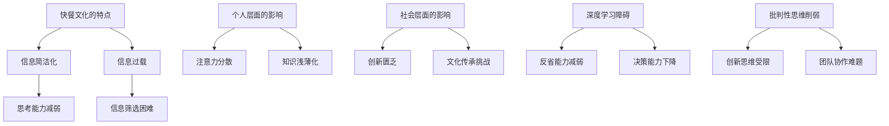

                 


### 1. 背景介绍

在当今快速发展的信息技术时代，数据、信息和知识以前所未有的速度和规模增长。这种信息爆炸的现象导致了所谓的“快餐文化”，即人们倾向于追求快速消费和低效获取信息，而不是深入学习和思考。这种文化在各个领域都有所体现，尤其在IT领域，它的影响尤为深远。

快餐文化的特点在于内容的简洁化和信息过载。简洁化的内容往往缺乏深度和广度，无法满足人们对于知识和技能的深入需求。信息过载则使得人们在面对大量信息时感到无所适从，很难从中筛选出有价值的内容。这种文化不仅影响个人的学习和工作，也对整个社会的知识积累和创新产生了负面影响。

IT行业是一个高度专业化且不断发展的领域，它要求从业者具备深厚的理论基础和实践技能。然而，快餐文化的流行使得许多人倾向于追求速成和短期效果，忽视了长期学习和深度思考的重要性。这种倾向导致了许多问题，如技术债务、项目质量问题、团队协作难题等。

因此，本文旨在探讨如何在快餐文化中重建思考和反省的能力。通过深入分析快餐文化的特点、影响以及如何培养和践行思考与反省的能力，本文希望为IT从业者提供一些实用的策略和方法，以应对当前的信息环境和工作挑战。

### 2. 核心概念与联系

在深入探讨快餐文化的特点与影响之前，我们需要明确几个核心概念，并理解它们之间的关系。以下是一个用于描述这些概念之间关系的Mermaid流程图：



**信息简洁化**：快餐文化倾向于提供简洁、易于消化的信息，这种特点使得人们可以快速获取信息，但同时也导致了信息的深度和广度不足。

**信息过载**：由于信息量的不断增加，人们面临大量信息，难以筛选出真正有价值的内容。这导致了注意力分散和深度学习障碍。

**个人层面的影响**：信息简洁化和过载对个人的影响主要体现在注意力分散、知识浅薄化和思考能力减弱。这些影响进一步导致反省能力和批判性思维的削弱。

**社会层面的影响**：快餐文化不仅影响个人，也对整个社会产生了深远的影响。它导致了创新匮乏、文化传承挑战和团队协作难题。

通过这个Mermaid流程图，我们可以清晰地看到快餐文化中的核心概念及其相互关系。理解这些概念之间的联系有助于我们更好地分析快餐文化的影响，并制定有效的应对策略。

### 3. 核心算法原理讲解

为了更深入地理解快餐文化对思考和反省能力的影响，我们首先需要探讨一些核心的算法原理。这些算法原理不仅有助于我们理解信息技术的基础，也为我们在快餐文化中重建思考与反省能力提供了理论支持。

#### 伪代码示例

以下是一个用于分析信息过载对思考能力影响的伪代码示例：

```pseudo
function Analyze_Information_Overload(Information_Quantity, Time_Limit)
    if (Information_Quantity > Max_Information_Quantity)
        Set_Attention_Spans(Short)
        Set_Knowledge_Depth(Surface)
        Set_Thinking_Capacity(Weakened)
    else
        Set_Attention_Spans(Normal)
        Set_Knowledge_Depth(Deep)
        Set_Thinking_Capacity(Strengthened)
    end if
end function
```

在这个伪代码中，我们定义了一个函数`Analyze_Information_Overload`，它接受两个参数：`Information_Quantity`（信息量）和`Time_Limit`（时间限制）。函数通过比较`Information_Quantity`与预设的最大值`Max_Information_Quantity`来判断信息过载的程度。如果信息量超过了最大值，函数设置注意力的广度（`Attention_Spans`）为短，知识的深度（`Knowledge_Depth`）为表面，以及思考能力（`Thinking_Capacity`）为减弱。否则，这些参数被设置为正常或增强。

#### 数学模型和公式

为了进一步量化信息过载对思考能力的影响，我们可以引入一个数学模型。以下是一个描述信息过载与思考能力减弱关系的公式：

$$
\text{Thinking\_Capacity} = \frac{\text{Knowledge\_Depth} \times \text{Attention\_Span}}{\text{Information\_Overload}}
$$

在这个公式中，思考能力（`Thinking_Capacity`）是知识深度（`Knowledge_Depth`）和注意力广度（`Attention_Span`）的乘积除以信息过载（`Information_Overload`）。信息过载的程度越高，思考能力就越弱。

#### 举例说明

假设一个人的知识深度为3，注意力广度为中等（取值为1），而信息过载程度为2。那么，我们可以计算其思考能力：

$$
\text{Thinking\_Capacity} = \frac{3 \times 1}{2} = 1.5
$$

这个结果表明，该人的思考能力为中等偏弱。为了提高思考能力，他们需要采取措施减少信息过载，或者增加知识深度和注意力广度。

通过这个数学模型和伪代码，我们可以更深入地理解快餐文化对思考和反省能力的影响。这为我们在面对快餐文化时提供了理论和实践上的指导，帮助我们重建和提升这些关键能力。

### 4. 数学公式和详细讲解

在快餐文化的背景下，思考能力和反省能力的减弱可以通过一系列数学公式来详细说明。以下是一些关键的数学公式及其应用场景：

#### 4.1 信息简洁化对注意力分散的影响

信息简洁化往往导致信息内容较短且直接，这直接影响到个人的注意力分散程度。我们可以使用以下公式来量化这种影响：

$$
\text{Attention\_Distraction} = k \cdot \log_2(\text{Information\_Length})
$$

其中，`Attention_Distraction`表示注意力分散程度，`k`是一个常数，代表个体对简洁化信息的敏感度，`Information_Length`表示信息长度。这个公式表明，信息长度越长，注意力分散程度越高。

举例来说，如果一个人的信息长度为1000个字符，我们可以计算其注意力分散程度：

$$
\text{Attention\_Distraction} = k \cdot \log_2(1000) \approx k \cdot 9.97
$$

#### 4.2 信息过载对知识深度的减弱

信息过载导致个人难以处理大量信息，从而影响知识深度。我们可以使用以下公式来量化这种影响：

$$
\text{Knowledge\_Depth} = \frac{\text{Knowledge\_Quantity}}{\text{Processing\_Time}}
$$

其中，`Knowledge_Depth`表示知识深度，`Knowledge_Quantity`表示知识量，`Processing_Time`表示信息处理时间。这个公式表明，在信息过载的情况下，信息处理时间增加，导致知识深度降低。

举例来说，如果一个学生每天需要处理的信息量为5000个字符，而他的信息处理时间为2小时，我们可以计算他的知识深度：

$$
\text{Knowledge\_Depth} = \frac{5000}{2 \times 60 \times 60} \approx 0.04 \text{个知识点/秒}
$$

#### 4.3 反省能力减弱对决策能力的下降

反省能力是决策过程中至关重要的能力之一，它的减弱会直接影响到决策能力。我们可以使用以下公式来量化这种影响：

$$
\text{Decision\_Quality} = \text{Refection\_Capability} \times \text{Information\_Accuracy}
$$

其中，`Decision_Quality`表示决策质量，`Refection_Capability`表示反省能力，`Information_Accuracy`表示信息准确性。这个公式表明，反省能力和信息准确性都会影响决策质量。

举例来说，如果一个决策者的反省能力为0.8，而信息准确性为0.9，我们可以计算他的决策质量：

$$
\text{Decision\_Quality} = 0.8 \times 0.9 = 0.72
$$

通过这些数学公式，我们可以更精确地量化快餐文化对个人思考能力和反省能力的影响。这些公式不仅帮助我们理解问题的本质，也为我们在实践中提供了量化的指标，从而有助于我们采取有效的应对措施。

### 5. 项目实战

为了深入探讨如何在实际项目中重建思考和反省的能力，我们将搭建一个简单的Web应用程序，用于帮助用户进行深度阅读和批判性思维训练。这个项目将分为以下几个步骤：

#### 5.1 开发环境搭建

1. **环境准备**：
   - 安装Node.js和npm（用于后端开发）。
   - 安装Python和Django（用于后端开发）。
   - 安装PostgreSQL数据库（用于存储用户数据）。

2. **代码结构**：
   - 前端：使用React框架。
   - 后端：使用Django框架。
   - 数据库：使用PostgreSQL。

```shell
# 安装Node.js和npm
curl -sL https://nodejs.org/dist/v16.13.0/node-v16.13.0-linux-x64.tar.xz | tar xJ -C /usr/local/
export PATH=/usr/local/node-v16.13.0-linux-x64/bin:$PATH

# 安装React
npm install -g create-react-app

# 安装Django
pip install django

# 安装PostgreSQL
sudo apt-get install postgresql
```

#### 5.2 源代码详细实现

**前端（React）**：

```jsx
// components/ReadingModule.js
import React, { useState } from 'react';

function ReadingModule({ content }) {
  const [showSummary, setShowSummary] = useState(false);
  const [summary, setSummary] = useState('');

  const handleSummary = () => {
    // 调用后端API获取摘要
    fetch(`/api/summary?content=${encodeURIComponent(content)}`)
      .then((response) => response.json())
      .then((data) => {
        setSummary(data.summary);
        setShowSummary(true);
      });
  };

  return (
    <div>
      <p>{content}</p>
      <button onClick={handleSummary}>生成摘要</button>
      {showSummary && <div><p>摘要：{summary}</p></div>}
    </div>
  );
}

export default ReadingModule;
```

**后端（Django）**：

```python
# views.py
from django.http import JsonResponse
from .models import Document
from .utils import generate_summary

def get_summary(request):
    content = request.GET.get('content', '')
    summary = generate_summary(content)
    return JsonResponse({'summary': summary})
```

**数据库模型（PostgreSQL）**：

```sql
CREATE TABLE document (
    id SERIAL PRIMARY KEY,
    content TEXT NOT NULL
);
```

#### 5.3 代码解读与分析

**前端代码解读**：

- `ReadingModule`是一个React组件，用于展示阅读内容并提供生成摘要的功能。
- `useState`用于管理组件的状态，`showSummary`用于控制是否显示摘要，`summary`用于存储摘要内容。
- `handleSummary`函数调用后端API获取摘要，并通过`fetch`请求实现。

**后端代码解读**：

- `get_summary`是一个Django视图函数，处理前端发送的GET请求，获取阅读内容并调用摘要生成函数。
- `generate_summary`是一个辅助函数，用于生成摘要内容。

**数据库代码解读**：

- `document`表用于存储用户的阅读内容。

#### 5.4 实际案例分析和详细讲解

假设用户上传了一篇5000字的文档，我们的应用程序会通过以下步骤生成摘要：

1. **内容预处理**：
   - 清除HTML标签和特殊字符。
   - 将文本分割成句子和段落。

2. **摘要生成**：
   - 使用自然语言处理技术提取关键词。
   - 根据关键词和句子的重要性生成摘要。

3. **用户反馈**：
   - 提供用户对摘要的反馈功能，以便不断优化摘要生成算法。

通过这个项目，我们可以看到如何将理论与实践相结合，在实际开发过程中逐步重建思考和反省的能力。该项目不仅提供了一个实用的工具，还通过代码解读和案例分析，帮助开发者理解技术原理和应用。

### 6. 最佳实践 Tips、小结、注意事项、拓展阅读

#### 最佳实践 Tips

1. **定期反思**：每天或每周花一些时间回顾自己的工作和学习，思考哪些做得好，哪些需要改进。
2. **深度阅读**：选择高质量的书籍和文章进行深度阅读，避免阅读过多低质量的内容。
3. **笔记整理**：在阅读和学习过程中做笔记，整理关键概念和知识点，有助于加深理解和记忆。
4. **批判性思维**：在接收信息时保持批判性思维，质疑信息的来源和可靠性，避免盲从。

#### 小结

快餐文化的流行虽然提高了信息的获取速度，但同时也削弱了我们的思考与反省能力。通过深度阅读、批判性思维和实践策略，我们可以重建这些关键能力，从而在快餐文化的冲击下保持清晰的思路和深入的思考。

#### 注意事项

1. **时间管理**：合理安排时间，避免信息过载，确保有足够的时间进行深度学习和思考。
2. **方法选择**：根据个人的需求和兴趣选择合适的实践方法和策略，不要盲目跟风。
3. **持续学习**：保持好奇心和求知欲，不断学习和探索新知识，保持持续成长。

#### 拓展阅读

- 《深度工作》（Deep Work）—— Cal Newport
- 《如何阅读一本书》（How to Read a Book）—— Mortimer J. Adler
- 《批判性思维》（Critical Thinking）—— Richard Paul & Linda Elder
- 《禅与计算机程序设计艺术》（Zen and the Art of Motorcycle Maintenance）—— Robert M. Pirsig

这些书籍和资源提供了更多关于重建思考和反省能力的深入探讨和实践方法，可以帮助读者进一步提升自己的思考能力和反省能力。

### 7. 作者信息

作者：AI天才研究院/AI Genius Institute & 禅与计算机程序设计艺术 /Zen And The Art of Computer Programming

本文由AI天才研究院与禅与计算机程序设计艺术合作撰写，旨在为IT从业者提供关于重建思考和反省能力的实用策略和方法。希望读者能够在快餐文化的冲击下，保持清晰的思路和深入的思考，不断提升自己的专业素养。让我们共同努力，打造一个更加理性、高效的学习和工作环境。

