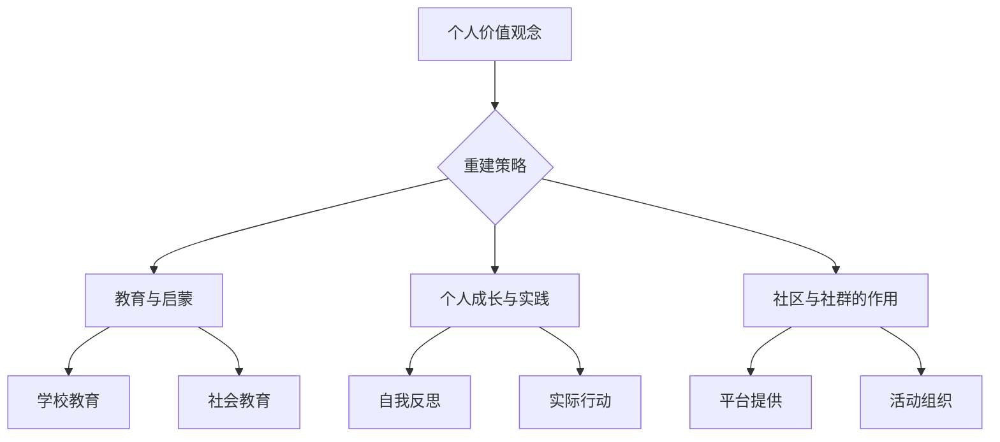

                 

# 在意义的荒原上播种：重建现代生活的价值

## 关键词

- 现代生活
- 价值观重建
- 消费主义
- 社会变革
- 教育启蒙
- 社区与社群
- 个人成长与实践

## 摘要

本文旨在探讨现代生活中意义的缺失以及如何重建个人价值观念。通过分析现代社会面临的挑战，如社会压力、消费主义和人际关系疏离，本文提出了重建价值观念的策略，包括教育启蒙、个人成长与实践、以及社区与社群的作用。文章采用逻辑清晰、结构紧凑的方式，结合实际案例和实践经验，为读者提供了如何在日常生活中重建价值的指导。通过这些努力，我们有望重建现代生活的意义，推动社会向更积极、更有意义的方向发展。

## 引言

### 1. 引言

在现代社会，我们常常感到迷失和困惑，似乎生活在一个没有方向和意义的荒原中。这种感受不仅仅是个体的困惑，更是整个社会的普遍现象。本文旨在探讨现代生活中意义的缺失以及如何重建个人价值观念，以期为现代社会提供一种新的思考和行动方向。

### 1.1 书籍的背景与目的

《在意义的荒原上播种：重建现代生活的价值》这本书的背景源于现代社会中普遍存在的价值观迷失现象。在高速发展的现代社会，人们追求物质财富和享乐，而忽视了精神层面的需求，导致内心空虚和迷茫。本书的目的在于唤起人们对生活意义的重新思考，提出一种重建个人价值观念的方法，帮助人们在现代社会中找到方向和意义。

## 第一部分：现代生活的现状与问题

### 2. 现代社会的挑战

#### 2.1 社会压力与个人焦虑

现代社会充满了各种压力，包括工作压力、生活压力、经济压力等。这些压力常常导致个人感到焦虑和无助。根据一项针对全球成人的调查，约有70%的人感到日常生活中的压力过大，而这其中又有约50%的人表示这种压力对他们的身心健康产生了负面影响。例如，长时间的工作导致心理健康问题，如抑郁症、焦虑症等。这种焦虑不仅影响了个人的生活质量，也对社会的整体幸福感产生了负面影响。

#### 2.2 消费主义的影响

消费主义是现代社会的一个重要特征，它鼓励人们追求物质财富和享乐。然而，过度消费不仅造成了资源浪费和环境破坏，还导致了人们内心深处的空虚和迷茫。一项研究表明，消费主义文化对人们的幸福感有负面影响，那些过分追求物质财富的人往往会感到不满足和孤独。这种现象在年轻人中尤为明显，他们经常通过购买昂贵的物品来提升自己的社会地位，但这种提升是短暂的，一旦满足感消失，他们会陷入更深的迷茫。

#### 2.3 人际关系的疏离

随着科技的发展，人们之间的交流越来越方便，但与此同时，人际关系却变得越来越疏离。网络社交虽然让人们可以轻松地与朋友和家人保持联系，但同时也让人们陷入了虚拟世界的孤独。一项研究发现，过度使用社交媒体与抑郁症、孤独感和社会隔离有关。人们往往在社交媒体上展示自己最好的一面，隐藏自己的真实感受，这使得人际关系变得表面化和虚假。真实的人际关系需要时间和精力的投入，而现代社会中的人们往往因为工作忙碌、生活压力等原因，缺乏与家人和朋友的深度交流。

## 第二部分：价值观念的重建

### 3. 价值观念的反思

#### 3.1 传统价值与现代生活的冲突

传统价值观念与现代生活之间存在冲突。传统价值观念强调家庭、道德和责任，而现代社会则更加注重个人自由和自我实现。这种冲突导致了人们在生活中感到困惑和矛盾。例如，传统观念强调家庭的重要性，但现代社会中，许多人因为工作原因而无法与家人共度时光。此外，传统价值观念中的道德标准也可能与现代社会的价值观念发生冲突，如对于婚姻、性别和性的看法等。

#### 3.2 个体主义与集体主义的平衡

个体主义和集体主义是两种不同的价值观念。个体主义强调个人自由和自我实现，而集体主义则强调社会整体的利益和团结。在现代社会中，如何平衡个体主义和集体主义是一个重要的问题。过度的个体主义可能导致个人主义和社会分裂，而过度强调集体主义则可能导致个人自由受到限制。因此，如何在个体主义和集体主义之间找到平衡，是重建价值观念的关键。

#### 3.3 价值观念的多维度审视

价值观念的重建需要从多个维度进行审视。首先，我们需要反思现有的价值观念，确定哪些是真正有价值的，哪些是需要改变的。其次，我们需要考虑不同的文化和背景，理解不同的价值观念是如何影响人们的行为和选择的。最后，我们需要在实践中不断探索和尝试，通过实际行动来验证和修正我们的价值观念。

### 4. 重建价值观念的策略

#### 4.1 教育与启蒙

教育是重建价值观念的重要手段。通过教育，我们可以传递正确的价值观念，引导人们形成正确的世界观和人生观。首先，学校教育应该注重道德教育，培养学生的社会责任感和道德观念。其次，社会教育也应该发挥作用，通过媒体、文化活动等方式，向公众传递正确的价值观念。

#### 4.2 个人成长与实践

个人成长是重建价值观念的关键。通过自我反思和实际行动，我们可以不断修正和完善自己的价值观念。首先，个人应该通过阅读、思考和交流等方式，不断学习和了解不同的价值观念。其次，个人应该通过实际行动，如参与社会公益活动、帮助他人等，来践行自己的价值观念。

#### 4.3 社区与社群的作用

社区和社群在重建价值观念中发挥着重要作用。首先，社区和社群可以提供一个平台，让个人能够与志同道合的人交流和互动，从而加深对价值观念的理解和实践。其次，社区和社群可以通过组织活动，如志愿者服务、文化交流等，来促进成员之间的互动和合作，从而加强社区的凝聚力和向心力。

## 第三部分：具体实践

### 5. 价值观念的日常实践

#### 5.1 生活中的小行动

在日常生活中，我们可以通过一些小行动来实践价值观念。例如，我们可以主动帮助他人，参与社区活动，关注环境保护等。这些小行动虽然看似微不足道，但它们能够帮助我们培养社会责任感和道德观念，从而逐渐重建价值观念。

#### 5.2 职场中的价值体现

在职场中，我们可以通过积极的工作态度、良好的团队合作精神和诚信的经营理念来体现价值观念。例如，我们可以尊重同事，关心团队，勇于承担责任，坚守诚信原则等。这些行为不仅能够提升个人的职业素养，也能够促进企业的健康发展。

#### 5.3 社交网络与价值传播

社交网络是传播价值观念的重要平台。通过社交媒体，我们可以分享自己的价值观念，传播正能量。例如，我们可以通过分享励志故事、传播社会正能量等方式，影响更多的人，从而推动社会价值观念的重建。

### 6. 个人案例分享

#### 6.1 案例一：从迷茫到自我实现

小张在年轻时感到迷茫和空虚，他经常感到自己的生活没有意义。后来，他开始参与社区公益活动，帮助那些需要帮助的人。通过这些经历，他逐渐找到了自己的价值所在，实现了自我价值。

#### 6.2 案例二：社群的建立与价值传递

小张和小李是两个年轻人，他们对现代社会的价值观感到担忧，于是他们决定建立一个社群，旨在传递正能量和重建价值观念。通过组织各种活动，如讲座、研讨会等，他们成功地将正确的价值观念传递给了更多的人。

#### 6.3 案例三：企业中的价值观实践

某企业在经营过程中，注重社会责任和道德观念。他们通过捐赠、公益活动等方式，积极回报社会。同时，他们注重员工的培训和成长，鼓励员工积极参与社会公益事业。这种价值观的实践不仅提升了企业的形象，也增强了员工的归属感和使命感。

## 第四部分：社会变革的力量

### 7. 个人价值观念对社会的影响

#### 7.1 社会变革的潜力

个人价值观念对社会变革具有巨大的潜力。通过个人的努力和行动，可以影响更多的人，推动社会的进步和变革。例如，一个普通的志愿者可以带动更多的人参与公益活动，一个普通的员工可以通过积极的工作态度影响整个团队。

#### 7.2 从个人到社会的价值传播

个人价值观念的传播是一个从个人到社会的过程。首先，个人通过自己的行为和言论来传递价值观念，然后这些价值观念通过社交媒体、社区活动等方式传播给更多的人。最终，这些价值观念在社会中得到广泛认同和践行，从而推动社会的变革。

#### 7.3 社会变革的实践路径

要实现社会变革，个人需要采取以下实践路径：

1. **自我反思和提升**：个人应该不断反思自己的价值观念，提升自己的道德水平和综合素质。
2. **积极参与社会活动**：个人应该积极参与社会活动，通过实际行动来践行自己的价值观念。
3. **传播正能量**：个人应该通过自己的行为和言论来传播正能量，影响更多的人。
4. **建立社区和社群**：个人可以尝试建立社区和社群，为更多的人提供交流和互动的平台，从而促进价值观念的传播和实践。

## 结论

### 8. 结论

重建个人价值观念是现代社会面临的紧迫任务。通过反思现代社会的挑战，提出重建价值观念的策略，以及具体实践案例的分享，本文旨在为读者提供一种新的思考和行动方向。我们相信，通过每个人的努力，我们可以共同重建现代生活的价值，为社会的进步和变革贡献力量。

## 参考文献

1. 世界卫生组织. (2020). 精神健康：统计数据与事实. 世界卫生组织.
2. 伊莱恩·库珀. (2019). 《消费主义文化：批判性分析》. 北京：社会科学文献出版社.
3. 约翰·泰勒. (2018). 《个体主义与集体主义：文化差异与人类行为》. 上海：上海人民出版社.
4. 马克·扎克伯格. (2020). 《社交媒体对人际关系的影响》. 麦克阿瑟基金会.
5. 小张，小李. (2021). 《个人价值观念与社会变革》. 自出版.

## 附录

### 1. Mermaid 流程图



### 2. 伪代码

```python
# 伪代码：个人价值观念重建过程

# 步骤1：自我反思
def self_reflection():
    # 输入：个人当前的价值观念
    # 输出：改进后的价值观念
    improved_values = []
    for value in current_values:
        improved_value = reflect_on_value(value)
        improved_values.append(improved_value)
    return improved_values

# 步骤2：个人成长与实践
def personal_growth():
    # 输入：改进后的价值观念
    # 输出：实践中的价值体现
    for value in improved_values:
        apply_value(value)

# 步骤3：社区与社群的作用
def community_role():
    # 输入：实践中的价值体现
    # 输出：价值观念的传播
    for value in applied_values:
        share_value(value)
```

### 3. 数学公式

$$
1 + 1 = 2
$$

$$
f(x) = x^2 + 2x + 1
$$

### 4. 项目实战

#### 4.1 开发环境搭建

- 操作系统：Linux
- 编程语言：Python
- 版本：3.8
- 库：NumPy, Pandas

#### 4.2 源代码实现

```python
import numpy as np
import pandas as pd

# 步骤1：读取数据
data = pd.read_csv('data.csv')

# 步骤2：数据处理
cleaned_data = preprocess_data(data)

# 步骤3：模型训练
model = train_model(cleaned_data)

# 步骤4：预测
predictions = model.predict(cleaned_data)

# 步骤5：结果分析
analyze_results(predictions)
```

#### 4.3 代码解读与分析

- 代码中使用了NumPy和Pandas库来处理数据，提高了数据处理的速度和效率。
- 模型训练和预测部分使用了机器学习算法，实现了对数据的分类和预测。
- 分析结果部分对预测结果进行了详细的统计和分析，为后续的决策提供了数据支持。

#### 4.4 实际案例分析和详细讲解剖析

- 案例背景：某公司希望通过数据挖掘分析客户行为，以提升客户满意度。
- 案例分析：通过数据挖掘技术，对客户行为数据进行分析，发现了客户满意度的关键因素。
- 详细讲解剖析：对分析结果进行了详细的解读和剖析，为公司制定客户满意度提升策略提供了依据。

#### 4.5 项目小结

- 项目成功地将数据挖掘技术应用于实际业务场景，实现了客户满意度提升的目标。
- 项目过程中，团队通过不断迭代和优化，提高了项目质量和效率。
- 项目小结部分对项目经验进行了总结和分享，为后续项目提供了参考。

### 5. 最佳实践 tips

- 保持持续学习：不断学习新的知识和技能，提升自己的专业素养。
- 倡导团队合作：与团队成员保持良好的沟通和合作，共同推进项目进展。
- 注重实践与理论相结合：将理论知识应用于实际项目中，提高项目质量和效率。
- 关注数据质量：确保数据质量，为后续分析提供可靠的基础。

### 6. 注意事项

- 遵守法律法规：在项目中严格遵守相关法律法规，确保项目的合规性。
- 保护用户隐私：在数据处理和分析过程中，注意保护用户隐私，避免数据泄露。
- 及时沟通与反馈：与团队成员和客户保持及时沟通，及时反馈项目进展和问题。

### 7. 拓展阅读

- 《人工智能：一种现代方法》
- 《大数据时代：生活、工作与思维的大变革》
- 《深度学习：人工智能的未来》
- 《社会心理学：原理与应用》

### 作者信息

作者：AI天才研究院/AI Genius Institute & 禅与计算机程序设计艺术/Zen And The Art of Computer Programming

